# 第十五章。数据工程

数据科学可能是 21 世纪最性感的工作，但这个领域正在迅速演变成不同的职位头衔。数据科学家已经过于粗糙地描述了一系列任务。截至 2020 年，两个可以支付相同或更高工资的工作是数据工程师和机器学习工程师。

更令人惊讶的是，支持传统数据科学家所需的大量数据工程师角色。大约需要三到五名数据工程师才能支持一个数据科学家。

发生了什么？让我们从另一个角度来看待。假设我们正在为一家报纸写头条新闻，想要说一些吸引眼球的事情。我们可以说，“CEO 是富人最性感的工作。”CEO 很少，就像 NBA 明星很少，像是靠演艺为生的职业演员很少一样。每个 CEO 背后，有多少人在努力使他们成功？这个陈述与内容空洞、毫无意义，就像“水是湿的”一样。

这个陈述并不是说你不能以数据科学家的身份谋生；这更多是对这种说法背后逻辑的批评。在数据技能方面存在巨大的需求，从 DevOps 到机器学习再到沟通，都有涉及。数据科学家这个术语是模糊的。它是一种工作还是一种行为？在某种程度上，它很像 DevOps 这个词。DevOps 是一种工作，还是一种行为？

在查看职位发布数据和薪资数据时，似乎市场正在表明对数据工程和机器学习工程实际角色存在显著需求。这是因为这些角色执行可识别的任务。数据工程师的任务可能是在云中创建收集批处理和流处理数据的管道，然后创建 API 以访问该数据并安排这些作业。这项工作不是模糊的任务。它要么有效，要么无效。

同样，机器学习工程师建立机器学习模型并以可维护的方式部署它们。这个工作也不含糊。一个工程师可以做数据工程或机器学习工程，但仍然表现出与数据科学和 DevOps 相关的行为。现在是参与数据领域的激动人心时刻，因为有一些重要的机会可以建立复杂而强大的数据管道，这些管道供给其他复杂而强大的预测系统。有一句话说，“你永远不能太富有或太瘦。”同样，对于数据来说，你永远不能拥有太多的 DevOps 或数据科学技能。让我们深入一些 DevOps 风格的数据工程思想。

# 小数据

工具包是一个令人兴奋的概念。如果你叫水管工来你家，他们会带着工具，帮助他们比你更有效地完成任务。如果你雇用木工在你家建造东西，他们也会有一套独特的工具，帮助他们在比你更短的时间内完成任务。工具对专业人士来说至关重要，DevOps 也不例外。

在这一节中，数据工程的工具概述了它们自己。这些工具包括读写文件、使用`pickle`、使用`JSON`、写入和读取`YAML`文件等小数据任务。掌握这些格式对于成为能够处理任何任务并将其转化为脚本的自动化人员是至关重要的。后面还涵盖了大数据任务的工具。它讨论了与小数据使用不同的工具明显不同的工具。

什么是大数据，什么是小数据？一个简单的区分方法是笔记本电脑测试。它在你的笔记本上能运行吗？如果不能，那么它就是大数据。一个很好的例子是 Pandas。Pandas 需要的 RAM 量是数据集的 5 到 10 倍。如果你有一个 2 GB 的文件，并且你正在使用 Pandas，很可能你的笔记本无法运行。

## 处理小数据文件

如果 Python 有一个单一的定义特性，那将是语言中效率的不懈追求。一个典型的 Python 程序员希望编写足够的代码来完成任务，但在代码变得难以理解或简洁时停止。此外，一个典型的 Python 程序员也不愿意编写样板代码。这种环境促使有用模式的持续演变。

使用`with`语句来读写文件的一个活跃模式的例子。`with`语句处理了烦人的样板部分，即在工作完成后关闭文件句柄。`with`语句还在 Python 语言的其他部分中使用，使烦琐的任务不那么令人讨厌。

# 写一个文件

这个例子展示了使用`with`语句写入文件时，执行代码块后会自动关闭文件句柄。这种语法可以防止因为意外未关闭句柄而导致的 bug：

```py
with open("containers.txt", "w") as file_to_write:
  file_to_write.write("Pod/n")
  file_to_write.write("Service/n")
  file_to_write.write("Volume/n")
  file_to_write.write("Namespace/n")
```

文件的输出如下所示：

```py
cat containers.txt

Pod
Service
Volume
Namespace
```

# 读一个文件

`with`上下文也是推荐的读取文件的方式。注意，使用`readlines()`方法使用换行符返回一个惰性评估的迭代器：

```py
with open("containers.txt") as file_to_read:
  lines = file_to_read.readlines()
  print(lines)
```

输出：

```py
['Pod\n', 'Service\n', 'Volume\n', 'Namespace\n']
```

在实践中，这意味着你可以通过使用生成器表达式处理大型日志文件，而不必担心消耗机器上的所有内存。

# 生成器管道用于读取和处理行

这段代码是一个生成器函数，打开一个文件并返回一个生成器：

```py
def process_file_lazily():
  """Uses generator to lazily process file"""

  with open("containers.txt") as file_to_read:
    for line in file_to_read.readlines():
      yield line
```

接下来，这个生成器被用来创建一个管道，逐行执行操作。在这个例子中，将行转换为小写字符串。这里可以链式连接许多其他操作，而且非常高效，因为只使用了处理一行数据所需的内存：

```py
# Create generator object
pipeline = process_file_lazily()
# convert to lowercase
lowercase = (line.lower() for line in pipeline)
# print first processed line
print(next(lowercase))
```

这是管道的输出：

```py
pod
```

在实践中，这意味着那些因为太大而实际上是无限的文件，如果代码能够在找到条件时退出，则仍然可以处理。例如，也许你需要在数千兆字节的日志数据中找到一个客户 ID。生成器管道可以寻找这个客户 ID，然后在第一次出现时退出处理。在大数据的世界中，这不再是一个理论性的问题。

# 使用 YAML

YAML 正在成为与 DevOps 相关的配置文件的新兴标准。它是一种人类可读的数据序列化格式，是 JSON 的超集。它代表“YAML 不是一种标记语言。” 你经常会在像 [AWS CodePipeline](https://oreil.ly/WZnIl)，[CircleCI](https://oreil.ly/0r8cK) 这样的构建系统，或者像 [Google App Engine](https://oreil.ly/ny_TD) 这样的 PaaS 提供中看到 YAML。

YAML 如此经常被使用是有原因的。需要一种配置语言，允许在与高度自动化的系统交互时进行快速迭代。无论是非程序员还是程序员都可以直观地了解如何编辑这些文件。以下是一个例子：

```py
import yaml

kubernetes_components = {
    "Pod": "Basic building block of Kubernetes.",
    "Service": "An abstraction for dealing with Pods.",
    "Volume": "A directory accessible to containers in a Pod.",
    "Namespaces": "A way to divide cluster resources between users."
}

with open("kubernetes_info.yaml", "w") as yaml_to_write:
  yaml.safe_dump(kubernetes_components, yaml_to_write, default_flow_style=False)
```

写入磁盘的输出如下所示：

```py
cat kubernetes_info.yaml

Namespaces: A way to divide cluster resources between users.
Pod: Basic building block of Kubernetes.
Service: An abstraction for dealing with Pods.
Volume: A directory accessible to containers in a Pod.
```

结论是，它使得将 Python 数据结构序列化为易于编辑和迭代的格式变得非常简单。将此文件读回的代码仅需两行。

```py
import yaml

with open("kubernetes_info.yaml", "rb") as yaml_to_read:
  result = yaml.safe_load(yaml_to_read)
```

然后可以对输出进行漂亮的打印：

```py
import pprint
pp = pprint.PrettyPrinter(indent=4)
pp.pprint(result)
{   'Namespaces': 'A way to divide cluster resources between users.',
    'Pod': 'Basic building block of Kubernetes.',
    'Service': 'An abstraction for dealing with Pods.',
    'Volume': 'A directory accessible to containers in a Pod.'}
```

# 大数据

数据的增长速度比计算机处理能力的增长速度更快。更有趣的是，摩尔定律认为计算机的速度和能力每两年可以翻一番，但根据加州大学伯克利分校的 David Patterson 博士的说法，这种增长在 2015 年左右就停止适用了。CPU 速度现在每年只增长约 3%。

处理大数据的新方法是必需的。一些新方法包括使用像 GPU、张量处理单元（TPU）等 ASICs，以及云供应商提供的 AI 和数据平台。在芯片级别上，这意味着 GPU 可能是复杂 IT 过程的理想目标，而不是 CPU。通常，这个 GPU 与能够提供分布式存储机制的系统配对，该机制允许分布式计算和分布式磁盘 I/O。一个很好的例子是 Apache Spark，Amazon SageMaker 或 Google AI 平台。它们都可以利用 ASICs（GPU、TPU 等），以及分布式存储和管理系统。另一个更低级别的例子是 Amazon Spot 实例深度学习 AMIs，配有 Amazon 弹性文件系统（EFS）挂载点。

对于一个 DevOps 专业人员，这意味着几件事情。首先，这意味着在将软件交付到这些系统时需要特别注意。例如，目标平台是否有正确的 GPU 驱动程序？你是通过容器部署吗？这个系统是否将使用分布式 GPU 处理？数据主要是批处理还是流处理？提前考虑这些问题可以确保选择正确的架构。

像 AI、大数据、云或数据科学家这样的流行词存在一个问题，即它们对不同的人有不同的含义。以数据科学家为例。在一家公司，它可能意味着为销售团队生成业务智能仪表板的人，而在另一家公司，它可能意味着正在开发自动驾驶汽车软件的人。大数据也存在类似的语境问题；它可以根据你遇到的人的不同而有许多不同的含义。这里有一个考虑的定义。你是否需要不同的软件包来处理你笔记本电脑上的数据和生产环境中的数据？

一个很好的“小数据”工具的典范是 Pandas 包。根据 Pandas 包的作者，它可能需要比使用的文件大小多 5 到 10 倍的 RAM。实际上，如果你的笔记本电脑有 16 GB 的 RAM，并且打开了一个 2 GB 的 CSV 文件，那么现在就变成了一个大数据问题，因为你的笔记本电脑可能没有足够的 RAM（20 GB）来处理这个文件。相反，你可能需要重新思考如何处理这个问题。也许你可以打开数据的样本，或者截断数据以首先解决问题。

这里有一个确切问题及其解决方法的例子。假设你正在支持数据科学家，他们因为使用了对于 Pandas 来说太大的文件而经常遇到内存不足的错误。其中一个例子是来自 Kaggle 的 Open Food Facts[数据集](https://oreil.ly/w-tmA)。解压后，数据集超过 1 GB。这个问题正好符合 Pandas 可能难以处理的情况。你可以做的一件事是使用 Unix 的`shuf`命令创建一个打乱的样本：

```py
time shuf -n 100000 en.openfoodfacts.org.products.tsv\
    > 10k.sample.en.openfoodfacts.org.products.tsv
    1.89s user 0.80s system 97% cpu 2.748 total
```

不到两秒钟，文件就可以被削减到一个可以处理的大小。这种方法比简单地使用头或尾部更可取，因为样本是随机选择的。这对数据科学工作流程非常重要。此外，你可以检查文件的行以先了解你要处理的内容：

```py
wc -l en.openfoodfacts.org.products.tsv
  356002 en.openfoodfacts.org.products.tsv
```

源文件大约有 350,000 行，因此获取 100,000 个打乱的行大约占据了数据的三分之一。这个任务可以通过查看转换后的文件来确认。它显示 272 MB，大约是原始 1 GB 文件大小的三分之一：

```py
du -sh 10k.sample.en.openfoodfacts.org.products.tsv
272M    10k.sample.en.openfoodfacts.org.products.tsv
```

这种大小对 Pandas 来说更容易管理，并且这个过程可以转化为一个自动化工作流程，为大数据源创建随机样本文件。这种类型的过程只是大数据要求的许多特定工作流程之一。

另一个关于大数据的定义来自麦肯锡，他们在 2011 年将大数据定义为“数据集，其大小超出典型数据库软件工具捕捉、存储、管理和分析的能力”。这个定义也是合理的，稍作修改，它不仅仅是数据库软件工具，而是任何接触数据的工具。当适用于笔记本电脑的工具（如 Pandas、Python、MySQL、深度学习/机器学习、Bash 等）因数据的规模或速度（变化率）而无法传统方式运行时，它现在是一个大数据问题。大数据问题需要专门的工具，下一节将深入探讨这个需求。

# 大数据工具、组件和平台

另一种讨论大数据的方式是将其分解为工具和平台。图 15-1 显示了典型的大数据架构生命周期。

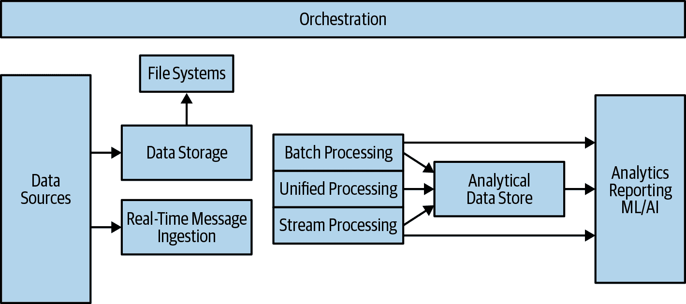

###### 图 15-1\. 大数据架构

让我们讨论几个关键组件。

## 数据来源

一些熟悉的大数据来源包括社交网络和数字交易。随着人们将更多的对话和业务交易迁移到在线平台，数据爆炸性增长。此外，诸如平板电脑、手机和笔记本电脑等移动技术记录音频和视频，进一步创造了数据源。

其他数据来源包括物联网（IoT），包括传感器、轻量级芯片和设备。所有这些导致数据不可阻挡地增加，需要在某处进行存储。涉及数据来源的工具可能从物联网客户端/服务器系统（如 AWS IoT Greengrass）、到对象存储系统（如 Amazon S3 或 Google Cloud Storage）等广泛应用。

## 文件系统

文件系统在计算中发挥了重要作用。它们的实现不断演变。在处理大数据时，一个问题是有足够的磁盘 I/O 来处理分布式操作。

处理这一问题的现代工具之一是 Hadoop 分布式文件系统（HDFS）。它通过将许多服务器集群在一起来工作，允许聚合的 CPU、磁盘 I/O 和存储。实际上，这使得 HDFS 成为处理大数据的基础技术。它可以迁移大量数据或文件系统用于分布式计算作业。它还是 Spark 的支柱，可以进行流式和批量机器学习。

其他类型的文件系统包括对象存储文件系统，如 Amazon S3 文件系统和 Google Cloud 平台存储。它们允许将大文件以分布式和高可用的方式存储，或者更精确地说是 99.999999999%的可靠性。有 Python API 和命令行工具可用于与这些文件系统通信，实现简单的自动化。这些云 API 将在第十章中详细介绍。

最后，另一种需要注意的文件系统是传统的网络文件系统，或者 NFS，作为托管云服务提供。Amazon Elastic File System（Amazon EFS）是这方面的一个很好的例子。对于 DevOps 专业人员来说，一个高可用和弹性的 NFS 文件系统可以是一个非常多才多艺的工具，特别是与容器技术结合使用。图 15-2 展示了在容器中挂载 EFS 的一个示例。

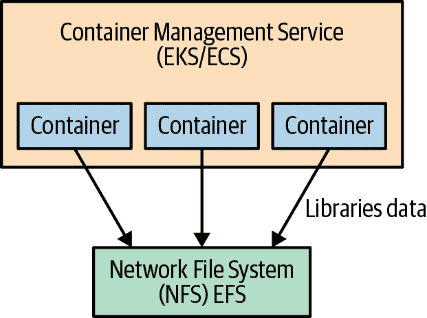

###### 图 15-2\. 将 EFS 挂载在容器中

一个强大的自动化工作流程是通过构建系统（例如 AWS CodePipeline 或 Google Cloud Build）通过编程方式创建 Docker 容器。然后，这些容器被注册到云容器注册表，例如 Amazon ECR。接下来，一个容器管理系统，比如 Kubernetes，会生成挂载 NFS 的容器。这样一来，既可以享受到产生迅速的不可变容器镜像的强大功能，又可以访问到集中的源代码库和数据。这种类型的工作流程对于希望优化机器学习操作的组织来说可能是理想的。

## 数据存储

最终，数据需要存放在某个地方，这带来了一些令人兴奋的机会和挑战。一个新兴的趋势是利用数据湖的概念。你为什么关心数据湖？数据湖允许在存储的同一位置进行数据处理。因此，许多数据湖需要具有无限存储和提供无限计算（即在云上）。Amazon S3 通常是数据湖的常见选择。

以这种方式构建的数据湖也可以被机器学习流水线利用，该流水线可能依赖于存储在湖中的训练数据，以及训练模型。然后，可以始终对训练模型进行 A/B 测试，以确保最新模型正在改善生产预测（推断）系统，如图 15-3 所示。

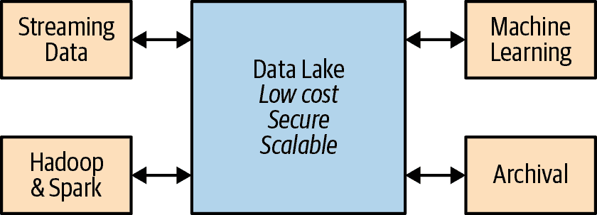

###### 图 15-3\. 数据湖

其他形式的存储对于传统软件开发人员来说可能非常熟悉。这些存储系统包括关系型数据库、键/值数据库、像 Elasticsearch 这样的搜索引擎以及图数据库。在大数据架构中，每种类型的存储系统可能会发挥更具体的作用。在小规模系统中，关系型数据库可能是一个万能工具，但在大数据架构中，对于存储系统的不匹配容忍度较小。

在存储选择中出现的一个极好的不匹配例子是使用关系数据库作为搜索引擎，通过启用全文搜索功能，而不是使用专门的解决方案，比如 Elasticsearch。Elasticsearch 旨在创建可扩展的搜索解决方案，而关系数据库旨在提供引用完整性和事务。亚马逊的 CTO Werner Vogel 非常明确地指出“一个数据库规模并不适合所有人”。这个问题在图 15-4 中有所说明，该图显示每种类型的数据库都有特定的用途。

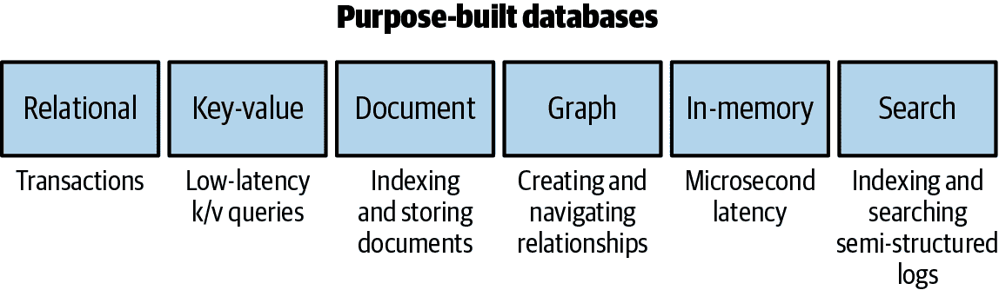

###### 图 15-4\. Amazon 数据库

选择正确的存储解决方案，包括使用哪种组合的数据库，对于任何类型的数据架构师来说都是一项关键技能，以确保系统以最佳效率运行。在考虑设计一个完全自动化和高效的系统时，应该考虑维护成本。如果滥用特定的技术选择，比如使用关系数据库作为高可用消息队列，那么维护成本可能会激增，从而带来更多的自动化工作。因此，另一个需要考虑的组成部分是维护解决方案所需的自动化工作量。

# 实时流式传输摄取

实时流式数据是一种特别棘手的数据类型。流本身增加了处理数据的复杂性，可能需要将流路由到系统的另一部分，该部分意图以流式处理数据。一个云端流式摄取解决方案的示例是 Amazon Kinesis Data Firehose。见图 15-5。

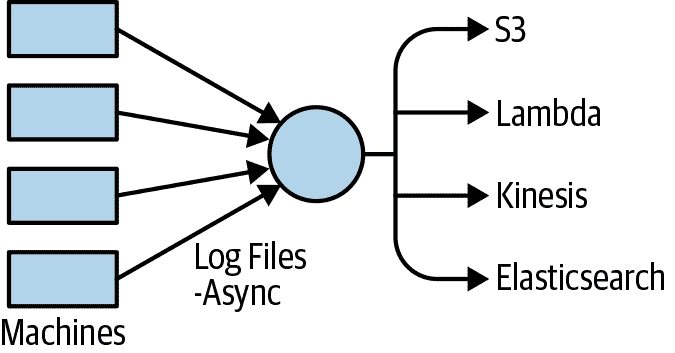

###### 图 15-5\. Kinesis 日志文件

下面是一个执行此操作的代码示例。请注意，Python 的`asyncio`模块允许高度并发的单线程网络操作。节点可以在作业农场中发出这些操作，这可能是指标或错误日志：

```py
import asyncio

def send_async_firehose_events(count=100):
    """Async sends events to firehose"""

    start = time.time()
    client = firehose_client()
    extra_msg = {"aws_service": "firehose"}
    loop = asyncio.get_event_loop()
    tasks = []
    LOG.info(f"sending aysnc events TOTAL {count}",extra=extra_msg)
    num = 0
    for _ in range(count):
        tasks.append(asyncio.ensure_future(put_record(gen_uuid_events(),
                                                      client)))
        LOG.info(f"sending aysnc events: COUNT {num}/{count}")
        num +=1
    loop.run_until_complete(asyncio.wait(tasks))
    loop.close()
    end = time.time()
    LOG.info("Total time: {}".format(end - start))
```

Kinesis Data Firehose 通过接受捕获的数据并将其持续路由到多个目的地来工作：Amazon S3、Amazon Redshift、Amazon Elasticsearch 服务，或者像 Splunk 这样的第三方服务。使用类似 Kinesis 这样的托管服务的一个开源替代方案是使用 Apache Kafka。Apache Kafka 具有类似的原则，它作为发布/订阅架构工作。

# 案例研究：构建自制数据管道

在诺亚（Noah）早期担任 CTO 兼总经理的初创企业的 2000 年初期，出现了一个问题，即如何构建公司的第一个机器学习管道和数据管道。下图显示了 Jenkins 数据管道的草图（图 15-6）。

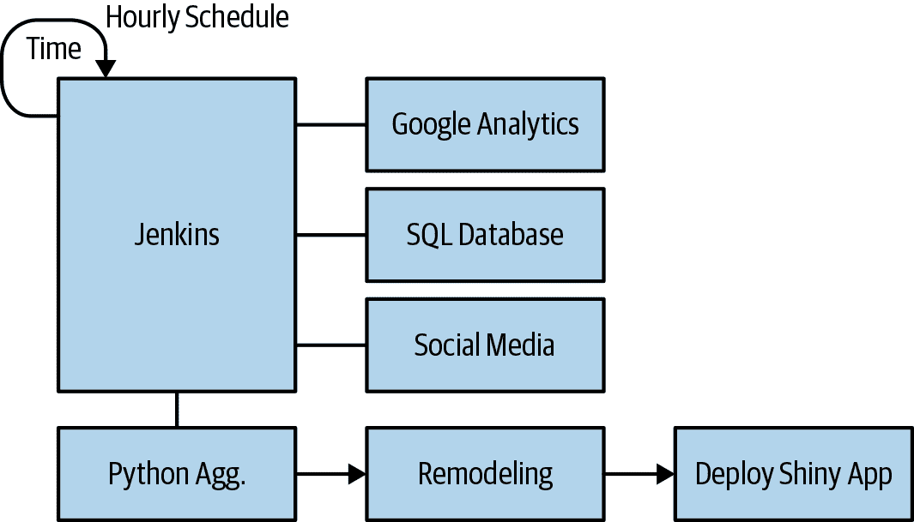

###### 图 15-6\. Jenkins 数据管道

数据管道的输入是任何需要用于业务分析或机器学习预测的数据源。这些来源包括关系数据库、Google Analytics 和社交媒体指标等等。收集作业每小时运行一次，并生成 CSV 文件，这些文件可以通过 Apache web 服务在内部使用。这个解决方案是一个引人注目且简单的过程。

这些作业本身是 Jenkins 作业，是运行的 Python 脚本。如果需要更改某些内容，更改特定作业的 Python 脚本相当简单。这个系统的另一个好处是它很容易调试。如果作业失败了，作业就会显示为失败，查看作业的输出并查看发生了什么是很简单的。

管道的最终阶段然后创建了机器学习预测和分析仪表板，通过基于 `R` 的 Shiny 应用程序提供仪表板服务。这种方法的简单性是这种架构的最有影响力的因素，而且作为一个额外的奖励，它利用了现有的 DevOps 技能。

# 无服务器数据工程

另一个新兴的模式是无服务器数据工程。图 15-7 是一个无服务器数据管道的高层架构图。

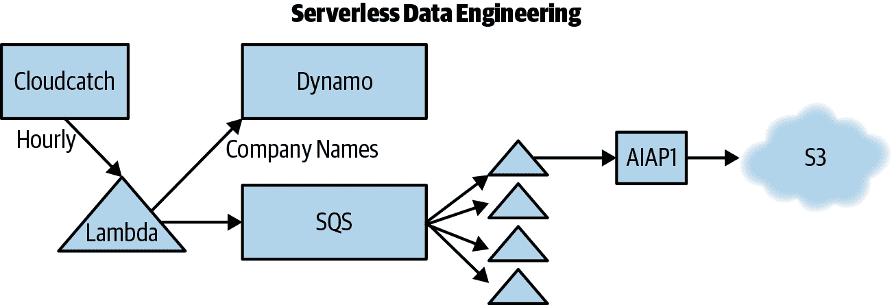

###### 图 15-7\. 无服务器数据管道

接下来，让我们看看定时 lambda 做了什么。

## 使用 AWS Lambda 与 CloudWatch 事件

你可以在 AWS Lambda 控制台上创建一个 CloudWatch 计时器来调用 lambda，并设置触发器，如图 15-8 所示。

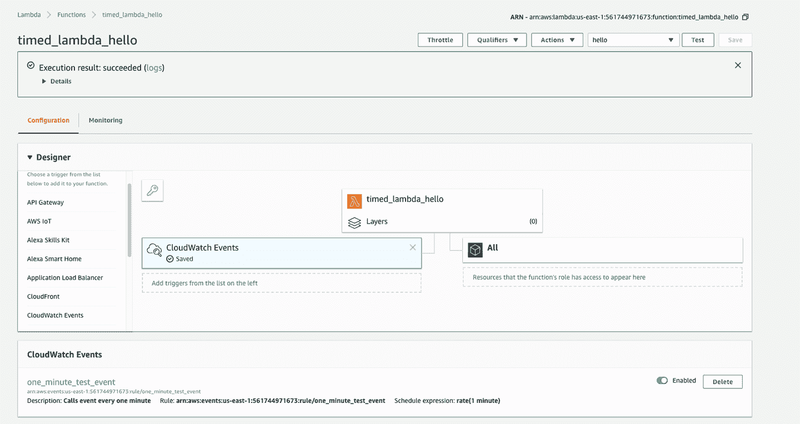

###### 图 15-8\. CloudWatch Lambda 计时器

## 使用 Amazon CloudWatch Logging 与 AWS Lambda

使用 CloudWatch 日志记录是 Lambda 开发的一个重要步骤。图 15-9 是 CloudWatch 事件日志的一个示例。

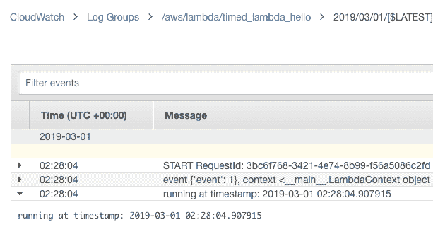

###### 图 15-9\. CloudWatch 事件日志

## 使用 AWS Lambda 填充 Amazon Simple Queue Service

接下来，您希望在 AWS Cloud9 中本地执行以下操作：

1.  使用 Serverless Wizard 创建一个新的 Lambda。

1.  `cd` 进入 lambda 并在上一级安装包。

```py
pip3 install boto3 --target ../
pip3 install python-json-logger --target ../
```

接下来，你可以在本地测试并部署这段代码：

```py
'''
Dynamo to SQS
'''

import boto3
import json
import sys
import os

DYNAMODB = boto3.resource('dynamodb')
TABLE = "fang"
QUEUE = "producer"
SQS = boto3.client("sqs")

#SETUP LOGGING
import logging
from pythonjsonlogger import jsonlogger

LOG = logging.getLogger()
LOG.setLevel(logging.INFO)
logHandler = logging.StreamHandler()
formatter = jsonlogger.JsonFormatter()
logHandler.setFormatter(formatter)
LOG.addHandler(logHandler)

def scan_table(table):
    '''Scans table and return results'''

    LOG.info(f"Scanning Table {table}")
    producer_table = DYNAMODB.Table(table)
    response = producer_table.scan()
    items = response['Items']
    LOG.info(f"Found {len(items)} Items")
    return items

def send_sqs_msg(msg, queue_name, delay=0):
    '''Send SQS Message

 Expects an SQS queue_name and msg in a dictionary format.
 Returns a response dictionary.
 '''

    queue_url = SQS.get_queue_url(QueueName=queue_name)["QueueUrl"]
    queue_send_log_msg = "Send message to queue url: %s, with body: %s" %\
        (queue_url, msg)
    LOG.info(queue_send_log_msg)
    json_msg = json.dumps(msg)
    response = SQS.send_message(
        QueueUrl=queue_url,
        MessageBody=json_msg,
        DelaySeconds=delay)
    queue_send_log_msg_resp = "Message Response: %s for queue url: %s" %\
        (response, queue_url)
    LOG.info(queue_send_log_msg_resp)
    return response

def send_emissions(table, queue_name):
    '''Send Emissions'''

    items = scan_table(table=table)
    for item in items:
        LOG.info(f"Sending item {item} to queue: {queue_name}")
        response = send_sqs_msg(item, queue_name=queue_name)
        LOG.debug(response)

def lambda_handler(event, context):
    '''
 Lambda entrypoint
 '''

    extra_logging = {"table": TABLE, "queue": QUEUE}
    LOG.info(f"event {event}, context {context}", extra=extra_logging)
    send_emissions(table=TABLE, queue_name=QUEUE)

```

```py

This code does the following:

1.  Grabs company names from Amazon DynamoDB.

2.  Puts the names into Amazon SQS.

To test it, you can do a local test in Cloud9 (Figure 15-10).

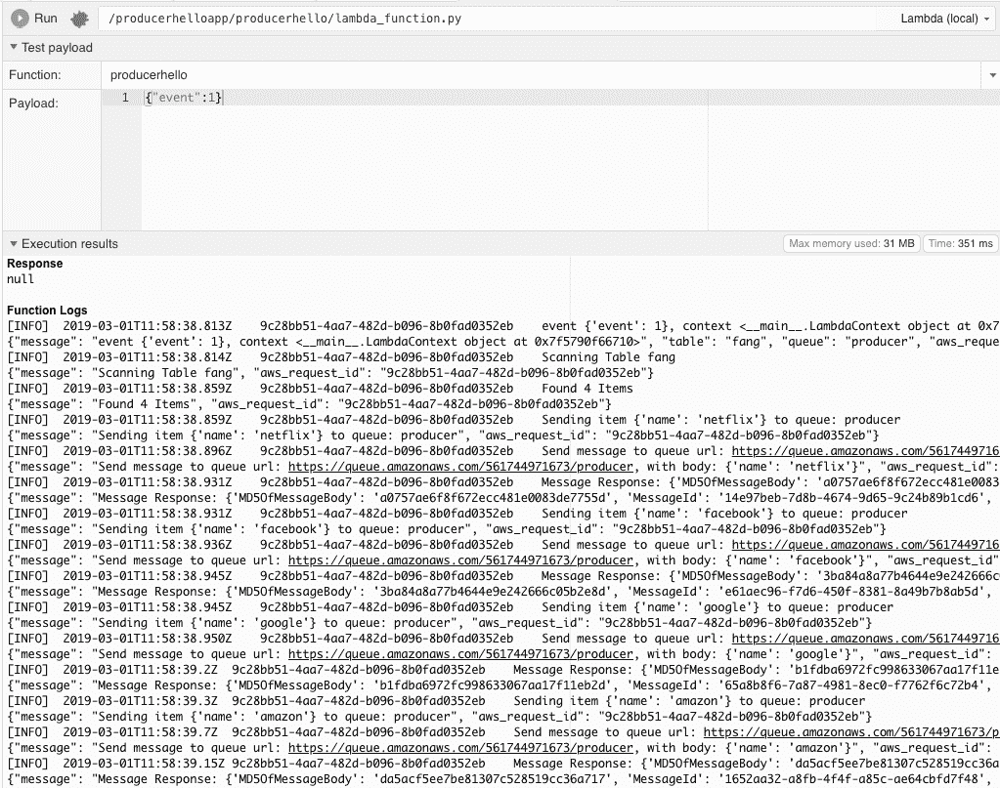

###### Figure 15-10\. Local test in Cloud9

Next you can verify messages in SQS, as shown in Figure 15-11.

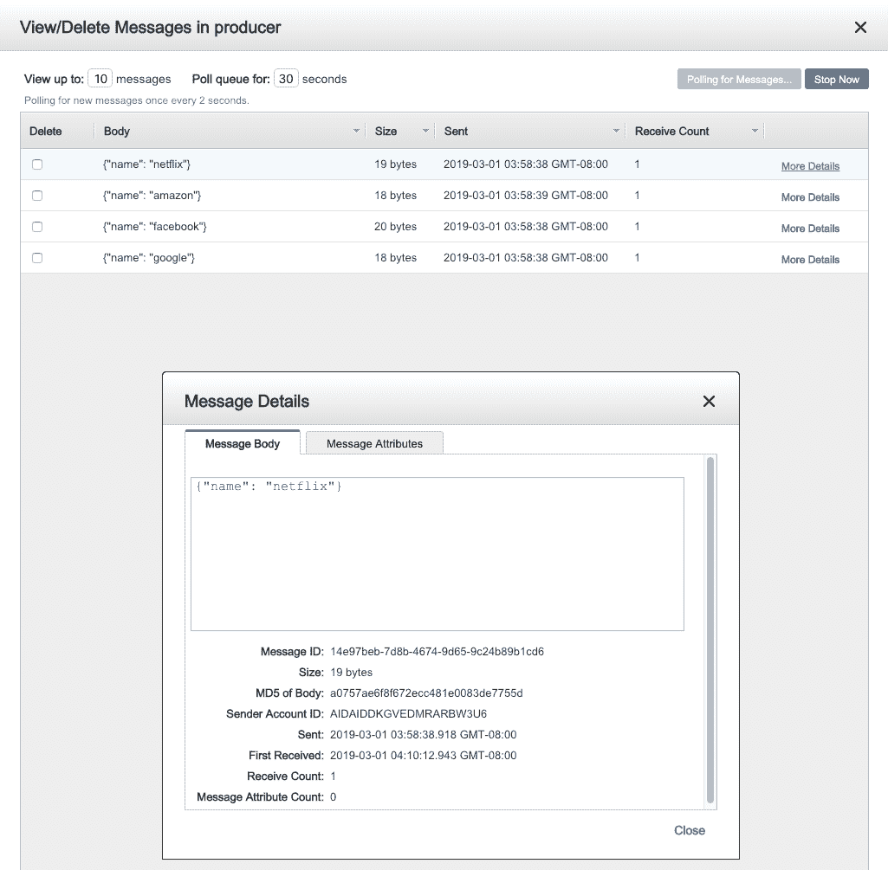

###### Figure 15-11\. SQS verification

Don’t forget to set the correct IAM role! You need to assign the lambda an IAM role that can write messages to SQS, as shown in Figure 15-12.

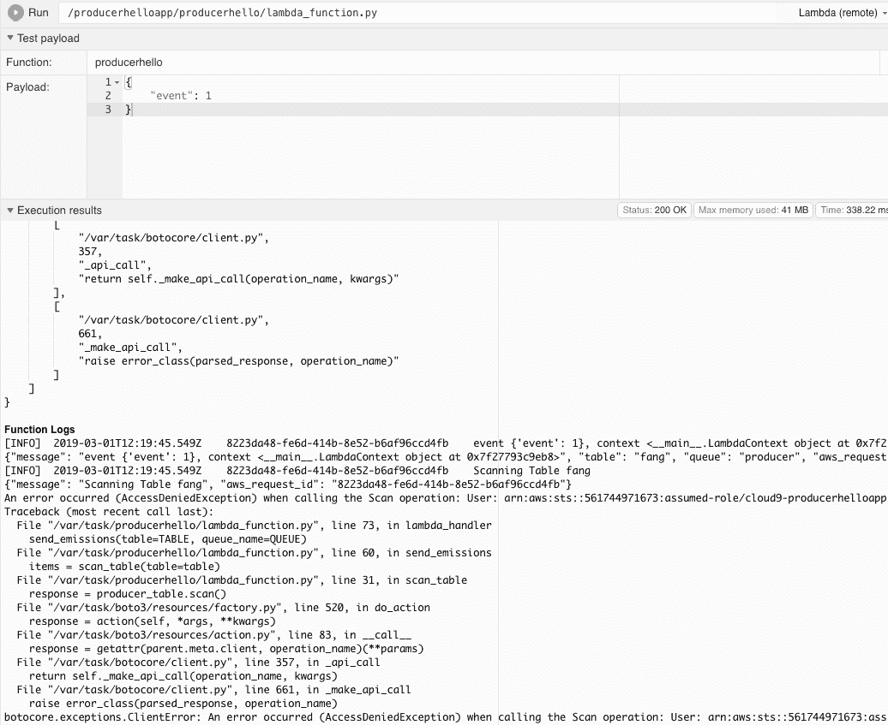

###### Figure 15-12\. Permission error

## Wiring Up CloudWatch Event Trigger

The final step to enable CloudWatch trigger does the following: enable timed execution of producer, and verify that messages flow into SQS, as shown in Figure 15-13.

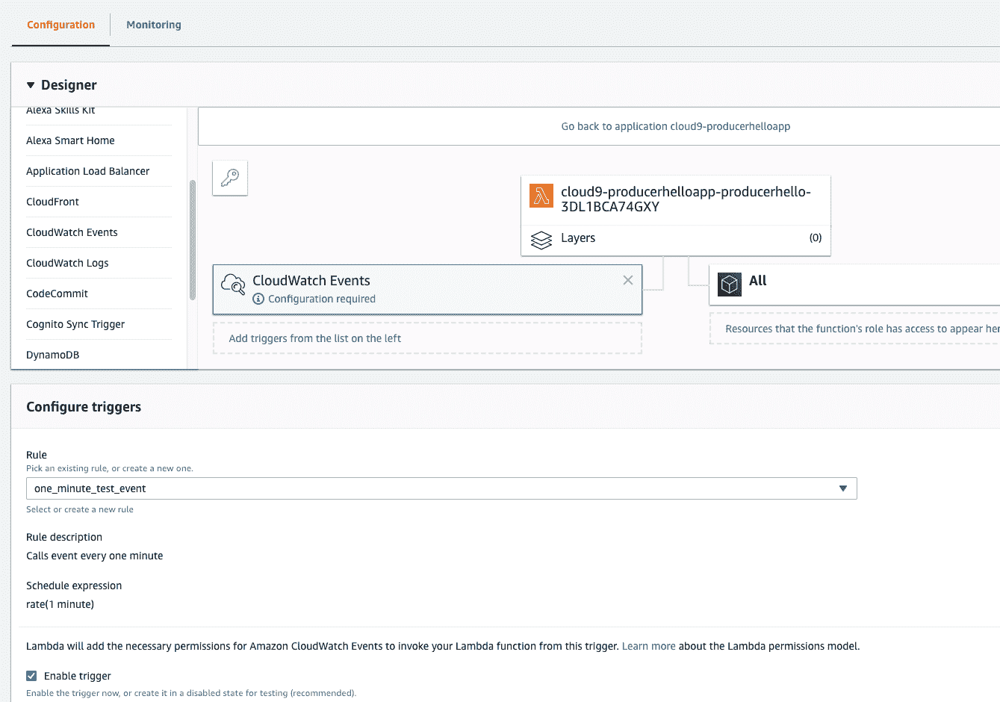

###### Figure 15-13\. Configure timer

You can now see messages in the SQS queue (Figure 15-14).

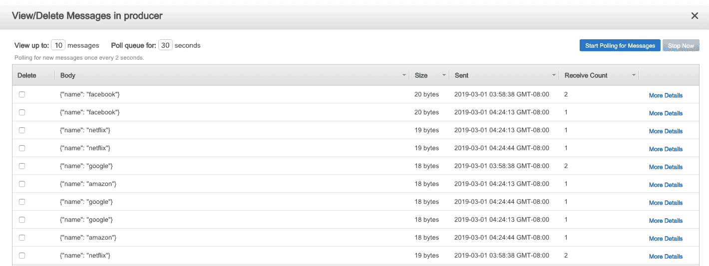

###### Figure 15-14\. SQS queue

## Creating Event-Driven Lambdas

With the producer lambda out of the way, next up is to create an event-driven lambda that fires asynchronously upon every message in SQS (the consumer). The Lambda function can now fire in response to every SQS message (Figure 15-15).

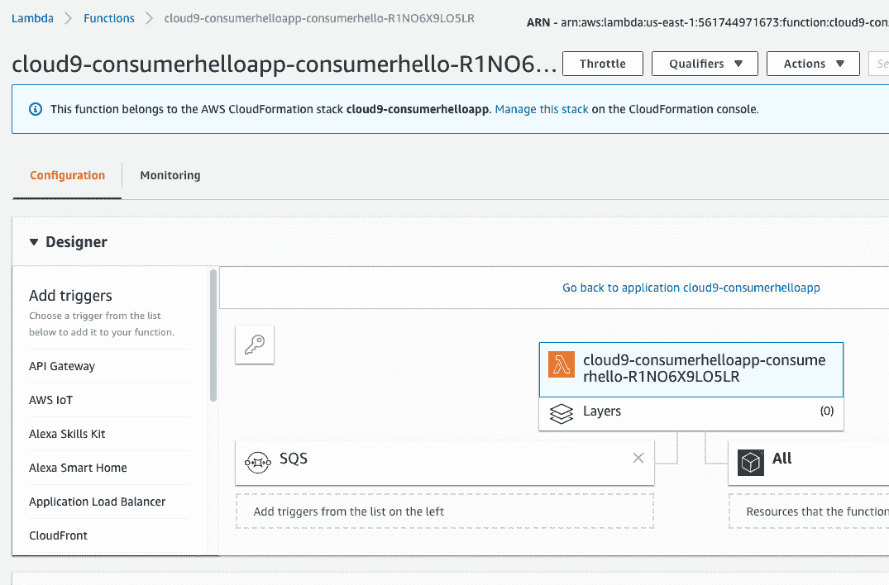

###### Figure 15-15\. Fire on SQS event

## Reading Amazon SQS Events from AWS Lambda

The only task left is to write the code to consume the messages from SQS, process them using our API, and then write the results to S3:

```

import json

import boto3

import botocore

#import pandas as pd

import pandas as pd

import wikipedia

import boto3

from io import StringIO

#设置日志记录

import logging

from pythonjsonlogger import jsonlogger

LOG = logging.getLogger()

LOG.setLevel(logging.DEBUG)

logHandler = logging.StreamHandler()

formatter = jsonlogger.JsonFormatter()

logHandler.setFormatter(formatter)

LOG.addHandler(logHandler)

#S3 存储桶

REGION = "us-east-1"

### SQS 工具###

def sqs_queue_resource(queue_name):

    """返回一个 SQS 队列资源连接

使用示例：

在 [2] 中：queue = sqs_queue_resource("dev-job-24910")

在 [4] 中：queue.attributes

Out[4]:

{'ApproximateNumberOfMessages': '0',

'ApproximateNumberOfMessagesDelayed': '0',

'ApproximateNumberOfMessagesNotVisible': '0',

'CreatedTimestamp': '1476240132',

'DelaySeconds': '0',

'LastModifiedTimestamp': '1476240132',

'MaximumMessageSize': '262144',

'MessageRetentionPeriod': '345600',

'QueueArn': 'arn:aws:sqs:us-west-2:414930948375:dev-job-24910',

'ReceiveMessageWaitTimeSeconds': '0',

'VisibilityTimeout': '120'}

"""

    sqs_resource = boto3.resource('sqs', region_name=REGION)

    log_sqs_resource_msg =\

    "Creating SQS resource conn with qname: [%s] in region: [%s]" %\

    (queue_name, REGION)

    LOG.info(log_sqs_resource_msg)

    queue = sqs_resource.get_queue_by_name(QueueName=queue_name)

    return queue

def sqs_connection():

    """Creates an SQS Connection which defaults to global var REGION"""

    sqs_client = boto3.client("sqs", region_name=REGION)

    log_sqs_client_msg = "Creating SQS connection in Region: [%s]" % REGION

    LOG.info(log_sqs_client_msg)

    return sqs_client

def sqs_approximate_count(queue_name):

    """Return an approximate count of messages left in queue"""

    queue = sqs_queue_resource(queue_name)

    attr = queue.attributes

    num_message = int(attr['ApproximateNumberOfMessages'])

    num_message_not_visible = int(attr['ApproximateNumberOfMessagesNotVisible'])

    queue_value = sum([num_message, num_message_not_visible])

    sum_msg = """'ApproximateNumberOfMessages' and\

'ApproximateNumberOfMessagesNotVisible' =\

*** [%s] *** for QUEUE NAME: [%s]""" %\

        (queue_value, queue_name)

    LOG.info(sum_msg)

    return queue_value

def delete_sqs_msg(queue_name, receipt_handle):

    sqs_client = sqs_connection()

    try:

        queue_url = sqs_client.get_queue_url(QueueName=queue_name)["QueueUrl"]

        delete_log_msg = "Deleting msg with ReceiptHandle %s" % receipt_handle

        LOG.info(delete_log_msg)

        response = sqs_client.delete_message(QueueUrl=queue_url,

        ReceiptHandle=receipt_handle)

    except botocore.exceptions.ClientError as error:

        exception_msg =\

        "FAILURE TO DELETE SQS MSG: Queue Name [%s] with error: [%s]" %\

            (queue_name, error)

        LOG.exception(exception_msg)

        return None

    delete_log_msg_resp = "Response from delete from queue: %s" % response

    LOG.info(delete_log_msg_resp)

    return response

def names_to_wikipedia(names):

    wikipedia_snippit = []

    for name in names:

        wikipedia_snippit.append(wikipedia.summary(name, sentences=1))

    df = pd.DataFrame(

        {

            'names':names,

            'wikipedia_snippit': wikipedia_snippit

        }

    )

    return df

def create_sentiment(row):

    """Uses AWS Comprehend to Create Sentiments on a DataFrame"""

    LOG.info(f"Processing {row}")

    comprehend = boto3.client(service_name='comprehend')

    payload = comprehend.detect_sentiment(Text=row, LanguageCode='en')

    LOG.debug(f"Found Sentiment: {payload}")

    sentiment = payload['Sentiment']

    return sentiment

def apply_sentiment(df, column="wikipedia_snippit"):

    """Uses Pandas Apply to Create Sentiment Analysis"""

    df['Sentiment'] = df[column].apply(create_sentiment)

    return df

### S3 ###

def write_s3(df, bucket):

    """Write S3 Bucket"""

    csv_buffer = StringIO()

    df.to_csv(csv_buffer)

    s3_resource = boto3.resource('s3')

    res = s3_resource.Object(bucket, 'fang_sentiment.csv').\

        put(Body=csv_buffer.getvalue())

    LOG.info(f"result of write to bucket: {bucket} with:\n {res}")

def lambda_handler(event, context):

    """Lambda 的入口点"""

    LOG.info(f"SURVEYJOB LAMBDA，事件 {event}，上下文 {context}")

    receipt_handle  = event['Records'][0]['receiptHandle'] # sqs 消息

    #'eventSourceARN': 'arn:aws:sqs:us-east-1:561744971673:producer'

    event_source_arn = event['Records'][0]['eventSourceARN']

    names = [] # 从队列中捕获

    # 处理队列

    for record in event['Records']:

        body = json.loads(record['body'])

        company_name = body['name']

        # 用于处理的捕获

        names.append(company_name)

        extra_logging = {"body": body, "company_name":company_name}

        LOG.info(f"SQS 消费者 LAMBDA，分割 arn: {event_source_arn}",

        extra=extra_logging)

        qname = event_source_arn.split(":")[-1]

        extra_logging["queue"] = qname

        LOG.info(f"尝试删除 SQS {receipt_handle} {qname}",

        extra=extra_logging)

        res = delete_sqs_msg(queue_name=qname, receipt_handle=receipt_handle)

        LOG.info(f"删除 SQS receipt_handle {receipt_handle} 的结果为 {res}",

        extra=extra_logging)

    # 使用 Pandas 构建带有维基百科片段的数据框架

    LOG.info(f"使用以下值创建数据框架：{names}")

    df = names_to_wikipedia(names)

    # 执行情感分析

    df = apply_sentiment(df)

    LOG.info(f"FANG 公司情感分析结果：{df.to_dict()}")

    # 将结果写入 S3

    write_s3(df=df, bucket="fangsentiment")

```py

You can see that one easy way to download the files is to use the AWS CLI:

```

noah:/tmp $ aws s3 cp --recursive s3://fangsentiment/ .

download: s3://fangsentiment/netflix_sentiment.csv to ./netflix_sentiment.csv

download: s3://fangsentiment/google_sentiment.csv to ./google_sentiment.csv

download: s3://fangsentiment/facebook_sentiment.csv to ./facebook_sentiment.csv

```

好了，我们完成了什么？图 15-16 展示了我们的无服务器 AI 数据工程流水线。

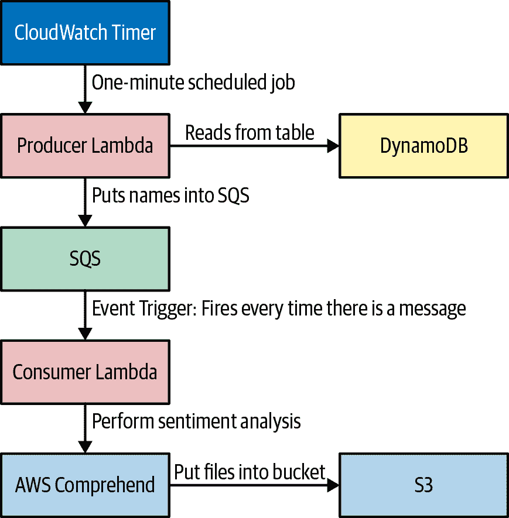

###### 图 15-16\. 无服务器 AI 数据工程流水线

# 结论

数据工程是一个不断发展的职业头衔，它极大地受益于强大的 DevOps 技能。微服务、持续交付、基础设施即代码和监控日志记录等 DevOps 最佳实践在这一类别中发挥了重要作用。通过利用云原生技术，使得复杂问题成为可能，简单问题变得无需费力。

这里有一些继续掌握数据工程技能旅程的下一步。学习无服务器技术。无论云环境是什么，都要学习！这种环境是未来，特别是数据工程非常适合抓住这一趋势。

# 练习

+   解释 Big Data 是什么及其主要特征。

+   使用 Python 中的小数据工具解决常见问题。

+   解释数据湖是什么及其用途。

+   解释不同类型用途专用数据库的适当使用案例。

+   在 Python 中构建无服务器数据工程流水线。

# 案例研究问题

+   使用本章展示的相同架构，构建一个端到端的无服务器数据工程管道，使用 Scrapy、Beautiful Soup 或类似的库来爬取网站，并将图像文件发送到 Amazon Rekognition 进行分析。将 Rekognition API 调用的结果存储在 Amazon DynamoDB 中。每天定时运行此作业。
