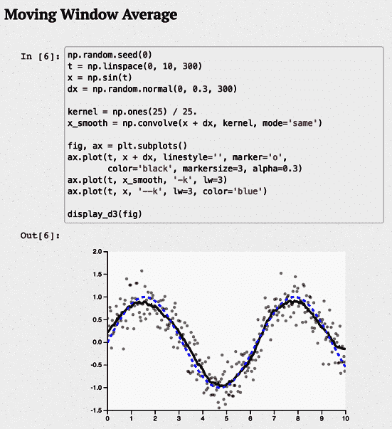

# 第一章：介绍 Python

Python 是一种经过良好建立的通用编程语言，由其创始人 Guido van Rossum 于 1991 年首次发布。这种稳定成熟的高级动态面向对象的跨平台语言具有非常吸引人的特性。Python 可以运行在 macOS、包括 Linux、Windows 在内的大多数当前 Unix 变体，以及经过一些调整后的移动平台。¹

Python 在软件生命周期的所有阶段（分析、设计、原型、编码、测试、调试、调优、文档编写和当然还有维护）都能提供高生产力。多年来，这种语言的流行度稳步增长，2021 年 10 月成为 [TIOBE 指数](https://oreil.ly/qxdeK) 领导者。如今，对 Python 的熟悉对每位程序员来说都是一个优势：它已经渗透到大多数领域，在任何软件解决方案中都能发挥有用的作用。

Python 提供了优雅、简洁、实用和强大的独特结合。由于其一贯性和规律性、丰富的标准库以及众多第三方包和工具的可用性，你将会很快在 Python 上变得高效率。Python 容易学习，因此如果你是新手，它非常适合，但它也足够强大，可以满足最复杂专家的需求。

# Python 语言

Python 语言虽然不是极简主义的，但出于良好的实用原因而简洁。一种语言一旦提供了表达设计的良好方式，增加其他方式的好处最多是有限的；语言复杂度的成本却不仅线性增长，尤其是特性数量增加时更为明显。复杂的语言比简单的语言更难学习和掌握（也更难高效实现和无 bug 地实施），在软件开发中尤其如此，特别是在许多开发者合作，并经常维护原本由他人编写的代码的大型项目中。

Python 相当简单，但不是简单化。它遵循一种理念：如果一种语言在某些情境下表现一定的方式，那么在所有情境下都应该理想地以相似的方式工作。Python 遵循的原则是语言不应该有“方便”的快捷方式、特例、临时例外、过于微妙的区别，或神秘和棘手的底层优化。一种好的语言，像任何其他设计良好的工件一样，必须在通用原则、品味、常识和大量实用性之间取得平衡。

Python 是一种通用编程语言：它的特性几乎在软件开发的任何领域都非常有用。没有任何领域是 Python 不能成为解决方案的一部分的。这里“一部分”很重要；尽管许多开发者发现 Python 能够满足他们的所有需求，但它并不必须单打独斗。Python 程序可以与多种其他软件组件合作，使其成为在其他语言中粘合组件的正确语言。语言的一个设计目标是长久以来一直是“与他人和谐相处”。

Python 是一种非常高级的语言（VHLL）。这意味着它使用更高级的抽象级别，概念上比传统的编译语言如 C、C++ 和 Rust 更远离底层机器。“高级”在这里指的是这种概念。Python 比经典的高级语言更简单，更快速（无论是对人还是对工具），并且更规则。这提高了程序员的生产力，使 Python 成为强大的开发工具。对于经典编译语言，优秀的编译器可以生成比 Python 更快运行的二进制代码。然而，在大多数情况下，Python 编写的应用程序的性能是足够的。当不够时，可以应用 “优化” 中涵盖的优化技术来提高程序的性能，同时保持高生产力的好处。

就语言水平而言，Python 可与 JavaScript、Ruby 和 Perl 等其他强大的 VHLLs 相媲美。然而，简单性和规则性的优势仍然在 Python 的一边。

Python 是一种面向对象的编程语言，但它允许你以面向对象和过程化的风格编程，并且还可以根据应用程序的要求混合和匹配功能式编程。Python 的面向对象特性在概念上与 C++ 相似，但使用起来更简单。

# Python 标准库和扩展模块

Python 编程不仅仅是语言本身：标准库和其他扩展模块对于 Python 的使用几乎与语言本身一样重要。Python 标准库提供了许多设计良好、可靠的 Python 模块，方便重复使用。它包括用于表示数据、处理文本、与操作系统和文件系统交互、以及 web 编程等任务的模块，并且可以在 Python 支持的所有平台上运行。

扩展模块来自标准库或其他地方，让 Python 代码可以访问由底层操作系统或其他软件组件提供的功能，如图形用户界面（GUI）、数据库和网络。扩展模块还在计算密集型任务（如 XML 解析和数值数组计算）中提供了很高的速度。然而，不是用 Python 编写的扩展模块并不一定具有与纯 Python 代码相同的跨平台可移植性。

您可以使用低级语言编写扩展模块，以优化在 Python 中原型设计的小型计算密集部分的性能。您还可以使用诸如 Cython、ctypes 和 CFFI 之类的工具，将现有的 C/C++库包装为 Python 扩展模块，详细内容请参阅第二十五章中的“无需使用 Python 的 C API 扩展 Python”（在线获取：[`oreil.ly/python-nutshell-25`](https://oreil.ly/python-nutshell-25)）。您还可以将 Python 嵌入到使用其他语言编写的应用程序中，通过特定于应用程序的 Python 扩展模块向 Python 暴露应用程序功能。

本书记录了许多模块，包括来自标准库和其他来源的模块，用于客户端和服务器端网络编程、数据库、处理文本和二进制文件以及与操作系统交互。

# Python 的实现

在撰写本文时，Python 有两个完整的生产质量实现（CPython 和 PyPy），以及几个较早开发阶段的高性能实现，如[Nuitka](https://nuitka.net)，[RustPython](https://oreil.ly/1oUWk)，[GraalVM Python](https://oreil.ly/1XRt_)和[Pyston](https://www.pyston.org)，我们不会进一步介绍。在“其他发展、实现和分发”中，我们还提到了一些其他更早期的实现。

这本书主要介绍 CPython，这是最广泛使用的实现，我们通常简称为“Python”。然而，语言与其实现之间的区别非常重要！

## CPython

[经典 Python](https://www.python.org)——也称为 CPython，通常简称为 Python——是最新、稳定和完整的 Python 生产质量实现。它是该语言的“参考实现”。CPython 是一个字节码编译器、解释器以及一组标准 C 编码的内置和可选模块。

CPython 可以在符合 ISO/IEC 9899:1990 标准（即所有现代、流行平台）的任何平台上使用 C 编译器。在“安装”中，我们解释了如何下载和安装 CPython。本书中的所有内容（除了明确标记为其他的几个部分）都适用于 CPython。截至撰写本文时，CPython 的当前版本刚刚发布，是 3.11 版本。

## PyPy

[PyPy](https://pypy.org)是 Python 的快速灵活实现，使用 Python 本身的子集编码，能够针对多种低级语言和虚拟机进行优化，采用类型推断等先进技术。PyPy 的最大优势在于能够在运行 Python 程序时即时生成本机机器代码，具有显著的执行速度优势。目前，PyPy 实现了 3.8 版本（3.9 版本处于测试阶段）。

## 在 CPython、PyPy 和其他实现之间做出选择

如果你的平台像大多数情况一样能够运行 CPython、PyPy 以及我们提到的其他几种 Python 实现，你该如何在它们之间进行选择？首先，不要过早地做出选择：下载并安装它们全部。它们可以无冲突共存，而且它们都是免费的（其中一些还提供附加值如技术支持的商业版本，但对应的免费版本也是可以的）。在你的开发机器上同时拥有它们只需一些下载时间和少量磁盘空间，并且让你可以直接比较它们。话虽如此，以下是一些一般性建议。

如果你需要定制版的 Python，或者需要长时间运行程序的高性能，可以考虑 PyPy（或者，如果你对尚未完全成熟的版本可以接受的话，可以考虑我们提到的其他一些版本）。

如果主要在传统环境下工作，CPython 是一个很好的选择。如果没有更强烈的替代偏好，可以从标准的 CPython 参考实现开始，它得到了第三方附加组件和扩展的广泛支持，并提供最新的版本。

换句话说，要进行实验、学习和尝试，使用 CPython。要开发和部署，你最好的选择取决于你想要使用的扩展模块以及你想要分发程序的方式。CPython 从定义上支持所有 Python 扩展；然而，PyPy 支持大多数扩展，并且由于即时编译到机器代码，通常对长时间运行的程序来说速度更快——要确认这一点，请将你的 CPython 代码与 PyPy 进行基准测试（还有其他实现也要测试）。

CPython 是最成熟的：它存在的时间更长，而 PyPy（和其他的实现）则较为新颖，领域实践较少。CPython 版本的开发超前于其他实现。

我们提到的 PyPy、CPython 和其他实现都是优秀的、忠实的 Python 实现，在可用性和性能上都相当接近。熟悉每个实现的优势和劣势，然后为每个开发任务做出最优选择是明智的。

## 其他发展、实现和分发

Python 已经变得如此流行，以至于几个团体和个人对其开发表示了兴趣，并提供了核心开发团队关注外的功能和实现。

如今，大多数基于 Unix 的系统都包括 Python——通常是版本 3.*x*，其中*x*是某个值——作为“系统 Python”。要在 Windows 或 macOS 上获取 Python，通常需要下载并运行一个[安装程序](https://oreil.ly/c-TxU)（参见“macOS”）。如果你对 Python 进行严肃的软件开发，第一件事就是*不要动你系统安装的 Python*！与其他问题无关，Python 正被操作系统的某些部分越来越多地使用，因此调整 Python 安装可能会导致麻烦。

因此，即使您的系统配备了“系统 Python”，也请考虑安装一个或多个 Python 实现，以便您可以自由地用于您的开发方便，安全地知道您所做的一切都不会影响操作系统。我们还强烈推荐使用*虚拟环境*（参见“Python 环境”）来隔离项目，让它们之间拥有可能会发生冲突的依赖关系（例如，如果您的两个项目需要同一个第三方模块的不同版本）。或者，也可以在本地并排安装多个 Python。

Python 的流行导致了许多活跃的社区的创建，语言的生态系统非常活跃。以下部分概述了一些更有趣的发展：请注意，我们未在此处包含某个项目，这反映了空间和时间的限制，而不是意味着不赞成！

### Jython 和 IronPython

[Jython](https://www.jython.org)，支持在[JVM](https://oreil.ly/Q8EQB)上运行 Python，并且 [IronPython](https://ironpython.net)，支持在[.NET](https://oreil.ly/o_MTn)上运行 Python，是两个开源项目，尽管它们支持的 Python 版本具有生产级别的质量，但在撰写本文时似乎“停滞不前”，因为它们支持的最新版本明显落后于 CPython。任何“停滞不前”的开源项目都有可能再次复活：只需一个或多个热情、承诺的开发人员致力于“复苏”它。作为 JVM 上的 Jython 的替代方案，您还可以考虑之前提到的 GraalVM Python。

### Numba

[Numba](https://numba.pydata.org) 是一个开源的即时（JIT）编译器，它将 Python 和 NumPy 的子集进行翻译。由于其对数字处理的强大关注，我们在第十六章中再次提到它。

### Pyjion

[Pyjion](https://oreil.ly/P7wKC) 是一个开源项目，最初由微软发起，其主要目标是向 CPython 添加一个 API 来管理 JIT 编译器。其次目标包括提供一个 JIT 编译器，用于微软的开源 [CLR](https://oreil.ly/5zjOG) 环境（这是 .NET 的一部分）和一个用于开发 JIT 编译器的框架。Pyjion 不是*取代* CPython；相反，它是一个你从 CPython 中导入的模块（目前需要 3.10），它允许你将 CPython 的字节码“即时”地翻译成多个不同环境的机器码。Pyjion 与 CPython 的集成由 [PEP 523](https://oreil.ly/lFDGw) 启用；但是，由于构建 Pyjion 需要除了 C 编译器之外的几个工具（这是构建 CPython 所需的全部工具），Python 软件基金会（PSF）可能永远不会将 Pyjion 捆绑到它分发的 CPython 版本中。

### IPython

IPython 增强了 CPython 的交互式解释器，使其更加强大和便捷。它允许使用缩写的函数调用语法，并通过百分号（%）字符引入称为*magics*的可扩展功能。它还提供了 shell 转义功能，允许 Python 变量接收 shell 命令的结果。您可以使用问号查询对象的文档（或两个问号以获取扩展文档）；Python 交互式解释器的所有标准功能也可用。

[IPython](https://ipython.org)在科学和数据重点领域取得了特殊进展，并通过 IPython Notebook（现在重构并更名为 Jupyter Notebook，见“Jupyter”）的发展逐渐演变为一个交互式编程环境，除了代码片段外，还可以以[literate programming](https://oreil.ly/tx5B3)风格嵌入评论（包括数学符号），并展示执行代码的输出，可选地使用诸如 matplotlib 和 bokeh 等子系统生成的高级图形。Jupyter Notebook 中嵌入 matplotlib 图形的示例如图 1-1 的下半部分所示。Jupyter/IPython 是 Python 的显著成功案例之一。



###### 图 1-1\. 一个示例 Jupyter Notebook，嵌入了 matplotlib 图形

### MicroPython

小型化趋势持续推动着 Python 向业余爱好者的范围内发展。像[Raspberry Pi](https://www.raspberrypi.org)和[Beagle boards](https://beagleboard.org)这样的单板计算机让您在完整的 Linux 环境中运行 Python。在此级别以下，有一类被称为*微控制器*的设备，它们是可编程的具有可配置硬件的芯片，通过简化模拟和数字传感器的使用，例如轻松实现光和温度测量等应用，使得业余和专业项目的范围扩大。

业余爱好者和专业工程师都在越来越多地使用这些设备，这些设备时常出现（有时又会消失）。多亏了[MicroPython](https://micropython.org)项目，[许多这类设备](https://oreil.ly/6Ifug)（[micro:bit](https://microbit.org)，[Arduino](https://www.arduino.cc/)，[pyboard](https://store.micropython.org/product/PYBv1.1)，[LEGO^Ⓡ MINDSTORMS^Ⓡ EV3](https://en.wikipedia.org/wiki/Lego_Mindstorms_EV3)，[HiFive](https://www.hifiveinventor.com)，等等）现在可以用（有限的方言）Python 进行编程。在撰写时值得注意的是[Raspberry Pi Pico](https://oreil.ly/6-s7Q)的推出。鉴于树莓派在教育领域的成功，以及 Pico 能够运行 MicroPython，似乎 Python 正在巩固其作为拥有最广泛应用范围的编程语言的地位。

MicroPython 是 Python 3.4 的实现（“包括后续版本的某些特性”，引用自[其文档](https://oreil.ly/Xe5YP)），它能产生字节码或可执行的机器码（许多用户可能并不了解后一种情况）。它完全实现了 Python 3.4 的语法，但缺少大部分标准库。特殊的硬件驱动模块可以让你控制内置硬件的各个部分；访问 Python 的 socket 库可以让设备与网络服务进行交互。外部设备和定时器事件可以触发代码执行。由于 MicroPython，Python 语言可以完全参与物联网。

一个设备通常可以通过 USB 串行端口或通过浏览器[使用 WebREPL 协议](https://oreil.ly/sch3F)访问解释器（尽管目前我们还不知道任何完全可用的 ssh 实现，因此，请确保适当地配置防火墙：*不应该直接通过互联网访问这些设备，除非有适当的强化预防措施！*）。你可以通过在设备内存中创建一个*boot.py*文件来用 Python 编程设备的上电启动序列，而且这个文件可以执行任意复杂的 MicroPython 代码。

### Anaconda 和 Miniconda

近年来最成功的 Python 发行版之一⁴是[Anaconda](https://www.anaconda.com)。这个开源软件包除了标准库外，还带有大量预配置和经过测试的扩展模块。在许多情况下，你可能会发现它包含了你工作所需的所有依赖项。如果你的依赖项不受支持，你也可以用 pip 安装模块。在基于 Unix 的系统上，它可以简单地安装在一个单独的目录中：只需将 Anaconda 的*bin*子目录添加到你的 shell PATH 的最前面即可激活它。

Anaconda 基于一种名为 conda 的包装技术。一个姐妹实现 [Miniconda](https://oreil.ly/dfX4M) 提供了相同扩展的访问权限，但不会预加载它们；相反，它会在需要时下载它们，因此更适合创建定制环境。conda 不使用标准虚拟环境，但包含相应的功能以允许为多个项目分离依赖关系。

### pyenv：支持多版本的简单实现

[pyenv](https://oreil.ly/88o8b) 的基本目的是让您轻松访问所需的多个不同版本的 Python。它通过为每个可执行文件安装所谓的 *shim* 脚本来实现这一点，这些脚本动态计算所需的版本，顺序如下查看各种信息源：

1.  如果设置了 PYENV_VERSION 环境变量。

1.  当前目录中的 *.pyenv_version* 文件（如果存在）— 您可以使用 **pyenv local** 命令设置此文件。

1.  当在目录树中向上查找第一个 *.pyenv_version* 文件（如果找到的话）。

1.  在 pyenv 安装根目录中的 *version* 文件— 您可以使用 **pyenv global** 命令设置此文件。

pyenv 将其 Python 解释器安装在其主目录下（通常是 *~/.pyenv*），一旦可用，特定解释器可以安装为任何项目目录中的默认 Python。或者（例如，在多个版本下测试代码时），您可以使用脚本在脚本执行过程中动态更改解释器。

**pyenv install –list** 命令显示了一个令人印象深刻的列表，包括 PyPy、Miniconda、MicroPython 和其他几个官方 CPython 实现（截至撰写本文时为止，从 2.1.3 到 3.11.0rc1）。

### Transcrypt：将您的 Python 转换为 JavaScript

有许多尝试将 Python 打造成为浏览器语言，但 JavaScript 的影响力十分顽强。[Transcrypt](https://www.transcrypt.org) 系统是一个可通过 pip 安装的 Python 包，用于将 Python 代码（目前支持版本为 3.9）转换为浏览器可执行的 JavaScript。您可以完全访问浏览器的 DOM，允许您的代码动态操作窗口内容并使用 JavaScript 库。

虽然它创建了缩小的代码，但 Transcrypt 提供了完整的 [sourcemaps](https://oreil.ly/WjVAa)，允许您根据 Python 源代码而不是生成的 JavaScript 进行调试。您可以用 Python 编写浏览器事件处理程序，自由混合 HTML 和 JavaScript。Python 可能永远不会取代 JavaScript 作为嵌入式浏览器语言，但 Transcrypt 意味着您可能不再需要担心这个问题。

另一个非常活跃的项目让你可以用 Python 脚本编写网页（最多支持到 3.10）是 [Brython](https://brython.info)，还有其他一些项目：[Skulpt](https://skulpt.org)，还没有完全支持 Python 3，但正在朝这个方向发展；[PyPy.js](https://pypyjs.org)，同样；[Pyodide](https://oreil.ly/jb_US)，目前支持 Python 3.10 和许多科学扩展，中心是 [Wasm](https://webassembly.org)；以及最近的 Anaconda 的 [PyScript](https://pyscript.net)，建立在 Pyodide 上。我们在 “在浏览器中运行 Python”中更详细地描述了这些项目中的几个。

## 许可和价格问题

CPython 受到 [Python 软件基金会许可证第 2 版](https://oreil.ly/NjjDu)的保护，它与 GNU 通用公共许可证（GPL）兼容，但允许你将 Python 用于任何专有、免费或其他开源软件开发，类似于 BSD/Apache/MIT 许可证。PyPy 和其他实现的许可证也类似宽松。你从主 Python 和 PyPy 网站下载的任何内容都不会花费你一分钱。此外，这些许可证不会限制你在使用这些工具、库和文档开发的软件时可以使用的许可和定价条件。

然而，并非所有与 Python 相关的内容都免于许可费用或麻烦。许多第三方 Python 来源、工具和扩展模块，你可以自由下载，拥有类似于 Python 本身的宽松许可证。其他的则受到 GPL 或较小 GPL（LGPL）的保护，限制了你对衍生作品的许可条件。一些商业开发的模块和工具可能要求你支付费用，无论是无条件的还是如果你用它们盈利的情况下都需要支付费用。⁶

对于许可条件和价格的细致检查没有替代品。在你投入时间和精力使用任何软件工具或组件之前，请确保你能接受它的许可证。通常，特别是在企业环境中，这些法律问题可能需要咨询律师。除非我们明确说明，否则本文中涉及的模块和工具在撰写本文时可以认为是自由下载的、开源的，并且采用类似于 Python 的自由许可证。然而，我们声明不具备法律专业知识，许可证可能会随时间变化，因此始终需要仔细核查。

# Python 开发与版本

Python 由 Guido van Rossum（Python 的发明者、架构师，现在的“前”终身仁慈独裁者（BDFL））领导的核心开发团队开发、维护和发布。这个头衔意味着 Guido 对 Python 语言和标准库的组成有最终决定权。一旦 Guido 决定辞去 BDFL 职位，他的决策角色由由 PSF 成员选举产生的一个小型“指导委员会”接管，任期一年。

Python 的知识产权归 PSF 所有，这是一个致力于推广 Python 的非营利性组织，描述在“Python 软件基金会”中。许多 PSF 院士和成员在 Python 的[参考源代码库](https://github.com/python)中有提交权限，如[“Python 开发者指南”](https://oreil.ly/WKjXc)所述，大多数 Python 提交者都是 PSF 的成员或院士。

提议对 Python 的更改详细说明在名为[Python Enhancement Proposals (PEPs)](https://oreil.ly/HxHfs)的公共文档中。PEPs 由 Python 开发人员和更广泛的 Python 社区进行辩论，最终由指导委员会批准或拒绝。（指导委员会可能考虑辩论和初步投票，但并不受其约束。）数百人通过 PEPs、讨论、错误报告和对 Python 源代码、库和文档的补丁为 Python 开发做出贡献。

Python 核心团队以每年一次的速度发布 Python 的小版本（3.*x*，其中*x*为不断增长的值），也称为“特征发布”。

每个小版本发布（与 bug 修复的微版本相对）都添加了使 Python 更强大的功能，但也会注意保持向后兼容性。Python 3.0 首先于 2008 年 12 月发布，允许破坏向后兼容性以删除多余的“遗留”功能并简化语言。Python 3.11（出版时的最新稳定版本）于 2022 年 10 月首次发布。

每个小版本 3.*x*首先以 alpha 版本发布，标记为 3.*x*a0、3.*x*a1 等等。在 alpha 版本之后，至少有一个 beta 版本，3.*x*b1，以及 beta 版本之后，至少有一个发布候选版本，3.*x*rc1。当 3.*x*（3.*x*.0）的最终版本发布时，它是稳定的、可靠的，并在所有主要平台上经过测试。任何 Python 程序员都可以通过下载 alpha 版、beta 版和发布候选版、尝试它们，并为出现的任何问题提交错误报告来确保这一点。

一旦一个小版本发布，核心团队的注意力部分转移到下一个小版本上。然而，一个小版本通常会有连续的点发布（即 3.*x*.1、3.*x*.2 等），每两个月发布一次，不添加功能，但可以修复错误、解决安全问题、将 Python 移植到新平台、增强文档，并添加工具和（100%向后兼容的！）优化。

在主要版本内，Python 的向后兼容性相当好。你可以在线找到所有旧版本的 Python 的代码和文档，附录包含了本书涵盖的每个版本的变更摘要列表。

# Python 资源

最丰富的 Python 资源在网络上：从 Python 的[主页](https://www.python.org)开始，这里有许多探索链接。

## 文档

CPython 和 PyPy 都配有良好的文档。你可以在 CPython 的在线手册 [阅读](https://docs.python.org/3)（我们经常称之为“在线文档”），并且也有适合离线查看、搜索和打印的各种可下载格式。Python 的 [文档页面](https://www.python.org/doc) 包含了指向大量其他文档的附加指针。PyPy 也有一个 [文档页面](http://doc.pypy.org)，你可以在这里找到 Python 和 PyPy 的在线常见问题解答。

### Python 非程序员文档

大多数 Python 文档（包括本书）都假设具有一定的软件开发知识。然而，Python 对于初学者来说非常适用，因此也有例外情况。非程序员的良好入门免费在线文本包括：

+   Josh Cogliati 的 [“Python 3 非程序员教程”](https://oreil.ly/HnXMA)（目前以 Python 3.9 为中心）。

+   Alan Gauld 的 [“学习编程”](https://oreil.ly/FQExV)（目前以 Python 3.6 为中心）

+   Allen Downey 的 [*Think Python*，第二版](https://oreil.ly/kg6Yd)（以 Python 3.*x* 版本为中心）。

一个学习 Python 的绝佳资源（适用于非程序员和经验较少的程序员）是 [“Python 初学者指南” wiki](https://oreil.ly/Yf5cK)，其中包含大量链接和建议。这是由社区共同维护的，因此随着可用的书籍、课程、工具等的不断进步和改进，它会保持最新。

### 扩展模块和 Python 源码

探索 Python 扩展二进制和源码的良好起点是 [Python Package Index](https://oreil.ly/PGIim)（我们这些老前辈中的一些人仍然喜欢称之为“奶酪商店”，但现在通常称为 PyPI），在本文撰写时提供了超过 400,000 个包，每个包都有描述和指针。

标准的 Python 源码发布包含了在标准库和 *Tools* 目录中的优秀 Python 源代码，以及许多内置扩展模块的 C 源码。即使你对从源代码构建 Python 没有兴趣，我们建议你下载和解压 Python 源码发布包（例如，最新稳定版本的 [Python 3.11](https://oreil.ly/rqYZ9)），只是为了学习它；或者，如果你选择的话，浏览当前最新的 Python 标准库的 bleeding-edge 版本 [在线文档](https://oreil.ly/zDQ1Z)。

这本书涵盖的许多 Python 模块和工具也有专门的网站。我们在相应的章节中提供了这些网站的引用。

### 书籍

尽管网络是丰富的信息来源，但书籍仍然有其重要性（如果你对此意见不同，我们就不会写这本书，你也不会在读它）。关于 Python 的书籍很多。以下是我们推荐的一些（一些覆盖较旧的 Python 3 版本，而不是当前版本）：

+   如果您懂一些编程但刚开始学习 Python，并且喜欢图形化的教学方法，[*Head First Python，第二版*](https://learning.oreilly.com/library/view/head-first-python/9781491919521/)，作者 Paul Barry（O’Reilly），可能非常适合您。像 Head First 系列中的所有书籍一样，它使用图形和幽默来教授其主题。

+   [*深入 Python 3*](https://diveintopython3.net)，作者 Mark Pilgrim（Apress），通过快节奏和彻底的示例方式进行教学，非常适合已经是其他语言专家程序员的人。

+   [*从初学到专业：Python 起步*](https://oreil.ly/YtWRs)，作者 Magnus Lie Hetland（Apress），通过详尽的解释和在各种应用领域中完整开发程序来进行教学。

+   [*流畅的 Python*](https://www.oreilly.com/library/view/fluent-python/9781491946237/)，作者 Luciano Ramalho（O’Reilly），是一本适合有经验的开发人员，希望使用更多 Python 风格惯用语和功能的优秀书籍。

## 社区

Python 最大的优势之一是其强大、友好、包容的社区。Python 程序员和贡献者在会议、“黑客马拉松”（在 Python 社区中通常称为[*sprints*](https://oreil.ly/oQceG)）、本地用户组相聚；积极讨论共同的兴趣；并在邮件列表和社交媒体上互相帮助。要获取连接方式的完整列表，请访问[*https://www.python.org/community*](https://www.python.org/community)。

### Python 软件基金会

除了拥有 Python 编程语言的知识产权外，PSF 还促进 Python 社区。它赞助用户组、会议和“sprints”，并为开发、外展和教育等活动提供资助。PSF 有数十位[Fellows](https://oreil.ly/maILY)（因其对 Python 的贡献而提名，包括 Python 核心团队的所有成员，以及本书的三位作者）；数百名贡献了时间、工作和金钱的成员（包括许多获得[Community Service Awards](https://oreil.ly/MiQRf)的人）；以及数十家[企业赞助商](https://oreil.ly/FFOZ7)。任何使用和支持 Python 的人都可以成为 PSF 的成员。⁷查看[会员页面](https://oreil.ly/MzdRK)获取有关各种会员级别的信息，以及如何成为 PSF 的成员。如果您有兴趣为 Python 本身做贡献，请参阅[“Python 开发者指南”](https://oreil.ly/1Jwwb)。

### 工作组

[工作组](https://oreil.ly/0GmfI)是由 PSF 成立的委员会，负责为 Python 进行特定而重要的项目。以下是写作时的一些活跃工作组的示例：

+   [Python 打包管理局（PyPA）](https://oreil.ly/0Zxm7)改进和维护 Python 打包生态系统，并发布[“Python 打包用户指南”](https://packaging.python.org)。

+   [Python 教育工作组](https://oreil.ly/ZljIc)致力于推广使用 Python 进行教育和学习。

+   [多样性与包容性工作组](https://oreil.ly/koEo4)支持和促进 Python 程序员多样化和国际化社区的增长。

### Python 会议

世界各地有许多 Python 会议。一般的 Python 会议包括国际和地区性的会议，如[PyCon](https://us.pycon.org)和[EuroPython](https://oreil.ly/nF74d)，以及其他更本地化的会议，如[PyOhio](http://www.pyohio.org)和[PyCon Italia](https://www.pycon.it/en)。专题会议包括[SciPy](https://www.scipy2022.scipy.org)和[PyData](http://pydata.org/events.xhtml)。会议通常会跟随编程冲刺，Python 贡献者们在几天内聚集在一起，专注于特定开源项目的编码，并享受友谊的互动。您可以在社区的[会议和研讨会页面](https://oreil.ly/asosj)上找到会议列表。超过 450 个会议的 17,000 多个关于 Python 的讲座视频可以在[PyVideo 网站](https://pyvideo.org)上找到。

### 用户组织和组织

Python 社区在除南极洲外的每个大陆上都有本地用户组⁸，根据[LocalUserGroups wiki](https://oreil.ly/cY6Mk)上的列表，超过 1,600 个用户组。世界各地都有 Python [聚会](https://oreil.ly/h6oEs)。[PyLadies](http://www.pyladies.com)是一个国际性的导师组织，拥有本地分部，旨在促进 Python 中的女性；任何对 Python 感兴趣的人都欢迎加入。[NumFOCUS](https://numfocus.org)是一个非营利性慈善机构，致力于促进研究、数据和科学计算领域的开放实践，赞助了 PyData 会议和其他项目。

### 邮件列表

社区[邮件列表页面](https://www.python.org/community/lists)包含多个与 Python 相关的邮件列表（还有一些我们足够老的人还记得的 Usenet 组）。或者，您可以在[Mailman](https://mail.python.org/archives)中搜索，找到涵盖各种兴趣领域的活跃邮件列表。Python 相关的官方公告发布在[python-announce 列表](https://oreil.ly/eg9Ft)上。要获取特定问题的帮助，请写信至*help@python.org*。如需 Python 的学习或教学帮助，请写信至*tutor@python.org*，或者更好地加入[列表](https://oreil.ly/iEQJF)。要获取有关 Python 新闻和文章的有用每周摘要，请订阅[Python Weekly](http://www.pythonweekly.com)。您也可以在*@python_discussions@mastodon.social*上关注 Python Weekly。

### 社交媒体

若要获取与 Python 相关的博客的 [RSS 订阅](https://oreil.ly/pf4AS)，请参阅 [Planet Python](http://planetpython.org)。如果您关注语言发展，可以查看 [*discuss.python.org*](http://discuss.python.org)，它会发送有用的摘要，如果您不经常访问的话。在 Twitter 上，请关注 @ThePSF。[IRC](https://oreil.ly/AXMAf) 上的 [Libera.Chat](https://libera.chat) 主持多个与 Python 相关的频道：主要频道是 #python。在 LinkedIn 上有许多 Python 群组，包括 [Python Web Developers](https://oreil.ly/-LKFZ)。在 Slack 上，加入 [PySlackers](https://pyslackers.com) 社区。在 Discord 上，请查看 [Python Discord](https://pythondiscord.com)。关于 Python 编程的技术问题和答案也可以在 [Stack Overflow](http://stackoverflow.com) 上找到和跟踪，包括各种标签，如 [[python]](https://oreil.ly/GHoVY)。Python 目前是 Stack Overflow 上活跃度最高的编程语言，并且那里可以找到许多有用的答案和启发性讨论。如果您喜欢播客，可以听听 Python 相关的播客，例如 [Python Bytes](https://pythonbytes.fm)。

# 安装

在大多数平台上，您可以安装 Python 的经典（CPython）和 PyPy 版本。具备适当的开发系统（对于 CPython 是 C；而 PyPy 则由 Python 自身编写，只需先安装 CPython），您可以从各自的源代码分发中安装 Python 版本。在流行的平台上，您也可以选择安装预构建的二进制分发版本。

# 如果 Python 已预装，如何安装

如果您的平台预装了 Python 的版本，建议您仍然安装一个独立的最新版本进行自己的代码开发。在这种情况下，请*不要*删除或覆盖平台原始版本：而是将新版本安装在原版本旁边。这样做可以避免干扰平台上的其他软件，因为这些软件可能依赖于平台自带的特定 Python 版本。

从二进制分发安装 CPython 更快，可以在某些平台上节省大量工作，并且如果没有适当的 C 编译器，这是唯一的可能性。从源代码安装可以提供更多的控制和灵活性，如果找不到适合您平台的预构建二进制分发版本，这是必须的。即使您从二进制分发安装，最好也下载源代码分发，因为它可能包含通常在预构建二进制分发中缺失的示例、演示和工具。接下来我们将看看如何进行这两种安装方式。

# 从二进制安装 Python

如果你的平台受欢迎且当前，你会很容易找到预先构建的、打包的 Python 二进制版本，可以立即安装。二进制包通常是自安装的，可以直接作为可执行程序安装，也可以通过适当的系统工具安装，如某些 Linux 版本上的 Red Hat Package Manager (RPM)和 Windows 上的 Microsoft Installer (MSI)。下载包后，通过运行程序并选择安装参数来安装它，例如 Python 的安装目录。在 Windows 中，选择标有“将 Python 3.10 添加到 PATH”选项，让安装程序将安装位置添加到 PATH 中，以便在命令提示符下轻松使用 Python（参见“python 程序”）。

你可以从[Python 网站的下载页面](https://oreil.ly/b3AP7)获取“官方”二进制文件：点击标有“下载 Python 3.11.x”的按钮，下载适合你浏览器平台的最新二进制文件。

许多第三方为其他平台提供免费的二进制 Python 安装程序。针对 Linux 发行版，无论你的发行版是[RPM-based](http://rpmfind.net)（如红帽、Fedora、曼德里维亚、SUSE 等）还是[Debian-based](http://www.debian.org)（包括 Ubuntu，在撰写本文时可能是最流行的 Linux 发行版）。[Other Platforms 页面](https://oreil.ly/xvFYV)提供了链接到二进制发行版的链接，适用于现在有些略显陈旧的平台，如 AIX、OS/2、RISC OS、IBM AS/400、Solaris、HP-UX 等（通常不提供最新的 Python 版本，因为这些平台现在有些“过时”），以及非常流行的[iOS 平台](https://oreil.ly/gnJND)，即流行的[iPhone](https://oreil.ly/RelC0)和[iPad](https://oreil.ly/Sb7_n)设备的操作系统。

[Anaconda](https://oreil.ly/DxmAG)，在本章前面提到过，是一个二进制发行版，包括 Python、[conda](http://conda.pydata.org/docs)软件包管理器，以及数百个第三方扩展，特别适用于科学、数学、工程和数据分析。它适用于 Linux、Windows 和 macOS。[Miniconda](https://oreil.ly/RrY5_)，在本章前面也提到过，是相同的软件包，但没有所有这些扩展；你可以使用 conda 选择性地安装它们的子集。

# macOS

流行的第三方 macOS 开源软件包管理器[Homebrew](http://brew.sh)提供了众多其他开源软件包之外，优秀的[Python](https://oreil.ly/rnK6U)版本。在 macOS 中，如“Anaconda 和 Miniconda”中提到的，conda 也可以很好地工作。

# 从源代码安装 Python

要从源代码安装 CPython，你需要一个具有 ISO 兼容的 C 编译器和像 make 这样的工具的平台。在 Windows 上，构建 Python 的常规方式是使用 Visual Studio（最好是[VS 2022](https://oreil.ly/eblTI)，目前开发者可以[免费获取](https://oreil.ly/2j1dK)）。

要下载 Python 源代码，请访问[Python Source Releases](https://oreil.ly/HeGVY)页面（在 Python 网站上，悬停在菜单栏中的下载上，并选择“源代码”），然后选择您的版本。

标签为“Gzipped source tarball”的链接下的文件具有*.tgz*文件扩展名；这相当于*.tar.gz*（即通过流行的 gzip 压缩器压缩的文件*tar*归档）。或者，您可以使用标签为“XZ compressed source tarball”的链接，获取具有*.tar.xz*扩展名的版本，由更强大的 xz 压缩器压缩，如果您有处理 XZ 压缩所需的所有工具。

## Microsoft Windows

在 Windows 上，从源代码安装 Python 可能会很麻烦，除非您熟悉 Visual Studio 并习惯于在称为*命令提示符*的文本导向窗口中工作——大多数 Windows 用户更倾向于直接从 Microsoft Store 下载预构建的[Python](https://oreil.ly/wNIMo)。

如果以下说明给您带来任何麻烦，请坚持按照前一节描述的方式从二进制文件安装 Python。即使您还从源代码安装，最好也单独进行二进制文件安装。如果您在使用您从源代码安装的版本时注意到任何奇怪的事情，请与从二进制文件安装双重检查。如果奇怪的事情消失了，那肯定是由于您在构建后者时选择的一些怪癖，因此您知道您必须双重检查您选择构建的详细信息。

在接下来的几节中，为了清晰起见，我们假设您已经创建了一个名为*%USERPROFILE%\py*（例如，*c:\users\tim\py*）的新文件夹，您可以通过在任何命令窗口中键入**mkdir**命令来实现这一点。将源*.tgz*文件（例如*Python-3.11.0.tgz*）下载到该文件夹中。当然，您可以根据需要命名和放置该文件夹：我们的命名选择仅供解释用途。

### 解压和展开 Python 源代码

您可以使用例如免费程序[7-Zip](http://www.7-zip.org)来解压缩和展开*.tgz*或*.tar.xz*文件。从[下载页面](https://oreil.ly/Fwv5d)下载适当版本，安装并在您从 Python 网站下载的*.tgz*文件上运行它（例如，*c:\users\alex\py\Python-3.11.0.tgz*）。假设您将此文件下载到*%USERPROFILE%\py*文件夹中（或者如果需要，从*%USERPROFILE%\downloads*移动到那里），您现在将拥有一个名为*%USERPROFILE%\py\Python-3.11.0*或类似的文件夹，具体取决于您下载的版本。这是一个包含整个标准 Python 分发的源代码树的根。

### 构建 Python 源代码

用任何文本编辑器打开位于此根文件夹的*PCBuild*子目录中的*readme.txt*文件，并按照其中找到的详细说明操作。

## 类 Unix 平台

在类 Unix 平台上，从源代码安装 Python 通常很简单。¹⁰ 在接下来的章节中，为了清晰起见，假设您已经创建了一个名为 *~/py* 的新目录，并下载了源码 *.tgz* 文件，例如 *Python-3.11.0.tgz* ——当然，您可以根据需要命名和放置目录：我们的命名选择仅供说明目的。

### 解压和解包 Python 源代码

可以使用流行的 GNU 版本的 tar 解压和解包 *.tgz* 或 *.tar.xz* 文件。只需在 shell 提示符下输入以下命令：

```py
$ cd ~/py && tar xzf Python-3.11.0.tgz
```

现在您有一个名为 *~/py/Python-3.11.0* 或类似的目录，具体取决于您下载的版本。这是一个树的根，其中包含整个标准 Python 发布版的源代码形式。

### 配置、构建和测试

您将在此目录下的 *README* 文件中找到详细的注释，位于“构建说明”标题下，我们建议您阅读这些注释。然而，在最简单的情况下，您可能只需在 shell 提示符下输入以下命令：

```py
$ cd ~/py/Python-3.11/0
$ ./configure
    [configure writes much information, snipped here]
$ make
    [make takes quite a while and emits much information, snipped here]
```

如果在运行 **make** 之前未先运行 **./configure**，**make** 隐式地运行 **./configure**。当 **make** 完成时，请检查您刚刚构建的 Python 是否正常工作：

```py
$ make test
    [takes quite a while, emits much information, snipped here]
```

通常，**make test** 确认您的构建工作正常，但还会通知您由于缺少可选模块而跳过了一些测试。

一些模块是特定于平台的（例如，某些仅在运行 SGI 古老 [IRIX](https://oreil.ly/SsGHY) 操作系统的机器上工作的模块）；您无需担心它们。但是，其他模块可能会被跳过，因为它们依赖于当前未安装在您的机器上的其他开源软件包。例如，在 Unix 上，模块 _tkinter —— 用于运行 Tkinter GUI 包和 IDLE 集成开发环境，它们与 Python 一起提供 —— 只有在 **./configure** 可以在您的机器上找到 Tcl/Tk 8.0 或更高版本的安装时才能构建。有关更多细节和不同 Unix 及类 Unix 平台的特定注意事项，请参阅 *README* 文件。

从源代码构建使您可以以多种方式调整配置。例如，您可以以特殊方式构建 Python，以帮助您在开发 C 代码的 Python 扩展时调试内存泄漏，详细内容请参阅“构建和安装 C 编码的 Python 扩展”在 [第二十五章](https://oreil.ly/python-nutshell-25) 中。**./configure --help** 是了解可以使用的配置选项的良好信息来源。

### 构建后的安装

默认情况下，**./configure** 准备将 Python 安装在 */usr/local/bin* 和 */usr/local/lib* 中。您可以在运行 **make** 之前通过在 **./configure** 中使用 **--prefix** 选项来更改这些设置。例如，如果您希望在家目录的子目录 *py311* 中进行私有安装 Python，请运行：

```py
$ cd ~/py/Python-3.11.0
$ ./configure --prefix=~/py311
```

并按照前一节中的方法继续执行**make**。一旦构建和测试 Python 完成，要执行所有文件的实际安装，请运行以下命令：¹¹

```py
$ make install
```

运行**make install**的用户必须对目标目录具有写权限。根据您选择的目标目录及其权限，当您运行**make install**时，您可能需要**su**为*root*、*bin*或其他某个用户。用于此目的的常见习语是**sudo make install**：如果**sudo**提示输入密码，请输入当前用户的密码，而不是*root*的密码。另一种替代且推荐的方法是安装到虚拟环境中，如“Python 环境”中所述。

¹ 对于 Android，请参阅[*https://wiki.python.org/moin/Android*](https://wiki.python.org/moin/Android)，对于 iPhone 和 iPad，请参阅[Python for iOS and iPadOS](https://oreil.ly/iYnk3)。

² Python 3.11 版本开始使用“C11 无可选功能”并指定“公共 API 应与 C++兼容”。

³ 可以用许多编程语言编写，不仅仅是 Python。

⁴ 实际上，conda 的功能扩展到其他语言，并且 Python 只是另一个依赖项。

⁵ 通过 Anaconda 自动安装 250+，可以使用**conda install**显式安装 7500+。

⁶ 流行的商业模式是*免费增值*：同时发布免费版本和带有技术支持和可能的额外功能的商业“高级”版本。

⁷ Python 软件基金会运行重要基础设施，支持 Python 生态系统。欢迎捐赠给 PSF。

⁸ 我们需要鼓励更多的[企鹅](https://en.wikipedia.org/wiki/Penguin)对我们的语言感兴趣！

⁹ 或者，在现代 Windows 版本中，极力推荐使用[Windows Terminal](https://oreil.ly/_Cu97)。

¹⁰ 源安装的大多数问题涉及各种支持库的缺失，这可能导致构建解释器时某些功能丢失。“Python 开发者指南”解释了如何处理各种平台上的依赖关系。[*build-python-from-source.com*](https://oreil.ly/isww-)是一个有用的网站，展示了在多个 Linux 平台上下载、构建和安装特定版本的 Python 以及大多数所需支持库的所有命令。

¹¹ 或者**make altinstall**，如果您希望避免创建 Python 可执行文件和手动页的链接。
