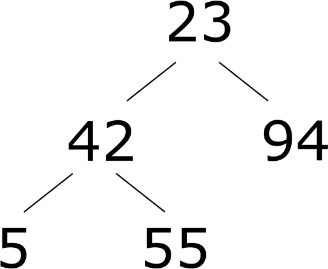

# 第三章：Python 语言

本章是 Python 语言的指南。如果您想从头开始学习 Python，我们建议您从[在线文档](https://oreil.ly/lVDFK)中选择合适的链接，并参考“非程序员的 Python 文档”中提到的资源。如果您已经很熟悉至少一种其他编程语言，只是想了解 Python 的具体信息，那么本章适合您。但是，我们不打算教授 Python：我们在相当快的速度下涵盖了大量内容。我们专注于规则，只是次要地指出最佳实践和风格；作为您的 Python 风格指南，请使用[PEP 8](https://oreil.ly/biw1p)（可以加上额外的指导，如[“Python 之旅”](https://oreil.ly/gKFLA)、[CKAN](https://oreil.ly/0nj5h)和[Google](https://oreil.ly/q9_k_)的指导）。

# 词法结构

编程语言的*词法结构*是指规定如何在该语言中编写程序的基本规则集。它是语言的最低级语法，指定诸如变量名的外观和如何表示注释等事物。每个 Python 源文件，像任何其他文本文件一样，都是一系列字符。您还可以有用地将其视为行、标记或语句的序列。这些不同的词法视图相辅相成。Python 对程序布局非常讲究，特别是对行和缩进：如果您从其他语言来学习 Python，请注意这些信息。

## 行和缩进

Python 程序是一系列*逻辑行*，每个逻辑行由一个或多个*物理行*组成。每个物理行可能以注释结束。不在字符串字面值内的井号(#)开始注释。井号后的所有字符直到行尾（但不包括行尾）都是注释：Python 会忽略它们。只包含空白字符，可能带有注释的行是*空白行*：Python 会忽略它。在交互式解释器会话中，您必须输入一个空的物理行（没有任何空白或注释）来结束多行语句。

在 Python 中，物理行的结束标志着大多数语句的结束。与其他语言不同，您通常不需要使用分隔符（如分号；）来终止 Python 语句。当语句过长无法适应物理行时，可以通过确保第一物理行不包含注释并以反斜杠（\）结尾来将两个相邻的物理行连接成一个逻辑行。更加优雅的是，如果一个开放括号（（），方括号（），或大括号（{）尚未关闭，Python 也会自动将相邻的物理行合并为一个逻辑行：利用此机制可以生成比以反斜杠结尾更易读的代码。三引号字符串文字也可以跨越物理行。在逻辑行的第一个物理行之后的物理行被称为*连续行*。缩进规则适用于每个逻辑行的第一个物理行，而不是连续行。

Python 使用缩进来表示程序的块结构。Python 不使用大括号或其他开始/结束界定符来标识语句块；缩进是唯一指定块的方法。Python 程序中的每个逻辑行*左侧的空白*表示缩进。*块*是一系列连续的逻辑行，所有这些行都具有相同的缩进量；具有较少缩进的逻辑行终止该块。块中的所有语句以及复合语句中的所有子句必须具有相同的缩进，源文件中的第一条语句不得缩进（即不得以任何空白字符开头）。在交互式解释器主提示符>>>（详见[“交互式会话”）处键入的语句也不得缩进。

Python 将每个制表符视为多达 8 个空格，因此制表符之后的下一个字符落入逻辑列 9、17、25 等。标准的 Python 风格是每个缩进级别使用四个空格（*绝对不是*制表符）。

如果必须使用制表符，Python 不允许混合使用制表符和空格进行缩进。

# 使用空格而非制表符

配置您喜欢的编辑器，将 Tab 键扩展为四个空格，以便您编写的所有 Python 源代码都只包含空格，而不是制表符。这样，包括 Python 在内的所有工具在处理 Python 源文件的缩进时都是一致的。最佳的 Python 风格是每个缩进块恰好缩进四个空格；不使用制表符。

## 字符集

Python 源文件可以使用任何 Unicode 字符，默认编码为 UTF-8（ASCII 字符是 0 到 127 之间的编码，UTF-8 将这些字符编码为相应的单个字节，因此 ASCII 文本文件也是良好的 Python 源文件。）

可以选择告诉 Python，某个源文件采用了不同的编码。在这种情况下，Python 将使用该编码读取文件。要让 Python 知道源文件使用了非标准编码，请在源文件开头加上以下形式的注释：

```py
# coding: iso-8859-1
```

编码后，写入来自 codecs 模块的 ASCII 兼容编解码器的名称，例如 utf-8 或 iso-8859-1。请注意，这个*coding directive*注释（也称为*encoding declaration*）只有在它位于源文件的开头时才被视为这样（可能在“运行 Python 程序”中讨论的“shebang 行”之后）。最佳做法是对所有文本文件，包括 Python 源文件，都使用 utf-8。

## 令牌

Python 将每个逻辑行分解为一系列称为*令牌*的基本词法组件。每个令牌对应于逻辑行的子字符串。正常的令牌类型包括*标识符*、*关键字*、*运算符*、*分隔符* 和*字面值*，我们将在以下部分介绍。您可以在令牌之间自由使用空格将它们分开。在逻辑上相邻的标识符或关键字之间需要一些空格分隔；否则，Python 会将它们解析为一个更长的标识符。例如，ifx 是一个单独的标识符；要写出关键字 **if** 后跟标识符 x，您需要插入一些空格（通常只有一个空格字符，即 **if** x）。

### 标识符

*标识符*是用于指定变量、函数、类、模块或其他对象的名称。标识符以字母开头（即任何 Unicode 分类为字母的字符）或下划线(_)开头，后跟零个或多个字母、下划线、数字或其他 Unicode 分类为字母、数字或组合标记的字符（如[Unicode 标准附录#31](https://oreil.ly/iL3qY)定义）。

例如，在 Unicode Latin-1 字符范围内，标识符的有效前导字符是：

```py
ABCDEFGHIJKLMNOPQRSTUVWXYZ_abcdefghijklmnopqrstuvwxyz
ªµºÀÁÂÃÄÅÆÇÈÉÊËÌÍÎÏÐÑÒÓÔÕÖØÙÚÛÜÝÞßàáâãäåæçèéêëìíîïðñòóôõöøùúûüýþÿ
```

在领先字符之后，有效的标识符主体字符与之前相同，加上数字和·（Unicode 中间点）字符：

```py
0123456789ABCDEFGHIJKLMNOPQRSTUVWXYZ_abcdefghijklmnopqrstuvwxyz
ªµ·ºÀÁÂÃÄÅÆÇÈÉÊËÌÍÎÏÐÑÒÓÔÕÖØÙÚÛÜÝÞßàáâãäåæçèéêëìíîïðñòóôõöøùúûüýþÿ
```

大小写有区分：小写和大写字母是不同的。不允许在标识符中使用@、$ 和 ! 等标点符号字符。

# 小心使用同形字符的 Unicode 字符

一些 Unicode 字符与其他字符非常相似，甚至难以区分。这种字符对称为*同形字符*。例如，比较大写字母 A 和大写希腊字母 alpha (Α)。这实际上是两个不同的字母，在大多数字体中看起来非常相似（或相同）。在 Python 中，它们定义了两个不同的变量：

```py
>>> A = 100
>>> *`# this variable is GREEK CAPITAL LETTER ALPHA:`*>>> Α = 200  
>>> print(A, Α)
```

```py
100 200
```

如果要使您的 Python 代码广泛可用，我们建议制定一个所有标识符、注释和文档均使用英文书写的政策，特别是避免使用非英文同形字符。有关更多信息，请参阅 [PEP 3131](https://oreil.ly/jVK5H)。

Unicode 归一化策略增加了更多复杂性（Python 在解析包含 Unicode 字符的标识符时使用 [NFKC 归一化](https://oreil.ly/q944n)）。有关更多信息，请参阅 Jukka K. Korpela 的《*Unicode Explained*》（O’Reilly）和 Unicode 网站上提供的其他技术信息及该网站引用的书籍。

# 避免在标识符中使用可归一化的 Unicode 字符

当名字包含特定 Unicode 字符时，Python 可能会在变量之间创建意外的别名，通过内部将名字转换为使用归一化字符的名字。例如，字母 ª 和 º 归一化为 ASCII 小写字母 a 和 o，因此使用这些字母的变量可能与其他变量冲突：

```py
>>> a, o = 100, 101
>>> ª, º = 200, 201
>>> print(a, o, ª, º)
```

```py
200 201 200 201  *# expected "100 101 200 201"*
```

最好避免在 Python 标识符中使用可归一化的 Unicode 字符。

Python 的正常风格是类名以大写字母开头，大多数¹其他标识符以小写字母开头。以单个前导下划线开头的标识符表明按照惯例该标识符应为私有。以两个前导下划线开头的标识符表示为*强制私有*标识符；然而，如果标识符同时以两个尾随下划线结尾，则意味着它是语言定义的特殊名称。由多个单词组成的标识符应全部小写，并在单词之间使用下划线，例如 login_password。有时这被称为*蛇形命名法*。

# 交互式解释器中的单个下划线 (_)

标识符 **_**（一个单下划线）在交互式解释器会话中是特殊的：如果有的话，解释器将 **_** 绑定到其最后评估的表达式语句的结果。

### 关键字

Python 有 35 个*关键字*，或者说保留给特殊语法用途的标识符。与标识符一样，关键字是区分大小写的。你不能将关键字用作普通标识符（因此有时也称为“保留字”）。一些关键字用于开始简单语句或复合语句的子句，而其他关键字是运算符。我们在本书中详细介绍所有 Python 的关键字，要么在本章节，要么在第 4、6 和 7 章节。Python 中的关键字包括：

| **and** | **break** | **elif** | **from** | **is** | **pass** | **with** |
| --- | --- | --- | --- | --- | --- | --- |
| **as** | **class** | **else** | **global** | **lambda** | **raise** | **yield** |
| **assert** | **continue** | **except** | **if** | **nonlocal** | **return** | **False** |
| **async** | **def** | **finally** | **import** | **not** | **try** | **None** |
| **await** | **del** | **for** | **in** | **or** | **while** | **True** |

你可以通过导入 keyword 模块并打印 keyword.kwlist 来列出它们。

3.9+ 此外，Python 3.9 引入了*软关键字*的概念，这些关键字是上下文敏感的。也就是说，它们是某些特定语法结构的语言关键字，但在这些结构之外，它们可以用作变量或函数名，因此它们不是*保留*字。在 Python 3.9 中没有定义软关键字，但 Python 3.10 引入了以下软关键字：

| **_** | **case** | **match** |
| --- | --- | --- |

您可以通过打印 keyword.softkwlist 模块来列出它们。

### 运算符

Python 使用非字母数字字符和字符组合作为运算符。 Python 识别以下运算符，这些运算符在“表达式和运算符”中有详细介绍：

```py
+  -  *  /  %   **  //  <<  >>  &   @

|  ^  ~  <  <=  >   >=  !=  ==  @=  :=
```

您可以使用 @ 作为运算符（在矩阵乘法中使用，详见第十六章），尽管（从学术角度讲！）该字符实际上是一个分隔符。

### 分隔符

Python 在各种语句、表达式和列表、字典和集合字面量以及推导中使用以下字符和组合作为分隔符，还有其他用途：

```py
(    )    [    ]    {    }

,    :    .    =    ;    @

+=   -=   *=   /=   //=  %=

&=   |=   ^=   >>=  <<=  **=
```

句点 (.) 也可以出现在浮点文字中（例如，2.3）和虚数文字中（例如，2.3j）。最后两行是增强赋值运算符，它们是分隔符，但也执行操作。我们在介绍使用它们的对象或语句时讨论各种分隔符的语法。

以下字符在其他标记中具有特殊含义：

```py
'  "  #  \
```

' 和 " 括字符串文字。 # 在字符串外部开始注释，该注释在当前行结束。 \ 在物理行末尾将其后的物理行连接到其后形成一个逻辑行; \ 在字符串中也是一个转义字符。字符 $ 和 ?，以及所有控制字符² 除了空白字符，永远不能成为 Python 程序文本的一部分，除非在注释或字符串文字中。

### 字面值

*字面量*是程序中数据值（数字、字符串或容器）的直接表示。以下是 Python 中的数字和字符串字面量：

```py
42                     *`# Integer literal`*
3.14                   *`# Floating-point literal`*
1.0j                   *`# Imaginary literal`*
'hello'                *`# String literal`*
"world"                *`# Another string literal`*
*`"""Good`*
*`night"""`               `# Triple-quoted string literal, spanning 2 lines`*
```

结合适当的分隔符，可以直接使用数字和字符串字面值构建许多容器类型：

```py
[42, 3.14, 'hello']     *`# List`*
[]                      *`# Empty list`*
100, 200, 300           *`# Tuple`*
(100, 200, 300)         *`# Tuple`*
()                      *`# Empty tuple`*
{'x':42, 'y':3.14}      *`# Dictionary`*
{}                      *`# Empty dictionary`*
{1, 2, 4, 8, 'string'}  *`# Set`*
*`# There is no literal form to denote an empty set; use set() instead`*
```

我们在“数据类型”详细讨论此类容器字面量³ 的语法，当我们讨论 Python 支持的各种数据类型时。在本书中，我们将这些表达式称为字面量，因为它们描述源代码中的字面（即不需要额外评估）值。

## 语句

您可以将 Python 源文件视为简单和复合语句的序列。

### 简单语句

*简单语句*是不包含其他语句的语句。简单语句完全位于一个逻辑行内。与许多其他语言一样，你可以在单个逻辑行上放置多个简单语句，分号（;）作为分隔符。然而，使用每行一个语句是通常和推荐的 Python 风格，它使程序更易读。

任何*表达式*都可以作为一个独立的简单语句存在（我们在“表达式和运算符”中讨论表达式）。当你在交互式环境中工作时，解释器会显示你在提示符（>>>）下输入的表达式语句的结果，并将结果绑定到名为 _（下划线）的全局变量中。除了交互式会话外，表达式语句仅用于调用具有副作用的函数（和其他*可调用对象*）（例如执行输出、更改参数或全局变量，或引发异常）。

*赋值语句*是将值分配给变量的简单语句，正如我们在“赋值语句”中讨论的那样。在 Python 中，使用 = 运算符进行赋值是一种语句，永远不能作为表达式的一部分。要作为表达式的一部分执行赋值，必须使用 :=（被称为“海象”）运算符。你将在“赋值表达式”中看到一些使用 := 的例子。

### 复合语句

*复合语句*包含一个或多个其他语句并控制它们的执行。复合语句有一个或多个*子句*，这些子句在相同的缩进级别上对齐。每个子句有一个以关键字开头并以冒号结尾的*头部*，后面跟着一个*体*，即一个或多个语句的序列。通常，这些语句，也称为*块*，在头部行之后的单独逻辑行上缩进四个空格。块在缩进返回到子句头部的缩进级别时（或者进一步向左到某个封闭复合语句的缩进级别时）在词法上结束。或者，体可以是跟在头部冒号后同一逻辑行上的单个简单语句。体也可以由几个简单语句组成，这些语句之间用分号隔开，但正如我们已经提到的，这不是良好的 Python 风格。

# 数据类型

Python 程序的运行依赖于它处理的数据。Python 中的数据值称为*对象*；每个对象，又称*值*，都有一个*类型*。对象的类型决定了对象支持哪些操作（换句话说，你可以在值上执行哪些操作）。类型还决定了对象的*属性*和*项*（如果有的话），以及对象是否可以被修改。可以修改的对象称为*可变对象*，而不可修改的对象称为*不可变对象*。我们在“对象属性和项”中涵盖对象的属性和项。

内建函数 type(*obj*) 接受任何对象作为其参数，并返回对象 *obj* 的类型对象。 内建函数 isinstance(*obj*, *type*) 在对象 *obj* 的类型是 *type*（或其任何子类）时返回 **True**；否则返回 **False**。 isinstance 的 *type* 参数也可以是类型元组（3.10+ 或使用 | 操作符连接的多个类型），在这种情况下，如果 *obj* 的类型与给定类型的任何一个匹配，或其子类，则返回 **True**。

Python 具有用于基本数据类型（如数字、字符串、元组、列表、字典和集合）的内建类型，如下一节所述。 您还可以创建用户定义的类型，称为 *类*，如 “类和实例” 中所述。

## 数字

Python 中的内建数值类型包括整数、浮点数和复数。 标准库还提供了十进制浮点数（在 “decimal 模块” 中介绍）和分数（在 “fractions 模块” 中介绍）。 Python 中的所有数字都是不可变对象；因此，当您对数字对象执行操作时，将产生新的数字对象。 我们在 “数值操作” 中涵盖了数字操作，也称为算术操作。

数值字面量不包括符号：如果存在，前导 + 或 - 是单独的运算符，如 “算术运算” 中所讨论的。

### 整数数字

整数字面量可以是十进制、二进制、八进制或十六进制。 十进制字面量是以非零开头的数字序列。 二进制字面量是 0b 后跟一系列二进制数字（0 或 1）。 八进制字面量是 0o 后跟一系列八进制数字（0 到 7）。 十六进制字面量是 0x 后跟一系列十六进制数字（0 到 9 和 A 到 F，大小写不限）。 例如：

```py
1, 23, 3493                    *`# Decimal integer literals`*
0b010101, 0b110010, 0B01       *`# Binary integer literals`*
0o1, 0o27, 0o6645, 0O777       *`# Octal integer literals`*
0x1, 0x17, 0xDA5, 0xda5, 0Xff  *`# Hexadecimal integer literals`*
```

整数可以表示范围在 ±2**sys.maxsize，或大约 ±10^(2.8e18) 内的值。

表 3-1 列出了整数对象 *i* 支持的方法。

表 3-1\. 整数方法

| as_inte⁠g⁠e⁠r⁠_​r⁠a⁠t⁠i⁠o | *i*.as_integer_ratio() 3.8+ 返回一个由两个整数构成的元组，其精确比例是原始整数值。（由于 *i* 总是 int，因此元组始终是 (*i*, 1)；与 float.as_integer_ratio 进行比较。） |
| --- | --- |
| bit_count | *i*.bit_count() 3.10+ 返回 abs(*i*) 二进制表示中 1 的个数。 |
| bit_length | *i*.bit_length() 返回表示 *i* 所需的最小位数。 相当于 abs(*i*) 的二进制表示的长度，在去除 'b' 和所有前导零后。（0).bit_length() 返回 0。 |
| from_bytes | int.from_bytes(*bytes_value*, *byteorder*, *, *signed*=**False**) 从 *bytes_value* 中的字节返回一个整数，参数使用与 to_bytes 相同。（注意，from_bytes 是 int 的类方法。） |
| to_bytes | *i*.to_bytes(*length*, *byteorder*, *, *signed*=**False**) 返回一个大小为*length*字节的 bytes 值，表示*i*的二进制值。*byteorder*必须是'str'值'big'或'little'，表示返回值应该是大端（最高有效字节优先）或小端（最低有效字节优先）。例如，(258).to_bytes(2, 'big') 返回 b'\x01\x02'，而(258).to_bytes(2, 'little') 返回 b'\x02\x01'。当*i* < 0 且*signed*为**True**时，to_bytes 返回*i*的二进制补码表示。当*i* < 0 且*signed*为**False**时，to_bytes 引发 OverflowError。 |

### 浮点数

浮点数文字是一个包含十进制数字序列的字面量，包括小数点(.)，指数后缀(e 或 E，可选地跟着+或-)，或两者。浮点文字的前导字符不能是 e 或 E；它可以是任何数字或小数点(.)后跟一个数字。例如：

```py
0., 0.0, .0, 1., 1.0, 1e0, 1.e0, 1.0E0  *`# Floating-point literals`*
```

Python 浮点数值对应于 C 双精度浮点数，并共享其范围和精度的限制：通常是 53 位——大约 15 位数字——在现代平台上的精度。 (关于代码运行平台上浮点数值的确切范围和精度以及许多其他细节，请参见[sys.float_info](https://oreil.ly/kEa6H)的在线文档。)

表格 3-2 列出了浮点对象*f*支持的方法。

表格 3-2\. 浮点方法

| as_inte⁠g⁠e⁠r⁠_​r⁠a⁠t⁠i⁠o | *f*.as_integer_ratio() 返回一个由两个整数组成的元组，分子和分母，其精确比值是原始浮点值*f*。例如：

```py
>>> f=2.5
>>> f.as_integer_ratio()
```

```py
(5, 2)
```

|

| from_hex | float.from_hex(*s*) 从十六进制字符串值*s*返回一个浮点值。*s*可以是 f.hex()返回的形式，或者只是一个十六进制数字字符串。当后者是这种情况时，from_hex 返回 float(int(*s*, 16))。 |
| --- | --- |
| hex | *f*.hex() 返回一个十六进制表示的*f*，包括前缀 0x 和尾随的 p 和指数。例如，(99.0).hex() 返回 '0x1.8c00000000000p+6'。 |
| is_integer | *f*.is_integer() 返回一个布尔值，指示*f*是否为整数值。等同于 int(*f*) == *f*。 |

### 复数

复数由两个浮点值组成，分别用于实部和虚部。您可以访问复数对象*z*的部分作为只读属性*z*.real 和*z*.imag。您可以将虚数文字指定为任何浮点或整数十进制文字，后跟 j 或 J：

```py
0j, 0.j, 0.0j, .0j, 1j, 1.j, 1.0j, 1e0j, 1.e0j, 1.0e0j
```

文字文字末尾的 j 表示负一的平方根，如在电气工程中通常使用的（其他学科使用 i，但 Python 使用 j）。没有其他复数文字。要表示任何常数复数，请加或减一个浮点数（或整数）文字和一个虚数。例如，要表示等于 1 的复数，请使用表达式如 1+0j 或 1.0+0.0j。Python 在编译时执行加法，因此不必担心开销。

复数对象 *c* 支持一个单一方法：

| 共轭 | *c*.conjugate() 返回一个新的复数 complex(*c*.real, -*c*.imag)（即返回值具有 *c* 的 imag 属性，带有符号变化）。 |
| --- | --- |

参见 “数学和 cmath 模块” 以及使用浮点数和复数的其他函数。

### 数字文字中的下划线

为了帮助直观评估数字的大小，数字文字可以在数字之间或任何基数指定符号后包括单个下划线 (_)。然而，并不仅仅是十进制数字常量可以从这种符号自由中获益，正如以下示例所示：

```py
>>> 100_000.000_0001, 0x_FF_FF, 0o7_777, 0b_1010_1010
```

```py
(100000.0000001, 65535, 4095, 170)
```

下划线的位置规定并无强制要求（除了不能连续出现两个），因此 123_456 和 12_34_56 都表示相同的整数值为 123456。

## 序列

*序列* 是一种按整数索引的有序项容器。Python 具有称为字符串（bytes 或 str）、元组和列表的内置序列类型。库和扩展模块提供其他序列类型，您也可以自己编写（如在 “序列” 中讨论的）。您可以以多种方式操作序列，如在 “序列操作” 中讨论的。

### 可迭代对象

Python 中一个抽象概念是 *可迭代对象*，捕捉序列的迭代行为，详细讨论在 “for 语句” 中涵盖。所有序列都是可迭代的：每当我们说可以使用可迭代对象时，都可以使用序列（例如列表）。

此外，当我们说可以使用可迭代对象时，通常意味着一个 *有界* 的可迭代对象：一个最终停止产生项的可迭代对象。一般来说，序列是有界的。可迭代对象可以是无界的，但如果您尝试使用无界可迭代对象而不采取特殊预防措施，可能会导致程序永远不会终止，或者耗尽所有可用内存。

### 字符串

Python 有两种内置的字符串类型，str 和 bytes。⁴ str 对象是一系列字符，用于存储和表示基于文本的信息。bytes 对象存储和表示任意二进制字节序列。Python 中的这两种字符串都是 *不可变的*：当您对字符串执行操作时，总是产生同一类型的新字符串对象，而不是变异现有字符串。字符串对象提供许多方法，如在 “字符串对象的方法” 中详细讨论的。

字符串字面量可以用引号或三引号括起来。一个被引号括起来的字符串是一个在匹配的引号之间的零个或多个字符序列，单引号（'）或双引号（"）。例如：

```py
'This is a literal string'
"This is another string"
```

两种不同的引号功能相同；拥有这两者可以让你在指定的字符串中包含另一种引号，而无需使用反斜杠字符(\)进行转义：

```py
'I\'m a Python fanatic'     *`# You can escape a quote`*
"I'm a Python fanatic"      *`# This way may be more readable`*
```

许多（但远非所有）有关此主题的风格指南建议，当选择无关紧要时，使用单引号。流行的代码格式化工具 black 更喜欢使用双引号；这个选择足够有争议，足以成为“分支” blue 的主要灵感，其与 black 的主要区别在于更喜欢使用单引号，就像本书的大多数作者一样。

为了让字符串字面量跨越多个物理行，你可以在行的最后一个字符使用 \，以表示下一行是续行：

```py
'A not very long string \ that spans two lines'       *`# Comment not allowed on previous line`*
```

你也可以在字符串中嵌入换行符，使其包含两行而不仅仅是一行：

```py
'A not very long string\n\ that prints on two lines'   *`# Comment not allowed on previous line`*
```

然而，更好的方法是使用三引号字符串，由匹配的三重引号字符（'''，或者更好的是根据[PEP 8](https://oreil.ly/RmvLN)规定的"""）包围。在三引号字符串字面量中，字面量中的换行符保持为结果字符串对象中的换行符：

```py
*`"""`**`An even bigger`*
*`string that spans three lines"""`*              *`# Comments not allowed on previous lines`*
```

你可以用一个转义换行符开始一个三引号字面量，以避免字面量字符串内容的第一行与其余内容的缩进级别不同。例如：

```py
the_text = """\ First line
Second line
"""      *`# The same as "First line\nSecond line\n" but more readable`*
```

唯一不能成为三引号字符串字面量一部分的字符是未转义的反斜杠，而单引号字符串字面量不能包含未转义的反斜杠，也不能包含封闭它的引号字符。反斜杠字符开始一个*转义序列*，它让你在任意类型的字符串字面量中引入任何字符。请参见表 3-3 以获取 Python 所有字符串转义序列的列表。

表 3-3\. 字符串转义序列

| 序列 | 含义 | ASCII / ISO 代码 |
| --- | --- | --- |
|   | \*<newline>* | 忽略行尾 | 无 |
| \\ | 反斜杠 | 0x5c |
| \' | 单引号 | 0x27 |
| \" | 双引号 | 0x22 |
| \a | 响铃 | 0x07 |
| \b | 退格符 | 0x08 |
| \f | 换页符 | 0x0c |
| \n | 换行符 | 0x0a |
| \r | 回车符 | 0x0d |
| \t | 制表符 | 0x09 |
| \v | 垂直制表符 | 0x0b |
| \ *DDD* | 八进制值 *DDD* | 如给定 |
| \x *XX* | 十六进制值 *XX* | 如给定 |
| \N{*name*} | Unicode 字符 | 如给定 |
| \ *o* | 任何其他字符 *o*：一个由两字符组成的字符串 | 0x5c + 如给定 |

字符串文字的一种变体是*原始字符串文字*。语法与带引号或三重引号字符串文字相同，只是在开头引号之前立即加上 r 或 R。在原始字符串文字中，转义序列不会像在表 3-3 中那样被解释，而是直接复制到字符串中，包括反斜杠和换行符。原始字符串文字的语法对包含许多反斜杠的字符串特别方便，特别是正则表达式模式（参见“模式字符串语法”）和 Windows 绝对文件名（这些文件名使用反斜杠作为目录分隔符）。原始字符串文字不能以奇数个反斜杠结尾：最后一个反斜杠将被视为转义终止引号。

# 原始字符串和三重引号字符串文字并非不同类型

原始字符串和三重引号字符串文字*并非*与其他字符串类型不同；它们只是通常的两种字符串类型（bytes 和 str）的文字的替代语法。

在 str 文字中，您可以使用\u 后跟四个十六进制数字，或者\U 后跟八个十六进制数字来表示 Unicode 字符；您还可以使用在表 3-3 中列出的转义序列。str 文字还可以使用转义序列\N{*name*}来包含 Unicode 字符，其中*name*是标准的[Unicode 名称](http://www.unicode.org/charts)。例如，\N{Copyright Sign}表示一个 Unicode 版权符号字符（©）。

*格式化字符串文字*（通常称为*f-strings*）允许您将格式化表达式注入到您的字符串“文字”中，因此它们不再是常量，而是在执行时进行评估。格式化过程在“字符串格式化”中描述。从纯语法的角度来看，这些新的文字可以被视为另一种字符串文字。

任何类型的多个字符串文字（引号、三重引号、原始、bytes、格式化）可以相邻，中间可以有可选的空白（只要不混合包含文本和字节的字符串）。编译器将这些相邻的字符串文字连接成一个单一的字符串对象。以这种方式编写长字符串文字使您可以在多个物理行上可读地呈现它，并且可以在字符串的各个部分插入评论。例如：

```py
marypop = ('supercali'       *`# '(' begins logical line,`*
           'fragilistic'     *`# indentation is ignored`*
           'expialidocious') *`# until closing ')'`*
```

分配给 marypop 的字符串是一个包含 34 个字符的单词。

### bytes 对象

bytes 对象是从 0 到 255 的整数的有序序列。通常在从二进制源（例如文件、套接字或网络资源）读取数据或写入数据时遇到 bytes 对象。

可以从整数列表或字符字符串初始化 bytes 对象。bytes 文字具有与 str 文字相同的语法，前缀为 'b'：

```py
b'abc'
bytes([97, 98, 99])           *`# Same as the previous line`*
rb'\ = solidus'               *`# A raw bytes literal, containing a '\'`*
```

要将字节对象转换为字符串，使用 bytes.decode 方法。要将字符串对象转换为字节对象，使用 str.encode 方法，如第九章中详细描述的那样。

### 字节数组对象

字节数组是一个从 0 到 255 的*可变*有序整数序列；像字节对象一样，你可以用整数或字符的序列构造它。实际上，除了可变性外，它与字节对象完全相同。由于它们是可变的，字节数组对象支持修改数组中字节值的方法和运算符：

```py
ba = bytearray([97, 98, 99])  *`# Like bytes, can take a sequence of ints`*
ba[1] = 97                    *`# Unlike bytes, contents can be modified`*
print(ba.decode())            *`# Prints 'aac'`*
```

第九章包含有关创建和使用字节数组对象的其他材料。

### 元组

一个*元组*是一个不可变的有序项序列。元组的项是任意对象，可以是不同类型的。你可以使用可变对象（如列表）作为元组的项，但通常最好避免这样做。

为了表示元组，使用一系列用逗号（,）分隔的表达式（元组的项）；⁵如果每个项都是字面值，整个结构就是一个*元组字面值*。你可以选择在最后一项后面加一个多余的逗号。你可以用括号将元组项分组，但只有在逗号在其他情况下会有另一种含义（例如，在函数调用中）或者表示空或嵌套元组时才需要括号。恰好有两个项的元组也称为*对*。要创建一个只有一个项的元组，在表达式末尾加一个逗号。要表示一个空元组，使用一个空的括号对。以下是一些元组字面值的例子，第二个例子使用了可选的括号：

```py
100, 200, 300        *`# Tuple with three items`*
(3.14,)              *`# Tuple with one item, needs trailing comma`*
()                   *`# Empty tuple (parentheses NOT optional)`*
```

你也可以调用内置类型元组来创建一个元组。例如：

```py
tuple('wow')
```

这将构建一个等同于元组字面值所示的元组：

```py
('w', 'o', 'w')
```

tuple()没有参数时创建并返回一个空元组，就像()一样。当*x*可迭代时，tuple(*x*)返回一个与*x*中的项相同的元组。

### 列表

一个*列表*是一个可变的有序项序列。列表的项是任意对象，可以是不同类型的。要表示一个列表，使用方括号([])内的逗号（,）分隔的表达式（列表的项）；⁶如果每个项都是字面值，整个结构就是一个*列表字面值*。你可以选择在最后一项后面加一个多余的逗号。要表示一个空列表，使用一个空的方括号对。以下是一些列表字面值的例子：

```py
[42, 3.14, 'hello']  *`# List with three items`*
[100]                *`# List with one item`*
[]                   *`# Empty list`*
```

你也可以调用内置类型列表来创建一个列表。例如：

```py
list('wow')
```

这将构建一个等同于列表字面值所示的列表：

```py
['w', 'o', 'w']
```

list()没有参数时创建并返回一个空列表，就像[]一样。当*x*可迭代时，list(*x*)返回一个与*x*中的项相同的列表。

你还可以使用列表推导式构建列表，详见“列表推导式”。

## 集合

Python 有两种内置的集合类型，set 和 frozenset，用来表示任意顺序的唯一项目集合。集合中的项目可以是不同类型的，但它们都必须是*可散列*的（参见 表 8-2 中的 hash）。set 类型的实例是可变的，因此不可散列；frozenset 类型的实例是不可变的且可散列的。你不能有其项目为集合的集合，但可以有其项目为冻结集合的集合（或 frozenset）。集合和冻结集合是*无序*的。

要创建一个集合，可以调用没有参数的内置类型 set（这意味着一个空集）或一个可迭代的参数（这意味着集合的项目是可迭代对象的项目）。类似地，通过调用 frozenset 可以构建一个 frozenset。

或者，要表示一个（非冻结、非空）集合，使用一系列用逗号（,）分隔的表达式（集合的项目），这些表达式位于大括号（{}）内；⁷ 如果每个项目都是字面值，则整个集合是一个*集合字面量*。可以在最后一个项目之后可选地放置冗余逗号。以下是一些示例集合（两个字面值，一个不是）：

```py
{42, 3.14, 'hello'}  *`# Literal for a set with three items`*
{100}                *`# Literal for a set with one item`*
set()                *`# Empty set - no literal for empty set`*
                     *`# {} is an empty dict!`*
```

你也可以使用集合推导式构建非冻结集合，如在 “Set comprehensions” 中讨论的那样。

注意，两个集合或冻结集合（或一个集合和一个冻结集合）可能比较相等，但由于它们是无序的，迭代它们可能以不同的顺序返回它们的内容。

## 字典

*映射*是一个由几乎任意值（称为*键*）索引的任意对象集合。映射是可变的，并且像集合一样（但不像序列一样）*不*（一定）有序。

Python 提供了一种内置的映射类型：字典类型 dict。库和扩展模块提供了其他映射类型，你也可以自己编写（如在 “Mappings” 中讨论的那样）。字典中的键可以是不同类型的，但它们必须是*可散列*的（参见 表 8-2 中的 hash）。字典中的值是任意对象，可以是任何类型。字典中的一个项是一个键/值对。你可以把字典看作是一个关联数组（在其他一些语言中称为“映射”、“哈希表”或“散列表”）。

要表示一个字典，可以使用一系列用冒号（:）分隔的表达式（字典的项）对，这些表达式位于大括号（{}）内；⁹ 如果每个表达式都是字面值，则整个构造是一个*字典字面量*。可以在最后一个项目之后可选地放置冗余逗号。字典中的每个项都写成 *key*:*value*，其中 *key* 是给出项键的表达式，*value* 是给出项值的表达式。如果一个键的值在字典表达式中出现多次，则在生成的字典对象中只保留其中任意一个项目的值——字典不支持重复键。例如：

```py
{1:2, 3:4, 1:5}  *`# The value of this dictionary is {1:5, 3:4}`*
```

要表示一个空字典，请使用一对空大括号。

这里是一些字典字面值：

```py
{'x':42, 'y':3.14, 'z':7}    *`# Dictionary with three items, str keys`*
{1:2, 3:4}                   *`# Dictionary with two items, int keys`*
{1:'za', 'br':23}            *`# Dictionary with different key types`*
{}                           *`# Empty dictionary`*
```

你也可以调用内置类型 dict 以一种不那么简洁但有时更易读的方式创建字典。例如，前面片段中的字典也可以写成：

```py
dict(x=42, y=3.14, z=7)      *`# Dictionary with three items, str keys`*
dict([(1, 2), (3, 4)])       *`# Dictionary with two items, int keys`*
dict([(1,'za'), ('br',23)])  *`# Dictionary with different key types`*
dict()                       *`# Empty dictionary`*
```

dict()没有参数时创建并返回一个空字典，就像{}一样。当 dict 的参数*x*是一个映射时，dict 返回一个新的字典对象，其键和值与*x*相同。当*x*是可迭代时，*x*中的项必须是成对的，dict(*x*)返回一个其项（键/值对）与*x*中项相同的字典。如果在*x*中一个键值出现多次，则结果字典中只保留最后一个*x*中具有该键值的项。

当你调用 dict 时，除了或者代替位置参数*x*，你可以传递*命名参数*，每个参数的语法为*name=value*，其中*name*是用作项键的标识符，*value*是给出项值的表达式。当你调用 dict 并同时传递一个位置参数和一个或多个命名参数时，如果一个键同时出现在位置参数和命名参数中，Python 将将该键关联到命名参数的值（即命名参数“胜出”）。

您可以使用**操作符将字典的内容解包到另一个字典中。

```py
d1 = {'a':1, 'x': 0}
d2 = {'c': 2, 'x': 5}
d3 = {**d1, **d2}  # result is {'a':1, 'x': 5, 'c': 2}
```

3.9+ 自 Python 3.9 起，可以使用|运算符执行相同的操作。

```py
d4 = d1 | d2  # same result as d3
```

你也可以通过调用 dict.fromkeys 来创建一个字典。第一个参数是一个可迭代对象，其项成为字典的键；第二个参数是对应于每个键的值（所有键最初映射到相同的值）。如果省略第二个参数，则默认为**None**。例如：

```py
dict.fromkeys('hello', 2)    *`# Same as {'h':2, 'e':2, 'l':2, 'o':2}`*
dict.fromkeys([1, 2, 3])     *`# Same as {1:`**`None`**`, 2:`**`None`**`, 3:`**`None`**`}`*
```

您还可以使用字典推导式来构建字典，如在“字典推导式”中讨论的那样。

当比较两个字典是否相等时，如果它们具有相同的键和对应的值，则它们将被视为相等，即使键的顺序不同。

## None

内置的**None**表示一个空对象。**None**没有方法或其他属性。当你需要一个引用但不关心引用的对象时，或者需要指示没有对象时，你可以使用**None**作为占位符。函数作为它们的结果返回**None**，除非它们具有返回其他值的特定**return**语句。**None**是可哈希的，可以用作字典的键。

## 省略号（...）

省略号（...）在 Python 中被写作三个不加间隔的句点，是在数值应用中使用的特殊对象¹⁰，或者在**None**是有效输入时作为**None**的替代。例如，要初始化一个可能接受**None**作为合法值的字典，可以用...作为指示“没有提供值，甚至不是**None**”。省略号是可哈希的，因此可以用作字典的键：

```py
tally = dict.fromkeys(['A', 'B', `None`, ...], 0)
```

## 可调用对象

在 Python 中，可调用类型是那些支持函数调用操作的实例（见“调用函数”）。函数是可调用的。Python 提供了许多内置函数（见“内置函数”）并支持用户定义的函数（见“定义函数：def 语句”）。生成器也是可调用的（见“生成器”）。

类型本身也是可调用的，正如我们对内置类型 dict、list、set 和 tuple 所见。 （请参阅“内置类型”以获取完整的内置类型列表。）正如我们在“Python 类”中讨论的那样，**类**对象（用户定义的类型）也是可调用的。通常调用一个类型会创建并返回该类型的新实例。

其他可调用对象包括*方法*，即绑定为类属性的函数，以及提供名为 __call__ 的特殊方法的类的实例。

## 布尔值

在 Python 中，任何数据值都可以用作真值或假值。 任何非零数或非空容器（例如字符串，元组，列表，集合或字典）为真。 零（任何数值类型的 0），**None**和空容器为假。 您可能会看到“真值”和“假值”这两个术语用来表示评估为真或假的值。

# 谨慎使用浮点数作为真值

要小心使用浮点数作为真值：这就像将该数字与零进行精确比较，而浮点数几乎永远不应该进行精确比较。

内置类型 bool 是 int 的子类。 类型 bool 的唯二值为**True**和**False**，它们的字符串表示分别为**'True'**和**'False'**，但数值上分别为 1 和 0。 几个内置函数返回 bool 结果，如比较运算符。

您可以使用任何*x*作为参数调用 bool(*x*)。 当*x*为真时结果为**True**，当*x*为假时结果为**False**。 良好的 Python 风格不是在这些调用多余时使用它们，因为它们通常是这样的：*始终*编写**if** *x*：，*从不*使用**if** bool(*x*)：，**if** *x* **is** **True**：，**if** *x* == **True**：或**if** bool(*x*) == **True**：。 但是，您可以使用 bool(*x*)来计算序列中真实项目的数量。 例如：

```py
`def` count_trues(*`seq`*):
    `return` sum(bool(x) `for` x `in` seq)
```

在这个例子中，bool 调用确保*seq*的每个项被计为 0（如果为假）或 1（如果为真），因此 count_trues 比 sum(*seq*)更通用。

当我们说“*表达式*是真时”，我们指的是 bool(*表达式*)会返回**True**。 如前所述，这也被称为“*表达式*为*真值*”（另一种可能性是“*表达式*为*假值*”）。

# 变量和其他引用

Python 程序通过*引用*访问数据值。引用是指向值（对象）的“名称”。引用以变量、属性和项的形式存在。在 Python 中，变量或其他引用没有固有类型。在程序执行过程中，给定时间点上引用绑定到的对象始终有一个类型，但给定的引用可能绑定到程序执行过程中各种类型的对象。

## 变量

在 Python 中，没有“声明”。变量的存在始于绑定变量的语句（换句话说，设置一个名称来保存对某个对象的引用）。你也可以*解绑*一个变量，重置名称，使其不再保存引用。赋值语句是绑定变量和其他引用的常见方式。**del**语句解除变量引用，尽管这种操作很少见。

绑定已经绑定的引用也称为*重新绑定*。每当提到绑定时，我们隐含地包括重新绑定（除非我们明确排除它）。重新绑定或解绑引用对引用的对象没有影响，除非没有任何引用指向它时对象会消失。清理没有引用的对象称为*垃圾收集*。

你可以用任何标识符命名一个变量，除了 Python 关键字中的 30 多个（参见“关键字”）。变量可以是全局的或局部的。*全局变量*是模块对象的一个属性（参见第七章）。*局部变量*存在于函数的局部命名空间中（参见“命名空间”）。

### 对象属性和项

一个对象属性和项的主要区别在于访问它们的语法。要表示一个对象的*属性*，使用对对象的引用，后面跟一个句点（.），后面跟一个称为*属性名*的标识符。例如，*x.y*指的是绑定到名称*x*的对象的一个属性；具体来说，该属性的名称是'*y*'。

要表示对象的*项*，使用对对象的引用，后跟方括号内的表达式[]。方括号内的表达式称为项的*索引*或*键*，对象称为项的*容器*。例如，*x*[*y*]指的是绑定到名称*y*的键或索引处的项，位于绑定到名称*x*的容器对象内。

可调用的属性也称为*方法*。Python 不像其他一些语言那样对可调用和不可调用的属性做出明确区分。所有关于属性的一般规则也适用于可调用的属性（方法）。

### 访问不存在的引用

常见的编程错误是访问不存在的引用。例如，变量可能未绑定，或者属性名或项索引可能对所应用的对象无效。Python 编译器在分析和编译源代码时仅诊断语法错误。编译不会诊断语义错误，例如尝试访问未绑定的属性、项或变量。Python 仅在错误代码执行时诊断语义错误，即 *在运行时*。尝试 Python 语义错误操作会引发异常（参见第六章）。访问不存在的变量、属性或项——与其他语义错误一样——会引发异常。

## 赋值语句

赋值语句可以是普通的或增强的。对变量进行普通赋值（例如 *name = value*）是创建新变量或重新绑定现有变量到新值的方式。对对象属性进行普通赋值（例如 *x.attr* = *value*）是请求对象 *x* 创建或重新绑定名为 '*attr*' 的属性。对容器中的项目进行普通赋值（例如 *x*[*k*] *= value*）是请求容器 *x* 创建或重新绑定索引或键 *k* 的项目。

增强赋值（例如 *name* += *value*）本身不能创建新引用。增强赋值可以重新绑定变量，请求对象重新绑定其现有属性或项，或请求目标对象修改自身。当您向对象发出任何请求时，取决于对象是否以及如何响应请求，以及是否引发异常。

### 普通赋值

最简单形式的普通赋值语句的语法是：

```py
*target* = *expression*
```

目标称为左侧（LHS），表达式为右侧（RHS）。当执行赋值时，Python 评估 RHS 表达式，然后将表达式的值绑定到 LHS 目标。绑定永远不依赖于值的类型。特别是，Python 不像其他一些语言那样对可调用和不可调用对象有明显区分，因此您可以像绑定数字、字符串、列表等一样绑定函数、方法、类型和其他可调用对象。这是函数和其他可调用对象作为 *一等公民对象* 的一部分。

绑定的细节取决于目标的种类。赋值语句中的目标可以是标识符、属性引用、索引或切片，其中：

一个标识符

是一个变量名。将值分配给标识符会将变量绑定到此名称。

一个属性引用

具有形式 *obj.name*。*obj* 是任意表达式，*name* 是标识符，称为对象的 *属性名*。将值分配给属性引用会请求对象 *obj* 绑定其名为 '*name*' 的属性。

一个索引

具有*obj*[*expr*]的语法。*obj*和*expr*都是任意表达式。对索引进行赋值会要求容器*obj*绑定其由*expr*的值指示的项，也称为容器中项的索引或键（*索引*是应用于*容器*的一个索引）。

切片操作

具有*obj*[*start*:*stop*]或*obj*[*start*:*stop*:*stride*]的语法。*obj*、*start*、*stop*和*stride*都是任意表达式。*start*、*stop*和*stride*都是可选的（即*obj*[:*stop*:]和*obj*[:*stop*]也是语法上正确的切片，每个切片都等同于*obj*[**None**:*stop*:**None**]）。对切片进行赋值会要求容器*obj*绑定或解绑其一些项。将这样的切片赋值给*obj*[*start*:*stop*:*stride*]等同于对索引*obj*[slice(*start*, *stop*, *stride*)]进行赋值。参见 Python 的内置类型 slice（表 8-1），其实例表示切片（*切片*是应用于*容器*的一个切片）。

当我们讨论列表操作时，我们将回到索引和切片目标的问题，详见“修改列表”，以及字典操作时，详见“字典索引”。

当赋值的目标是标识符时，赋值语句指定了变量的绑定。这是*绝对不会*被禁止的：当您请求时，它会发生。在所有其他情况下，赋值语句表示请求对象绑定一个或多个其属性或项。对象可能会拒绝创建或重新绑定一些（或全部）属性或项，在您尝试禁止创建或重新绑定时引发异常（另请参阅表 4-1 中的 __setattr__ 和“容器方法”中的 __setitem__）。

简单赋值语句可以使用多个目标和等号（=）。例如：

```py
a = b = c = 0
```

将变量 a、b 和 c 绑定到相同的值 0。每次执行该语句时，右侧表达式只计算一次，无论语句中有多少目标。每个目标从左到右绑定到由表达式返回的一个对象，就像依次执行多个简单赋值一样。

简单赋值语句中的目标可以是两个或多个引用，用逗号分隔，可选地用括号或方括号括起来。例如：

```py
a, b, c = x
```

此语句要求 x 是一个具有三个项目的可迭代对象，并将 a 绑定到第一个项目，b 绑定到第二个项目，c 绑定到第三个项目。这种赋值称为*解包赋值*。右侧表达式必须是一个具有与目标引用数量相同数量的项目的可迭代对象；否则，Python 会引发异常。Python 将目标中的每个引用绑定到右侧表达式中相应的项目。例如，您可以使用解包赋值交换引用：

```py
a, b = b, a
```

这个赋值语句重新将名字 a 绑定到名字 b 曾经绑定的内容上，反之亦然。拆包赋值的多个目标中只能有一个目标前面有*。如果有，那个*星号*目标将绑定到所有未分配给其他目标的项目（如果有的话）的列表上。例如，当 x 是一个列表时，这样：

```py
first, *middle, last = x
```

和这个（但更简洁，更清晰，更一般，更快）是一样的：

```py
first, middle, last = x[0], x[1:-1], x[-1]
```

这些形式中的每一个都要求 x 至少有两个项目。这个特性被称为*扩展拆包*。

### 增强赋值

*增强赋值*（有时被称为*就地赋值*）与普通赋值的不同之处在于，目标和表达式之间不是等号（=），而是一个*增强运算符*，它是一个二元运算符后跟=。增强运算符包括+=、-=、*=、/=、//=、%=、**=、|=、>>=、<<=、&=、^= 和@=。增强赋值只能在 LHS 上有一个目标；增强赋值不支持多个目标。

在增强赋值中，就像在普通赋值中一样，Python 首先评估 RHS 表达式。然后，当 LHS 引用具有适当的*就地*版本运算符的对象时，Python 调用该方法并将 RHS 值作为其参数（由方法适当地修改 LHS 对象并返回修改后的对象；“特殊方法”介绍了特殊方法）。当 LHS 对象没有适用的就地特殊方法时，Python 在 LHS 和 RHS 对象上使用相应的二元运算符，然后重新绑定目标到结果上。例如，*x* += *y* 就像 *x* = *x*.__iadd_(*y*) 当*x*具有特殊方法 __iadd__ 用于“就地加法”时；否则，*x* += *y* 就像 *x* = *x* + *y*。

增强赋值从不创建其目标引用；在增强赋值执行时，目标必须已经被绑定。增强赋值可以将目标引用重新绑定到一个新对象，或者修改目标引用已经绑定的相同对象。相比之下，普通赋值可以创建或重新绑定 LHS 目标引用，但它永远不会修改目标引用先前绑定的对象（如果有的话）。这里对象和对象引用之间的区别至关重要。例如，*x* = *x* + *y* 从不修改*x*最初绑定的对象（如果有的话）。相反，它将*x*重新绑定到引用一个新对象的地方。*x* += *y* 相反，修改了名称*x*绑定的对象，当该对象具有特殊方法 __iadd__ 时；否则，*x* += *y* 就像*x* = *x* + *y* 一样，重新绑定*x*到一个新对象。

## del 语句

尽管它的名字是这样，一个**del**语句会*解除引用*——它*不会*直接*删除*对象。对象的删除可能会在没有对对象的更多引用存在时通过垃圾回收自动发生。

**del** 语句由关键字 **del** 开始，后跟一个或多个由逗号（,）分隔的目标引用。每个目标可以是变量、属性引用、索引或切片，就像赋值语句一样，在 **del** 执行时必须绑定。当 **del** 的目标是标识符时，**del** 语句意味着取消绑定该变量。如果标识符已绑定，则取消绑定是可以的；一旦请求，它就会发生。

在所有其他情况下，**del** 语句指定了向对象请求解绑一个或多个其属性或项。对象可能会拒绝解绑一些（或全部）属性或项，如果尝试不允许的解绑，则会引发异常（参见 “通用特殊方法” 中的 __delattr__ 和 “容器方法” 中的 __delitem__）。解绑切片通常具有将空序列分配给该切片的相同效果，但由容器对象实现此等价性。

容器还允许 **del** 导致副作用。例如，假设 **del** *C*[2] 成功，当 *C* 是字典时，这将使得对 *C*[2] 的未来引用无效（引发 KeyError），直到你再次对 *C*[2] 进行赋值；但是当 *C* 是列表时，**del** *C*[2] 意味着 *C* 的每个后续项“向左移动一位”——因此，如果 *C* 足够长，对 *C*[2] 的未来引用仍然有效，但它们表示的是 **del** 之前所用 *C*[3] 的不同项（通常是你在 **del** 语句之前用 *C*[3] 来引用的项）。

# 表达式和运算符

表达式是代码的“短语”，Python 评估它以生成一个值。最简单的表达式是文字和标识符。你可以通过使用 表 3-4 中列出的运算符和/或分隔符连接子表达式来构建其他表达式。该表按降序列出优先级，优先级高于低。并排列出的运算符具有相同的优先级。第三列列出了运算符的结合性：L（从左到右）、R（从右到左）或 NA（非关联）。

表 3-4\. 表达式中的运算符优先级

| 运算符 | 描述 | 结合性 |
| --- | --- | --- |
| { *key* : *expr*, ... } | 字典创建 | NA |
| { *expr*, ... } | 集合创建 | NA |
| [ *expr*, ... ] | 列表创建 | NA |
| ( *expr*, ... ) | 元组创建（推荐使用括号，但不一定要求；至少需要一个逗号），或者只是括号 | NA |
| *f* ( *expr*, ... ) | 函数调用 | L |
| *x* [ *index*: *index: step* ] | 切片 | L |
| *x* [ *index* ] | 索引 | L |
| *x* . *attr* | 属性引用 | L |
| *x* ** y | 指数运算（*x* 的 *y* 次方） | R |
| ~ *x*, + *x*, - *x* | 按位非、一元加和减 | NA |
| *x* * *y*, *x* @ *y*, *x* / *y*, *x* // *y*, *x* % *y* | 乘法，矩阵乘法，除法，地板除法，取余 | L |
| *x* + *y*, *x* - *y* | 加法，减法 | L |
| *x* << *y*, *x* >> *y* | 左移，右移 | L |
| *x* & *y* | 按位与 | L |
| *x* ^ *y* | 按位异或 | L |
| *x* &#124; *y* | 按位或 | L |
| *x* < *y*, *x* <= *y*, *x* > *y*, *x* >= *y*, *x* != *y*, *x* == *y* | 比较运算符（小于，小于等于，大于，大于等于，不等于，等于） | NA |
| *x* **is** *y*, *x* **is not** *y* | 身份测试 | NA |
| *x* **in** *y*, *x* **not in** *y* | 成员测试 | NA |
| **not** *x* | 布尔非 | NA |
| *x* **and** *y* | 布尔与 | L |
| *x* **or** *y* | 布尔或 | L |
| *x* **if** *expr* **else** *y* | 条件表达式（或三元操作符） | NA |
| **lambda** *arg*, ...: *expr* | 匿名简单函数 | NA |
| ( *ident* := *expr* ) | 赋值表达式（建议使用括号，但不总是必需） | NA |

在本表中，*expr*，*key*，*f*，*index*，*x* 和 *y* 表示任意表达式，而 *attr*，*arg* 和 *ident* 表示任何标识符。记号 *, ...* 表示逗号连接零个或多个重复项；在这种情况下，尾随逗号是可选且无害的。

## 比较链

你可以链式比较，隐含逻辑**and**。例如：

```py
*`a`* < *`b`* <= *`c`* < *`d`*
```

其中 *a*，*b*，*c* 和 *d* 是任意表达式，在没有副作用的情况下，其值与以下表达式相同：

```py
*`a`* < *`b`* `and` *`b`* <= *`c`* `and` *`c`* < *`d`*
```

这种链式形式更易读，并且每个子表达式最多评估一次。

## 短路运算符

**and** 和 **or** 操作符会 *短路* 其操作数的评估：仅当需要其值以获取整个 **and** 或 **or** 操作的真值时，才会评估右操作数。

换句话说，*x* **and** *y* 首先评估 *x*。当 *x* 为假时，结果为 *x*；否则，结果为 *y*。类似地，*x* **or** *y* 首先评估 *x*。当 *x* 为真时，结果为 *x*；否则，结果为 *y*。

**and** 和 **or** 不强制其结果为 **True** 或 **False**，而是返回它们的操作数之一。这让你可以更广泛地使用这些操作符，不仅限于布尔上下文。由于其短路语义，**and** 和 **or** 与其他操作符不同，其他操作符在执行操作之前会完全评估所有操作数。**and** 和 **or** 让左操作数作为右操作数的 *守卫*。

### 条件操作符

另一个短路运算符是条件操作符 **if**/**else**：

```py
*when_true* if *condition* else *when_false*
```

*when_true*，*when_false* 和 *condition* 都是任意表达式。首先评估 *condition*。当 *condition* 为真时，结果为 *when_true*；否则，结果为 *when_false*。只有 *when_true* 和 *when_false* 中的一个会评估，取决于 *condition* 的真值。

在条件运算符中子表达式的顺序可能有点令人困惑。建议的风格是始终将整个表达式放在括号中。

## 赋值表达式

3.8+ 你可以使用 := 运算符结合表达式的评估和其结果的赋值。有几种常见情况下这是有用的。

### 在 if/elif 语句中的 :=

可以使用 := 折叠分配值然后检查它的代码：

```py
re_match = re.match(r'Name: (\S)', input_string)
`if` re_match:
    print(re_match.groups(1))

*`# collapsed version using :=`*
`if` (re_match := re.match(r'Name: (\S)', input_string)):
    print(re_match.groups(1))
```

在编写一系列 **if**/**elif** 块时特别有帮助（你会在 Chapter 10 中找到一个更详细的例子）。

### 在 while 语句中的 :=

使用 := 简化以变量作为 **while** 条件的代码。考虑以下代码，它使用某个函数 `get_next_value` 返回的一系列值进行操作，当没有更多值需要处理时，返回 **None**：

```py
current_value = get_next_value()
`while` current_value `is` `not` `None`:
    `if` `not` filter_condition(current_value):
        `continue`   *`# BUG! Current_value is not advanced to next`*
 *`# ... do some work with current_value ...`*
    current_value = get_next_value()
```

这段代码有几个问题。首先，有重复调用 `get_next_value`，当 `get_next_value` 发生变化时，会带来额外的维护成本。但更严重的是，在添加了早期退出过滤器后会出现错误：**continue** 语句直接跳回 **while** 语句而不前进到下一个值，创建了一个无限循环。

当我们使用 := 将赋值合并到 **while** 语句本身时，我们解决了重复问题，并且调用 **continue** 不会导致无限循环：

```py
`while` (current_value := get_next_value()) `is` `not` `None`:
    `if` `not` filter_condition(current_value):
        `continue`   *`# no bug, current_value advances in while statement`*
 *`# ... do some work with current_value ...`*
```

### 在列表推导式的过滤器中的 :=

列表推导式可以根据转换后的值过滤掉某些项目，但必须使用 := 仅进行一次转换。在这个例子中，一个将 strs 转换为 ints 的函数对无效值返回 **None**。没有 :=，列表推导式必须两次调用 `safe_int`，一次检查 **None**，然后再次将实际的 int 值添加到列表中：

```py
`def` safe_int(s):
    `try`:
        `return` int(s)
    `except` Exception:
        `return` `None`

input_strings = ['1','2','a','11']

valid_int_strings = [safe_int(s) `for` s `in` input_strings 
                     `if` safe_int(s) `is` `not` `None`]
```

如果在列表推导式的条件部分使用赋值表达式，对于输入字符串中的每个值，`safe_int` 只会被调用一次：

```py
valid_int_strings = [int_s `for` s `in` input_strings
                     `if` (int_s := safe_int(s)) `is` `not` `None`]
```

你可以在此功能的原始 PEP 中找到更多示例，[PEP 572](https://oreil.ly/1YhRm)。

# 数值操作

Python 提供了通常的数值操作，正如我们刚刚在 Table 3-4 中看到的那样。数字是不可变对象：当你在数字对象上执行操作时，总是产生新的对象，而不是修改现有的对象。你可以作为只读属性访问复杂对象 *z* 的部分，例如 *z.*real 和 *z.*imag。试图重新绑定这些属性会引发异常。

数字的可选 `+` 或 `-` 符号，以及将浮点数文字与虚部连接以制作复数的 `+` 或 `-` 不是文字语法的一部分。它们是普通的运算符，受正常运算符优先规则的约束（见表 3-4）。例如，`-2 ** 2` 计算结果为 `-4`：乘方比一元减号具有更高的优先级，因此整个表达式解析为 `-(2 ** 2)`，而不是 `(-2) ** 2`。（再次强调，建议使用括号，以避免混淆代码读者。）

## 数值转换

您可以在 Python 内置类型（整数、浮点数和复数）之间执行算术操作和比较。如果操作数的类型不同，Python 将操作数转换为“更宽”的类型。¹⁴ 内置数值类型按从最窄到最宽的顺序是：int、float 和 complex。您可以通过将非复数数值参数传递给这些类型中的任何一个来请求显式转换。int 丢弃其参数的小数部分（如果有的话）（例如，`int(9.8)` 是 `9`）。您还可以使用两个数值参数调用 complex，给出实部和虚部。您不能以这种方式将复数转换为另一种数值类型，因为没有单一明确的方法将复数转换为例如浮点数。

您还可以使用适当的数值文本语法调用每个内置数值类型，并带有字符串参数，具有小的扩展功能：参数字符串可以包含前导和/或尾随空格，可以以符号开头，并且对于复数数字，可以加和减去实部和虚部。int 还可以用两个参数调用：第一个是要转换的字符串，第二个是*基数*，一个介于 2 和 36 之间的整数，用作转换的基数（例如，`int('101', 2)` 返回 5，即在二进制中的'101'的值）。对于大于 10 的基数，ASCII 字母表中的适当子集（无论是小写还是大写）是所需的额外“数字”。¹⁵

## 算术运算

Python 中的算术操作通常表现得非常明显，除了除法和乘方可能有例外。

### 除法

当除法运算符 `/`, `//`, 或 `%` 的右操作数为 0 时，Python 在运行时会引发异常。否则，除法运算符 `/` 执行*真*除法，返回两个操作数的浮点数结果（如果任一操作数是复数，则返回复数结果）。相比之下，除法运算符 `//` 执行*地板*除法，即返回整数结果（转换为更广泛操作数的相同类型），该结果是小于或等于真除法结果的最大整数（忽略余数，如果有的话）；例如，`5.0 // 2 = 2.0`（而不是 2）。运算符 `%` 返回（地板）除法的余数，即整数 `x // y` * y + `x % y` == `x` 的整数。

# `–x // y` 不同于 `int(–x / y)`

请注意，**//** 不是截断或整数除法的形式；这仅适用于操作数具有相同符号的情况。当操作数的符号不同时，最接近真实除法结果且小于等于它的整数实际上会比真实除法结果更负（例如，-5 / 2 返回 -2.5，因此 -5 // 2 返回 -3，而不是 -2）。

内置的 divmod 函数接受两个数值参数，并返回一个包含商和余数的对，因此你不必同时使用 // 得到商和 % 得到余数。¹⁶

### 指数运算

当 *a* 小于零且 *b* 是具有非零小数部分的浮点数时，“乘方”运算将返回一个复数。内置的 pow(*a*, *b*) 函数返回与 *a* ** *b* 相同的结果。带有三个参数的 pow(*a*, *b*, *c*) 返回与 (*a* ** *b*) % *c* 相同的结果，但有时可能更快。请注意，与其他算术运算不同，乘方运算从右向左求值：换句话说，*a* ** *b* ** *c* 的求值结果为 *a* ** (*b* ** *c*)。

### 比较

所有对象，包括数字，都可以进行相等性（==）和不等性（!=）比较。需要顺序比较（<、<=、>、>=）的比较可以用于任何两个数字，除非其中一个操作数是复数，在这种情况下会在运行时引发异常。所有这些操作符都返回布尔值（**True** 或 **False**）。但是，在比较浮点数是否相等时要小心，如 第十六章 和 [关于浮点数算术的在线教程](https://oreil.ly/TSWCX) 中所讨论的。

## 整数的位操作

整数可以被解释为比特字符串，并与 表格 3-4 中显示的位运算符一起使用。位运算符的优先级低于算术运算符。正整数在概念上通过左侧无限长度的比特字符串扩展，每个比特为 0。负整数则采用二进制补码表示，概念上通过左侧无限长度的比特字符串扩展，每个比特为 1。

# 序列操作

Python 支持多种操作，适用于所有序列，包括字符串、列表和元组。一些序列操作适用于所有容器（包括非序列的集合和字典）；一些适用于所有可迭代对象（即“任何你可以循环遍历的对象”——所有容器，无论它们是否是序列，都是可迭代的，包括一些不是容器的对象，如文件，在 “The io Module” 中介绍，以及生成器，在 “Generators” 中介绍）。在接下来的内容中，我们非常精确地使用术语 *sequence*、*container* 和 *iterable*，以准确指示每个类别适用的操作。

## 一般序列

序列是有序容器，其项可通过索引和切片访问。

内置的 len 函数接受任何容器作为参数，并返回容器中的项目数。

内置的 min 和 max 函数接受一个参数，该参数是可比较的项的可迭代对象，并分别返回最小和最大的项。您还可以使用多个参数调用 min 和 max 函数，此时它们将分别返回最小和最大的参数。

min 和 max 还接受两个仅限关键字的可选参数：key，一个应用于每个项目的可调用函数（然后比较将根据可调用函数的结果而不是项目本身进行）；以及 default，当可迭代对象为空时返回的值（当可迭代对象为空且您未提供默认参数时，函数会引发 ValueError 异常）。例如，max('who', 'why', 'what', key=len) 返回 'what'。

内置的 sum 函数接受一个参数，该参数是数字的可迭代对象，并返回数字的总和。

### 序列转换

不同序列类型之间没有隐式转换。您可以使用内置的 tuple 和 list 函数并传入单个参数（任何可迭代对象），以获取与参数中相同顺序的相同项目的新实例。

### 连接和重复

您可以使用+运算符连接相同类型的序列。您可以使用整数*n*将序列*S*乘以*运算符。*S***n* 是*S*的*n*个副本的连接。当*n* <= 0 时，*S* * *n* 是与*S*相同类型的空序列。

### 成员测试

*x* **in** *S* 运算符用于检查对象*x*是否等于序列（或其他类型的容器或可迭代对象）*S*中的任何项。当匹配时返回**True**，否则返回**False**。*x* **not in** *S* 运算符等效于**not** (*x* **in** *S*)。对于字典，*x* **in** *S* 用于测试*x*是否作为键存在。在字符串的特定情况下，*x* **in** *S* 可能匹配多个预期外的项；在这种情况下，*x* **in** *S* 测试的是*x*是否等于*S*的任何*子字符串*，而不仅仅是单个字符。

### 索引序列

要表示序列*S*的第*n*个项，请使用索引：*S*[*n*]。索引是从零开始的：*S*的第一个项是*S*[0]。如果*S*有*L*个项，则索引*n*可以是 0、1……直到*L*-1，但不能更大。*n*也可以是-1、-2……直到*-L*，但不能更小。负*n*（例如，-1）表示*S*中与*L*+*n*（例如，*L*-1）相同的项。换句话说，*S*[-1]，如*S*[*L*-1]，是*S*的最后一个元素，*S*[-2]是倒数第二个元素，依此类推。例如：

```py
x = [10, 20, 30, 40]
x[1]                  *`# 20`*
x[-1]                 *`# 40`*
```

使用大于等于*L*或小于等于*-L*的索引会引发异常。对具有无效索引的项进行赋值也会引发异常。您可以向列表添加元素，但要这样做，您需要对切片进行赋值，而不是对项进行赋值，我们将很快讨论这一点。

### 对序列进行切片

要指示 *S* 的子序列，可以使用切片，其语法为 S[*i*:*j*]，其中 *i* 和 *j* 是整数。*S*[*i*:*j*] 是从第 *i* 个项（包括）到第 *j* 个项（不包括）的 *S* 的子序列（在 Python 中，范围始终包括下限且不包括上限）。当 *j* 小于或等于 *i* 或 *i* 大于或等于 *L*（*S* 的长度）时，切片是空子序列。当 *i* 等于 0 时，可以省略 *i*，使切片从 *S* 的开头开始。当 *j* 大于或等于 *L* 时，可以省略 *j*，使切片延伸到 *S* 的末尾。可以同时省略两个索引，以表示整个序列的浅拷贝：*S*[:]。任何一个或两个索引都可能为负数。以下是一些示例：

```py
x = [10, 20, 30, 40]
x[1:3]                   *`# [20, 30]`*
x[1:]                    *`# [20, 30, 40]`*
x[:2]                    *`# [10, 20]`*
```

切片中的负索引 *n* 表示与 *S* 中的 *L*+*n* 相同的位置，就像在索引中一样。大于或等于 *L* 的索引表示 *S* 的末尾，而小于或等于 *-L* 的负索引表示 *S* 的开头。

切片可以使用扩展语法 *S*[*i*:*j*:*k*]。*k* 是切片的步长，表示连续索引之间的距离。*S*[*i*:*j*] 相当于 *S*[*i*:*j*:*1*]，*S*[::2] 是包含 *S* 中所有偶数索引项的子序列，*S*[::-1] 是切片，也以“火星笑脸”闻名，包含与 *S* 相同的项，但顺序相反。使用负步长时，为了得到非空切片，第二个（“停止”）索引必须小于第一个（“开始”）索引——这与步长为正时必须满足的条件相反。步长为 0 会引发异常。以下是一些示例：

```py
>>> y = list(range(10))  *`# values from 0-9`*
>>> y[-5:]               *`# last five items`*
```

```py
[5, 6, 7, 8, 9]
```

```py
>>> y[::2]               *`# every other item`*
```

```py
[0, 2, 4, 6, 8]
```

```py
>>> y[10:0:-2]           *`# every other item, in reverse order`*
```

```py
[9, 7, 5, 3, 1]
```

```py
>>> y[:0:-2]             *`# every other item, in reverse order (simpler)`*
```

```py
[9, 7, 5, 3, 1]
```

```py
>>> y[::-2]              *`# every other item, in reverse order (best)`*
```

```py
[9, 7, 5, 3, 1]
```

## 字符串

字符串对象（包括 str 和 bytes）是不可变的：试图重新绑定或删除字符串的项或切片会引发异常。（Python 还有一种内置类型是可变的但在其他方面等同于 bytes 的：bytearray（参见“bytearray objects”）。文本字符串的项（字符串中的每个字符）本身也是文本字符串，每个长度为 1 — Python 没有“单字符”的特殊数据类型（bytes 或 bytearray 对象的项是整数）。字符串的所有切片都是相同类型的字符串。字符串对象有许多方法，在“String Objects 的方法”中介绍。

## 元组

元组对象是不可变的：因此，试图重新绑定或删除元组的项或切片会引发异常。元组的项可以是任意对象，并且可以是不同类型；元组的项可以是可变的，但我们建议不要变更它们，因为这样做会令人困惑。元组的切片也是元组。元组没有普通（非特殊）方法，除了 count 和 index，其含义与列表相同；它们有许多特殊方法，在“特殊方法”中介绍。

## 列表

列表对象是可变的：可以重新绑定或删除列表的项和切片。列表的项是任意对象，可以是不同类型的。列表的切片是列表。

### 修改列表

通过对索引进行赋值可以修改（重新绑定）列表中的单个项。例如：

```py
x = [1, 2, 3, 4]
x[1] = 42                *`# x is now [1, 42, 3, 4]`*
```

修改列表对象 *L* 的另一种方法是将 *L* 的切片用作赋值语句的目标（LHS）。赋值语句的 RHS 必须是可迭代对象。当 LHS 切片是扩展形式（即切片指定除 1 以外的步长）时，RHS 必须有与 LHS 切片中项数相同的项数。当 LHS 切片未指定步长，或显式指定步长为 1 时，LHS 切片和 RHS 可以是任何长度；向列表的这种切片赋值可以使列表变长或变短。例如：

```py
x = [10, 20, 30, 40, 50]
*`# replace items 1 and 2`*
x[1:3] = [22, 33, 44]    *`# x is now [10, 22, 33, 44, 40, 50]`*
*`# replace items 1-3`*
x[1:4] = [88, 99]        *`# x is now [10, 88, 99, 40, 50]`*
```

有一些对切片赋值的重要特例：

+   使用空列表 [] 作为 RHS 表达式可以从 *L* 中移除目标切片。换句话说，*L*[*i*:*j*] = [] 的效果与 **del** *L*[*i*:*j*]（或特殊语句 *L*[*i*:*j*] *= 0）相同。

+   使用空切片 *L* 作为 LHS 目标将 RHS 的项插入到 *L* 中适当的位置。例如，*L*[*i*:*i*] = ['a', 'b'] 将 'a' 和 'b' 插入到在赋值之前索引 *i* 处的 *L* 中。

+   使用覆盖整个列表对象的切片 *L*[:] 作为左手边的目标会完全替换 *L* 的内容。

可以使用 **del** 从列表中删除一个项或一个切片。例如：

```py
x = [1, 2, 3, 4, 5]
`del` x[1]                 *`# x is now [1, 3, 4, 5]`*
`del` x[::2]               *`# x is now [3, 5]`*
```

### 列表的原位操作

列表对象定义了 + 和 * 操作符的原位版本，可以通过增强赋值语句使用。增强赋值语句 *L* += *L1* 的效果是将可迭代对象 *L1* 的项添加到 *L* 的末尾，就像 *L*.extend(*L1*) 一样。*L* *= *n* 的效果是将 *L* 添加 *n*-1 个副本到 *L* 的末尾；如果 *n* <= 0，则 *L* *= *n* 会使 *L* 变为空，类似于 *L*[:] = [] 或 **del** *L*[:]。

### 列表方法

列表对象提供了多种方法，如 表格 3-5 所示。非变异方法返回结果而不改变它们应用的对象，而变异方法可能会改变它们应用的对象。许多列表的变异方法的行为类似于对列表适当切片的赋值。在本表中，*L* 表示任何列表对象，*i* 表示 *L* 中任何有效的索引，*s* 表示任何可迭代对象，*x* 表示任何对象。

表格 3-5\. 列表对象方法

| **非变异的** |   |
| --- | --- |
| count | *L*.count(*x*) 返回 *L* 中等于 *x* 的项的数量。 |
| index | *L*.index(*x*) 返回 *L* 中第一次出现的等于 *x* 的项的索引，如果 *L* 中没有这样的项则引发异常。 |
| **变异的** |   |
| append | *L.*append(*x*) 将项 *x* 追加到 *L* 的末尾；类似于 *L*[len(*L*):] = [x]。 |
| clear | *L.*clear() 移除 *L* 中的所有项，使 *L* 变为空列表。 |
| extend | *L.*extend(*s*) 将可迭代对象*s*的所有项目附加到*L*的末尾；类似于*L*[len(*L*):] = *s*或*L* += *s*。 |
| insert | *L.*insert(*i*, *x*) 在索引*i*之前将项目*x*插入*L*中，将*L*中的后续项目（如果有）向“右移”，以腾出空间（增加 len(*L*)一次，不替换任何项目，不引发异常；表现就像*L*[*i*:*i*]=[*x*]一样）。 |
| pop | *L.*pop(*i*=-1) 返回索引*i*处项目的值并将其从*L*中移除；当省略*i*时，移除并返回最后一个项目；当*L*为空或*i*是*L*中的无效索引时，引发异常。 |
| remove | *L.*remove(*x*) 从*L*中移除第一个等于*x*的项目，如果*L*中没有这样的项目，则引发异常。 |
| reverse | *L.*reverse() 就地反转*L*的项目。 |
| sort | *L.*sort*(*key*=***None**, reverse*=***False**) 就地对*L*的项目进行排序（默认按升序排序；如果参数 reverse 为**True**，则按降序排序）。当参数 key 不是**None**时，每个项目*x*的比较对象是 key(*x*)，而不是*x*本身。有关更多详细信息，请参阅以下章节。 |

列表对象的所有突变方法，除了 pop，都返回**None**。

### 对列表进行排序

列表的 sort 方法会就地排序列表（重新排列项目以按升序放置），并保证排序是稳定的（相等的元素不会交换位置）。在实践中，sort 方法非常快速——通常是*异常*快，因为它可以利用任何子列表中可能存在的顺序或逆序（高级算法 sort 使用的是*timsort*，以其发明者、伟大的 Pythonista [Tim Peters](https://oreil.ly/Cbu-F)来命名，这是一种“非递归自适应稳定的自然合并排序/二进制插入排序混合体”——这真是一个难以启齿的名字！）。

sort 方法接受两个可选参数，可以使用位置参数或命名参数语法传递。如果参数 key 不是**None**，则必须是一个可调用的函数，该函数以任何列表项作为其唯一参数进行调用。在这种情况下，为了比较任意两个项目*x*和*y*，Python 比较 key(*x*)和 key(*y*)而不是*x*和*y*本身（在内部，Python 实现了与“搜索和排序”章节中介绍的 decorate–sort–undecorate 惯用法相同的方式，但速度要快得多）。如果参数 reverse 为**True**，则导致每次比较的结果被颠倒；这与在排序后反转*L*不完全相同，因为排序是稳定的（相等的元素永远不会交换位置），无论参数 reverse 是**True**还是**False**。换句话说，默认情况下，Python 按升序对列表进行排序，如果 reverse 为**True**，则按降序排序：

```py
mylist = ['alpha', 'Beta', 'GAMMA']
mylist.sort()                  *`# ['Beta', 'GAMMA', 'alpha']`*
mylist.sort(key=str.lower)     *`# ['alpha', 'Beta', 'GAMMA']`*
```

Python 还提供了内置函数 sorted（见 表 8-2）来生成任意输入可迭代对象的排序列表。sorted 函数除了第一个参数（即提供项目的可迭代对象）外，还接受与列表的 sort 方法相同的两个可选参数。

标准库模块 operator（见 “operator 模块”）提供了高阶函数 attrgetter、itemgetter 和 methodcaller，它们生成适用于列表 sort 方法和内置函数 sorted 的可选 key 参数的函数。这个可选参数也以完全相同的含义存在于内置函数 min 和 max，以及标准库模块 heapq 中的函数 nsmallest、nlargest 和 merge（见 “heapq 模块”）以及标准库模块 itertools 中的类 groupby（见 “itertools 模块”）。

# 集合操作

Python 提供了适用于集合（普通集合和冻结集合）的多种操作。由于集合是容器，内置函数 len 可以接受一个集合作为其唯一参数并返回集合中的项数。集合是可迭代的，因此可以将其传递给任何接受可迭代参数的函数或方法。在这种情况下，迭代以任意顺序生成集合的项。例如，对于任何集合 *S*，min(*S*) 返回 *S* 中的最小项，因为具有单个参数的 min 会迭代该参数（顺序无关紧要，因为隐含的比较是传递的）。

## 集合成员关系

*k* **in** *S* 操作符检查对象 *k* 是否等于集合 *S* 中的任一项。当集合包含 *k* 时返回 **True**，不包含时返回 **False**。*k* **not** **in** *S* 类似于 **not** (*k* **in** *S*)。

## 集合方法

集合对象提供多个方法，如 表 3-6 所示。非变异方法返回结果而不更改其应用对象，并且也可以用于 frozenset 的实例；变异方法可能会更改其应用对象，并且只能用于 set 的实例。在本表中，*s* 表示任何集合对象，*s1* 表示任何可哈希项的可迭代对象（通常但不一定是集合或冻结集合），*x* 表示任何可哈希对象。

表 3-6\. 集合对象方法

| **非变异** |   |
| --- | --- |
| 复制 | *s*.copy() 返回 *s* 的浅拷贝（其项与 *s* 的相同对象，而不是副本）；类似于 set(*s*) |
| 差集 | *s*.difference(*s1*) 返回集合 *s* 中不在 *s1* 中的所有项；可写作 *s* - *s1* |
| 交集 | *s*.intersection(*s1*) 返回集合 *s* 中同时也在 *s1* 中的所有项；可写作 *s* & *s1* |
| isdisjoint | *s*.isdisjoint(*s1*) 如果 *s* 和 *s1* 的交集为空集（它们没有共同项），则返回 **True**，否则返回 **False** |
| issubset | *s*.issubset(*s1*) 当 *s* 的所有项也都在 *s1* 中时返回 **True**，否则返回 **False**；可以写成 *s* <= *s1* |
| issuperset | *s*.issuperset(*s1*) 当 *s* 包含 *s1* 的所有项时返回 **True**，否则返回 **False**（类似于 *s1*.issubset(*s*)）；可以写成 *s* >= *s1* |
| symmet⁠r⁠i⁠c⁠_​d⁠i⁠f⁠ference | *s*.symmetric_difference(*s1*) 返回所有在 *s* 或 *s1* 中的项，但不同时在 *s* 和 *s1* 中；可以写成 *s ^ s1* |
| union | *s*.union(*s1*) 返回所有在 *s*、*s1* 或两者中的项的集合；可以写成 *s* &#124; *s1* |
| **Mutating** |   |
| add | *s*.add(*x*) 将 *x* 作为一个项添加到 *s*；如果 *x* 已经是 *s* 的项，则无效果 |
| clear | *s*.clear() 清空 *s* 中的所有项，使 *s* 变为空集 |
| discard | *s*.discard(*x*) 从 *s* 中移除 *x* 作为一个项；如果 *x* 不是 *s* 的项，则无效果 |
| pop | *s*.pop() 移除并返回 *s* 中的一个任意项 |
| remove | *s*.remove(*x*) 从 *s* 中移除 *x* 作为一个项；如果 *x* 不是 *s* 的项，则引发 KeyError 异常 |

所有集合对象的变异方法，除了 pop，都返回 **None**。

pop 方法可以用于集合的破坏性迭代，消耗少量额外内存。这种节约内存的方式使得 pop 方法在处理大型集合时非常有用，特别是当你希望在循环过程中“消耗”集合时。除了节省内存之外，这种破坏性循环的潜在优势还包括：

```py
`while` S:
    item = S.pop()
 *`# ...handle item...`*
```

相对于这样的非破坏性循环：

```py
`for` item `in` S:
 *`# ...handle item...`*
```

在破坏性循环的主体中，你被允许修改 *S*（添加和/或移除项），而在非破坏性循环中则不允许。

集合还具有名为 difference_update、intersection_update、symmetric_difference_update 和 update 的变异方法（对应于非变异方法 union）。每个这样的变异方法执行与对应的非变异方法相同的操作，但它会直接在调用它的集合上执行操作，改变集合，并返回 **None**。

四个对应的非变异方法也可以通过运算符语法访问（其中 *S2* 是一个集合或不可变集合，分别为 *S* - *S2*、*S* & *S2*、*S* ^ *S2* 和 *S* | *S2*），而变异方法可以通过增强赋值语法访问（分别为 *S* -= *S2*、*S* &= *S2*、*S* ^= *S2* 和 *S* |= *S2*）。此外，集合和不可变集合还支持比较运算符：==（集合具有相同的项；即它们是“相等”的集合）、!=（与 == 相反）、>=（issuperset）、<=（issubset）、<（issubset 且不相等）、>（issuperset 且不相等）。

当您使用运算符或增强赋值语法时，两个操作数必须是集合或不可变集合；然而，当您调用命名方法时，参数 *S1* 可以是任何具有可哈希项的可迭代对象，并且它的工作方式就像您传递的参数是 set(*S1*) 一样。

# 字典操作

Python 提供了许多适用于字典的操作。由于字典是容器，内置的 len 函数可以接受字典作为参数，并返回字典中条目（键/值对）的数量。字典是可迭代的，因此您可以将其传递给任何接受可迭代参数的函数。在这种情况下，迭代按插入顺序仅生成字典的键。例如，对于任何字典 *D*，min(*D*) 返回字典中最小的键（迭代中的键顺序在此处无关紧要）。

## 字典成员资格

*k* **in** *D* 运算符检查对象 *k* 是否是字典 *D* 的键。如果键存在，则返回 **True**，否则返回 **False**。*k* **not in** *D* 类似于 **not** (*k* **in** *D*)。

## 字典索引

要表示字典 *D* 中当前与键 *k* 关联的值，请使用索引：*D*[*k*]。使用不在字典中的键进行索引会引发异常。例如：

```py
d = {'x':42, 'h':3.14, 'z':7}
d['x']                         *`# 42`*
d['z']                         *`# 7`*
d['a']                         *`# raises KeyError exception`*
```

用尚未存在于字典中的键进行简单赋值（例如，*D*[*newkey*]=*value*）是一个有效的操作，并将键和值作为字典中的新条目添加进去。例如：

```py
d = {'x':42, 'h':3.14}
d['a'] = 16                    *`# d is now {'x':42, 'h':3.14, 'a':16}`*
```

**del** 语句，以形式 **del** *D*[*k*]，从字典中移除键为 *k* 的条目。当 *k* 不是字典 *D* 的键时，**del** *D*[*k*] 引发 KeyError 异常。

## 字典方法

字典对象提供了几种方法，如表 3-7 所示。非变动方法返回结果而不更改其应用对象，而变动方法可能会更改其应用对象。在此表中，*d* 和 *d1* 表示任意字典对象，*k* 表示任何可哈希对象，*x* 表示任何对象。

表 3-7\. 字典对象方法

| **非变动** |   |
| --- | --- |
| copy | *d.*copy() 返回字典的浅拷贝（一个与 *D* 相同对象的拷贝，而不是它们的副本，就像 dict(*d*) 一样） |
| get | *d.*get(*k*[, *x*]) 当 *k* 是 *d* 的键时，返回 *d*[*k*]；否则返回 *x*（或者当您不传递 *x* 时，返回 **None**） |
| items | *d*.items() 返回一个可迭代的视图对象，其条目是 *d* 中所有当前的条目（键/值对） |
| keys | *d*.keys() 返回一个可迭代的视图对象，其条目是 *d* 中所有当前的键 |
| values | *d*.values() 返回一个可迭代的视图对象，其条目是 *d* 中所有当前的值 |
| **变动** |   |
| clear | *d*.clear() 移除 *d* 中的所有条目，使 *d* 变为空字典 |
| pop | *d.*pop(*k*[, *x*]) 当 *k* 是 *d* 的键时，移除并返回 *d*[*k*]；否则返回 *x*（或者当您不传递 *x* 时，引发 KeyError 异常） |
| popitem | *d*.popitem() 按后进先出顺序从 *d* 中移除并返回项目。 |
| setdefault | *d*.setdefault(*k*, *x*) 当 *k* 是 *d* 的一个键时返回 *d*[*k*]；否则，设置 *d*[*k*] 等于 *x*（或 **None**，当未传递 *x* 时），然后返回 *d*[*k*]。 |
| update | *d*.update(*d1*) 对于映射 *d1* 中的每个 *k*，设置 *d*[*k*] 等于 *d1*[*k*]。 |

items、keys 和 values 方法返回称为 *视图对象* 的值。如果底层字典发生更改，则检索的视图也会更改；Python 不允许在使用 **for** 循环遍历其任何视图对象时修改底层字典的键集。

对任何视图对象进行迭代时，按插入顺序产生值。特别是当在没有任何中间更改字典的情况下调用多个这些方法时，结果的顺序对所有方法都是相同的。

字典还支持类方法 fromkeys(*seq*, *value*)，它返回一个包含给定可迭代序列 *seq* 中所有键的字典，每个键都以 *value* 初始化。

# 在迭代字典时永远不要修改其键。

在迭代字典或其方法返回的任何可迭代视图时，不要修改字典的键集（即添加或删除键）。如果需要避免在迭代过程中对字典进行变更，建议明确地在从字典或视图构建的列表上进行迭代（即在 list(*D*) 上）。直接在字典 *D* 上进行迭代与在 *D*.keys() 上进行迭代完全相同。

items 和 keys 方法的返回值还实现了集合非变异方法，并且行为类似于 frozensets；而 values 方法的返回值不是，因为与其他方法（以及集合）不同，它可能包含重复项。

popitem 方法可用于对字典进行破坏性迭代。items 和 popitem 都返回字典项作为键/值对。在处理大型字典时，popitem 可用于在循环过程中“消耗”字典。

*D*.setdefault(*k*, *x*) 返回与 *D*.get(*k*, *x*) 相同的结果；但当 *k* 不是 *D* 的一个键时，setdefault 还具有将 *D*[*k*] 绑定到值 *x* 的副作用（在现代 Python 中，setdefault 不经常使用，因为类型 collections.defaultdict，详见 “defaultdict”，通常提供类似、更快、更清晰的功能）。

pop 方法与 get 方法返回相同的结果，但当 *k* 是 *D* 中的一个键时，pop 方法还具有移除 *D*[*k*] 的副作用（当未指定 *x* 且 *k* 不是 *D* 的键时，get 返回 **None**，但 pop 会引发异常）。*d*.pop(*key*, **None**) 是从字典中删除键的一个有用快捷方式，无需先检查键是否存在，类似于 *s*.discard(*x*)（与 *s*.remove(*x*) 相对应，*s* 是一个集合）。

3.9+ 更新方法可以通过增强赋值语法进行访问：其中 *D2* 是一个字典，*D* |= *D2* 与 *D*.update(*D2*) 相同。操作符语法，*D* | *D2*，不会改变任何字典：相反，它返回一个新的字典结果，使得 *D3* = *D* | *D2* 等同于 *D3* = *D*.copy(); *D3*.update(*D2*)。

更新方法（但不包括 | 和 |= 操作符）还可以接受键/值对的可迭代对象作为替代参数，而不是映射，并且可以接受命名参数而不是或者除了它的位置参数；当调用内置的 dict 类型时，传递这些参数的语义与“字典”中涵盖的相同。

# 控制流程语句

程序的*控制流*调节了程序代码执行的顺序。Python 程序的控制流主要取决于条件语句、循环和函数调用。（本节涵盖了 **if** 和 **match** 条件语句，以及 **for** 和 **while** 循环；我们在接下来的章节中介绍了异常的引发和处理方式（通过 **try** 和 **with** 语句）；异常在 第六章中介绍。

## if 语句

经常情况下，您需要仅当某些条件成立时执行某些语句，或者根据互斥条件选择要执行的语句。由 **if**、**elif** 和 **else** 子句组成的复合语句可让您有条件地执行语句块。 **if** 语句的语法如下：

```py
`if` *`expression``:`*
    *`statement``(``s``)`*
`elif` *`expression``:`*
    *`statement``(``s``)`*
`elif` *`expression``:`*
    *`statement``(``s``)`*
...
`else`:
    *`statement``(``s``)`*
```

**elif** 和 **else** 子句是可选的。在引入我们接下来将要查看的 **match** 构造之前，使用 **if**、**elif** 和 **else** 是所有条件处理的最常见方法（尽管有时使用具有可调用值的字典可能会提供一个很好的替代方法）。

这是一个典型的 **if** 语句，包含了所有三种子句：

```py
`if` x < 0:
    print('x is negative')
`elif` x % 2:
    print('x is positive and odd')
`else`:
    print('x is even and nonnegative')
```

每个子句控制一个或多个语句（称为一个块）：在包含子句关键字的行（称为子句的*头行*）之后，将块的语句放在单独的逻辑行上，缩进四个空格。当缩进返回到子句头的级别时，或者从那里进一步向左移动时，块终止（这是由 [PEP 8](https://oreil.ly/O3SO-) 规定的风格）。

您可以在 **if** 或 **elif** 子句中使用任何 Python 表达式¹⁸ 作为条件。以这种方式使用表达式称为在*布尔上下文*中使用它。在此上下文中，任何值都被视为真或假。如前所述，任何非零数字或非空容器（字符串、元组、列表、字典、集合等）都会评估为 true，而零（0，任何数字类型）、**None** 和空容器则会评估为 false。要在布尔上下文中测试值 *x*，请使用以下编码样式：

```py
`if` *`x`*:
```

这是最清晰和最符合 Python 风格的形式。

不要使用以下任何内容：

```py
if *`x`* is True:
`if` *`x`* == `True`:
`if` bool(*`x`*):
```

说一个表达式*返回* **True**（表示该表达式以 bool 类型返回值 1），与说一个表达式*评估为* true（表示该表达式返回在布尔上下文中为真的任何结果）之间存在重要区别。例如，在**if**子句中测试表达式时，你只关心它*评估为*什么，而不是它*返回*什么。正如我们先前提到的，“评估为真”通常非正式表达为“是真的”，而“评估为假”则为“是假的”。

当**if**子句的条件评估为真时，执行**if**子句内的语句，然后整个**if**语句结束。否则，Python 按顺序评估每个**elif**子句的条件。如果任何**elif**子句的条件评估为真，则执行该子句内的语句，并且整个**if**语句结束。否则，当存在**else**子句时执行其内的语句。在任何情况下，执行在整个**if**结构后面，同一级别的语句会接着执行。

## **match**语句

**3.10+** **match**语句将*结构化模式匹配*引入 Python 语言。你可以将其视为对 Python 类型执行与 re 模块（参见“正则表达式和 re 模块”）类似的操作：它允许轻松测试 Python 对象的结构和内容。¹⁹ 除非需要分析对象的*结构*，否则应抵制使用**match**的诱惑。

该语句的整体语法结构是新的（软）关键字**match**，后跟一个表达式，其值成为*匹配主题*。然后是一个或多个缩进的**case**子句，每个控制它包含的缩进代码块的执行：

```py
`match` *`expression`*:
    `case` *`pattern`* [`if` *`guard`*]:
        *`statement``(``s``)`*
    *`# ...`*
```

在执行时，Python 首先评估*表达式*，然后按顺序测试每个**case**中的*模式*与生成的主题值是否匹配，直到找到一个匹配的为止：然后，执行与匹配的**case**子句缩进的块。模式可以执行两个操作：

+   验证主语是否是具有特定结构的对象。

+   将匹配的组件绑定到名称以供进一步使用（通常在相关的**case**子句内）。

当模式与主题匹配时，*守卫*允许在选择执行用例之前进行最终检查。所有模式的名称绑定已经发生，你可以在守卫中使用它们。当没有守卫，或者守卫评估为真时，执行案例的缩进代码块，之后**match**语句的执行完成，不再检查进一步的用例。

**match**语句本身不提供默认操作。如果需要一个，默认情况下**case**子句必须指定一个通配符模式——确保它匹配任何主题值的语法。在具有这种通配符模式的**case**子句之后跟随任何进一步**case**子句是 SyntaxError。

模式元素不能预先创建，绑定到变量，并且（例如）在多个位置重复使用。模式语法仅在（软）关键字**case**之后立即有效，因此没有办法执行这样的赋值。对于每个**match**语句的执行，解释器可以自由地缓存重复出现在案例中的模式表达式，但缓存对于每次新执行都是空的。

我们将首先描述各种类型的模式表达式，然后讨论守卫并提供一些更复杂的示例。

# 模式表达式具有自己的语义

模式表达式的语法可能看起来很熟悉，但它们的*解释*有时与非模式表达式完全不同，这可能会误导不了解这些差异的读者。特定的语法形式在**case**子句中用于指示特定结构的匹配。在本书中，我们使用的简化表示法不足以完整总结此语法的概述；²⁰ 因此，我们更喜欢用简单的语言和示例来解释这一新特性。有关更详细的示例，请参阅 Python [文档](https://oreil.ly/UlgQF)。

### 构建模式

模式是表达式，尽管具有与**case**子句特定的语法，因此即使某些特性被不同解释，也适用熟悉的语法规则。它们可以用括号括起来，以便将模式的元素视为单个表达式单元。与其他表达式一样，模式具有递归语法，并可组合形成更复杂的模式。让我们从最简单的模式开始。

### 字面模式

大多数字面值都是有效的模式。整数、浮点数、复数和字符串字面值（但*不是*格式化字符串字面值）都是允许的，²¹ 并且在匹配相同类型和值的主题时都成功：

```py
>>> `for` subject `in` (42, 42.0, 42.1, 1+1j, b'abc', 'abc'):
... print(subject, end=': ')
... `match` subject:
...         `case` 42: print('integer')  *`# note this matches 42.0, too!`*
...         `case` 42.1: print('float')
...         `case` 1+1j: print('complex')
...         `case` b'abc': print('bytestring')
...         `case` 'abc': print('string')
```

```py
42: integer
42.0: integer
42.1: float
(1+1j): complex
b'abc': bytestring
abc: string
```

对于大多数匹配项，解释器在没有类型检查的情况下检查相等性，这就是为什么 42.0 与整数 42 匹配。如果区分很重要，请考虑使用类匹配（参见“类模式”）而不是字面匹配。**True**、**False**和**None**作为单例对象，每个都与自身匹配。

### 通配符模式

在模式语法中，下划线（**_**）扮演通配符表达式的角色。作为最简单的通配符模式，**_**可以匹配任何值：

```py
>>> `for` subject `in` 42, 'string', ('tu', 'ple'), ['list'], object:
...     `match` subject:
...         `case` `_`: print('matched', subject)
...
```

```py
matched 42
matched string
matched ('tu', 'ple')
matched ['list']
matched <class 'object'>
```

### 捕获模式

在模式中使用未限定名称（没有点的名称）与非模式中的使用方式非常不同，因此我们觉得有必要在本节开始时发出警告。

# 简单名称绑定到模式内部匹配的元素

未限定名称—简单标识符（例如*color*）而不是属性引用（例如*name.attr*）—在模式表达式中不一定具有它们通常的含义。某些名称不是值的引用，而是在模式匹配期间绑定到主体值的元素。

除了 _ 之外，未限定名称是*捕获模式*。它们是通配符，匹配任何内容，但有一个副作用：在当前局部命名空间中，名称绑定到模式匹配的对象。匹配创建的绑定在语句执行后保留，允许**case**子句和随后的代码处理主体值的提取部分。

下面的示例与前面的示例类似，但名称 x 而不是下划线在主体中进行匹配。没有异常显示名称在每种情况下捕获整个主体：

```py
>>> `for` subject `in` 42, 'string', ('tu', 'ple'), ['list'], object:
...     `match` subject:
...         `case` x: `assert` x == subject
...
```

### 值模式

这一节也从一个提醒开始，指出简单名称不能用于将它们的绑定注入到要匹配的模式值中。

# 使用限定名称在模式中表示变量值

因为简单名称在模式匹配期间捕获值，您*必须*使用属性引用（如*name.attr*这样的限定名称）来表示在同一**match**语句的不同执行之间可能变化的值。

尽管这个特性很有用，但意味着您不能直接使用简单名称引用值。因此，在模式中，值必须由限定名称表示，这些被称为*值模式*—它们*表示*值，而不像简单名称那样*捕获*它们。虽然有些许不便，但使用限定名称，您只需在一个否则为空的类上设置属性值。²² 例如：

```py
>>> `class` m: v1 = "one"; v2 = 2; v3 = 2.56
`.``.``.`
>>> `match` ('one', 2, 2.56):
`.``.``.`     `case` (m.v1, m.v2, m.v3):  print('matched')
`.``.``.`
```

```py
matched
```

要访问当前模块的“全局”命名空间非常容易，像这样：

```py
>>> import sys
>>> g = sys.modules[__name__]
>>> v1 = "one"; v2 = 2; v3 = 2.56
>>> match ('one', 2, 2.56):
...     case (g.v1, g.v2, g.v3):  print('matched')
...
```

```py
matched
```

### OR 模式

当*P1*和*P2*是模式时，表达式*P1 | P2*是一个*OR 模式*，匹配与*P1*或*P2*中任一模式匹配的任何内容，如下例所示。可以使用任意数量的替代模式，匹配从左到右尝试：

```py
>>> `for` subject `in` range(5):
...     `match` subject:
...         `case` 1 | 3: print('odd')
...         `case` 0 | 2 | 4: print('even')
...
```

```py
even
odd
even
odd
even
```

在通配符模式后面跟随更多的替代是语法错误，因为它们永远不会被激活。尽管我们的初始示例很简单，但请记住语法是递归的，因此任何复杂度的模式都可以替换这些示例中的任何子模式。

### 分组模式

如果*P1*是一个模式，则（*P1*）也是一个匹配相同值的模式。当模式变得复杂时，添加“分组”括号非常有用，就像标准表达式一样。像其他表达式一样，务必区分（*P1*），一个简单的分组模式匹配*P1*，和（*P1*，），一个序列模式（稍后描述）匹配具有匹配*P1*的单个元素的序列。

### 序列模式

一个模式的列表或元组，可选地带有一个星号通配符 (*_) 或星号捕获模式 (**name*)，是 *序列模式*。当星号模式不存在时，模式匹配长度固定的值序列，与模式长度相同。序列的元素逐个匹配，直到所有元素都匹配成功（匹配成功）或某个元素无法匹配（匹配失败）。

当序列模式包括一个星号模式时，该子模式匹配足够长的元素序列，以允许其余的未星号化模式匹配序列的最后元素。当星号模式为 **name* 形式时，*name* 绑定到中间元素列表（可能为空），这些元素不对应开始或结束的各个模式。

您可以使用看起来像元组或列表的模式来匹配序列——这对匹配过程没有影响。下一个示例展示了从序列中提取第一个、中间和最后一个元素的不必要复杂方式：

```py
>>> `for` sequence `in` (["one", "two", "three"], range(2), range(6)):
...     `match` sequence:
...         `case`  (first, *vars, last): print(first, vars, last)
...
```

```py
one ['two'] three
0 [] 1
0 [1, 2, 3, 4] 5
```

### as 模式

您可以使用所谓的 ***as*** *patterns* 捕获由更复杂的模式匹配或模式的组成部分匹配的值，这是简单捕获模式（请参阅 “捕获模式”）所不能做到的。

当 *P1* 是一个模式时，*P1* **as** *name* 也是一个模式；当 *P1* 成功时，Python 将匹配的值绑定到本地命名空间中的名称 *name*。解释器尝试确保，即使模式复杂，当匹配发生时也始终进行相同的绑定。因此，接下来的两个例子每个都会引发 SyntaxError，因为无法保证约束：

```py
>>> `match` subject:
...     `case` ((0 | 1) `as` x) | 2: print(x)
...
```

```py
SyntaxError: alternative patterns bind different names
```

```py
>>> `match` subject:
...     `case` (2 | x): print(x)
...
```

```py
SyntaxError: alternative patterns bind different names
```

但这个可以工作：

```py
>>> `match` 42:
...     `case` (1 | 2 | 42) `as` x: print(x)
...
```

```py
42
```

### 映射模式

*映射模式* 匹配映射对象，通常是字典，它们将键与值关联起来。映射模式的语法使用 *key*: *pattern* 对。键必须是文字或值模式。

解释器迭代处理映射模式中的键，每个键的处理方式如下：

+   Python 在主题映射中查找键；查找失败会立即导致匹配失败。

+   然后 Python 将提取的值与键关联的模式进行匹配；如果值不能匹配模式，则整个匹配失败。

当映射模式中的所有键（及其关联的值）匹配时，整个匹配成功：

```py
>>> `match` {1: "two", "two": 1}:
...     `case` {1: v1, "two": v2}: print(v1, v2)
...
```

```py
two 1
```

您还可以将映射模式与 **as** 子句一起使用：

```py
>>> `match` {1: "two", "two": 1}:
...     `case` {1: v1} `as` v2: print(v1, v2)
...
```

```py
two {1: 'two', 'two': 1}
```

第二个示例中的 **as** 模式将 *v2* 绑定到整个主题字典，而不仅仅是匹配的键。

模式的最后一个元素可以选择是一个双星捕获模式，例如 ***name*。在这种情况下，Python 绑定 *name* 到一个可能为空的字典，其条目是主题映射中的 (*key*, *value*) 对，这些键不在模式中出现：

```py
>>> `match` {1: 'one', 2: 'two', 3: 'three'}:
...     `case` {2: middle, **others}: print(middle, others)
...
```

```py
two {1: 'one', 3: 'three'}
```

### 类模式

最后也可能是最多用途的一种模式是*类模式*，提供了匹配特定类及其属性实例的能力。

类模式的一般形式如下：

```py
*name_or_attr*(*patterns*)
```

其中*name_or_attr*是绑定到类的简单或合格名称，具体来说，是内置类型 type 的实例（或其子类，但不需要超级花哨的元类！），而*patterns*是一个（可能为空的）逗号分隔的模式规范列表。当类模式中没有模式规范时，只要主题是给定类的实例，匹配就成功，因此例如模式 int()匹配*任何*整数。

类似于函数参数和参数，模式规范可以是位置的（如*pattern*）或命名的（如*name*=*pattern*）。如果类模式具有位置模式规范，则它们必须全部位于第一个命名模式规范之前。未设置类的*__match_args__*属性的用户定义类不能使用位置模式（请参见“配置类以进行位置匹配”）。

内置类型 bool、bytearray、bytes、dict、float、frozenset、int、list、set、str 和 tuple，以及任何命名元组和任何数据类都配置为接受单个位置模式，该模式与实例值匹配。例如，模式 str(*x*)匹配任何字符串，并通过将字符串的值与捕获模式进行匹配来绑定其值到*x*，就像 str() **as** *x*一样。

你可能还记得我们之前介绍的文字模式示例，显示文字匹配不能区分整数 42 和浮点数 42.0，因为 42 == 42.0。你可以使用类匹配来解决这个问题：

```py
>>> `for` subject `in` 42, 42.0:
...     `match` subject:
...         `case` int(x): print('integer', x)
...         `case` float(x): print('float', x)
...
```

```py
integer 42
float 42.0
```

一旦主题值的类型匹配成功，对于每个命名模式*name*=*pattern*，Python 从实例中检索属性*name*并将其值与*pattern*进行匹配。如果所有命名模式匹配成功，则整体匹配成功。Python 通过将位置模式转换为命名模式来处理位置模式，你很快就会看到。

### Guards

当**case**子句的模式成功时，通常方便根据从匹配中提取的值来确定是否应执行此**case**。如果存在守卫，则在成功匹配后执行它。如果守卫表达式评估为 false，则 Python 放弃当前**case**，尽管匹配成功，并继续考虑下一个 case。本示例使用守卫通过检查匹配中绑定的值来排除奇数整数：

```py
>>> `for` subject `in` range(5):
...     `match` subject:
...         `case` int(i) `if` i % 2 == 0: print(i, "`is` even")
...
```

```py
0 is even
2 is even
4 is even
```

### 配置类以进行位置匹配

当您希望自己的类处理匹配中的位置模式时，必须告诉解释器实例的哪个*属性*（而不是*__init__*的哪个*参数*）对应于每个位置模式。您可以通过将类的 __match_args__ 属性设置为名称序列来实现这一点。如果尝试使用超过您定义的位置模式数量，则解释器会引发 TypeError 异常：

```py
>>> `class` Color:
...     __match_args__ = ('red', 'green', 'blue')
...     `def` __init__(self, r, g, b, name='anonymous'):
...         self.name = name
...         self.red, self.green, self.blue = r, g, b
...
>>> color_red = Color(255, 0, 0, 'red')
>>> color_blue = Color(0, 0, 255)
>>> `for` subject `in` (42.0, color_red, color_blue):
...     `match` subject:
...         `case` float(x):
...             print('float', x)
...         `case` Color(red, green, blue, name='red'):
...             print(type(subject).__name__, subject.name,
...                   red, green, blue)
...         `case` Color(red, green, 255) `as` color:
...             print(type(subject).__name__, color.name,
...                   red, green, color.blue)
...         `case` _: print(type(subject), subject)
...
```

```py
float 42.0
Color red 255 0 0
Color anonymous 0 0 255
```

```py
>>> `match` color_red:
...     `case` Color(red, green, blue, name):
...         print("matched")
...
```

```py
Traceback (most recent call last):
 File "<stdin>", line 2, in <module>
TypeError: Color() accepts 3 positional sub-patterns (4 given)
```

## **while** 语句

**while** 语句重复执行由条件表达式评估为 true 的语句或语句块。以下是**while**语句的语法：

```py
while *expression*:
    *statement(s)*
```

**while** 语句也可以包含**else**子句以及**break**和**continue**语句，我们在讨论**for**语句之后会详细讨论这些内容。

这是一个典型的**while**语句：

```py
count = 0
`while` x > 0:
    x //= 2            *`# floor division`*
    count += 1
print('The approximate log2 is', count)
```

首先，Python 会在布尔上下文中评估*expression*，这被称为*循环条件*。当条件评估为 false 时，**while**语句结束。当循环条件评估为 true 时，执行组成*循环体*的语句或语句块。一旦循环体执行完毕，Python 会再次评估循环条件，以检查是否应执行另一次迭代。这个过程会持续进行，直到循环条件评估为 false，此时**while**语句结束。

循环体应包含最终使循环条件为 false 的代码，否则循环永远不会结束（除非循环体引发异常或执行**break**语句）。如果循环体执行**return**语句，函数体内的循环也会结束，因为此时整个函数结束。

## **for** 语句

**for** 语句重复执行由可迭代表达式控制的语句或语句块。以下是语法：

```py
for *target* in *iterable*:
    *statement*(*s*)
```

**in**关键字是**for**语句语法的一部分；在此处的目的与测试成员身份的**in**运算符不同。

这是一个相当典型的**for**语句：

```py
`for` letter `in` 'ciao':
    print(f'give me a {letter}...')
```

**for** 语句也可以包含**else**子句以及**break**和**continue**语句；我们将很快讨论所有这些内容，从[“循环语句上的 else 子句”](https://wiki.example.org/the_else_clause_on_loop_statements)开始。如前所述，*iterable*可以是任何可迭代的 Python 表达式。特别地，任何序列都是可迭代的。解释器隐式调用可迭代对象的内置 iter 函数，生成一个*iterator*（在下一小节中讨论），然后迭代它。

*target*通常是一个标识符，用于命名循环的*控制变量*；**for**语句按顺序将该变量逐个重新绑定为迭代器的每个项。组成*循环体*的语句或语句为*iterable*中的每个项执行一次（除非由于异常、**break**或**return**语句而结束循环）。由于循环体可能在迭代器耗尽之前终止，因此这是可以使用*无界*可迭代对象的一种情况——即本身永远不会停止产生项的对象。

你也可以使用带有多个标识符的目标，例如解包赋值。在这种情况下，迭代器的 items 本身必须是可迭代对象，并且每个对象中的项数量必须与目标中的标识符数量完全相同。例如，当*d*是一个字典时，这是循环遍历*d*中的项（键/值对）的典型方式：

```py
`for` key, value `in` d.items():
    `if` key `and` value:         *`# print only truthy keys and values`*
        print(key, value)
```

items 方法返回另一种类型的可迭代对象（*视图*），其项是键/值对；因此，我们使用带有两个标识符的**for**循环来解包每个项为键和值。

目标中可以有精确的*一个*标识符前带有星号，此时星号标识符将绑定到未分配给其他目标的所有项的列表。虽然目标的组成通常是标识符，但是值可以绑定到任何符合左侧表达式的可接受的 LHS 表达式中，如在“赋值语句”中所述——因此，以下写法是正确的，尽管不是最可读的样式：

```py
prototype = [1, 'placeholder', 3]
`for` prototype[1] `in` 'xyz':
    print(prototype)
*`# prints`* *`[1, 'x', 3]`**`,`* *`then`* *`[1, 'y', 3]`*, *`then`* *`[1, 'z', 3]`*
```

# 在循环时不要改变可变对象

当迭代器具有可变的基础可迭代对象时，在对可迭代对象进行**for**循环执行期间不要更改该基础对象。例如，上述的键/值打印示例不能改变*d*。items 方法返回一个“视图”可迭代对象，其基础对象是*d*，因此循环体不能改变*d*中的键集（例如通过执行**del** *d*[*key*]）。为确保*d*不是可迭代对象的基础对象，可以例如迭代 list(*d*.items())来允许循环体改变*d*。具体来说：

+   在列表上循环时，不要插入、追加或删除项（重新绑定现有索引处的项是可以的）。

+   在循环字典时，不要添加或删除项（重新绑定现有键的值是可以的）。

+   在循环集合时，不要添加或删除项（不允许进行任何更改）。

循环体可能会重新绑定控制目标变量，但是循环的下一次迭代总会再次重新绑定它们。如果迭代器不产生任何项，则根本不会执行循环体。在这种情况下，**for**语句不以任何方式绑定或重新绑定其控制变量。然而，如果迭代器至少产生一项，则当循环语句结束时，控制变量仍绑定到循环语句绑定它的最后一个值。因此，以下代码仅在 someseq 不为空时才正确：

```py
`for` x `in` someseq:
    process(x)
*`# potential NameError if someseq is empty`*
print(f'Last item processed was {x}')
```

### 迭代器

*迭代器*是一个对象*i*，使得您可以调用 next(*i*)，它返回迭代器*i*的下一个项目，或者在耗尽时引发 StopIteration 异常。或者，您可以调用 next(*i*, *default*)，在这种情况下，当迭代器*i*没有更多项目时，调用将返回*default*。

当您编写一个类（参见“类和实例”）时，您可以通过定义一个特殊方法 __next__ 来让该类的实例成为迭代器，该方法不接受除 self 之外的参数，并返回下一个项目或引发 StopIteration。大多数迭代器是通过隐式或显式调用内置函数 iter 构建的，见表 8-2。调用生成器也会返回一个迭代器，我们将在“生成器”中讨论。

如前所述，**for** 语句在其可迭代对象上隐式调用 iter 以获取一个迭代器。该语句：

```py
`for` x `in` c:
    *`statement``(``s``)`*
```

是完全等价于：

```py
*`_temporary_iterator`* = iter(c)
`while` `True`:
    `try`:
        x = next(*`_`**`temporary_iterator`*)
 `except` StopIteration`:`
 `break`
    *`statement``(``s``)`*
```

其中*_temporary_iterator*是当前范围内未使用的任意名称。

因此，当 iter(*c*)返回一个迭代器*i*，使得 next(*i*)永远不会引发 StopIteration（一个*无界迭代器*）时，循环 **for** *x* **in** *c* 将无限继续，除非循环体包含适当的 **break** 或 **return** 语句，或引发或传播异常。iter(*c*)，依次调用特殊方法*c*.__iter__() 来获取并返回*c*上的迭代器。我们将在下一小节和“容器方法”中更多地讨论 __iter__。

许多构建和操作迭代器的最佳方法都可以在标准库模块 itertools 中找到，见“itertools 模块”。

### 可迭代对象与迭代器

Python 的内置序列，像所有可迭代对象一样，实现了一个 __iter__ 方法，解释器调用该方法来在可迭代对象上生成一个迭代器。因为每次调用内置的 __iter__ 方法都会产生一个新的迭代器，所以可以在同一可迭代对象上嵌套多个迭代：

```py
>>> iterable = [1, 2]
>>> `for` i `in` iterable:
... `for` j `in` iterable:
... print(i, j)
...
```

```py
1 1
1 2
2 1
2 2
```

迭代器还实现了一个 __iter__ 方法，但它总是返回 self，因此对迭代器进行嵌套迭代不起作用，就像你可能期望的那样：

```py
>>> iterator = iter([1, 2])
>>> `for` i `in` iterator:
... `for` j `in` iterator:
... print(i, j)
...
```

```py
1 2
```

在这里，内部循环和外部循环都在同一个迭代器上进行迭代。当内部循环第一次获得控制权时，迭代器的第一个值已经被消耗掉。内部循环的第一次迭代然后耗尽了迭代器，使得两个循环在尝试下一次迭代时结束。

### range

循环遍历一系列整数是一种常见的任务，因此 Python 提供了内置函数 range 来生成一个整数的可迭代对象。在 Python 中循环 *n* 次的最简单方法是：

```py
`for` i `in` range(*`n`*):
    *`statement``(``s``)`*
```

range(*x*) 生成从 0（包括）到 *x*（不包括）的连续整数。range(*x*, *y*) 生成一个列表，其项是从 *x*（包括）到 *y*（不包括）的连续整数。range(*x*, *y*, *stride*) 生成一个整数列表，其项从 *x*（包括）到 *y*（不包括），使得每两个相邻项之间的差异为 *stride*。如果 *stride* < 0，则 range 从 *x* 到 *y* 递减。

当 *x* >= *y* 且 *stride* >0，或者当 *x* <= *y* 且 *stride* <0 时，range 生成一个空的迭代器。当 *stride* ==0 时，range 抛出一个异常。

range 返回一个专用对象，仅用于像前面所示的 **for** 语句中的迭代。注意，range 返回一个可迭代对象，而不是迭代器；如果需要，您可以通过调用 iter(range(...)) 轻松获取这样的迭代器。range 返回的专用对象消耗的内存比相应的列表对象少（对于宽范围，内存少得多）。如果您真的需要一个是整数等差级数的列表，请调用 list(range(...))。您会发现，事实上，您并不需要完全构建在内存中的这样一个完整列表。

### 列表解析

**for** 循环的一个常见用法是检查可迭代对象中的每个项目，并通过附加在某些或所有项目上计算的表达式的结果来构建新列表。称为 *列表解析* 或 *listcomp* 的表达式形式让您可以简洁直接地编码这种常见习语。由于列表解析是一个表达式（而不是一组语句块），您可以在需要表达式的任何地方使用它（例如，在函数调用中作为参数，在 **return** 语句中，或者作为某些其他表达式的子表达式）。

列表解析具有以下语法：

```py
[ *`expression`* `for` *`target`* `in` *`iterable` `lc``-``clauses`* ]
```

列表解析中的每个 **for** 子句中的 *target* 和 *iterable* 与常规 **for** 语句中的相同语法和含义，并且列表解析中的每个 **if** 子句中的 *expression* 具有与常规 **if** 语句中的 *expression* 相同的语法和含义。当 *expression* 表示元组时，您必须将其括在括号中。

*lc-clauses* 是一系列零个或多个子句，每个子句都有这种形式之一：

```py
`for` *`target`* `in` *`iterable`*
```

或者这种形式：

```py
`if` *`expression`*
```

列表解析等效于通过重复调用结果列表的 append 方法构建相同列表的 **for** 循环²⁴。例如（将列表解析结果赋给一个变量以便清晰），这样：

```py
result = [x+1 `for` x `in` some_sequence]
```

就是和 **for** 循环一样：

```py
result = []
`for` x `in` some_sequence:
    result.append(x+1)
```

# 不要构建列表，除非你需要

如果你只是要对项进行一次循环，你不需要一个真正的可索引的列表：而是使用生成器表达式（在“生成器表达式”中讨论）。这样可以避免列表创建并且使用更少的内存。特别地，抵制使用列表解析作为不是特别可读的“单行循环”的诱惑，像这样：

```py
[fn(x) `for` x `in` seq]
```

然后忽略生成的列表——而是使用普通的**for**循环！

这是一个使用**if**子句的列表推导式：

```py
result = [x+1 `for` x `in` some_sequence `if` x>23]
```

这个列表推导式与包含**if**语句的**for**循环相同：

```py
result = []
`for` x `in` some_sequence:
    `if` x>23:
        result.append(x+1)
```

这是一个使用嵌套**for**子句的列表推导式，用于将“列表的列表”扁平化为单个项目列表：

```py
result = [x `for` sublist `in` listoflists `for` x `in` sublist]
```

这与嵌套另一个**for**循环的**for**循环相同：

```py
result = []
`for` sublist `in` listoflists:
    `for` x `in` sublist:
        result.append(x)I
```

正如这些示例所示，列表推导式中**for**和**if**的顺序与等价循环中的顺序相同，但是，在列表推导式中，嵌套保持隐式。如果您记住“按照嵌套循环中的顺序**for**子句”，那么可以帮助您正确设置列表推导式子句的顺序。

# 列表推导式和变量作用域

列表推导式表达式在自己的作用域内评估（与后面描述的集合和字典推导式以及本章末尾讨论的生成器表达式相同）。当**for**语句中的*目标*组件是一个名称时，该名称仅在表达式作用域内定义，并且在其外部不可用。

### 集合推导式

*集合推导式*与列表推导式具有完全相同的语法和语义，只是将其包含在大括号（{}）中而不是方括号（[]）中。结果是一个集合；例如：

```py
s = {n//2 `for` n `in` range(10)}
print(sorted(s))  *`# prints: [0, 1, 2, 3, 4]`*
```

类似的列表推导式将使每个项目重复两次，但是构建集合会删除重复项。

### 字典推导式

*字典推导式*与集合推导式具有相同的语法，只是在**for**子句之前使用两个表达式，并在两者之间使用冒号（:）：*key*:*value*。结果是一个 dict，它保留插入顺序。例如：

```py
d = {s: i `for` (i, s) `in` enumerate(['zero', 'one', 'two'])}
print(d)          *`# prints: {'zero': 0, 'one': 1, 'two': 2}`*
```

## 中断语句

您只能在循环体内使用**break**语句。当**break**执行时，循环终止，*而不执行循环上的任何* ***else*** *子句*。当循环嵌套时，**break**仅终止最内部的嵌套循环。在实践中，**break**通常位于循环体中的**if**（或偶尔是**match**）语句的子句中，因此**break**有条件地执行。

**break**的一个常见用途是实现一个决定是否应该保持循环的循环，仅在每个循环迭代的中间（这是唐纳德·克努特在他 1974 年的伟大论文[“带有 go to 语句的结构化编程”](https://oreil.ly/8aebY)^（25）中所说的“半循环”结构）。例如：

```py
`while` `True`:          *`# this loop can never terminate "naturally"`*
    x = get_next()
    y = preprocess(x)
    `if` `not` keep_looping(x, y):
        `break`
    process(x, y)
```

## 继续语句

与**break**一样，**continue**语句只能存在于循环体内。它导致循环体的当前迭代终止，并继续下一次循环的迭代。在实践中，**continue**通常位于循环体中的**if**（或偶尔是**match**）语句的子句中，因此**continue**有条件地执行。

有时，**continue**语句可以取代循环内嵌的**if**语句。例如，每个 x 在被完全处理之前必须通过多个测试：

```py
`for` x `in` some_container:
    `if` seems_ok(x):
        lowbound, highbound = bounds_to_test()
        `if` lowbound <= x < highbound:
            pre_process(x)
            `if` final_check(x):
                do_processing(x)
```

条件数量增加时嵌套也会增加。使用**continue**的等效代码“扁平化”逻辑：

```py
`for` x `in` some_container:
    `if` `not` seems_ok(x):
        `continue`
    lowbound, highbound = bounds_to_test()
    `if` x < lowbound `or` x >= highbound:
        `continue`
    pre_process(x)
    `if` final_check(x):
        do_processing(x)
```

# Flat Is Better Than Nested

两个版本的工作方式相同，因此使用哪个是个人偏好和风格问题。[Python 之禅](https://oreil.ly/luTv7) 的原则之一（可以通过在交互式 Python 解释器提示符下键入**import this**随时查看）是“Flat is better than nested.” **continue**语句只是 Python 在您选择遵循此提示时帮助您在循环中向较少嵌套的结构迈进的一种方式。

## 循环语句的**else**子句

**while** 和 **for** 语句可以选择带有尾部的**else**子句。该子句下的语句或块在循环自然终止时执行（在**for**迭代器结束时或**while**循环条件变为 false 时），但不会在循环过早终止时执行（通过**break**、**return**或异常）。当循环包含一个或多个**break**语句时，通常希望检查它是否自然或过早终止。您可以在循环上使用一个**else**子句来达到此目的：

```py
`for` x `in` some_container:
    `if` is_ok(x):
        `break`  *`# item x is satisfactory, terminate loop`*
`else`:
    print('Beware: no satisfactory item was found in container')
    x = `None`
```

## **pass**语句

Python 复合语句的主体不能是空的；它必须始终包含至少一条语句。当语法上需要语句但你无事可做时，可以使用一个**pass**语句，它不执行任何操作，作为一个显式的占位符。下面是一个在条件语句中使用**pass**作为一种相当复杂逻辑的一部分来测试互斥条件的示例：

```py
`if` condition1(x):
    process1(x)
`elif` x>23 `or` (x<5 `and` condition2(x)):
    `pass`       *`# nothing to be done in this case`*
`elif` condition3(x):
    process3(x)
`else`:
    process_default(x)
```

# 空的**def**或**class**语句：使用文档字符串而非**pass**

您还可以使用文档字符串，在其他情况下空的**def**或**class**语句的主体。这样做时，您不需要额外添加**pass**语句（如果愿意可以添加，但这不是最佳 Python 风格）。

## **try** 和 **raise** 语句

Python 通过**try**语句支持异常处理，其中包括**try**、**except**、**finally**和**else**子句。您的代码还可以使用**raise**语句显式引发异常。当代码引发异常时，程序的正常控制流将停止，并且 Python 会寻找适当的异常处理程序。我们在 “Exception Propagation” 中详细讨论所有这些内容。

## **with** 语句

**with**语句通常可以作为**try**/**finally**语句的更可读、更有用的替代方案。我们在 “The with Statement and Context Managers” 中详细讨论它。对上下文管理器的良好掌握通常可以帮助您更清晰地组织代码而不会影响效率。

# 函数

大多数典型的 Python 程序语句都是某些函数的一部分。代码放在函数体中可能比放在模块顶层要快，如在“避免使用 exec 和 from ... import *”中讨论的那样，因此在大多数情况下将大部分代码放入函数中是有很好的实际理由的，并且没有任何缺点：当你避免大量模块级代码时，清晰度、可读性和代码重用性都会提高。

*函数*是按请求执行的一组语句。Python 提供了许多内置函数，并允许程序员定义自己的函数。调用函数的请求称为*函数调用*。当你调用一个函数时，可以传递参数来指定函数执行计算的数据。在 Python 中，函数总是返回一个结果：要么是**None**，要么是计算的结果值。在**class**语句中定义的函数也称为*方法*。我们在“绑定和非绑定方法”中介绍了特定于方法的问题；然而，在本节中一般函数的覆盖同样适用于方法。

Python 在定义和调用函数方面为程序员提供了相当灵活的机会，这种灵活性意味着某些约束条件不能仅通过语法充分表达。在 Python 中，函数是对象（值），可以像处理其他对象一样处理。因此，你可以将一个函数作为参数传递给另一个函数的调用，并且一个函数可以作为调用的结果返回另一个函数。一个函数就像任何其他对象一样，可以绑定到一个变量上，可以是容器中的一个项，也可以是对象的属性。函数还可以作为字典中的键。在 Python 中，函数是普通对象的事实常常被称为函数是*一等对象*。

例如，给定一个以函数为键的字典，并且其值是每个函数的逆，你可以通过将逆值作为键添加到字典中，并将其对应的键作为值来使字典双向化。以下是这个想法的一个小例子，使用了来自 math 模块中的一些函数（在“math 和 cmath 模块”中有介绍），该例子将一个单向映射的逆对添加到完整映射中：

```py
`def` add_inverses(i_dict):
    `for` f `in` list(i_dict):  *`# iterates over keys while mutating i_dict`* 
        i_dict[i_dict[f]] = f
math_map = {sin:asin, cos:acos, tan:atan, log:exp}
add_inverses(math_map)
```

注意，在这种情况下，函数改变了它的参数（因此需要使用列表调用进行循环）。在 Python 中，通常约定这种函数不返回值（参见“return 语句”）。

## 定义函数：def 语句

**def** 语句是创建函数的常见方式。**def** 是一个单子句复合语句，具有以下语法：

```py
`def` *`function_name`*(*`parameters`*):
   *`statement``(``s``)`*
```

*function_name*是一个标识符，缩进的 *statement(s)* 是 *function body*。当解释器遇到 **def** 语句时，它会编译函数体，创建函数对象，并将（或重新绑定，如果存在绑定）*function_name*绑定到包含命名空间中的编译函数对象（通常是模块命名空间，或者定义方法时的类命名空间）。

*parameters*是一个可选列表，指定每个函数调用提供的将绑定到的标识符。我们通过将前者称为 *parameters* 后者称为 *arguments*，通常在计算机科学中区分它们。

在最简单的情况下，函数不定义任何参数，这意味着在调用时函数不接受任何参数。在这种情况下，*function_name*后的 **def** 语句括号为空，所有的调用也必须如此。否则，*parameters*将是一个规范的列表（参见“参数”）。当 **def** 语句执行时，函数体不会执行；相反，Python 将其编译为字节码，保存为函数对象的 __code__ 属性，并在每次调用函数时稍后执行。函数体可以包含零个或多个 **return** 语句，我们稍后会讨论。

对函数的每次调用都提供了与函数定义中的参数对应的参数表达式。解释器从左到右评估参数表达式，并创建一个新的命名空间，在其中将参数值绑定到参数名作为函数调用的局部变量（我们在“调用函数”中讨论）。然后 Python 执行函数体，将函数调用命名空间作为局部命名空间。

这是一个简单的函数，每次调用时都返回传递给它的值的两倍的值：

```py
`def` twice(x):
    `return` x*2
```

参数可以是任何可以乘以二的东西，因此您可以使用数字、字符串、列表或元组作为参数调用函数。每次调用都会返回与参数相同类型的新值：例如，twice('ciao')返回'ciaociao'。

函数的参数数量以及参数的名称、必须参数的数量以及是否以及如何收集未匹配的参数的信息构成了函数的 *signature*。签名定义了如何调用函数。

## 参数

参数（严谨地说，*形式参数*）指的是传递给函数调用的值，并且可以为它们指定默认值。每次调用函数时，调用会将每个参数名绑定到新的局部命名空间中相应的参数值，Python 稍后会在函数退出时销毁该命名空间。

除了允许您命名单个参数外，Python 还允许您收集未与单个参数匹配的参数值，并允许您特别要求某些参数是位置的或命名的。

### 位置参数

位置参数是一个标识符，*name*，用于命名参数。在函数体内使用这些名称访问调用的参数值。调用者通常可以使用位置或命名参数为这些参数提供值（请参阅“将参数匹配到参数”）。

### 命名参数

命名参数通常采用*name*=*expression*的形式（3.8+或在位置参数收集器之后，通常只是*，如稍后讨论的那样）。它们通常被称为*默认*、*可选*甚至（令人困惑的是，因为它们不涉及任何 Python 关键字）*关键字*参数。当解释器执行**def**语句时，会评估每个这样的*expression*并保存结果值，称为参数的*默认值*，保存在函数对象的属性中。因此，在传统形式上写的命名参数不需要提供参数值：调用使用给定的*expression*作为默认值。对于某些命名参数，您可以提供位置参数作为值（3.8+，除了那些通过出现在位置参数收集器之后标识为命名参数的参数；另请参见“将参数匹配到参数”）。

Python 在**def**语句执行时*仅一次*计算每个默认值*一次*，而不是每次调用生成的函数。特别是这意味着当调用者不提供相应参数时，Python 将*相同*对象即默认值绑定到命名参数。

# 避免可变默认值

函数可以更改可变默认值，例如列表，在每次调用该函数时没有对应参数时。这通常不是您想要的行为；详情请参阅“可变默认参数值”。

### 仅位置标记符

3.8+ 函数的签名可以包含单个*仅位置*标记符（/）作为虚拟参数。标记符之前的参数称为*仅位置参数*，在调用函数时必须作为位置参数提供，不能作为命名参数提供；对这些参数使用命名参数会引发 TypeError 异常。

例如，内置的 int 类型具有以下签名：

```py
int(x, /, base=10)
```

调用 int 时，必须为 x 传递一个值，并且必须按位置传递。base（当 x 是要转换为 int 的字符串时使用）是可选的，可以按位置或作为命名参数传递（如果将 x 作为数字传递并且也传递 base，这是一个错误，但是表示法无法捕获该怪癖）。

### 位置参数收集器

位置参数收集器可以采用两种形式之一，即*name*或 3.8+的*。在前一种情况下，调用时*name*绑定到一个未匹配位置参数的元组（当所有位置参数匹配时，元组为空）。在后一种情况下（*是一个虚拟参数），使用未匹配的位置参数调用会引发 TypeError 异常。

当函数签名具有任一种类的位置参数收集器时，没有调用可以为收集器后来的命名参数提供位置参数：收集器禁止（在*形式中）或为不对应前面参数的位置参数提供目标（在**name*形式中）。

例如，考虑 random 模块中的这个函数：

```py
`def` sample(population, k, *, counts=`None`):
```

在调用 sample 时，需要为 population 和 k 传递值，可以按位置或按名称传递。counts 是可选的；如果传递它，则必须将其作为命名参数传递。

### 命名参数收集器

这种最终的可选参数规范的形式为***name*。当调用函数时，*name*被绑定到一个字典，其项为任何未匹配命名参数的(*key*, *value*)对，如果没有这样的参数，则为空字典。

### 参数序列

一般来说，位置参数后跟命名参数，如果有的话，位置和命名参数收集器最后。但是，位置仅限标记可以出现在参数列表的任何位置。

### 可变默认参数值

当命名参数的默认值是可变对象，并且函数体改变了该参数时，情况变得复杂。例如：

```py
`def` f(x, y=[]):
    y.append(x)
    `return` id(y), y
print(f(23))             *`# prints:`* *`(4302354376, [23])`*
print(f(42))             *`# prints:`* *`(4302354376, [23, 42])`*
```

第二个打印输出[23, 42]，因为对 f 的第一次调用通过将 23 附加到它改变了 y 的默认值，最初是一个空列表[]。id 值（始终相等，尽管在其他方面是任意的）确认两次调用返回相同的对象。如果希望 y 在每次使用单个参数（这种情况更频繁！）调用 f 时是一个新的空列表对象，请改用以下习惯用法：

```py
`def` f(x, y=`None`):
    `if` y `is` `None`:
        y = []
    y.append(x)
    `return` id(y), y
print(f(23))             *`# prints:`* *`(4302354376, [23])`*
print(f(42))             *`# prints:`* *`(4302180040, [42])`*
```

可能有情况需要显式使用可变的默认参数值，以便在多次函数调用之间保留，通常是为了缓存目的，如下例所示：

```py
`def` cached_compute(x, _cache={}):
    `if` x `not` `in` _cache:
        _cache[x] = costly_computation(x)
    `return` _cache[x]
```

这种缓存行为（也称为*记忆化*）通常通过使用 functools.lru_cache 装饰底层的 costly_computation 函数来实现，详见表 8-7，并在第十七章中详细讨论。

### 参数收集器参数

在函数签名中存在参数收集器（特殊形式 *、**name* 或 ***name*）允许函数禁止（*）或收集位置参数（**name*）或命名参数（***name*）的参数，这些参数与任何参数都不匹配（参见“匹配参数到参数”）。不需要使用特定的名称 - 您可以在每个特殊形式中使用任何标识符。*args 和 **kwds 或 **kwargs，以及 *a 和 **k，是流行的选择。

特殊形式 * 的存在会导致具有未匹配位置参数的调用引发 TypeError 异常。

*args 指定任何额外的位置参数（即，在函数签名中未匹配到位置参数的位置参数）将被收集到一个（可能为空的）元组中，并绑定到名为 args 的调用本地命名空间中。没有位置参数收集器，未匹配的位置参数将引发 TypeError 异常。

例如，这里是一个接受任意数量位置参数并返回它们总和的函数（并演示了除 *args 之外的标识符的使用）：

```py
`def` sum_sequence(*numbers):
    `return` sum(numbers)
print(sum_sequence(23, 42))        *`# prints: 65`*
```

同样地，***kwds  * 指定任何额外命名的参数（即，那些在签名中未明确指定的命名参数）将被收集到一个（可能为空的）字典中，其条目为这些参数的名称和值，并绑定到函数调用命名空间中的名称 *kwds* 中。

例如，以下函数接受一个字典作为参数，其键为字符串，值为数字，并对某些值添加指定的数量：

```py
`def` inc_dict(d, **values):
    `for` key, value `in` values.items():
 `if` key `in` d:
 d[key] += value
 `else`:
            d[key] = value

my_dict = {'one': 1, 'two': 2}

inc_dict(my_dict, one=3, new=42)
print(my_dict)                *`# prints:`* *`{'one': 4, 'two': 2, 'new':42}`*
```

没有命名参数收集器，未匹配的命名参数将引发 T⁠y⁠p⁠e​E⁠r⁠r⁠o⁠r 异常。

## 函数对象的属性

**def** 语句设置函数对象 *f* 的一些属性。字符串属性 *f*.__name__ 是标识符，**def** 用作函数的名称。您可以将 __name__ 重新绑定为任何字符串值，但尝试取消绑定会引发 TypeError 异常。*f*.__defaults__ 是命名参数的默认值元组（如果函数没有命名参数，则为空）。

### 文档字符串

另一个函数属性是*文档字符串*或*docstring*。您可以使用或重新绑定函数 *f* 的 docstring 属性作为 *f*.__doc__。当函数体中的第一条语句是字符串文字时，编译器将该字符串绑定为函数的 docstring 属性。类和模块也适用类似的规则（参见“类文档字符串” 和 “模块文档字符串”）。文档字符串可以跨多个物理行，因此最好以三引号字符串文字的形式指定它们。例如：

```py
`def` sum_sequence(*numbers):
    *`"""Return the sum of multiple numerical arguments.`*

       *`The arguments are zero or more numbers.`*
       *`The result is their sum.`*
    *`"""`*
    `return` sum(numbers)
```

文档字符串应该是你编写的任何 Python 代码的一部分。它们起到与注释类似的作用，但它们更加有用，因为它们在运行时仍然可用（除非你使用 **python -OO** 运行程序，详见“命令行语法和选项”）。Python 的帮助函数（参见“交互会话”）、开发环境和其他工具可以使用函数、类和模块对象的文档字符串来提醒程序员如何使用这些对象。doctest 模块（详见“doctest 模块”）使得检查文档字符串中存在的示例代码是否准确和正确，并且随着代码和文档的编辑和维护而保持如此变得容易。

为了使你的文档字符串尽可能有用，请遵守一些简单的约定，详见 [PEP 257](https://oreil.ly/CVF7t)。文档字符串的第一行应该是函数目的的简明摘要，以大写字母开头，并以句点结尾。它不应该提到函数的名称，除非名称恰好是自然语言中与函数操作的一个好、简明摘要相关的词语。使用命令式而不是描述性的形式：例如，说“Return xyz…” 而不是 “Returns xyz…” 如果文档字符串是多行的，则第二行应为空白行，接下来的行应形成一个或多个段落，段落之间用空行分隔，描述函数的参数、前提条件、返回值和副作用（如果有）。进一步的解释、文献引用和使用示例（你应该始终使用 doctest 进行检查）可以选择性地（通常非常有用地！）放在文档字符串的末尾。

### 函数对象的其他属性

除了其预定义的属性外，函数对象可能还有其他任意属性。要创建函数对象的属性，请在 **def** 语句执行后的赋值语句中将一个值绑定到相应的属性引用。例如，一个函数可以统计自己被调用的次数：

```py
`def` counter():
    counter.count += 1
    `return` counter.count
counter.count = 0
```

注意，这种用法*并不*常见。更常见的情况是，当你想要将一些状态（数据）和一些行为（代码）组合在一起时，你应该使用第四章 中介绍的面向对象机制。然而，有时候将任意属性与函数关联起来的能力确实会派上用场。

## 函数注释

**def** 子句中的每个参数都可以用任意表达式进行*注释*，也就是说，在 **def** 的参数列表中任何可以使用标识符的地方，你都可以使用 *标识符*:*表达式* 的形式，表达式的值将成为该参数的*注释*。

你还可以使用形式*->表达式*在**def**子句的)和结束**def**子句的:之间注释函数的返回值；表达式的值成为名称'return'的注释。例如：

```py
>>> `def` f(a:'foo', b)->'bar': `pass`
...
>>> f.__annotations__
```

```py
{'a': 'foo', 'return': 'bar'}
```

如本示例所示，函数对象的 __annotations__ 属性是一个字典，将每个带注释的标识符映射到相应的注释。

目前，理论上你可以为任何目的使用注释：Python 本身除了构造 __annotations__ 属性外不做任何处理。关于用于类型提示的注释的详细信息，通常认为它们是关键用途，请参阅第五章。

## **return**语句

在 Python 中，你只能在函数体内使用**return**关键字，并且可选择跟随一个表达式。当**return**执行时，函数终止，并且表达式的值是函数的结果。当函数通过到达其体的末尾或执行没有表达式的**return**语句（或明确执行**return** **None**）终止时，函数返回**None**。

# 返回语句的良好风格

作为良好风格的一部分，当函数中的某些**return**语句有表达式时，函数中的所有**return**语句都应该有表达式。只有为了满足这种风格要求才明确写出**return** **None**。*永远*不要在函数体末尾写出没有表达式的**return**语句。Python 不强制执行这些风格约定，但是当你遵循它们时，你的代码更清晰、更可读。

## 调用函数

函数调用是带有以下语法的表达式：

```py
*`function_object`*(*`arguments`*)
```

*function_object*可以是对函数（或其他可调用）对象的任何引用；最常见的是函数的名称。括号表示函数调用操作本身。*arguments*在最简单的情况下是一系列由逗号（,）分隔的零个或多个表达式，给出了函数对应参数的值。当函数调用执行时，参数绑定到新的命名空间中的参数值，函数体执行，并且函数调用表达式的值是函数返回的任何内容。在函数内创建并返回的对象可能会被垃圾回收，除非调用者保留对它们的引用。

# 不要忘记在调用函数时加上尾随的()。

仅仅*提及*一个函数（或其他可调用对象）*本身不会*调用它。要调用一个函数（或其他对象）而不带参数，必须在函数名（或对可调用对象的其他引用）后面加上()。

### 位置参数和命名参数

参数可以有两种类型。*位置*参数是简单的表达式；*命名*参数（也被遗憾地称为*关键字*²⁶)参数采用以下形式：

```py
*`identifier`*=*`expression`*
```

在函数调用中，命名参数位于位置参数之前是语法错误。可以在零个或多个位置参数后跟零个或多个命名参数。每个位置参数通过函数定义中的位置（顺序）对应于相应的参数提供值。没有要求位置参数必须匹配位置参数，反之亦然——如果位置参数多于位置参数，则附加参数将按位置绑定到签名中的所有参数之前的命名参数（如果有）。例如：

```py
`def` f(a, b, c=23, d=42, *x):
    print(a, b, c, d, x)
f(1,2,3,4,5,6)  *`# prints:`* *`1 2 3 4 (5, 6)`*
```

注意，参数收集器出现在函数签名中的位置很重要（有关“将参数与参数匹配”的所有细节，请参见 “Matching arguments to parameters”）：

```py
`def` f(a, b, *x, c=23, d=42):
    print(a, b, x, c, d)
f(1,2,3,4,5,6)  *`# prints:`* *`1 2 (3, 4, 5, 6) 23 42`*
```

在没有任何命名参数收集器（***name*）参数的情况下，每个参数的名称必须是函数签名中使用的参数名称之一。²⁷ *expression* 提供该名称参数的值。许多内置函数不接受命名参数：您必须仅使用位置参数调用这些函数。但是，使用 Python 编写的函数通常接受命名参数和位置参数，因此可以以不同的方式调用它们。在没有匹配位置参数的情况下，可以通过命名参数匹配位置参数。

函数调用必须通过位置参数或命名参数提供每个必需参数的一个值，并为每个可选参数提供零个或一个值。²⁸ 例如：

```py
`def` divide(divisor, dividend=94):
    `return` dividend // divisor
print(divide(12))                          *`# prints:`* *`7`*
print(divide(12, 94))                      *`# prints:`* *`7`*
print(divide(dividend=94, divisor=12))     *`# prints:`* *`7`*
print(divide(divisor=12))                  *`# prints:`* *`7`*
```

正如您所见，在此处对 divide 的四次调用是等效的。在代码更易读的情况下，您可以传递命名参数，以便于识别每个参数的角色并控制参数顺序，增强代码的清晰度。

命名参数的常见用法是将某些可选参数绑定到特定值，同时让其他可选参数采用默认值：

```py
`def` f(middle, begin='init', end='finis'):
    `return` begin+middle+end
print(f('tini', end=''))                   *`# prints:`* *`inittini`*
```

使用命名参数 end='' 时，调用者为 f 的第三个参数 end 指定一个值（空字符串 ''），同时让 *f* 的第二个参数 begin 使用其默认值 'init'。即使参数是命名的，也可以按位置传递参数；例如，对于上述函数：

```py
print(f('a','c','t'))                      *`# prints:`* *`cat`*
```

在函数调用的参数末尾，您可以选择使用特殊形式 **seq* 和 ***dct* 中的一个或两个。如果两种形式同时出现，则必须将带有两个星号的形式放在最后。 **seq* 将 iterable *seq* 的项作为位置参数传递给函数（在调用使用常规语法给出的任何正常位置参数之后）。 *seq* 可以是任何可迭代对象。 ***dct* 将 *dct* 的项作为命名参数传递给函数，其中 *dct* 必须是其所有键都为字符串的映射。每个项的键是参数名，项的值是参数的值。

当参数使用类似形式时，您可能希望传递一个**seq*或***dct*的参数，如“参数”中所讨论的。例如，在该部分定义的 sum_sequence 函数（并在此处再次显示）中，您可能希望打印字典*d*中所有值的总和。这在使用**seq*时很容易：

```py
`def` sum_sequence(*numbers):
    `return` sum(numbers)

d = {'a': 1, 'b': 100, 'c': 1000}
print(sum_sequence(*d.values()))
```

（当然，print(sum(d.values()))会更简单和更直接。）

根据[PEP 448](https://oreil.ly/6lHq_)的规定，函数调用可能包含零个或多个**seq*和/或***dct*。即使在调用一个签名中没有使用对应形式的函数时，也可以传递**seq*或***dct*。在这种情况下，您必须确保可迭代对象*seq*具有正确数量的项，或者字典*dct*使用正确的标识符字符串作为键；否则，调用将引发异常。如下一节所述，位置参数*不能*匹配“仅关键字”参数；只有显式的或通过***kwargs*传递的命名参数才能做到这一点。

### “仅关键字”参数

在函数签名中的位置参数收集器（**name*或 3.8+ *）后面的参数被称为“仅关键字”参数：如果有的话，*必须*作为命名参数传递。在没有任何名称匹配的情况下，这样的参数将绑定到其在函数定义时设置的默认值。

“仅关键字”参数可以是位置的也可以是命名的。然而，您*必须*将它们作为命名参数传递，而不是作为位置参数。通常和可读性更强的做法是，在“仅关键字”参数规范的开始处（如果有的话）有简单的标识符，而在其后的*identifier*=*default*形式，尽管这不是 Python 语言的要求。

需要没有收集“多余”位置参数规范的函数在关键字参数规范的开始处使用一个仅包含星号(*)的虚拟参数，这个参数没有对应的实参。例如：

```py
`def` f(a, *, b, c=56):  *`# b and c are keyword only`*
    `return` a, b, c
f(12, b=34)  *`# Returns (12, 34, 56) c is optional, it has a default`*
f(12)        *`# Raises a TypeError exception, since you didn't pass b`*
*`# Error message is: missing 1 required keyword-only argument: 'b'`*
```

如果您还指定了特殊形式***kwds*，它必须位于参数列表的末尾（在有的话之后的仅关键字参数规范）。例如：

```py
`def` g(x, *a, b=23, **k):  *`# b is keyword only`*
    `return` x, a, b, k
g(1, 2, 3, c=99)          *`# Returns (1, (2, 3), 23, {'c': 99})`*
```

### 将参数与参数匹配

函数调用*必须*为所有位置参数提供一个参数，并且*可以*为非仅关键字参数提供参数。

匹配过程如下所示：

1.  形式为**expression*的参数在内部被替换为一系列通过*expression*迭代获得的位置参数。

1.  形式为***expression*的参数在内部被替换为一系列关键字参数，其名称和值通过迭代*expression*的 items()获得。

1.  假设函数有*N*个位置参数，并且调用有*M*个位置参数：

    +   当*M*≤*N*时，将所有位置参数绑定到前*M*个位置参数名称；如果有剩余的位置参数，*必须*通过命名参数匹配。

    +   当*M*>*N*时，将剩余的位置参数按照它们在签名中出现的顺序绑定到命名参数。此过程以以下三种方式之一终止：

        1.  所有位置参数都已绑定。

        1.  签名中的下一个项是一个*参数收集器：解释器会引发 TypeError 异常。

        1.  签名中的下一个项是一个**name*参数收集器：剩余的位置参数将被收集到一个元组中，然后绑定到函数调用命名空间中的*name*。

1.  则按照参数在调用中出现的顺序，按名称与参数（包括位置和命名参数）匹配。尝试重新绑定已绑定的参数名称会引发 TypeError 异常。

1.  如果在此阶段有未匹配的命名参数：

    +   当函数签名包含一个***name*收集器时，解释器会创建一个字典，其中包含键/值对（*argument's_name, argument's_value*），并将其绑定到函数调用命名空间中的*name*。

    +   在没有这种参数收集器的情况下，Python 会引发 TypeError 异常。

1.  任何剩余的未匹配命名参数都将绑定到其默认值。

此时，函数调用命名空间已经完全填充，解释器使用该“调用命名空间”作为函数的本地命名空间执行函数体。

### 参数传递的语义

传统上，Python 中的所有参数传递都是*按值*进行的（尽管在现代术语中，说参数传递是*按对象引用*更加精确和准确；请查看同义词[*按共享调用*](https://oreil.ly/kst2h)）。当您将一个变量作为参数传递给函数时，Python 会将变量当前引用的对象（值）传递给函数，并将该对象绑定到函数调用命名空间中的参数名称。因此，函数*不能*重新绑定调用者的变量。但是，将可变对象作为参数传递允许函数对该对象进行更改，因为 Python 传递的是对象本身的引用，而不是副本。重新绑定变量和变异对象是完全不同的概念。例如：

```py
`def` f(x, y):
    x = 23
    y.append(42)
a = 77
b = [99]
f(a, b)
print(a, b)             *`# prints: 77`* *`[99, 42]`*
```

print 显示，a 仍绑定到 77。函数 f 对其参数 x 的重新绑定为 23 不会影响 f 的调用者，特别是不会影响用于传递 77 作为参数值的调用者变量的绑定。然而，print 还显示，b 现在绑定到 [99, 42]。b 仍绑定到调用之前的同一个列表对象，但是 f 已向该列表对象附加了 42，从而使其发生了变异。在这两种情况下，f 都没有改变调用者的绑定，也不能改变数字 77，因为数字是不可变的。不过，f 可以改变列表对象，因为列表对象是可变的。

## 命名空间

函数的参数加上在函数体中绑定（通过赋值或其他绑定语句，如**def**）的任何名称构成函数的*局部命名空间*，也称为其*局部作用域*。其中的每个变量被称为函数的局部变量。

非局部的变量称为*全局变量*（在没有嵌套函数定义的情况下，我们将很快讨论）。全局变量是模块对象的属性，如“模块对象的属性”所述。每当函数的局部变量与全局变量同名时，在函数体内，该名称指代的是局部变量，而不是全局变量。我们通过说局部变量*隐藏*了整个函数体中同名的全局变量来表示这一点。

### global 语句

默认情况下，函数体中绑定的任何变量都是局部变量。如果函数需要绑定或重新绑定一些全局变量（*不*是最佳实践！），函数体的第一个语句必须是：

```py
`global` *`identifiers`*
```

其   *标识符*是一个或多个用逗号（,）分隔的标识符。全局语句中列出的标识符指的是函数需要绑定或重新绑定的全局变量（即模块对象的属性）。例如，我们在“函数对象的其他属性”中看到的函数计数器可以使用**global**和一个全局变量来实现，而不是函数对象的属性：

```py
_count = 0
`def` counter():
    `global` _count
    _count += 1
    `return` _count
```

没有**global**语句，计数器函数在调用时会引发 UnboundLocalError 异常，因为 _count 将是一个未初始化（未绑定）的局部变量。虽然**global**语句使这种编程成为可能，但这种风格不够优雅，也不可取。正如我们之前提到的，当你想要将一些状态和行为组合在一起时，通常最好使用第四章中涵盖的面向对象机制。

# 避免使用 global

如果函数体只是*使用*全局变量（包括对该变量绑定的对象进行变异，当对象是可变的时），则不要使用**global**。只有当函数体*重新绑定*全局变量（通常通过给变量名赋值）时才使用**global**语句。就风格而言，除非绝对必要，否则不要使用**global**，因为它的存在会导致你的程序的读者认为该语句有某种有用的目的。除非作为函数体的第一个语句，否则永远不要使用**global**。

### 嵌套函数和嵌套作用域

函数体内的**def**语句定义了一个*嵌套函数*，包含**def**的函数被称为嵌套函数的*外部函数*。嵌套函数体中的代码可以访问（但*不*重新绑定）外部函数的局部变量，也称为嵌套函数的*自由变量*。

让嵌套函数访问一个值的最简单方法通常不是依赖于嵌套作用域，而是将该值显式地作为函数的一个参数传递。如果需要，可以在嵌套函数的**def**时间绑定参数值：只需将该值用作可选参数的默认值。例如：

```py
`def` percent1(a, b, c):
    `def` pc(x, total=a+b+c):
        `return` (x*100.0) / total
    print('Percentages are:', pc(a), pc(b), pc(c))
```

这里是使用嵌套作用域的相同功能：

```py
`def` percent2(a, b, c):
    `def` pc(x):
        `return` (x*100.0) / (a+b+c)
    print('Percentages are:', pc(a), pc(b), pc(c))
```

在这个特定案例中，percent1 有微小的优势：计算 a+b+c 只发生一次，而 percent2 的内部函数 pc 会重复计算三次。然而，当外部函数在调用嵌套函数之间重新绑定局部变量时，重复计算可能是必要的：要注意这两种方法，并根据具体情况选择适当的方法。

一个访问“外部”（包含的）函数的局部变量值的嵌套函数也被称为*闭包*。下面的例子展示了如何构建一个闭包：

```py
`def` make_adder(augend):
    `def` add(addend):
        `return` addend+augend
    `return` add
add5 = make_adder(5)
add9 = make_adder(9)

print(add5(100))   *`# prints: 105`*
print(add9(100))   *`# prints: 109`*
```

闭包有时是一个例外，与下一章介绍的面向对象机制作为捆绑数据和代码的最佳方式的一般规则不同。当您需要特别构造可调用对象，并在对象构造时固定一些参数时，闭包可能比类更简单和更直接。例如，make_adder(7) 的结果是一个函数，接受一个参数并返回 7 加上该参数的值。一个返回闭包的外部函数是“工厂”，用于生成一组由某些参数（例如前面示例中的 augend 参数的值）区分的函数成员，这通常有助于避免代码重复。

**nonlocal** 关键字类似于 **global**，但它引用的是某个词法上包围函数的命名空间中的名称。当它出现在几层深的函数定义中（这是一个很少需要的结构！），编译器会在最深层的包含函数的命名空间中搜索，然后是包含该函数的函数，依此类推，直到找到名称或没有更进一步的包含函数为止，此时编译器会引发错误（如果有全局名称则不匹配）。

这里是我们在之前章节中使用函数属性、然后是全局变量实现的“计数器”功能的嵌套函数方法：

```py
`def` make_counter():
    count = 0
    `def` counter():
        `nonlocal` count
        count += 1
        `return` count
    `return` counter

c1 = make_counter()
c2 = make_counter()
print(c1(), c1(), c1())     *`# prints:`* *`1 2 3`*
print(c2(), c2())           *`# prints:`* *`1 2`*
print(c1(), c2(), c1())     *`# prints:`* *`4 3 5`*
```

这种方法与之前的方法相比的一个关键优势是，这两个嵌套函数，就像面向对象的方法一样，允许您创建独立的计数器 —— 这里是 c1 和 c2。每个闭包都保留其自己的状态，不会干扰另一个。

## lambda 表达式

如果一个函数体只是一个单一的 **return** *表达式* 语句，您可以（非常可选地！）选择使用特殊的 **lambda** 表达式形式替换该函数：

```py
`lambda` *`parameters`*: *`expression`*
```

**lambda**表达式是普通函数的匿名等价物，其体是一个单一的**return**语句。**lambda**语法不使用**return**关键字。你可以在任何需要函数引用的地方使用**lambda**表达式。当你想要将一个*极其简单*的函数作为参数或返回值时，**lambda**有时会很方便。

下面是一个使用**lambda**表达式作为内置 sorted 函数参数的示例（详见表 8-2）：

```py
a_list = [-2, -1, 0, 1, 2]
sorted(a_list, key=`lambda` x: x * x)  *`# returns: [0, -1, 1, -2, 2]`*
```

或者，你可以总是使用本地**def**语句给函数对象一个名称，然后将这个名称作为参数或返回值。下面是使用本地**def**语句的相同 sorted 示例：

```py
a_list = [-2, -1, 0, 1, 2]
`def` square(value):
    `return` value * value
sorted(a_list, key=square)           *`# returns: [0, -1, 1, -2, 2]`*
```

虽然**lambda**有时候很方便，但**def**通常更好：它更通用，帮助你使代码更易读，因为你可以为函数选择一个清晰的名称。

## 生成器

当函数体中包含一个或多个关键字**yield**的时候，该函数被称为*生成器*，或者更精确地称为*生成器函数*。当你调用一个生成器时，函数体不会执行。相反，生成器函数返回一个特殊的迭代器对象，称为*生成器对象*（有时候，令人困惑地，也称为“生成器”），包装函数体、其局部变量（包括参数）和当前执行点（最初在函数的起始点）。

当你（隐式或显式地）在一个生成器对象上调用 next 时，函数体从当前点开始执行，直到下一个**yield**，它的形式如下：

```py
`yield` *`expression`*
```

一个裸的**yield**没有表达式也是合法的，并且等价于**yield** **None**。当**yield**执行时，函数的执行被“冻结”，保留当前执行点和局部变量，并且**yield**后面的表达式成为 next 的结果。当再次调用 next 时，函数体会从上次停止的地方继续执行，直到下一个**yield**。当函数体结束或执行**return**语句时，迭代器会抛出 StopIteration 异常以指示迭代结束。如果有的话，**return**后面的表达式是 StopIteration 异常的参数。

**yield**是一个表达式，而不是一个语句。当你在生成器对象*g*上调用*g*.send(*value*)时，**yield**的值是*value*；当你调用 next(*g*)时，**yield**的值是**None**。我们稍后会详细讨论这一点：它是在 Python 中实现[协程](https://oreil.ly/KI68p)的基本构建块。

生成器函数通常是构建迭代器的一种便捷方式。由于最常见的使用迭代器的方式是使用**for**语句进行循环，你通常会像这样调用一个生成器（在**for**语句中隐式地调用 next）：

```py
`for` *`avariable`* `in` *`somegenerator`*(*`arguments`*):
```

例如，假设您想要一个从 1 到*N*递增再递减到 1 的数字序列。一个生成器可以帮助实现：

```py
`def` updown(N):
    `for` x `in` range(1, N):
        `yield` x
    `for` x `in` range(N, 0, -1):
        `yield` x
`for` i `in` updown(3):
    print(i)              *`# prints:`* *`1 2 3 2 1`*
```

这是一个生成器，与内置的 range 函数有些相似，但返回浮点值的迭代器而不是整数：

```py
`def` frange(start, stop, stride=1.0):
    start = float(start)  *`# force all yielded values to be floats`*
    `while` start < stop:
        `yield` start
        start += stride
```

此示例仅*部分*类似于 range，因为为简单起见，假定了开始和停止参数是必需的，并且假定步长为正。

生成器函数比返回列表的函数更灵活。生成器函数可以返回一个无限迭代器，即一个产生无限流结果的迭代器（仅在通过其他方式终止循环，例如通过有条件执行的**break**语句时使用）。此外，生成器对象迭代器执行*惰性评估*：迭代器只能在需要时计算每个后续项，“及时而不是提前”，而等效的函数则提前进行所有计算，并可能需要大量内存来保存结果列表。因此，如果您只需要能够迭代计算的序列，通常最好在生成器对象中计算序列，而不是在返回列表的函数中计算。如果调用者需要一个由*g*(*arguments*)构建的有界生成器对象产生的所有项目的列表，则调用者可以简单地使用以下代码显式请求 Python 构建列表：

```py
*`resulting_list`* = list(*`g`*(*`arguments`*))
```

### yield from

当多级迭代需要产生值时，为了提高执行效率和清晰度，可以使用形式**yield from** *expression*，其中*expression*是可迭代的。这将*expression*中的值逐个地传递到调用环境中，避免了重复使用**yield**的需要。因此，我们可以简化先前定义的 updown 生成器：

```py
`def` updown(N):
    `yield from` range(1, N)
    `yield from` range(N, 0, -1)
`for` i `in` updown(3):
    print(i)              *`# prints: 1 2 3 2 1`*
```

此外，使用**yield from**允许您将生成器用作*协程*，接下来将讨论。

### 几乎是协程的生成器

生成器还进一步增强，可以在每次**yield**执行时从调用者那里接收一个值（或异常）。这使得生成器可以实现[协程](https://oreil.ly/KI68p)，详见[PEP 342](https://oreil.ly/ih77Z)。当生成器对象恢复时（即在其上调用 next），相应的**yield**的值为**None**。要将值*x*传递给某个生成器对象*g*（使*g*接收*x*作为其暂停的**yield**的值），而不是调用 next(*g*)，可以调用*g*.send(*x*)（*g*.send(**None**)等同于 next(*g*)）。

其他增强生成器的方面涉及异常处理：我们在“生成器和异常”中进行了介绍。

### 生成器表达式

Python 提供了一个更简单的方式来编写特别简单的生成器：*生成器表达式*，通常称为*genexps*。genexp 的语法与列表推导（如“列表推导”中所述）完全相同，只是 genexp 在括号（()）内而不是方括号（[]）内。genexp 的语义与对应的列表推导相同，只是 genexp 生成一个一次产生一个项目的迭代器，而列表推导则在内存中生成所有结果的列表（因此，在适当时使用 genexp 可以节省内存）。例如，要计算所有单个数字整数的平方和，你可以编写 sum([x*x **for** x **in** range(10)])，但你可以更好地表达为 sum(x*x **for** x **in** range(10))（完全相同，但省略了方括号）：你可以获得相同的结果但消耗更少的内存。指示函数调用的括号也“双重服务”并包含 genexp。但是，当 genexp 不是唯一参数时，括号是必需的。额外的括号不会有害，但通常最好省略，以提高清晰度。

## 递归

Python 支持递归（即 Python 函数可以直接或间接地调用自身），但递归的深度有限制。默认情况下，Python 在检测到递归深度超过 1,000 时中断递归并引发 RecursionLimitExceeded 异常（在“标准异常类”中介绍）。你可以通过在 sys 模块中调用 setrecursionlimit 函数来更改这个默认递归限制，如表 8-3 所述。

注意更改递归限制并不会让你无限递归。绝对最大限制取决于你的程序运行平台，特别是底层操作系统和 C 运行库，但通常是几千层。如果递归调用太深，你的程序会崩溃。当调用 setrecursionlimit 超出平台能力后，这种失控的递归是少数几个可以导致 Python 程序崩溃——真正的崩溃，没有 Python 异常机制的安全网之一。因此，小心通过提高递归限制来“修复”出现 RecursionLimitExceeded 异常的程序。虽然这*是*一种有效的技术，但通常建议你寻找方法消除递归，除非你确信已经能够限制程序所需的递归深度。

熟悉 Lisp、Scheme 或函数式编程语言的读者特别需要注意，Python **不** 实现*尾递归消除*的优化，这在这些语言中非常关键。在 Python 中，无论是递归调用还是非递归调用，都具有相同的时间和内存空间“成本”，仅依赖于参数的数量：调用是否是“尾调用”（即它是调用者执行的最后操作）并不会改变成本。这使得递归消除变得更加重要。

例如，考虑递归的经典用法：遍历二叉树。假设你将二叉树结构表示为节点，其中每个节点都是一个三项元组（有效载荷，左侧，右侧），左侧和右侧是类似的元组或**None**，表示左侧和右侧的后代。一个简单的示例可能是 (23, (42, (5, **None**, **None**), (55, **None**, **None**)), (94, **None**, **None**))，用于表示图 3-1 中显示的树。



###### 图 3-1\. 一个二叉树的示例

要编写一个生成器函数，给定这样一个树的根，逐步“遍历”树，按照自顶向下的顺序产生每个有效载荷，最简单的方法是递归：

```py
`def` rec(t):
    `yield` t[0]
    `for` i `in` (1, 2):
        `if` t[i] `is` `not` `None``:`
 `yield from` rec(t[i])
```

但如果树非常深，递归可能会成为一个问题。为了消除递归，我们可以处理自己的堆栈——一个按照后进先出（LIFO）方式使用的列表，感谢其附加和弹出方法。例如：

```py
`def` norec(t):
    stack = [t]
    `while` stack:
        t = stack.pop()
        `yield` t[0]
        `for` i `in` (2, 1):
            `if` t[i] `is` `not` `None`:
                stack.append(t[i])
```

要注意的唯一小问题是，为了保持与 rec 相同的**yield**顺序，需要调整 (1, 2) 索引顺序以检查后代，改为 (2, 1)，以适应堆栈的“反向”（后进先出）行为。

¹ 常规上，指向常量的标识符都是大写。

² 控制字符包括非打印字符，如 \t（制表符）和 \n（换行符），两者都算作空白字符，以及诸如 \a（警告，也称“哔哔声”）和 \b（退格键），它们不是空白字符。

³ 根据[在线文档](https://oreil.ly/mN_gv)中的描述，“容器显示”（例如 list_display），但具体指包含字面项的显示。

⁴ 还有一个不久会涉及的 bytearray 对象，这是一个类似于字节的“字符串”，**是**可变的。

⁵ 有时被称为“元组显示”的语法。

⁶ 有时被称为“列表显示”的语法。

⁷ 有时被称为“集合显示”的语法。

⁸ 每种特定的映射类型可能对其接受的键的类型有一些限制：特别是，字典仅接受可散列的键。

⁹ 有时被称为“字典显示”的语法。

¹⁰ 参见“形状、索引和切片”。

¹¹ 严格来说，*几乎*任何：NumPy 数组，在第十六章中有例外。

¹² 与 NumPy 数组完全相同的例外。

¹³ 有时被称为*三元*操作符，在 C 语言（Python 的原始实现语言）中也是如此称呼。

¹⁴ 严格来说，这不是您在其他语言中观察到的“强制转换”；然而，在内置的数字类型中，它产生几乎相同的效果。

¹⁵ 因此，36 是基数的上限：10 个数字加上 26 个字母字符。

¹⁶ divmod 结果的第二项，就像%的结果一样，是*余数*，而不是*模*，尽管函数的命名可能会误导。这种差异在除数为负数时很重要。在一些其他语言中，如 C#和 JavaScript，%运算符的结果实际上是模；在其他语言中，如 C 和 C++，当任一操作数为负时，结果是机器相关的。在 Python 中，是余数。

¹⁷ Timsort 有一个独特之处，它是唯一被美国最高法院提及的排序算法，具体来说是在[Oracle v. Google](https://oreil.ly/m-2JQ)案件中。

¹⁸ 除了，正如已经指出的，具有多于一个元素的 NumPy 数组。

¹⁹ 值得注意的是，**match**语句明确排除了与*序列*模式匹配的类型为 str、bytes 和 bytearray 的值。

²⁰ 实际上，Python 在线文档中使用的语法符号需要并且已经更新，以简洁地描述 Python 的一些较新的语法添加。

²¹ 尽管对于精确相等比较浮点数或复数通常是可疑的实践。

²² 对于这种独特的使用情况，打破了关于以大写字母开头的类名和避免在一行中使用分号存储多个赋值的正常风格约定是常见的；然而，作者们尚未找到支持这种奇特且相对新的用法的风格指南。

²³ 以及它的子类，例如 collections.defaultdict。

²⁴ 除了循环变量的作用域仅限于推导式内部，这与在**for**语句中作用域工作方式不同。

²⁵ 在那篇论文中，Knuth 还首次提出使用“像缩进这样的设备，而不是分隔符”来表达程序结构——正如 Python 所做的！

²⁶ “哎哟”，因为它们与 Python 关键字无关，所以术语很混乱；如果您使用实际的 Python 关键字来命名命名参数，会引发 SyntaxError。

²⁷ 当 Python 开发人员意识到许多内置函数的参数在解释器看来实际上没有有效的名称时，他们引入了位置参数。

²⁸ “可选参数”是指函数签名提供默认值的参数之一。
