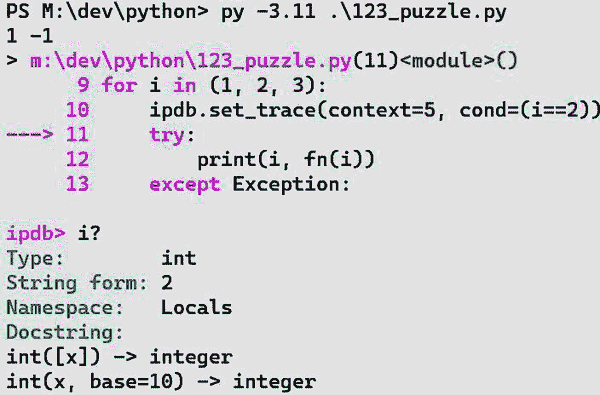
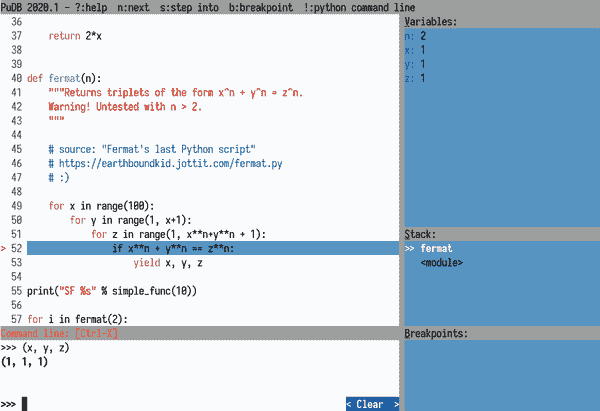
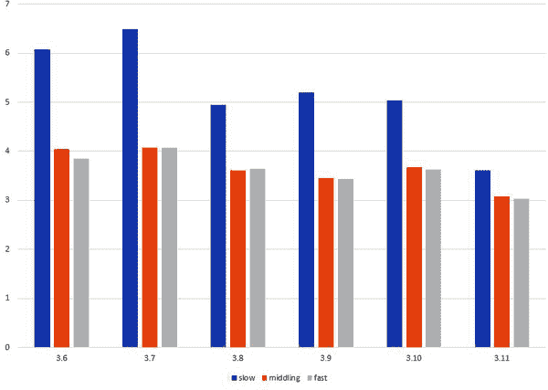

# 第十七章。测试、调试和优化

编程任务完成并不意味着你写完了代码；只有当代码正确运行并且性能可接受时，任务才算真正完成。*测试*意味着在已知条件下自动运行代码，并检查结果是否符合预期，以验证代码是否正确运行。*调试*则是发现不正确行为的原因并修复它们（一旦找到原因，修复通常很容易）。

*优化*通常作为确保性能可接受的活动的总称。优化包括*基准测试*（为给定任务测量性能，以确保其在可接受范围内）、*性能分析*（在程序中插入额外代码以识别性能瓶颈）和实际优化（消除瓶颈以提高程序性能）。显然，除非通过性能分析找到了性能瓶颈的位置，否则无法消除性能瓶颈，而要找到性能瓶颈，则需要知道是否存在性能问题（通过基准测试获知）。

本章按照开发中的自然顺序进行讨论：首先是测试，其次是调试，最后是优化。大多数程序员通常将热情集中在优化上：测试和调试经常（错误地！）被视为苦差事，而优化则被认为是有趣的。如果你只打算读本章的一部分，我们建议你阅读“开发足够快速的 Python 应用程序”，该节总结了 Python 优化的方法——与 Jackson 经典的“[优化法则](https://oreil.ly/_dTA8)：法则 1\. 不要优化。法则 2（仅限专家）。暂时不要优化。”相近。

所有这些任务都很重要；每个任务的讨论都至少能填满一本书。本章甚至无法详尽探讨每个相关技术；它着重于 Python 特定的方法和工具。通常情况下，为了取得最佳效果，你应该从*系统分析和设计*的更高层视角来解决问题，而不仅仅专注于实现（无论是 Python 还是其他编程语言的混合）。首先，可以通过学习如 Alan Dennis、Barbara Wixom 和 Roberta Roth 合著的《Systems Analysis and Design》（Wiley 出版）等优秀的通用书籍入手。

# 测试

在这一章中，我们区分了两种不同类型的测试：*单元测试* 和 *系统测试*。测试是一个丰富而重要的领域：还可以做更多的区分，但我们专注于大多数软件开发者最关心的问题。许多开发者不愿意花时间进行测试，认为这是从“真正”的开发中偷走的时间，但这是短视的：在早期发现问题时更容易修复代码。花费额外的时间开发测试将充分回报自己，因为您早期发现缺陷，节省了后续软件开发周期中需要的大量调试时间。¹

## 单元测试和系统测试

*单元测试* 意味着编写和运行测试来执行单个模块，甚至更小的单元，例如类或函数。*系统测试*（也称为*功能*、*集成*或*端到端*测试）涉及使用已知输入运行整个程序。一些经典的测试书籍还在白盒测试（具有程序内部知识进行的测试）与黑盒测试（没有此类知识进行的测试）之间划分。这种经典观点与现代单元与系统测试的观点类似，但并非完全相同。

单元测试和系统测试有不同的目标。单元测试随着开发进程同时进行；您可以并且应该在开发每个单元时进行测试。一种比较现代的方法（首次在 1971 年由杰拉尔德·温伯格在他的经典著作 *计算机编程心理学* [Dorset House] 中提出）被称为*测试驱动开发*（TDD）：对于程序必须具备的每个特性，您首先编写单元测试，然后再编写实现该特性并使测试通过的代码。TDD 可能看起来颠倒了，但它有优势；例如，它确保您不会漏掉某些功能的单元测试。这种方法有助于您首先专注于某个函数、类或方法应该完成的确切*任务*，仅在此后处理如何实现该函数、类或方法。沿着 TDD 的思路的一项创新是[*行为驱动开发*（BDD）](http://behavior-driven.org)。

要测试一个单元——它可能依赖于尚未完全开发的其他单元——通常需要编写*存根*，也称为*模拟*：各种单元接口的虚假实现，在需要测试其他单元的情况下提供已知的正确响应。模拟模块（Python 标准库的一部分，位于包 [unittest](https://oreil.ly/iJJMn) 中）帮助您实现这些存根。

系统测试在后面进行，因为它需要系统的存在，且至少有一部分系统功能（基于单元测试）被认为是正常工作的。系统测试提供了一种健壮性检查：程序中的每个模块都正常工作（通过单元测试），但整个程序是否正常工作呢？如果每个单元都没问题，但系统不正常，那么问题就在于单元之间的集成——单元的协作方式。因此，系统测试也被称为集成测试。

系统测试类似于在生产环境中运行系统，除了你提前固定输入，这样你可能发现的问题就容易重现了。系统测试中的故障成本低于生产环境中的故障，因为系统测试的输出不会用于决策、服务客户、控制外部系统等等。相反，系统测试的输出会系统地与系统*应该*生成的输出进行比较，前提是已知输入。其目的是以廉价且可重现的方式，找出程序*应该*做的事情和程序实际*做*的事情之间的差异。

系统测试发现的故障（就像生产环境中的系统故障一样）可能会暴露单元测试中的缺陷，以及代码中的缺陷。单元测试可能不足够：一个模块的单元测试可能未能测试模块的所有必需功能。在这种情况下，需要加强单元测试。*在*你更改代码以修复问题之前，先做这个，然后运行新的增强单元测试，确认它们现在显示了问题。然后修复问题，再次运行单元测试，以确认它们不再显示问题。最后，重新运行系统测试，以确认问题确实已经解决。

# 错误修复最佳实践

这一最佳实践是我们毫无保留推荐的测试驱动设计的一个具体应用：在添加能够揭示错误的单元测试之前，绝不要修复一个错误。这为防止[软件回归错误](https://oreil.ly/msmPd)提供了一个很好的、廉价的保险。

通常，系统测试中的故障会揭示开发团队内部的通信问题：³一个模块正确实现了某种功能，但另一个模块期望不同的功能。这种问题（严格意义上的集成问题）在单元测试中很难定位。在良好的开发实践中，单元测试必须经常运行，因此它们运行速度必须很快。因此，在单元测试阶段，至关重要的是每个单元都能假设其他单元是正常工作且按预期工作的。

在开发的相对后期运行单元测试时，如果系统架构是分层的（这是一种常见且合理的组织方式），可以揭示集成问题。在这样的架构中，低级模块不依赖于其他模块（除了库模块，通常可以假设是正确的），因此这些低级模块的单元测试如果完备的话，就足以提供正确性的信心。高级模块依赖于低级模块，因此也依赖于正确理解每个模块期望和提供的功能。对高级模块进行完整的单元测试（使用真正的低级模块，而不是存根）可以测试模块之间的接口，以及高级模块本身的代码。

因此，高级模块的单元测试有两种运行方式。在开发的早期阶段，当低级模块尚未准备好或者后来仅需要检查高级模块的正确性时，使用低级模块的存根来运行测试。在开发的后期阶段，还会定期使用真正的低级模块运行高级模块的单元测试。通过这种方式，可以检查从高级到低级的整个子系统的正确性。即使在这种有利的情况下，你仍然需要运行系统测试，以确保检查系统的所有功能是否被使用，并且没有忽略模块之间的任何接口。

系统测试类似于以正常方式运行程序。你只需要特殊支持来确保提供已知输入并捕获预期输出以进行比较。对于在文件上执行 I/O 的程序，这很容易，但对于依赖 GUI、网络或其他与外部实体通信的程序来说则更为困难。要模拟这些外部实体并使它们可预测和完全可观察，通常需要依赖平台相关的基础设施。系统测试的另一个有用的支持基础设施是*测试框架*，用于自动运行系统测试，并记录成功和失败。这样的框架还可以帮助测试人员准备一系列已知输入及其对应的预期输出。

这些目的都有免费和商业程序，并且通常不依赖于系统测试中使用的编程语言。系统测试与经典的黑盒测试密切相关：这种测试独立于被测试系统的实现（特别是独立于用于实现的编程语言）。而测试框架通常依赖于它们运行的操作系统平台，因为它们执行的任务是平台相关的。这些任务包括：

+   运行带有指定输入的程序

+   捕获它们的输出

+   模拟/捕获 GUI、网络和其他进程间通信的 I/O

由于系统测试的框架取决于平台，而不是编程语言，因此我们在本书中不再详细介绍它们。有关 Python 测试工具的全面列表，请参阅 Python [wiki](https://oreil.ly/5RiTF)。

## doctest 模块

`doctest` 模块旨在让您在代码的文档字符串中创建良好的示例，检查这些示例确实生成了文档字符串所展示的结果。doctest 通过查找文档字符串中的交互式 Python 提示符 `>>>` 来识别这些示例，后跟同一行上的 Python 语句，并且语句的预期输出在接下来的行中。

开发模块时，请保持文档字符串的更新，并用示例丰富它们。每当模块的一部分（例如函数）准备好或部分准备好时，请养成向其文档字符串添加示例的习惯。将模块导入交互式会话，并使用刚开发的部分提供示例，包括典型案例、极限案例和失败案例的混合。仅为此特定目的使用 **from** *module* **import** *，以便您的示例不会为每个模块提供的名称加前缀 *module*。将交互式会话复制并粘贴到编辑器中的文档字符串中，调整任何错误，然后几乎完成。

现在您的文档已经丰富了示例，读者将更容易地跟随它（假设您选择了一些良好的示例混合，明智地加入非示例文本）。确保您对整个模块以及导出的每个函数、类和方法都有文档字符串和示例。您可以选择跳过名称以 _ 开头的函数、类和方法，因为（正如它们的名称所示）它们是私有实现细节；默认情况下，doctest 会忽略它们，您的模块源代码的读者也应该如此。

# 使您的示例符合现实

与代码不匹配的示例比毫无用处更糟糕。文档和注释仅在与现实匹配时才有用；“撒谎”的文档和注释可能会造成严重损害。

随着代码的更改，文档字符串和注释通常会变得过时，从而成为误导信息，不利于源代码的读者。最好的选择是根本没有注释和文档字符串，尽管这样的选择会很差劲，而不是有虚假信息的注释和文档字符串。doctest 可以通过运行和检查文档字符串中的示例来帮助您。如果 doctest 运行失败，应提示您审查包含失败示例的文档字符串，从而提醒您保持整个文档字符串的更新。

在模块源的末尾插入以下片段：

```py
`if` __name__ == '__main__':
 `import` doctest
    doctest.testmod()
```

当你将模块作为主程序运行时，此代码会调用 doctest 模块的 testmod 函数。testmod 会检查文档字符串（模块的文档字符串以及所有公共函数、类和方法的文档字符串）。在每个文档字符串中，testmod 会找到所有示例（通过查找解释器提示符 >>> 的出现，可能会先于空格），并运行每个示例。testmod 检查每个示例的结果是否与示例之后的文档字符串中给出的输出相匹配。在出现异常时，testmod 会忽略回溯，并只检查预期和观察到的错误消息是否相等。

当一切顺利时，testmod 会悄无声息地终止。否则，它会输出关于失败的示例的详细信息，显示预期和实际输出。示例 17-1 展示了 doctest 在 *mod.py* 模块上运行的典型示例。

##### 示例 17-1\. 使用 doctest

```py
*`"""`*
*`This module supplies a single function reverse_words that reverses`*
*`a string word by word.`*

*`>>> reverse_words('four score and seven years')`*
*`'years seven and score four'`*
*`>>> reverse_words('justoneword')`*
*`'justoneword'`*
*`>>> reverse_words('')`*
*`''`*

*`You must call reverse_words with a single argument, a string:`*

*`>>> reverse_words()`*
*`Traceback (most recent call last):`*
 *`...`*
*`TypeError: reverse_words() missing 1 required positional argument: 'astring'`*
*`>>> reverse_words('one', 'another')`*
*`Traceback (most recent call last):`*
 *`...`*
*`TypeError: reverse_words() takes 1 positional argument but 2 were given`*
*`>>> reverse_words(1)`*
*`Traceback (most recent call last):`*
 *`...`*
*`AttributeError: 'int' object has no attribute 'split'`*
*`>>> reverse_words('𝒰𝓷𝓲𝓬𝓸𝓭𝓮 is all right too')`*
*`'too right all is 𝒰𝓷𝓲𝓬𝓸𝓭𝓮'`*

*`As a side effect, reverse_words eliminates any redundant spacing:`*

*`>>> reverse_words('with  redundant   spacing')`*
*`'spacing redundant with'`*
*`"""`*

`def` reverse_words(astring):
    words = astring.split()
    words.reverse()
    `return` ' '.join(words)

`if` __name__ == '__main__':
    `import` doctest
    doctest.testmod()
```

在此模块的文档字符串中，我们从文档字符串中剪切了回溯，并用省略号 (...) 替换了它们：这是一个良好的做法，因为 doctest 会忽略回溯，回溯对于失败的情况没有任何解释价值。除了这个剪切之外，文档字符串是交互式会话的复制粘贴，加上一些解释性文本和空行以提高可读性。将此源保存为 *mod.py*，然后用 **python mod.py** 运行它。它不会产生任何输出，这意味着所有示例都运行正确。尝试 **python mod.py -v** 以获取它尝试的所有测试情况，并在最后获取详细摘要。最后，修改模块文档字符串中的示例结果，使其不正确，以查看 doctest 为错误示例提供的消息。

虽然 doctest 并非用于通用单元测试，但很容易诱人将其用于此目的。在 Python 中进行单元测试的推荐方法是使用测试框架，如 unittest、pytest 或 nose2（在下面的章节中介绍）。但是，使用 doctest 进行单元测试可能更容易且更快速，因为它几乎只需要从交互式会话中复制粘贴。如果你需要维护一个缺乏单元测试的模块，通过 doctest 将这些测试添加到模块中是一个合理的短期折衷方案，作为第一步。与其完全没有单元测试，不如只使用基于 doctest 的单元测试，否则你可能会决定从一开始就用 unittest 正确地设置测试需要花费太长时间。⁴

如果您决定使用 doctest 进行单元测试，请不要将额外的测试内容塞入模块的文档字符串中。这样会破坏文档字符串，使其过长且难以阅读。保留文档字符串中正确数量和类型的示例，严格用于解释目的，就像单元测试不在考虑范围内一样。而是将额外的测试内容放入模块的全局变量中，一个名为 __test__ 的字典。__test__ 中的键是用作任意测试名称的字符串；相应的值是 doctest 获取并像使用文档字符串一样使用的字符串。__test__ 中的值也可以是函数和类对象，在这种情况下，doctest 会检查它们的文档字符串以运行测试。这种后一种功能是运行 doctest 的便捷方式，可用于具有私有名称的对象，这些对象默认情况下 doctest 会跳过。

doctest 模块还提供了两个函数，这些函数基于 doctest 返回 unittest.TestSuite 类的实例，因此您可以将这些测试集成到基于 unittest 的测试框架中。有关此高级功能的完整文档可在线查看[online](https://oreil.ly/cbdu8)。

## unittest 模块

unittest 模块是由 Kent Beck 为 Smalltalk 最初开发的单元测试框架的 Python 版本。类似的，广泛使用的框架版本也存在于许多其他编程语言中（例如，Java 的 JUnit 包），通常被统称为 xUnit。

要使用 unittest，请不要将测试代码放在与被测试模块相同的源文件中：而是为每个要测试的模块编写一个单独的测试模块。一个流行的约定是将测试模块命名为要测试的模块的名称，以'test_'为前缀，并将其放在名为*test*的源目录的子目录中。例如，*mod.py*的测试模块可以是*test/test_mod.py*。一个简单而一致的命名约定有助于编写和维护辅助脚本，以查找并运行包的所有单元测试。

在模块的源代码与其单元测试代码之间进行分离可以更轻松地重构模块，甚至可能在不干扰单元测试代码的情况下在 C 中重新编码一些功能。知道*test_mod.py*保持不变，无论您对*mod.py*做了哪些更改，都可以增强您对在更改后*test_mod.py*中通过测试指示*mod.py*仍然正确工作的信心。

单元测试模块定义了 unittest 的 TestCase 类的一个或多个子类。每个这样的子类通过定义*测试用例方法*来指定一个或多个测试用例：这些方法可以无参数调用，并且其名称以 test 开头。

通常，子类会重写 setUp 方法，这是框架在每个测试用例之前调用以准备新实例的方法，并且通常也会重写 tearDown 方法，这是框架在每个测试用例之后调用以清理事物的方法；整个设置/清理安排被称为*测试夹具*。

每个测试用例都在`TestCase`类的实例上调用以`assert`开头的方法，以表达测试必须满足的条件。unittest 在`TestCase`子类内以任意顺序运行测试用例方法，每个测试用例在子类的新实例上运行，在每个测试用例之前运行`setUp`，在每个测试用例之后运行`tearDown`。

# 使用`setUp`时需要使用`addCleanup`

当`setUp`传播异常时，`tearDown`不会执行。因此，当`setUp`准备了几个需要最终清理的事情，并且一些准备步骤可能导致未捕获的异常时，不应依赖`tearDown`进行清理工作。相反，在每个准备步骤成功之后立即调用`self.addCleanup(*f*, **a*, ***k*)`，传递一个清理可调用的`*f*`（以及可选的`*f*`的位置参数和命名参数）。在这种情况下，`*f*(**a*, ***k*)`会在测试用例之后被调用（当`setUp`不传播异常时在`tearDown`之后，但无条件地，即使`setUp`传播异常时也会调用），因此必要的清理代码始终会执行。

unittest 提供其他功能，例如将测试用例分组到测试套件中，每个类和每个模块的固件，测试发现以及其他更高级的功能。除非您正在构建一个基于 unittest 的自定义单元测试框架，或者至少正在为同样复杂的软件包构建复杂的测试程序，否则您不需要这些额外功能。在大多数情况下，本节介绍的概念和细节足以执行有效和系统化的单元测试。示例 17-2 演示了如何使用 unittest 为示例 17-1 的模块*mod.py*提供单元测试。这个例子纯粹是为了演示目的，使用 unittest 执行与示例 17-1 中在文档字符串中使用 doctest 作为示例的完全相同的测试。

##### 示例 17-2. 使用 unittest

```py
"""This module tests function reverse_words
provided by module mod.py."""
`import` unittest
`import` mod

`class` ModTest(unittest.TestCase):

    `def` testNormalCaseWorks(self):
        self.assertEqual(
            'years seven and score four',
            mod.reverse_words('four score and seven years'))

    `def` testSingleWordIsNoop(self):
        self.assertEqual(
            'justoneword',
            mod.reverse_words('justoneword'))

    `def` testEmptyWorks(self):
        self.assertEqual('', mod.reverse_words(''))

    `def` testRedundantSpacingGetsRemoved(self):
        self.assertEqual(
            'spacing redundant with',
            mod.reverse_words('with   redundant   spacing'))

    `def` testUnicodeWorks(self):
        self.assertEqual(
            'too right all is 𝒰𝓷𝓲𝓬𝓸𝓭𝓮'
            mod.reverse_words('𝒰𝓷𝓲𝓬𝓸𝓭𝓮 is all right too'))

    `def` testExactlyOneArgumentIsEnforced(self):
        `with` self.assertRaises(TypeError):
            mod.reverse_words('one', 'another')

    `def` testArgumentMustBeString(self):
        `with` self.assertRaises((AttributeError, TypeError)):
            mod.reverse_words(1)

`if` __name__=='__main__':
    unittest.main()
```

使用**python** **test/test_mod.py**（或者等价地，**python** **-m test.test_mod**）运行此脚本比使用**python mod.py**运行 doctest 稍微复杂一点。*test_mod.py*对于它运行的每个测试用例输出一个`.`（点），然后是一行破折号分隔线，最后是一个摘要行，例如“在 0.110s 内运行了 7 个测试”，如果每个测试都通过，则最后一行是“OK”。

每个测试用例方法都调用一个或多个以`assert`开头的方法。在这里，没有方法调用超过一个这样的调用；然而，在更复杂的情况下，从单个测试用例方法调用多个`assert`方法是常见的。

即使在这种简单的情况下，一个小方面也表明，对于单元测试，unittest 比 doctest 更强大、更灵活。 在 testArgumentMustBeString 方法中，我们将一对异常类作为 assertRaises 的参数传递，这意味着我们接受任何一种异常。 *test_mod.py* 因此将这些视为 *mod.py* 的有效多个实现。 它接受 示例 17-1 中的实现，该示例尝试在其参数上调用 split 方法，因此在用非字符串参数调用时引发 AttributeError。 但是，它也接受了一个不同的假设实现，当使用错误类型的参数调用时引发 TypeError。 使用 doctest 可以编写此类检查，但这将是笨拙和不明显的，而 unittest 则使其变得简单和自然。

这种灵活性对于现实生活中的单元测试至关重要，某种程度上它们是其模块的可执行规范。 你可以悲观地认为，对于测试的灵活性的需要意味着你正在测试的代码的接口没有定义好。 但是，最好将接口视为具有对于实现者来说有用的灵活性：在情况 *X*（在这个例子中传递给函数 reverse_words 的无效类型的参数）下，两种情况（引发 AttributeError 或 TypeError）都是允许的。

因此，具有这两种行为之一的实现都是正确的：实现者可以根据诸如性能和清晰度等考虑因素之间进行选择。 从这种方式来看——作为其模块的可执行规范（现代观点，以及测试驱动开发的基础），而不是作为严格限定在特定实现上的白盒测试（如某些传统测试分类中）——单元测试成为软件开发过程中更加重要的组成部分。

### TestCase 类

使用 unittest，您可以通过扩展 TestCase 编写测试用例，添加不带参数的方法，其名称以 test 开头。 这些测试用例方法反过来调用从 TestCase 继承的方法，其名称以 assert 开头，以指示必须满足的条件，以使测试成功。

TestCase 类还定义了两个方法，您的类可以选择性地覆盖以分组执行每个测试用例方法之前和之后的操作。 这并没有耗尽 TestCase 的功能，但除非您正在开发测试框架或执行其他高级任务，否则您不需要其余部分。 表 17-1 列出了 TestCase 实例 *t* 的经常调用方法。

表 17-1\. TestCase 实例 t 的方法

| a⁠s⁠s⁠e⁠r⁠t⁠A⁠l⁠m⁠o⁠s⁠t​E⁠q⁠u⁠a⁠l | assertAlmostEqual(*first*, *second*, places=7, msg=**None**) 当*first* != *second*到小数点 places 位时失败并输出 msg；否则，什么也不做。此方法比 assertEqual 更适合比较浮点数，因为它们是可能在不重要的小数位数上有所不同的近似值。在测试失败时生成诊断消息时，unittest 会假定*first*是期望的值，*second*是观察到的值。 |
| --- | --- |
| assertEqual | assertEqual(*first*, *second*, msg=**None**) 当*first* != *second*时失败并输出 msg；否则，什么也不做。在测试失败时生成诊断消息时，unittest 会假定*first*是期望的值，*second*是观察到的值。 |
| assertFalse | assertFalse(*condition*, msg=None) 当*condition*为真时失败并输出 msg；否则，什么也不做。 |
| assertNotAlm⁠o⁠s⁠t​E⁠q⁠u⁠al | assertNotAlmostEqual(*first*, *second*, places=7, msg=**None**) 当*first* == *second*到小数点 places 位时失败并输出 msg；否则，什么也不做。 |
| assertNotEqual | assertNotEqual(*first*, *second*, msg=**None**) 当*first* == *second*时失败并输出 msg；否则，什么也不做。 |

| assertRaises | assertRaises(*exceptionSpec*, *callable*, **args*, ***kwargs*) 调用*callable*(**args*, ***kwargs*)。调用未引发任何异常时失败。当调用引发不符合*exceptionSpec*的异常时，assertRaises 传播异常。当调用引发符合*exceptionSpec*的异常时，assertRaises 什么也不做。*exceptionSpec*可以是异常类或类元组，就像**try**/**except**语句中**except**子句的第一个参数一样。

使用 assertRaises 的首选方式是作为上下文管理器——也就是说，在`with`语句中：

```py
`with` self.assertRaises(*`exceptionSpec`*):
 *`# ...a block of code...`*
```

这里，缩进在`with`语句中的代码块执行，而不仅仅是调用*callable*带有特定参数。期望（避免构造失败）是代码块引发符合给定异常规范（异常类或类元组）的异常。这种替代方法比传递可调用对象更通用和可读。 |

| a⁠s⁠s⁠e⁠r⁠t⁠R⁠a⁠i⁠s⁠e⁠s​R⁠e⁠g⁠e⁠x | assertRaisesRegex(*exceptionSpec*, *expected_regex*, *callable*, **args*, ***kwargs*) 就像`assertRaises`，但还检查异常的错误消息是否与*regex*匹配；*regex*可以是正则表达式对象或要编译成一个的字符串模式，测试（当引发预期异常时）通过调用 RE 对象上的 search 检查错误消息。

就像`assertRaises`一样，`assertRaisesRegex`最好作为上下文管理器使用——也就是说，在`with`语句中：

```py
`with` self.assertRaisesRegex(*`exceptionSpec``,` `regex`*):
 *`# ...a block of code...`*
```

|

| enterContext | enterContext(ctx_manager) 3.11+ 在 TestCase.setup() 方法中使用此调用。返回调用 ctx_manager.__enter__ 的值，并将 ctx_manager.__exit__ 添加到清理方法列表中，框架在 TestCase 清理阶段运行这些方法。 |
| --- | --- |

| fail | fail(msg=**None**) 无条件失败并输出 msg。例如代码段可能是：

```py
`if` `not` complex_check_if_its_ok(some, thing):
    self.fail(
      'Complex checks failed on'
      f' {some}, {thing}'
    )
```

|

| setUp | setUp() 框架在调用每个测试用例方法之前调用 *t*.setUp()。在 TestCase 中的 setUp 不执行任何操作；它存在只是为了让你的类在需要为每个测试准备一些东西时重写这个方法。 |
| --- | --- |
| subTest | subTest(msg*=***None**, ***k*) 返回一个上下文管理器，可以在测试方法内定义测试的部分。当一个测试方法使用不同的参数多次运行相同的测试时，使用 subTest 可以确保所有情况都会运行，即使其中一些失败或引发异常。 |
| tearDown | tearDown() 框架在每个测试用例方法后调用 *t*.tearDown()。TestCase 类中的 tearDown 不执行任何操作；它存在只是为了让你的类在需要在每个测试后执行一些清理操作时重写这个方法。 |

此外，一个 TestCase 实例维护一个 *清理函数* 的后进先出（LIFO）栈。当你的一个测试中的代码（或者在 setUp 中）执行需要清理的操作时，请调用 self.addCleanup，传递一个清理可调用函数 *f*，以及可选的位置参数和命名参数 *f*。要执行堆叠的清理操作，你可以调用 doCleanups；然而，框架本身会在 tearDown 后调用 doCleanups。表 17-2 列出了一个 TestCase 实例 *t* 的两个清理方法的签名。

表 17-2\. TestCase 实例 t 的清理方法

| addCleanup | addCleanup(*func*, **a*, ***k*) 将 (*func*, *a*, *k*) 添加到清理列表的末尾。 |
| --- | --- |

| doCleanups | doCleanups() 执行所有已堆叠的清理操作。实质上等同于：

```py
`while` self.list_of_cleanups:
    func, a, k = self.list_of_cleanups.pop()
    func(*a, **k)
```

对于假设的栈 self.list_of_cleanups，当然还包括错误检查和报告。 |

### 单元测试处理大量数据

单元测试必须快速，因为开发过程中应经常运行它们。因此，在可能的情况下，对模块的每个方面进行小数据量的单元测试。这样可以使单元测试更快，并允许您将数据嵌入到测试的源代码中。当您测试从文件对象读取或写入的函数时，对于文本文件使用 io.TextIO 类的实例（或对于二进制文件使用 io.BytesIO 类的实例，如 “内存中的文件：io.StringIO 和 io.BytesIO” 中所述），以获得包含数据的内存中文件：这种方法比写入磁盘快，并且不需要清理（在测试后删除磁盘文件）。

在罕见的情况下，可能无法在不提供和/或比较大量数据的情况下执行模块的功能。在这种情况下，您的单元测试必须依赖于辅助的外部数据文件来保存供模块测试所需的数据以及需要比较的输出数据。即便如此，我们通常建议使用上述 io 类的实例，而不是直接让被测试的模块执行真实的磁盘 I/O。更重要的是，我们强烈建议通常使用存根来单元测试与外部实体交互的模块，例如数据库、GUI 或通过网络与其他程序交互的模块。使用存根而不是真实的外部实体进行测试可以更容易地控制测试的各个方面。另外，再次强调，测试单元的运行速度非常重要，使用存根执行模拟操作比使用真实操作更快。

# 通过提供种子使测试的随机性可重现

如果您的代码使用伪随机数（例如在 “random 模块” 中介绍的内容），您可以通过确保其“随机”行为是可重现的，使其更容易测试：具体来说，确保您的测试可以轻松调用 random.seed 并使用已知的参数，以便生成的伪随机数是完全可预测的。当您使用伪随机数来设置测试的输入时，这一点同样适用：默认应使用已知的种子来生成大多数测试，仅在特定技术（如 [fuzzing](https://oreil.ly/C17DL)）中才更改种子。

## 使用 nose2 进行测试

nose2 是一个可通过 pip 安装的第三方测试实用工具和框架，它构建在 unittest 之上，提供额外的插件、类和装饰器，以帮助编写和运行测试套件。nose2 会在项目中“嗅探”出测试用例，通过查找以 *test*.py* 命名的文件中存储的 unittest 测试用例来构建其测试套件。

这里有一个示例，展示了如何使用 nose2 的 params 装饰器将数据参数传递给测试函数：

```py
`import` unittest
`from` nose2.tools `import` params

`class` TestCase(unittest.TestCase):

    @params((5, 5), (-1, 1), ('a', `None`, TypeError))
    `def` test_abs_value(self, x, expected, should_raise=`None`):
        `if` should_raise `is` `not` `None`:
            `with` self.assertRaises(should_raise):
                abs(x)
        `else`:
            assert abs(x) == expected
```

nose2 还包括额外的装饰器，如上下文管理器来定义测试函数组，并且一个插件框架来提供测试元函数，例如日志记录、调试和覆盖报告。更多信息请参阅 [在线文档](https://oreil.ly/oFTIV)。

## 使用 pytest 进行测试

pytest 模块是一个可通过 pip 安装的第三方单元测试框架，它会检查项目的模块以查找 *test_*.py* 或 **_test.py* 文件中以 test 开头的方法名称的测试用例。与内置的 unittest 框架不同，pytest 不要求测试用例扩展任何测试类层次结构；它运行发现的测试方法，这些方法使用 Python 的 **assert** 语句来确定每个测试的成功或失败。⁵ 如果测试引发除 AssertionError 外的任何异常，则表示测试中存在错误，而不仅仅是简单的测试失败。

pytest 提供了一些辅助方法和装饰器来简化编写单元测试，而不是使用测试用例类的层次结构。最常用的方法列在 表 17-3 中；请参阅 [在线文档](https://oreil.ly/a0WBi) 获取更完整的方法列表和可选参数。

表 17-3\. 常用 pytest 方法

| approx | approx(*float_value*) 用于支持对浮点数值进行比较的断言。*float_value* 可以是单个值或值序列：

```py
`assert` 0.1 + 0.2 == approx(0.3)
`assert` [0.1, 0.2, 0.1+0.2] == approx([0.1, 0.2, 0.3])
```

|

| fail | fail(*failure_reason*) 强制当前测试失败。比注入 **assert False** 语句更明确，但在其他方面等效。 |
| --- | --- |
| raises | raises(*expected_exception*, match=regex_match) 上下文管理器，除非其上下文引发了一个 *exc*，使得 isinstance(*exc*, *expected_exception*) 为真。当给定 match 时，除非 *exc* 的字符串表示也与 re.search(match, str(*exc*)) 匹配，否则测试失败。 |
| skip | skip(*skip_reason*) 强制跳过当前测试；例如，在先前的测试已经失败时使用。 |
| warns | warns(*expected_warning*, match*=regex_match*) 类似于 *raises*，用于包装测试预期警告是否被触发的代码。 |

pytest.mark 子包含有装饰器，可以用来“标记”测试方法，赋予其额外的测试行为，包括在 表 17-4 中列出的方法。

表 17-4\. pytest.mark 子包中的装饰器

| parametrize | @parametrize(*args_string*, *arg_test_values*) 调用装饰的测试方法，将逗号分隔列表 *args_string* 中命名的参数设置为 *arg_test_values* 中每个参数元组的值。

以下代码运行 test_is_greater 两次，一次为 x=1, y=0，expected=**True**；另一次为 x=0, y=1，expected=**False**。

```py
@pytest.mark.parametrize
("x,y,expected", 
 [(1, 0, `True`), (0, 1, `False`)])
`def` test_is_greater(x, y, expected):
`assert` (x > y) == expected
```

|

| skip, skipif | @skip(*skip_reason*), @skipif(*condition*, *skip_reason*)

可选地根据一些全局条件跳过测试方法。 |

# 调试

由于 Python 的开发周期很快，通常调试的最有效方式是编辑代码，在关键点输出相关信息。Python 提供了许多方法，让您的代码探索自身状态，提取可能与调试相关的信息。具体支持此类探索的是 inspect 和 traceback 模块，这也被称为*反射*或*内省*。

一旦您有与调试相关的信息，打印通常是显示它的自然方式（pprint，详见“pprint 模块”，通常也是一个很好的选择）。然而，将调试信息记录到文件中通常更好。对于无人看管运行的程序（例如服务器程序），记录日志非常有用。显示调试信息就像显示其他信息一样，如第十一章所述。记录此类信息就像写入文件一样（在同一章节中讨论）；但是，Python 的标准库提供了一个记录模块，详见“logging 模块”，以帮助处理此频繁任务。如表 8-3 中所述，通过在 sys 模块中重新绑定 excepthook，您的程序可以在以传播异常终止之前记录错误信息。

Python 还提供了启用交互式调试的钩子。pdb 模块提供了一个简单的文本模式交互式调试器。其他强大的 Python 交互式调试器包含在诸如 IDLE 和各种商业软件提供的 IDE 中，如“Python 开发环境”所述；本书不进一步介绍这些高级调试器。

## 在您开始调试之前

在您开始漫长的调试探索之前，请确保使用第二章中提到的工具彻底检查了您的 Python 源代码。这些工具仅捕获代码中的一部分 bug，但比交互式调试快得多：它们的使用绝对物有所值。

再次在开始调试会话之前，请确保所有涉及的代码都有充分的单元测试覆盖，如“unittest 模块”中所述。正如本章前面提到的，一旦找到 bug，*在*修复之前，请为您的单元测试套件（或者如果必要，系统测试套件）添加一两个测试，这些测试如果从一开始就存在，本应能发现该 bug，并再次运行测试以确认它们现在能够揭示和隔离该 bug；只有在完成这些步骤之后，才能继续修复该 bug。定期遵循此过程将帮助您学会编写更好、更彻底的测试，确保最终拥有更健壮的测试套件，并对代码的*持久*正确性更有信心。

记住，即使 Python 及其标准库以及你喜欢的任何 IDE 提供了所有的设施，调试仍然*很难*。在你开始设计和编码之前，请考虑写并运行大量的单元测试，并保持你的设计和代码*简单*，以尽量减少你需要进行的调试工作！Brian Kernighan 提供了这个经典建议：“调试比一开始编写代码难两倍。因此，如果你把代码写得越聪明，你就越不能够调试它。”这也是为什么“聪明”一词在描述 Python 代码或程序员时并不是一个正面词语的部分。

## inspect 模块

inspect 模块提供了获取各种对象信息的函数，包括 Python 调用堆栈（记录当前正在执行的所有函数调用）和源文件。inspect 的最常用函数列在表 17-5 中。

表 17-5\. inspect 模块的有用函数

| currentframe | currentframe() 返回当前函数的帧对象（调用 currentframe 的函数的调用者）。formatargvalues(*getargvalues(currentframe()))，例如，返回表示调用函数参数的字符串。 |
| --- | --- |
| getargspec, formatargspec | getargspec(*f*) -3.11 在 Python 3.5 中弃用，在 Python 3.11 中移除。检查可调用对象的前向兼容方法是调用 inspect.signature(*f*)并使用 inspect.Signature 类的实例（在以下小节中介绍）。 |

| get⁠a⁠r⁠g​v⁠a⁠l⁠ues, formatargvalues | getargvalues(*f*) *f*是一个帧对象，例如，是 sys 模块中 _getframe 函数调用（在“帧类型”中涵盖）的结果，或者是 inspect 模块中 currentframe 函数的调用结果。getargvalues 返回一个具有四个条目的命名元组：(*args*, *varargs*, *keywords*, *locals*)。*args*是*f*函数参数名称的序列。*varargs*是形如**a*的特殊参数的名称，或者当*f*函数没有这样的参数时为**None**。*keywords*是形如***k*的特殊参数的名称，或者当*f*函数没有这样的参数时为**None**。*locals*是*f*的本地变量字典。由于参数特别是本地变量，因此可以通过将参数名称与*locals*字典索引结合来获取每个参数的值。

formatargvalues 接受一个到四个参数，与 getargvalues 返回的命名元组的项目相同，并返回带有此信息的字符串。formatargvalues(*getargvalues(*f*))返回带有*f*参数的字符串，用括号括起来，并以调用语句中使用的命名形式表示。例如：

```py
`def` f(x=23):
    `return` inspect.currentframe()
print(inspect.formatargvalues(
      *inspect.getargvalues(f())))
*`# prints:`* *`(x=23)`*
```

|

| getdoc | getdoc(*obj*) 返回*obj*的文档字符串，一个多行字符串，其中制表符扩展为空格，并且每行的冗余空格被剥离。 |
| --- | --- |

| getfile, getsourcefile | getfile(*obj*)，getsourcefile(*obj*)

getfile 返回定义 *obj* 的二进制或源文件的名称。在无法确定文件时（例如，*obj* 是内置对象），会引发 TypeError。getsourcefile 返回定义 *obj* 的源文件的名称；当只能找到二进制文件而非相应的源文件时，会引发 TypeError。 |

| getmembers | getmembers(*obj*, filter=**None**) 返回 *obj* 的所有属性（成员），包括数据和方法（包括特殊方法），以 (*name*, *value*) 对的排序列表形式返回。当 filter 不为 **None** 时，仅返回过滤器在属性的 *value* 上调用时返回真值的属性，相当于：

```py
((n, v) `for` n, v `in` getmembers(obj) 
        `if` filter(v))
```

|

| getmodule | getmodule(*obj*) 返回定义 *obj* 的模块，或者在无法确定时返回 **None**。 |
| --- | --- |

| getmro | getmro(*c*) 返回类 *c* 的基类和祖先类的方法解析顺序（详见 “继承”）。元组的第一项是 *c*，每个类在元组中只出现一次。例如：

```py
`class` A: `pass`
`class` B(A): `pass`
`class` C(A): `pass`
`class` D(B, C): `pass`
`for` c `in` inspect.getmro(D):
    print(c.__name__, end=' ')
*`# prints: D B C A object`*
```

|

| getsource, getsourcelines | getsource(*obj*)，getsourcelines(*obj*)

getsource 返回一个多行字符串，这是 *obj* 的源代码，并在无法确定或获取时引发 IOError。getsourcelines 返回一个对：第一项是 *obj* 的源代码（行列表），第二项是其文件中第一行的行号。 |

| isbuiltin, isclass, iscode, isframe,

isfunction,

ismethod,

ismodule,

isroutine | isbuiltin(*obj*) 等。这些函数每个接受一个参数 *obj* 并在 *obj* 是函数名中指示的类型时返回 **True**。接受的对象分别是：内置（C 编码）函数、类对象、代码对象、帧对象、Python 编码函数（包括 **lambda** 表达式）、方法、模块，以及对于 isroutine，所有方法或函数，无论是 C 编码还是 Python 编码。这些函数通常用作 getmembers 的过滤器参数。 |

| stack | stack(context=1) 返回一个六项元组列表。第一个元组关于堆栈的调用者，第二个关于调用者的调用者，依此类推。每个元组中的项是：帧对象、文件名、行号、函数名、当前行周围上下文源代码行列表、当前行在列表中的索引。 |
| --- | --- |

### 检视可调用对象

要检视可调用对象的签名，调用 inspect.signature(*f*)，它返回一个 inspect.Signature 类的实例 *s*。

*s*.parameters 是一个字典，将参数名映射到 inspect.Parameter 实例。调用 *s*.bind(**a*, ***k*) 将所有参数绑定到给定的位置参数和命名参数，或者调用 *s*.bind_partial(**a*, ***k*) 绑定它们的子集：每个调用都返回一个 inspect.BoundArguments 实例 *b*。

欲了解如何通过这些类及其方法检视可调用对象的签名的详细信息和示例，请参阅 [PEP 362](https://oreil.ly/e2Sb_)。

### 使用 `inspect` 的示例

假设在程序的某个地方执行了如下语句：

```py
x.f()
```

并意外地接收到一个 `AttributeError`，通知您对象 `x` 没有名为 `f` 的属性。这意味着对象 `x` 不如您所预期，因此您希望在确定为什么 `x` 是那样以及您应该对其采取什么行动之前更多地了解 `x`。一个简单的第一步方法可能是：

```py
print(type(x), x)
*`# or, from v3.8, use an f-string with a trailing '=' to show repr(x)`*
*`# print(f'{x=}')`*
x.f()
```

这通常会提供足够的信息以继续进行；或者您可以将其更改为 `print(type(x), dir(x), x)` 以查看 `x` 的方法和属性是什么。但如果这还不够，将语句更改为：

```py
`try`:
    x.f()
`except` AttributeError:
 `import` sys`,` inspect
    print(f'x is type {type(x).__name__}, ({x!r})', file=sys.stderr)
    print("x's methods are:", file=sys.stderr, end='')
    `for` n, v `in` inspect.getmembers(x, callable):
        print(n, file=sys.stderr, end=' ')
    print(file=sys.stderr)
 `raise`
```

本示例适当地使用 `sys.stderr`（在 表 8-3 中有详细讲述），因为它显示与错误相关的信息，而不是程序结果。`inspect` 模块的 `getmembers` 函数获取模块 `x` 上所有可用方法的名称以显示它们。如果您经常需要此类诊断功能，可以将其打包成一个单独的函数，例如：

```py
import sys, inspect
`def` show_obj_methods(obj, name, show=sys.stderr.write):
    show(f'{name} is type {type(obj).__name__}({obj!r})\n')
    show(f"{name}'s methods are: ")
    `for` n, v `in` inspect.getmembers(obj, callable):
       show(f'{n} ')
    show('\n')
```

然后示例变成：

```py
`try`:
    x.f()
`except` AttributeError:
    show_obj_methods(x, 'x')
 `raise`
```

在旨在用于诊断和调试目的的代码中，良好的程序结构和组织同样必不可少，正如在实现程序功能的代码中一样。另请参见 “`assert` 语句” 以获取定义诊断和调试函数时的良好技巧。

## `traceback` 模块

`traceback` 模块允许您提取、格式化和输出未捕获异常通常产生的回溯信息。默认情况下，此模块复制 Python 用于回溯的格式。然而，`traceback` 模块还允许您精细控制。该模块提供许多函数，但在典型用法中，您只需要其中一个：

| `print_exc` | `print_exc(limit=**None**, file=sys.stderr)` 从异常处理程序中调用 `print_exc`，或从直接或间接被异常处理程序调用的函数中调用 `print_exc`。`print_exc` 输出 Python 为未捕获异常输出到 stderr 的回溯。当 `limit` 是整数时，`print_exc` 仅输出限定的回溯嵌套层级。例如，在异常处理程序中，如果您希望引发诊断消息，就像异常已传播一样，但停止异常进一步传播（以使程序继续运行且不涉及更多处理程序），则调用 `traceback.print_exc()`。 |
| --- | --- |

## `pdb` 模块

`pdb` 模块利用 Python 解释器的调试和跟踪钩子来实现一个简单的命令行交互式调试器。`pdb` 允许您设置断点，逐步执行和跳转到源代码，检查堆栈帧等等。

要在 pdb 控制下运行代码，请导入 pdb，然后调用 pdb.run，传递作为唯一参数的要执行的代码字符串。要使用 pdb 进行事后调试（在交互提示处通过传播异常终止的代码调试），调用 pdb.pm() 而无需参数。要直接从应用程序代码中触发 pdb，请使用内置函数 breakpoint。

当 pdb 启动时，它首先读取位于您的主目录和当前目录中名为 *.pdbrc* 的文本文件。这些文件可以包含任何 pdb 命令，但通常您会在其中放置别名命令，以定义其他经常使用的命令的有用同义词和缩写。

当 pdb 控制时，它会显示字符串 (Pdb)，您可以输入 pdb 命令。命令 help（您可以用 h 的缩写形式输入）会列出可用的命令。使用带有参数的 help（参数之间用空格分隔）可以获取有关任何特定命令的帮助。大多数命令可以缩写为第一个或前两个字母，但是必须始终以小写输入命令：pdb 与 Python 本身一样，区分大小写。输入空行会重复上一条命令。最常用的 pdb 命令列在 表 17-6 中。

表 17-6\. *常用的 pdb 命令*

| ! | ! *statement* 使用当前选择的堆栈帧（请参见本表后面的 d 和 u 命令）作为本地命名空间执行 Python 语句 *statement*。 |
| --- | --- |

| 别名, 取消别名 | 别名 [*name* [*command*]], unalias *name*

定义经常使用的命令的简短形式。*command* 是任何带有参数的 pdb 命令，并且可以包含 %1、%2 等以引用传递给正在定义的新别名 *name* 的特定参数，或者使用 %* 引用所有这些参数。不带参数的 alias 列出当前定义的别名。alias *name* 输出别名 *name* 的当前定义。unalias *name* 删除别名。

| args, a | args 列出当前正在调试的函数传递的所有参数。 |
| --- | --- |
| 断点, b | 断点 [*location*[, *condition*]] 如果没有参数，列出当前定义的断点及每个断点触发的次数。带有参数时，break 在给定的 *location* 处设置断点。*location* 可以是行号或函数名，可选择在函数名之前加上 *filename*: 以在不是当前文件或函数名模糊的情况下设置断点（即存在于多个文件中的函数）。当存在 *condition* 时，它是一个表达式，每次执行给定行或函数时（在调试上下文中）都会进行评估；仅当表达式返回真值时才会中断执行。设置新断点时，break 返回断点编号，稍后可以在任何其他与断点相关的 pdb 命令中使用该编号引用新断点。 |
| clear, cl | clear [*断点编号*] 清除（删除）一个或多个断点。无参数清除所有断点，需确认后执行。要临时停用断点而不是删除它，请参见后面的 disable。 |
| condition | condition *断点编号* [*表达式*] condition *n expression* 设置或更改断点 *n* 的条件。condition *n*，不带 *expression*，将断点 *n* 设置为无条件断点。 |
| continue, c, cont | continue 继续执行正在调试的代码，直到遇到断点为止。 |
| disable | disable [*断点编号*] 禁用一个或多个断点。无参数禁用所有断点（需确认）。与 clear 不同的是，调试器会记住断点，并可以通过 enable 重新激活。 |
| down, d | down 在堆栈中向下移动一帧（即向最近的函数调用移动）。通常情况下，堆栈中的当前位置位于最底部（即正在调试的最近调用的函数），所以 down 不能再向下移动。然而，如果之前执行了 up 命令（该命令将当前位置向上移动到堆栈中的上一级），则 down 命令会很有用。 |
| enable | enable [*断点编号*] 启用一个或多个断点。无参数启用所有断点，需确认后执行。 |

| ignore | ignore *断点编号* [*次数*] 设置断点的忽略计数（如果省略 *count*，则为 0）。触发忽略计数大于 0 的断点时，只会减少计数而不会停止执行，而是会显示交互式 pdb 提示。只有当触发忽略计数为 0 的断点时，执行才会停止。例如，假设模块 *fob.py* 包含以下代码：

```py
`def` f():
 `for` i `in` range(1000):
        g(i)
`def` g(i):
 `pass`
```

Now consider the following interactive pdb session (minor formatting details may change depending on the Python version you’re running):

```py
>>> `import` pdb
>>> `import` fob
>>> pdb.run('fob.f()')
```

```py
> <string>(1)?()
(Pdb) break fob.g
Breakpoint 1 at C:\mydir\fob.py:5
(Pdb) ignore 1 500
Will ignore next 500 crossings of breakpoint 1.
(Pdb) continue
> C:\mydir\fob.py(5)
g()-> pass
(Pdb) print(i)
500
```

The ignore command, as pdb says, tells pdb to ignore the next 500 hits on breakpoint 1, which we set at fob.g in the previous break statement. Therefore, when execution finally stops, the function g has already been called 500 times, as we show by printing its argument i, which indeed is now 500. The ignore count of breakpoint 1 is now 0; if we execute another continue and print i, i shows as 501. In other words, once the ignore count decrements to 0, execution stops every time the breakpoint is hit. If we want to skip some more hits, we must give pdb another ignore command, setting the ignore count of breakpoint 1 to some value greater than 0 yet again. |

| jump, j | jump *行号* 设置下一个要执行的行号。可以用此命令跳过某些代码，也可以回到已执行过的代码。注意，跳到前面的源代码行不是撤销命令：在该行之后对程序状态的任何更改都会被保留。 |

jump 确实有一些限制——例如，您只能在底部帧内跳转，不能跳入循环或跳出**finally**块——但它仍然可以是一个极其有用的命令。

| list, l | list [*first* [, *last*] ] 如果没有参数，则列出当前行为中心的 11（十一）行，或者如果上一个命令也是列表，则列出接下来的 11 行。列表命令的参数可选地指定要在当前文件中列出的第一行和最后一行；使用点（.）表示当前调试行。list 命令列出物理行，包括注释和空行在内，而不是逻辑行。list 的输出标记当前行为 ->；如果当前行是在处理异常时到达的，则标记引发异常的行为 >>。 |
| --- | --- |
| ll | ll list 的长版本，在当前函数或帧中显示所有行。 |
| next, n | next 执行当前行，而不“进入”从当前行直接或间接调用的任何函数中。但是，在从当前行直接或间接调用的函数中命中断点会停止执行。 |

| print, p | print(*expression*), p *expression*

在当前上下文中评估*expression*并显示结果。 |

| quit, q | quit 立即终止 pdb 和正在调试的程序。 |
| --- | --- |
| return, r | return 执行当前函数的其余部分，仅在有断点时停止。 |
| step, s | step 执行当前行，进入从当前行调用的任何函数中。 |
| tbreak | tbreak [*location*[, *condition*]] 类似于 break，但断点是临时的（即 pdb 在触发断点后自动删除断点）。 |
| up, u | up 在堆栈中向上移动一帧（即远离最近的函数调用，并向调用函数靠近）。 |
| where, w | where 显示帧堆栈并指示当前帧（即在哪个帧的上下文中执行命令!、显示参数、评估表达式等）。 |

你还可以在（Pdb）提示符处输入 Python 表达式，pdb 将对其进行评估并显示结果，就像在 Python 解释器提示符处一样。但是，当您输入的表达式的第一个术语与 pdb 命令重合时，pdb 命令将执行。在调试带有单字母变量（如*p*和*q*）的代码时，这尤其棘手。在这些情况下，必须以!开头或以 print 或 p 命令开始表达式。

## 其他调试模块

虽然 pdb 内置于 Python 中，但也有第三方包提供了增强的调试功能。

### ipdb

就像 ipython 扩展了 Python 提供的交互式解释器一样，[ipdb](https://oreil.ly/t8rV2) 为 pdb 添加了相同的检查、制表完成、命令行编辑和历史记录功能（以及魔术命令）。Figure 17-1 显示了一个示例交互过程。

**

###### 图 17-1\. *一个 ipdb 会话示例*

ipdb 还在其 set_trace 版本中添加了配置和条件表达式，以便更好地控制何时程序可以中断进入调试会话。（在此示例中，断点是在 i 等于 2 时条件触发的。）

### pudb

[pudb](https://oreil.ly/a5PJB) 是一个轻量级的“类图形化”调试器，运行在终端控制台中（见图 17-2），利用 [urwid](http://excess.org/urwid) 控制台 UI 库。特别适用于使用 ssh 等终端会话连接远程 Python 环境，其中安装或运行窗口化 GUI 调试器并不容易。

**

###### 图 17-2\. *一个 pudb 会话示例*

pudb 拥有其自己的调试命令和界面，需要一些实践才能使用；然而，在紧凑的计算环境中工作时，它提供了一个便捷的可视化调试环境。

# 警告模块

警告是关于错误或异常情况的消息，这些情况不足以打断程序的控制流（如通过引发异常来打断）。警告模块提供了对输出哪些警告以及处理它们的细粒度控制。您可以通过调用警告模块中的 warn 函数来有条件地输出警告。模块中的其他函数允许您控制警告的格式化方式、设置其目标以及有条件地抑制某些警告或将某些警告转换为异常。

## 类

表示警告的异常类不由 warnings 提供：相反，它们是内置的。Warning 类是 Exception 的子类，是所有警告的基类。您可以定义自己的警告类，它们必须直接或通过现有子类（包括）继承 Warning。:

DeprecationWarning

用于使用已弃用的特性，这些特性仅供向后兼容使用

RuntimeWarning

用于使用语义容易出错的特性

SyntaxWarning

用于使用语法容易出错的特性

UserWarning

用于其他用户定义的不适合上述任何情况的警告

## 对象

Python 没有具体的“警告对象”。而是，警告由一个*消息*（一个字符串）、一个*类别*（Warning 的子类）和两个用于标识引发警告位置的信息组成：*module*（引发警告的模块名）和*lineno*（源代码中引发警告的行号）。从概念上讲，您可以将这些看作是警告对象 *w* 的属性：我们稍后使用属性表示法，严格来说，仅出于清晰度考虑，但实际上并不存在具体的对象 *w*。

## 过滤器

任何时候，警告模块都会保留警告的活动过滤器列表。当你在运行中首次导入警告模块时，该模块会检查 sys.warnoptions 来确定初始过滤器集。你可以使用 Python 选项 **-W** 来设置 sys.warnoptions 以供给定运行使用。不要依赖于初始过滤器具体在 sys.warnoptions 中的保持，因为这是可能在未来的 Python 版本中会更改的实现细节。

每当发生一个警告 *w*，警告会对每个过滤器进行测试，直到找到一个匹配的过滤器。第一个匹配的过滤器确定 *w* 的处理方式。每个过滤器是一个包含五个项目的元组。第一项 *action* 是一个字符串，定义了匹配时的处理方式。其他四项 *message**,* *category**,* *module*, 和 *lineno* 控制了 *w* 与过滤器匹配的条件：要进行匹配，必须满足所有条件。以下是这些项目的含义（使用属性表示法指示 *w* 的概念属性）：

*message*

正则表达式模式字符串；匹配条件是 re.match(*message*, *w*.message, re.I)（匹配不区分大小写）

*category*

警告或其子类；匹配条件是 issubclass(*w*.category, *category*)

*module*

正则表达式模式字符串；匹配条件是 re.match(*module*, *w*.module)（匹配区分大小写）

*lineno*

一个整数；匹配条件是 *lineno* **在** (*0*, *w*.lineno)：即，*lineno* 要么是 0，表示 *w*.lineno 无关紧要，要么 *w*.lineno 必须精确等于 *lineno*。

匹配时，过滤器的第一个字段 *action* 决定了会发生什么。它可以具有以下值：

'always'

*w*.message 无论 *w* 是否已经发生都输出。

'default'

*w*.message 只有在这是第一次从此特定位置（即此特定 (*w*.module, *w*.location) 对）发生 *w* 时才输出。

'error'

*w*.category(*w*.message) 被作为异常抛出。

'ignore'

*w* 被忽略。

'module'

*w*.message 只有在这是第一次从 *w*.module 处发生 *w* 时才输出。

'once'

*w*.message 只有在这是第一次从任何位置发生 *w* 时才输出。

当一个模块发出警告时，警告会向该模块的全局变量添加一个名为 __warningsgregistry__ 的字典，如果该字典尚不存在。字典中的每个键都是一个二元组 (*message*, *category*)，或者是一个包含三个项目的元组 (*message*, *category*, *lineno*)；相应的值为 **True**，表示进一步抑制该消息的发生。因此，例如，你可以通过执行 *m*.__warningsregistry__.clear() 来重置模块 *m* 中所有警告的抑制状态：这样做后，所有消息都可以再次（一次）输出，即使例如它们以前触发过具有 'module' *action* 的过滤器。

## 函数

警告模块提供了 表 17-7 中列出的函数。

表 17-7\. *warnings 模块的函数*

| fil⁠t⁠e⁠r​w⁠a⁠r⁠nings | filterwarnings(*action*, message='.*', category=Warning, module='.*', lineno=0, append=**False**)

添加一个过滤器到活动过滤器列表中。当`append`为**True**时，`filterwarnings`在所有现有过滤器之后添加过滤器（即将过滤器附加到现有过滤器列表之后）；否则，`filterwarnings`将过滤器插入到任何现有过滤器之前。除了*action*之外，所有组件都有默认值，意味着“匹配所有”。如上所述，`message`和`module`都是正则表达式的模式字符串，`category`是某个`Warning`的子类，`lineno`是一个整数，*action*是一个字符串，用于确定当消息匹配此过滤器时发生的情况。

| for⁠m⁠a⁠t​w⁠a⁠r⁠ning | formatwarning(*message*, *category*, *filename*, *lineno*) 返回一个字符串，表示带有标准格式的给定警告信息。 |
| --- | --- |
| re⁠s⁠e⁠t​w⁠a⁠r⁠nings | resetwarnings() 从过滤器列表中移除所有过滤器。`resetwarnings`还会丢弃使用**-W**命令行选项最初添加的任何过滤器。 |
| showwarning | showwarning(*message*, *category*, *filename*, *lineno*, file=sys.stderr) 将给定的警告输出到给定的文件对象。输出警告的过滤器操作调用`showwarning`，让参数`file`默认为`sys.stderr`。要更改过滤器操作输出警告时的行为，请编写一个具有此签名的自定义函数，并将其绑定到`warnings.showwarning`，从而覆盖默认实现。 |

| warn | warn(*message*, category=UserWarning, stacklevel=1) 发送一个警告，以便过滤器检查并可能输出它。警告的位置是当前函数（`warn`的调用者）如果`stacklevel`为 1，或者当前函数的调用者如果`stacklevel`为 2。因此，将 2 作为`stacklevel`的值使您能编写函数，以代表其调用者发送警告，例如：

```py
`def` to_unicode(bytestr):
    `try`:
        `return` bytestr.decode()
    `except` UnicodeError:
        warnings.warn(f'Invalid characters in 
                      {bytestr!r}',
                      stacklevel=2)
        `return` bytestr.decode(errors='ignore')
```

由于参数`stacklevel=2`，警告似乎来自于`to_unicode`的调用者，而不是`to_unicode`本身。当匹配此警告的过滤器的*action*是'default'或'module'时，这一点非常重要，因为这些操作仅在从给定位置或模块第一次发生警告时输出警告。

# 优化

“首先让它能运行。然后让它正确。最后让它快速。” 这句引文，通常略有变化，广为人知为“编程的黄金法则”。据我们所知，这句话的来源是 Kent Beck，他归功于他的父亲。这个原则经常被引用，但很少被遵循。稍微夸张地说，唐纳德·克努斯（他归功于托尼·霍尔）的一句略微夸张的负面引用是：“过早优化是编程中一切邪恶之源。”

优化过早进行，如果你的代码还没有工作，或者你不确定你的代码应该做什么（因为这样你不能确定它是否工作）。首先让它工作：确保你的代码正确执行它*应该*执行的任务。

如果你的代码正在工作，但你对整体架构和设计不满意，优化也是过早的。在担心优化之前，解决结构性缺陷：先让它工作，然后再做正确的事情。这些步骤不是可选的；工作良好的架构代码*总是*必须的。⁶

在尝试任何优化之前，拥有一个良好的测试套件是关键。毕竟，优化的目的是增加速度或减少内存消耗——或者两者兼而有之——而不改变代码的行为。

相反，你并不总是需要让它变得快。基准测试可能显示，前两个步骤后，你的代码性能已经足够可接受。当性能不可接受时，分析常常显示所有性能问题都集中在代码的一个小部分，你的程序可能在 10%到 20%的代码中花费 80%或 90%的时间。⁷ 这种性能关键的代码区域被称为*瓶颈*或*热点*。优化大部分代码（占程序运行时间的 10%）是一种浪费。即使让这部分运行速度提升 10 倍（这是罕见的成就），你的程序整体运行时间只会减少 9%。⁸ 这种加速对用户来说可能根本察觉不到。如果需要优化，把注意力集中在真正重要的瓶颈上。你通常可以在保持代码 100%纯 Python 的同时优化瓶颈，这样就不会阻止未来移植到其他 Python 实现。

## 开发一个足够快的 Python 应用程序

首先在 Python 中设计、编码和测试你的应用程序，如果可用的扩展模块可以节省你的工作，可以使用它们。这比使用经典的编译语言要少很多时间。然后对应用程序进行基准测试，以确定生成的代码是否足够快。通常是这样的，你就完成了——恭喜！发布它！

由于 Python 本身的大部分代码都是用高度优化的 C 编写的（包括其许多标准库和扩展模块），你的应用程序甚至可能比典型的 C 代码更快。但是，如果应用程序速度太慢，首先需要重新思考算法和数据结构。检查由于应用程序架构、网络流量、数据库访问和操作系统交互而导致的瓶颈。对于许多应用程序而言，每个这些因素引起的减速概率比语言选择或编码细节更大。调整大规模架构方面的细节通常可以显著加速应用程序，并且 Python 是进行此类实验的优秀媒介。如果你正在使用版本控制系统（你应该使用！），创建实验分支或克隆以尝试不同的技术是很容易的，以查看哪些——如果有的话——能够显著改进性能，而不会危及你的工作代码。然后，你可以将通过测试的任何改进合并回来。

如果你的程序仍然太慢，请对其进行性能分析：找出时间花在哪里！如前所述，应用程序通常表现出计算瓶颈，源代码中的小部分区域占据了绝大多数的运行时间。优化这些瓶颈，应用本章其余部分建议的技术。

如果常规的 Python 级优化仍然存在一些显著的计算瓶颈，你可以将它们重写为 Python 扩展模块，详见[第二十五章](https://oreil.ly/python-nutshell-25)。最终，你的应用程序将以接近使用 C、C++或 FORTRAN 编写的速度运行，甚至更快，尤其是在进行大规模实验后找到更好的架构时。使用这个过程的整体编程效率不会比你完全使用 Python 编码低多少。未来的变更和维护非常简单，因为你使用 Python 来表达程序的整体结构，而使用低级别、更难维护的语言仅用于少数特定的计算瓶颈。

当你按照这个过程在特定领域构建应用程序时，你将积累一套可重复使用的 Python 扩展模块库。因此，你在开发其他快速运行的 Python 应用程序时会变得越来越高效。

即使外部约束最终迫使你将整个应用程序重新编写为低级语言，你也会因为最初选择 Python 而受益良多。快速原型设计长期以来被公认为正确软件架构的最佳方式。一个工作原型能让你检查是否正确地识别了问题，并采取了良好的解决路径。原型还能进行大规模的架构实验，这对性能可能产生真正的巨大影响。如果需要，你可以通过扩展模块逐步将代码迁移到其他语言，并且每个阶段应用仍然完全可用和可测试。这可以防止在编码阶段损害设计架构完整性的风险。

即使要求整个应用程序使用低级语言，首先在 Python 中编写通常更高效（特别是如果您对应用程序的领域不熟悉）。一旦有了工作的 Python 版本，您可以试验用户界面、网络接口或库 API 以及架构。此外，相比于低级语言，Python 代码更容易找到和修复错误，并进行更改。最后，您将非常熟悉代码，因此将其移植到低级语言应该会非常快速和简单，安全地知道大多数设计错误已在 Python 实现中发现和修复。

使用高级语言编写的软件，比起一开始就采用低级编码，结果会更快、更健壮。尽管与纯 Python 应用相比，你的生产力可能稍逊色一些，但仍然比一直在低级语言编码要高。

## 基准测试

*基准测试*（也称为*负载测试*）类似于系统测试：这两种活动都很像为了生产目的运行程序。在这两种情况下，您需要至少有程序预期功能的某些子集，并且需要使用已知的可重现输入。对于基准测试，您无需捕获和检查程序的输出：因为在使其工作和使其正确之前，您已经对程序的正确性充满信心。您需要输入，这些输入代表典型系统操作的代表性，最好是那些可能对程序性能构成最大挑战的输入。如果您的程序执行几种操作，请确保对每种不同操作运行一些基准测试。

用手表测量的经过时间可能足够精确地为大多数程序进行基准测试。在实际使用中，除了在极端约束下的程序外，性能上的 5%或 10%的差异几乎没有实际意义。（在硬实时约束的程序中情况不同，因为它们在大多数方面与普通程序的需求非常不同。）

当您为了帮助选择算法或数据结构而对“玩具”程序或片段进行基准测试时，您可能需要更高的精度：Python 标准库的 timeit 模块（在“timeit 模块”中介绍）非常适合这些任务。本节讨论的基准测试是一种不同类型的基准测试：它是对程序在每个任务上的性能是否可接受进行检查的近似实际程序操作的情况，然后进行性能分析和其他优化活动。对于这样的“系统”基准测试，最好是近似程序正常操作条件的情况，而时间的高精度并不是非常重要的。

## 大规模优化

对于性能最重要的方面是大规模的选择：整体架构、算法和数据结构。

您经常必须考虑的性能问题与传统计算机科学的大 O 符号有关。非正式地，如果您将*N*称为算法的输入大小，则大 O 符号表达算法性能，对于较大的*N*值，与*N*的某个函数成比例。

O(1)算法（也称为“常数时间”）是一种不随*N*增长而需要一定时间的算法。 O(*N*)算法（也称为“线性时间”）是一种对于足够大的*N*，处理两倍数据需要大约两倍时间，三倍数据需要三倍时间，依此类推，与*N*成比例增长的算法。 O(*N*²)算法（也称为“二次时间”算法）是一种对于足够大的*N*，处理两倍数据需要大约四倍时间，三倍数据需要九倍时间，依此类推，与*N*的平方成比例增长的算法。相同的概念和符号用于描述程序对内存消耗（“空间”）而非时间的情况。

要了解更多关于大 O 符号、算法及其复杂性的信息，任何一本好的算法和数据结构书都可以帮助；我们推荐 Magnus Lie Hetland 的优秀著作《Python 算法：精通 Python 语言中的基本算法》，第二版（Apress）。

要理解在程序中大 O 符号考虑的实际重要性，考虑两种不同的方式来接受输入可迭代对象中的所有项目，并将它们以相反顺序累积到一个列表中。

```py
`def` slow(it):
    result = []
    `for` item `in` it:
        result.insert(0, item)
    `return` result

`def` fast(it):
    result = []
    `for` item `in` it:
        result.append(item)
    result.reverse()
    `return` result
```

我们可以更简洁地表达这些函数，但关键差异最好通过这些基本术语来理解。函数`slow`通过在每次接收到的输入项之前插入来构建结果列表。函数`fast`将每个输入项添加到先前接收到的所有项之后，然后在最后反转结果列表。直觉上，人们可能认为最后的反转代表了额外的工作，因此`slow`应该比`fast`更快。但事实并非如此。

每次调用`result.append`花费的时间大致相同，与列表`result`中已有的项数量无关，因为列表末尾几乎总是有一个空位可以放置额外的项（严格来说，`append`的时间复杂度是*摊销* O(1)，但本书不涵盖摊销）。函数`fast`中的**for**循环执行*N*次以接收*N*个项。由于循环的每次迭代都需要恒定的时间，因此整个循环的时间复杂度是 O(*N*)。`result.reverse`同样需要 O(*N*)的时间，因为它与项的总数成正比。因此，函数`fast`的总运行时间是 O(*N*)。（如果你不理解为什么两个时间复杂度均为 O(*N*)的量的和也是 O(*N*)，可以考虑任何两个*N*的线性函数的和也是*N*的线性函数——“是 O(*N*)”的含义与“消耗与*N*成线性关系的时间量”完全相同。）

另一方面，每次调用`result.insert`都为要插入的新项在索引 0 处创建空间，将已在列表`result`中的所有项向前移动一个位置。这需要的时间与列表中已有的项数量成正比。因此，接收*N*个项的总时间与 1+2+3+...*N*-1 成正比，其值为 O(*N*²)。因此，函数`slow`的总运行时间是 O(*N*²)。

几乎总是值得将 O(*N*²)的解决方案替换为 O(*N*)的解决方案，除非你可以以某种方式为输入大小*N*分配严格的小限制。如果*N*可以无严格边界地增长，那么对于大的*N*值，O(*N*²)的解决方案将比 O(*N*)的解决方案慢得令人难以置信（无论各自情况中的比例常数是多少（以及无论分析器告诉你的是什么）。除非你无法消除其他地方的 O(*N*²)或更差的瓶颈，否则程序中 O(*N*²)部分将成为程序的瓶颈，在大的*N*值下支配运行时间。请自己做个好处，留意大 O 符号：与其他性能问题相比，通常几乎可以忽略不计。

顺便说一句，你可以通过更具 Python 风格的表达方式使函数`fast`运行得更快。只需用以下单个语句替换前两行：

```py
result = list(it)
```

这种改变不会影响`fast`的大 O 特性（改变后仍然是 O(*N*)），但确实通过较大的常数因子加快了运行速度。

# 简单胜于复杂，通常也更快！

在 Python 中，表达某些内容的最简单、最清晰、最直接和最惯用的方式通常也是最快的。

在 Python 中选择具有良好大 O 性能的算法与在任何其他语言中大致相同。您只需了解 Python 的基本构建块的大 O 性能的一些提示，我们在以下各节中提供了这些提示。

### 列表操作

Python 列表在内部实现为*vectors*（也称为*dynamic arrays*），而不是“*linked* lists”。这种实现选择在大 O 符号术语中决定了 Python 列表的性能特征。

将两个长度为*N1*和*N2*的列表*L1*和*L2*链接（即*L1*+*L2*）的复杂度是 O(*N1*+*N2*)。将长度为*N*的列表*L*乘以整数*M*（即*L***M*）的复杂度是 O(*N***M*)。访问或重新绑定任何列表项的复杂度是 O(1)。对列表进行 len()操作也是 O(1)。访问长度为*M*的任何切片的复杂度是 O(*M*)。将长度相同的切片重新绑定为另一个长度相同的切片的复杂度也是 O(*M*)。将长度为*M1*的切片重新绑定为长度不同的*M2*的切片的复杂度是 O(*M1*+*M2*+*N1*)，其中*N1*是目标列表中切片之后的项数（因此，在列表末尾进行长度更改的切片重新绑定相对较便宜，但在列表开始或长列表中间进行则更昂贵）。如果需要先进先出操作，列表可能不是用于此目的的最快数据结构：相反，请尝试类型 collections.deque，详见“deque”。

大多数列表方法，如表 3-5 所示，等效于切片重新绑定，并具有相同的大 O 性能。方法 count、index、remove 和 reverse，以及运算符**in**，都是 O(*N*)。方法 sort 通常是 O(*N* log *N*)，但在某些重要的特殊情况下，例如列表已经排序或反向排序除了少数项外，sort 被高度优化⁹为 O(*N*)。range(a, b, c)是 O(1)，但在结果的所有项上循环的复杂度是 O((b - a) // c)。

### 字符串操作

对于长度为*N*的字符串（无论是字节还是 Unicode），大多数方法的复杂度都是 O(*N*)。len(*astring*)的复杂度是 O(1)。产生具有字符转换和/或删除指定字符的副本的最快方法是字符串的方法 translate。涉及字符串的单个最实用的大 O 考虑在“Building up a string from pieces”中有所涵盖。

### 字典操作

Python 的字典是用哈希表实现的。这种实现选择在大 O 符号术语中决定了 Python 字典的所有性能特征。

访问、重新绑定、添加或移除字典项的操作是 O(1)，get、setdefault 和 popitem 方法以及操作符**in**也是如此。*d1*.update(*d*2)是 O(len(*d*2))。len(*adict*)是 O(1)。方法 keys、items 和 values 是 O(1)，但直接在字典上循环遍历所有项的开销为 O(*N*)。

当字典中的键是定义了 __hash__ 和相等比较方法的类的实例时，字典的性能当然会受到这些方法的影响。本节中提供的性能指标在键的哈希和相等比较为 O(1)时成立。

### 集合操作

Python 集合像字典一样是用哈希表实现的。集合的所有性能特征在大 O 术语中与字典相同。

在集合中添加或移除项目的操作是 O(1)，同样的是操作符**in**。len(*aset*)是 O(1)。在集合中的项目是定义了 __hash__ 和相等比较方法的类的实例时，集合的性能当然会受到这些方法的影响。本节中提供的性能提示在项目的哈希和相等比较为 O(1)时成立。

### Python 内置类型的操作的大 O 时间摘要

让*L*是任何列表，*T*是任何字符串（str 或 bytes），*D*是任何字典，*S*是任何集合（例如，具有数字作为项，仅用于确保 O(1)的哈希和比较），*x*是任何数字（同上）：

O(1)

len(*L*)，len(*T*)，len(*D*)，len(*S*)，*L*[i]，*T*[i]，*D*[i]，del D[i]，**if** *x* **in** D，**if** *x* **in** *S*，*S*.add(*x*)，*S*.remove(*x*)，对*L*最右端的附加或移除

O(N)

在*L*、*T*、*D*、*S*上的循环，对*L*进行一般的附加或移除（除非在最右端），*T*的所有方法，**if** *x* **in** *L*，**if** *x* **in** *T*，*L*的大多数方法，所有浅复制

O(N log N)

*L*.sort()，大多数情况下是 O(*N*)（但如果*L*已经几乎排序或逆序排序，则为 O(*N*)）

## 性能分析

如本节开头所述，大多数程序有*热点*：源代码中相对较小的区域占据了程序运行时间的大部分。不要试图猜测程序的热点在哪里：程序员在这一领域的直觉经常不可靠。相反，使用 Python 标准库模块 profile 在一个或多个运行中收集已知输入的配置文件数据。然后使用模块 pstats 来整理、解释和显示该配置文件数据。

为了提高准确性，您可以校准 Python 分析器以适合您的机器（即确定分析在该机器上产生的开销）。然后，profile 模块可以从它测量的时间中减去这些开销，使您收集的配置文件数据更接近实际情况。标准库模块 cProfile 具有与 profile 类似的功能；cProfile 更可取，因为它更快，这意味着它施加的开销更小。

还有许多值得考虑的第三方分析工具，例如[pyinstrument](https://oreil.ly/taMU6)和[Eliot](https://oreil.ly/CCbtt)；Itamar Turner-Trauring 的一篇[优秀文章](https://oreil.ly/UWs_3)解释了这些工具的基础和优点。

### profile 模块

profile 模块提供了一个经常使用的函数：

| run | run(*code*, filename=**None**) *code* 是一个字符串，可用于 exec，通常是对你要分析的程序的主函数的调用。filename 是 run 创建或重写带有分析数据的文件的路径。通常情况下，您会多次调用 run，指定不同的文件名和程序主函数的不同参数，以便按照您对它们在实际使用中的预期使用比例来执行各种程序部分。然后，您使用 pstats 模块来显示跨各种运行的汇总结果。

您可以调用 run 而不使用文件名来获取摘要报告，类似于 pstats 模块提供的报告，在标准输出上。但是，这种方法无法控制输出格式，也无法将几次运行合并到一个报告中。在实践中，您应该很少使用此功能：最好将分析数据收集到文件中，然后使用 pstats。

profile 模块还提供了类 Profile（在下一节中简要讨论）。通过直接实例化 Profile，您可以访问高级功能，例如在指定的本地和全局字典中运行命令的能力。在本书中，我们不再深入讨论类 profile.Profile 的这种高级功能。

### 校准

要为您的机器校准 profile，请使用 profile 提供并在函数 run 中内部使用的类 Profile。Profile 的一个实例 *p* 提供了一个用于校准的方法：

| calibrate | *p*.calibrate(*N*) 循环 *N* 次，然后返回一个数字，该数字是您机器上每次调用的分析开销。如果您的机器速度很快，则 *N* 必须很大。多次调用 *p*.calibrate(10000)，并检查它返回的各种数字是否接近，然后选择其中最小的一个。如果数字变化很大，请尝试使用更大的 *N* 再次尝试。

校准过程可能会耗时。但是，您只需要执行一次，只有在进行可能改变机器特性的更改时才需要重复执行，例如对操作系统应用补丁、添加内存或更改 Python 版本。一旦您了解了机器的开销，您就可以在每次导入它之前，就在使用 profile.run 之前告诉 profile 关于它。做到这一点的最简单方法如下：

```py
`import` profile
profile.Profile.bias = *`.``.``.``the` `overhead` `you` `measured``.``.``.`*
profile.run('main()', 'somefile')
```

|

### pstats 模块

pstats 模块提供了一个单一的类，Stats，用于分析、 consoliidate 和报告由函数 profile.run 写入的一个或多个文件中包含的分析数据。它的构造函数具有如下签名：

| Stats | **class** Stats(*filename*, **filenames*, stream*=sys.stdout*) 使用由函数 profile.run 写入的一个或多个配置数据文件的文件名来实例化 Stats，并将分析输出发送到 stream。 |
| --- | --- |

类 Stats 的实例 *s* 提供了添加配置数据、排序和输出结果的方法。每个方法返回 *s*，因此可以在同一表达式中链式调用多个方法。*s* 的主要方法列在 Table 17-8 中。

Table 17-8\. *类 Stats 实例 s 的方法*

| add | add(*filename*) 将另一个配置数据文件添加到 *s* 用于分析的集合中。 |
| --- | --- |

| pr⁠i⁠n⁠t⁠_​c⁠a⁠l⁠lees, pri⁠n⁠t⁠_​c⁠a⁠l⁠lers | print_callees(**restrictions*), print_callers(**restrictions*)

输出 *s* 配置数据中函数列表，根据最新调用 *s*.sort_stats 进行排序并受到给定限制的影响。您可以用零个或多个 *restrictions* 调用每个打印方法，以依次应用它们，以减少输出行数。整数 *n* 限制输出为前 *n* 行。介于 0.0 和 1.0 之间的浮点数 *f* 限制输出为行数的 *f* 分数。字符串限制被编译为正则表达式模式（详见 “正则表达式和 re 模块”）；只输出满足正则表达式搜索方法调用的行。限制是累积的。例如，*s*.print_callees(10, 0.5) 输出前 5 行（10 的一半）。摘要和标头行只有在无条件情况下输出后才适用限制。

输出中的每个函数 *f* 都附带 *f* 的调用者（调用 *f* 的函数）或 *f* 的被调用者（*f* 调用的函数），具体取决于方法的名称。 |

| print_stats | print_stats(**restrictions*) 输出关于 *s* 的配置数据统计，根据最新调用 *s*.sort_stats 进行排序并受到给定限制的影响（如果有的话），详见 print_callees 和 print_callers。在几行摘要（收集配置数据的日期和时间、函数调用数以及使用的排序标准）之后，输出结果（无限制）为每个函数一行，每行有六个字段，由标头行标记。对于每个函数 *f*，print_stats 输出以下字段：

1.  调用 *f* 的总次数

1.  *f* 的累计时间，不包括 *f* 调用的其他函数

1.  *f* 的每次调用所花费的总时间（即字段 2 除以字段 1）

1.  *f* 所花费的累计时间，以及直接或间接调用 *f* 的所有函数

1.  每次调用 *f* 的累计时间（即字段 4 除以字段 1）

1.  函数 *f* 的名称

|

| sort_stats | sort_stats(**keys*) 给出一个或多个用于将未来输出排序的键。每个键可以是一个字符串或者枚举 pstats.SortKey 的成员。对于表示时间或数字的键，排序是降序的；对于键 'nfl'，则按字母顺序排序。在调用 sort_stats 时最常用的键包括：

SortKey.CALLS 或 'calls'

函数调用的次数（例如 print_stats 输出中的字段 1）

SortKey.CUMULATIVE 或 'cumulative'

函数及其调用的累计时间（例如 print_stats 输出中的字段 4）

SortKey.NFL 或 'nfl'

函数的名称、其模块以及函数在其文件中的行号（例如 print_stats 输出中的字段 6）

SortKey.TIME 或 'time'

函数本身消耗的总时间，不包括调用的函数（例如 print_stats 输出中的字段 2）

|

| strip_dirs | strip_dirs() 通过剥离所有模块名称中的目录名来修改 *s*，以使未来输出更加紧凑。在 *s*.strip_dirs 之后，*s* 是未排序的，因此通常在调用 *s*.strip_dirs 后立即调用 *s*.sort_stats。 |
| --- | --- |

## 小规模优化

程序操作的微调很少重要。它可能在一些特别热点中带来小但有意义的差异，但几乎从未是决定性因素。然而，微调——在追求大多数无关紧要的微小效率时——是程序员本能的结果。这在很大程度上是因为大多数优化是过早的，并且最好避免。对微调的最有利论点是，如果一种习惯性的表达方式总是比另一种更快，当差异可测量时，那么你值得养成总是使用更快方法的习惯。¹⁰

在 Python 中，如果你顺其自然，选择简单和优雅，你通常会得到性能良好、清晰易懂且可维护的代码。换句话说，*让 Python 来做工作*：当 Python 提供一种简单直接的方法来执行任务时，很可能也是最快的方式。在少数情况下，即使可能不是直观上首选的方法，在性能上也有优势，正如本节其余部分所讨论的。

最简单的优化是使用 **python -O** 或 **-OO** 运行你的 Python 程序。**-OO** 与 **-O** 相比在性能上几乎没有区别，但可能会节省一些内存，因为它从字节码中删除了文档字符串，而内存有时（间接地）是性能瓶颈。在当前 Python 版本中，优化器并不强大，但如果你使用 **assert** 语句和 **if** __debug__: 保护（如 “assert 语句” 中建议的那样），它可能为你带来 5-10% 的性能优势（在某些情况下可能更大）。**-O** 的最大优点是它几乎不花费任何代价——当然前提是你的优化不是过早的（当你仍在开发中的程序不要使用 **-O**）。

### timeit 模块

标准库模块 `timeit` 对于测量特定代码片段的精确性能非常方便。您可以导入 `timeit` 以在程序中使用其功能，但最简单和最常见的用法是从命令行：

```py
$ python -m timeit -s '*setup statement(s)*' '*statement(s) to be timed*'
```

“设置语句”仅执行一次，用于设置事物；“要计时的语句”重复执行，以准确测量它们的平均时间。

例如，假设你想知道 `x=x+1` 与 `x+=1` 的性能差异，其中 x 是一个整数。在命令提示符下，你可以轻松尝试：

```py
$ python -m timeit -s 'x=0' 'x=x+1'
```

```py
1000000 loops, best of 3: 0.0416 usec per loop
```

```py
$ python -m timeit -s 'x=0' 'x+=1'
```

```py
1000000 loops, best of 3: 0.0406 usec per loop
```

并发现两种情况下的性能在所有实际情况下都几乎相同（在本例中为 2.5% 的微小差异最好视为“噪音”）。

### 记忆化

*记忆化* 是一种技术，用于保存重复使用相同参数值调用的函数返回值。当使用之前未见过的参数调用函数时，记忆化函数计算结果，然后在缓存中保存用于调用它的参数及其相应的结果。当以后再次使用相同参数调用函数时，函数只需在缓存中查找计算出的值，而不需要重新运行函数计算逻辑。通过这种方式，对于任何特定的参数或参数，计算仅执行一次。

这里是一个计算给定角度值正弦值的函数示例：

```py
`import` math
`def` sin_degrees(x):
    return math.sin(math.radians(x))
```

如果我们确定 `sin_degrees` 是一个瓶颈，并且在调用时 `x` 的值重复出现（比如在显示模拟时钟时使用的 0 到 360 的整数值），我们可以添加一个记忆缓存：

```py
_cached_values = {}
`def` sin_degrees(x):
    `if` x `not` `in` _cached_values:
        _cached_values[x] = math.sin(math.radians(x))
    return _cached_values[x]
```

对于接受多个参数的函数，参数值的元组将用作缓存键。

我们在函数外部定义了 `_cached_values`，这样每次调用函数时它不会被重置。为了明确地将缓存与函数关联起来，我们可以利用 Python 的对象模型，该模型允许我们将函数视为对象并为其分配属性：

```py
`def` sin_degrees(x):
    cache = sin_degrees._cached_values
    `if` x `not` `in` cache:
        cache[x] = math.sin(math.radians(x))
    `return` cache[x]
sin_degrees._cached_values = {}
```

缓存是通过使用内存来获得性能的经典方法（时间-内存折衷）。此示例中的缓存是无界限的，因此，当 `sin_degrees` 以许多不同的 `x` 值被调用时，缓存将继续增长，消耗越来越多的程序内存。缓存通常配置有“驱逐策略”，该策略确定何时可以从缓存中删除值。删除最旧的缓存值是一种常见的驱逐策略。由于 Python 将字典条目保持按插入顺序，如果我们迭代字典，那么“最旧”的键将是我们找到的第一个键：

```py
`def` sin_degrees(x):
    cache = sin_degrees._cached_values
    `if` x `not` `in` cache:
        cache[x] = math.sin(math.radians(x))
 *`# remove oldest cache entry if exceed maxsize limit`*
        `if` len(cache) > sin_degrees._maxsize:
            oldest_key = next(iter(cache))
            del cache[oldest_key]
    `return` cache[x]
sin_degrees._cached_values = {}
sin_degrees._maxsize = 512
```

您可以看到，这开始使代码复杂化，原始计算给定角度值正弦值的逻辑隐藏在所有缓存逻辑内部。Python 标准库模块 `functools` 包括缓存装饰器 `lru_cache`、3.9+ `cache` 和 3.8+ `cached_property`，以清晰地执行记忆化。例如：

```py
`import` functools
@functools.lru_cache(maxsize=512)
`def` sin_degrees(x):
    `return` math.sin(math.radians(x))
```

这些装饰器的签名在“functools 模块”中有详细描述。

# 缓存浮点数值可能会导致不良行为

正如在“浮点数值”中所描述的，当浮点值的比较相等时，实际上可能返回**False**，因为这些值在某些期望的公差范围内被认为是相等的。对于无界缓存，包含浮点键的缓存可能因缓存仅在第 18 位小数处不同的多个值而意外增长。对于有界缓存，许多几乎相等的浮点键可能导致意外地驱逐其他明显不同的值。

这里列出的所有缓存技术都使用相等匹配，因此使用一个或多个浮点参数缓存函数的代码应采取额外的步骤来缓存四舍五入的值，或者使用 math.isclose 进行匹配。

### 预计算查找表

在某些情况下，您可以预测在调用特定函数时代码将使用的所有值。这使您可以预先计算这些值并将它们保存在查找表中。例如，在我们的应用程序中，将为整数度值 0 到 360 计算 sin 函数的工作可以在程序启动时仅执行一次，并将结果保存在 Python 字典中：

```py
_sin_degrees_lookup = {x: math.sin(math.radians(x))
                       `for` x `in` range(0, 360+1)}
sin_degrees = _sin_degrees_lookup.get
```

将 sin_degrees 绑定到 _sin_degrees_lookup 字典的 get 方法意味着我们程序的其余部分仍然可以将 sin_degrees 作为函数调用，但现在值检索速度等于字典查找速度，没有额外的函数开销。

### 通过片段构建字符串

单个 Python“反模式”，最有可能损害程序性能的是，通过循环在大字符串上逐片构建字符串，例如 big_string += piece。Python 字符串是不可变的，因此每次这样的连接意味着 Python 必须释放之前为 big_string 分配的*M*字节，并为新版本分配和填充*M* + *K*字节。在循环中重复执行此操作，最终会导致大约 O(*N*²)的性能，其中*N*是总字符数。通常情况下，如果可以轻松获得 O(*N*)的性能而获得 O(*N*²)的性能，那么会是一场灾难。¹¹ 在某些平台上，由于释放许多逐渐变大的区域而导致的内存碎片效应，情况可能更为糟糕。

要实现 O(*N*)性能，累积中间片段使用列表，而不是逐片构建字符串。列表与字符串不同，是可变的，因此向列表附加是 O(1)（摊销）。将每个 big_string += piece 的出现更改为 temp_list.append(piece)。然后，在累积完成时，使用以下代码在 O(*N*)时间内构建所需的字符串结果：

```py
big_string = ''.join(temp_list)
```

使用列表推导、生成器表达式或其他直接方法（如调用 map，或使用标准库模块 itertools）来构建 temp_list，通常可以进一步（重要但不是大 O）优化，而不是重复调用 temp_list.append。其他构建大字符串的 O(*N*) 方法，一些 Python 程序员认为更可读的方法是将这些片段连接到 array.array('u') 的实例上，使用 array 的 extend 方法，使用 bytearray，或将片段写入 io.TextIO 或 io.BytesIO 的实例。

在特殊情况下，如果你想要输出结果字符串，通过在 temp_list 上使用 writelines（而不是在内存中构建 big_string），可能会获得进一步的小幅性能提升。如果可行（即在循环中已打开并可用输出文件对象，并且文件已缓冲），每个片段执行一次写入调用同样有效，而不需要任何累积。

虽然不像在循环中对大字符串使用 += 那样关键，但另一种情况是，移除字符串串联可能会在表达式中连接多个值时带来轻微的性能提升：

```py
oneway = str(x) + ' eggs and ' + str(y) + ' slices of ' + k + ' ham'
another = '{} eggs and {} slices of {} ham'.format(x, y, k)
yetanother = f'{x} eggs and {y} slices of {k} ham'
```

使用格式化方法或 f-string 来格式化字符串（在 第八章 讨论过）通常是一个很好的性能选择，而且比串联方法更符合惯用法，因此更清晰。在前面示例的样本运行中，格式化方法比串联方法快两倍以上（也许更直观的串联方法），而 f-string 方法比格式化方法更快两倍以上。

### 搜索和排序

运算符 **in** 在搜索时是最自然的工具，当右操作数是集合或字典时是 O(1)，但当右操作数是字符串、列表或元组时是 O(*N*)。如果你必须在容器上执行许多此类检查，则最好使用集合或字典，而不是列表或元组，作为容器。Python 的集合和字典对于搜索和按键提取项进行了高度优化。但是，从其他容器构建集合或字典是 O(*N*) 的，因此为了使这种关键的优化值得，你必须能够在多个搜索中保留集合或字典，并在底层序列变化时可能进行适当的更改。

Python 列表的排序方法也是一个高度优化和复杂的工具。你可以依赖排序的性能。标准库中的大多数执行比较的函数和方法都接受键参数，以确定如何精确比较项目。你可以提供一个键函数，为列表中的每个元素计算一个键值。列表元素按其键值排序。例如，你可以编写一个按属性 *attr* 排序对象的键函数，如 **lambda** ob: ob.*attr*，或者按字典键 '*attr*' 排序字典的键函数，如 **lambda** d: d['*attr*']。 （operator 模块的 attrgetter 和 itemgetter 方法是这些简单键函数的有用替代品；它们比 **lambda** 更清晰和更精确，并且还提供了性能增益。）

Python 的旧版本使用了一个 cmp 函数，该函数会获取列表元素对（*A*, *B*）并根据 *A* < *B*、*A* == *B* 或 *A* > *B* 的情况返回 -1、0 或 1。使用 cmp 函数进行排序非常慢，因为它可能需要比较每个元素和其他每个元素（可能是 O(*N*²) 的性能）。在当前的 Python 版本中，排序函数不再接受 cmp 函数参数。如果你正在迁移古老的代码，并且只有一个适合作为 cmp 参数的函数，你可以使用 `functools.cmp_to_key` 来构建一个适合作为新 key 参数传递的键函数。

然而，在模块堆 `heapq` 中，涵盖了 “堆模块” ，有几个函数不接受键参数。在这种情况下，可以使用 DSU 惯用法，详见 “装饰-排序-去装饰惯用法” 。（在某些情况下，堆非常值得注意，因为它们可以帮助你避免对所有数据进行排序。）

### 避免使用 exec 和 from ... import *。

函数中的代码比模块顶层的代码运行得更快，因为访问函数的局部变量比访问全局变量更快。然而，如果函数包含一个没有显式字典的 exec，那么函数会变慢。这样的 exec 的存在迫使 Python 编译器避免它通常执行的关于访问局部变量的轻微但重要的优化，因为 exec 可能会改变函数的命名空间。形如：

```py
`from` *`my_module`* `import` *
```

还浪费性能，因为它也可能无法预测地改变函数的命名空间，并因此抑制 Python 的局部变量优化。

`exec` 本身也非常慢，如果应用于源代码字符串而不是代码对象，则更是如此。在性能、正确性和清晰度方面，避免使用 `exec` 是迄今为止最好的方法。通常可以找到更好的（更快、更健壮和更清晰）解决方案。如果必须使用 `exec`，则始终使用显式字典，虽然完全避免使用 `exec` 是更好的选择。如果需要多次执行动态获取的字符串，则应该先编译该字符串，然后重复执行生成的代码对象。

`eval` 适用于表达式而非语句；因此，虽然它仍然很慢，但避免了 `exec` 的最糟糕的性能影响。对于 `eval`，最好使用显式字典。与 `exec` 一样，如果需要多次评估同一动态获取的字符串，应该先编译该字符串，然后重复使用 `eval` 生成的代码对象。完全避免使用 `eval` 更好。

更多关于 `exec`、`eval` 和 `compile` 的细节和建议，请参见“动态执行和 exec”。

### 布尔表达式的短路计算

Python 根据操作符 **not**、**and** 和 **or** 的优先级，从左到右逐一评估布尔表达式。当仅仅通过评估前导项就能确定整体表达式为 **True** 或 **False** 时，Python 将跳过剩余部分。这个特性被称为 *短路计算*，因为 Python 跳过不必要的处理，就像电气短路绕过电路的部分一样。

在这个例子中，两个条件都必须为 **True** 才能继续执行：

```py
`if` slow_function() `and` fast_function():
 *`#`* *`...`* *`proceed with processing`* *`...`*
```

当 `fast_function` 准备返回 **False** 时，首先评估它可能会更快，从而避免完全调用 `slow_function`。

```py
`if` fast_function() `and` slow_function():
 *`#`* *`...`* *`proceed with processing`* *`...`*
```

当操作符是 **or** 时，也适用这种优化，只要其中一个条件为 **True** 就继续执行：当 `fast_function` 返回 **True** 时，Python 完全跳过 `slow_function`。

你可以通过考虑表达式操作符和项的顺序来优化这些表达式，让 Python 首先评估更快的子表达式。

# 短路计算可能绕过所需的函数

在前面的例子中，当 `slow_function` 执行一些重要的“副作用”行为（比如记录到审计文件或者通知系统管理员某个条件），短路计算可能会意外地跳过这些行为。在将必要行为包含在布尔表达式中时要小心，不要过度优化或者移除重要的功能。

### 迭代器的短路计算

类似于布尔表达式的短路计算，你也可以在迭代器中短路计算值的评估。Python 的内置函数 `all`、`any` 和 `next` 在找到满足给定条件的第一项后立即返回，而不会生成更多的值：

```py
any(x**2 > 100 `for` x `in` range(50)) 
*`# returns`* *`True`* *`once it reaches 10, skips the rest`*

odd_numbers_greater_than_1 = range(3, 100, 2)
all(is_prime(x) `for` x `in` odd_numbers_greater_than_1) 
*`# returns`* *`False`**`: 3, 5, and 7 are prime but 9 is not`*

next(c `for` c `in` string.ascii_uppercase `if` c in "AEIOU")
*`# returns 'A' without checking the remaining characters`*
```

当迭代器特别是生成器时，你的代码将获得额外的优势，如这三种情况所示。当项目序列生成成本高昂（例如从数据库提取的记录），使用生成器检索这些项目，并短路以仅检索所需的最小值，可以带来显著的性能优势。

### 优化循环

大部分程序的瓶颈将出现在循环中，特别是嵌套循环中，因为循环体重复执行。Python 不会自动执行任何 *代码提升*：如果你有任何代码在循环内部，通过提升它们出循环以减少执行次数，而循环是一个瓶颈，那么你应该自己提升代码。有时，代码提升的必要性可能不是显而易见的：

```py
`def` slower(anobject, ahugenumber):
    `for` i `in` range(ahugenumber):
        anobject.amethod(i)

`def` faster(anobject, ahugenumber):
    themethod = anobject.amethod
    `for` i `in` range(ahugenumber):
        themethod(i)
```

在这种情况下，更快地提升出循环的代码是属性查找 anobject.amethod。 slower 每次重复查找，而 faster 只执行一次。这两个函数并不完全相同：可以（勉强）想象执行 amethod 可能会导致 anobject 上的更改，使得下一个查找同名属性的对象检索到不同的方法对象。这也是为什么 Python 自身不执行此类优化的部分原因。实际上，这类微妙、隐晦且棘手的情况很少发生；你几乎可以肯定地自己执行这些优化，以从某些瓶颈中挤出最后一丝性能。

Python 使用局部变量比全局变量更快。如果一个循环反复访问一个在迭代之间不会改变值的全局变量，你可以在局部变量中“缓存”该值，并访问它。这也适用于内置函数：

```py
`def` slightly_slower(asequence, adict):
    `for` x `in` asequence:
        adict[x] = hex(x)

`def` slightly_faster(asequence, adict):
    myhex = hex
    `for` x `in` asequence:
        adict[x] = myhex(x)
```

这里，加速效果非常有限。

不要缓存 **None**、**True** 或 **False**。这些常量是关键字：不需要进一步优化。

列表推导式和生成器表达式可能比循环更快，有时 map 和 filter 也是如此。为了优化，请尝试将循环转换为列表推导式、生成器表达式或者可能的 map 和 filter 调用。如果必须使用 **lambda** 或者额外的函数调用，那么 map 和 filter 的性能优势将被抵消，甚至更差。只有当 map 或 filter 的参数是内置函数，或者是你必须从显式循环、列表推导式或生成器表达式中调用的函数时，才有可能获得一些微小的加速。

你可以用列表推导式、map 和 filter 调用最自然地替换的循环是那些通过重复调用列表的 append 来构建列表的循环。以下示例展示了这种优化在一个微性能基准测试脚本中（该示例包括对 timeit 便捷函数 repeat 的调用，该函数只是调用 timeit.timeit 指定次数）：

```py
`import` timeit`,` operator

`def` slow(asequence):
    result = []
    `for` x `in` asequence:
        result.append(-x)
    `return` result

`def` middling(asequence):
    `return` list(map(operator.neg, asequence))

`def` fast(asequence):
    `return` [-x `for` x `in` asequence]

`for` afunc `in` slow, middling, fast:
    timing = timeit.repeat('afunc(big_seq)',
                           setup='big_seq=range(500*1000)',
                           globals={'afunc': afunc},
                           repeat=5,
                           number=100)
    `for` t `in` timing:
        print(f'{afunc.__name__},{t}')
```

正如我们在本书的上一版中报道的（使用不同的测试参数）：

> 在旧笔记本电脑上运行此示例 v2 显示，快函数大约需要 0.36 秒，中等函数需要 0.43 秒，慢函数需要 0.77 秒。换句话说，在该设备上，慢函数（追加方法调用的循环）比中等函数（单个映射调用）慢约 80%，而中等函数反过来比快函数（列表推导式）慢约 20%。
> 
> 列表推导式是在本例中微基准化任务的最直接方式，因此毫不奇怪，它也是最快的——大约比使用追加方法调用的循环快两倍。

当时，使用 Python 2.7 时，使用中等函数而不是慢函数具有明显优势，并且使用快函数而不是中等函数会带来适度的速度提升。对于本版本涵盖的情况，快函数相对于中等函数的改进要少得多，如果有的话。更有趣的是，慢函数现在开始接近优化函数的性能。此外，可以看到在连续版本的 Python 中逐步的性能改进，特别是 Python 3.11（见图 17-3）。

明显的教训是，在升级到较新的 Python 版本时，应重新审视性能调优和优化措施。

**

###### 图 17-3\. *在各种 Python 版本上的示例性能*

### 用于重型 CPU 工作的多处理

如果您有大量可以在独立片段中完成的 CPU 密集型处理，则优化的一个重要方式是使用多处理，如第十五章中所述。您还应考虑是否适用于应用于大数据集的数值处理的某个数值包，如第十六章中所述。

### 优化 I/O

如果您的程序大量进行 I/O 操作，那么性能瓶颈很可能是由 I/O 而不是计算引起的。这类程序称为 I/O 限制而不是 CPU 限制。您的操作系统会尝试优化 I/O 性能，但您可以通过几种方式来帮助它。

从程序便利性和简单性的角度来看，一次读取或写入的理想数据量通常很小（一个字符或一行）或非常大（一次整个文件）。这通常没问题：Python 和您的操作系统在幕后工作，使您的程序可以使用方便的逻辑块进行 I/O 操作，同时安排物理 I/O 操作使用更适合性能的块大小。一次读取和写入整个文件在性能上通常是可以接受的，只要文件不是*非常*大。具体来说，每次整个文件的 I/O 操作都可以接受，只要文件的数据非常舒适地适合于物理 RAM，留出充足的内存供您的程序和操作系统在执行其他任务时使用。I/O 限制性能的难题通常出现在大文件时。

如果性能是一个问题，*绝对不要*使用文件的 readline 方法，因为它在执行分块和缓冲时有限制。相反，如果该方法对您的程序方便的话，使用 writelines 不会造成性能问题。当读取文本文件时，直接在文件对象上循环以获得最佳性能的一行数据。如果文件不太大，因此可以方便地放入内存中，请测试您的程序的两个版本的时间：一个直接在文件对象上循环，另一个将整个文件读入内存。任何一种方式都可能稍微快一些。

对于二进制文件，特别是那些每次运行程序时只需要其中一部分内容的大型二进制文件，模块 mmap（在“mmap 模块”中介绍）有时可以帮助简化程序并提升性能。

如果能够根据需要安排架构，使 I/O 限制的程序多线程化，有时会大幅提升性能。启动几个专注于 I/O 的工作线程，让计算线程通过队列实例请求 I/O 操作，并在确定最终需要数据时立即发布请求。仅当计算线程能够在 I/O 线程等待数据时执行其他任务时，性能才会提高。通过不同线程进行计算和等待数据，重叠计算和数据等待，才能以此方式获得更好的性能。（详见“Python 线程”以及建议的架构的详细介绍。）

另一方面，可能更快、更可扩展的方法是放弃线程，转而采用异步（事件驱动）架构，正如第十五章中所提到的。

¹ 这个问题与“技术债务”等主题有关，这些主题在本书的一位作者的[“好即是好”](https://oreil.ly/LcncX)技术演讲中有所涉及（该作者在众多演讲中最喜欢的一次！），由 Martin Michlmayr 在[LWN.net](https://oreil.ly/2REWD)上进行了精彩的总结和讨论。

² 在这个领域使用的语言是混乱而令人困惑的：像*dummies*, *fakes*, *spies*, *mocks*, *stubs*和*test doubles*这样的术语被不同的人用来表示略有不同的含义。对于术语和概念的权威性方法（虽然不是我们使用的确切方法），请参阅 Martin Fowler 的文章[“Mocks Aren't Stubs”](https://oreil.ly/QaPs6)。

³ 这部分原因是因为系统的结构往往反映了组织的结构，根据[康威定律](https://oreil.ly/7usV4)。

⁴ 但是，请确保你确切地知道在任何给定情况下你正在使用 doctest 做什么：引用 Peter Norvig，在这个主题上写得很精确：“知道你的目标是什么；如果你同时瞄准两个目标，你通常会两个都错过。”

⁵ 在评估 assert *a* == *b*时，pytest 将*a*解释为观察到的值，将*b*解释为预期值（与 unittest 相反）。

⁶ “哦，但我只会运行这段代码很短的时间！”这不是草率行事的借口：俄罗斯谚语“没有比临时解决方案更持久的东西”在软件领域特别适用。全世界有很多“临时”的代码正在执行关键任务，但已经超过 50 年了。

⁷ 典型的[Pareto 原则](https://oreil.ly/iJVCX)案例。

⁸ 根据[Amdahl 定律](https://oreil.ly/e6PEg)。

⁹ 使用专为 Python 发明的[自适应排序](https://oreil.ly/BjZoM)算法[Timsort](https://oreil.ly/cFW7U)。

¹⁰ 一种曾经较慢的习惯用法可能在未来的 Python 版本中被优化，因此在升级到较新版本的 Python 时重新进行 timeit 测量以检查这一点是值得的。

¹¹ 即使当前的 Python 实现竭尽全力帮助减少这种特定的、可怕的但常见的反模式的性能损失，它们也无法捕捉到每一种情况，所以不要指望它们！
