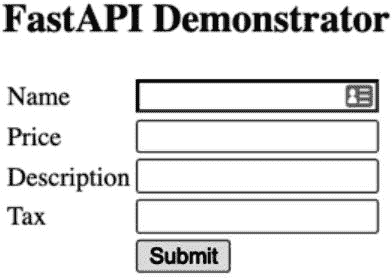

# 第二十章。提供 HTTP

当浏览器（或任何其他 Web 客户端）从服务器请求页面时，服务器可以返回静态或动态内容。提供动态内容涉及服务器端 Web 程序根据存储在数据库中的信息动态生成和传递内容。

在 Web 的早期历史上，服务器端编程的标准是 *通用网关接口*（CGI），它要求服务器在客户端请求动态内容时每次运行一个单独的程序。进程启动时间、解释器初始化、连接数据库和脚本初始化累积起来会带来可衡量的开销；CGI 的扩展性不佳。

如今，Web 服务器支持许多特定于服务器的方式来减少开销，从可以为多次访问提供动态内容的进程中服务，而不是每次访问都启动新进程。因此，本书不涵盖 CGI。要维护现有的 CGI 程序，或更好地将它们移植到更现代的方法，请参阅在线文档（特别是 [PEP 594](https://oreil.ly/qNhHr) 的建议）并查看标准库模块 [cgi](https://oreil.ly/h5Fo_)（自 3.11 版起已弃用）和 [http.cookies](https://oreil.ly/U4JL9)。¹

随着基于 [微服务](https://microservices.io) 的系统的出现，HTTP 对于分布式系统设计变得更加基础，提供了一种方便的方式来传输经常使用的 JSON 内容之间的数据。互联网上有成千上万的公共可用 HTTP 数据 API。虽然 HTTP 的原则自其于 1990 年代中期问世以来几乎未发生变化，但多年来已显著增强其功能以扩展其能力。² 对于深入学习并具有优秀参考资料，我们推荐阅读 [*HTTP: The Definitive Guide*](https://learning.oreilly.com/library/view/http-the-definitive/1565925092)（David Gourley 等著，O’Reilly）。

# http.server

Python 的标准库包括一个模块，其中包含服务器和处理程序类，用于实现简单的 HTTP 服务器。

你可以通过命令行直接运行此服务器：

```py
$ python -m http.server *port_number*
```

默认情况下，服务器监听所有接口，并提供对当前目录中文件的访问。一位作者将其用作文件传输的简单方式：在源系统的文件目录中启动 Python http.server，然后使用 wget 或 curl 等工具将文件复制到目标系统。

http.server 的安全功能非常有限。你可以在[在线文档](https://oreil.ly/5ckN2)中找到有关 http.server 的更多信息。对于生产使用，我们建议您使用以下章节中提到的框架之一。

# WSGI

Python 的*Web 服务器网关接口*（WSGI）是所有现代 Python Web 开发框架与底层 Web 服务器或网关交互的标准方式。WSGI 不适用于你的应用程序直接使用；相反，你使用众多高级抽象框架之一编写你的程序，然后框架使用 WSGI 与 Web 服务器交互。

只有在为尚未提供 WSGI 接口的 Web 服务器实现 WSGI 接口（如果有这样的服务器存在的话），或者如果你正在构建一个新的 Python Web 框架时，你才需要关注 WSGI 的细节。³在这种情况下，你需要研究 WSGI [PEP](https://oreil.ly/CALIJ)，标准库包[wsgiref](https://oreil.ly/9HmUO)的文档，以及[WSGI.org](http://WSGI.org)的[存档](https://oreil.ly/UWcaq)。

如果你使用轻量级框架（即与 WSGI 紧密匹配的框架），一些 WSGI 概念可能对你很重要。WSGI 是一个*接口*，这个接口有两个方面：*Web 服务器/网关*方面和*应用程序/框架*方面。

框架的工作是提供一个*WSGI 应用*对象，一个可调用对象（通常是一个具有 __call__ 特殊方法的类的实例，但这是一个实现细节），符合 PEP 中的约定，并通过特定服务器文档中指定的任何手段连接应用程序对象（通常是几行代码，或配置文件，或只是一个约定，例如将 WSGI 应用对象命名为模块中的顶级属性 application）。服务器为每个传入的 HTTP 请求调用应用程序对象，应用程序对象适当地响应，以便服务器可以形成传出的 HTTP 响应并将其发送出去——都按照上述约定进行。一个框架，即使是一个轻量级的框架，也会屏蔽这些细节（除非你可能需要根据具体的服务器来实例化和连接应用程序对象）。

## WSGI 服务器

你可以在[线上](https://oreil.ly/7De2i)找到一个广泛的服务器和适配器列表，用于运行 WSGI 框架和应用程序（用于开发和测试，在生产 Web 设置中，或两者兼而有之）——这是一个广泛的列表，但仅仅是部分列表。例如，它没有提到 Google App Engine 的 Python 运行时也是一个 WSGI 服务器，准备根据*app.yaml*配置文件指示调度 WSGI 应用。

如果你正在寻找一个用于开发或部署在生产环境中的 WSGI 服务器，例如在基于 Nginx 的负载均衡器后面，那么你应该会对 [Gunicorn](https://gunicorn.org) 感到满意：纯 Python 的良好支持，仅支持 WSGI，非常轻量级。一个值得考虑的（也是纯 Python 和仅支持 WSGI 的）替代方案，目前在 Windows 上支持更好的是 [Waitress](https://oreil.ly/bs4IW)。如果你需要更丰富的功能（例如对 Perl 和 Ruby 的支持以及许多其他形式的可扩展性），请考虑更大、更复杂的 [uWSGI](https://oreil.ly/DwiOe)⁴。

WSGI 还有 *middleware* 的概念，这是一个实现了 WSGI 服务器和应用程序两端的子系统。中间件对象“包装”了一个 WSGI 应用程序；可以选择性地更改请求、环境和响应；并向服务器呈现自身为“应用程序”。允许并且常见的是多层包装，形成为实际应用级别代码提供服务的中间件“堆栈”。如果你想编写一个跨框架的中间件组件，那么你可能确实需要成为一个 WSGI 专家。

## ASGI

如果你对异步 Python（本书不涵盖）感兴趣，你应该一定要调查 [ASGI](https://oreil.ly/ceEuZ)，它旨在做的基本上与 WSGI 做的一样，但是是异步的。通常情况下，在网络环境中进行异步编程时，它可以提供大大提高的性能，尽管（有人认为）会增加开发者的认知负担。

# Python Web 框架

对于 Python web 框架的调查，请参阅 Python [维基页面](https://oreil.ly/Me-Ig)。它权威性的原因在于它位于官方 [Python.org](http://Python.org) 网站上，并且是由社区共同维护的，因此随着时间的推移始终保持更新。该维基列出并指向数十个被识别为“活跃”的框架⁵，以及被识别为“已停用/不活跃”的许多其他框架。此外，它还指向了关于 Python 内容管理系统、Web 服务器以及相关 Web 组件和库的单独维基页面。

## “全栈”与“轻量级”框架

大致来说，Python web 框架可以被分类为 *全栈*（试图提供构建 Web 应用程序所需的所有功能）或 *轻量级*（仅提供与 Web 服务本身的便利接口，并让您选择自己喜欢的组件用于诸如与数据库接口和模板化等任务）。当然，像所有分类法一样，这个分类法并不精确和完整，并且需要价值判断；然而，这是开始理解众多 Python web 框架的一种方式。

在本书中，我们不深入研究任何全栈框架——每一个都太复杂了。尽管如此，其中之一可能是您特定应用的最佳选择，因此我们提到了一些最流行的框架，并建议您访问它们的网站。

## 几种流行的全栈框架

迄今为止最流行的全栈框架是[Django](https://oreil.ly/JLnV5)，它庞大而可扩展。Django 所谓的*应用程序*实际上是可重用的子系统，而 Django 称之为*项目*的通常被称为“应用程序”。Django 需要其独特的思维模式，但换取巨大的力量和功能。

一个很好的选择是[web2py](http://www.web2py.com)：它几乎和 Django 一样强大，更易学，并因其对向后兼容性的奉献而闻名（如果它保持其良好的记录，今天编写的任何 web2py 应用程序将长期保持运行）。web2py 还有出色的文档。

第三个值得一提的是[TurboGears](https://turbogears.org)，它开始时是一个轻量级框架，但通过完全集成其他独立的第三方项目来实现“全栈”状态，以满足大多数 Web 应用程序中所需的数据库接口和模板等各种功能，而不是设计自己的功能。另一个在哲学上类似的“轻量但功能丰富”的框架是[Pyramid](https://trypyramid.com)。

## 使用轻量级框架时的考虑事项

每当您使用轻量级框架时，如果您需要任何数据库、模板或其他与 HTTP 不严格相关的功能，您将需要挑选和集成单独的组件来实现。然而，框架越轻量级，您就需要理解和集成的组件越多，例如对用户进行身份验证或通过给定用户的 Web 请求保持状态。许多 WSGI 中间件包可以帮助您完成这些任务。一些优秀的中间件集中于特定任务——例如，[Oso](https://oreil.ly/zyXl0)用于访问控制，[Beaker](https://oreil.ly/v8LxQ)用于以轻量级会话形式维护状态等等。

然而，当我们（本书的作者）需要用于几乎任何目的的良好 WSGI 中间件时，我们几乎总是首先检查[Werkzeug](https://oreil.ly/lF9H3)，这是一个令人惊叹的组件集合，具有广泛的应用和高质量。我们在本书中不涵盖 Werkzeug（就像我们不涵盖其他中间件一样），但我们强烈推荐它（Werkzeug 也是 Flask 的基础，Flask 是我们最喜欢的轻量级框架，在本章后面我们会详细介绍）。

你可能注意到，正确使用轻量级框架要求你理解 HTTP（换句话说，知道你在做什么），而全栈框架试图手把手地指导你做正确的事情，而不需要真正理解为什么或如何是正确的——这是以时间和资源为代价，并接受全栈框架的概念图和思维方式。本书的作者们热衷于知识密集、资源轻的轻量级框架方法，但我们承认，在许多情况下，富有、重量级、全面性的全栈框架更为合适。各取所需！

## 几个流行的轻量级框架

如前所述，Python 有多个框架，包括许多轻量级框架。我们在这里介绍了两个后者：流行的通用框架 Flask 和面向 API 的 FastAPI。

### Flask

最受欢迎的 Python 轻量级框架是[Flask](https://oreil.ly/oCnoc)，一个第三方可通过 pip 安装的包。尽管轻巧，它包含了开发服务器和调试器，并且显式地依赖于其他精选的包，如 Werkzeug 用于中间件和[Jinja](https://oreil.ly/-HdvE)用于模板（这两个包最初由 Flask 的作者 Armin Ronacher 编写）。

除了项目网站（包含丰富详细的文档），还可以查看[GitHub 上的源代码](https://oreil.ly/v_YkH)和[PyPI 条目](https://oreil.ly/-76be)。如果你想在 Google App Engine 上运行 Flask（在本地计算机上或在 Google 的服务器上*[appspot.com](http://appspot.com)*），Dough Mahugh 的[Medium 文章](https://oreil.ly/bs0JC)可能非常方便。

我们还强烈推荐 Miguel Grinberg 的书籍[*Flask Web Development*](https://learning.oreilly.com/library/view/flask-web-development/9781491991725/)（O'Reilly）：尽管第二版在撰写本文时已经过时（几乎四年），但它仍然为你提供了一个优秀的基础，使你更容易学习最新的新增内容。

Flask 包提供的主要类被命名为 Flask。一个 flask.Flask 的实例，除了作为一个 WSGI 应用程序外，还通过其 wsgi_app 属性包装了一个 WSGI 应用程序。当你需要在 WSGI 中间件中进一步包装 WSGI 应用程序时，请使用以下习惯用法：

```py
`import` flask

app = flask.Flask(__name__)
app.wsgi_app = *`some_middleware`*(app.wsgi_app)
```

当你实例化 flask.Flask 时，始终将应用程序名称作为第一个参数传递（通常只是模块中 __name__ 特殊变量的值；如果你在一个包内实例化它，通常在*\_\_init\_\_.py*中，使用 __name__.partition('.')[0]也可以）。可选地，你还可以传递命名参数，如 static_folder 和 template_folder 来自定义静态文件和 Jinja 模板的位置；但这很少需要——默认值（分别位于与实例化 flask.Flask 的 Python 脚本相同的文件夹中的子文件夹*static*和*templates*）非常合理。

flask.Flask 的实例 *app* 提供了超过 100 个方法和属性，其中许多是装饰器，用于将函数绑定到 *app* 中的各种角色，例如 *视图函数*（在 URL 上提供 HTTP 动词）或 *钩子*（在处理请求前或构建响应后修改请求、处理错误等）。

flask.Flask 在实例化时只需几个参数（而且这些参数通常不需要在你的代码中计算），它提供了一些装饰器，你在定义例如视图函数时会用到。因此，在 Flask 中的正常模式是在你的主脚本早期实例化 *app*，就像你的应用程序启动时一样，这样 app 的装饰器和其他方法属性在你 **def** 视图函数等时就可用了。

由于存在单个全局 *app* 对象，你可能会想知道在访问、修改和重新绑定 *app* 的属性和属性时，它的线程安全性如何。不用担心：你看到的名称实际上只是特定请求上下文中实际对象的代理，在特定线程或 [greenlet](https://oreil.ly/IaGCM) 的上下文中。永远不要对这些属性进行类型检查（它们的类型实际上是不透明的代理类型），你就没问题。

Flask 还提供许多其他实用函数和类；通常，后者会从其他包中的类继承或包装，以添加无缝、便捷的 Flask 集成。例如，Flask 的 Request 和 Response 类通过子类化相应的 Werkzeug 类添加了一些便捷的功能。

#### Flask 请求对象

类 flask.Request 提供了大量 [详细记录的属性](https://oreil.ly/mmYul)。表 20-1 列出了你经常使用的属性。

表 20-1\. flask.Request 的有用属性

| args | 一个 MultiDict，包含请求的查询参数 |
| --- | --- |
| cookies | 一个包含请求中的 cookies 的字典 |
| data | 一个字节字符串，请求的主体（通常用于 POST 和 PUT 请求） |
| files | 一个 MultiDict，包含请求中上传的文件，将文件名映射到包含每个文件数据的类文件对象 |
| form | 一个 MultiDict，包含请求体中提供的表单字段 |
| headers | 一个 MultiDict，包含请求的头部 |
| values | 一个 MultiDict，合并了 args 和 form 属性 |

MultiDict 类似于字典，但可以为一个键拥有多个值。对 MultiDict 实例 *m* 进行索引和获取时会返回该键的任意一个值；要获取一个键的值列表（如果该键不在 *m* 中则返回空列表），可以调用 *m*.getlist(*key*)。

#### Flask 响应对象

通常，Flask 视图函数可以直接返回一个字符串（它将成为响应的主体）：Flask 会自动在字符串周围包装一个 flask.Response 实例 *r*，因此您无需担心响应类。然而，有时您需要修改响应的标头；在这种情况下，在视图函数中调用 *r* = flask.make_response(*astring*)，按您的要求修改 *r*.headers，然后返回 *r*。（要设置一个 cookie，请勿使用 *r*.headers；而是调用 [*r*.set_cookie](https://oreil.ly/AehLj)。）

Flask 与其他系统的许多内置集成无需子类化：例如，模板集成会将 Flask 全局对象 config、request、session 和 g（后者是方便的“全局捕获”对象 flask.g，在应用上下文中，您的代码可以存储请求处理期间想要“存放”的任何内容）隐式注入到 Jinja 上下文中，以及函数 url_for（将端点转换为相应的 URL，与 flask.url_for 相同）和 get_flashed_messages（支持 *flashed messages*，在本书中我们不涵盖；与 flask.get_flashed_messages 相同）。Flask 还提供了方便的方式，让您的代码将更多过滤器、函数和值注入到 Jinja 上下文中，无需任何子类化。

大多数官方认可或批准的 Flask [扩展](https://oreil.ly/V8mD7)（在撰写本文时有数百种可在 PyPI 上获取）采用类似的方法，提供类和实用函数，以无缝集成其他流行的子系统到您的 Flask 应用程序中。

此外，Flask 还引入了其他功能，如 [*signals*](https://oreil.ly/YmEuJ)，以提供“发布/订阅”模式中更松散的动态耦合，以及 [*blueprints*](https://oreil.ly/jMIZE)，以一种高度模块化、灵活的方式提供 Flask 应用程序功能的大部分子集，以便于重构大型应用程序。我们在本书中不涵盖这些高级概念。

示例 20-1 展示了一个简单的 Flask 示例。（使用 pip 安装 Flask 后，使用命令 **flask --app flask_example run** 运行该示例。）

##### 示例 20-1\. 一个 Flask 示例

```py
`import` datetime, flask
app = flask.Flask(__name__)

*`# secret key for cryptographic components such as encoding session cookies;`*
*`# for production use, use secrets.token_bytes()`*
app.secret_key = b`'``\xc5``\x8f``\xbc``\xa2``\x1d``\xeb``\xb3``\x94``;:d``\x03``'`

@app.route('/')
`def` greet():
    lastvisit = flask.session.get('lastvisit')
    now = datetime.datetime.now()
    newvisit = now.ctime()
    template = '''
 <html><head><title>Hello, visitor!</title>
 </head><body>
      
 <p>Welcome back to this site!</p>
 <p>You last visited on {{lastvisit}} UTC</p>
 <p>This visit on {{newvisit}} UTC</p>
      
 <p>Welcome to this site on your first visit!</p>
 <p>This visit on {{newvisit}} UTC</p>
 <p>Please Refresh the web page to proceed</p>
      
 </body></html>'''
    flask.session['lastvisit'] = newvisit
    `return` flask.render_template_string(
      template, newvisit=newvisit, lastvisit=lastvisit)
```

此示例展示了如何使用 Flask 提供的众多构建模块中的一小部分：Flask 类、视图函数以及渲染响应（在本例中，使用 Jinja 模板的 render_template_string；在实际应用中，通常将模板保存在单独的文件中，并使用 render_template 渲染）。该示例还展示了如何通过方便的 flask.session 变量，在同一浏览器中多次交互与服务器时保持状态的连续性。（也可以使用 Python 代码直接组合 HTML 响应，而不是使用 Jinja，并直接使用 cookie 而非 session；然而，实际的 Flask 应用程序更倾向于使用 Jinja 和 session。）

如果此应用程序有多个视图函数，可能希望在会话中设置`lastvisit`为触发请求的任何 URL。以下是如何编写和装饰钩子函数以在每个请求后执行的代码：

```py
@app.after_request
`def` set_lastvisit(response):
    now = datetime.datetime.now()
    flask.session['lastvisit'] = now.ctime()
    `return` response
```

现在，您可以从视图函数`greet`中删除`flask.session['lastvisit'] = newvisit`语句，应用程序将继续正常工作。

### FastAPI

[FastAPI](https://fastapi.tiangolo.com) 的设计比 Flask 或 Django 更为新颖。尽管后者都有非常可用的扩展以提供 API 服务，但 FastAPI 的目标直指生成基于 HTTP 的 API，正如其名称所示。它也完全能够生成面向浏览器消费的动态网页，使其成为一款多才多艺的服务器。FastAPI 的[主页](https://fastapi.tiangolo.com)提供了简单、简洁的示例，展示了它的工作原理和优势，支持非常全面和详细的参考文档。

由于类型注释（在第五章中介绍）进入了 Python 语言，它们在工具中的使用范围超出了最初的意图，例如[pydantic](https://pydantic-docs.helpmanual.io)，它使用它们来执行运行时解析和验证。FastAPI 服务器利用此支持来创建清晰的数据结构，通过内置和定制的输入转换和验证来展示通过对输入进行转换和验证的内置和定制功能，从而极大地提高了 Web 编码的生产力。

FastAPI 还依赖于[Starlette](https://www.starlette.io)，一个高性能的异步 Web 框架，该框架又使用 ASGI 服务器，如[Uvicorn](https://www.uvicorn.org) 或 [Hypercorn](https://oreil.ly/SXsur)。您无需直接使用异步技术即可利用 FastAPI。您可以使用更传统的 Python 风格编写您的应用程序，尽管如果您切换到异步风格，它可能会表现得更快。

FastAPI 能够提供类型准确的 API（以及自动生成的文档），与您的注释所指示的类型相符，这意味着它可以对输入和输出的数据进行自动解析和转换。

请考虑示例 20-2 中显示的示例代码，该示例为 pydantic 和 mongoengine 定义了一个简单的模型。每个模型都有四个字段：name 和 description 是字符串，price 和 tax 是十进制数。对于 name 和 price 字段，需要值，但 description 和 tax 是可选的。pydantic 为后两个字段建立了默认值**None**；mongoengine 不存储值为**None**的字段的值。

##### 示例 20-2\. models.py：pydantic 和 mongoengine 数据模型

```py
`from` decimal `import` Decimal
`from` pydantic `import` BaseModel, Field
`from` mongoengine `import` Document, StringField, DecimalField
`from` typing `import` Optional

`class` PItem(BaseModel):
    "pydantic typed data class."
    name: str
    price: Decimal
    description: Optional[str] = `None`
    tax: Optional[Decimal] = `None`

`class` MItem(Document):
    "mongoengine document."
    name = StringField(primary_key=`True`)
    price = DecimalField()
    description = StringField(required=`False`)
    tax = DecimalField(required=`False`)
```

假设您希望通过 Web 表单或 JSON 接受此类数据，并能够将数据作为 JSON 检索或在 HTML 中显示。骨架 示例 20-3（不提供维护现有数据的功能）展示了您如何使用 FastAPI 实现这一点。此示例使用 Uvicorn HTTP 服务器，但未显式使用 Python 的异步特性。与 Flask 一样，程序从创建应用程序对象 app 开始。此对象具有用于每种 HTTP 方法的装饰器方法，但是它避免了 app.route 装饰器，而是选择 app.get 用于 HTTP GET，app.post 用于 HTTP POST 等，这些确定了哪个视图函数处理不同 HTTP 方法的路径请求。

##### 示例 20-3\. server.py：FastAPI 接受并显示项目数据的示例代码

```py
`from` decimal `import` Decimal
`from` fastapi `import` FastAPI, Form
`from` fastapi.responses `import` HTMLResponse, FileResponse
`from` mongoengine `import` connect
`from` mongoengine.errors `import` NotUniqueError
`from` typing `import` Optional
`import` json
`import` uvicorn
`from` models `import` PItem, MItem

DATABASE_URI = "mongodb://localhost:27017"
db=DATABASE_URI+"/mydatabase"
connect(host=db)
app = FastAPI()

`def` save(item):
    `try`:
        return item.save(force_insert=`True`)
    `except` NotUniqueError:
        `return` `None`

@app.get('/')
`def` home_page():
    "View function to display a simple form."
    `return` FileResponse("index.xhtml")

@app.post("/items/new/form/", response_class=HTMLResponse)
`def` create_item_from_form(name: str=Form(...),
                          price: Decimal=Form(...),
                          description: Optional[str]=Form(""),
                          tax: Optional[Decimal]=Form(Decimal("0.0"))):
    "View function to accept form data and create an item."
    mongoitem = MItem(name=name, price=price, description=description, 
                      tax=tax)
    value = save(mongoitem)
    `if` value:
        body = f"Item({name!r}, {price!r}, {description!r}, {tax!r})"
    `else`:
        body = f"Item {name!r} already present."
    `return` f"""<html><body><h2>{body}</h2></body></html>"""

@app.post("/items/new/")
`def` create_item_from_json(item: PItem):
    "View function to accept JSON data and create an item."
    mongoitem = MItem(**item.dict())
    value = save(mongoitem)
    `if` `not` value:
        `return` f"Primary key {item.name!r} already present"
    `return` item.dict()

@app.get("/items/{name}/")
`def` retrieve_item(name: str):
    "View function to return the JSON contents of an item."
    m_item = MItem.objects(name=name).get()
    `return` json.loads(m_item.to_json())

`if` __name__ == "__main__":
    # host as "localhost" or "127.0.0.1" allows only local apps to access the
    # web page. Using "0.0.0.0" will accept access from apps on other hosts,
    # but this can raise security concerns, and is generally not recommended.
    uvicorn.run("__main__:app", host="127.0.0.1", port=8000, reload=True)
```

home_page 函数不带参数，简单地呈现包含来自 *index.xhtml* 文件的表单的最小 HTML 主页。该表单提交到 */items/new/form/* 端点，触发调用 create_item_from_form 函数，在路由装饰器中声明生成 HTML 响应而不是默认的 JSON。

##### 示例 20-4\. index.xhtml 文件

```py
<!DOCTYPE html>
<html lang="en">
  <body>
  <h2>FastAPI Demonstrator</h2>
  <form method="POST" action="/items/new/form/">
    <table>
    <tr><td>Name</td><td><input name="name"></td></tr>
    <tr><td>Price</td><td><input name="price"></td></tr>
    <tr><td>Description</td><td><input name="description"></td></tr>
    <tr><td>Tax</td><td><input name="tax"></td></tr>
    <tr><td></td><td><input type="submit"></td></tr>
    </table>
  </form>
  </body>
</html>
```

表单，显示在 图 20-1 中，由 create_item_from_form 函数处理，其签名为每个表单字段指定一个参数，并使用注解定义每个字段为表单字段。注意，签名为描述和税收定义了自己的默认值。该函数从表单数据创建一个 MItem 对象，并尝试将其保存到数据库中。save 函数强制插入，抑制更新现有记录，并通过返回 **None** 报告失败；返回值用于构建简单的 HTML 回复。在生产应用中，通常会使用像 Jinja 这样的模板引擎来渲染响应。



###### 图 20-1\. FastAPI 演示程序的输入表单

create_item_from_json 函数，从 */items/new/* 端点路由，接收来自 POST 请求的 JSON 输入。其签名接受一个 pydantic 记录，在这种情况下，FastAPI 将使用 pydantic 的验证来确定输入是否可接受。该函数返回一个 Python 字典，FastAPI 会自动将其转换为 JSON 响应。可以通过一个简单的客户端轻松测试，如 示例 20-5 所示。

##### 示例 20-5\. FastAPI 测试客户端

```py
`import` requests, json

result = requests.post('http://localhost:8000/items/new/',
                       json={"name": "Item1",
                             "price": 12.34,
                             "description": "Rusty old bucket"})
print(result.status_code, result.json())
result = requests.get('http://localhost:8000/items/Item1/')
print(result.status_code, result.json())
result = requests.post('http://localhost:8000/items/new/',
                       json={"name": "Item2",
                             "price": "Not a number"})
print(result.status_code, result.json())
```

运行此程序的结果如下：

```py
200 {'name': 'Item1', 'price': 12.34, 'description': 'Rusty old
bucket'> 'tax': None}
200 {'_id': 'Item1', 'price': 12.34, 'description': 'Rusty old bucket'}
422 {'detail': [{'loc': ['body', 'price'], 'msg': 'value is not a valid
decimal', 'type': 'type_error.decimal'}]}
```

第一个 POST 请求到 */items/new/* 会看到服务器返回与其展示的相同数据，确认其已保存在数据库中。请注意，未提供税收字段，因此这里使用了 pydantic 的默认值。第二行显示了检索到的新存储项的输出（mongoengine 使用名称 _id 标识主键）。第三行显示了一个错误消息，由于尝试将非数值值存储在价格字段中而生成。

最后，retrieve_item 视图函数，由诸如 */items/Item1/* 这样的 URL 路由，提取第二个路径元素作为键，并返回给定项的 JSON 表示。它在 mongoengine 中查找给定的键，并将返回的记录转换为字典，FastAPI 将其呈现为 JSON。

¹ 一个历史遗留问题是，在 CGI 中，服务器通过操作系统环境（在 Python 中为 os.environ）向 CGI 脚本提供关于要服务的 HTTP 请求的信息；直至今日，Web 服务器和应用程序框架之间的接口仍然依赖于“一个环境”，这本质上是一个字典，并且泛化并加速了相同的基本思想。

² 还存在更 [高级版本的 HTTP](https://oreil.ly/tAyoT)，但本书不涉及它们。

³ 请不要。正如 Titus Brown 曾指出的那样，Python 因拥有比关键字还多的 Web 框架而（臭名昭著）。本书的一位作者曾在 Guido 设计 Python 3 时向他展示了如何轻松解决这个问题——只需添加几百个新关键字——但出于某种原因，Guido 对这一建议并不十分接受。

⁴ 在 Windows 上安装 uWSGI 目前需要使用 Cygwin 进行编译。

⁵ 由于 Python 关键字少于 40 个，你可以理解为什么 Titus Brown 曾指出 Python 拥有比关键字更多的 Web 框架。
