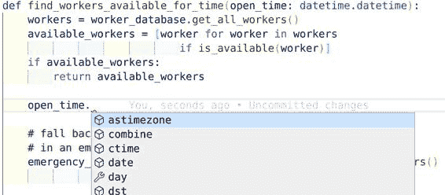

# 第三章。类型注解

Python 是一种动态类型语言；类型直到运行时才知道。这在试图编写健壮代码时是一个障碍。由于类型嵌入在值本身中，开发人员很难知道他们正在处理的是什么类型。当然，今天这个名称看起来像是一个`str`，但如果有人将其改为`bytes`会发生什么呢？对于动态类型语言，类型的假设是建立在不稳定的基础上的。然而，希望并未失去。在 Python 3.5 中，引入了一个全新的功能：类型注解。

类型注解将你编写健壮代码的能力提升到一个全新的水平。Python 的创造者 Guido van Rossum 表示得最好：

> 我已经学到了一个痛苦的教训，对于小程序来说，动态类型是很棒的。但对于大程序，你必须采取更严格的方法，如果语言实际上提供了这种纪律，而不是告诉你“好吧，你可以做任何你想做的事情”会更有帮助。¹

类型注解是更严谨的方法，是你在处理更大代码库时所需的额外关注。在本章中，你将学习如何使用类型注解，它们为什么如此重要，以及如何利用一种称为类型检查器的工具来强制执行你在整个代码库中的意图。

# 什么是类型注解？

在第二章，你首次瞥见了类型注解：

```py
def close_kitchen_if_past_close(point_in_time: datetime.datetime): 
    if point_in_time >= closing_time():
        close_kitchen()
        log_time_closed(point_in_time)
```


这里的类型注解是`: datetime.datetime`

类型注解是一种额外的语法，通知用户你的变量的预期类型。这些注解充当*类型提示*；它们为读者提供提示，但实际上 Python 语言在运行时并不使用它们。事实上，你完全可以忽略这些提示。考虑以下代码片段，以及开发人员写的评论。

```py
# CustomDateTime offers all the same functionality with
# datetime.datetime. I'm using it here for its better
# logging facilities.
close_kitchen_if_past_close(CustomDateTime("now")) # no error
```

###### 警告

在你违背类型提示的情况下，应该是一个罕见的案例。作者非常明确地打算了一个特定的用例。如果你不打算遵循类型注解，那么如果原始代码以不兼容你所使用的类型的方式发生更改，你将为自己设置问题。

Python 在这种情况下不会在运行时抛出任何错误。事实上，在 Python 执行时根本不使用这些类型注解。没有检查或成本用于使用这些类型注解。然而，这些类型注解仍然起到了至关重要的作用：通知你的读者预期的类型。代码的维护者将知道在更改你的实现时可以使用哪些类型。调用代码也会受益，因为开发人员将确切知道要传入的类型。通过实施类型注解，你减少了摩擦。

设想一下你未来的维护者的处境。遇到直观易用的代码会不会很棒？你不需要一行接着一行地挖掘函数来确定使用方法，也不会误用某种类型，然后需要处理异常和错误行为的后果。

考虑另一段代码，它接收员工的可用时间和餐厅的营业时间，然后为那一天安排可用的工人。你想使用这段代码，看到了以下内容：

```py
def schedule_restaurant_open(open_time, workers_needed):
```

让我们忽略实现一会儿，因为我想专注于第一印象。你认为可以传入什么？停下来，闭上眼睛，问问自己在阅读之前，什么是合理的传入类型。`open_time` 是 `datetime` 类型，还是自纪元以来的秒数，或者是包含小时的字符串？`workers_needed` 是一个名字列表，一个 `Worker` 对象的列表，还是其他什么东西？如果你猜错了，或者不确定，你需要查看实现或调用代码，这我已经明确了需要时间，并且令人沮丧。

让我提供一个实现，你可以看看你离正解有多近。

```py
import datetime
import random

def schedule_restaurant_open(open_time: datetime.datetime,
                             workers_needed: int):
    workers = find_workers_available_for_time(open_time)
    # Use random.sample to pick X available workers
    # where X is the number of workers needed.
    for worker in random.sample(workers, workers_needed):
        worker.schedule(open_time)
```

你可能猜到 `open_time` 是 `datetime` 类型，但你有没有考虑过 `workers_needed` 可能是一个 `int`？一旦你看到类型注解，你会更清楚地了解发生了什么。这减少了认知负担，降低了维护者的摩擦。

###### 提示

这无疑是朝着正确方向迈出的一步，但不要停在这里。如果你看到这样的代码，考虑将变量重命名为 `number_of_workers_needed`，以明确整数的含义。在下一章，我还将探讨类型别名，它提供了一种表达自己方式的替代方法。

到目前为止，我展示的所有例子都集中在参数上，但你也可以注释 *返回类型*。

考虑 `schedule_restaurant_open` 函数。在那段代码中间，我调用了 `find_workers_available_for_time`。它返回一个名为 `workers` 的变量。假设你想将代码更改为选择最长时间未工作的工人，而不是随机抽样？你有任何迹象表明 `workers` 的类型吗？

如果你只看函数签名，你会看到以下内容：

```py
def find_workers_available_for_time(open_time: datetime.datetime):
```

这里没有任何东西能帮助我们更快地完成工作。你可以猜测，测试会告诉我们，对吧？也许是一个名字列表？不如让测试失败，还是去看看实现吧。

```py
def find_workers_available_for_time(open_time: datetime.datetime):
    workers = worker_database.get_all_workers()
    available_workers = [worker for worker in workers
                           if is_available(worker)]
    if available_workers:
        return available_workers

    # fall back to workers who listed they are available
    # in an emergency
    emergency_workers = [worker for worker in get_emergency_workers()
                           if is_available(worker)]

    if emergency_workers:
        return emergency_workers

    # Schedule the owner to open, they will find someone else
    return [OWNER]
```

哦不，这里没有告诉你应该期望什么类型。这段代码中有三个不同的返回语句，而你希望它们都返回相同的类型。（当然，每个`if`语句都通过单元测试来确保它们一致，对吧？对吧？）你需要深入挖掘。你需要查看`worker_database`。你需要查看`is_available`和`get_emergency_workers`。你需要查看`OWNER`变量。这些都需要保持一致，否则你将需要在原始代码中处理特殊情况。

如果这些函数也不能确切告诉你需要的东西怎么办？如果你不得不通过多个函数调用深入了解？你需要穿过的每一层都是你大脑中需要保持的抽象层。每一点信息都会增加认知负荷。你承受的认知负荷越多，出错的可能性就越大。

所有这些都可以通过对返回类型进行注解来避免。返回类型通过在函数声明的末尾放置`-> <type>`来注释。假设你遇到了这个函数签名：

```py
def find_workers_available_for_time(open_time: datetime.datetime) -> list[str]:
```

现在你知道应该把工作者确实看作是一个字符串列表。不需要深入数据库、函数调用或模块。

###### 提示

在 Python 3.8 及更早版本中，内置的集合类型如`list`、`dict`和`set`不允许使用方括号语法，比如`list[Cookbook]`或`dict[str,int]`。相反，你需要使用 typing 模块中的类型注解：

```py
from typing import Dict,List
AuthorToCountMapping = Dict[str, int]
def count_authors(
                   cookbooks: List[Cookbook]
                 ) -> AuthorToCountMapping:
    # ...
```

需要时你也可以对变量进行注释：

```py
workers: list[str] = find_workers_available_for_time(open_time)
numbers: list[int] = []
ratio: float = get_ratio(5,3)
```

虽然我会对所有的函数进行注释，但我通常不会打扰去对变量进行注释，除非我在代码中想传达的特定内容（比如一个与预期不同的类型）。我不想过分地在几乎所有地方都放置类型注解——Python 的简洁性是吸引许多开发者的原因。类型可能会使你的代码变得混乱，特别是当类型显而易见时。

```py
number: int = 0
text: str = "useless"
values: list[float] = [1.2, 3.4, 6.0]
worker: Worker = Worker()
```

这些类型注解提供的价值并不比 Python 本身提供的更多。阅读这段代码的人知道`"useless"`是一个`str`。记住，类型注解用于类型提示；你为未来提供了改进沟通的注释。你不需要到处说明显而易见的事情。

# 类型注解的好处

就像你做出的每个决定一样，你需要权衡成本和收益。从一开始考虑类型有助于你的有意识的设计过程，但类型注解还提供其他的好处吗？我将向你展示类型注解如何通过工具发挥作用。

## 自动完成

我主要讨论了与其他开发人员的沟通，但你的 Python 环境也从类型注解中受益。由于 Python 是动态类型的，很难知道哪些操作是可用的。使用类型注解，许多 Python 感知代码编辑器将为你的变量自动完成操作。

在 图 3-1 中，你会看到一个屏幕截图，展示了一个流行的代码编辑器 VS Code 检测到一个 `datetime` 并提供自动补全我的变量。



###### 图 3-1\. VS Code 显示自动补全

## 类型检查器

在本书中，我一直在讲述类型如何传达意图，但一直忽略了一个关键细节：如果开发人员不愿意遵循这些类型注解，那么没有程序员必须遵守它们。如果你的代码与类型注解相矛盾，那很可能是一个错误，你仍然依赖人类来捕获错误。我希望能做得更好。我希望计算机能够帮我找到这些类型错误。

我在 第二章 谈论动态类型时展示了这个代码片段：

```py
>>> a: int = 5
>>> a = "string"
>>> a
"string"
```

这里面就是挑战所在：当你不能信任开发人员会遵循它们的指导时，类型注解如何使你的代码库更加健壮？为了做到健壮，你希望你的代码经得住时间的考验。为此，你需要一种工具来检查所有的类型注解，并在有问题时做出标记。这种工具就叫做类型检查器。

类型检查器使得类型注解从一种沟通方式转变为一种安全网。它是一种静态分析的形式。*静态分析工具* 是在你的源代码上运行的工具，完全不会影响你的运行时。在 第二十章 中，你将更多地了解静态分析工具，但现在我只解释类型检查器。

首先，我需要安装一个类型检查器。我将使用 mypy，一个非常流行的类型检查工具。

`pip install mypy`

现在我将创建一个名为 *invalid_type.py* 的文件，其中有不正确的行为：

```py
a: int = 5
a = "string"
```

如果我在命令行上运行 `mypy` 对那个文件进行检查，我会得到一个错误：

```py
mypy invalid_type.py

chapter3/invalid_type.py:2: error: Incompatible types in assignment
                            (expression has type "str", variable has type
                             "int")
Found 1 error in 1 file (checked 1 source file)
```

正如此时此刻，我的类型注解已成为错误的第一道防线。每当你犯错背离了作者的意图，类型检查器就会发现并警告你。实际上，在大多数开发环境中，你可以实时获取这种分析，随着你的输入即时通知你错误。（尽管它不会读懂你的思维，但它可以在最早的时候捕获到错误，这非常棒。）

## 练习：找出 Bug

下面是一些在我的代码中由 mypy 捕捉到的错误示例。我希望你找出每个代码片段中的错误并计时，看你找到 Bug 或者放弃用了多长时间，然后检查下面列出的输出看看你找对了没有。

```py
def read_file_and_reverse_it(filename: str) -> str:
    with open(filename) as f:
        # Convert bytes back into str
        return f.read().encode("utf-8")[::-1]
```

这是 mypy 输出显示的错误信息：

```py
mypy chapter3/invalid_example1.py
chapter3/invalid_example1.py:3: error: Incompatible return value type
                                       (got "bytes", expected "str")
Found 1 error in 1 file (checked 1 source file)
```

糟糕，我返回的是 `bytes`，而不是 `str`。我调用了 encode 而不是 decode，弄混了我的返回类型。我甚至都无法告诉你我把 Python 2.7 代码迁移到 Python 3 时犯了多少次这个错误。幸好有类型检查器。

这里是另一个例子：

```py
# takes a list and adds the doubled values
# to the end
# [1,2,3] => [1,2,3,2,4,6]
def add_doubled_values(my_list: list[int]):
    my_list.update([x*2 for x in my_list])

add_doubled_values([1,2,3])
```

mypy 的错误如下：

```py
mypy chapter3/invalid_example2.py
chapter3/invalid_example2.py:6: error: "list[int]" has no attribute "update"
Found 1 error in 1 file (checked 1 source file)
```

另一个我犯的无辜错误是在列表上调用`update`而不是`extend`。当在不同集合类型之间移动时（在这种情况下是从`set`到`list`），这类错误很容易发生。

再举一个例子来总结一下：

```py
# The restaurant is named differently
# in different parts of the world
def get_restaurant_name(city: str) -> str:
    if city in ITALY_CITIES:
            return "Trattoria Viafore"
    if city in GERMANY_CITIES:
            return "Pat's Kantine"
    if city in US_CITIES:
            return "Pat's Place"
    return None

if get_restaurant_name('Boston'):
    print("Location Found")
```

mypy 的错误如下：

```py
chapter3/invalid_example3.py:14: error: Incompatible return value type
                                        (got "None", expected "str")
Found 1 error in 1 file (checked 1 source file)
```

这个例子有些微妙。当预期一个字符串值时，我却返回了`None`。如果所有的代码都只是条件性地检查餐厅名称来做决策，就像我之前做的那样，测试将会通过，一切看起来都没有问题。即使对于负面情况也是如此，因为在`if`语句中检查`None`是完全没问题的（它是假值）。这是 Python 动态类型的一个例子，回头来咬我们一口。

但是，几个月后，某些开发人员将尝试将此返回值作为字符串使用，一旦需要添加新城市，代码就会尝试操作`None`值，这将导致异常抛出。这并不是很健壮；这里存在一个潜在的代码错误隐患。但是通过类型检查器，您可以停止担心这一点，并及早捕捉到这些错误。

###### 警告

有了类型检查器，你是否还需要测试？当然需要。类型检查器捕获一类特定的错误：不兼容类型的错误。还有许多其他类别的错误仍然需要测试。将类型检查器视为您在 bug 识别工具箱中的一种工具。

在所有这些示例中，类型检查器都找到了一个潜在的即将发生的 bug。无论这个 bug 是由测试、代码审查还是客户发现的，都无关紧要；类型检查器能更早地捕捉到它，从而节省时间和金钱。类型检查器开始为我们提供静态类型语言的好处，同时仍然允许 Python 运行时保持动态类型。这确实是两全其美的方式。

在本章开头，你会找到 Guido van Rossum 的一句话。在 Dropbox 工作期间，他发现大型代码库在没有安全网的情况下存在困难。他成为驱动类型提示进入语言的强烈支持者。如果你希望你的代码传达意图并捕获错误，请立即开始采用类型注释和类型检查。

# 讨论主题

您的代码库是否有过错误滑过，而这些错误可以被类型检查器捕获？这些错误给您造成了多大的损失？有多少次是代码审查或集成测试捕获了 bug？那些进入生产环境的 bug 呢？

# 何时使用类型注解

在你开始将类型添加到所有内容之前，我需要谈谈成本问题。添加类型很简单，但可能会做得过火。当用户尝试测试和调试代码时，他们可能会开始与类型检查器作斗争，因为他们觉得在编写所有类型注释时被拖累。对于刚开始使用类型提示的用户来说，这是一个采用的成本。我还提到过我并不会对所有变量进行类型注释，特别是类型显而易见时。我也通常不会为类中的每个小私有方法的参数进行类型注释。

什么时候应该使用类型检查器？

+   对于你期望其他模块或用户调用的函数（例如公共 API、库入口点等）。

+   当你想强调类型复杂（例如，将字符串映射到对象列表的字典）或不直观时。

+   当 mypy 提示你需要类型时的区域（通常在将空集合赋值时更容易遵循工具而不是反对它）

类型检查器将推断任何可能的值的类型，因此即使你没有填写所有类型，你仍将获得收益。我将在第六章中介绍配置类型检查器。

# 结语

当类型提示引入时，Python 社区内部曾产生过疑虑。开发人员担心 Python 正在变成像 Java 或 C++这样的静态类型语言。他们担心到处添加类型会减慢开发速度，并破坏他们喜爱的动态类型语言的好处。

然而，类型提示仅仅是提示而已。它们是完全可选的。我不推荐它们用于小型脚本，或者任何不会存在很长时间的代码片段。但是，如果你的代码需要长期维护，类型提示就是无价的。它们作为一种沟通方法，使你的环境更智能，并且与类型检查器结合使用时能检测错误。它们保护了原始作者的意图。在注释类型时，你减轻了读者理解你的代码的负担。你减少了需要阅读函数实现来了解其操作的需要。代码很复杂，你应该尽量减少开发人员需要阅读的代码量。通过使用经过深思熟虑的类型，你减少了意外并增加了阅读理解力。

类型检查器也是一种信心的增强器。记住，为了使你的代码更健壮，它必须易于更改、重写和删除（如果需要）。类型检查器可以让开发人员在这样做时更加放心。如果某些内容依赖于已更改或删除的类型或字段，类型检查器将标记不兼容的代码。自动化工具使您和未来的合作者的工作更简单；减少错误进入生产环境，并更快地提供功能。

在下一章中，你将超越基本类型注解，学习如何构建所有新类型的词汇表。这些类型将帮助你约束代码库中的行为，限制事物可能出错的方式。我仅仅触及了类型注解可能非常有用的表面。

¹ **Guido van Rossum**，《语言创作者的对话》，PuPPy（Puget Sound Programming Python）2019 年度慈善活动。[*https://oreil.ly/1xf01*](https://oreil.ly/1xf01)。
