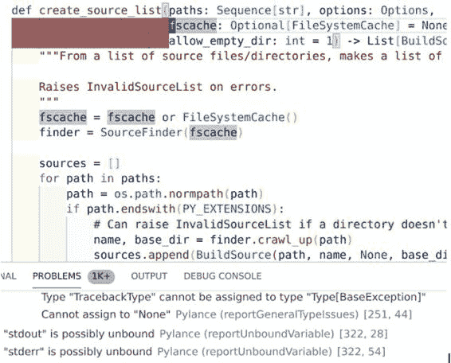
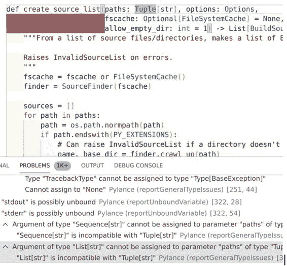

# 第六章：自定义您的类型检查器

类型检查器是构建健壮代码库的最佳资源之一。Jukka Lehtosalo，mypy 的主要开发者，对类型检查器给出了一个精炼的定义：“本质上，[类型检查器] 提供了验证过的文档。”¹ 类型注解提供了关于代码库的文档，允许其他开发者理解您的意图。类型检查器使用这些注解来验证文档是否与实际行为一致。

因此，类型检查器是无价的。孔子曾说过：“工欲善其事，必先利其器。”² 本章旨在帮助您磨练您的类型检查器。优秀的编码技术可以带您走得更远，但是您周围的工具才能将您带入下一个水平。不要止步于学习您的编辑器、编译器或操作系统，也要学会您的类型检查器。我将向您展示一些更有用的选项，以充分发挥您的工具的潜力。

# 配置您的类型检查器

我将专注于目前最受欢迎的类型检查器之一：mypy。当您在 IDE 中运行类型检查器（如 PyCharm）时，通常在幕后运行 mypy（尽管许多 IDE 允许您更改默认的类型检查器）。每当配置 mypy（或您的默认类型检查器）时，您的 IDE 也会使用该配置。

mypy 提供了许多配置选项来控制类型检查器的*严格性*或报告的错误数量。您使类型检查器越严格，就需要编写更多类型注解，这提供了更好的文档，并减少了错误。但是，如果类型检查器过于严格，您将发现开发代码的最低要求过高，导致进行更改的成本很高。mypy 配置选项控制这些严格性水平。我将介绍一些可供您选择的不同选项，您可以决定您和您的代码库所在的最低要求。

首先，如果您尚未安装 mypy，则需要安装它。最简单的方法是通过命令行上的 `pip`：

```py
pip install mypy
```

安装了 mypy 后，您可以以三种方式之一控制配置：

命令行

当从终端实例化 mypy 时，您可以传递各种选项来配置行为。这对于在代码库中探索新的检查非常有用。

内联配置

您可以在文件顶部指定配置值，以指示您可能想设置的任何选项。例如：

```py
    # mypy: disallow-any-generics
```

将此行放在文件顶部将告诉 mypy 明确地失败，如果它发现带有 `Any` 泛型类型注释。

配置文件

您可以设置一个配置文件，以便每次运行 mypy 时都使用相同的选项。在团队需要共享相同选项时，这非常有用。该文件通常与代码一起存储在版本控制中。

## 配置 mypy

运行 mypy 时，它会在当前目录中查找名为*mypy.ini*的配置文件。此文件将定义您为项目设置的选项。一些选项是全局的，适用于每个文件，而其他选项是每个模块的。一个示例的*mypy.ini*文件可能如下所示：

```py
# Global options:

[mypy]
python_version = 3.9
warn_return_any = True

# Per-module options:

[mypy-mycode.foo.*]
disallow_untyped_defs = True

[mypy-mycode.bar]
warn_return_any = False

[mypy-somelibrary]
ignore_missing_imports = True
```

###### 提示

可以使用`--config-file`命令行选项来指定不同位置的配置文件。此外，如果找不到本地配置文件，mypy 将在特定的主目录中查找配置文件，以便在多个项目中使用相同的设置。要获取更多信息，请查看[mypy 文档](https://oreil.ly/U1JO9)。

顺便提一下，我不会详细讨论配置文件。我将讨论的大多数选项都可以在配置文件和命令行中使用，为了简单起见，我将向您展示如何在 mypy 调用中运行命令。

在接下来的页面中，我将涵盖多种类型检查器配置；您不需要应用每一个配置项，即可看到类型检查器的价值。大多数类型检查器在开箱即用时提供了巨大的价值。不过，随时考虑以下选项以提高类型检查器发现错误的可能性。

### 捕捉动态行为

如前所述，Python 的动态类型特性将使得长期维护的代码库变得困难。变量可以随时重新绑定到具有不同类型的值。当发生这种情况时，变量本质上是`Any`类型。`Any`类型表明您不应做任何关于变量类型的假设。这使得推理变得棘手：您的类型检查器在防止错误方面没有太多用处，也无法向未来的开发人员传达任何特殊信息。

Mypy 带有一组标志，您可以打开它们来标记`Any`类型的实例。

例如，您可以打开`--disallow-any-expr`选项来标记具有`Any`类型的任何表达式。在打开此选项时，以下代码将无法通过类型检查：

```py
from typing import Any
x: Any = 1
y = x + 1
```

```py
test.py:4: error: Expression has type "Any"
Found 1 error in 1 file (checked 1 source file)
```

另一个我喜欢的选项是在类型声明中禁用`Any`（例如在集合中）是`--disallow-any-generics`。这可以捕捉到使用泛型（例如集合类型）的`Any`的使用。在打开此选项时，以下代码将无法通过类型检查：

```py
x: list = [1,2,3,4]
```

您需要明确使用`list[int]`以使此代码正常工作。

您可以查看所有禁用`Any`的方法在[mypy 动态类型文档](https://oreil.ly/Fmspo)中。

但是要小心过于广泛地禁用`Any`。`Any`的一个有效用例是，您不希望错误地标记类型。`Any`应保留给绝对不关心某个变量类型并且由调用者验证类型的情况。一个主要的例子是异构键值存储（也许是通用缓存）。

### 需要类型

如果没有类型注释，表达式就是*未类型化*的。在这些情况下，如果`mypy`无法推断类型，它将把该表达式的结果视为`Any`类型。然而，用于禁止`Any`的先前检查不会捕捉到函数未带类型注释的情况。有一组独立的标志用于检查未带类型注释的函数。

此代码将不会在类型检查器中报错，除非设置了`--disallow-untyped-defs`选项：

```py
def plus_four(x):
    return x + 4
```

如果设置了该选项，你将收到以下错误：

```py
test.py:4: error: Function is missing a type annotation
```

如果这对你来说太严格了，你可以考虑查看`--disallow-incomplete-defs`，它只会标记函数，如果它们只有部分变量/返回值被注释（但不是全部），或者`--disallow-untyped-calls`，它只会标记从带注释函数到未带注释函数的调用。你可以在[mypy 文档](https://oreil.ly/pOvWs)中找到关于未类型化函数的所有不同选项。

### 处理`None`/`Optional`

在第四章中，你学会了在使用`None`值时如何轻松犯下“十亿美元的错误”。如果你没有打开其他选项，请确保你的类型检查器已经打开了`--strict-optional`以捕捉这些代价高昂的错误。你绝对希望检查你对`None`的使用是否隐藏了潜在的错误。

使用`--strict-optional`时，你必须显式执行`is None`检查；否则，你的代码将在类型检查时失败。

如果设置了`--strict-optional`（默认值因`mypy`版本而异，请务必仔细检查），此代码应该失败：

```py
from typing import Optional
x: Optional[int] = None
print(x + 5)
```

```py
test.py:3: error: Unsupported operand types for + ("None" and "int")
test.py:3: note: Left operand is of type "Optional[int]"
```

值得注意的是，`mypy`也将`None`值隐式地视为`Optional`。我建议关闭这个选项，这样在你的代码中就更明确。例如：

```py
def foo(x: int = None) -> None:
    print(x)
```

参数`x`会被隐式转换为`Optional[int]`，因为`None`是其有效值。如果你对`x`执行任何整数操作，类型检查器会标记它。然而，最好更明确地表达一个值可以是`None`（以便未来的读者消除歧义）。

你可以设置`--no-implicit-optional`以获取错误，强制你指定`Optional`。如果你使用此选项来对上述代码进行类型检查，你将看到：

```py
test.py:2: error: Incompatible default for argument "x"
          (default has type "None", argument has type "int")
```

## `mypy`报告

如果类型检查失败而且周围没有人看到，它会打印错误消息吗？你如何知道`mypy`确实在检查你的文件，并且它确实会捕捉到错误？使用`mypy`的内置报告技术来更好地可视化结果。

首先，你可以通过将`--html-report`传递给`mypy`来获取一个关于`mypy`能够检查多少行代码的 HTML 报告。这将生成一个 HTML 文件，其中提供了类似于图 6-1 中所示的表格。


###### 图 6-1\. 运行`mypy`对`mypy`源代码进行的 HTML 报告

###### 提示

如果你需要一个纯文本文件，你可以使用`--linecount-report`替代。

Mypy 还允许您跟踪显式的 `Any` 表达式，以便逐行了解您的进展情况。当使用 `--any-exprs-report` 命令行选项时，mypy 将创建一个文本文件，列出每个模块中使用 `Any` 的统计信息。这对于查看代码库中类型注解的显式程度非常有用。这里是在 mypy 代码库本身上运行 `--any-exprs-report` 选项时的前几行内容：

```py
                  Name   Anys    Exprs   Coverage
--------------------------------------------------
         mypy.__main__      0       29    100.00%
              mypy.api      0       57    100.00%
        mypy.applytype      0      169    100.00%
           mypy.argmap      0      394    100.00%
           mypy.binder      0      817    100.00%
       mypy.bogus_type      0       10    100.00%
            mypy.build     97     6257     98.45%
          mypy.checker     10    12914     99.92%
        mypy.checkexpr     18    10646     99.83%
      mypy.checkmember      6     2274     99.74%
   mypy.checkstrformat     53     2271     97.67%
    mypy.config_parser     16      737     97.83%
```

如果您需要更多的机器可读格式，可以使用 `--junit-xml` 选项创建一个符合 JUnit 格式的 XML 文件。大多数持续集成系统可以解析这种格式，使其成为构建系统自动报告生成的理想选择。要了解所有不同的报告选项，请查阅 mypy 的[报告生成文档](https://oreil.ly/vVRsm)。

## 加速 mypy

mypy 的一个常见抱怨是其对大型代码库进行类型检查所花费的时间。默认情况下，mypy *增量地*检查文件。也就是说，它使用一个缓存（通常是一个 *.mypy_cache* 文件夹，但位置也是可配置的）来仅检查自上次类型检查以来发生了什么变化。这确实加快了类型检查的速度，但随着代码库的扩大，无论如何，您的类型检查器都会花费更长的时间运行。这对于开发周期中快速反馈是有害的。工具提供有用反馈给开发者所需时间越长，开发者运行工具的频率就会越低，从而达不到目的。尽可能快地运行类型检查器符合每个人的利益，这样开发者可以接近实时地获取类型错误信息。

为了进一步加快 mypy 的速度，您可能需要考虑使用*远程缓存*。远程缓存提供了一种将您的 mypy 类型检查缓存到整个团队都能访问的地方的方式。这样，您可以基于特定的提交 ID 缓存版本控制中的结果，并共享类型检查器信息。建立这个系统超出了本书的范围，但是在 mypy 的[远程缓存文档](https://oreil.ly/5gO9N)中会提供一个坚实的起点。

您还应该考虑将 mypy 设置为守护进程模式。守护进程模式是指 mypy 作为一个独立的进程运行，并将先前的 mypy 状态保留在内存中，而不是文件系统（或网络链接）上。您可以通过运行 `dmypy run -- mypy-flags <mypy-files>` 来启动 mypy 守护进程。一旦守护进程运行起来，您可以再次运行完全相同的命令来检查文件。

例如，我在 mypy 源代码上运行了 mypy。我的初始运行花费了 23 秒。系统上的后续类型检查花费了 16 到 18 秒之间。这在*技术上*更快，但我不认为它很快。然而，当我使用 mypy 守护进程时，我的后续运行时间缩短到不到半秒。有了这样的速度，我可以更频繁地运行我的类型检查器以获得更快的反馈。了解更多有关 dmypy 的信息，请查阅[mypy 守护进程模式文档](https://oreil.ly/6Coxe)。

# 替代型检查工具

Mypy 是高度可配置的，它丰富的选项将让您决定您寻找的精确行为，但它不会始终满足您的所有需求。它并非唯一的类型检查器。我想介绍另外两个类型检查器：Pyre（由 Facebook 编写）和 Pyright（由 Microsoft 编写）。

## Pyre

您可以使用`pip`安装 Pyre：

```py
pip install pyre-check
```

[Pyre](https://pyre-check.org)运行方式与 mypy 的守护程序模式非常相似。一个独立的进程将运行，您可以向其请求类型检查结果。要对您的代码进行类型检查，您需要在项目目录中设置 Pyre（通过运行`pyre init`），然后运行`pyre`来启动守护程序。从这里，您收到的信息与 mypy 非常相似。然而，有两个功能使 Pyre 与其他类型检查器不同：代码库查询和 Python 静态分析器（Pysa）框架。

### 代码库查询

一旦`pyre`守护程序运行起来，你可以进行许多很酷的查询来检查你的代码库。我将使用 mypy 代码库作为以下所有查询的示例代码库。

例如，我可以了解代码库中任何类的属性：

```py
pyre query "attributes(mypy.errors.CompileError)" 

{
   "response": {
       "attributes": 
           {
               "name": "__init__", ![2
               "annotation": "BoundMethod[
				typing.Callable(
                                   mypy.errors.CompileError.__init__)
                              [[Named(self, mypy.errors.CompileError),
                                Named(messages, typing.list[str]),
                                Named(use_stdout, bool, default),
                                Named(module_with_blocker,
                                typing.Optional[str], default)], None],
                                mypy.errors.CompileError]",
               "kind": "regular",
               "final": false
           },
           {
               "name": "messages", 
               "annotation": "typing.list[str]",
               "kind": "regular",
               "final": false
           },
           {
               "name": "module_with_blocker", 
               "annotation": "typing.Optional[str]",
               "kind": "regular",
               "final": false
           },
           {
               "name": "use_stdout", 
               "annotation": "bool",
               "kind": "regular",
               "final": false
           }
       ]
   }
}
```


Pyre 查询属性


构造函数的描述


一组消息的字符串列表


一个描述具有阻塞器的模块的可选字符串


指示将打印到屏幕的标志

看看我可以找出关于类属性的所有这些信息！我可以看到它们的类型注释，以了解工具如何看待这些属性。这在探索类时非常方便。

另一个很酷的查询是任何函数的`callees`：

```py
pyre query "callees(mypy.errors.remove_path_prefix)"

{
   "response": {
       "callees": 
           {
               "kind": "function", 
               "is_optional_class_attribute": false,
               "direct_target": "str.__getitem__",
               "class_name": "str",
               "dispatch": "dynamic"
           },
           {
               "kind": "method", 
               "is_optional_class_attribute": false,
               "direct_target": "str.startswith",
               "class_name": "str",
               "dispatch": "dynamic"
           },
           {
               "kind": "method", 
               "is_optional_class_attribute": false,
               "direct_target": "slice.__init__",
               "class_name": "slice",
               "dispatch": "static"
           }
       ]
   }
}
```


调用长度函数


在字符串上调用 string.*getitem*函数（例如`str[0]`）


在字符串上调用`startswith`函数


初始化列表切片（例如`str[3:8]`）

类型检查器需要存储所有这些信息以完成其工作。能够查询这些信息是一个巨大的优势。我可以写一整本关于你可以如何利用这些信息的书，但现在，先查看[Pyre 查询文档](https://oreil.ly/X4h0h)。你将了解到可以执行的不同查询，比如观察类层次结构、调用图等。这些查询可以帮助你更多地了解你的代码库，或者构建新工具以更好地理解你的代码库（并捕获类型检查器无法捕获的其他类型错误，比如时间依赖性，我将在第三部分中讨论）。

### Python 静态分析器（Pysa）

*Pysa*（发音类似比萨斜塔）是内置在 Pyre 中的静态代码分析器。Pysa 专注于一种称为*taint analysis*的安全静态分析类型。污点分析是追踪潜在污染数据（如用户提供的输入）的过程。这些污点数据在整个数据生命周期中被追踪；Pyre 确保任何污点数据都不能以不安全的方式传播到系统中。

让我带你走过捕获简单安全缺陷的过程（修改自[Pyre 文档](https://oreil.ly/l8gK8)）。考虑一个用户在文件系统中创建新食谱的情况：

```py
import os

def create_recipe():
   recipe = input("Enter in recipe")
   create_recipe_on_disk(recipe)

def create_recipe_on_disk(recipe):
   command = "touch ~/food_data/{}.json".format(recipe)
   return os.system(command)
```

这看起来非常无害。用户可以输入`carrots`以创建文件*~/food_data/carrots.json*。但是如果用户输入`carrots; ls ~;`呢？如果输入这个命令，它会打印出整个家目录（命令变为`touch ~/food_data/carrots; ls ~;.json`）。根据输入，恶意用户可以在您的服务器上输入任意命令（这称为远程代码执行[RCE]），这是一个巨大的安全风险。

Pysa 提供工具来检查这一点。我可以指定从`input()`输入的任何内容都是潜在的污点数据（称为*污点源*），并且传递给`os.system`的任何内容都不应该是污点数据（称为*污点汇*）。有了这些信息，我需要构建一个*污点模型*，即一组用于检测潜在安全漏洞的规则。首先，我必须指定一个*taint.config*文件：

```py
{
  sources: 
    {
      name: "UserControlled", ![1
      comment: "use to annotate user input"
    }
  ],

  sinks: 
    {
      name: "RemoteCodeExecution", ![2
      comment: "use to annotate execution of code"
    }
  ],

  features: [],

  rules: 
    {
      name: "Possible shell injection", ![3
      code: 5001,
      sources: [ "UserControlled" ],
      sinks: [ "RemoteCodeExecution" ],
      message_format: "Data from [{$sources}] source(s) may reach " +
                      "[{$sinks}] sink(s)"
    }
  ]
}
```


指定用户控制输入的注释。


为 RCE 缺陷指定注释。


指定一个规则，如果来自`UserControlled`来源的任何污点数据最终进入`RemoteCodeExecution`汇，就会产生错误。

接下来，我必须指定一个污点模型以注释这些来源为污点：

```py
# stubs/taint/general.pysa

 # model for raw_input
def input(__prompt = ...) -> TaintSource[UserControlled]: ...

# model for os.system
def os.system(command: TaintSink[RemoteCodeExecution]): ...
```

这些存根通过类型注解告诉 Pysa 您系统中的污点来源和污点汇。

最后，您需要修改`.pyre_configuration`以告知 Pyre 检测污点信息的位置。

```py
"source_directories": ["."],
"taint_models_path": ["stubs/taint"]
```

现在，当我运行 `pyre analyze` 时，Pysa 发现了一个错误。

```py
[
    {
        "line": 9,
        "column": 26,
        "stop_line": 9,
        "stop_column": 32,
        "path": "insecure.py",
        "code": 5001,
        "name": "Possible shell injection",
        "description":
            "Possible shell injection [5001]: " +
            "Data from [UserControlled] source(s) may reach " +
            "[RemoteCodeExecution] sink(s)",
        "long_description":
            "Possible shell injection [5001]: " +
            "Data from [UserControlled] source(s) may reach " +
            "[RemoteCodeExecution] sink(s)",
        "concise_description":
            "Possible shell injection [5001]: " +
            "Data from [UserControlled] source(s) may reach " + "
            "[RemoteCodeExecution] sink(s)",
        "inference": null,
        "define": "insecure.create_recipe"
    }
]
```

为了解决这个问题，我要么需要使这些数据流变得不可能，要么通过 *sanitizer* 函数运行受污染的数据。Sanitizer 函数接收不受信任的数据并检查/修改它，使其可以信任。Pysa 允许你使用 `@sanitize` 装饰函数以指定你的净化器。³

这确实是一个简单的例子，但 Pysa 允许你对代码库进行注释，以捕获更复杂的问题（例如 SQL 注入和 cookie 管理不当）。要了解 Pysa 能做什么（包括内置的常见安全漏洞检查），请查阅 [完整文档](https://oreil.ly/lw7BP)。

## Pyright

[Pyright](https://oreil.ly/VhZBj) 是由 Microsoft 设计的一种类型检查器。我发现它是我遇到的类型检查器中最可配置的。如果你想比当前的类型检查器有更多的控制权，探索 [Pyright 配置文档](https://oreil.ly/nwkne)。然而，Pyright 还有一个额外的很棒的特性：VS Code 集成。

VS Code（也由 Microsoft 构建）是开发者中极其流行的代码编辑器。Microsoft 充分利用了这两个工具的所有权，创建了一个名为 [Pylance](https://oreil.ly/Y6WAC) 的 VS Code 扩展。你可以从你的 VS Code 扩展浏览器安装 Pylance。Pylance 是建立在 Pyright 之上的，使用类型注解提供更好的代码编辑体验。之前我提到过自动补全是 IDE 中类型注解的一个好处，但 Pylance 将其提升到了一个新水平。Pylance 提供以下功能：

+   基于你的类型自动插入导入语句

+   基于签名的完整类型注释的工具提示

+   代码库浏览，例如找到引用或浏览调用图

+   实时诊断检查

正是这一特性让我选择了 Pylance/Pyright。Pylance 有一个设置，允许你在整个工作区中持续运行诊断。这意味着每次你编辑文件时，`pyright` 将会在整个工作区（而且运行速度很快）查找你可能破坏的其他区域。你无需手动运行任何命令；它会自动发生。作为一个喜欢经常重构的人，我发现这个工具在及早发现问题方面非常宝贵。记住，你希望尽可能地实时找到错误。

我再次查看了 mypy 源代码库，并启用了 Pylance 并处于工作区诊断模式。我想将第 19 行的一个类型从 `sequence` 改为 `tuple`，并看看 Pylance 如何处理这个变化。我正在改变的代码片段显示在 图 6-2 中。



###### 图 6-2\. 编辑前的 VS Code 中的问题

请注意底部列出的我的“问题”。当前视图显示的是另一个文件中的问题，该文件导入并使用我正在编辑的当前函数。一旦我将`paths`参数从`sequence`更改为`tuple`，就可以看到“问题”在图 6-3 中如何更改。

在保存文件的半秒钟内，我的“问题”窗格中就出现了新的错误，告诉我我刚刚在调用代码中破坏了假设。我不必手动运行类型检查器，也不必等待持续集成（CI）过程指责我；我的错误就出现在我的编辑器中。如果这不能让我更早地发现错误，我不知道还有什么能。



###### 图 6-3\. 编辑后的 VS Code 中的问题

# 结语

Python 类型检查器为您提供了丰富的选项，您需要熟悉高级配置，以充分利用您的工具。您可以控制严重性选项和报告，甚至使用不同的类型检查器来获得收益。在评估工具和选项时，问问自己您希望您的类型检查器有多严格。随着您可以捕获的错误范围的增加，您将需要增加使您的代码库符合规范所需的时间和精力。然而，您的代码越具有信息量，它在其生命周期中就越健壮。

在下一章中，我将讨论如何评估与类型检查相关的收益和成本之间的权衡。您将学习如何确定重要的类型检查区域，并使用策略来减轻您的痛苦。

¹ Jukka Lehtosalo。“我们对检查 4 百万行 Python 代码的旅程。” *Dropbox.Tech*（博客）。Dropbox，2019 年 9 月 5 日。[*https://oreil.ly/4BK3k*](https://oreil.ly/4BK3k)。

² 孔子和阿瑟·韦利。 *论语*。纽约，纽约州：随机之家，1938 年。

³ 您可以在[*https://oreil.ly/AghGg*](https://oreil.ly/AghGg)了解更多关于**消毒剂**的信息。
