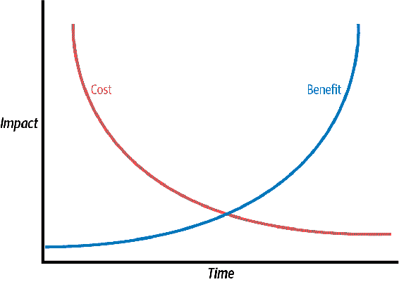

# 第七章：实际采用类型检查

许多开发人员梦想有一天终于可以在一个全新的绿地项目中工作。绿地项目是全新的项目，你可以在代码的架构、设计和模块化上有一个空白的板子。然而，大多数项目很快就变成了褐地或遗留代码。这些项目已经存在一段时间了；很多架构和设计已经固化。进行重大变更将影响真实用户。术语“褐地”通常被视为贬义，特别是当你感觉自己在浑浊的一团泥中跋涉时。

然而，并非所有的褐地项目都是一种惩罚。《与遗留代码高效工作》（Pearson）的作者 Michael Feathers 这样说：

> 在一个维护良好的系统中，可能需要一段时间来弄清楚如何进行更改，但一旦做到了，更改通常很容易，并且你对系统感到更加舒适。在一个遗留系统中，弄清楚该做什么可能需要很长时间，而且变更也很困难。¹

Feathers 将遗留代码定义为“没有测试的代码”。我更倾向于另一种定义：遗留代码就是那些你无法再与编写它的开发人员讨论代码的代码。在没有那种交流的情况下，你依赖代码库本身来描述其行为。如果代码库清楚地传达了其意图，那么这是一个维护良好的系统，易于操作。可能需要一点时间来理解它，但一旦理解了，你就能够添加功能并发展系统。然而，如果那个代码库难以理解，你将面临一场艰苦的战斗。那些代码变得难以维护。这就是为什么健壮性至关重要。编写健壮的代码通过使代码更易于维护，从绿地向褐地的过渡更加顺畅。

我在本书的第一部分展示的大多数类型注解策略在项目刚开始时更容易采用。在成熟项目中采用这些实践更具挑战性。这并非不可能，但成本可能更高。这是工程的核心：在权衡中做出明智的决策。

# 权衡

每个决策都涉及权衡。许多开发人员关注算法中经典的时间与空间权衡。但还有许多其他权衡，通常涉及无形的特质。我已经在本书的第一部分广泛介绍了类型检查器的好处：

+   类型检查器增加了沟通，并减少了出错的机会。

+   类型检查器为进行变更提供了安全网，并增强了代码库的健壮性。

+   类型检查器能让你更快地提供功能。

但是，成本是什么？采用类型注解并非免费，而且随着代码库的增大而变得更糟。这些成本包括：

+   需要获得认同。根据文化背景，说服一个组织采用类型检查可能需要一些时间。

+   一旦获得认同，就会有采用的初始成本。开发人员不会一夜之间开始为他们的代码添加类型注解，他们需要时间才能理解它。他们需要学习和实验，然后才能接受。

+   采用工具需要时间和精力。您需要以某种方式进行集中检查，并且开发人员需要熟悉在工作流程中运行这些工具。

+   在您的代码库中写入类型注解需要时间。

+   当类型注解被检查时，开发人员将不得不习惯于在与类型检查器的战斗中减速。在思考类型时会有额外的认知负担。

开发人员的时间是昂贵的，而且很容易集中精力在那些开发人员可能在做的其他事情上。采用类型注解并非免费。更糟糕的是，对于足够庞大的代码库来说，这些成本很容易超过类型检查所带来的初始好处。问题本质上是一个鸡和蛋的困境。在代码库中写入足够的类型之前，您不会看到类型注解的好处。然而，在早期没有这些好处的情况下获得认同编写类型是困难的。您可以将您的价值建模为：

+   价值 =（总收益）-（总成本）

您的收益和成本将遵循一条曲线；它们不是线性函数。我已经概述了图 7-1 中曲线的基本形状。



###### 图 7-1\. 随时间变化的成本和收益曲线

我故意没有列出范围，因为规模会根据您的代码库大小而变化，但形状保持不变。您的成本将一开始很高，但随着采用增加，会变得更容易。您的收益一开始很低，但随着注释代码库，您将看到更多价值。直到这两条曲线相交，您才会看到投资回报。为了最大化价值，您需要尽早达到这个交点。

# 更早地实现收支平衡

要最大化类型注解的收益，您需要尽早获得价值或尽早减少成本。这两条曲线的交点是一个收支平衡点；这是您的付出努力与您所获得价值相抵消的地方。您希望尽快可持续地达到这一点，以便您的类型注解产生积极影响。以下是一些实现这一目标的策略。

## 找到您的痛点

创造价值的最佳方式之一是减少您当前正在经历的痛苦。问问自己：我目前的过程中哪些地方花费了我的时间？我在哪里损失了金钱？看看您的测试失败和客户反馈。这些错误案例造成了实际成本；您应该进行根本原因分析。如果发现通过类型注释可以修复常见的根本原因，那么您有充分的理由采用类型注释。以下是您需要密切关注的特定错误类别：

+   任何关于`None`的错误

+   无效的属性访问，例如试图在错误的类型上访问函数的变量

+   关于类型转换的错误，例如整数与字符串、字节与字符串或列表与元组

此外，与必须在代码库中工作的人交谈。排查那些经常引起困惑的区域。如果开发人员今天在代码库的某些部分遇到问题，未来的开发人员可能也会遇到困难。

别忘了与那些对您的代码库有投资但可能不直接在其中工作的人交谈，例如技术支持、产品管理和质量保证。他们通常对代码库中的痛点有独特的看法，这在查看代码时可能不明显。尝试将这些成本转化为具体的术语，比如时间或金钱。这在评估类型注释将带来益处的地方将是非常宝贵的。

## 有策略地定位代码

您可能希望专注于尽早获得价值。类型注释不会在大型代码库中一夜之间出现。相反，您将需要确定具体且战略性的代码区域以便进行类型注释。类型注释的美妙之处在于它们是完全可选的。通过仅对这些区域进行类型检查，您可以非常快速地看到好处，而无需巨大的前期投入。以下是您可能采用的一些策略，以选择性地对代码进行类型注释。

### 仅对新代码进行类型注释

考虑保持当前的未注释代码不变，并根据以下两个规则注释代码：

+   注释您编写的任何新代码。

+   注释您更改的任何旧代码。

随着时间的推移，您将在所有代码中构建出类型注释，除了长时间没有更改的代码。长时间没有更改的代码相对稳定，可能不经常被阅读。为其进行类型注释不太可能为您带来太多好处。

### 从下往上类型注释

你的代码库可能依赖于常见的代码区域。这些是你的核心库和实用程序，它们作为一切构建的基础。对代码库中的这些部分进行类型注释使你的收益更多地体现在广度上而不是深度上。因为许多其他部分都位于这个基础之上，它们都将受益于类型检查。新代码很常常也会依赖于这些实用程序，因此你的新代码将具有额外的保护层。

### 对你的赚钱代码进行类型注释

在一些代码库中，核心业务逻辑与支持业务逻辑的所有其他代码之间存在明显的分离。你的*业务逻辑*是系统中最负责提供价值的部分。它可能是旅行社的核心预订系统，餐厅的订单系统，或者媒体服务的推荐系统。所有其他代码（例如日志记录、消息传递、数据库驱动程序和用户界面）存在的目的是支持你的业务逻辑。通过对业务逻辑进行类型注解，你正在保护代码库的核心部分。这些代码通常存在较长的生命周期，使其成为长期价值的简单获得。

### 对代码变动频繁的部分进行类型注解

你的代码库中有些部分的变化频率远高于其他部分。每次代码变动时，都存在着错误假设引入 bug 的风险。健壮代码的整个重点在于减少引入错误的机会，那么有什么比经常变化的代码更好的地方来保护呢？查找在版本控制中有许多不同提交的代码，或者分析哪些文件在一段时间内改动的代码行数最多。还要看一下哪些文件有最多的提交者；这是一个很好的指示，表明这是一个你可以加强类型注解以进行沟通的区域。

### 对复杂代码进行类型注解

如果你遇到了一些复杂的代码，理解它将需要一些时间。在理解该代码之后，你可以为下一个阅读代码的开发人员减少复杂性。重构代码、改进命名和添加注释都是提高理解能力的绝佳方法，但也要考虑添加更多类型注解。类型注解将帮助开发人员理解使用的类型、如何调用函数以及如何处理返回值。类型注解为复杂代码提供了额外的文档。

# 讨论话题

这些策略中哪些对你的代码库最有益？为什么这种策略对你最有效？实施该策略的成本是多少？

## 倚赖你的工具

有些事情计算机做得很好，有些事情人类做得很好。这一部分是关于前者的。在尝试采用类型注解时，自动化工具可以提供一些极好的帮助。首先，让我们来谈谈目前最常见的类型检查器：mypy。

我在第六章中对 mypy 的配置进行了相当详细的介绍，但还有一些我想深入探讨的选项，这些选项将帮助您采用类型检查。你将遇到的最大问题之一是，在较大的代码库上第一次运行 mypy 时，它将报告的错误数量之多。在这种情况下，你可能犯的最大错误就是保持数百（或数千）个错误，并希望开发人员随着时间的推移逐渐消除这些错误。

这些错误不会迅速修复。如果这些错误总是打开的话，你就看不到类型检查器的好处，因为几乎不可能检测到新错误。任何新问题都会在其他问题的噪音中丢失。

使用 mypy，你可以通过配置告诉类型检查器忽略某些类别的错误或模块。这里是一个样本 mypy 文件，如果返回`Any`类型则全局警告，并在每个模块基础上设置配置选项：

```py
# Global options:

[mypy]
python_version = 3.9
warn_return_any = True

# Per-module options:

[mypy-mycode.foo.*]
disallow_untyped_defs = True

[mypy-mycode.bar]
warn_return_any = False

[mypy-somelibrary]
ignore_missing_imports = True
```

使用这种格式，你可以挑选并选择你的类型检查器追踪的错误。你可以屏蔽所有现有的错误，同时专注于修复新错误。在定义要忽略的错误时，要尽可能具体；你不想掩盖代码的其他部分出现的新错误。

更具体地说，mypy 会忽略任何带有`# type: ignore`注释的行。

```py
# typechecks just fine
a: int = "not an int" # type: ignore
```

###### 警告

`# type: ignore`不应成为偷懒的借口！在编写新代码时，不要忽略类型错误——在编写时就修复它们。

你采用类型注释的首要目标是确保你的类型检查器完全运行无误。如果有错误，你需要用注释修复它们（推荐），或者接受不是所有错误都能很快修复的事实，并忽略它们。

随着时间的推移，确保被忽略的代码部分的数量减少。你可以跟踪包含`# type: ignore`行的数量，或者你正在使用的配置文件部分的数量；无论如何，努力尽可能少地忽略这些部分（在合理的范围内，当然——这里有递减收益法则）。

我还建议在你的 mypy 配置中打开`warn_unused_ignores`标志，这样当不再需要一个忽略指令时会发出警告。

现在，这一切都不能帮助你更接近实际注释代码的目标；它只是给你一个起点。为了帮助用工具注释你的代码库，你需要一些能够自动插入注释的东西。

### MonkeyType

[MonkeyType](https://github.com/Instagram/MonkeyType)是一个工具，将自动为你的 Python 代码添加注释。这是一种在不花费太多精力的情况下对大量代码进行类型检查的好方法。

首先用`pip`安装 MonkeyType：

```py
pip install monkeytype
```

假设你的代码库控制着一个自动厨师，带有机械臂，能够每次都烹饪出完美的食物。你想要为这位厨师编程，使用我家最喜欢的食谱之一，意大利香肠通心粉：

```py
# Pasta with Sausage Automated Maker 
italian_sausage = Ingredient('Italian Sausage', 4, 'links')
olive_oil = Ingredient('Olive Oil', 1, 'tablespoon')
plum_tomato = Ingredient('Plum Tomato', 6, '')
garlic = Ingredient('Garlic', 4, 'cloves')
black_pepper = Ingredient('Black Pepper', 2, 'teaspoons')
basil = Ingredient('Basil Leaves', 1, 'cup')
pasta = Ingredient('Rigatoni', 1, 'pound')
salt = Ingredient('Salt', 1, 'tablespoon')
water = Ingredient('Water', 6, 'quarts')
cheese = Ingredient('Pecorino Romano', 2, "ounces")
pasta_with_sausage = Recipe(6, [italian_sausage,
                                olive_oil,
                                plum_tomato,
                                garlic,
                                black_pepper,
                                pasta,
                                salt,
                                water,
                                cheese,
                                basil])

def make_pasta_with_sausage(servings): 
    sauté_pan = Receptacle('Sauté Pan')
    pasta_pot = Receptacle('Stock Pot')
    adjusted_recipe = adjust_recipe(pasta_with_sausage, servings)

    print("Prepping ingredients") 

    adjusted_tomatoes = adjusted_recipe.get_ingredient('Plum Tomato')
    adjusted_garlic = adjusted_recipe.get_ingredient('Garlic')
    adjusted_cheese = adjusted_recipe.get_ingredient('Pecorino Romano')
    adjusted_basil = adjusted_recipe.get_ingredient('Basil Leaves')

    garlic_and_tomatoes = recipe_maker.dice(adjusted_tomatoes,
                                            adjusted_garlic)
    grated_cheese = recipe_maker.grate(adjusted_cheese)
    sliced_basil = recipe_maker.chiffonade(adjusted_basil)

    print("Cooking Pasta") 
    pasta_pot.add(adjusted_recipe.get_ingredient('Water'))
    pasta_pot.add(adjusted_recipe.get_ingredient('Salt'))
    recipe_maker.put_receptacle_on_stovetop(pasta_pot, heat_level=10)

    pasta_pot.add(adjusted_recipe.get_ingredient('Rigatoni'))
    recipe_maker.set_stir_mode(pasta_pot, ('every minute'))

    print("Cooking Sausage")
    sauté_pan.add(adjusted_recipe.get_ingredient('Olive Oil'))
    heat_level = recipe_maker.HeatLevel.MEDIUM
    recipe_maker.put_receptacle_on_stovetop(sauté_pan, heat_level)
    sauté_pan.add(adjusted_recipe.get_ingredient('Italian Sausage'))
    recipe_maker.brown_on_all_sides('Italian Sausage')
    cooked_sausage = sauté_pan.remove_ingredients(to_ignore=['Olive Oil'])

    sliced_sausage = recipe_maker.slice(cooked_sausage, thickness_in_inches=.25)

    print("Making Sauce")
    sauté_pan.add(garlic_and_tomatoes)
    recipe_maker.set_stir_mode(sauté_pan, ('every minute'))
    while recipe_maker.is_not_cooked('Rigatoni'):
        time.sleep(30)
    cooked_pasta = pasta_pot.remove_ingredients(to_ignore=['Water', 'Salt'])

    sauté_pan.add(sliced_sausage)
    while recipe_maker.is_not_cooked('Italian Sausage'):
        time.sleep(30)

    print("Mixing ingredients together")
    sauté_pan.add(sliced_basil)
    sauté_pan.add(cooked_pasta)
    recipe_maker.set_stir_mode(sauté_pan, "once")

    print("Serving") 
    dishes = recipe_maker.divide(sauté_pan, servings)

    recipe_maker.garnish(dishes, grated_cheese)
    return dishes
```


所有配料的定义


做香肠通心粉的功能


准备指南


烹饪说明


使用说明

我省略了很多辅助函数以节省空间，但这让您了解我试图实现的内容。您可以在附带本书的[GitHub 仓库](https://github.com/pviafore/RobustPython)中查看完整示例。

在整个示例中，我没有任何类型注释。我不想手动编写所有的类型注释，因此我将使用 MonkeyType。为了帮助，我可以生成*存根文件*来创建类型注释。存根文件只包含函数签名。

为了生成存根文件，您必须运行您的代码。这是一个重要的细节；MonkeyType 只会注释您先运行的代码。您可以像这样运行特定脚本：

```py
monkeytype run code_examples/chapter7/main.py
```

这将生成一个`SQLite`数据库，其中存储了程序执行过程中的所有函数调用。您应该尽可能运行系统的多个部分以填充此数据库。单元测试，集成测试和测试程序都有助于填充数据库。

###### 提示

因为 MonkeyType 通过使用`sys.setprofile`来仪器化您的代码工作，其他仪器化，如代码覆盖率和分析，将无法同时工作。任何使用仪器化的工具都需要单独运行。

当您通过代码的多条路径后，可以生成存根文件：

```py
monkeytype stub code_examples.chapter7.pasta_with_sausage
```

这将输出此特定模块的存根文件：

```py
def adjust_recipe(
    recipe: Recipe,
    servings: int
) -> Recipe: ...

class Receptacle:
    def __init__(self, name: str) -> None: ...
    def add(self, ingredient: Ingredient) -> None: ...

class Recipe:
    def clear_ingredients(self) -> None: ...
    def get_ingredient(self, name: str) -> Ingredient: ...
```

它不会注释所有内容，但肯定会为您的代码库提供足够的起步。一旦您对建议感到满意，可以使用`monkeytype apply <module-name>`应用它们。生成这些注释后，搜索代码库中任何使用`Union`的地方。`Union`告诉您在代码执行过程中，该函数作为参数传递了多种类型。这是一种*代码异味*，或者即使不完全错误（尚未），看起来有些奇怪的东西。在这种情况下，使用`Union`可能表示代码难以维护；您的代码接收到不同类型可能并不具备处理它们的能力。如果参数传递错误类型，这很可能表明某处的假设已被无效化。

举例说明，我的`recipe_maker`存根包含一个函数签名中的`Union`：

```py
def put_receptacle_on_stovetop(
    receptacle: Receptacle,
    heat_level: Union[HeatLevel, int]
) -> None: ...
```

参数`heat_level`在某些情况下采用了`HeatLevel`，在其他情况下采用了整数。回顾我的配方，我看到以下代码行：

```py
recipe_maker.put_receptacle_on_stovetop(pasta_pot, heat_level=10)
# ...
heat_level = recipe_maker.HeatLevel.MEDIUM
recipe_maker.put_receptacle_on_stovetop(sauté_pan, heat_level)
```

这是否是错误取决于函数的实现。在我的情况下，我希望保持一致，因此我会将整数用法更改为`Enum`用法。对于您的代码库，您需要确定什么是可接受的，什么是不可接受的。

### Pytype

MonkeyType 的一个问题是它只会注释运行时看到的代码。如果您的代码有一些成本高昂或无法运行的分支，MonkeyType 将无法为您提供太多帮助。幸运的是，有一个工具填补了这个空白：[Pytype](https://github.com/google/pytype)，由 Google 编写。Pytype 通过静态分析添加类型注解，这意味着它不需要运行您的代码来确定类型。

要运行 Pytype，请使用`pip`进行安装：

```py
pip install pytype
```

然后，在您的代码文件夹上运行 Pytype（例如，*code_examples/chapter7*）：

```py
pytype code_examples/chapter7
```

这将在*.pytype*文件夹中生成一组*.pyi*文件。这些文件与 MonkeyType 创建的存根文件非常相似。它们包含了带有注释的函数签名和变量，您可以将其复制到您的源文件中。

Pytype 还提供其他有趣的好处。Pytype 不仅仅是一种类型注解工具；它还是一个完整的检查器和类型检查工具。它与其他类型检查器（如 mypy、Pyright 和 Pyre）具有不同的类型检查哲学。

Pytype 将使用推断来进行类型检查，这意味着即使在缺少类型注解的情况下，它也将对您的代码进行类型检查。这是在不必在整个代码库中编写类型的情况下获得类型检查器好处的一个很好的方法。

Pytype 对类型在其生命周期中改变也更加宽容。这对于完全接受 Python 动态类型特性的人来说是一个福音。只要代码在运行时能够工作，Pytype 就很高兴。例如：

```py
    # Run in Python 3.6
    def get_pasta_dish_ingredients(ingredients: list[Ingredient]
                                   ) -> list[str]:
    names = ingredients
    # make sure there is water to boil the pasta in
    if does_not_contain_water(ingredients)
        names.append("water")
    return [str(i) for i in names]
```

在这种情况下，名称将首先作为一个`Ingredients`列表。如果水不在配料中，我会将字符串“water”添加到列表中。此时，列表是异构的；它既包含配料又包含字符串。如果您将名称注释为`list[Ingredient]`，mypy 将在这种情况下报错。在这里，我通常也会提出异构集合的一个红旗；在没有良好类型注解的情况下，这些集合很难推理。然而，下一行使 mypy 和我的反对都变得无关紧要。当返回时，一切都被转换为字符串，这符合预期的返回类型注解。Pytype 足够智能，能够检测到这一点，并认为此代码没有问题。

Pytype 的宽容度和类型检查方法使其非常适合用于现有代码库。您无需添加任何类型注解即可看到价值。这意味着您可以在非常少的工作量下获得类型检查器的所有好处。高价值，低成本？当然。

但是，在这种情况下，Pytype 是一把双刃剑。确保您不要将 Pytype 用作支架；您仍应编写类型注解。通过 Pytype，认为您根本不需要类型注解变得非常容易。然而，出于两个原因，您仍应编写它们。首先，类型注解提供了文档化的好处，这有助于提高代码的可读性。其次，如果存在类型注解，Pytype 将能够做出更加智能的决策。

# 总结思路

类型注解非常有用，但它们的成本不可否认。代码库越大，实际采用类型注解的成本就越高。每个代码库都是不同的；您需要评估特定情景下类型注解的价值和成本。如果类型注解的成本过高，请考虑以下三种策略来克服这一障碍：

找到痛点

如果您可以通过类型注解消除错误、破损测试或不清晰代码等整类痛点，那么您将节省时间和金钱。您的目标是解决最痛的领域，通过减轻痛苦使开发人员随着时间的推移更轻松地交付价值（这是可维护代码的明确标志）。

策略性地定位代码目标

明智地选择位置。在大型代码库中，注解每个有意义的代码部分几乎是不可能的。相反，重点放在能够获得巨大收益的较小部分上。

依赖您的工具

使用 mypy 帮助您选择性地忽略文件（并确保随着时间的推移忽略的代码行数越来越少）。使用 MonkeyType 和 Pytype 等类型注解工具，快速在整个代码中生成类型。不要忽视 Pytype 作为类型检查器，因为它可以在最小设置的情况下发现代码中潜藏的错误。

这是书的第一部分的总结。它专注于类型注解和类型检查。请随意混合和匹配我讨论的策略和工具。您不需要对所有内容都进行类型注解，因为如果严格应用，类型注解可能会限制表达能力。但是，您应该努力澄清代码并使其更难出现错误。随着时间的推移，您将找到平衡点，但您需要开始思考在 Python 中如何表达类型以及如何向其他开发人员解释它们的意图。记住，目标是可维护的代码库。人们需要能够从代码本身理解尽可能多的您意图。

在第二部分，我将重点介绍如何创建自己的类型。您已经通过构建自己的集合类型稍微了解了一些内容，但您可以做得更多。您将学习枚举、数据类和类，并了解为什么应该选择一个而不是另一个。您将学习如何设计 API 并对类型进行子类化和建模。您将继续建立提高代码库可读性的词汇表。

¹ 迈克尔·C·费瑟斯。《与遗留代码有效工作》。Upper Saddle River, NJ: Pearson, 2013 年。
