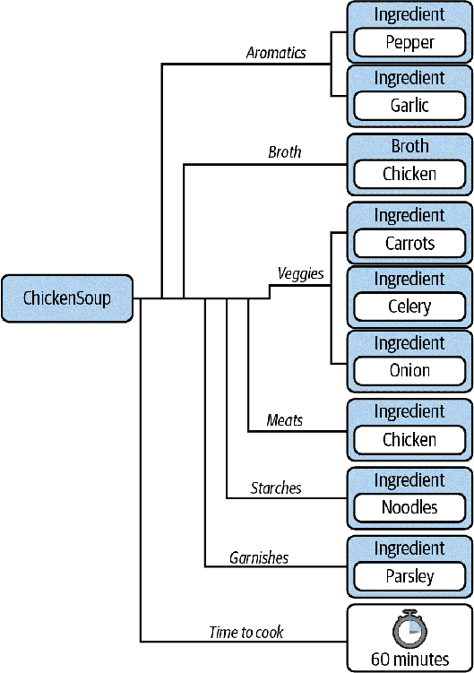

# 第九章. 用户定义类型：数据类

数据类是用户定义的类型，允许您将相关数据组合在一起。许多类型，如整数、字符串和枚举，都是*标量*；它们表示一个且仅一个值。其他类型，如列表、集合和字典，表示同类集合。但是，您仍然需要能够将多个数据字段组合成单个数据类型。字典和元组可以做到这一点，但它们存在一些问题。可读性较差，因为在运行时很难知道字典或元组包含什么内容。这使得在阅读和审查代码时很难理解，这对代码的健壮性是一个重大打击。

当您的数据难以理解时，读者会做出错误的假设，并且很难发现错误。数据类更易于阅读和理解，并且类型检查器知道如何自然地处理它们。

# 数据类实例

数据类表示一个混合集合的变量，全部被卷入一个*复合类型*中。复合类型由多个值组成，应始终表示某种关系或逻辑分组。例如，`Fraction`是复合类型的一个很好的例子。它包含两个标量值：一个`分子`和一个`分母`。

```py
from fraction import Fraction
Fraction(numerator=3, denominator=5)
```

此`Fraction`表示`分子`和`分母`之间的关系。`分子`和`分母`是彼此独立的；更改其中一个不会影响另一个。但是，通过将它们组合成单一类型，它们被组合在一起以创建一个逻辑概念。

数据类允许您轻松创建这些概念。要使用`dataclass`表示分数，您需要执行以下操作：

```py
from dataclasses import dataclass
@dataclass
class MyFraction:
    numerator: int = 0
    denominator: int = 1
```

简单吧？在类定义前的`@dataclass`被称为*装饰器*。您将在第十七章中详细了解装饰器，但现在，您只需知道在类前加上`@dataclass`会将其转换为`dataclass`。装饰类后，您需要列出所有要表示为关系的字段。必须提供默认值或类型，以便 Python 将其识别为该`dataclass`的成员。在上述情况下，我展示了两者都有。

通过建立这样的关系，您可以为代码库中的共享词汇增添内容。与开发人员总是需要单独实现每个字段不同，您提供了一个可重复使用的分组。数据类强制您显式地为字段分配类型，因此在维护时减少类型混淆的机会。

数据类和其他用户定义的类型可以嵌套在`dataclass`中。假设我正在创建一个自动化的汤制造机，并且需要将我的汤成分分组在一起。使用`dataclass`，它看起来像这样：

```py
import datetime
from dataclasses import dataclass
from enum import auto, Enum

class ImperialMeasure(Enum): 
    TEASPOON = auto()
    TABLESPOON = auto()
    CUP = auto()

class Broth(Enum): 
    VEGETABLE = auto()
    CHICKEN = auto()
    BEEF = auto()
    FISH = auto()

@dataclass(frozen=True) 
# Ingredients added into the broth
class Ingredient:
    name: str
    amount: float = 1
    units: ImperialMeasure = ImperialMeasure.CUP

@dataclass
class Recipe: 
    aromatics: set[Ingredient]
    broth: Broth
    vegetables: set[Ingredient]
    meats: set[Ingredient]
    starches: set[Ingredient]
    garnishes: set[Ingredient]
    time_to_cook: datetime.timedelta
```


用于跟踪不同液体测量尺寸的枚举


一个用于跟踪汤中使用的高汤的枚举


表示放入汤中的单个配料的`dataclass`。请注意，参数`frozen=True`是`dataclass`的特殊属性，表示这个`dataclass`是不可变的（稍后详细讨论）。这并不意味着这些配料来自超市的冷冻部分。


表示汤食谱的`dataclass`

我们能够将多个用户定义的类型（`ImperialMeasure`、`Broth`和`Ingredient`）组合到一个复合类型`Recipe`中。从这个`Recipe`中，您可以推断出多个概念：

+   汤食谱是一组分组的信息。具体来说，它可以由其配料（分为特定类别）、使用的高汤以及烹饪所需的时间来定义。

+   每种配料都有一个名称和您需要的数量。

+   您可以使用枚举来了解汤高汤和测量单位。这些本身不构成关系，但确实向读者传达了意图。

+   每个配料分组都是一个集合，而不是元组。这意味着用户可以在构建后更改这些配料，但仍然可以防止重复。

要创建`dataclass`，我执行以下操作：

```py
pepper = Ingredient("Pepper", 1, ImperialMeasure.TABLESPOON)
garlic = Ingredient("Garlic", 2, ImperialMeasure.TEASPOON)
carrots = Ingredient("Carrots", .25, ImperialMeasure.CUP)
celery = Ingredient("Celery", .25, ImperialMeasure.CUP)
onions = Ingredient("Onions", .25, ImperialMeasure.CUP)
parsley = Ingredient("Parsley", 2, ImperialMeasure.TABLESPOON)
noodles = Ingredient("Noodles", 1.5, ImperialMeasure.CUP)
chicken = Ingredient("Chicken", 1.5, ImperialMeasure.CUP)

chicken_noodle_soup = Recipe(
    aromatics={pepper, garlic},
    broth=Broth.CHICKEN,
    vegetables={celery, onions, carrots},
    meats={chicken},
    starches={noodles},
    garnishes={parsley},
    time_to_cook=datetime.timedelta(minutes=60))
```

您还可以获取和设置单个字段：

```py
chicken_noodle_soup.broth
>>> Broth.CHICKEN
chicken_noodle_soup.garnishes.add(pepper)
```

Figure 9-1 显示了这个`dataclass`的构造方式。



###### 图 9-1。`dataclass`的构造

通过类型的使用，我清楚地定义了什么是食谱。用户不能漏掉任何字段。创建复合类型是通过代码库表达关系的最佳方式之一。

到目前为止，我只描述了`dataclass`中的字段，但您也可以通过方法添加行为。假设我想通过替换蔬菜高汤和去除任何肉类来使任何汤变成素食。我还想列出所有的配料，以便您可以确保没有肉类产品混入。

我可以像这样直接向`dataclass`添加方法：

```py
@dataclass
class Recipe:
    aromatics: set[Ingredient]
    broth: Broth
    vegetables: set[Ingredient]
    meats: set[Ingredient]
    starches: set[Ingredient]
    garnishes: set[ingredient]
    time_to_cook: datetime.timedelta

    def make_vegetarian(self):
        self.meats.clear()
        self.broth = Broth.VEGETABLE

    def get_ingredient_names(self):
        ingredients = (self.aromatics |
                       self.vegetables |
                       self.meats |
                       self.starches |
                       self.garnishes)

        return ({i.name for i in ingredients} |
                {self.broth.name.capitalize() + " broth"})
```

这比原始字典或元组有了重大改进。我可以直接嵌入功能到我的`dataclass`中，提高了可重用性。如果用户想要获取所有的配料名称或使食谱变为素食，他们不必每次都记得自己去做。调用函数简单明了。这里是直接在`dataclass`上调用函数的示例。

```py
from copy import deepcopy
# make a deep copy so that changing one soup
# does not change the original
noodle_soup = deepcopy(chicken_noodle_soup)
noodle_soup.make_vegetarian()
noodle_soup.get_ingredient_names()
>>> {'Garlic', 'Pepper', 'Carrots', 'Celery', 'Onions',
     'Noodles', 'Parsley', 'Vegetable Broth'}
```

# 用法

`dataclass`具有一些内置函数，使其非常易于使用。您已经看到构造数据类是一件轻而易举的事情，但您还能做什么呢？

## 字符串转换

有两个特殊方法，`__str__`和`__repr__`，用于将对象转换为其非正式和正式的字符串表示形式。¹ 注意它们周围的双下划线；它们被称为*魔术方法*。我将在第十一章中更详细地介绍魔术方法，但现在，您可以将它们视为在对象上调用`str()`或`repr()`时调用的函数。数据类默认定义这些函数：

```py
# Both repr() and str() will return the output below
str(chicken_noodle_soup)
>>> Recipe(
    aromatics={
        Ingredient(name='Pepper', amount=1, units=<ImperialMeasure.TABLESPOON: 2>),
        Ingredient(name='Garlic', amount=2, units=<ImperialMeasure.TEASPOON: 1>)},
    broth=<Broth.CHICKEN: 2>,
    vegetables={
        Ingredient(name='Celery', amount=0.25, units=<ImperialMeasure.CUP: 3>),
        Ingredient(name='Onions', amount=0.25, units=<ImperialMeasure.CUP: 3>),
        Ingredient(name='Carrots', amount=0.25, units=<ImperialMeasure.CUP: 3>)},
    meats={
        Ingredient(name='Chicken', amount=1.5, units=<ImperialMeasure.CUP: 3>)},
    starches={
        Ingredient(name='Noodles', amount=1.5, units=<ImperialMeasure.CUP: 3>)},
    garnishes={
        Ingredient(name='Parsley', amount=2,
                   units=<ImperialMeasure.TABLESPOON: 2>)},
    time_to_cook=datetime.timedelta(seconds=3600)
)
```

有点冗长，但这意味着您不会得到像`<__main__.Recipe object at 0x7fef44240730>`这样更丑陋的东西，这是其他用户定义类型的默认字符串转换。

## 相等性

如果要能够在两个数据类之间进行相等性测试（==、!=），可以在定义`dataclass`时指定`eq=True`：

```py
from copy import deepcopy

@dataclass(eq=True)
class Recipe:
    # ...

chicken_noodle_soup == noodle_soup
>>> False

noodle_soup == deepcopy(noodle_soup)
>>> True
```

默认情况下，相等性检查将比较`dataclass`的两个实例的每个字段。在执行相等性检查时，Python 机械地调用名为`__eq__`的函数。如果希望为相等性检查提供不同的默认功能，可以编写自己的`__eq__`函数。

## 关系比较

假设我想在我的汤应用程序中显示营养信息给健康意识的用户。我希望能够按照各种轴排序汤，例如卡路里或碳水化合物的数量。

```py
nutritionals = [NutritionInformation(calories=100, fat=1, carbohydrates=3),
                NutritionInformation(calories=50, fat=6, carbohydrates=4),
                NutritionInformation(calories=125, fat=12, carbohydrates=3)]
```

默认情况下，数据类不支持关系比较（`<`、`>`、`<=`、`>=`），因此无法对信息进行排序：

```py
>>> sorted(nutritionals)
```

```py
TypeError: '<' not supported between instances of
           'NutritionInformation' and 'NutritionInformation'
```

如果要能够定义关系比较（`<`、`>`、`<=`、`>=`），您需要在`dataclass`定义中设置`eq=True`和`order=True`。生成的比较函数将依次比较每个字段，按照定义时的顺序进行比较。

```py
@dataclass(eq=True, order=True)
class NutritionInformation:
    calories: int
    fat: int
    carbohydrates: int
nutritionals = [NutritionInformation(calories=100, fat=1, carbohydrates=3),
                NutritionInformation(calories=50, fat=6, carbohydrates=4),
                NutritionInformation(calories=125, fat=12, carbohydrates=3)]

>>> sorted(nutritionals)
    [NutritionInformation(calories=50, fat=6, carbohydrates=4),
     NutritionInformation(calories=100, fat=1, carbohydrates=3),
     NutritionInformation(calories=125, fat=12, carbohydrates=3)]
```

如果您想控制如何定义比较，可以在`dataclass`中编写自己的`__le__`、`__lt__`、`__gt__`和`__ge__`函数，分别映射到小于或等于、小于、大于和大于或等于。例如，如果您希望`NutritionInformation`默认按照脂肪、碳水化合物和卡路里的顺序排序：

```py
@dataclass(eq=True)
class NutritionInformation:
    calories: int
    fat: int
    carbohydrates: int

    def __lt__(self, rhs) -> bool:
        return ((self.fat, self.carbohydrates, self.calories) <
                (rhs.fat, rhs.carbohydrates, rhs.calories))

    def __le__(self, rhs) -> bool:
        return self < rhs or self == rhs

    def __gt__(self, rhs) -> bool:
        return not self <= rhs

    def __ge__(self, rhs) -> bool:
        return not self < rhs

nutritionals = [NutritionInformation(calories=100, fat=1, carbohydrates=3),
                NutritionInformation(calories=50, fat=6, carbohydrates=4),
                NutritionInformation(calories=125, fat=12, carbohydrates=3)]

>>> sorted(nutritionals)
    [NutritionInformation(calories=100, fat=1, carbohydrates=3),
     NutritionInformation(calories=50, fat=6, carbohydrates=4),
     NutritionInformation(calories=125, fat=12, carbohydrates=3)]
```

###### 警告

如果重写比较函数，请不要指定`order=True`，因为这将引发`ValueError`。

## 不可变性

有时，您需要表明`dataclass`不应该可以更改。在这种情况下，您可以指定`dataclass`必须是`frozen`或无法更改的。每当改变`dataclass`的状态时，您都可能引入整个类别的可能错误：

+   您代码的调用者可能不知道字段已更改；他们可能错误地假设字段是静态的。

+   将单个字段设置为不正确的值可能与其他字段的设置方式不兼容。

+   如果有多个线程修改字段，您将面临数据竞争的风险，这意味着无法保证修改的顺序。

如果您的`dataclass`是`frozen`，则不会发生这些错误情况。要冻结一个`dataclass`，只需向`dataclass`装饰器添加`frozen=True`：

```py
@dataclass(frozen=True)
class Recipe:
    aromatics: Set[Ingredient]
    broth: Broth
    vegetables: Set[Ingredient]
    meats: Set[Ingredient]
    starches: Set[Ingredient]
    garnishes: Set[Ingredient]
    time_to_cook: datetime.timedelta
```

如果您希望将您的`dataclass`用作集合中的元素或作为字典中的键，则它必须是*可哈希的*。这意味着它必须定义一个`__hash__`函数，将您的对象转换为一个数字。² 当您冻结一个`dataclass`时，它会自动变为可哈希的，只要您不明确禁用相等检查并且所有字段都是可哈希的。

关于这种不可变性有两个需要注意的地方。首先，当我说不可变性时，我指的是`dataclass`中的字段，而不是包含`dataclass`本身的变量。例如：

```py
# assume that Recipe is immutable because
# frozen was set to true in the decorator
soup = Recipe(
    aromatics={pepper, garlic},
    broth=Broth.CHICKEN,
    vegetables={celery, onions, carrots},
    meats={chicken},
    starches={noodles},
    garnishes={parsley},
    time_to_cook=datetime.timedelta(minutes=60))

# this is an error
soup.broth =  Broth.VEGETABLE

# this is not an error
soup = Recipe(
    aromatics=set(),
    broth=Broth.CHICKEN,
    vegetables=set(),
    meats=set(),
    starches=set(),
    garnishes=set(),
    time_to_cook=datetime.timedelta(seconds=3600))
)
```

如果您希望类型检查器在变量重新绑定时报错，可以将变量注释为`Final`（有关`Final`的更多详细信息，请参见第四章）。

其次，`frozen` `dataclass`仅防止其成员被设置。如果成员是可变的，则仍然可以调用这些成员的方法来修改它们的值。`frozen` `dataclass`不会将不可变性扩展到其属性。

例如，这段代码是完全没有问题的：

```py
soup.aromatics.add(Ingredient("Garlic"))
```

即使它正在修改`frozen` `dataclass`的*aromatics*字段，也不会引发错误。在使用`frozen` `dataclass`时，使成员不可变（例如整数、字符串或其他`frozen` `dataclass`）以避免这种陷阱。

# 与其他类型的比较

数据类相对较新（在 Python 3.7 中引入）；许多传统代码将不包含数据类。在评估数据类的采用时，您需要了解数据类在与其他结构相比的优势所在。

## 数据类与字典的比较

正如在第五章中讨论的，字典非常适合将键映射到值，但当它们是同质化的（所有键都是相同类型，所有值都是相同类型）时才是最适合的。当用于异构数据时，字典对人类的推理更加困难。此外，类型检查器对字典的了解不足以检查错误。

然而，数据类非常适合基本异构数据。代码的读者知道类型中存在的确切字段，并且类型检查器可以检查正确的使用。如果您有异构数据，请在考虑使用字典之前使用数据类。

## 数据类与 TypedDict 的比较

此外，在第五章中还讨论了`TypedDict`类型。这是另一种存储异构数据的方式，对读者和类型检查器都有意义。乍一看，`TypedDict`和数据类解决了非常相似的问题，因此很难决定哪一个更合适。我的经验法则是将`dataclass`视为默认选项，因为它可以在其上定义函数，并且你可以控制不可变性、可比性、相等性和其他操作。但是，如果你已经使用字典（例如用于处理 JSON），你应该考虑使用`TypedDict`，前提是你不需要`dataclass`的任何好处。

## 数据类与 namedtuple

`namedtuple`是集合模块中类似元组的集合类型。与元组不同的是，它允许你为元组中的字段命名，如下所示：

```py
>>> from collections import namedtuple
>>> NutritionInformation = namedtuple('NutritionInformation',
                                      ['calories', 'fat', 'carbohydrates'])
>>> nutrition = NutritionInformation(calories=100, fat=5, carbohydrates=10)
>>> print(nutrition.calories)

100
```

`namedtuple`在使元组更易读方面有很大帮助，但是使用`dataclass`同样如此。我几乎总是选择`dataclass`而不是`namedtuple`。`dataclass`像`namedtuple`一样提供了命名字段以及其他好处，比如：

+   明确为你的参数进行类型注释

+   控制不可变性、可比性和相等性

+   在类型中更容易定义函数

通常情况下，我只在明确需要与 Python 3.6 或更早版本兼容时才使用`namedtuple`。

# 讨论主题

你在代码库中使用什么类型来表示异构数据？如果你使用字典，开发者了解字典中所有键值对有多容易？如果你使用元组，开发者了解各个字段的含义有多容易？

# 总结思路

当 Python 3.7 发布时，数据类是一个重要的变革，因为它允许开发者定义完全类型化但仍然轻量级的异构类型。在编写代码时，我发现自己越来越多地使用数据类。每当你遇到异构的、由开发者控制的字典或`namedtuple`时，数据类更加合适。你可以在[`dataclass`文档](https://oreil.ly/1toSU)中找到大量额外的信息。

然而，尽管数据类很棒，它们不应普遍使用。数据类本质上代表一种概念关系，但只有在数据类内的成员彼此独立时才合适。如果任何成员根据其他成员应受限制，数据类将使得你的代码难以理解。任何开发者都可能在数据类的生命周期内更改字段，可能导致非法状态。在这些情况下，你需要选择更重的东西。在接下来的章节中，我将教你如何使用类来实现这一点。

¹ 非正式的字符串表示对于打印对象很有用。官方的字符串表示重现了关于对象的所有信息，以便可以重建它。

² 哈希是一个复杂的主题，超出了本书的范围。你可以在[Python 文档](https://oreil.ly/JDgLO)中了解更多关于`hash`函数的信息。
