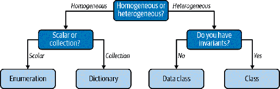

# 第十章 用户定义类型：类

类将是本书中我将介绍的最终用户定义类型。许多开发者很早就学习了类，这既是一个利好又是一个诅咒。类被用在许多框架和代码库中，因此精通类设计是值得的。然而，当开发者过早学习类时，他们会错过何时以及更重要的是何时不应该使用它们的微妙之处。

回想一下你使用类的情况。你能把那些数据表示为一个`dataclass`吗？或者用一组自由函数？我见过太多到处都使用类的代码库，当然他们真的不应该这样做，因此可维护性因此受到影响。

然而，我也遇到过完全不使用类的代码库。这也会影响可维护性；很容易打破假设，并且在整个代码中有不一致的数据。在 Python 中，你应该追求一种平衡。类在你的代码库中有其位置，但是认识到它们的优点和缺点是很重要的。是时候深入挖掘，抛开你的成见，学习类如何帮助你编写更加健壮的代码了。

# 类的解剖

类被设计为另一种将相关数据组合在一起的方式。它们在面向对象范式中有几十年的历史，并且乍看之下与你对数据类学到的东西并没有太大的不同。事实上，你可以像写`dataclass`一样写一个类：

```py
class Person:
    name: str = ""
    years_experience: int = 0
    address: str = ""

pat = Person()
pat.name = "Pat"
print(f"Hello {pat.name}")
```

看着上面的代码，你可能可以用一个`dict`或`dataclass`以不同的方式编写它：

```py
pat = {
    "name": "",
    "years_experience": 0,
    "address": ""
}

@dataclass
class Person():
    name: str = ""
    years_experience: int = 0
    address: str = ""
```

在第九章中，你了解了数据类相对于原始字典的优势，而类提供了许多相同的好处。但你可能会（理所当然地）想知道，为什么你会再次使用类而不是数据类呢？

实际上，考虑到数据类的灵活性和便利性，类可能会感觉不如其优。你得不到像`frozen`或`ordered`这样的高级特性。你得不到内置的字符串方法。为什么呢，你甚至不能像使用数据类那样优雅地实例化一个`Person`。

尝试像这样做：

```py
pat = Person("Pat", 13, "123 Fake St.")
```

当尝试使用类时，你会立即遇到错误：

```py
TypeError: Person() takes no arguments
```

乍看起来，这真的很令人沮丧。然而，这种设计决策是有意的。你需要明确地定义类如何被构建，这通过一个称为*构造函数*的特殊方法完成。与数据类相比，这可能看起来像是一个缺点，但它允许你对类中的字段有更精细的控制。接下来的几节将描述如何利用这种控制带来好处。首先，让我们看看类的构造函数实际上为你提供了什么。

## 构造函数

构造函数描述了如何初始化你的类。你使用一个`__init__`方法来定义构造函数：

```py
class Person:
    def __init__(self,
                  name: str,
                  years_experience: int,
                  address: str):
        self.name = name
        self.years_experience = years_experience
        self.address = address

pat = Person("Pat", 13, "123 Fake St.")
```

注意，我稍微调整了类。与我在`dataclass`中定义变量的方式不同，我在构造函数中定义了所有变量。构造函数是在实例化类时调用的特殊方法。它接受定义用户数据类型所需的参数，以及一个称为`self`的特殊参数。这个参数的具体名称是任意的，但你会看到大多数代码都使用`self`作为约定。每次实例化一个类时，`self`参数都指向该特定实例；一个实例的属性不会与另一个实例的属性冲突，即使它们是相同的类。

那么，为什么您会编写一个类呢？字典或数据类更简单，涉及的仪式更少。对于之前列出的`Person`对象这样的东西，我并不反对。然而，类可以传达字典或数据类无法轻松传达的一个关键点：*不变量*。

# 不变量

不变量是实体的一个在其生命周期内保持不变的属性。不变量是关于您的代码的真实概念。代码的读者和编写者将推理您的代码，并依赖于这种推理来保持一切顺利。不变量是理解您的代码库的基础。以下是一些不变量的示例：

+   每个员工都有一个唯一的 ID；没有两个员工 ID 是重复的。

+   游戏中的敌人只有在其健康点数高于零时才能采取行动。

+   圆形可能只有正半径。

+   每个披萨上都会有酱料上面的奶酪。

不变量传达对象的不可变属性。它们可以反映数学属性、业务规则、协调保证或任何您希望保持真实的东西。不变量不必反映现实世界；它们只需要在*您的*系统中为真即可。例如，芝加哥风格的深盘披萨爱好者可能不同意最后一个与披萨有关的条款，但如果您的系统只处理奶酪-酱披萨，将其编码为不变量就可以了。不变量只涉及特定的实体。您可以决定不变量的范围，无论它是否适用于整个系统，或者它是否仅适用于特定的程序、模块或类。本章将重点介绍类及其在*保持*不变量方面的作用。

那么，类如何帮助传达不变量呢？让我们从构造函数开始。您可以添加保护和断言来检查不变量是否满足，并且从那时起，该类的用户应该能够依赖于该不变量在类的生命周期内始终为真。让我们看看如何做到这一点。

考虑一个想象中的自动披萨制造机，每次都能制作完美的披萨。它会拿面团，擀成圆形，涂抹酱料和配料，然后烤披萨。我将列出一些我希望在系统中保留的不变量（这些不变量并不适用于世界上所有披萨，仅适用于我想要创建的披萨）。

我希望以下内容在披萨的整个生命周期内都成立：

+   酱料永远不会被放在配料（在这种情况下，奶酪是一种配料）的上面。

+   配料可以放在奶酪的上面或下面。

+   披萨最多只会有一种酱料。

+   面团半径只能是整数。

+   面团的半径可能只能在 6 到 12 英寸之间，包括端点（15 到 30 厘米之间）。

这些规定可能是出于业务原因，也可能是出于健康原因，还可能只是机器的限制，但每一个都意味着在其生命周期内都应该成立。我会在披萨构建过程中检查这些不变性。

```py
from pizza.sauces import is_sauce
class PizzaSpecification:
    def __init__(self,
                  dough_radius_in_inches: int,
                  toppings: list[str]):
        assert 6 <= dough_radius_in_inches <= 12, \
            'Dough must be between 6 and 12 inches'
        sauces = [t for t in toppings if is_sauce(t)]
        assert len(sauces) < 2, \
            'Can only have at most one sauce'

        self.dough_radius_in_inches = dough_radius_in_inches
        sauce = sauces[:1]
        self.toppings = sauce + \
            [t for t in toppings if not is_sauce(t)]
```

让我们来详细讨论一下这个不变性检查：

+   `dough_radius_in_inches` 是一个整数。这并不会阻止调用者将浮点数/字符串/其他内容传递给构造函数，但如果与类型检查器一起使用（就像你在第一部分中使用的那些），你可以检测到调用者传递错误类型的情况。如果你没有使用类型检查器，你将不得不使用`isinstance()`检查（或类似的东西）。

+   此代码断言面团半径在 6 到 12 英寸（包括端点）之间。如果不是这样，将抛出`AssertionError`（阻止类的构造）。

+   这段代码断言最多只有一种酱料，如果不成立，则抛出`AssertionError`。

+   这段代码确保酱料位于我们配料列表的开头（可以推断这将用于告诉披萨制作者应该以什么顺序放置配料）。

+   注意，我并没有明确采取任何措施来保持配料可以放在奶酪的上面或下面。这是因为实现的默认行为满足了不变性。然而，你仍然可以通过文档向调用者传达这个不变性。

## 避免破坏不变性

如果违反不变性，千万不要构造这个类。如果调用者以违反不变性的方式构造对象，你有两个选择。

抛出异常

这阻止了对象的构造。这是我在确保面团半径合适并且最多只有一种酱料时所做的。

对数据进行调整

使数据符合不变性。当我没有按照正确的顺序获取配料时，我本可以抛出异常，但我选择重新排列它们以满足不变性。

## 不变性有什么好处？

编写类和确定不变性是一项很大的工作。但我希望你在每次将一些数据组合在一起时都能有意识地思考不变性。问问自己：

+   如果有任何数据以任何我无法通过类型系统捕捉到的形式受限（比如配料的顺序）？

+   一些字段是否相互依赖（例如，改变一个字段可能需要改变另一个字段）？

+   我是否有什么数据保证？

如果你对以下任何问题回答“是”，你有想要保留的不变量，并且应该编写一个类。当你选择编写一个类并定义一组不变量时，你做了几件事：

1.  你遵循了不重复自己（DRY）的原则。¹而不是在对象构建之前在你的代码中散落检查，你把这些检查放在一个地方。

1.  你让编写者更费力，以减轻读者/维护者/调用者的工作。你的代码很可能会比你工作的时间更长。通过提供不变量（并且很好地沟通它们—参见下一节），你减轻了那些继你之后者的负担。

1.  你能更有效地推理代码。有一个原因，为什么像[Ada](https://www.adacore.com/about-ada)这样的语言和形式证明这样的概念被用于关键任务环境中。它们给开发人员提供了一定程度的信任；其他程序员可以在一定程度上信任你的代码。

所有这些都导致了更少的错误。你不会冒人们构建对象不正确或遗漏必需检查的风险。你正在为人们思考提供更简单的 API，并减少人们错误使用你的对象的风险。你还将更接近最小惊讶法则。你绝不希望在使用你的代码时让人感到惊讶（你听过多少次这样的说法：“等等，*这*就是类的工作方式？”）。通过定义不变量并坚持它们，减少了某人感到惊讶的机会。

一个字典根本无法做到这一点。

考虑一个由字典表示的比萨规范：

```py
{
    "dough_radius_in_inches": 7
    "toppings": ["tomato sauce", "mozzarella", "pepperoni"]
}
```

没有简单的方法可以强制用户正确构建这个字典。你必须依赖调用者在每次调用中都做正确的事情（随着代码库的增长，这将变得更加困难）。也没有办法阻止用户自由修改字典并破坏不变量。

###### 注：

你可以在检查不变量后定义构造字典的方法，并且只通过同时检查不变量的函数改变字典。或者，你当然可以在数据类上编写构造函数和检查不变量的方法。但如果你为此付出了所有的努力，为什么不写一个类呢？要注意你的选择对未来的维护者意味着什么。你必须在字典、数据类和类之间做出明智的选择。每种抽象都传达了一种非常具体的含义，如果你选择错误，你将会使维护者困惑不解。

还有另一个好处，我还没有谈论过，它与“S”中的 SOLID 原则相关（请参见下一个侧栏）：单一职责原则。单一职责原则指出每个对象“应该有且仅有一个改变的理由。”² 这听起来很简单，但在实践中确切地知道什么是 *一个* 改变的理由可能会很困难。我建议你定义一组相关的不变量（例如你的面团和配料）并为每组相关的不变量编写一个类。如果你发现自己在编写与这些不变量无直接关系的属性或方法，那么你的类的 *内聚性* 较低，这意味着它承担了太多的责任。

# 讨论话题

考虑你代码库中最重要的部分。关于该系统有哪些不变量是真实的？这些不变量被多么有效地强制执行，以至于开发者无法打破它们？

## 传达不变量

现在，除非你能有效地传达这些好处，否则无法实现这些好处。没有人可以推理出他们不知道的不变量。那么，你该怎么做呢？嗯，对于任何沟通，你都应考虑你的观众。你有两种类型的人，有两种不同的用例：

类的消费者

这些人试图解决自己的问题，并寻找帮助他们的工具。他们可能正在调试问题或查找代码库中能帮助他们的类。

类的未来维护者

人们将会扩展你的类，重要的是他们不要破坏所有调用者都依赖的不变量。

当设计你的类时，你需要同时考虑这两者。

## 使用你的类

首先，你的类的消费者通常会查看你的源代码，以了解其工作原理及是否符合他们的需求。在构造函数中放置断言语句（或引发其他异常）是告诉用户关于你的类可做和不可做的好方法。通常开发者会首先查看构造函数（毕竟，如果他们不能实例化你的类，那么如何使用它呢？）。对于在代码中无法表示的不变量（是的，这些存在），你需要在用户用于 API 参考的任何文档中记录它们。文档距离代码越近，用户在查看代码时找到它的可能性就越大。

头脑中的知识不具备可扩展性或可发现性。Wiki 和/或文档门户是一个不错的步骤，但通常更适合大规模的想法，不容易过时。代码库中的 README 是一个更好的步骤，但真正最佳的地方是与类本身的注释或文档字符串。

```py
class PizzaSpecification:
    """
 This class represents a Pizza Specification for use in
 Automated Pizza Machines.

 The pizza specification is defined by the size of the dough and
 the toppings. Dough should be a whole number between 6 and 12
 inches (inclusive). If anything else is passed in, an AssertionError
 is thrown. The machinery cannot handle less than 6 inches and the
 business case is too costly for more than 12 inches.

 Toppings may have at most one sauce, but you may pass in toppings
 in any order. If there is more than one sauce, an AssertionError is
 thrown. This is done based on our research telling us that
 consumers find two-sauced pizzas do not taste good.

 This class will make sure that sauce is always the first topping,
 regardless of order passed in.

 Toppings are allowed to go above and below cheese
 (the order of non-sauce toppings matters).

 """
    def __init__(...)
        # ... implementation goes here
```

在我的职业生涯中，我对注释有些争议。起初，我会注释一切，可能是因为我的大学教授要求如此。几年后，情况完全反转，我主张“代码应该自说明”，意味着代码应该能够自给自足。毕竟，注释可能会过时，俗话说得好，“错误的注释比没有注释还糟糕”。现在情况已经改变，我学到了代码绝对应该自我记录*做什么*（这只是最小惊讶法则的另一种体现），但注释有助于理解代码的人性化特征。大多数人简化为*为什么*代码行为如此，但有时这样说还是有些含糊。在上面的片段中，我通过记录我的不变量（包括代码中未显式的不变量），并用业务原因加以支持来进行注释。这样，消费者可以确定类的用途和不用途，以及该类是否适合他们的预期用例。

## 关于维护者怎么样？

您将不得不与另一组人打交道，即您代码的未来维护者。这是一个棘手的问题。您有一个帮助定义约束的注释，但这不会阻止无意中更改不变量。更改不变量是一件微妙的事情。人们会依赖这些不变量，即使它们不反映在函数签名或类型系统中。如果有人更改了一个不变量，每个类的使用者都可能受到影响（有时这是不可避免的，但要意识到成本）。

为了帮助捕捉这一点，我将依靠一个老朋友作为安全网——单元测试。单元测试是一小段代码，将自动测试您自己的类和函数。（有关单元测试的更多讨论，请查看第二十一章。）您绝对应该围绕您的期望和不变量编写单元测试，但我希望您考虑另一个方面：帮助未来的测试编写者知道何时破坏了不变量。我喜欢借助上下文管理器来做到这一点——这是 Python 中的一种结构，在退出`with`块时强制运行代码（如果您对上下文管理器不熟悉，您可以在第十一章中了解更多）：

```py
import contextlib
from pizza_specification import PizzaSpecification

@contextlib.contetxtmanager
def create_pizza_specification(dough_radius_in_inches: int,
                               toppings: list[str]):
    pizza_spec = PizzaSpecification(dough_radius_in_inches, toppings)
    yield pizza_spec
    assert 6 <= pizza_spec.dough_radius_in_inches <= 12
    sauces = [t for t in pizza_spec.toppings if is_sauce(t)]
    assert len(sauces) < 2
    if sauces:
        assert pizza_spec.toppings[0] == sauces[0]

    # check that we assert order of all non sauces
    # keep in mind, no invariant is specified that we can't add
    # toppings at a later date, so we only check against what was
    # passed in
    non_sauces = [t for t in pizza_spec.toppings if t not in sauces]
    expected_non_sauces = [t for t in toppings if t not in sauces]
    for expected, actual in zip(expected_non_sauces, non_sauces):
        assert expected == actual

def test_pizza_operations():
    with create_pizza_specification(8, ["Tomato Sauce", "Peppers"]) \
        as pizza_spec:

        # do something with pizza_spec
```

使用这种上下文管理器的美妙之处在于，可以将每个不变量作为测试的后置条件进行检查。这感觉像是重复和直接违反了 DRY 原则，但在这种情况下，这是合理的。单元测试是一种双入账簿记，您希望它们在一方错误更改时发现错误。

# 封装和维护不变量

我有一个小秘密告诉你。我在上一节中并不完全诚实。我知道，我知道，我真是羞愧，我相信眼尖的读者早已发现了我的欺骗。

想象一下：

```py
pizza_spec = PizzaSpecification(dough_radius_in_inches=8,
                                toppings=['Olive Oil',
                                          'Garlic',
                                          'Sliced Roma Tomatoes',
                                          'Mozzarella'])
```

没有任何东西可以阻止未来的开发者在事后改变一些不变量。

```py
pizza_spec.dough_radius_in_inches = 100  # BAD!
pizza_spec.toppings.append('Tomato Sauce')  # Second sauce, oh no!
```

如果任何开发者可以立即使它们失效，那谈论不变量的意义是什么呢？嗯，事实证明我有另一个概念要讨论：*封装*。

## 封装是什么鬼？

封装。简单来说，它是一个实体隐藏属性及其操作的能力。从实际角度来看，这意味着你决定哪些属性对调用者可见，并限制他们如何访问和/或更改数据。这是通过应用程序编程接口（API）来实现的。

当大多数人想到 API 时，他们会想到 REST 或 SDK（软件开发工具包）。但每个类都有自己的 API。这是你与类交互的基石。每个函数调用，每个属性访问，每个初始化都是对象 API 的一部分。

到目前为止，我在`PizzaSpecification`中已经涵盖了 API 的两个部分：初始化（构造函数）和属性访问。我对构造函数没有更多的话要说；它在验证不变量方面已经做了它的工作。现在，我将讨论如何在你拓展 API 的其余部分时保持这些不变量。

## 保护数据访问

这把我们带回到本节开头的问题：我们如何防止我们 API 的用户（我们的类）破坏不变量？通过表明这些数据应该是*私有*的。

许多编程语言中有三种类型的访问控制：

公共

任何其他代码可以访问 API 的这部分。

受保护的

只有子类（我们将在第十二章中详细了解）应该访问 API 的这部分。

私有

只有这个类（以及该类的任何其他实例）应该访问 API 的这部分。

公共和受保护的属性构成了你的公共 API，在人们大量依赖你的类之前应该是相对稳定的。然而，一般约定人们应该让你的私有 API 保持原样。这应该让你自由隐藏你认为需要不可访问的内容。这就是你可以保持你的不变量的方法。

在 Python 中，通过在属性前加下划线（`_`）向其他开发者表明该属性应受保护。私有属性和方法应该用双下划线前缀（`__`）。 （请注意，这与被两个下划线包围的函数不同——那些表示特殊的魔术方法，我将在 第十一章 中介绍。）在 Python 中，你没有编译器能够在访问控制被打破时进行捕捉。没有什么能阻止开发者进入并操纵你的受保护和私有成员。强制执行这一点成为组织挑战的一部分，这是像 Python 这样动态类型语言的本质。设置 linting，执行代码风格，进行彻底的代码审查；你应该把 API 视为类的核心原则，不允许它轻易被破坏。

使属性受保护/私有有几个好处。受保护和私有属性不会出现在类的 `help()` 中。这将减少无意中使用这些属性的机会。此外，私有属性不容易被访问。

考虑带有私有成员的 `PizzaSpecification`：

```py
from pizza.sauces import is_sauce
class PizzaSpecification:
    def __init__(self,
                 dough_radius_in_inches: int,
                 toppings: list[str]):
        assert 6 <= dough_radius_in_inches <= 12, \
        'Dough must be between 6 and 12 inches'
        sauces = [t for t in toppings if is_sauce(t)]
        assert len(sauces) < 2, \
            'Can have at most one sauce'

        self.__dough_radius_in_inches = dough_radius_in_inches 
        sauce = sauces[:1]
        self.__toppings = sauce + \
            [t for t in toppings if not is_sauce(t)] 

pizza_spec = PizzaSpecification(dough_radius_in_inches=8,
                                toppings=['Olive Oil',
                                          'Garlic',
                                          'Sliced Roma Tomatoes',
                                          'Mozzarella'])

pizza_spec.__toppings.append('Tomato Sauce') # OOPS
>>> AttributeError: type object 'pizza_spec' has no attribute '__toppings'
```


现在 Dough radius 以英寸为单位是一个私有成员。


现在 Toppings 是一个私有成员。

Python 在你用双下划线前缀属性时会进行名称混淆。也就是说，Python 会在你眼皮底下改变属性名，使得用户滥用你的 API 时显得非常明显。我可以通过使用对象的 `__dict__` 属性找出名称混淆的具体含义：

```py
pizza_spec.__dict__
>>> { '_PizzaSpecification__toppings': ['Olive Oil',
                                        'Garlic',
                                        'Sliced Roma Tomatoes',
                                        'Mozzarella'],
      '_PizzaSpecification__dough_radius_in_inches': 8
}

pizza_spec._PizzaSpecification__dough_radius_in_inches = 100
print(pizza_spec._PizzaSpecification__dough_radius_in_inches)
>>> 100
```

如果你看到像这样的属性访问，应该引起警觉：开发者正在操纵类内部，这可能会破坏不变式。幸运的是，当进行代码基础的检查时，很容易就能抓住这一点（你将在 第二十章 中学到更多关于 linter 的知识）。与你的合作者形成协议，不要触碰任何私有内容；否则，你会陷入一个难以维护的混乱中。

## 操作

现在我有了一个类，它的不变式不容易被（轻易地）破坏。我有了一个可以构造的类，但我无法更改或读取其中任何数据。这是因为我目前只涉及了封装的一部分：数据的隐藏。我仍然需要介绍如何将操作与数据捆绑在一起。进入方法。

我相信你已经很好地掌握了在类外部存在的函数（也称为自由函数）。我将专注于存在于类内部的函数，也称为方法。

假设对于我的披萨规格，我希望在排队制作披萨时能够添加配料。毕竟，我的披萨非常成功（这是我的想象，请让我拥有这一点），通常有很长的披萨制作队列。但是一家刚刚下订单的家庭意识到他们忘记了儿子最喜欢的配料，为了防止因融化的奶酪引起的小孩崩溃，他们需要在提交订单后修改订单。我将定义一个新函数，为他们方便地添加配料。

```py
from typing import List
from pizza.exceptions import PizzaException
from pizza.sauces import is_sauce
class PizzaSpecification:
    def __init__(self,
                 dough_radius_in_inches: int,
                 toppings: list[str]):
        assert 6 <= dough_radius_in_inches <= 12, \
            'Dough must be between 6 and 12 inches'

        self.__dough_radius_in_inches = dough_radius_in_inches
        self.__toppings: list[str] = []
        for topping in toppings:
            self.add_topping(topping) 

    def add_topping(self, topping: str): 
        '''
        Add a topping to the pizza
        All rules for pizza construction (one sauce, no sauce above
        cheese, etc.) still apply.
        '''
        if (is_sauce(topping) and
               any(t for t in self.__toppings if is_sauce(t))):
               raise PizzaException('Pizza may only have one sauce')

        if is_sauce(topping):
            self.__toppings.insert(0, topping)
        else:
            self.__toppings.append(topping)
```


使用新的`add_topping`方法。


新的`add_topping`方法。

编写一个仅将配料追加到列表的方法很容易。但那不对。我有一个不变量要维持，我现在不会退缩。代码确保我们不会添加第二种酱料，并且如果配料是酱料，则确保首先涂抹。请记住，不变量需要在对象的整个生命周期内保持为真，这远远超出了初始构建。您添加的每种方法都应继续保持该不变量。

方法通常分为两类：访问器和变异器。有些人简化为“获取器”和“设置器”，但我觉得这有点狭隘。“获取器”和“设置器”通常描述的是仅返回简单值或设置成员变量的方法。许多方法要复杂得多：设置多个字段，执行复杂计算，或操作数据结构。

访问器用于检索信息。如果您有关于如何表示数据的不变量，这些就是您关心的方法。例如，披萨规格可能包括将其内部数据转换为机器操作的方法（擀面团，涂酱，加配料，烘烤）。根据不变量的性质，您希望确保不会产生无效的机器操作。

变异器是改变对象状态的东西。如果您有变异器，需要特别小心，在更改状态时保持所有不变量。向现有披萨添加新配料就是一种变异器。

这也是衡量一个函数是否应该在类内部的好方法。如果你有一些不关心不变性的函数，或者更糟糕的是，不关心类成员的函数，你可能是在写自由函数。这种类最好存在于模块范围而不是类内部。也许在一个已经臃肿的类中再添加一个函数看起来很有吸引力（通常是最简单的方法），但是如果你追求可维护性，将无关的函数放在一个类中会导致噩梦般的结果。（你设置了各种有趣的依赖链；如果你曾经问过自己为什么一个文件依赖于另一个文件，这往往就是原因。）也可能发生的情况是你的类根本没有不变性，你应该考虑只是链式调用自由函数。

而不变性是关键。开发者很少谈论这一点，但一旦你开始以不变性的术语思考，你将会看到类的可维护性显著提升。记住，你使用不变性来让用户推理你的对象并减少认知负荷。如果你需要为了读者的理解而付出额外的时间，编写代码时多花点时间也是值得的。

# 结语

我在类上花了相当多的时间，特别是与其他用户定义数据类型如枚举和数据类相比。然而，这是有意为之的。类通常很早就开始教授，但很少回顾。我发现大多数开发者倾向于过度使用类，而不考虑它们的实际用途。

当你决定如何创建用户定义类型时，我为你提供以下指南：

字典

字典是用来将键映射到值的。如果你使用字典却很少迭代它们或者动态地查询键，那么你没有像关联映射一样使用它们，可能需要使用不同的类型。有一个例外情况是在运行时从数据源中检索数据（例如获取 JSON、解析 YAML、检索数据库数据等），这时候可以使用 `TypedDict`（见第五章）。然而，如果你在其他地方不需要将它们用作字典，你应该在解析数据后将其转换为用户定义的类。

枚举类型

枚举类型非常适合表示离散标量值的并集。你并不一定关心枚举值是什么；你只需要单独的标识符来区分代码中的不同情况。

数据类

数据类非常适合用于大部分独立的数据集合。你可能对个别字段的设置有一些限制，但大多数情况下，用户可以自由获取和设置单个属性。

类

类是关于不变性的。如果你想保持一个不变性，创建一个类，确保在构建时前提条件成立，并且不允许任何方法或用户访问破坏该不变性。

图 10-1 是一个方便的流程图，描述了这些经验法则。



###### 图 10-1。选择合适的抽象

然而，知道选择哪种类型只是战斗的一半。一旦你选择了正确的类型，你需要使其对消费者来说无缝交互。在下一章中，你将学习如何通过关注类型的 API 使您的用户定义类型更加自然易用。

¹ 安德鲁·亨特和大卫·托马斯。《实用程序员：从新手到大师》。雷丁，MA：Addison-Wesley，2000 年。

² 罗伯特·C·马丁。《单一职责原则》。*干净代码博客*（博客），2014 年 5 月 8 日。[*https://oreil.ly/ZOMxb*](https://oreil.ly/ZOMxb)。
