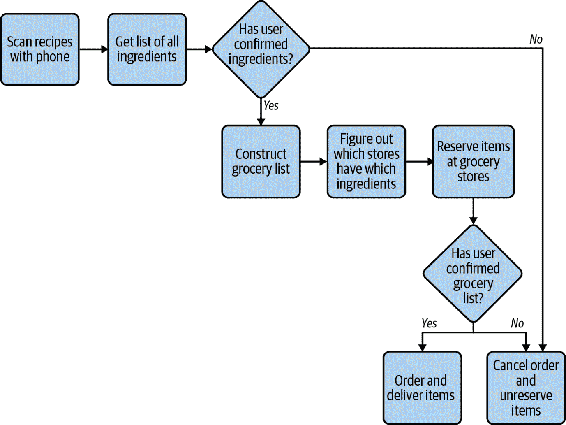

# 第十一章。定义你的接口

你已经学会如何创建自己的用户定义类型，但创建它们只是战斗的一半。现在开发者必须实际使用你的类型。为此，他们使用你类型的 API。这是开发者与之交互以使用你的代码的类型和相关函数集合，以及任何外部函数。

一旦你的类型展示给用户，它们将以你从未想到的方式被使用（和滥用）。一旦开发者依赖你的类型，改变它们的行为将变得困难。这导致了我所说的*代码接口悖论*的产生：

> 你只有一次机会来正确设计你的接口，但是你不会知道它是否正确，直到它被使用。

一旦开发者使用你创建的类型，他们就会依赖这些类型所包含的行为。如果你尝试进行不向后兼容的更改，你可能会破坏所有调用代码。更改接口的风险与依赖它的外部代码量成正比。

如果你控制所有依赖你类型的代码，这个悖论就不适用；你可以改变它。但是一旦这种类型投入生产，并且人们开始使用它，你会发现难以改变它。在一个庞大的代码库中，稳健性和可维护性很重要，协调变更和需要广泛支持的成本很高。如果你的类型被组织外的实体使用，比如开源库或平台 SDK，这几乎是不可能的。这很快导致难以处理的代码，而难以处理的代码会减慢开发者的速度。

更糟糕的是，你不会真正知道一个接口是否自然易用，直到足够多的人依赖它，这就产生了这个悖论。如果你不知道接口将如何被使用，你又如何设计它呢？当然，你知道*你*会如何使用接口，这是一个很好的起点，但在创建接口时你有一种内在的偏见。对你来说自然的东西并不一定对其他人来说也自然。你的目标是让用户以最小的努力做正确的事情（并避免错误的事情）。理想情况下，用户使用你的接口不需要额外的操作。

我没有一个对你来说完美无缺的方法；没有一种绝对可靠的方法来一次满足所有人的接口需求。相反，我会讨论一些原则，你可以应用它们来增加成功的机会。对于需要对现有 API 进行更改的情况，你将学习到减轻策略。你的 API 是其他开发者的第一印象；要珍惜它。

# 讨论话题

你的代码库中有哪些难以使用的接口？寻找使用你的类型时人们经常犯的常见错误。还要找出很少被调用的接口，特别是如果你觉得它们有用的话。为什么用户不调用这些有用的函数？讨论当开发者遇到这些难以使用的接口时会出现什么成本。

# 自然的接口设计

你的目标，尽管看起来很困难，是使你的接口看起来自然易用。换句话说，你希望减少调用者代码的摩擦力。当代码难以使用时，会发生以下情况：

重复的功能

一些开发者发现你的类型难以使用，会编写他们自己的类型，重复功能。在大规模竞争（比如竞争的开源项目）中，不同的想法相互竞争可能是健康的，但在你的代码库中存在这种分歧并不健康。开发者面对大量类型，不确定应该使用哪一个。他们的注意力分散，思维混乱，会犯错，导致错误，这样会造成成本。另外，如果你想要向其中一个类型添加任何内容，你需要在所有功能分歧的地方添加，否则会产生错误，这样也会造成成本。

破碎的心智模型

开发者会建立起他们所使用的代码的心智模型。如果某些类型难以推理，那么心智模型就会破碎。开发者会误用你的类型，导致微妙的错误。也许他们没有按照你要求的顺序调用方法。也许他们忽略了应该调用的方法。也许他们只是误解了代码在做什么，并向其传递了错误的信息。任何这些都会给你的代码库引入脆弱性。

减少测试

难以使用的代码很难测试。无论是复杂的接口，还是庞大的依赖链，或是复杂的交互；如果无法轻松测试代码，就会少写测试。写的测试越少，当事情变化时捕获的错误就越少。每次做一个看似无关的改变时，测试以微妙的方式断开都是非常令人沮丧的。

使用困难的代码会使你的代码库变得不健康。在设计接口时，你必须格外小心。试着遵循 Scott Meyers 的这个经验法则：

> 使接口易于正确使用，难以错误使用。（参见第一章中提到的最小惊奇法则的微妙陈述¹）

你希望开发者能够轻松使用你的类型，就好像一切都按照预期行为一样（这是最小惊奇法则的一个微妙的陈述）。此外，你还希望阻止用户错误地使用你的类型。你的工作是考虑在你的接口中应该支持和禁止的所有行为。为此，你需要深入了解你的合作者的思维。

## 以用户为中心思考

想象成用户思考是棘手的，因为你已经被赋予了知识的诅咒。这不是什么奥秘的咒语或神秘的咒文引起的，而是你在代码库中度过的时间的副产品。当你构建想法时，你变得如此熟悉它们，以至于可能会蒙蔽你如何看待新用户对你的代码的感知。处理认知偏见的第一步是承认它们的存在。从那时起，你可以在试图理解用户思维空间时考虑这些偏见。以下是一些有用的策略，你可以采用。

### 测试驱动开发

*测试驱动开发*（TDD），由肯特·贝克在 21 世纪初制定，是一种流行的测试代码框架。² TDD 围绕着一个简单的循环：

+   添加一个失败的测试。

+   只需写足够的代码来通过那个测试。

+   重构。

有关 TDD 的整本书，我就不详细介绍了。³ 然而，TDD 的目的是*了解如何使用一个类型*，这是非常棒的。

许多开发者认为测试*驱动*开发（先写测试）与测试*后*开发（后写测试）有类似的好处。无论哪种情况，你都有测试过的代码，对吧？当简化到这个程度时，TDD 似乎不值得付出这么多的努力。

然而，这是一个不幸的过度简化。混淆的根源在于把 TDD 看作是一种测试方法论，而实际上，它是一种*设计方法论*。测试很重要，但它们只是方法论的副产品。真正的价值在于测试如何帮助设计你的接口。

通过 TDD，你可以在编写实现之前看到调用代码的样子。因为你先写测试，所以你有机会停下来问自己，你与你的类型如何交互感觉是否无摩擦。如果你发现自己在做令人困惑的函数调用、构建长链依赖或者必须按固定顺序编写测试，那么这些都是应该警惕你正在构建的类型过于复杂的红旗。在这些情况下，重新评估或重构你的接口。你能在甚至写代码之前就简化它多么棒？

作为额外的好处，你的测试也可以作为文档的一种形式。其他开发者希望知道如何使用你的代码，尤其是那些没有在顶层文档中描述的部分。一套完整的单元测试提供了关于如何使用你的类型的工作文档；你希望它们给人留下良好的第一印象。正如你的代码是系统行为的唯一真实来源，你的测试是与你的代码交互的唯一真实来源。

### 基于 README 的开发

类似于 TDD，README 驱动开发（RDD），由[Tom Preston-Werner 创造](https://oreil.ly/qd16A)，是另一种旨在在编写代码之前捕捉难以使用的代码的设计方法论。RDD 的目标是将您的顶层思想和与代码的最重要交互精炼成一个单一文档，该文档位于您的项目中：README 文件。这是制定代码不同部分如何交互的好方法，并可能为用户提供更高级别的模式。

RDD 拥有以下一些好处：

+   无需像瀑布模型中那样一次性创建每个层级的文档。

+   README 通常是开发者看到的第一件事情；RDD 给了你一个机会来打造尽可能好的第一印象。

+   根据团队讨论更改文档要比更改已写好的代码容易。

+   您不需要使用 README 来解释糟糕的代码决策；相反，代码需要变形以支持理想的用例。

记住，只有在未来的开发者能够真正维护软件时，你才能成功构建可维护的软件。给予他们尽可能多的成功机会，并为他们在文档开始时创造一种体验。

### 可用性测试

最终，您正在尝试考虑用户如何思考。有一个完全致力于这项任务的学科：用户体验（UX）。UX 是另一个有无数书籍可供选择的领域，所以我将专注于一个让我在简化代码方面取得显著成效的策略：可用性测试。

可用性测试是主动询问用户对您的产品的看法的过程。听起来很简单，对吧？为了考虑用户会如何行动，只需询问他们。您可以做的最简单的事情就是与潜在用户（在这种情况下，其他开发者）交谈，但很容易忽视。

通过走廊测试非常容易开始进行可用性测试。当您设计界面时，只需抓住第一个经过走廊的人，并请他们就设计给予反馈意见。这是学习痛点的一个很好的低成本方法。不过，不要太字面理解这个建议。请随时扩展到除了走廊上看到的人之外，并请队友、同事或测试人员评估您的界面。

然而，对于将由更广泛的受众使用的界面（例如流行的开源库的界面），您可能需要更正式一些。在这些情况下，可用性测试涉及将您的潜在用户放在您正在编写的界面前。您给他们一组任务来完成，然后观察。您的角色不是教导他们或引导他们完成练习，而是看到他们在哪里遇到困难，以及在哪些地方表现出色。从他们的困难中学习；他们展示了明显难以使用的区域。

###### 提示

可用性测试对于团队中的初级成员来说是一个很好的任务。他们的知识诅咒不像高级成员那样强烈，他们更有可能用一双新的眼睛评估设计。

# 自然交互

唐纳德·诺曼（Donald Norman）将映射描述为“控件及其运动与现实世界结果之间的关系”。如果这种映射“利用物理类比和文化标准，[会导致]立即理解。”⁴ 这正是你在设计界面时所追求的。你希望那种即时理解消除混乱。

在这种情况下，“控制及其运动”是构成你界面的功能和类型。在这里，“现实世界的结果”代表代码的行为。为了使这感觉自然，操作必须符合用户的心理模型。这就是唐纳德·诺曼在谈到“物理类比和文化标准”时的意思。你必须以一种他们理解的方式与代码的读者联系，利用他们的经验和知识。将你的领域和其他常见知识映射到你的代码中是做到这一点的最佳方式。

在设计界面时，你需要考虑用户交互的整个生命周期，并问自己是否整体上与不熟悉你代码的用户的理解相匹配。模拟你的界面，使得对于熟悉该领域但不熟悉代码的人易于理解。当你这样做时，你的界面变得直观，这减少了开发人员犯错误的可能性。

## 自然界面的实际应用

对于本章，你将设计一个自动化杂货取货服务的部分界面。用户使用智能手机扫描其食谱，应用程序将自动确定所需的成分。用户确认订单后，应用程序查询本地杂货店的成分可用性并安排送货。图 11-1 提供了这个工作流程的表示。

我将专注于特定界面，以构建给定一组食谱的订单。



###### 图 11-1\. 自动化杂货送货应用的工作流程

为了表示一个食谱，我将修改来自第九章的`Recipe` `dataclass`的部分：

```py
from dataclasses import dataclass
from enum import auto, Enum

from grocery.measure import ImperialMeasure

@dataclass(frozen=True)
class Ingredient:
    name: str
    brand: str
    amount: float = 1
    units: ImperialMeasure = ImperialMeasure.CUP

@dataclass
class Recipe:
    name: str
    ingredients: list[Ingredient]
    servings: int
```

代码库还具有用于获取本地杂货店库存的功能和类型：

```py
import decimal
from dataclasses import dataclass
from typing import Iterable

from grocery.geospatial import Coordinates
from grocery.measure import ImperialMeasure

@dataclass(frozen=True)
class Store:
    coordinates: Coordinates
    name: str

@dataclass(frozen=True)
class Item:
    name: str
    brand: str
    measure: ImperialMeasure
    price_in_cents: decimal.Decimal
    amount: float

Inventory = dict[Store, List[Item]]
def get_grocery_inventory() -> Inventory:
    # reach out to APIs and populate the dictionary
    # ... snip ...

def reserve_items(store: Store, items: Iterable[Item]) -> bool:
    # ... snip ...

def unreserve_items(store: Store, items: Iterable[Item]) -> bool:
    # ... snip ...

def order_items(store: Store, item: items: Iterable[Item]) -> bool:
    # ... snip ...
```

代码库中的其他开发人员已经设置好代码，从智能手机扫描中找出食谱，但现在他们需要生成从每个杂货店订购的配料清单。这就是你的任务。以下是他们目前的情况：

```py
recipes: List[Recipe] = get_recipes_from_scans()

# We need to do something here to get the order
order = ????
# the user can make changes if needed
display_order(order) # TODO once we know what an order is
wait_for_user_order_confirmation()
if order.is_confirmed():
    grocery_inventory = get_grocery_inventory()
    # HELP, what do we do with ingredients now that we have grocery inventory
    grocery_list =  ????
    # HELP we need to do some reservation of ingredients so others
    # don't take them
    wait_for_user_grocery_confirmation(grocery_list)
    # HELP - actually order the ingredients ????
    deliver_ingredients(grocery_list)
```

你的目标是填写标记为`HELP`或`????`的空白。我希望你在开始编码之前刻意设计你的接口。你会如何向非技术产品经理或市场代理人描述代码的目的？在查看以下代码之前花几分钟：你希望用户如何与你的接口交互？

这是我想出的解决方案（解决这个问题的方法有很多；如果你有完全不同的东西，也没关系）：

1.  对于收到的每个食谱，获取所有原料并将它们聚合在一起。这就成为一个`Order`。

1.  一个`Order`是一组原料，用户可以根据需要添加/删除原料。但是，一旦确认，`Order`就不应该再被修改。

1.  一旦订单确认，获取所有原料并找出哪些商店有这些物品可用。这是一个`Grocery List`。

1.  `Grocery List`包含一系列商店和要从每个商店提取的物品。每个项目都在商店预订，直到应用程序下订单。物品可能来自不同的商店；应用程序会尝试找到与之匹配的最便宜的物品。

1.  一旦用户确认`GroceryList`，就下订单。杂货商品将被取消预订并设置为送货。

1.  订单送到用户家里。

###### 注意

你是否觉得很神奇，你可以在不必知道`get_recipe_from_scans`或`get_grocery_inventory`的具体实现方式的情况下想出一个实现？这就是使用类型描述领域概念的美妙之处：如果这些是由元组或字典表示的（或者没有类型注释，这让我感到恐惧），你将不得不在代码库中查找数据，找出你正在处理的数据是什么。

描述接口的内容中没有代码概念；所有内容都以熟悉的方式描述给杂货行业的工作人员。设计接口时，你希望尽可能自然地映射到领域中。

让我们从订单处理开始创建一个类：

```py
from typing import Iterable, Optional
from copy import deepcopy
class Order:
    ''' An Order class that represents a list of ingredients '''
    def __init__(self, recipes: Iterable[Recipe]):
        self.__ingredients: set[Ingredient] = set()
        for recipe in recipes:
            for ingredient in recipe.ingredients:
                self.add_ingredient(ingredient)

    def get_ingredients(self) -> list[Ingredient]:
        ''' Return a alphabetically sorted list of ingredients '''
        # return a copy so that users won't inadvertently mess with
        # our internal data
        return sorted(deepcopy(self.__ingredients),
                        key=lambda ing: ing.name)

       def _get_matching_ingredient(self,
                                 ingredient: Ingredient) -> Optional[Ingredient]:
        try:
            return next(ing for ing in self.__ingredients if
                        ((ing.name, ing.brand) ==
                         (ingredient.name, ingredient.brand)))
        except StopIteration:
            return None

    def add_ingredient(self, ingredient: Ingredient):
        ''' adds the ingredient if it's not already added,
 or increases the amount if it has
 '''
        target_ingredient = self._get_matching_ingredient(ingredient)
        if target_ingredient is None:
            # ingredient for the first time - add it
            self.__ingredients.add(ingredient)
        else:
            # add ingredient to existing set
            ????
```

开始并不算太糟。如果我看一下上面描述的第一步，它与代码非常相似。我正在从每个食谱中获取原料，并将它们汇总到一起成为一个集合。我对如何表示向我已经跟踪的集合添加原料感到有些困扰，但我保证一会儿会回来解决这个问题。

目前，我想确保我正确地表示了`Order`的不变量。如果订单已确认，则用户不应该能够修改其中任何内容。我将更改`Order`类以执行以下操作：

```py
# create a new exception type so that users can explicitly catch this error
class OrderAlreadyFinalizedError(RuntimeError):
    # inheriting from RuntimeError to allow users to provide a message
    # when raising this exception
    pass

class Order:
    ''' An Order class that represents a list of ingredients
 Once confirmed, it cannot be modified
 '''
    def __init__(self, recipes: Iterable[Recipe]):
        self.__confirmed = False
        # ... snip ...

    # ... snip ...

    def add_ingredient(self, ingredient: Ingredient):
        self.__disallow_modification_if_confirmed()
        # ... snip ...

    def __disallow_modification_if_confirmed():
        if self.__confirmed:
            raise OrderAlreadyFinalizedError('Order is confirmed -'
                                             ' changing it is not allowed')

    def confirm(self):
        self.__confirmed = True

    def unconfirm(self):
        self.__confirmed = False

    def is_confirmed(self):
        return self.__confirmed
```

现在我已经用代码表示了列表中的前两个项目，并且代码与描述非常相似。通过使用类型来表示`Order`，我已经为调用代码创建了一个接口。你可以用`order = Order(recipes)`构造一个订单，然后使用该订单添加原料，更改现有原料的数量，并处理确认逻辑。

唯一遗漏的是当添加一个我已经跟踪的成分时（例如额外添加 3 杯面粉），我需要`????`。我的第一反应是将数量加在一起，但如果计量单位不同就行不通，比如将 1 杯橄榄油加到 1 汤匙中。既不是 2 汤匙也不是 2 杯是正确答案。

我可以在代码中进行类型转换，但这并不自然。我真正想做的是像这样做一些事情：`already_tracked_ingredient += new_ingredient`。但这样做会导致异常：

```py
TypeError: unsupported operand type(s) for +=: 'Ingredient' and 'Ingredient'
```

不过，这是可以实现的；我只需使用一点 Python 魔术就可以搞定。

## 魔术方法

*魔术方法*允许您在 Python 中调用内置操作时定义自定义行为。魔术方法由两个下划线前缀和后缀。因此，它们有时被称为*dunder*方法（或*双下划线*方法）。您已经在早期章节中看到了它们：

+   在第十章中，我使用`__init__`方法来构建一个类。每次构造类时都会调用`__init__`。

+   在第九章中，我使用了`__lt__`、`__gt__`等方法来定义当两个对象用<或>进行比较时的行为。

+   在第五章中，我介绍了`__getitem__`，用于拦截用括号进行索引的调用，例如`recipes['Stromboli']`。

我可以使用魔术方法`__add__`来控制加法的行为：

```py
@dataclass(frozen=True)
class Ingredient:
    name: str
    brand: str
    amount: float = 1
    units: ImperialMeasure = ImperialMeasure.CUP

    def __add__(self, rhs: Ingredient):
        # make sure we are adding the same ingredient
        assert (self.name, self.brand) == (rhs.name, rhs.brand)
        # build up conversion chart (lhs, rhs): multiplication factor
        conversion: dict[tuple[ImperialMeasure, ImperialMeasure], float] = {
            (ImperialMeasure.CUP, ImperialMeasure.CUP): 1,
            (ImperialMeasure.CUP, ImperialMeasure.TABLESPOON): 16,
            (ImperialMeasure.CUP, ImperialMeasure.TEASPOON): 48,
            (ImperialMeasure.TABLESPOON, ImperialMeasure.CUP): 1/16,
            (ImperialMeasure.TABLESPOON, ImperialMeasure.TABLESPOON): 1,
            (ImperialMeasure.TABLESPOON, ImperialMeasure.TEASPOON): 3,
            (ImperialMeasure.TEASPOON, ImperialMeasure.CUP): 1/48,
            (ImperialMeasure.TEASPOON, ImperialMeasure.TABLESPOON): 1/3,
            (ImperialMeasure.TEASPOON, ImperialMeasure.TEASPOON): 1
        }

        return Ingredient(rhs.name,
                          rhs.brand,
                          rhs.amount + self.amount * conversion[(rhs.units,
                                                                 self.units)],
                          rhs.units)
```

现在有了定义的`__add__`方法，我可以使用`+`运算符将成分相加。`add_ingredient`方法可以如下所示：

```py
def add_ingredient(self, ingredient: Ingredient):
    '''Adds the ingredient if it's not already added,
 or increases the amount if it has '''

    target_ingredient = self._get_matching_ingredient(ingredient)
    if target_ingredient is None:
        # ingredient for the first time - add it
        self.__ingredients.add(ingredient)
    else:
        # add ingredient to existing set
        target_ingredient += ingredient
```

现在我可以自然地表达添加成分的想法了。这还不止于此。我还可以定义减法，或乘法/除法（用于扩展服务数量），或比较。当这些自然操作可用时，用户更容易理解您的代码库。Python 中几乎每个操作都有一个支持它的魔术方法。有很多方法，我甚至无法一一列举。不过，一些常见方法列在表 11-1 中。

表 11-1\. Python 中常见的魔术方法

| 魔术方法 | 用途 |
| --- | --- |
| `__add__`, `__sub__`, `__mul__`, `__div__` | 算术操作（加法、减法、乘法、除法） |
| `__bool__` | 隐式转换为布尔值用于`if <expression>`检查 |
| `__and__`, `__or__` | 逻辑操作（`and`和`or`） |
| `__getattr__`, `__setattr__`, `__delattr__` | 属性访问（如`obj.name`或`del obj.name`） |
| `__le__`, `__lt__`, `__eq__`, `__ne__`, `__gt__`, `__ge__` | 比较（`<=`、`<`、`==`、`!=`、`>`、`>=`） |
| `__str__`, `__repr__` | 转换为字符串（str()）或可复制（repr()）形式 |

如果你想了解更多，请查阅有关[数据模型](https://oreil.ly/jHBaZ)的 Python 文档。

# 讨论主题

你的代码库中有哪些类型可以从更自然的映射中受益？讨论魔术方法何时有意义，何时没有。

## 上下文管理器

您的代码现在可以处理订单，但是现在是填写杂货清单处理的另一半的时候了。我希望你停下来阅读，考虑填写杂货清单处理代码中的空白。从上一节中学到的内容，并创建一个自然映射到问题描述的接口。

这里是处理杂货清单的提醒：

1.  `Grocery List`包含一系列商店和从每个商店提取的项目。每个项目在商店中保留，直到应用程序下订单。商品可能来自不同的商店；应用程序尝试找到符合条件的最便宜的商品。

1.  一旦用户确认了`GroceryList`，就下单了。杂货商品取消预订并设置为送货。

从调用代码的角度来看，这是我拥有的：

```py
order = Order(recipes)
# the user can make changes if needed
display_order(order)
wait_for_user_order_confirmation()
if order.is_confirmed():
    grocery_inventory = get_grocery_inventory()
    grocery_list =  GroceryList(order, grocery_inventory)
    grocery_list.reserve_items_from_stores()
    wait_for_user_grocery_confirmation(grocery_list)
    if grocery_list.is_confirmed():
        grocery_list.order_and_unreserve_items()
        deliver_ingredients(grocery_list)
    else:
        grocery_list.unreserve_items()
```

鉴于这个杂货清单接口，这肯定很容易使用（如果我这么说的话）。清楚代码正在做什么，如果使接口直观成为完整故事的一部分，我会很成功。但我忘了 Scott Meyers 的引用的另一半。我忘了让代码*难以使用不正确*。

再看看。如果用户不确认他们的订单会发生什么？如果在等待时抛出了某些异常怎么办？如果发生这种情况，我永远不会取消预订的商品，使其永久保留。当然，我可以希望调用代码总是尝试捕获异常，但这很容易忘记做。事实上，它可能非常容易使用不正确，你同意吗？

###### 提示

您不能只关注快乐路径，即一切按计划进行的代码执行。您的接口还必须处理可能出现问题的所有可能方式。

当您完成操作后自动调用某种功能是 Python 中的常见情况。文件打开/关闭，会话身份验证/注销，数据库命令批处理/提交；这些都是您希望始终确保调用第二个操作的例子，无论以前的代码做了什么。如果不这样做，您经常会泄漏资源或以其他方式占用系统。

很可能，您实际上已经了解如何处理此问题：使用`with`块。

```py
with open(filename, "r") as handle:
    print(handle.read())
# at this point, the with block has ended, closing the file handle
```

这是你在 Python 旅程的早期学习中作为最佳实践学到的东西。一旦`with`块完成（当代码返回到`with`语句的原始缩进级别时），Python 关闭打开的文件。这是确保操作发生的便捷方式，即使没有明确的用户交互。这是使您的杂货清单接口难以不正确使用的关键—无论代码走哪条路径，都可以使杂货清单自动取消预订商品的方式。

要做到这一点，您需要使用*上下文管理器*，这是 Python 的一种构造，允许您利用`with`块。使用上下文管理器，我可以使我们的杂货清单代码更加容错：

```py
from contextlib import contextmanager

@contextmanager
def create_grocery_list(order: Order, inventory: Inventory):
    grocery_list = _GroceryList(order, inventory)
    try:
        yield grocery_list
    finally:
        if grocery_list.has_reserved_items():
            grocery_list.unreserve_items()
```

任何用`@contextmanager`装饰的函数都可以与`with`块一起使用。我构造了一个`_GroceryList`（注意它是私有的，因此没有人应该以`create_grocery_list`之外的方式创建杂货清单），然后*yield*它。yield 一个值会中断这个函数，将 yield 的值返回给调用代码。然后用户可以这样使用它：

```py
# ... snip ...
if order.is_confirmed():
    grocery_inventory = get_grocery_inventory()
    with create_grocery_list(order, grocery_inventory) as grocery_list:
        grocery_list.reserve_items_from_stores()
        wait_for_user_grocery_confirmation(grocery_list)
        grocery_list.order_and_unreserve_items()
        deliver_ingredients(grocery_list)
```

在上面的示例中，yielded 的值变成了`grocery_list`。当`with`块退出时，执行会返回到上下文管理器，就在 yield 语句之后。无论是否抛出异常，或者`with`块是否正常结束；因为我将我们的 yield 包装在了一个`try...finally`块中，杂货清单总是会清除任何保留的项目。

这是如何有效地强制用户在自己之后进行清理的方法。通过使用上下文管理器，您消除了可能发生的整个错误类别——遗漏错误。遗漏错误非常容易发生；您只需什么都不做。相反，上下文管理器让用户在什么都不做时也能做正确的事情。当用户即使在不知情的情况下也能做正确的事情时，这表明代码库是稳健的。

###### 警告

如果程序被强制关闭，例如操作系统的强制终止或断电，上下文管理器将无法完成。上下文管理器只是一个工具，用来防止开发人员忘记在自己之后进行清理；确保您的系统仍然可以处理开发人员无法控制的情况。

# 总结思考

您可以创建世界上所有类型，但如果其他开发人员在没有错误的情况下无法使用它们，您的代码库将受到影响。就像房子需要坚实的基础才能站立一样，您创建的类型和围绕它们的词汇需要为您的代码库提供坚实的支持。当您的代码有自然的接口时，未来的开发人员将能够轻松地获取这些类型并构建新功能。为那些未来的开发人员怀有同情心，并精心设计您的类型。

您需要仔细考虑您的类型代表的领域概念，以及用户如何与这些类型交互。通过建立自然映射，将真实世界的操作与您的代码库联系起来。您构建的接口应该感觉直观；记住，它们应该易于正确使用并难以错误使用。利用您掌握的所有技巧和窍门，从正确的命名到魔术方法到上下文管理器。

在下一章中，我将讲解当你创建子类型时，类型之间如何关联。子类型是专门化类型接口的一种方式；它们允许在不修改原始类型的情况下进行扩展。对现有代码的任何修改都可能引起回归，因此能够创建新类型而无需更改旧类型，可以显著减少异常行为。

¹ 凯夫林·亨尼（Kevlin Henney）和斯科特·迈耶斯（Scott Meyers）。《*97 件每个程序员都应该知道的事：专家集体智慧*》。Sebastopol: O’Reilly Media, 2010。

² Kent Beck。《*测试驱动开发：实战与模式*》。Upper Saddle River, NJ: Addison-Wesley Professional, 2002。

³ 如果你想要更多信息，我推荐哈里·珀西瓦尔（Harry Percival）的《*Python 测试驱动开发*》（O’Reilly, 2017）。

⁴ 这段来自唐纳德·诺曼（Donald Norman）的《*设计心理学*》（Basic Books）。这本经典著作对于想要进入用户体验（UX）思维的人至关重要。
