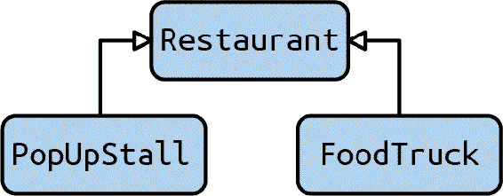

# 第十二章：子类型

Part II 的大部分内容集中在创建自己的类型和定义接口上。这些类型不是孤立存在的；类型通常彼此相关联。到目前为止，您已经看到了 *组合*，其中类型使用其他类型作为成员。在本章中，您将了解 *子类型*，即基于其他类型创建类型。

当正确应用时，子类型使得扩展代码库变得非常容易。您可以引入新的行为，而无需担心破坏代码库的其他部分。但是，在创建子类型关系时必须非常小心；如果处理不当，可能会以意想不到的方式降低代码库的健壮性。

我将从最常见的子类型关系之一开始：继承。继承被视为面向对象编程（OOP）的传统支柱之一。¹ 如果不正确应用，继承可能会很棘手。然后，我将进一步介绍 Python 编程语言中存在的其他形式的子类型。您还将了解到基本的 SOLID 设计原则之一，即里斯科夫替换原则。本章将帮助您理解何时以及何地适合使用子类型，以及何时不适合。

# 继承

当大多数开发者谈论子类型时，他们立即想到继承。*继承* 是一种从另一个类型创建新类型的方式，将所有行为复制到新类型中。这种新类型称为*子类*、*派生类*或*衍生类*。相反，被继承的类型称为*父类*、*基类*或*超类*。在这种类型的讨论中，我们说这种关系是一种 *is-a* 关系。派生类的任何对象也是基类的实例。

为了说明这一点，你将设计一个帮助餐厅业主组织运营的应用程序（跟踪财务、定制菜单等）。对于这种情况，餐厅具有以下行为：

+   一个餐厅具有以下属性：名称、位置、员工及其排班表、库存、菜单和当前财务状况。所有这些属性都是可变的；甚至餐厅的名称或位置也可以更改。当餐厅更改位置时，其位置属性将反映其最终目的地。

+   一个所有者可以拥有多个餐厅。

+   员工可以从一个餐厅调动到另一个餐厅，但不能同时在两个餐厅工作。

+   当点菜时，使用的成分将从库存中移除。当库存中的特定项目用尽时，需要该成分的任何菜品将不再通过菜单提供。

+   每当销售一个菜单项目时，餐厅的资金增加。每当购买新的库存时，餐厅的资金减少。每个员工在餐厅工作的每个小时，餐厅的资金都会根据员工的工资和/或时薪减少。

餐馆业主将使用此应用程序查看他们所有的餐馆，管理库存，并实时跟踪利润。

由于餐馆有特定的不变量，我将使用一个类来代表一个餐馆：

```py
from restaurant import geo
from restaurant import operations as ops
class Restaurant:
    def __init__(self,
                 name: str,
                 location: geo.Coordinates,
                 employees: list[ops.Employee],
                 inventory: list[ops.Ingredient],
                 menu: ops.Menu,
                 finances: ops.Finances):
        # ... snip ...
        # note that location refers to where the restaurant is located when
        # serving food

    def transfer_employees(self,
                           employees: list[ops.Employee],
                           restaurant: 'Restaurant'):
        # ... snip ...

    def order_dish(self, dish: ops.Dish):
        # ... snip ..

    def add_inventory(self, ingredients: list[ops.Ingredient],
                      cost_in_cents: int):
        # ... snip ...

    def register_hours_employee_worked(self,
                                       employee: Employee,
                                       minutes_worked: int):
        # ... snip ...

    def get_restaurant_data(self) -> ops.RestaurantData:
        # ... snip ...

    def change_menu(self, menu: ops.Menu):
        self.__menu = menu

    def move_location(self, new_location: geo.Coordinates):
        # ... snip ...
```

除了上述描述的“标准”餐馆外，还有几家“专业化”的餐馆：食品车和流动小吃摊。

食品车是移动的：它们到不同的地点行驶，并根据场合更改菜单。流动小吃摊是短暂的；它们出现在有限的时间内，并提供有限的菜单（通常是某种事件，如节日或集市）。尽管它们在运作方式上略有不同，但食品车和流动小吃摊仍然是餐馆。这就是我所说的“is-a”关系的含义——食品车“是一个”餐馆，流动小吃摊“是一个”餐馆。因为这是一个“is-a”关系，继承是一个适当的构造来使用。

在定义派生类时，通过指定基类来表示继承：

```py
class FoodTruck(Restaurant):
    #... snip ...

class PopUpStall(Restaurant):
    # ... snip ...
```

图 12-1 展示了这种关系通常如何绘制。



###### 图 12-1\. 餐馆的继承树

通过以这种方式定义继承，确保派生类将继承基类的所有方法和属性，而无需重新定义它们。

这意味着，如果您实例化其中一个派生类，比如 `FoodTruck`，您将能够使用与与 `Restaurant` 交互时相同的所有方法。

```py
food_truck = FoodTruck("Pat's Food Truck", location, employees,
                       inventory, menu, finances)
food_truck.order_dish(Dish('Pasta with Sausage'))
food_truck.move_location(geo.find_coordinates('Huntsville, Alabama'))
```

这个方法的优点在于，派生类可以传递给期望基类的函数，类型检查器不会抱怨一点：

```py
def display_restaurant_data(restaurant: Restaurant):
    data = restaurant.get_restaurant_data()
    # ... snip drawing code here ...

restaurants: list[Restaurant] = [food_truck]
for restaurant in restaurants:
    display_restaurant_data(restaurant)
```

默认情况下，派生类的行为与基类完全相同。如果希望派生类执行不同的操作，可以重写方法或在派生类中重新定义方法。

假设我希望我的食品车在位置更改时自动驶向下一个位置。但对于这种用例，当请求餐馆数据时，我只想要最终的位置，而不是食品车在路上的位置。开发人员可以调用一个单独的方法来显示当前位置（用于单独的食品车地图）。我将在 `FoodTruck` 的构造函数中设置 GPS 定位器，并重写 `move_location` 来启动自动驾驶：

```py
from restaurant.logging import log_error
class FoodTruck(Restaurant):
    def __init__(self,
                 name: str,
                 location: geo.Coordinates,
                 employees: list[ops.Employee],
                 inventory: list[ops.Ingredient],
                 menu: ops: Menu,
                 finances: ops.Finances):
        super().__init__(name, location, employees,inventory, menu, finances)
        self.__gps = initialize_gps()

    def move_location(self, new_location: geo.Coordinates):
        # schedule a task to drive us to our new location
        schedule_auto_driving_task(new_location)
        super().move_location(new_location)

    def get_current_location(self) -> geo.Coordinates:
        return self.__gps.get_coordinates()
```

我正在使用一个特殊的函数，`super()`，来访问基类。当我调用 `super().__init__()` 时，实际上是在调用 `Restaurant` 的构造函数。当我调用 `super().move_location` 时，我在调用 `Restaurant` 的 `move_location`，而不是 `FoodTruck` 的 `move_location`。这样，代码可以完全像基类一样运行。

请花一点时间思考通过子类扩展代码的影响。您可以向现有代码中插入新的行为，而无需修改该现有代码。如果避免修改现有代码，则大大减少引入新错误的机会；如果不更改消费者依赖的代码，您也不会无意中打破他们的假设。良好设计的继承结构可以极大提高可维护性。不幸的是，反之亦然；设计不良的继承会导致可维护性下降。在使用继承时，您始终需要考虑代码替代的简易性。

# 可替代性

正如前面所述，继承关系涉及建模*是一个*关系。描述具有*是一个*关系的事物可能听起来很简单，但实际上可能出现很多意外情况。要正确建模*是一个*关系，您需要理解可替代性。

*可替代性*表明，当您从基类派生时，您应该能够在每个使用基类的实例中使用该派生类。

如果我创建一个可以显示相关餐厅数据的函数：

```py
def display_restaurant(restaurant: Restaurant):
    # ... snip ...
```

我应该能够传递一个`Restaurant`、一个`FoodTruck`或一个`PopUpStall`，而这个函数不应该感知到任何不同。这再次听起来很简单；有什么难点吗？

的确有一个难点。为了向您展示，我想暂时摆脱食品概念，回到任何一年级学生都应该能回答的基本问题：一个正方形是矩形吗？

从您上学的早期，您可能知道答案是“是的，正方形是矩形”。矩形是一个有四条边的多边形，两条边的交点是 90 度角。正方形也是如此，但额外要求每条边的长度必须完全相同。

如果我用继承来建模这个问题，可能会这样做：

```py
class Rectangle:
    def __init__(self, height: int, width: int):
        self._height = height
        self._width = width

    def set_width(self, new_width):
        self._width = new_width

    def set_height(self, new_height):
        self._height = new_height

    def get_width(self) -> int:
        return self._width

    def get_height(self) -> int:
        return self._height

class Square(Rectangle):
    def __init__(self, length: int):
        super().__init__(length, length)

    def set_side_length(self, new_length):
        super().set_width(new_length)
        super().set_height(new_length)

    def set_width(self, new_width):
        self.set_side_length(new_width)

    def set_height(self, new_height):
        self.set_side_length(new_height)
```

所以是的，从几何学的角度来看，正方形确实是矩形。但是，将这种假设映射到*是一个*关系时是有缺陷的。花几分钟时间看看我的假设在哪里崩溃。

还看不出来？这里有个提示：如果我问你正方形是否可以在所有用例中替代矩形，你能构造一个正方形无法替代矩形的用例吗？

假设应用程序的用户在餐厅地图上选择正方形和矩形以评估市场规模。用户可以在地图上绘制一个形状，然后根据需要扩展它。处理此功能之一如下：

```py
def double_width(rectangle: Rectangle):
    old_height = rectangle.get_height()
    rectangle.set_width(rectangle.get_width() * 2)
    # check that the height is unchanged
    assert rectangle.get_height() == old_height
```

使用这段代码，如果我将一个`Square`作为参数传递会发生什么？突然间，之前通过的断言将开始失败，因为当长度改变时，正方形的高度也会改变。这是灾难性的；继承的整个意图是在不破坏现有代码的情况下扩展功能。在这种情况下，通过传递一个`Square`（因为它也是一个`Rectangle`，类型检查器不会抱怨），我引入了一个等待发生的错误。

这种错误也会影响派生类。上述错误源于在`Square`中重写`set_width`，以便同时更改高度。如果没有重写`set_width`，而是调用了`Rectangle`的`set_width function`，会发生什么？如果是这样的话，并且你把一个`Square`传递给函数，断言将不会失败。相反，会发生一些不那么明显但更为有害的事情：函数成功执行。你不再收到带有堆栈跟踪导致错误的`AssertionError`。现在，你创建了一个不再是正方形的正方形；宽度已经改变，但高度没有变。你犯了一个基本错误，并且破坏了该类的不变量。

使得这种错误如此阴险的是继承的目标是为了解耦或者说移除现有代码和新代码之间的依赖关系。基类的实现者和使用者在运行时看不到不同的派生类。也许派生类的定义存在于完全不同的代码库中，由不同的组织拥有。在这种错误情况下，你会使得每次派生类发生变化时，都需要查看基类的每个调用和使用，并评估你的更改是否会破坏代码。

为了解决这个问题，你有几个可选的方法。首先，你可以根本不让`Square`从`Rectangle`继承，避免整个问题。其次，你可以限制`Rectangle`的方法，使得`Square`不会与其矛盾（比如使字段不可变）。最后，你可以完全取消类的层次结构，并在`Rectangle`中提供一个`is_square`方法。

这些错误可能会以微妙的方式破坏你的代码库。考虑这样一个使用案例：我想要给我的餐馆加盟; 加盟商可以创建自己的菜单，但必须始终具有一组共同的菜肴。

这里是一个潜在的实现方式：

```py
class RestrictedMenuRestaurant(Restaurant):

    def __init__(self,
                 name: str,
                 location: geo.Coordinates,
                 employees: list[ops.Employee],
                 inventory: list[ops.Ingredient],
                 menu: ops.Menu,
                 finances: ops.Finances,
                 restricted_items: list[ops.Ingredient]):
        super().__init__(name,location,employees,inventory,menu,finances)
        self.__restricted_items = restricted_items

    def change_menu(self, menu: ops.Menu):
        if any(not menu.contains(ingredient)
               for ingredient in self.__restricted_items):
            # new menus MUST contain restricted ingredients
            return super().change_menu(menu)
```

在这种情况下，如果新菜单中缺少任何限制项，函数会提前返回。一个看似合理的单独行为放在继承层次结构中完全会出现问题。请设身处地地换位思考，想象一下另一位开发人员，他想要实现应用程序中更改菜单的 UI。他看到了一个`Restaurant`类，并根据这个接口编写代码。当一个`RestrictedMenuRestaurant`不可避免地被用作`Restaurant`的替代品时，UI 将尝试更改菜单，但没有任何迹象表明更新实际上没有发生。唯一能更早发现这个错误的方法是开发人员搜索代码库，寻找破坏不变量的派生类。如果这本书有一个主题，那就是每当开发人员不得不搜索代码库以理解其中一部分代码时，这都是代码脆弱性的明显迹象。

如果我写的代码抛出异常而不是简单返回会怎么样呢？不幸的是，这也解决不了任何问题。现在，当用户更改`Restaurant`的菜单时，他们可能会收到一个异常。如果他们查看`Restaurant`类的代码，就看不到他们需要考虑异常的迹象。他们也不应该偏执地每次调用都包装在`try...except`块中，担心某个地方的派生类可能会抛出异常。

在这两种情况下，当一个类继承自一个基类但其行为并不完全与基类一致时，就会引入微妙的错误。这些错误需要特定的条件组合才会发生：代码必须在基类上执行方法，必须依赖于基类的特定行为，并且一个破坏该行为的派生类被用作基类的替代。棘手的是，这些条件中的任何一个都可能在原始代码编写后的很长时间内引入。这就是为什么可替换性如此重要。实际上，可替换性的重要性体现在一个非常重要的原则中：里斯科夫替换原则。

[里斯科夫替换原则（Liskov Substitution Principle）](https://wiki.example.org/liskov_substitution_principle)，以芭芭拉·里斯科夫命名，陈述如下:²

> *子类型要求*：让`Φ(X)`是对类型`T`的对象`X`可证明的一个属性。那么对于类型`S`的对象`Y`（其中`S`是`T`的一个子类型），`Φ(Y)`也应该为真。

不要让正式的符号表达吓到你。LSP（Liskov Substitution Principle）其实非常简单：为了存在一个子类型，它必须遵循与超类型相同的所有属性（行为）。这一切都归结为可替换性。每当你考虑超类型的属性及其对子类型意味着什么时，你都应该牢记 LSP。在使用继承设计时，请考虑以下几点：

不变量

第十章 主要关注不变性（关于类型的真理，不得违反）。当您从其他类型进行子类型化时，子类型必须*保持*所有不变性。当我从`Rectangle`中的`Square`进行子类型化时，我忽略了高度和宽度可以独立设置的不变性。

前置条件

前置条件是在与类型属性交互之前必须为真的任何条件（如调用函数）。如果超类型定义了发生的前置条件，则子类型*不得*更为严格。这就是当我从`Restaurant`中的`RestrictedMenuRestaurant`进行子类型化时发生的情况。我添加了一个额外的前置条件，即在更改菜单时某些成分是强制性的。通过抛出异常，我使先前的良好数据现在失败了。

后置条件

后置条件是与类型属性交互后必须为真的任何条件。如果超类型定义了后置条件，则子类型不得*削弱*这些后置条件。如果任何保证未满足，则后置条件被削弱。当我从`Restaurant`中的`RestrictedMenuRestaurant`中派生出来并且返回早期而不是更改菜单时，我违反了后置条件。基类保证了一个后置条件，即菜单将被更新，而不管菜单内容如何。当我像我做的那样派生子类时，我再也不能保证这个后置条件。

如果您在重写函数中的任何时候违反不变性、前置条件或后置条件，您将会引发错误。以下是我在评估继承关系时在派生类的重写函数中寻找的一些警告信号：

条件检查参数

确定前置条件是否更为严格的一个好方法是查看函数开始处是否有任何检查传入参数的`if`语句。如果有，那么它们很可能与基类的检查不同，通常意味着派生类正在进一步限制参数。

早期返回语句

如果子类型的函数在中间返回（在函数块的中部），这表示后续部分不会执行。检查后续部分是否有任何后置条件保证；您不希望通过早期返回而省略它们。

抛出异常

子类型应该只抛出与超类型完全匹配或派生异常类型的异常。如果有任何不同的异常，调用者将不会预期它们，更不用说写代码来捕获它们。如果在基类根本不指示可能发生异常的情况下抛出异常，则情况更糟。我见过的最严重的违反是抛出`NotImplementedError`异常（或类似异常）。

没有调用`super()`

根据可替换性的定义，子类型必须提供与超类型相同的行为。如果您的子类型在重写的函数中没有调用`super()`，那么您的子类型与代码中该行为没有定义关系。即使您将超类型的代码复制粘贴到您的子类型中，也不能保证这些代码保持同步；开发者可能对超类型的函数进行无害的更改，甚至没有意识到需要同时更改的子类型。

在建模具有继承性的类型时，您需要格外小心。任何错误都可能引入微妙的错误，可能会产生灾难性的影响。在设计继承时，务必格外谨慎。

# 讨论主题

您是否在代码库中遇到过任何红旗？在从其他类继承时，是否导致意外行为？讨论为何这些打破了假设，并在这些情况下可能发生的错误。

# 设计考虑

每当编写打算派生的类时，请采取预防措施。您的目标是尽可能地使其他开发者编写派生类变得容易。以下是编写基类的几条指导原则（稍后我将讨论派生类的指导原则）。

不要更改不变量

通常情况下，改变不变量本身就是一个不好的想法。无数的代码片段可能依赖于您的类型，改变不变量将打破对您代码的假设。不幸的是，如果基类更改了不变量，派生类也可能会受到影响。如果必须更改基类，请尽量仅添加新功能，而不是修改现有功能。

当将不变量与受保护字段绑定时需要特别小心。

受保护字段本质上是供派生类交互的。如果将不变量与这些字段绑定，您基本上在限制应调用哪些操作。这会造成其他开发者可能意识不到的紧张局势。最好将不变量保留在私有数据中，并强制派生类通过公共或受保护的方法与该私有数据进行交互。

记录您的不变量

这是帮助其他开发者的最重要的事情之一。虽然有些不变量可以在代码中表示（如第十章所示），但有些不变量无法通过计算机进行数学证明，比如关于异常是否抛出的保证。在设计基类时，您必须记录这些不变量，并且要确保派生类可以轻松发现它们，比如在文档字符串中。

最终，派生类有责任遵守基类的不变量。如果您正在编写一个派生类，请遵循以下准则：

熟悉基类的不变量

没有了解不变性，就不能正确地编写派生类。你的工作是了解所有基类的不变性以保持它们。查看代码、文档和与类相关的所有内容，以了解你应该做什么和不应该做什么。

扩展基类中的功能

如果需要编写与当前不变性不一致的代码，你可能需要将该功能放在基类中。举个例子，不支持可重写方法的情况。你可以在基类中创建一个布尔标志，指示基类中是否支持该功能，而不是抛出`NotImplementedError`。如果这样做，注意本章前面所有修改基类的准则。

每个重写的方法应该包含`super()`

如果在重写的方法中不调用`super()`，那么你不能保证你的子类行为与基类完全一致，特别是如果将来基类发生任何变化。如果你要重写一个方法，请确保调用`super()`。唯一可以不这样做的时候是基类方法是空的（比如一个抽象基类），并且你确信它会在代码库的余生中保持空白。

## 组合

了解何时不使用继承也很重要。我见过的最大错误之一是仅仅为了代码复用而使用继承。不要误会，继承是重用代码的好方法，但继承的主要目的是建模一个子类型可以替代超类型的关系。如果你在代码中从不与子类型交互，那么你并没有建模一个 *is-a* 关系。

在这种情况下，你希望使用组合，也被称为 *has-a* 关系。*组合* 是将成员变量放在类型内部的情况。我主要使用组合来组合类型在一起。例如，之前提到的餐馆：

```py
class Restaurant:
    def __init__(self,
                 name: str,
                 location: geo.Coordinates,
                 employees: list[ops.Employee],
                 inventory: list[ops.Ingredient],
                 menu: ops: Menu,
                 finances: ops.Finances):
        self.name = name
        self.location = location
        self.employees = employees
        # ... etc etc snip snip ...
```

# 讨论主题

在你的代码库中，你是否过度使用了继承？你是否仅仅因为重用而使用它？讨论如何转换为使用组合而不是继承。

构造函数中设置的每个成员字段都是组合的一个示例。一个`Restaurant`可以替代一个`Menu`（*is-a* 关系）是没有意义的，但一个餐馆包含一个菜单（*has-a* 关系）是有意义的，以及其他一些东西。每当你需要重用代码但不会替代类型时，你应该更倾向于使用组合而不是继承。

作为一种重用机制，组合优于继承，因为它是一种更弱的 *耦合* 形式，耦合是实体之间的依赖关系的另一个术语。其他一切相等时，你希望有更弱的耦合形式，因为这样更容易重新组织类和重构功能。如果类之间的耦合度高，其中一个的变化会直接影响另一个的行为。

###### 注意

Mixins 是一个例外，不推荐组合优于继承，因为它们是专门设计为被继承以提供对类型接口的补充。

在继承中，派生类受制于基类的更改。开发人员必须注意不仅公共接口的变化，还有不变量和受保护成员的变化。相比之下，当另一个类拥有你的类的实例时，该类仅受到一部分变化的影响：那些影响其依赖的公共方法和不变量的变化。通过限制变化的影响，你减少了破坏性假设的机会，降低了代码的脆弱性。要编写健壮的代码，请谨慎使用继承。

# 总结思考

子类型化关系在编程中是一个非常强大的概念。你可以利用它们扩展现有功能而不修改它。然而，继承往往被滥用或者使用不当。只有当子类型能够直接替代其超类型时才应使用子类型。如果情况不是这样，请考虑使用组合。

引入超类型或子类型时需要特别小心。开发人员可能不容易知道与单个超类型相关联的所有子类型；有些子类型甚至可能存在于其他代码库中。超类型和子类型非常紧密地耦合在一起，因此在进行任何更改时都要谨慎。通过适当的勤勉性，你可以在不引入一大堆问题的情况下享受子类型化带来的所有好处。

在下一章中，我将专注于子类型化的一个特定应用，即协议。这些协议是类型检查器和鸭子类型之间的缺失连接。协议以重要的方式弥合了这一差距：它们帮助你的类型检查器捕捉到在超类型/子类型关系中引入的一些错误。任何时候你通过类型检查器捕获更多的错误，尤其是这些错误，都有助于代码库的稳健性。

¹ 面向对象编程是一种编程范式，它围绕封装的数据及其行为组织代码。如果你想了解面向对象编程，我建议阅读 [*Head First Object-Oriented Analysis and Design*](https://oreil.ly/6djy9)，作者是布雷特·麦克劳林、加里·波利斯和戴夫·韦斯特（O'Reilly）。

² Barbara H. Liskov 和 Jeannette M. Wing。《子类型化的行为概念》。*ACM Trans. Program. Lang. Syst.* 16, 6（1994 年 11 月），1811–41\. [*https://doi.org/10.1145/197320.197383*](https://doi.org/10.1145/197320.197383)。
