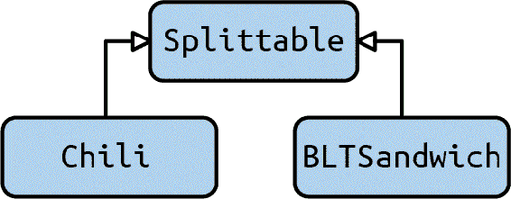
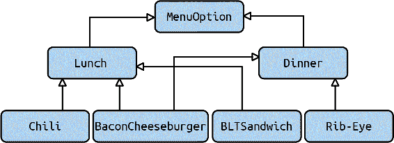
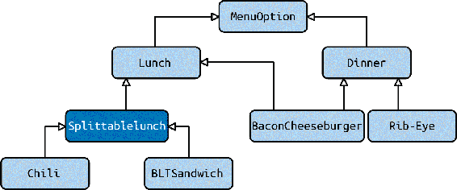

# 第十三章：协议

我有一个坦白要做。在 Python 类型系统中，我一直在绕开一个东西，乍一看，它是矛盾的。这涉及到 Python 运行时类型系统与静态类型提示之间哲学上的一个关键区别。

回到第二章，我描述了 Python 如何支持鸭子类型。记住，这意味着只要对象支持特定的一组行为，你就可以在上下文中使用它们。你不需要任何父类或预定义的继承结构来使用鸭子类型。

然而，类型检查器在没有任何帮助的情况下无法处理鸭子类型。类型检查器知道如何处理静态分析时已知的类型，但它如何处理运行时做出的鸭子类型决策呢？

为了解决这个问题，我打算介绍协议，这是 Python 3.8 中引入的一个特性。协议解决了上述列出的矛盾；它们在类型检查期间为鸭子类型的变量做注释。我将讨论为什么你需要协议，如何定义你自己的协议以及如何在高级场景中使用它们。但在开始之前，你需要理解 Python 的鸭子类型和静态类型检查器之间的差异。

# 类型系统之间的张力

在本章中，你将建立一个自动化午餐店的数字菜单系统。这家餐厅有各种可以“分割”的条目，意味着你可以点半份。三明治、卷饼和汤可以分割，但饮料和汉堡等条目不能分割。为了去重，我希望有一个方法可以完成所有的分割。这里有一些条目作为例子：

```py
class BLTSandwich:
    def __init__(self):
        self.cost = 6.95
        self.name = 'BLT'
        # This class handles a fully constructed BLT sandwich
        # ...

    def split_in_half(self) -> tuple['BLTSandwich', 'BLTSandwich']:
        # Instructions for how to split a sandwich in half
        # Cut along diagonal, wrap separately, etc.
        # Return two sandwiches in return

class Chili:
    def __init__(self):
        self.cost = 4.95
        self.name = 'Chili'
        # This class handles a fully loaded chili
        # ...

    def split_in_half(self) -> tuple['Chili', 'Chili']:
        # Instructions for how to split chili in half
        # Ladle into new container, add toppings
        # Return two cups of chili in return
        # ...

class BaconCheeseburger:
    def __init__(self):
        self.cost = 11.95
        self.name = 'Bacon Cheeseburger'
        # This class handles a delicious Bacon Cheeseburger
        # ...

    # NOTE! no split_in_half method
```

现在，分割方法可能看起来像这样：

```py
import math
def split_dish(dish: ???) -> ????:
    dishes = dish.split_in_half()
    assert len(dishes) == 2
    for half_dish in dishes:
        half_dish.cost = math.ceil(half_dish.cost) / 2
        half_dish.name = "½ " + half_dish.name
    return dishes
```

参数`order`应该被定义为什么类型？记住，类型是一组行为，不一定是具体的 Python 类型。我可能没有为这组行为取名字，但我确实希望能够保持它们。在这个例子中，类型必须具有以下行为：

+   类型必须有一个名为`split_in_half`的函数。它必须返回包含两个对象的可迭代集合。

+   `split_in_half`返回的每个对象必须有一个名为`cost`的属性。这个`cost`必须能够被取天花板函数并且能够整除以 2。这个`cost`必须是可变的。

+   `split_in_half`返回的每个对象必须有一个名为`name`的属性。这个`name`必须允许在其前面加上文本"½ "。这个`name`必须是可变的。

一个`Chili`或者`BLTSandwich`对象将完全作为子类型工作，但`BaconCheeseburger`则不会。`BaconCheeseburger`没有代码正在寻找的结构。如果你试图传入`BaconCheeseburger`，你将收到一个`AttributeEr⁠ror`，指明`BaconCheeseburger`没有名为`split_in_half()`的方法。换句话说，`BaconCheeseburger`的结构与预期类型不匹配。实际上，这就是鸭子类型赢得其另一个名称的地方：*结构子类型*，或者基于结构的子类型。

相比之下，在本书的这一部分中你一直在探索的大部分类型提示被称为*名义子类型*。这意味着具有不同名称的类型是彼此分离的。你看到问题了吗？这两种子类型相互对立。一种是基于类型名称，另一种是基于结构。为了在类型检查期间捕捉错误，你需要想出一个命名类型：

```py
def split_dish(dish: ???) -> ???:
```

所以，再问一次，参数应该被标记为什么类型？我列出了一些选项如下。

## 留空类型或使用任何类型

```py
def split_dish(dish: Any)
```

我无法认可这一点，尤其是在一本关于健壮性的书中。这不向未来的开发者传达任何意图，而且类型检查器无法检测常见的错误。继续。

## 使用联合类型

```py
def split_dish(dish: Union[BLTSandwich, Chili])
```

啊，这比留空好一些。一个订单可以是`BLTSandwich`或`Chili`。对于这个有限的示例，它确实有效。但是，你可能会觉得这有点不对劲。我需要找出如何调和结构子类型和名义子类型，而我所做的只是在类型签名中硬编码了几个类。

更糟糕的是，这种方法很脆弱。每当有人需要添加一个可分割的类时，他们必须记得更新这个函数。你只能希望这个函数在类定义附近，以便未来的维护者可能会碰巧发现它。

这里还有另一个潜在的危险。如果这个自动午餐制造机是一个库，用于由不同供应商的自动售货亭使用？它们可能会引入这个午餐制造库，制作他们自己的类，并在这些类上调用`split_dish`。在库代码中定义了`split_dish`，消费者几乎没有合理的方法可以让他们的代码通过类型检查。

## 使用继承

有些有经验的面向对象语言（如 C++或 Java）的用户可能会喊道，这里适合使用接口类。让这两个类都继承自某个基类，该基类定义了你想要的方法将是很简单的。

```py
class Splittable:
    def __init__(self, cost, name):
        self.cost = cost
        self.name = name

    def split_in_half(self) -> tuple['Splittable', 'Splittable']:
        raise NotImplementedError("Must implement split in half")

class BLTSandwich(Splittable):
    # ...

class Chili(Splittable):
    # ...
```

这种类型层次结构在图 13-1 中有所体现。



###### 图 13-1\. 可分割类型的类型层次结构

而且这确实有效：

```py
def split_dish(dish: Splittable):
```

实际上，你甚至可以注释返回类型：

```py
def split_dish(dish: Splittable) ->
    tuple[Splittable, Splittable]:
```

但如果存在更复杂的类层次结构呢？如果您的类层次结构看起来像图 13-2 那样复杂？



###### 图 13-2\. 一个更复杂的类型层次结构

现在，您面临一个棘手的决定。您应该将 `Splittable` 类放在类型层次结构的哪里？您不能把它放在树的父级；并非每种餐品都应该可以分割。您可以将 `Splittable` 类制作成一个 `SplittableLunch` 类，并将其插入到 `Lunch` 和任何可分割的类之间，如图 13-3 所示。



###### 图 13-3\. 一个更复杂的类型层次结构，其中插入了 `Splittable`

随着代码库的增长，这种方法将会失效。首先，如果您希望在其他地方使用 `Splittable`（比如晚餐、账单或其他任何东西），您将不得不复制该代码；没有人想要一个从 `SplittableLunch` 继承的账单系统。此外，`Splittable` 可能不是您想要引入的唯一父类。您可能还有其他属性，比如能够共享主菜、提供外带服务、指定允许替代等等。随着每个选项的引入，您需要编写的类的数量将急剧增加。

## 使用 Mixins

现在，有些语言通过 mixins 来解决这个问题，我在第十一章中介绍过。Mixins 将负担转移到类层次结构底部的每个类，而不会污染上面的任何类。如果我希望我的 `BLTSandwich` 可以 `Shareable`、`PickUppable`、`Substitutable` 和 `Splittable`，那么我除了修改 `BLTSandwich` 之外，无需修改任何其他内容。

```py
class BLTSandwich(Shareable,
                  PickUppable,
                  Substitutable,
                  Splittable):
    # ...
```

只有需要该功能的类才需要更改。您减少了在大型代码库中协调的需求。但这并不完美；用户仍然需要在其类中添加多重继承来解决此问题，如果能最小化类型检查所需的更改，将会更好。当您导入父类时，它还引入了物理依赖性，这可能不是理想的。

事实上，以上选项都不合适。您只是为了类型检查而修改现有类，这在我看来并不像 Python 风格。许多开发人员喜欢 Python 是因为它不需要如此啰嗦。幸运的是，*协议* 提供了更好的解决方案。

# 协议

协议提供了一种在类型检查和运行时类型系统之间缩小差距的方式。它们允许您在类型检查期间提供结构子类型化。事实上，您可能已经熟悉某种协议而不自知：迭代器协议。

迭代器协议是一组定义好的对象可能实现的行为。如果一个对象实现了这些行为，您可以对该对象进行循环遍历。考虑：

```py
from random import shuffle
from typing import Iterator, MutableSequence
class ShuffleIterator:
    def __init__(self, sequence: MutableSequence):
        self.sequence = list(sequence)
        shuffle(self.sequence)

    def __iter__(self):
        return self

    def __next__(self):
        if not self.sequence:
            raise StopIteration
        return self.sequence.pop(0)

my_list = [1, 2, 3, 4]
iterator: Iterator = ShuffleIterator(my_list)

for num in iterator:
    print(num)
```

注意我并不需要子类化 `Iterator` 就可以使类型工作。这是因为 `ShuffleIterator` 具有迭代器工作所需的两个方法：用于迭代器循环的 `__iter__` 方法，以及用于获取序列中下一个项的 `__next__` 方法。

这正是我想要在 `Splittable` 示例中实现的模式。我希望能够根据代码结构使类型工作。为此，你可以定义自己的协议。

## 定义协议

定义协议非常简单。如果你希望某物可分割，你可以根据协议定义 `Splittable`：

```py
from typing import Protocol
class Splittable(Protocol):
    cost: int
    name: str

    def split_in_half(self) -> tuple['Splittable', 'Splittable']:
        """ No implementation needed """
        ...
```

这看起来与本章早期子类化的示例非常接近，但你稍微不同地使用了它。

要使 `BLTSandwich` 可分割，你无需在类中指示任何不同之处。不需要进行子类化：

```py
class BLTSandwich:
    def __init__(self):
        self.cost = 6.95
        self.name = 'BLT'
        # This class handles a fully constructed BLT sandwich
        # ...

    def split_in_half(self) -> ('BLTSandwich', 'BLTSandwich'):
        # Instructions for how to split a sandwich in half
        # Cut along diagonal, wrap separately, etc.
        # Return two sandwiches in return
```

对于 `BLTSandwich` 没有显式的父类。如果你想要明确，仍然可以从 `Splittable` 进行子类化，但这不是必需的。

现在 `split_dish` 函数可以期望使用任何支持新 `Splittable` 协议的内容：

```py
def split_dish(order: Splittable) -> tuple[Splittable, Splittable]:
```

# 讨论话题

在你的代码库中可以在哪些地方使用协议？讨论你在哪些地方大量使用鸭子类型或编写通用代码。讨论如果不使用协议，这些代码区域如何容易被误用。

类型检查器将检测到 `BLTSandwich` 仅通过其定义的字段和方法即为 `Splittable`。这极大简化了类层次结构。即使添加更多协议，也无需复杂的树形结构。你可以简单地为每组所需行为定义不同的协议，包括 `Shareable`、`Substitutable` 或 `PickUppable`。依赖于这些行为的函数可以依赖于这些协议，而不是任何基类。只要它们实现了所需的功能，原始类就不需要以任何形式更改。

# 高级用法

我已经讨论了迄今为止协议的主要用例，但还有一些我想向你展示的内容。你可能不会经常使用这些特性，但它们填补了协议的一个重要空白。

## 复合协议

在上一节中，我谈到了一个类如何满足多个协议的情况。例如，单个午餐项目可能是 `Splittable`、`Shareable`、`Substitutable` 和 `PickUppable`。虽然你可以很容易地混合这些协议，但如果你发现超过一半的午餐条目都属于这一类别，怎么办？你可以将这些午餐条目指定为 `StandardLunchEntry`，允许你将所有四个协议视为单一类型进行引用。

第一次尝试可能只是编写一个类型别名以涵盖你的基础：

```py
StandardLunchEntry = Union[Splittable, Shareable,
                           Substitutable, PickUppable]
```

但是，这将匹配满足至少一个协议的任何内容，而不是所有四个协议。要匹配所有四个协议，你需要使用复合协议：

```py
class StandardLunchEntry(Splittable, Shareable, Substitutable,
                         PickUppable, Protocol):
    pass

# Remember, you don't need to explicitly subclass from the protocol
# I do so here for clarity's sake
class BLTSandwich(StandardLunchEntry):
    # ... snip ...
```

然后，你可以在任何应该支持所有四个协议的地方使用`StandardLunchEntry`。这允许你将协议组合在一起，而无需在整个代码库中反复复制相同的组合。

###### 注意

`StandardLunchEntry`也从`Protocol`子类化。这是必需的；如果省略，即使它从其他协议子类化，`StandardLunchEntry`也不会成为协议。更普遍地说：从协议子类化的类并不会自动成为协议。

## 运行时可检查的协议

在整个协议讨论过程中，我一直停留在静态类型检查的领域。但有时候，你确实需要在运行时检查类型。不过，现成的协议并不支持任何形式的`isinstance()`或`issubclass()`检查。不过添加起来很容易：

```py
from typing import runtime_checkable, Protocol

@runtime_checkable
class Splittable(Protocol):
    cost: int
    name: str

    def split_in_half(self) -> tuple['Splittable', 'Splittable']:
        ...

class BLTSandwich():
    # ... snip ..

assert isinstance(BLTSandwich(), Splittable)
```

只要在那里添加`runtime_checkable`装饰器，你就可以使用`isinstance()`检查对象是否满足协议。当你这样做时，`isinstance()`实质上是在每个预期变量和函数的协议上调用`__hasattr__`方法。

###### 注意

如果您的协议是一个没有任何协议变量的非数据协议，`issubclass()`才能正常工作。这涉及处理在构造函数中设置变量时的边缘情况。

当您使用协议的联合时，通常会将协议标记为`runtime_checkable`。函数可能期望一个协议或不同的协议，而这些函数可能需要一种在函数体内部在运行时区分两者的方式。

## 模块满足协议

虽然我到目前为止只谈论了满足协议的对象，但有一个更窄的用例值得一提。原来，模块也可以满足协议。毕竟，模块仍然是一个对象。

假设我想在餐厅周围定义一个协议，每个餐厅都在单独的文件中定义。以下是其中一个文件：

```py
name = "Chameleon Café"
address = "123 Fake St."

standard_lunch_entries = [BLTSandwich, TurkeyAvocadoWrap, Chili]
other_entries = [BaconCheeseburger, FrenchOnionSoup]

def render_menu() -> Menu:
    # Code to render a menu
```

然后，我需要一些代码来定义`Restaurant`协议，并能够加载餐厅：

```py
from typing import Protocol
from lunch import LunchEntry, Menu, StandardLunchEntry

class Restaurant(Protocol):
    name: str
    address: str
    standard_lunch_entries: list[StandardLunchEntry]
    other_entries: List[LunchEntry]

    def render_menu(self) -> Menu:
        """ No implementation needed """
        ...

def load_restaurant(restaurant: Restaurant):
    # code to load restaurant
    # ...
```

现在，我可以将导入的模块传递给我的`load_restaurant`函数：

```py
import restaurant
from load_restaurant import load_restaurant

# Loads our restaurant model
load_restaurant(restaurant)
```

在`main.py`中，对`load_restaurant`的调用将通过类型检查。餐厅模块满足我定义的`Restaurant`协议。协议甚至足够智能，以在传递模块时忽略`render_menu`中的`self`参数。使用协议来定义模块不是每天都会发生的 Python 事情，但如果你有 Python 配置文件或需要强制执行合同的插件架构，你会看到它出现。

###### 警告

并非每种类型检查器都可能支持将模块用作协议；请仔细检查您喜欢的类型检查器的错误和文档是否支持。

# 总结思路

协议在 Python 3.8 中刚刚引入，因此它们仍然相对较新。但是，它们填补了 Python 静态类型检查中的一个巨大空白。请记住，虽然运行时是结构子类型化的，但大部分静态类型检查是名义子类型化的。协议填补了这一空白，并允许您在类型检查期间进行结构子类型化。当您编写库代码并希望提供稳定的 API 给用户使用而不依赖于特定类型时，您最常会使用它们。使用协议减少了代码的物理依赖，有助于提高可维护性，但仍然可以及早捕捉错误。

在下一章中，您将学习另一种增强类型的方法：建模类型。建模类型允许您创建一组丰富的约束条件，在类型检查和运行时进行检查，并可以消除一整类错误，而无需为每个字段手动编写验证。更好的是，通过对类型进行建模，您为代码库中允许和不允许的内容提供了内置文档。在接下来的章节中，您将看到如何使用流行的库 pydantic 实现所有这些功能。
