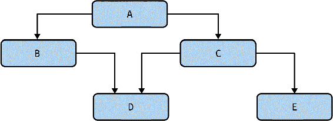
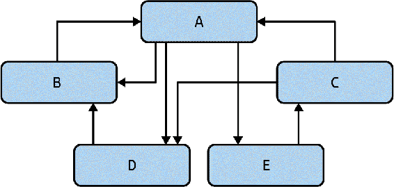
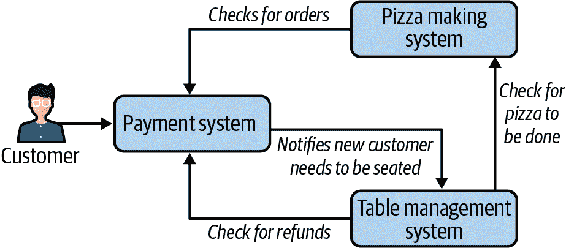
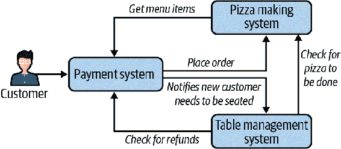
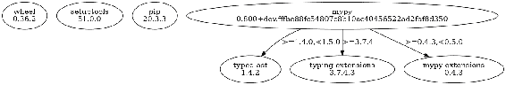
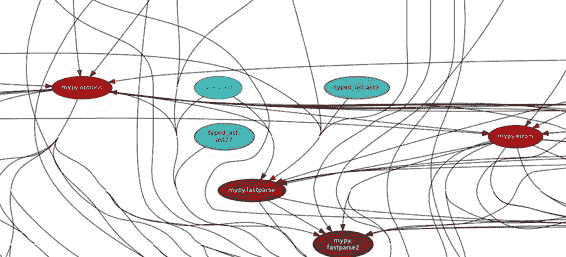
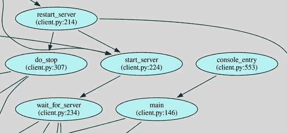
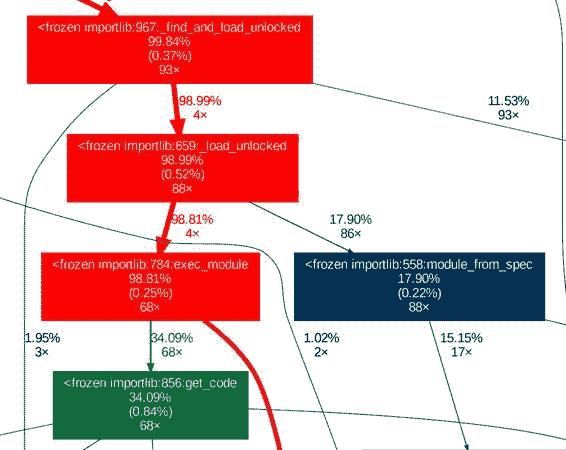
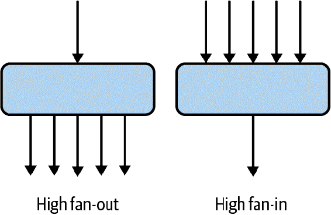

# 第十六章：依赖关系

编写没有任何依赖关系的程序是困难的。函数依赖于其他函数，模块依赖于其他模块，程序依赖于其他程序。架构是分形的；无论你看的是哪个层次，你的代码都可以表示为某种盒子和箭头图，就像 图 16-1 中所示。无论是函数、类、模块、程序还是系统，你都可以画一个类似的图来表示代码中的依赖关系。



###### 图 16-1\. 盒子和箭头图

然而，如果你不积极管理你的依赖关系，很快就会陷入所谓的“意大利面条式代码”，使你的盒子和箭头图看起来像是 图 16-2。



###### 图 16-2\. 依赖关系的混乱纠结

在本章中，你将学习有关依赖关系以及如何控制它们的全部内容。你将学习不同类型的依赖关系，所有这些都应该用不同的技术来管理。你将学习如何绘制依赖关系图，以及如何解读是否拥有一个健康的系统。你将学习如何真正简化你的代码架构，这将帮助你管理复杂性并增加代码库的健壮性。

# 关系

依赖关系本质上是关系。当一段代码需要另一段代码以某种特定的方式运行时，我们称之为 *依赖关系*。你通常使用依赖关系来以某种方式重用代码。函数调用其他函数以重用行为。模块导入其他模块以重用该模块中定义的类型和函数。在大多数代码库中，从头开始写所有东西是没有意义的。重用代码库的其他部分，甚至是来自其他组织的代码，可能极大地有利。

当你重用代码时，你节省了时间。你不需要浪费精力编写代码；你可以直接调用或导入你需要的功能。此外，你依赖的任何代码很可能已经在其他地方使用过。这意味着已经进行了某种层次的测试，这应该减少 bug 的数量。如果代码是可以读取的，那就更好了。正如 *Linus 法则*（即 Linux 创建者 Linus Torvalds 的法则）所述：¹

> “足够多的眼睛，所有的 bug 都会变得浅显易懂。”

换句话说，由于有很多人在查看代码，发现 bug 的可能性更高。这又是支持可读性导致可维护性的另一点。如果你的代码可读性好，其他开发者将更容易找到并修复其中的错误，帮助你的健壮性增强。

不过，这里有一个问题。说到依赖关系，没有免费的午餐。你创建的每一个依赖关系都会增加耦合度，或者说将两个实体绑定在一起。如果依赖关系以不兼容的方式发生变化，你的代码也需要相应变化。如果这种情况经常发生，你的健壮性将会受到影响；你将不断努力维持稳定性，因为你的依赖关系在变化。

依赖关系中还存在着一个人为因素。你依赖的每一行代码都是由活生生的人（甚至可能是一群人）维护的。这些维护者有他们自己的时间表、自己的截止日期以及他们对所开发代码的愿景。很可能这些都不会与你的时间表、截止日期和愿景相一致。代码被重复使用的次数越多，越不可能满足每个消费者的所有需求。当你的依赖与你的实现分歧时，你可以选择忍受困难，选择替代依赖（可能是你控制的一个），或者分叉它（并自行维护）。你的选择取决于具体情况，但无论哪种情况，健壮性都会受到影响。

任何在 2016 年工作的 JavaScript 开发者都能告诉你，“left-pad 事件”是如何使依赖关系出现问题的。由于政策分歧，一个开发者从包仓库中移除了一个名为 left-pad 的库，结果第二天，成千上万个项目突然崩溃，无法构建。许多大型项目（包括非常流行的 React 库）并不直接依赖于 left-pad，但通过它们自己的依赖关系间接地依赖于它。没错，依赖关系也有它们自己的依赖关系，当你依赖其他代码时，你也会得到它们。这个故事的寓意是：不要忘记人为因素及其相关工作流的成本。准备好你的任何依赖关系以最糟糕的方式发生变化，包括被移除。依赖关系是一种负担。必要的，但仍然是负担。

从安全的角度来看，依赖关系还会扩展攻击面。每一个依赖项（以及它们自己的依赖项）都有可能 compromise 你的系统。有一些专门的网站致力于跟踪安全漏洞，例如[*https://cve.mitre.org*](https://cve.mitre.org)。通过关键字搜索“Python”，你可以看到今天存在多少漏洞，而且自然地，这些网站甚至无法计算尚未知晓的漏洞。如果你的组织维护的依赖存在安全问题，除非有专注于安全的个体不断审视你的所有代码，否则未知的漏洞可能随时存在于你的代码库中。

仔细平衡你对依赖关系的使用。你的代码天然地会有依赖关系，这是一件好事。关键在于如何聪明地管理它们。粗心大意会导致代码混乱不堪。要学会如何处理依赖关系，首先需要知道如何识别不同类型的依赖关系。

# 依赖关系的类型

我将依赖关系分为三类：物理、逻辑和时间性。每种都以不同的方式影响代码的健壮性。你必须能够识别它们，并知道它们何时出现问题。正确使用依赖关系可以使你的代码保持可扩展性而不致使其变得笨重。

## 物理依赖

当大多数开发者思考依赖关系时，他们想到的是物理依赖关系。*物理依赖* 是直接在代码中观察到的关系。函数调用函数，类型由其他类型组成，模块导入模块，类继承自其他类……这些都是物理依赖的例子。它们是静态的，意味着在运行时不会改变。

物理依赖关系是最容易理解的；即使是工具也可以查看代码库并映射出物理依赖关系（你将在几页后看到这一点）。它们在第一眼看起来就很容易阅读和理解，这对于代码的健壮性是一个胜利。当未来的维护者阅读或调试代码时，依赖链的解决方式变得非常明显；他们可以跟随导入或函数调用的路径到达链的末端。

图 16-3 着眼于一个名为*PizzaMat*的完全自动化披萨咖啡馆。特许经营者可以购买整个 PizzaMat 作为一个完整的模块，并在任何地方部署以获得即时（和美味的）披萨。PizzaMat 有几个不同的系统：制作披萨系统、控制付款和订购的系统，以及处理桌面管理（座位、加料和订单送达）的系统。



###### 图 16-3\. 一个自动化披萨咖啡馆

这三个系统中的每一个都与其他系统互动（这就是箭头所代表的）。顾客与付款/订购系统互动以订购他们的披萨。一旦完成，披萨制作者检查是否有新订单并开始制作披萨，桌面管理系统开始安排顾客的座位。一旦桌面管理服务得知披萨已完成，它会为桌子准备披萨并为顾客服务。如果出于任何原因顾客对披萨不满意，桌面管理系统会退还披萨，付款系统会发出退款。

每个依赖关系都是一个关系，只有这些系统共同工作，我们才有一个正常运作的披萨店。物理依赖关系对于理解大型系统至关重要；它们允许你将问题分解为较小的实体，并定义每个实体之间的交互。我可以拆分任何一个系统为模块，或者拆分任何一个模块为函数。我想要专注于这些关系如何影响可维护性。

假设这三个系统由三个不同的实体维护。您和您的团队负责披萨制作系统。您公司的另一个团队（位于不同建筑物内）负责桌子管理系统，而独立承包商则负责支付系统。您已参与推出新的披萨制作项目——斯特龙博利，为此进行了数周的工作，仔细协调变更。每个系统都需要调整以处理新的菜单项目。在无数个深夜（当然都是披萨驱动的），您已经准备好为客户进行重大更新。然而，一旦更新推出，错误报告就开始涌现。一系列不幸的事件引入了一个 bug，导致全球的披萨店崩溃。随着越来越多的系统上线，问题变得更加严重。管理层决定您需要尽快修复它。

花点时间想想您希望今晚过得如何。您想要在努力尝试联系所有其他团队并试图在三个系统中试图快速修复的情况下度过吗？您恰好知道承包商已经关闭了今晚的通知，而另一个团队在今天下班后对他们的发布庆祝活动有点过于投入。或者，您想看看代码，并意识到只需稍微修改几行代码就可以轻松从所有三个系统中移除斯特龙博利，而无需其他团队的参与？

依赖关系是一种单向关系。您受制于您的依赖关系。如果它们在您需要时不按您的要求执行，您几乎没有什么办法。请记住，依赖的另一端是真正的活生生的人，他们并不一定会在您要求时立即行动。您如何构建依赖关系将直接影响您如何维护系统。

在我们的斯特龙博利示例中，依赖关系是一个循环；任何一个变更都有可能影响其他两个系统。您需要考虑依赖关系的每一个方向，以及变更如何在系统中传播。对于 PizzaMat 来说，披萨制作设备的支持是我们的唯一真理；没有必要为不存在的披萨产品设置计费和桌子管理。然而，在上述示例中，所有三个系统都有它们自己的菜单项目副本。根据依赖关系的方向，披萨制造商可以移除斯特龙博利代码，但斯特龙博利仍然会出现在支付系统中。如何使其更具扩展性以避免这些依赖问题？

###### 警告

大型架构变更的棘手之处在于正确答案始终取决于特定问题的背景。如果*你*要构建一个自动披萨制造机，可能会根据各种不同的因素和约束条件绘制依赖树。重要的是要关注你为何以你所画的依赖关系而不是确保它们与其他系统总是相同。

要开始，你可以构建你的系统，让所有菜单定义都在披萨制造系统中；毕竟，只有系统知道它能做什么和不能做什么。然后，定价系统可以向披萨制造者查询实际可用的项目。这样，如果需要紧急移除比萨卷，你可以在披萨制造系统中执行；定价系统不控制什么是可用和不可用的。通过倒置或反转依赖的方向，你可以将控制权还给披萨制造系统。如果我倒置这个依赖关系，依赖图看起来像图 16-4。



###### 图 16-4\. 更合理的依赖关系

现在披萨制造者决定可以点什么和不能点什么。这在限制所需更改方面可以大有裨益。如果披萨制造者需要停止支持某种原料在菜品中的使用，支付系统将自动跟随变化。这不仅在紧急情况下可以救你一命，而且在未来给你的业务更多灵活性。你已经增加了根据披萨制造者能够自动制作的内容，选择在支付系统中可选显示不同的菜品的功能，而无需与外部支付团队协调。

# 讨论主题

思考一下，如果把一个功能加入，使支付系统在披萨制造者缺少原料时不显示某些选项。考虑 16-3 图和 16-4 图中的系统。

作为一个额外的讨论主题，讨论表管理系统与支付系统之间的循环。如何打破这种循环？每种依赖方向的利弊是什么？

## 逻辑依赖

*逻辑依赖* 是指两个实体之间有关系，但在代码中没有直接的链接。这种依赖是抽象的；它包含了一层间接。这是一种只在运行时存在的依赖。在我们的披萨制造者示例中，我们有三个子系统相互作用。我们在图 16-3 中用箭头表示依赖关系。如果这些箭头是导入或函数调用，那么它们就是物理依赖。然而，可以在运行时连接这些子系统，而无需函数调用或导入。

假设子系统位于不同的计算机上，并通过 HTTP 进行通信。如果披萨制造商要使用`requests`库通过 HTTP 通知桌面管理服务何时制作披萨，它会看起来像这样：

```py
def on_pizza_made(order: int, pizza: Pizza):

    requests.post("table-management/pizza-made", {
        "id": order,
        "pizza": pizza.to_json()
    })
```

物理依赖不再是从披萨制造商到我们的桌面管理系统，而是从披萨制造商到`requests`库。对于披萨制造商来说，它只需要一个 HTTP 端点，可以将数据作为 JSON 格式的 ID 和披萨数据发布到名为“/pizza-done”的端点，来自名为“table-management”的某个 Web 服务器。

现在，在现实中，你的披萨制造商仍然需要桌面管理服务才能工作。这就是逻辑依赖的作用。尽管没有直接依赖，但披萨制造商与桌面管理系统之间仍然存在关系。这种关系不会消失，它会从物理上转变为逻辑上的。

引入逻辑依赖的关键好处在于可替换性。当没有任何物理依赖于某个组件时，替换该组件就容易得多。以通过 HTTP 请求`on_pizza_done`的例子为例。你完全可以替换桌面管理服务，只要它遵循与原始服务相同的契约。如果这听起来很熟悉，那是因为这与你在第十二章学到的完全相同。子类型化，无论是通过鸭子类型、继承还是其他方式，都引入了逻辑依赖。调用代码在物理上依赖于基类，但使用哪个子类的逻辑依赖直到运行时才确定。

提高可替换性可以提升可维护性。记住，可维护的代码易于修改。如果你可以用最小的影响替换大量功能，那么你未来的维护者在做决策时将拥有极大的灵活性。如果某个特定的函数、类或子系统不符合你的需求，你可以直接替换它。易于删除的代码本质上易于修改。

但与任何事物一样，逻辑依赖是有代价的。每个逻辑依赖都间接引用某种关系。因为没有物理链接，工具很难识别逻辑依赖。你将无法创建一个漂亮的框和箭头图表来显示逻辑依赖。此外，开发者阅读你的代码时，逻辑依赖不会立即显现。通常情况下，代码阅读者会看到与某个抽象层的物理依赖，而忽视或直到运行时才解决逻辑依赖。

引入逻辑依赖的权衡之处在于增加了可维护性，通过增加可替换性和减少耦合性，但也因为使代码难以阅读和理解而降低了可维护性。抽象层次过多会像抽象层次过少一样容易造成混乱。并没有硬性规定适当的抽象层次数量；在特定场景下，你需要根据自己的最佳判断，确定是需要灵活性还是可读性。

一些逻辑依赖会创建一些无法通过工具检测到的关系，比如依赖于集合的特定顺序或依赖于类中特定字段的存在。发现这些依赖时，往往会让开发人员感到惊讶，因为在仔细检查之前很少有迹象表明它们存在。

我曾经在一个代码库中处理过存储网络接口的问题。有两段代码依赖于这些接口：一个用于性能统计，另一个用于与其他系统建立通信路径。问题在于它们对这些接口排序有不同的假设。这个系统多年来都运行良好，直到新增了新的网络接口。由于通信路径的工作方式，新的接口需要放在列表的前面。但是性能统计只能在这些接口放在列表后面时才能工作。由于隐藏的逻辑依赖，这两部分代码紧密耦合在一起（我从未想过增加通信路径会破坏性能统计）。

事后看来，修复很简单。我创建了一个函数，将通信路径期望的顺序映射到重新排序的列表中。性能统计系统随后依赖于这个新函数。然而，这并没有修复之前的 bug（也没有挽回我为解决性能统计问题而花费的时间）。每当你对代码中不显而易见的东西创建依赖时，找到一种方法使它显而易见。留下一串面包屑，最好是通过一个单独的代码路径（比如上面的中间函数）或类型。如果做不到这一点，留下一个注释。如果网络接口列表中有一个注释表明对特定顺序的依赖，我就不会为这段代码遭遇如此大的困扰了。

## 时间依赖

最后一种依赖类型是时间依赖性。这实际上是一种逻辑依赖的一种类型，但你处理它的方式略有不同。*时间依赖性*是一种由时间联系的依赖关系。每当有具体的操作顺序时，比如“面团必须在酱和奶酪之前铺开”或“订单必须在开始制作披萨之前付款”，你就有了时间依赖性。大多数时间依赖性都很直接；它们是你业务领域的自然部分。（反正没有面团，你怎么放披萨酱和奶酪呢？）这些不是会给你带来问题的时间依赖性。相反，问题出在那些不总是那么明显的时间依赖性上。

时间依赖性在你必须按特定顺序执行某些操作的情况下最容易出问题，但你却没有指示你需要这样做。想象一下，如果你的自动披萨制造机可以配置为两种模式：单披萨（用于高质量披萨）或大批量生产（用于便宜快捷披萨）。每当披萨制造机从单披萨切换到大批量生产时，就需要进行显式重新配置。如果这种重新配置没有进行，机器的安全系统会启动，并拒绝制作披萨，直到手动操作员覆盖发生。

当这个选项首次被引入时，开发人员在确保在任何对`mass_produce`的调用之前（比如：

```py
pizza_maker.mass_produce(number_of_pizzas=50, type=PizzaType.CHEESE)
```

必须有一个检查：

```py
if not pizza_maker.is_configured(ProductionType.MASS_PRODUCE):
    pizza_maker.configure_for_mass_production()
    pizza.maker.wait_for_reconfiguration()
```

开发人员在代码审查中认真寻找这段代码，并确保始终进行适当的检查。然而，随着时间的推移，开发人员在项目中的循环进出，团队对必要检查的知识逐渐减少。想象一下，一个新的自动披萨制造机型号面市，不需要重新配置（调用`configure_for_mass_production`不会对系统进行任何更改）。只熟悉这种新型号的开发人员可能永远不会考虑在这些情况下调用`configure_for_mass_production`。

现在，假设你是未来几年中的一名开发人员。比如说，你正在为披萨制造机编写新功能，而`mass_produce`函数正好适合你所需的用例。你怎么知道你需要为大批量生产进行显式检查，特别是对于旧型号呢？单元测试对你没有帮助，因为新功能的单元测试尚不存在。难道你真的想要等到集成测试失败（或者客户投诉）才发现你错过了这个检查吗？

这里有一些减少遗漏此类检查的策略：

依赖于你的类型系统

通过将特定类型的操作限制为特定类型，你可以防止混淆。想象一下，如果`mass_produce`只能从`MassProductionPizzaMaker`对象中调用。你可以编写函数调用，以确保在重新配置之后仅创建`MassProductionPizzaMaker`。你正在使用类型系统来防止出现错误（`NewType`在第四章中描述了类似的功能）。

嵌入先决条件更深

披萨制造商在使用前必须进行配置是一个*先决条件*。考虑通过将检查移动到`mass_produce`内部来将此作为`mass_produce`函数的先决条件。思考如何处理错误条件（例如抛出异常）。你将能够防止违反时间依赖性，但在运行时引入了不同的错误。你的具体用例将决定你认为哪种错误较小：违反时间依赖性还是处理新的错误情况。

留下线索

这不一定是捕获违反时间依赖性的策略。相反，如果所有其他努力都失败，它更像是提醒开发人员有关时间依赖性的最后努力。尝试在同一个文件中组织时间依赖性（理想情况下在彼此几行之内）。留下注释和文档，以便通知未来的开发人员这种联系。带有任何运气的话，那些未来的开发人员将看到这些线索，并知道这里存在时间依赖性。

在任何线性程序中，大多数行都对其前面的行有时间依赖性。这是正常的，你不需要针对每一种情况都采取减轻措施。相反，寻找可能仅在某些情况下应用的时间依赖关系（例如旧型号上的机器重新配置），或者如果忽略将会产生灾难性后果的时间依赖关系（例如在将用户输入字符串传递给数据库之前不对其进行净化）。权衡违反时间依赖性的成本与检测和减轻它的努力。这将取决于你的用例，但是当你减轻时间依赖性时，它可以在以后节省你大量的头痛。

# 可视化你的依赖关系

查找这些依赖关系并理解在哪里寻找潜在问题点可能是具有挑战性的。有时候，你需要更直观的表示方式。幸运的是，存在工具可以帮助你在视觉上理解你的依赖关系。

###### 注意

对于以下许多示例，我将使用 GraphViz 库来显示图片。要安装它，请按照[GraphViz 网站](https://graphviz.org)上的说明操作。

## 可视化包

很可能，你的代码使用了由 pip 安装的其他包。了解你依赖的所有包、它们的依赖关系及其依赖关系，依此类推，可能会有所帮助。

为此，我将安装两个包，`pipdeptree`和 GraphViz。`pipdeptree`是一个实用工具，可以告诉你各个包是如何相互交互的，而 GraphViz 则负责实际的可视化部分。在这个示例中，我将使用 mypy 代码库。我已经下载了 mypy 源代码，创建了一个虚拟环境，并从源代码安装了 mypy。²

从这个虚拟环境中，我已经安装了`pipdeptree`和 GraphViz：

```py
pip install pipdeptree graphviz
```

现在我运行以下命令：

```py
pipdeptree --graph-output png --exclude pipdeptree,graphviz > deps.png
```

你可以在图 16-5 中看到结果。



###### 图 16-5\. 可视化包

我将忽略 wheel、setuptools 和 pip 包，专注于 mypy。在这种情况下，我看到安装的确切版本是 mypy，以及直接依赖项（在本例中为 typed_ast 1.4.2、typing-extensions 3.7.4.3 和 mypy-extensions 0.4.3）。`pipdeptree`还指定了存在的版本约束条件（例如只允许 mypy-extensions 版本大于或等于 0.4.3，但小于 0.5.0）。借助这些工具，你可以方便地获得打包依赖项的图形化表示。对于依赖项众多的项目尤为有用，特别是如果你积极维护许多包的话。

## 可视化导入

可视化包是一个相当高层次的视图，所以深入了解会更有帮助。你如何找出模块级别的导入内容？另一个名为`pydeps`的工具非常适合这个任务。

要安装它，你可以：

```py
pip install pydeps
```

安装后，你可以运行：

```py
pydeps --show-deps <source code location> -T png -o deps.png
```

我对 mypy 运行了这个命令，并得到了一个非常复杂和密集的图。在打印出来会浪费纸张，所以我决定放大特定部分在图 16-6 中。



###### 图 16-6\. 可视化导入

即使在依赖图的这个小部分中，箭头混乱不堪。然而，你可以看到代码库的许多不同区域依赖于`mypy.options`，以及`fastparse`和`errors`模块。由于这些图的规模，我建议一次深入挖掘你的代码库中的较小子系统。

## 可视化函数调用

如果你想获取比导入图更多的信息，你可以看到哪些函数彼此调用。这被称为*调用图*。首先，我将查看一个*静态*调用图生成器。这些生成器查看你的源代码并确定哪些函数调用哪些函数；不执行任何代码。在这个例子中，我将使用库 pyan3，可以通过以下命令安装：

```py
pip install pyan3
```

要运行 pyan3，你需要在命令行上执行以下操作：

```py
pyan3 <Python files> --grouped --annotated --html > deps.html
```

当我在 mypy 内部的*dmypy*文件夹上运行此操作（我选择了一个子文件夹来限制所绘制信息的数量），我收到一个交互式 HTML 页面，可以让我探索这些依赖关系。 图 16-7 显示了工具中的一个片段。



###### 图 16-7\. 静态可视化函数调用

请注意，这仅跟踪物理依赖关系，因为逻辑依赖关系直到运行时才知晓。如果您想在运行时看到调用图，请与*dynamic*调用图生成器一起执行您的代码。出于这个目的，我喜欢使用内置的 Python 分析器。*Profiler*会在程序执行期间审计您所做的所有函数调用，并记录性能数据。此外，整个函数调用历史记录也将保存在概要文件中。让我们试一试。

我首先会构建概要文件（出于尺寸考虑，我正在对 mypy 中的一个测试文件进行性能分析）：

```py
python -m cProfile -o deps.profile mypy/test/testutil.py
```

然后我将概要文件转换为 GraphViz 能理解的文件：一个 dot 文件。

```py
pip install gprof2dot
gprof2dot --format=pstats deps.profile -o deps.dot
```

最后，我将使用 GraphViz 将*.dot*文件转换为*.png*文件。

```py
dot deps.dot -Tpng > deps.png
```

再次提醒，这会产生大量的框和箭头，因此 图 16-8 只是一个小截图，说明了调用图的一部分。



###### 图 16-8\. 动态可视化函数调用

您可以了解函数被调用的次数，以及在函数中花费了多少执行时间。这不仅是找出性能瓶颈的好方法，还有助于理解您的调用图。

## 解读您的依赖图

好了，你画了这么多漂亮的图表；你可以用它们做什么？当您以这种方式看到您的依赖关系时，您会很好地了解到您的可维护性热点在哪里。请记住，每个依赖关系都是代码变更的原因。每当代码库中的任何内容发生变化时，它可能通过物理和逻辑依赖关系向上传播，可能会影响大片代码。

在这种情况下，您需要考虑您正在更改的内容与依赖它们的内容之间的关系。考虑依赖于您的代码量，以及您自己依赖的代码量。如果有很多依赖进入，但没有依赖出去，这被称为高*fan-in*。相反，如果进入的依赖不多，但您依赖的实体数量很大，这被称为高*fan-out*。 图 16-9 阐明了扇入和扇出之间的差异。



###### 图 16-9\. 扇入与扇出的差异

你希望系统中具有高入度的实体成为依赖图的叶子节点，或者说在底部。你的代码库的大部分部分依赖于这些实体；你的每一个依赖关系都会影响到你的整个代码库。你还希望这些实体保持稳定，这意味着它们变化的频率应该较低。每次引入变化，都有可能由于大量的入度而影响到你的整个代码库。

另一方面，扩散实体应该位于依赖图的顶部。这里可能是你的大部分业务逻辑所在；随着业务的发展，它们将会变化。你的代码库中的这些部分可以承受更高的变更率；由于其相对较少的上游依赖关系，当行为变化时，它们的代码不太容易经常性地出现故障。

###### 警告

改变扩散实体不会影响你代码库中的大部分假设，但我不能说它是否会破坏客户的假设。你希望外部行为保持向后兼容的程度是一个用户体验的问题，不在本书的讨论范围之内。

# 结语

依赖的存在并不决定你的代码有多健壮。关键在于你如何利用和管理这些依赖关系。依赖关系对于系统中合理的重用至关重要。你可以将代码分解为更小的块，并适当重新组织你的代码库。通过给你的依赖关系正确的方向性，你实际上可以增强代码的健壮性。通过增加可替换性和可扩展性，你可以使你的代码更易于维护。

但是，就像工程中的任何事物一样，总是有成本的。依赖关系是一种耦合；将代码库的不同部分链接在一起并进行更改可能会产生比你预期更广泛的影响。有不同类型的依赖关系，它们必须以不同的方式处理。物理依赖关系通过工具化是容易可视化的，但也在它们所施加的结构上是刚性的。逻辑依赖关系为你的代码库提供了扩展性，但它们的本质在运行时是隐藏的。时间依赖关系是以线性方式执行 Python 的必要部分，但当这些依赖关系变得不直观时，它们会带来大量未来的痛苦。

所有这些教训都假设你有可以依赖的代码片段。在下一章中，你将探索*可组合的代码*，或者将代码分解为更小的部分以便重用。你将学习如何组合对象、循环模式和函数，以将你的代码重新组织成新的用例。当你以可组合的代码来思考时，你将轻松地构建出新功能。你未来的维护者会感谢你。

¹ Eric S. Raymond. *大教堂与集市*. Sebastopol, CA: O’Reilly Media, 2001.

² 创建虚拟环境是将您的依赖项与系统的 Python 安装隔离开来的好方法。
