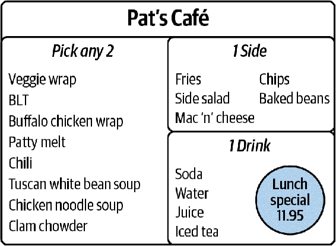
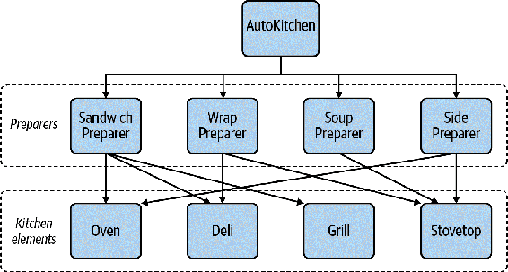
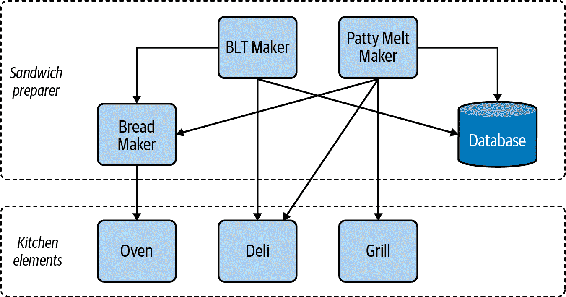
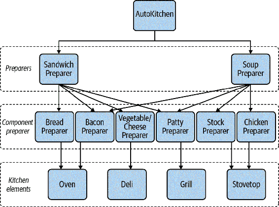

# 第十七章 可组合性

作为开发者，你面临的最大挑战之一是预测未来开发者将如何改变你的系统。业务会发展，今天的断言会成为未来的遗留系统。你如何支持这样的系统？你如何减少未来开发者在适应你的系统时所面临的阻力？你需要开发你的代码，使其能够在各种情况下运行。

在本章中，你将学习如何通过可组合性的思维方式来开发代码。当你以可组合性为重点编写代码时，你会创建小型、独立和可重复使用的代码。我会向你展示一个不具备可组合性的架构，以及它如何阻碍开发。然后你将学习如何以可组合性为考量来修复它。你将学会如何组合对象、函数和算法，使得你的代码库更具可扩展性。但首先，让我们看看可组合性如何提高可维护性。

# 可组合性

*可组合性* 侧重于构建具有最小相互依赖和少量业务逻辑嵌入的小组件。其目标是未来的开发者可以使用这些组件中的任何一个来构建他们自己的解决方案。通过使它们变小，你使它们更易于阅读和理解。通过减少依赖，你让未来的开发者不必担心拉取新代码所涉及的所有成本（例如你在第十六章中学到的成本）。通过保持组件基本免于业务逻辑，你允许你的代码解决新问题，即使这些新问题看起来与今天遇到的问题毫不相似。随着可组合组件数量的增加，开发者可以混合匹配你的代码，轻松创建全新的应用程序。专注于可组合性，使得代码更易于重用和扩展。

考虑厨房里的低调香料架。如果你要完全依靠香料混合物，比如南瓜派香料（肉桂、肉豆蔻、姜和丁香）或者五香粉（肉桂、茴香、八角、花椒和丁香），你会创造出什么样的餐点呢？你最终会主要制作那些以这些香料混合物为中心的食谱，比如南瓜派或五香鸡。虽然这些混合物使得制作专门的餐点非常容易，但是如果你需要制作只用单一成分的东西，比如肉桂丁香糖浆，你可以尝试用南瓜派香料或五香粉代替，并希望额外的成分不会产生冲突，或者你可以单独购买肉桂和丁香。

各种香料类似于小型、可组合的软件组件。你不知道未来可能要做什么菜，也不知道未来会有什么业务需求。专注于离散组件，你可以让合作者根据需要灵活使用，而不必尝试进行次优的替代或拉动其他组件。如果需要特定的组件混合（比如南瓜派香料），你可以自由地从这些组件构建应用。软件不像香料混合那样会过期；你可以既拥有蛋糕（或南瓜派），又能吃掉它。从小型、离散、可组合的软件构建专业应用程序，你会发现可以在下周或明年以全新的方式重复使用这些组件。

你在第二部分学习构建自己的类型时实际上已经见过可组合性。我建立了一系列小型的离散类型，可以在多个场景中重复使用。每种类型都为代码库中的概念词汇贡献了一部分。开发者可以使用这些类型来表示领域概念，同时也可以基于它们来定义新的概念。看一下来自第九章的一道汤的定义：

```py
class ImperialMeasure(Enum):
    TEASPOON = auto()
    TABLESPOON = auto()
    CUP = auto()

class Broth(Enum):
    VEGETABLE = auto()
    CHICKEN = auto()
    BEEF = auto()
    FISH = auto()

@dataclass(frozen=True)
# Ingredients added into the broth
class Ingredient:
    name: str
    amount: float = 1
    units: ImperialMeasure = ImperialMeasure.CUP

@dataclass
class Recipe:
    aromatics: set[Ingredient]
    broth: Broth
    vegetables: set[Ingredient]
    meats: set[Ingredient]
    starches: set[Ingredient]
    garnishes: set[Ingredient]
    time_to_cook: datetime.timedelta
```

我能够用`Ingredient`、`Broth`和`ImperialMeasure`对象创建一个`Recipe`。所有这些概念本可以嵌入到`Recipe`本身，但这会增加重复使用的难度（如果有人想使用`ImperialMeasure`，依赖`Recipe`会令人困惑）。通过保持每种类型的分离，我允许未来的维护者构建新的类型，比如与汤无关的概念，而无需寻找解开依赖的方法。

这是*类型组合*的一个例子，我创建了可以以新方式混合和匹配的离散类型。在本章中，我将关注 Python 中的其他常见组合类型，如组合功能、函数和算法。例如，在像图 17-1 中的三明治店的简单菜单。



###### 图 17-1\. 一个虚构的菜单

这个菜单是可组合性的另一个例子。顾客从菜单的第一部分选两个项目，再加一份配菜和一杯饮料。他们*组合*菜单的不同部分，以获得他们想要的完美午餐。如果这个菜单不可组合，你将不得不列出每个选项，以表示所有可能的组合（共有 1,120 种选择，这个菜单足以让大多数餐厅感到羞愧）。对于任何餐厅来说，这是不可行的；最好把菜单分解成可以拼接在一起的部分。

我希望你以同样的方式思考你的代码。代码不仅仅因为存在就变得可组合；你必须积极地以可组合性为设计目标。你希望看看你创建的类、函数和数据类型，问问自己如何编写它们，以便未来的开发人员可以重用它们。

考虑一个自动化厨房，创意地命名为 AutoKitchen，作为 Pat's Café的支柱。这是一个完全自动化的系统，能够制作菜单上的任何菜品。我希望能够轻松地向这个系统添加新的菜品；Pat's Café自豪地宣称拥有不断变化的菜单，开发人员厌倦了每次都要花费大量时间修改系统的大块内容。AutoKitchen 的设计如图 17-2 所示。



###### 图 17-2\. AutoKitchen 设计

这个设计相当简单明了。AutoKitchen 依赖于各种准备机制，称为*准备者*。每个准备者依赖于厨房元素，将成分转化为菜品组件（比如把碎牛肉变成煮熟的汉堡）。厨房元素，比如烤箱或烧烤架，被命令来烹饪各种成分；它们不知道具体使用的成分或生成的菜品组件。图 17-3 展示了一个特定准备者可能的样子。

这个设计是可扩展的，这是一件好事。添加新的三明治类型很简单，因为我不需要修改任何现有的三明治代码。然而，这并不太可组合。如果我想把盘子组件拿出来，为新的菜品重用它们（比如为 BLT 卷饼煮培根，或为芝士汉堡煮汤），我必须带着整个`BLT 制造机`或`肉饼融化机`。如果我这么做了，我还得带上一个`面包机`和一个`数据库`。这正是我想避免的。



###### 图 17-3\. 三明治准备者

现在，我想介绍一种新的汤：土豆、韭菜和培根。`汤准备者`已经知道如何处理从其他汤中得到的韭菜和土豆；现在我希望`汤准备者`知道如何制作培根。在修改`汤准备者`时，我有几个选项：引入对`BLT 制造机`的依赖，编写自己的培根处理代码，或找到一种方法单独重用培根处理部分，而不依赖于`BLT 制造机`。

第一种选择存在问题：如果我依赖于`BLT 制造机`，我需要依赖于它所有的物理依赖，比如`面包机`。`汤准备者`可能不想要所有这些包袱。第二种选择也不太好，因为现在我的代码库中存在培根处理的重复（一旦有两个，不要惊讶如果最终出现第三个）。唯一好的选择是找到一种方法将培根制作从`BLT 制造机`中分离出来。

然而，代码并不会仅仅因为你希望它可重复使用而变得可重复使用（虽然这样会很好）。你必须有意识地设计你的代码以实现可重复使用。你需要将其设计得小巧、独立，并且大部分独立于业务逻辑，以使其具有可组合性。而要做到这一点，你需要将策略与机制分开。

# 策略与机制

*策略*是你的业务逻辑，或者直接负责解决业务需求的代码。*机制*是提供实现策略的*方法*的代码片段。在前面的例子中，系统的策略是具体的菜谱。相反，*如何*制作这些菜谱的方式就是机制。

当你专注于使代码具有可组合性时，需要将策略与机制分开。机制通常是你想要重复使用的部分；如果它们与策略紧密耦合，就无法达到这个目的。这就是为什么一个依赖于`BLT Maker`的`Soup Preparer`没有意义的原因。这样会导致一个策略依赖于一个完全独立且无关的策略。

当你连接两个无关的策略时，你开始创建一个难以稍后打破的依赖关系。随着你连接更多的策略，你创建了一团乱麻的代码。你会得到一个纠缠不清的依赖关系，并且解脱任何一个依赖关系都变得困难。这就是为什么你需要意识到你的代码库中哪些部分是策略，哪些是机制的原因。

Python 中一个很好的策略与机制的例子是[`logging`模块](https://oreil.ly/xNhjh)。策略定义了需要记录的内容及其记录位置；而机制允许你设置日志级别、过滤日志消息和格式化日志。

在实际操作中，任何模块都可以调用日志方法：

```py
logging.basicConfig(format='%(levelname)s:%(message)s', level=logging.DEBUG)
logger.warning("Family did not match any restaurants: Lookup code A1503")
```

`logging`模块并不关心记录的内容或日志消息的格式。`logging`模块只提供了日志记录的*方法*。任何使用的应用程序需要定义策略，或者*需要记录的内容*，来确定需要记录什么。将策略与机制分离使得`logging`模块可以重复使用。你可以轻松地扩展代码库的功能，而不需要带上大量的负担。这就是你在代码库中应该追求的机制模型。

在前面的咖啡馆例子中，我可以改变代码架构以分离出机制。我的目标是设计一个系统，使得制作任何菜品组件都是独立的，并且可以将这些组件组合在一起以创建菜谱。这将使我能够在系统间重复使用代码，并在创建新菜谱时具有灵活性。图 17-4 展示了一个更具可组合性的架构（注意出于空间考虑，我已省略了一些系统）。



###### 图 17-4\. 可组合架构

通过将特定的准备器拆分到它们自己的系统中，我既实现了可扩展性又实现了可组合性。不仅易于扩展新的菜肴，比如一个新的三明治，而且还可以轻松定义新的连接，比如让`汤准备器`重复使用培根准备代码。

当像这样拆分您的机制时，您会发现编写策略变得更加简单。没有任何机制与策略绑定，您可以开始以*声明式*的方式编写，或者简单地声明要做什么。看看以下土豆、韭葱和培根汤的定义：

```py
import bacon_preparer
import veg_cheese_preparer

def make_potato_leek_and_bacon_soup():
    bacon = bacon_preparer.make_bacon(slices=2)
    potatoes = veg_cheese_preparer.cube_potatoes(grams=300)
    leeks = veg_cheese_preparer.slice(ingredient=Vegetable.LEEKS, grams=250)

    chopped_bacon = chop(bacon)

    # the following methods are provided by soup preparer
    add_chicken_stock()
    add(potatoes)
    add(leeks)
    cook_for(minutes=30)
    blend()
    garnish(chopped_bacon)
    garnish(Garnish.BLACK_PEPPER)
```

通过仅关注代码中的配方是什么，我不必被如何制作培根或切丁土豆等外部细节困扰。我将`培根准备器`和`蔬菜/奶酪准备器`与`汤准备器`组合在一起来定义新的配方。如果明天出现新的汤（或任何其他菜肴），定义它将同样简单，就像一系列线性指令一样。策略将比您的机制更经常更改；使其易于添加、修改或删除以满足您的业务需求。

# 讨论主题

您的代码库中哪些部分易于重用？哪些部分难以重用？您是否想重用代码的策略还是机制？讨论使您的代码更具组合性和可重用性的策略。

如果预见将来需要重用，请尝试使您的机制可组合。这将加速未来的开发，因为开发人员将能够真正重用您的代码而几乎没有任何条件。您正在增加灵活性和可重用性，这将使代码更易于维护。

然而，可组合性是有代价的。通过在更多文件中分散功能，您会降低可读性，并引入更多的移动部件，这意味着变更可能会产生负面影响的机会增加。寻找引入组合性的机会，但要注意使您的代码*过于*灵活，需要开发人员浏览整个代码库才能找出如何编写简单工作流的情况。

# 在较小的规模上进行组合

AutoKitchen 示例向您展示了如何组合不同的模块和子系统，但您也可以在较小的范围内应用组合原则。您可以编写可组合的函数和算法，使您能够轻松构建新的代码。

## 组合函数

本书的很大一部分关注面向对象的原则（如 SOLID 和基于类的设计），但学习其他软件范式同样重要。一个越来越受欢迎的范式是*函数式编程*（FP）。在 OOP 中，一等公民是对象，而 FP 则专注于*纯函数*。纯函数是一个其输出完全由输入决定的函数。给定一个纯函数和一组输入参数，无论全局状态或环境如何改变，它始终返回相同的输出。

使函数式编程如此吸引人的原因是纯函数比带有副作用的函数更容易组合。*副作用*是函数在其返回值之外执行的任何操作，例如记录消息、进行网络调用或变异变量。通过从函数中删除副作用，使它们更容易重用。没有隐藏的依赖关系或令人惊讶的结果；整个函数依赖于输入数据，并且唯一的可观察效果是返回的数据。

然而，当您尝试重用代码时，您必须将所有该代码的物理依赖项拉入（并在运行时提供逻辑依赖项，如果需要的话）。使用纯函数时，您在函数调用图之外没有任何物理依赖项。您不需要拉入具有复杂设置或全局变量的额外对象。FP 鼓励开发人员编写短小、单一目的的函数，这些函数本质上是可组合的。

开发人员习惯于将函数视为任何其他变量。他们创建*高阶*函数，这些函数接受其他函数作为参数，或者作为返回值返回其他函数。最简单的例子是接受一个函数并调用两次：

```py
from typing import Callable
def do_twice(func: Callable, *args, **kwargs):
    func(*args, **kwargs)
    func(*args, **kwargs)
```

这并不是一个非常激动人心的例子，但它为组合函数的一些非常有趣的方式打开了大门。事实上，有一个专门用于高阶函数的 Python 模块：`functools`。大部分`functools`，以及您编写的任何函数组合，将以装饰器的形式存在。

### 装饰器

*装饰器*是接受另一个函数并*包装*它或指定必须在函数执行之前执行的行为的函数。它为您提供了一种组合函数的方式，而不需要函数体彼此了解。

装饰器是 Python 中包装函数的主要方法之一。我可以将`do_twice`函数重写为更通用的`repeat`函数，如下所示：

```py
def repeat(func: Callable, times: int = 1) -> Callable:
    ''' this is a function that calls the wrapped function
 a specified number of times
 '''
    def _wrapper(*args, **kwargs):
        for _ in range(times):
            func(*args, **kwargs)
    return _wrapper

@repeat(times=3)
def say_hello():
    print("Hello")

say_hello()
>>> "Hello"
"Hello"
"Hello"
```

再次，我将策略（重复说 hello）与机制（实际重复函数调用）分开。这是我可以在其他代码库中使用的机制，没有任何后果。我可以将此装饰器应用于代码库中的各种函数，例如一次为双层芝士汉堡制作两个汉堡饼或者为宴会活动批量生产特定订单。

当然，装饰器可以做的远不止简单重复函数调用。我最喜欢的一个装饰器之一来自[`backoff`库](https://oreil.ly/4V6Ro)。`backoff`帮助您定义*重试逻辑*，或者在代码的不确定部分重试时采取的操作。考虑早期的`AutoKitchen`需要将数据保存在数据库中。它将保存接受的订单、当前库存水平以及制作每道菜所花费的时间。

在其最简单的形式下，代码将如下所示：

```py
# setting properties of self.*_db objects will
# update data in the database
def on_dish_ordered(dish: Dish):
    dish_db[dish].count += 1

def save_inventory_counts(inventory):
    for ingredient in inventory:
        inventory_db[ingredient.name] = ingredient.count

def log_time_per_dish(dish: Dish, number_of_seconds: int):
    dish_db[dish].time_spent.append(number_of_seconds)
```

每当你与数据库（或任何其他 I/O 请求）打交道时，都要做好处理错误的准备。数据库可能宕机，网络可能中断，可能与你输入的数据发生冲突，或者可能出现任何其他错误。不能总是指望这段代码无错误地执行。业务不希望代码在第一次出错时就放弃；这些操作应该在放弃之前重试一定次数或一定时间段。

我可以使用`backoff.on_exception`指定这些函数在抛出异常时应进行重试：

```py
import backoff
import requests
from autokitchen.database import OperationException
# setting properties of self.*_db objects will
# update data in the database
@backoff.on_exception(backoff.expo,
                      OperationException,
                      max_tries=5)
def on_dish_ordered(dish: Dish):
    self.dish_db[dish].count += 1

@backoff.on_exception(backoff.expo,
                      OperationException,
                      max_tries=5)
@backoff.on_exception(backoff.expo,
                      requests.exceptions.HTTPError,
                      max_time=60)
def save_inventory_counts(inventory):
    for ingredient in inventory:
        self.inventory_db[ingredient.name] = ingredient.count

@backoff.on_exception(backoff.expo,
                      OperationException,
                      max_time=60)
def log_time_per_dish(dish: Dish, number_of_seconds: int):
    self.dish_db[dish].time_spent.append(number_of_seconds)
```

通过使用装饰器，我能够修改行为而不会干扰函数体。每个函数现在在特定异常被抛出时将呈指数级退避（每次重试间隔时间更长）。每个函数还有自己的条件，用于决定在完全放弃之前重试多长时间或多少次。我在代码中定义了策略，但将实际的*如何*操作（即机制）抽象到了`backoff`库中。

特别注意`save_inventory_counts`函数：

```py
@backoff.on_exception(backoff.expo,
                      OperationException,
                      max_tries=5)
@backoff.on_exception(backoff.expo,
                      requests.exceptions.HTTPError,
                      max_time=60)
def save_inventory_counts(inventory):
    # ...
```

我在这里定义了两个装饰器。在这种情况下，我将在`OperationException`出现时最多重试五次，在`requests.exceptions.HTTPError`出现时最多重试 60 秒。这就是组合性的体现；我可以混合和匹配完全不同的`backoff`装饰器来任意定义策略。

将机制直接写入函数与编写装饰器相比如何：

```py
def save_inventory_counts(inventory):
    retry = True
    retry_counter = 0
    time_to_sleep = 1
    while retry:
        try:
            for ingredient in inventory:
                self.inventory_db[ingredient.name] = ingredient.count
        except OperationException:
            retry_counter += 1
            if retry_counter == 5:
                retry = False
        except requests.exception.HTTPError:
            time.sleep(time_to_sleep)
            time_to_sleep *= 2
            if time_to_sleep > 60:
                retry = False
```

处理重试机制所需的代码量最终会掩盖函数的实际意图。一眼看上去很难确定这个函数在做什么。此外，你需要在每个需要处理非确定性操作的函数中编写类似的重试逻辑。更容易的做法是组合装饰器来定义你的业务需求，避免在整个代码中重复繁琐的操作。

`backoff` 并非唯一有用的装饰器。还有一系列可组合的装饰器可以简化你的代码，例如用于保存函数结果的 `functools.lru_cache`，用于命令行应用的 [`click` 库](https://oreil.ly/FlBcj) 中的 `click.command`，或用于限制函数执行时间的 [`timeout_decorator` 库](https://oreil.ly/H5FcA) 中的 `timeout_decorator.timeout`。也不要害怕编写自己的装饰器。找到代码中结构相似的地方，寻找将机制抽象出来的方法。

## 组合算法

函数并不是你能进行小规模组合的唯一方式；你还可以组合*算法*。算法是解决问题所需的一系列定义步骤的描述，如对集合进行排序或比较文本片段。要使算法可组合，你需要再次将策略与机制分离。

考虑最后一节咖啡馆餐点的餐点推荐。假设算法如下：

```py
Recommendation Algorithm #1

Look at all daily specials
Sort based on number of matching surplus ingredients
Select the meals with the highest number of surplus ingredients
Sort by proximity to last meal ordered
    (proximity is defined by number of ingredients that match)
Take only results that are above 75% proximity
Return up to top 3 results
```

如果我用 `for` 循环来写这一切，可能看起来会像这样：

```py
def recommend_meal(last_meal: Meal,
                   specials: list[Meal],
                   surplus: list[Ingredient]) -> list[Meal]:
    highest_proximity = 0
    for special in specials:
        if (proximity := get_proximity(special, surplus)) > highest_proximity:
            highest_proximity = proximity

    grouped_by_surplus_matching = []
    for special in specials:
        if get_proximity(special, surplus) == highest_proximity:
            grouped_by_surplus_matching.append(special)

    filtered_meals = []
    for meal in grouped_by_surplus_matching:
        if get_proximity(meal, last_meal) > .75:
            filtered_meals.append(meal)

    sorted_meals = sorted(filtered_meals,
                          key=lambda meal: get_proximity(meal, last_meal),
                          reverse=True)

    return sorted_meals[:3]
```

这并不是最漂亮的代码。如果我没有事先在文本中列出步骤，理解代码并确保没有错误会花费更长时间。现在，假设一个开发者来找你，告诉你说，不够多的客户选择了推荐，并且他们想尝试不同的算法。新的算法如下：

```py
Recommendation Algorithm #2

Look at all meals available
Sort based on proximity to last meal
Select the meals with the highest proximity
Sort the meals by number of surplus ingredients
Take only results that are a special or have more than 3 surplus ingredients
Return up to top 5 results
```

问题在于，这位开发者希望对这些算法进行 A/B 测试（以及他们提出的任何其他算法）。通过 A/B 测试，他们希望 75% 的客户来自第一个算法的推荐，而 25% 的客户来自第二个算法的推荐。这样，他们可以测量新算法与旧算法的表现。这意味着你的代码库必须支持这两种算法（并且灵活支持将来的新算法）。你不希望看到你的代码库里布满丑陋的推荐算法方法。

你需要将可组合性原则应用到算法本身。复制粘贴 `for` 循环代码片段并进行微调并不是一个可行的答案。为了解决这个问题，你需要再次区分策略和机制。这将帮助你分解问题并改进代码库。

这次你的策略是算法的具体细节：你正在排序什么，如何进行筛选，以及最终选择什么。机制是描述我们如何塑造数据的迭代模式。事实上，在我上面的代码中，我已经使用了一个迭代机制：排序。与其手动排序（并迫使读者理解我在做什么），我使用了 `sorted` 方法。我指明了我想要排序的内容和排序的关键。但我真的不关心（也不期望读者关心）实际的排序算法。

如果我要比较这两种算法，我可以将机制分解如下（我将使用 <尖括号> 标记策略）：

```py
Look at <a list of meals>
Sort based on <initial sorting criteria>
Select the meals with the <grouping criteria>
Sort the meals by <secondary sorting criteria>
Take top results that match <selection criteria>
Return up to top <number> results
```

###### 注意

[`itertools` 模块](https://oreil.ly/NZCCG) 是一个基于迭代的可组合算法的绝佳源头。它展示了当你创建抽象机制时可以做些什么。

有了这些想法，并借助 `itertools` 模块的帮助，我将再次尝试编写推荐算法：

```py
import itertools
def recommend_meal(policy: RecommendationPolicy) -> list[Meal]:
    meals = policy.meals
    sorted_meals = sorted(meals, key=policy.initial_sorting_criteria,
                          reverse=True)
    grouped_meals = itertools.groupby(sorted_meals, key=policy.grouping_criteria)
    _, top_grouped = next(grouped_meals)
    secondary_sorted = sorted(top_grouped, key=policy.secondary_sorting_criteria,
                              reverse=True)
    candidates = itertools.takewhile(policy.selection_criteria, secondary_sorted)
    return list(candidates)[:policy.desired_number_of_recommendations]
```

然后，要将此算法用于实际操作，我要执行以下步骤：

```py
# I've used named functions to increase readability in the following example
# instead of lambda functions
recommend_meal(RecommendationPolicy(
    meals=get_specials(),
    initial_sorting_criteria=get_proximity_to_surplus_ingredients,
    grouping_criteria=get_proximity_to_surplus_ingredients,
    secondary_sorting_criteria=get_proximity_to_last_meal,
    selection_criteria=proximity_greater_than_75_percent,
    desired_number_of_recommendations=3)
)
```

想象一下，能够在此动态调整算法是多么美好。我创建了一个不同的 `RecommendationPolicy` 并将其传递给 `recommend_meal`。通过将算法的策略与机制分离，我提供了许多好处。我使代码更易于阅读，更易于扩展，并且更加灵活。

# 结语

可组合的代码是可重用的代码。当您构建小型的、独立的工作单元时，您会发现它们很容易引入到新的上下文或程序中。要使您的代码可组合化，重点是分离策略和机制。无论您是在处理子系统、算法，甚至是函数，您会发现您的机制因为更大范围的重复使用而受益，策略也更容易修改。当您识别出可组合的代码时，您系统的健壮性将大大提高。

在接下来的章节中，您将学习如何在架构层面应用可扩展性和可组合性，使用基于事件的架构。基于事件的架构帮助您将代码解耦为信息的发布者和消费者。它们为您提供了一种在保留可扩展性的同时最小化依赖关系的方法。
