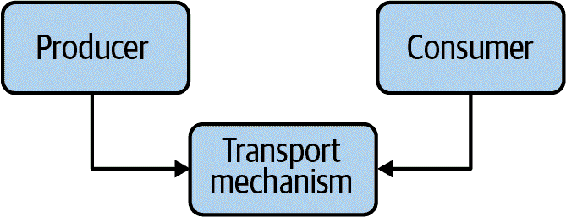
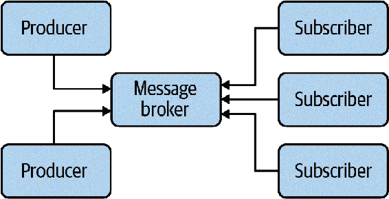

# 第十八章。事件驱动架构

可扩展性在你的代码库的每个层次都非常重要。在代码层面，你利用可扩展性来使你的函数和类灵活。在抽象层面，你在代码库的架构中使用相同的原则。*架构*是塑造软件设计方式的高级指导方针和约束集。它是影响所有开发人员的愿景，包括过去、现在和未来。本章以及接下来的章节将展示两个示例，说明架构示例如何提高可维护性。你在本书的这部分中学到的一切都适用：良好的架构促进可扩展性，良好地管理依赖关系，并促进可组合性。

在本章中，你将学习有关事件驱动架构的知识。*事件驱动架构*围绕着事件或系统中的通知。它是解耦代码库不同部分的绝佳方式，同时还可以为新功能或性能扩展系统。事件驱动架构使你可以轻松引入新的变化，并带来最小的影响。首先，我想谈谈事件驱动架构所提供的灵活性。然后，我将介绍事件驱动架构的两种不同变体：简单事件和流式事件。虽然它们相似，但你会在稍微不同的场景中使用它们。

# 工作原理

当你专注于事件驱动架构时，你实际上是围绕着对刺激的反应。你一直在处理对刺激的反应，无论是从烤箱中取出烩菜还是在手机通知后从前门取货。在事件驱动架构中，你的代码被构建成了这种模型。你的刺激是某种事件的*生产者*。对这些事件的*消费者*就是对那个刺激的反应。事件只是从生产者传递到消费者的信息传输。Table 18-1 展示了一些常见的生产者-消费者对。

Table 18-1。日常事件及其消费者

| 生产者 | 消费者 |
| --- | --- |
| 厨房计时器响起 | 厨师从烤箱取出一份烩菜 |
| 烹饪员在菜做好时敲铃 | 服务员接过并上菜 |
| 闹钟响起 | 睡眠者醒来 |
| 机场最后一次登机通知 | 匆忙的家庭着急赶上他们的连接航班 |

事实上，你在编程时实际上一直在处理生产者和消费者。任何返回值的函数都是生产者，任何使用该返回值的代码片段都是消费者。观察：

```py
def complete_order(order: Order):
    package_order(order)
    notify_customer_that_order_is_done(order)
    notify_restaurant_that_order_is_done(order)
```

在这种情况下，`complete_order`以完成订单的形式*产生*信息。根据函数名称，客户和餐馆正在*消耗*订单完成的事实。生产者通知消费者存在直接的链接。事件驱动架构的目标是断开这种物理依赖关系。目标是解耦生产者和消费者。生产者不知道消费者，消费者也不知道生产者。这就是推动事件驱动架构灵活性的因素。

通过这种解耦，向系统添加新的功能变得非常容易。如果需要新的消费者，可以添加它们而不需要触及生产者。如果需要不同的生产者，也可以添加它们而不需要触及消费者。这种双向的可扩展性允许您在隔离的多个代码部分中实现重大变更。

发生在幕后的事情非常巧妙。生产者和消费者之间不存在任何依赖关系，它们都依赖于传输机制，如图 18-1 所示。*传输机制*只是两段代码之间传递数据的方式。



###### 图 18-1\. 生产者-消费者关系

## 缺点

因为生产者和消费者依赖于传输机制，它们必须就消息格式达成一致。在大多数事件驱动架构中，生产者和消费者都会就常见标识符和消息格式达成一致。这确实在两者之间创建了*逻辑*依赖关系，但并非物理依赖关系。如果任何一方以不兼容的方式更改标识符或消息格式，则方案将崩溃。而且像大多数逻辑依赖关系一样，很难通过检查将这些依赖关系连接在一起。请参阅第十六章了解如何缓解这些问题。

由于代码的分离，当出现问题时，您的类型检查器将无法提供太多帮助。如果一个消费者开始依赖错误的事件类型，类型检查器将不会标记它。在更改生产者或消费者的类型时要格外小心，因为您将不得不更新所有其他生产者-消费者以匹配。

事件驱动架构可能会增加调试的难度。当您在调试器中逐步执行代码时，您将到达生成事件的代码，但是当您进入传输机制时，通常会进入第三方代码。在最坏的情况下，实际传输事件的代码可能在不同的进程中运行，甚至在不同的机器上运行。您可能需要多个活动调试器（每个进程或系统一个）来正确调试事件驱动架构。

最后，当使用事件驱动架构时，错误处理变得稍微复杂一些。大多数生产者与它们的消费者解耦；当消费者抛出异常或返回错误时，往往不容易从生产者端处理。

作为一个思维实验，考虑一下如果一个生产者产生了一个事件，而五个消费者消费了它会发生什么。如果被通知的第三个消费者抛出异常，应该发生什么？其他消费者应该得到异常吗，还是应该停止执行？生产者应该知道任何错误条件吗，还是错误应该被吞噬？如果生产者接收到异常，如果不同的消费者产生不同的异常会发生什么？对于所有这些问题没有一个正确的答案；请咨询您用于事件驱动架构的工具，以更好地了解在这些情况下会发生什么。

尽管存在这些缺点，事件驱动架构在需要为系统提供急需的灵活性的情况下是值得的。未来的维护者可以在最小的影响下替换您的生产者或消费者。他们可以引入新的生产者和消费者以创建新功能。他们可以快速集成外部系统，为新的合作伙伴关系打开大门。而且最重要的是，他们正在处理小型、模块化的系统，这些系统易于独立测试和理解。

# 简单事件

事件导向架构的最简单情况是处理*简单事件*，比如在某些条件变化时采取行动或通知您。您的信息生产者发送事件，您的消费者接收并对事件采取行动。有两种典型的实现方式：使用或不使用消息代理。

## 使用消息代理

消息代理是一种特定的代码片段，用作数据传输。生产者会将称为*消息*的数据发布到消息代理上的特定*主题*。主题只是一个唯一的标识符，比如一个字符串。它可以是简单的，比如“orders”，或者复杂的，比如“sandwich order is finished”。它只是一个命名空间，用于区分一个消息通道与另一个。消费者使用相同的标识符*订阅*一个主题。消息代理然后将消息发送给所有订阅该主题的消费者。这种类型的系统也被称为*发布/订阅*，简称 pub/sub。图 18-2 展示了一个假设的 pub/sub 架构。



###### 图 18-2\. 一个假设的基于消息代理的架构

在本章中，我将设计为餐厅的自动无人机送餐服务通知系统。当顾客订单烹饪完成时，无人机系统立即启动，接收订单并将餐点送到正确的地址。此系统中有五个通知，我已将它们拆分成生产者-消费者在 Table 18-2 中。

表 18-2\. 自动无人机送餐系统中的生产者和消费者

| 生产者 | 消费者 |
| --- | --- |
| 餐点已经烹饪完成 | 无人机已经通知进行取货 |
| 餐点已经烹饪完成 | 顾客已经收到餐点烹饪完成的通知 |
| 无人机正在途中 | 顾客已经收到关于预计到达时间的通知 |
| 无人机已经交付餐点 | 顾客已经收到交付通知 |
| 无人机已经交付餐点 | 餐厅已经收到交付通知 |

我不希望这些系统直接相互了解，因为处理顾客、无人机和餐厅的代码应保持独立（它们由不同的团队维护，我希望保持物理依赖低）。

首先，我将定义系统中存在的主题：餐点已经烹饪完成、无人机正在途中以及订单已经交付。

为了这个示例，我将使用 Python 库[PyPubSub](https://oreil.ly/8xLj7)，这是用于单进程应用程序的发布-订阅 API。要使用它，您需要设置订阅主题的代码和发布到主题的其他代码。首先，您需要安装`pypubsub`：

```py
pip install pypubsub
```

然后，要订阅该主题，您需要指定主题和要调用的函数：

```py
from pubsub import pub

def notify_customer_that_meal_is_done(order: Order):
    # ... snip ...

pub.subscribe(notify_customer_that_meal_is_done, "meal-done")
```

然后，要发布到这个主题，您需要执行以下操作：

```py
from pubsub import pub

def complete_order(order: Order):
    packge_order(order)
    pub.publish("meal-done", order)
```

###### 警告

订阅者在与发布者相同的线程中运行，这意味着任何阻塞 I/O，如等待读取套接字，将会阻塞发布者。这将影响所有其他订阅者，应避免这种情况发生。

这两段代码彼此之间没有任何关联；它们的全部依赖仅限于 PyPubSub 库以及在主题/消息数据上达成一致。这使得添加新的订阅者变得非常容易：

```py
from pubsub import pub

def schedule_pick_up_for_meal(order: Order):
    '''Schedule a drone pick-up'''
    # ... snip ...

pub.subscribe(schedule_pick_up_for_meal, "meal-done")
```

您不能更容易扩展。通过定义存在于系统内的主题，您可以轻松创建新的生产者或消费者。随着系统的增长需求，您通过与现有消息系统的交互来扩展它。

PyPubSub 还提供了一些选项来帮助调试。您可以通过添加自己的功能来添加审计操作，例如创建新主题或发送消息。您可以添加错误处理程序来处理任何订阅者抛出的异常。您还可以设置订阅所有主题的订阅者。如果您想了解更多关于这些功能或 PyPubSub 中任何其他功能的信息，请查阅[PyPubSub 文档](https://pypubsub.readthedocs.io)。

###### 注意

PyPubSub 用于单进程应用程序；你无法发布到运行在其他进程或系统中的代码。其他应用程序可以提供此功能，例如[Kafka](https://kafka.apache.org)，[Redis](https://redis.io)，或[RabbitMQ](https://www.rabbitmq.com)。查阅每个工具的文档以了解如何在 Python 中使用它们。

## 观察者模式

如果你不想使用消息代理，你可以选择实现观察者模式。¹ 在观察者模式中，你的生产者包含一个*观察者*列表：这些在此场景中是消费者。观察者模式不需要单独的库来充当消息代理。

为了避免直接连接生产者和消费者，你需要将观察者的知识保持*通用化*。换句话说，将观察者的任何具体知识抽象出来。我将通过仅使用函数（类型注释为`Callable`）来做到这一点。以下是我将如何重写先前示例以使用观察者模式的方法：

```py
def complete_order(order: Order, observers: list[Callable[Order]]):
    package_order(order)
    for observer_func in observers:
        observer(order)
```

在这种情况下，生产者只知道调用以通知的函数列表。要添加新的观察者，你只需将它们添加到作为参数传递的列表中。此外，由于这只是函数调用，你的类型检查器将能够检测到当生产者或其观察者以不兼容的方式发生变化时，这是消息代理范式的巨大优势。这也更容易调试，因为你不需要在调试器中步进第三方消息代理代码。

上面的观察者模式确实有一些缺点。首先，你对出现的错误更加敏感。如果观察者抛出异常，生产者需要能够直接处理（或者使用一个辅助函数或类来处理包装在`try…except`中的通知）。其次，生产者到观察者的连接比消息代理范式更直接。在消息代理范式中，发布者和订阅者可以连接起来，而不管它们在代码库中的位置如何。

相反，观察者模式要求通知的调用者（在前面的情况下是`complete_order`）知道观察者。如果调用者不直接知道观察者，那么它的调用者需要传递观察者。这可能一直延续到调用栈深处，直到有一段代码直接了解观察者为止。如果发现自己通过多个函数传递观察者以到达调用栈深处的生产者，请考虑使用消息代理代替。

如果您想更深入地了解简单事件的事件驱动架构，我推荐 Harry Percival 和 Bob Gregory（O’Reilly）的书籍[*Architecture Patterns with Python*](https://oreil.ly/JPpdr)，其第二部分完全是关于事件驱动架构的。

# 讨论主题

事件驱动架构如何提升代码库内的解耦性？观察者模式或消息代理哪一个更适合您的需求？

# 流式事件

在前面的部分中，简单事件被表示为满足某一条件时发生的离散事件。消息代理和观察者模式是处理简单事件的好方法。然而，一些系统处理永不停止的事件序列。事件以连续的数据流的形式流入系统。想象一下上一节中描述的无人机系统。考虑每个无人机传输的所有数据。可能包括位置数据、电池电量、当前速度、风数据、天气数据和当前负载重量。这些数据将定期传入，并且您需要一种处理方式。

在这类用例中，您不希望构建所有发布/订阅或观察者的样板代码；您需要一种与您的用例匹配的架构。您需要一个以事件为中心并为处理每个事件定义工作流的编程模型。这就是响应式编程的作用。

*响应式编程*是围绕事件流的一种架构风格。您将数据源定义为这些流的生产者，然后将多个观察者链接在一起。每个观察者在数据变化时得到通知，并定义一系列操作来处理数据流。响应式编程风格由[ReactiveX](http://reactivex.io)推广。在本节中，我将使用 ReactiveX 的 Python 实现：RxPY。

我将使用`pip`安装 RxPy：

```py
pip install rx
```

接下来，我需要定义一个数据流。在 RxPY 术语中，这被称为*可观察对象*。例如，我将使用一个硬编码的单个可观察对象进行示例，但实际上，您将从真实数据生成多个可观察对象。

```py
import rx
# Each one of these is simulating an independent real-world event streaming in
observable = rx.of(
    LocationData(x=3, y=12, z=40),
    BatteryLevel(percent=95),
    BatteryLevel(percent=94),
    WindData(speed=15, direction=Direction.NORTH),
    # ... snip 100s of events
    BatteryLevel(percent=72),
    CurrentWeight(grams=300)
)
```

此可观察对象是从不同类型事件的事件列表中生成的，用于无人机数据。

下一步需要定义每个事件的处理方法。一旦有可观察对象，观察者可以订阅它，类似于发布/订阅机制：

```py
def handle_drone_data(value):
    # ... snip handle drone data ...

observable.subscribe(handle_drone_data)
```

这看起来与普通的发布/订阅习语并没有太大不同。

*管道*运算符真正的魔力就在这里。RxPY 允许您将操作*管道化*或链接在一起，形成一个过滤器、转换和计算的管道。例如，我可以使用`rx.pipe`编写一个操作符管道来获取飞行器的平均重量：

```py
import rx.operators

get_average_weight = observable.pipe(
    rx.operators.filter(lambda data: isinstance(data, CurrentWeight)),
    rx.operators.map(lambda cw: cw.grams),
    rx.operators.average()
)

# save_average_weight does something with the final data
# (e.g. save to database, print to screen, etc.)
get_average_weight.subscribe(save_average_weight)
```

类似地，我可以编写一个管道链，跟踪无人机离开餐厅后的最大高度：

```py
get_max_altitude = observable.pipe(
    rx.operators.skip_while(is_close_to_restaurant),
    rx.operators.filter(lambda data: isinstance(data, LocationData)),
    rx.operators.map(lambda loc: loc.z),
    rx.operators.max()
)

# save max altitude does something with the final data
# (e.g. save to database, print to screen, etc)
get_max_altitude.subscribe(save_max_altitude)
```

###### 注意

*Lambda 函数* 只是一个没有名称的内联函数。它通常用于只使用一次的函数，你不希望将函数的定义放得离它的使用太远。

这是我们老朋友*可组合性*（如第十七章中所见）在帮助我们。我可以随心所欲地组合不同的操作符，以产生符合我的用例的数据流。RxPY 支持超过一百个内置操作符，以及定义自己操作符的框架。你甚至可以将一个管道的结果组合成其他程序部分可以观察的新事件流。这种可组合性，加上事件订阅的解耦特性，使你在编写代码时拥有极大的灵活性。此外，响应式编程鼓励不可变性，大大降低了出错的可能性。你可以连接新的管道，组合操作符，异步处理数据等等，这些都是响应式框架如 RxPY 能够做到的。

在独立环境中调试也变得容易了。虽然你不能轻易地通过调试器逐步进行 RxPY 的调试（你会陷入与操作和可观察对象相关的大量复杂代码中），但你可以步进到你传递给操作符的函数中。测试也非常简单。由于所有的函数都应该是不可变的，你可以单独测试它们中的任何一个。最终你会得到很多小而专用的函数，这些函数易于理解。

这种模型在围绕数据流的系统中表现出色，比如数据管道和抽取、转换、加载（ETL）系统。在以对 I/O 事件的反应为主的应用程序中，如服务器应用程序和 GUI 应用程序中，它也非常有用。如果响应式编程符合你的领域模型，我鼓励你阅读[RxPY 文档](https://rxpy.readthedocs.io/en/latest)。如果你想要更结构化的学习，我推荐视频课程[*Reactive Python for Data Science*](https://oreil.ly/Kr9At)或书籍[*Hands-On Reactive Programming with Python: Event-Driven Development Unraveled with RxPY*](https://oreil.ly/JCuf6)，作者是 Romain Picard（O’Reilly）。

# 总结思考

事件驱动架构非常强大。事件驱动架构允许你将信息的生产者和消费者分开。通过解耦这两者，你为系统引入了灵活性。你可以替换功能、在隔离环境中测试你的代码，或者通过引入新的生产者或消费者来扩展新功能。

设计事件驱动系统有许多方式。您可以选择在系统中继续使用简单事件和观察者模式来处理轻量级事件。随着规模扩大，您可能需要引入消息代理，例如使用 PyPubSub。甚至在跨进程或系统进行扩展时，您可能需要使用另一个库作为消息代理。最后，当您接近事件流时，您可以考虑使用响应式编程框架，如 RxPY。

在接下来的章节中，我将介绍一种不同类型的架构范例：插件架构。插件架构提供了与事件驱动架构类似的灵活性、可组合性和可扩展性，但方式完全不同。而事件驱动架构专注于事件，插件架构则专注于可插拔的实现单元。您将看到，插件架构如何为您提供丰富的选项，以构建一个易于维护的健壮代码库。

¹ 观察者模式首次被描述在《设计模式：可复用面向对象软件的基础》一书中，作者是 Erich Gamma、Richard Helm、Ralph Johnson 和 John Vlissides（Addison-Wesley Professional）。这本书通常被称为“四人组（GoF）”书籍。
