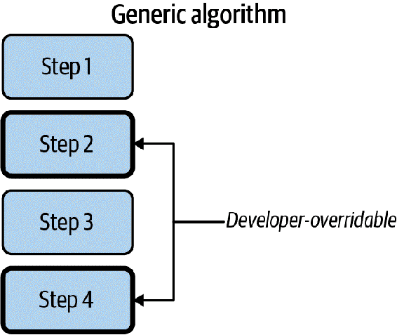
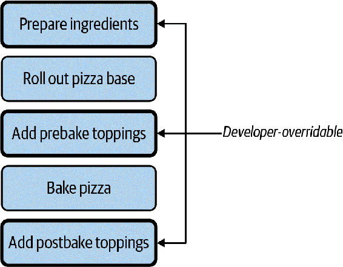
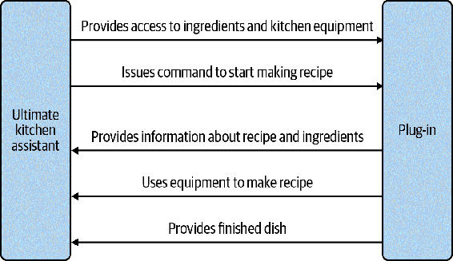

# 第十九章：可插拔的 Python

建立稳健代码库最大的挑战在于预测未来。你永远不可能完全猜透未来的开发者会做什么。最好的策略不是完全精准地预见，而是创建灵活性，使未来的合作者可以用最少的工作接入你的系统。在本章中，我将专注于创建*可插拔*代码。可插拔的代码允许你定义稍后提供的行为。你可以定义一个带有*扩展点*的框架，或者是系统中其他开发者将用来扩展功能的部分。

想象一台放在厨房台面上的搅拌机。你可以选择各种附件与你的搅拌机一起使用：揉面包的钩子、打蛋和奶油的打蛋器，以及通用搅拌的扁平搅拌器。每个附件都有特定的用途。很棒的是，你可以根据情况拆卸和安装钩子或刀片。你不需要为每个用例购买全新的搅拌机；你在需要时*插入*你需要的东西即可。

这就是可插拔 Python 的目标。当需要新功能时，你无需重建整个应用程序。你构建扩展或附件，它们可以轻松地连接到坚实的基础上。你选择你特定用例所需的功能，然后将其插入你的系统中。

在本书的大部分内容中，我一直在用各种自动食品制造器做例子。在本章中，我将执行各种合并并设计一个可以结合它们所有的系统。我想要构建一个可以接受我讲过的任何食谱并烹饪它们的系统。我称之为“终极厨房助手”（如果你认为这是个糟糕的名字，现在你知道为什么我不从事市场营销工作了）。

终极厨房助手包含了你在厨房工作所需的所有指示和装备。它知道如何切片、切块、炸、煎、烘烤、烧烤和混合任何食材。它附带了一些预制的食谱，但真正的魔力在于顾客可以购买现成的模块来扩展其功能（比如“意大利面条制作模块”，满足意大利菜的需求）。

问题在于，我不希望代码变得难以维护。有很多不同的菜需要做，我希望系统具有某种灵活性，而不是因为大量物理依赖而使系统变成意大利面条代码（尽管你的系统自己在厨房制作意大利面条非常鼓励！）。就像给搅拌机插上新附件一样，我希望开发者能够连接不同的附件来解决他们的用例。我甚至希望其他组织为终极厨房助手构建模块。我希望这个代码库具有可扩展性和可组合性。

我将用这个例子来说明三种不同的插入不同 Python 结构的方法。首先，我将专注于如何使用模板方法模式插入算法的特定部分。然后，我将讲解如何使用策略模式插入整个类。最后，我将向您介绍一个非常有用的库，stevedore，以在更大的架构规模上进行插件。所有这些技术都将帮助您为未来的开发人员提供所需的可扩展性。

# 模板方法模式

*模板方法模式* 是一种填充算法空白的设计模式。¹ 思想是你定义一个算法为一系列步骤，但强制调用者重写其中的一些步骤，如 图 19-1 所示。



###### 图 19-1\. 模板方法模式

终极厨房助手首先介绍的是一个披萨制作模块。虽然传统的酱和奶酪披萨很棒，但我希望终极厨房助手更加灵活。我希望它能处理各种类似披萨的实体，从黎巴嫩马努什到韩国烤牛肉披萨。为了制作这些类似披萨的菜肴中的任何一种，我希望机制执行一系列类似的步骤，但让开发人员调整某些操作，以制作他们自己风格的披萨。 图 19-2 描述了这样一个披萨制作算法。



###### 图 19-2\. 披萨制作算法

每个披萨将使用相同的基本步骤，但我希望能够调整某些步骤（准备配料、添加预烘烤配料和添加后烘烤配料）。我在应用模板方法模式时的目标是使这些步骤可插拔。

在最简单的情况下，我可以将函数传递给模板方法：

```py
@dataclass
class PizzaCreationFunctions:
    prepare_ingredients: Callable
    add_pre_bake_toppings: Callable
    add_post_bake_toppings: Callable

def create_pizza(pizza_creation_functions: PizzaCreationFunctions):
    pizza_creation_functions.prepare_ingredients()
    roll_out_pizza_base()
    pizza_creation_functions.add_pre_bake_toppings()
    bake_pizza()
    pizza_creation_functions.add_post_bake_toppings()
```

现在，如果您想要制作披萨，您只需传入自己的函数：

```py
pizza_creation_functions = PizzaCreationFunctions(
    prepare_ingredients=mix_zaatar,
    add_pre_bake_toppings=add_meat_and_halloumi,
    add_post_bake_toppings=drizzle_olive_oil
)

create_pizza(pizza_creation_functions)
```

这对任何披萨来说都非常方便，现在或将来。随着新的披萨制作能力上线，开发人员需要将他们的新函数传递到模板方法中。这些开发人员可以插入披萨制作算法的特定部分，以满足他们的需求。他们根本不需要了解他们的用例；他们可以自由地扩展系统，而不会被改变旧代码所困扰。假设他们想要创建烤牛肉披萨。我只需传入一个新的 `PizzaCreationFunctions`，而不是改变 `create_pizza`：

```py
pizza_creation_functions = PizzaCreationFunctions(
    prepare_ingredients=cook_bulgogi,
    add_pre_bake_toppings=add_bulgogi_toppings,
    add_post_bake_toppings=garnish_with_scallions_and_sesame
)

create_pizza(pizza_creation_functions)
```

# 策略模式

模板方法模式非常适合交换算法中的某些部分，但如果您想要替换整个算法呢？对于这种情况，存在一个非常类似的设计模式：策略模式。

策略模式用于将整个算法插入到上下文中。² 对于最终的厨房助手，考虑专门从事 Tex-Mex 的模块（一种将美国西南部和墨西哥北部菜肴混合的美国地区菜肴）。可以从一组共同的食材制作出各种各样的菜肴；你可以通过不同方式混搭这些不同的配料。

例如，你会在大多数 Tex-Mex 菜单上找到以下配料：玉米或小麦面粉的玉米饼，豆类，碎牛肉，鸡肉，生菜，番茄，鳄梨酱，莎莎酱和奶酪。从这些配料中，你可以制作出塔科斯、弗劳塔斯、奇米昌加斯、恩奇拉达、塔科沙拉、玉米片、戈迪塔……种类繁多。我不希望系统限制所有不同的 Tex-Mex 菜肴；我希望不同的开发团队提供如何制作这些菜肴的信息。

要使用策略模式做到这一点，我需要定义最终的厨房助手所做的事情以及策略所做的事情。在这种情况下，最终的厨房助手应提供与配料交互的机制，但未来的开发人员可以自由添加新的 Tex-Mex 调配方案，如`TexMexStrategy`。

与任何设计为可扩展的代码一样，我需要确保我最终的厨房助手和 Tex-Mex 模块之间的交互符合前置条件和后置条件，即传递给 Tex-Mex 模块的内容以及输出的内容。

假设最终的厨房助手有编号的箱子用于放置食材。Tex-Mex 模块需要知道常见的 Tex-Mex 食材放在哪些箱子里，以便可以利用最终的厨房助手进行准备和烹饪。

```py
@dataclass
class TexMexIngredients:
    corn_tortilla_bin: int
    flour_tortilla_bin: int
    salsa_bin: int
    ground_beef_bin: int
    # ... snip ..
    shredded_cheese_bin: int

def prepare_tex_mex_dish(tex_mex_recipe_maker: Callable[TexMexIngredients]);
    tex_mex_ingredients = get_available_ingredients("Tex-Mex")
    dish = tex_mex_recipe_maker(tex_mex_ingredients)
    serve(dish)
```

函数`prepare_tex_mex_dish`收集配料，然后委托给实际的`tex_mex_recipe_maker`来创建要服务的菜肴。`tex_mex_recipe_maker`就是策略。这与模板方法模式非常相似，但通常只传递单个函数而不是一组函数。

未来的开发人员只需编写一个根据配料实际进行准备的函数。他们可以编写：

```py
import tex_mex_module as tmm
def make_soft_taco(ingredients: TexMexIngredients) -> tmm.Dish:
    tortilla = tmm.get_ingredient_from_bin(ingredients.flour_tortilla_bin)
    beef = tmm.get_ingredient_from_bin(ingredients.ground_beef_bin)
    dish = tmm.get_plate()
    dish.lay_on_dish(tortilla)
    tmm.season(beef, tmm.CHILE_POWDER_BLEND)
    # ... snip

prepare_tex_mex_dish(make_soft_taco)
```

如果他们决定未来某个时候提供对不同菜肴的支持，他们只需编写一个新的函数：

```py
def make_chimichanga(ingredients: TexMexIngredients):
    # ... snip
```

开发人员可以随时随地继续定义函数。就像模板方法模式一样，他们可以在对原始代码影响最小的情况下插入新功能。

###### 注意

与模板方法一样，我展示的实现与《四人组设计模式》中最初描述的有些不同。原始实现涉及包装单个方法的类和子类。在 Python 中，仅传递单个函数要简单得多。

# 插件架构

策略模式和模板方法模式非常适合插入小功能块：在这里是一个类或一个函数。然而，同样的模式也适用于你的架构。能够注入类、模块或子系统同样重要。一个名为[stevedore](https://oreil.ly/AybtZ)的 Python 库是管理*插件*的一个非常有用的工具。

插件是可以在运行时动态加载的代码片段。代码可以扫描已安装的插件，选择合适的插件，并将责任委派给该插件。这是另一个可扩展性的例子；开发人员可以专注于特定的插件而不用触及核心代码库。

插件架构不仅具有可扩展性的优点：

+   您可以独立部署插件，而不影响核心，这使得您在推出更新时拥有更多的粒度。

+   第三方可以编写插件，而无需修改您的代码库。

+   插件可以在与核心代码库隔离的环境中开发，减少创建紧密耦合代码的可能性。

为了演示插件的工作原理，假设我想支持终极厨房助手的生态系统，用户可以单独购买和安装模块（例如上一节中的 Tex-Mex 模块）。每个模块为终极厨房助手提供一组食谱、特殊设备和食材存储。真正的好处在于，每个模块都可以与终极厨房助手核心分开开发；每个模块都是一个插件。

设计插件时的第一步是确定核心与各种插件之间的契约。问问自己核心平台提供了哪些服务，您期望插件提供什么。在终极厨房助手的情况下，Figure 19-3 展示了我将在接下来的示例中使用的契约。



###### 图 19-3\. 核心与插件之间的契约

我想将这个契约放入代码中，以便清楚地表达我对插件的期望：

```py
from abc import abstractmethod
from typing import runtime_checkable, Protocol

from ultimate_kitchen_assistant import Amount, Dish, Ingredient, Recipe

@runtime_checkable
class UltimateKitchenAssistantModule(Protocol):

    ingredients: list[Ingredient]

    @abstractmethod
    def get_recipes() -> list[Recipe]:
        raise NotImplementedError

    @abstractmethod
    def prepare_dish(inventory: dict[Ingredient, Amount],
                     recipe: Recipe) -> Dish:
        raise NotImplementedError
```

这就是插件的定义。要创建符合我的期望的插件，我只需创建一个从我的基类继承的类。

```py
class PastaModule(UltimateKitchenAssistantModule):
    def __init__(self):
        self.ingredients = ["Linguine",
                             # ... snip ...
                            "Spaghetti" ]

    def get_recipes(self) -> list[Recipe]:
        # ... snip returning all possible recipes ...

    def prepare_dish(self, inventory: dict[Ingredient, Amount],
                     recipe: Recipe) -> Dish:
        # interact with Ultimate Kitchen Assistant to make recipe
        # ... snip ...
```

一旦您创建了插件，您需要使用 stevedore 将其注册。stevedore 将插件与一个*命名空间*或将插件分组在一起的标识符进行匹配。它通过使用 Python 的*入口点*在运行时发现组件来实现这一点。³

您可以通过`setuptools`和`setup.py`注册插件。许多 Python 包使用`setup.py`来定义打包规则，其中之一就是入口点。在`ultimate_kitchen_assistant`的`setup.py`中，我将我的插件注册如下：

```py
from setuptools import setup

setup(
    name='ultimate_kitchen_assistant',
    version='1.0',
    #.... snip ....

    entry_points={
        'ultimate_kitchen_assistant.recipe_maker': [
            'pasta_maker = ultimate_kitchen_assistant.pasta_maker:PastaModule',
            'tex_mex = ultimate_kitchen_assistant.tex_mex:TexMexModule'
        ],
    },
)
```

###### 注意

如果你在链接插件时遇到问题，请查看 [`entry-point-inspector` 包](https://oreil.ly/kbMro) 获取调试帮助。

我正在将我的 `PastaMaker` 类（在 `ultimate_kitchen_assistant.pasta_maker` 包中）绑定到命名空间为 `ultimate_kitchen_assistant.recipe_maker` 的插件上。我还创建了另一个名为 `TexMexModule` 的假设性插件。

一旦插件被注册为入口点，你可以在运行时使用 stevedore 动态加载它们。例如，如果我想从所有插件中收集所有的菜谱，我可以编写以下代码：

```py
import itertools
from stevedore import extension
from ultimate_kitchen_assisstant import Recipe

def get_all_recipes() -> list[Recipe]:
    mgr = extension.ExtensionManager(
            namespace='ultimate_kitchen_assistant.recipe_maker',
            invoke_on_load=True,
        )

    def get_recipes(extension):
        return extension.obj.get_recipes()

    return list(itertools.chain(mgr.map(get_recipes)))
```

我使用 `stevedore.extension.ExtensionManager` 查找和加载命名空间为 `ultimate_kitchen_assistant.recipe_maker` 的所有插件。然后，我可以对找到的每个插件映射（或应用）一个函数以获取它们的菜谱。最后，我使用 `itertools` 将它们全部连接在一起。无论我设置了多少个插件，都可以用这段代码加载它们。

假设用户想要从意大利面机制造一些东西，比如“意式香肠意面”。所有调用代码需要做的就是请求一个名为 `pasta_maker` 的插件。我可以通过 `stevedore.driver.DriverManager` 加载特定的插件。

```py
from stevedore import driver

def make_dish(recipe: Recipe, module_name: str) -> Dish:
    mgr = driver.DriverManager(
        namespace='ultimate_kitchen_assistant.recipe_maker',
        name=module_name,
        invoke_on_load=True,
    )

    return mgr.driver.prepare_dish(get_inventory(), recipe)
```

# 讨论主题

你的系统哪些部分可以使用插件架构？这如何使你的代码库受益？

stevedore 提供了一种很好的方式来解耦代码；将代码分离成插件使其保持灵活和可扩展。记住，可扩展程序的目标是限制对核心系统所需的修改次数。开发者可以独立创建插件，测试它们，并将其无缝集成到你的核心中。

我最喜欢的 stevedore 的部分是它实际上可以跨包工作。你可以在完全独立的 Python 包中编写插件，而不是核心包。只要插件使用相同的命名空间，stevedore 就可以把所有东西组合起来。stevedore 还有许多其他值得一探的功能，比如事件通知、通过多种方法启用插件以及自动生成插件文档。如果插件架构符合你的需求，我强烈建议多了解 stevedore。

###### 警告

你实际上可以注册任何类作为插件，无论它是否可替换基类。因为代码被 stevedore 分离到一个抽象层中，你的类型检查器将无法检测到这一点。在使用插件之前，考虑在运行时检查接口以捕捉任何不匹配。

# 总结思考

创建可插拔的 Python 程序时，你赋予了合作者隔离新功能的能力，同时仍然可以轻松地将其集成到现有的代码库中。开发者可以使用模板方法模式（Template Method Pattern）插入现有算法，使用策略模式（Strategy Pattern）插入整个类或算法，或者使用 stevedore 插入整个子系统。当你想将插件跨离散的 Python 包中分布时，stevedore 尤为有用。

这结束了关于第 III 部分的内容，重点是可扩展性。编写可扩展的代码遵循开闭原则，使得您可以轻松添加代码而无需修改现有代码。事件驱动架构和插件架构是设计可扩展性的绝佳例子。所有这些架构模式都要求您了解依赖关系：物理、逻辑和时间依赖。当您找到减少物理依赖的方法时，您会发现您的代码变得可组合，并可以随意重新组合成新的组合形式。

本书的前三部分着重于可以使您的代码更易于维护和阅读，并减少错误发生的几率。然而，错误仍然可能会出现；它们是软件开发中不可避免的一部分。为了应对这一点，您需要使错误在进入生产环境之前易于检测。您将学会如何使用诸如 linter 和测试工具来实现这一点，详见第 IV 部分，*构建安全网络*。

¹ Erich Gamma, Richard Helm, Ralph E. Johnson, and John Vlissides. *设计模式：可复用面向对象软件的元素*. 波士顿, MA: Addison-Wesley Professional, 1994.

² Erich Gamma, Richard Helm, Ralph E. Johnson, and John Vlissides. *设计模式：可复用面向对象软件的元素*. 波士顿, MA: Addison-Wesley Professional, 1994.

³ 入口点在与 Python 包装互动方面可能会很复杂，但这超出了本书的范围。您可以在[*https://oreil.ly/bMyJS*](https://oreil.ly/bMyJS)了解更多信息。
