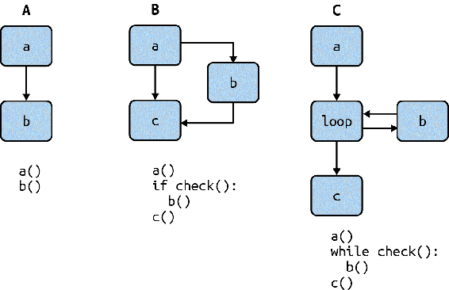

# 第二十章：静态分析

在进行测试之前，我首先想谈一下静态分析。*静态分析* 是一组工具，检查您的代码库，寻找潜在的错误或不一致之处。它是发现常见错误的重要工具。实际上，您已经在使用一个静态分析工具：mypy。Mypy（和其他类型检查器）检查您的代码库并找到类型错误。其他静态分析工具检查其他类型的错误。在本章中，我将介绍常见的用于代码检查、复杂度检查和安全扫描的静态分析工具。

# 代码检查

我将首先向您介绍的静态分析工具类别称为 *代码检查器*。代码检查器在您的代码库中搜索常见的编程错误和风格违规。它们的名称源自最初的代码检查器：一个名为 *lint* 的程序，用于检查 C 语言程序的常见错误。它会搜索“模糊”逻辑并尝试消除这种模糊（因此称为 linting）。在 Python 中，您最常遇到的代码检查器是 Pylint。Pylint 用于检查大量常见错误：

+   某些违反 [PEP 8](https://oreil.ly/MnCoY) Python 风格指南的风格违规

+   不可达的死代码（例如在返回语句之后的代码）

+   违反访问限制条件（例如类的私有或受保护成员）

+   未使用的变量和函数

+   类内的内聚性不足（在方法中没有使用 self，公共方法过多）

+   缺少文档，如文档字符串形式

+   常见的编程错误

这些错误类别中的许多是我们先前讨论过的内容，例如访问私有成员或函数需要成为自由函数而不是成员函数（如第十章讨论的）。像 Pylint 这样的代码检查工具将为您补充本书中学到的所有技术；如果您违反了我一直提倡的一些原则，代码检查工具将为您捕捉这些违规行为。

Pylint 在查找代码中一些常见错误方面也非常有用。考虑一个开发者添加将所有作者的食谱书籍添加到现有列表的代码：

```py
def add_authors_cookbooks(author_name: str, cookbooks: list[str] = []) -> bool:

    author = find_author(author_name)
    if author is None:
        assert False, "Author does not exist"
    else:
        for cookbook in author.get_cookbooks():
            cookbooks.append(cookbook)
        return True
```

这看起来无害，但是这段代码中有两个问题。请花几分钟看看您能否找到它们。

现在让我们看看 Pylint 能做什么。首先，我需要安装它：

```py
pip install pylint
```

然后，我将对上述示例运行 Pylint：

```py
pylint code_examples/chapter20/lint_example.py
************* Module lint_example

code_examples/chapter20/lint_example.py:11:0: W0102:
    Dangerous default value [] as argument (dangerous-default-value)
code_examples/chapter20/lint_example.py:11:0: R1710:
    Either all return statements in a function should return an expression,
    or none of them should. (inconsistent-return-statements)
```

Pylint 在我的代码中标识出了两个问题（实际上找到了更多，比如缺少文档字符串，但为了本讨论的目的我已经省略了它们）。首先，存在一个危险的可变默认参数形式为`[]`。关于这种行为已经写了很多[文章](https://oreil.ly/sCQQu)，但这对于错误，特别是对于新手来说，是一个常见的陷阱。

另一个错误更加微妙：不是所有分支都返回相同的类型。“等等！”你会说。“没关系，因为我断言，这会引发一个错误，而不是通过`if`语句（返回`None`）。然而，虽然`assert`语句很棒，但它们可以被关闭。当你给 Python 传递`-O`标志时，它会禁用所有`assert`语句。因此，当打开`-O`标志时，这个函数返回`None`。值得一提的是，mypy 并不会捕获这个错误，但是 Pylint 可以。更好的是，Pylint 在不到一秒钟的时间内找到了这些错误。

无论你是否犯下这些错误，或者你是否总是在代码审查中找到它们。在任何代码库中都有无数开发人员在工作，错误可能发生在任何地方。通过强制执行像 Pylint 这样的代码检查工具，你可以消除非常常见的可检测错误。有关内置检查器的完整列表，请参阅[Pylint 文档](https://oreil.ly/9HRzC)。

## 编写你自己的 Pylint 插件

当你编写自己的插件时，真正的 Pylint 魔法开始发挥作用（有关插件架构的更多信息，请参阅第十九章）。Pylint 插件允许你编写自己的自定义*检查器*或规则。虽然内置检查器查找常见的 Python 错误，但你的自定义检查器可以查找你问题领域中的错误。

看一看远在第四章的代码片段：

```py
ReadyToServeHotDog = NewType("ReadyToServeHotDog", HotDog)

def prepare_for_serving() -> ReadyToServeHotDog:
    # snip preparation
    return ReadyToServeHotDog(hotdog)
```

在第四章中，我提到过，为了使`NewType`生效，你需要确保只能通过*blessed*方法来构造它，或者强制执行与该类型相关的约束。当时，我的建议是使用注释来给代码读者一些提示。然而，使用 Pylint，你可以编写一个自定义检查器来查找违反这一期望的情况。

这是插件的完整内容。之后我会为你详细解释：

```py
from typing import Optional

import astroid

from pylint.checkers import BaseChecker
from pylint.interfaces import IAstroidChecker
from pylint.lint.pylinter import PyLinter

class ServableHotDogChecker(BaseChecker):
    __implements__ = IAstroidChecker

    name = 'unverified-ready-to-serve-hotdog'
    priority = -1
    msgs = {
      'W0001': (
        'ReadyToServeHotDog created outside of hotdog.prepare_for_serving.',
        'unverified-ready-to-serve-hotdog',
        'Only create a ReadyToServeHotDog through hotdog.prepare_for_serving.'
      ),
    }

    def __init__(self, linter: Optional[PyLinter] = None):
        super(ServableHotDogChecker, self).__init__(linter)
        self._is_in_prepare_for_serving = False

    def visit_functiondef(self, node: astroid.scoped_nodes.FunctionDef):
        if (node.name == "prepare_for_serving" and
            node.parent.name =="hotdog" and
            isinstance(node.parent, astroid.scoped_nodes.Module)):

            self._is_in_prepare_for_serving = True

    def leave_functiondef(self, node: astroid.scoped_nodes.FunctionDef):
        if (node.name == "prepare_for_serving" and
            node.parent.name =="hotdog" and
            isinstance(node.parent, astroid.scoped_nodes.Module)):

            self._is_in_prepare_for_serving = False

    def visit_call(self, node: astroid.node_classes.Call):
        if node.func.name != 'ReadyToServeHotDog':
            return

        if self._is_in_prepare_for_serving:
            return

        self.add_message(
            'unverified-ready-to-serve-hotdog', node=node,
        )

def register(linter: PyLinter):
    linter.register_checker(ServableHotDogChecker(linter))
```

这个代码检查器验证了当有人创建一个`ReadyToServeHotDog`时，它只能在一个名为`prepare_for_serving`的函数中完成，并且该函数必须位于名为`hotdog`的模块中。现在假设我创建了任何其他创建准备供应热狗的函数，如下所示：

```py
def create_hot_dog() -> ReadyToServeHotDog:
    hot_dog = HotDog()
    return ReadyToServeHotDog(hot_dog)
```

我可以运行我的自定义 Pylint 检查器：

```py
 PYTHONPATH=code_examples/chapter20 pylint --load-plugins \
        hotdog_checker code_examples/chapter20/hotdog.py
```

Pylint 确认现在服务“不可供应”的热狗是一个错误：

```py
************* Module hotdog
code_examples/chapter20/hotdog.py:13:12: W0001:
    ReadyToServeHotDog created outside of prepare_for_serving.
        (unverified-ready-to-serve-hotdog)
```

这太棒了。现在我可以编写自动化工具，用来检查那些像我的 mypy 类型检查器无法甚至开始查找的错误。不要让你的想象力束缚你。使用 Pylint 可以捕捉任何你能想到的东西：业务逻辑约束违规、时间依赖性或者自定义样式指南。现在，让我们看看这个代码检查器是如何工作的，这样你就能够构建你自己的。

## 插件分解

写插件的第一件事是定义一个从`pylint.checkers.BaseChecker`继承的类：

```py
import astroid

from pylint.checkers import BaseChecker
from pylint.interfaces import IAstroidChecker

class ReadyToServeHotDogChecker(BaseChecker):
    __implements__ = IAstroidChecker
```

您还会注意到一些对`astroid`的引用。`astroid`库用于将 Python 文件解析为抽象语法树（AST），这为与 Python 源代码交互提供了一种便捷的结构化方式。很快您将看到这在哪些方面非常有用。

接下来，我定义插件的元数据。这提供了插件名称、显示给用户的消息以及一个标识符（`unverified-ready-to-serve-hotdog`），以便稍后引用。

```py
    name = 'unverified-ready-to-serve-hotdog'
    priority = -1
    msgs = {
     'W0001': ( # this is an arbitrary number I've assigned as an identifier
        'ReadyToServeHotDog created outside of hotdog.prepare_for_serving.',
        'unverified-ready-to-serve-hotdog',
        'Only create a ReadyToServeHotDog through hotdog.prepare_for_serving.'
     ),
    }
```

接下来，我想跟踪我所在的函数，以便判断我是否在使用`prepare_for_serving`。这就是`astroid`库发挥作用的地方。如前所述，`astroid`库帮助 Pylint 检查器以 AST 的形式思考；您无需担心字符串解析。如果您想了解有关 AST 和 Python 解析的更多信息，可以查看[`astroid`文档](https://oreil.ly/JvQgU)，但现在，您只需知道，如果在检查器中定义了特定函数，它们将在`astroid`解析代码时被调用。每个调用的函数都会传递一个`node`，代表代码的特定部分，例如表达式或类定义。

```py
    def __init__(self, linter: Optional[PyLinter] = None):
        super(ReadyToServeHotDogChecker, self).__init__(linter)
        self._is_in_prepare_for_serving = False

    def visit_functiondef(self, node: astroid.scoped_nodes.FunctionDef):
        if (node.name == "prepare_for_serving" and
            node.parent.name =="hotdog" and
            isinstance(node.parent, astroid.scoped_nodes.Module)):
                self._is_in_prepare_for_serving = True

    def leave_functiondef(self, node: astroid.scoped_nodes.FunctionDef):
        if (node.name == "prepare_for_serving" and
            node.parent.name =="hotdog" and
            isinstance(node.parent, astroid.scoped_nodes.Module)):

            self._is_in_prepare_for_serving = False
```

在这种情况下，我定义了一个构造函数来保存一个成员变量，以跟踪我是否在正确的函数中。我还定义了两个函数，`visit_functiondef`和`leave_functiondef`。`visit_functiondef`将在`astroid`解析函数定义时调用，而`leave_functiondef`在解析器停止解析函数定义时调用。因此，当解析器遇到函数时，我会检查该函数是否命名为`prepare_for_serving`，它位于名为`hotdog`的模块中。

现在我有一个成员变量来跟踪我是否在正确的函数中，我可以编写另一个`astroid`钩子，以便在每次调用函数时调用它（比如`ReadyToServeHotDog(hot_dog)`）。

```py
    def visit_call(self, node: astroid.node_classes.Call):
        if node.func.name != 'ReadyToServeHotDog':
            return

        if self._is_in_prepare_for_serving:
            return

        self.add_message(
            'unverified-ready-to-serve-hotdog', node=node,
        )
```

如果函数调用不是`ReadyToServeHotDog`，或者执行在`prepare_serving`中，这个检查器则不会发现问题并早早返回。如果函数调用是`ReadyToServeHotDog`，而执行不在`prepare_serving`中，检查器将失败并添加一条消息来指示`unverified-ready-to-serve-hotdog`检查失败。通过添加消息，Pylint 将把此信息传递给用户并标记为检查失败。

最后，我需要注册这个 linter：

```py
    def register(linter: PyLinter):
        linter.register_checker(ReadyToServeHotDogChecker(linter))
```

就是这样了！使用大约 45 行 Python 代码，我定义了一个 Pylint 插件。这是一个简单的检查器，但是您可以无限想象您能做的事情。无论是内置的还是用户创建的 Pylint 检查器，对于查找错误都是无价的。

# 讨论主题

您在代码库中可以创建哪些检查器？您可以使用这些检查器捕捉哪些错误情况？

# 其他静态分析工具

类型检查器和代码检查器通常是人们在听到“静态分析”时首先想到的工具，但还有许多其他工具可以帮助你编写健壮的代码。每个工具都像是瑞士奶酪的一块。¹ 每块瑞士奶酪都有不同宽度或大小的孔洞，但当多块奶酪堆叠在一起时，几乎不可能有一个区域所有孔洞对齐，从而可以透过这个堆看到。

同样，你用来构建安全网络的每个工具都会忽略某些错误。类型检查器无法捕捉常见的编程错误，代码检查器无法检查安全违规，安全检查器无法捕捉复杂代码，等等。但是当这些工具堆叠在一起时，合法错误通过的可能性大大降低（对于那些通过的，那就是你需要测试的原因）。正如布鲁斯·麦克莱南所说，“设置一系列防御措施，这样如果一个错误没有被一个工具捕捉到，很可能会被另一个捕捉到。”²

## 复杂性检查器

本书大部分内容都集中在可读性和可维护性代码上。我谈到了复杂代码如何影响功能开发的速度。一个工具可以指示代码库中哪些部分具有高复杂性将会很好。不幸的是，复杂性是主观的，减少复杂性并不总是会减少错误。但我可以将复杂性度量视为*启发式*。启发式是提供答案但不保证是最优答案的东西。在这种情况下，问题是，“我代码中哪里可能有最多的 bug？”大多数情况下，会在复杂性高的代码中发现，但请记住这并非保证。

### 带麦卡比的圈复杂度

最流行的复杂性启发式之一被称为*圈复杂度*，最早由托马斯·麦卡比描述。³ 要测量代码的圈复杂度，你必须将代码视为*控制流图*，或者一个绘制出代码可以执行的不同路径的图形。图 20-1 展示了几个不同的例子。



###### 图 20-1\. 圈复杂度示例

图 20-1 的 A 部分展示了语句的线性流动，复杂度为一。如同 B 部分所示，没有 elif 语句的 if 语句有两条路径（if 或 else/跟随），因此复杂度为两。类似地，像 C 部分中的 while 循环，有两个不同的路径：循环继续或退出。随着代码变得更复杂，圈复杂度数字会变得更高。

您可以使用 Python 中的静态分析工具来测量圈复杂度，其名为`mccabe`。

我将用`pip`安装它：

```py
pip install mccabe
```

为了测试它，我将在`mccabe`代码库本身上运行它，并标记任何圈复杂度大于或等于五的函数：

```py
python -m mccabe --min 5 mccabe.py
192:4: 'PathGraphingAstVisitor._subgraph_parse' 5
273:0: 'get_code_complexity' 5
298:0: '_read' 5
315:0: 'main' 7
```

让我们来看看`PathGraphingAstVisitor._subgraph_parse`：

```py
def _subgraph_parse(self, node, pathnode, extra_blocks):
       """parse the body and any `else` block of `if` and `for` statements"""
       loose_ends = []
       self.tail = pathnode
       self.dispatch_list(node.body)
       loose_ends.append(self.tail)
       for extra in extra_blocks:
           self.tail = pathnode
           self.dispatch_list(extra.body)
           loose_ends.append(self.tail)
       if node.orelse:
           self.tail = pathnode
           self.dispatch_list(node.orelse)
           loose_ends.append(self.tail)
       else:
           loose_ends.append(pathnode)
       if pathnode:
           bottom = PathNode("", look='point')
           for le in loose_ends:
               self.graph.connect(le, bottom)
           self.tail = bottom
```

这个函数中发生了几件事情：各种条件分支、循环，甚至在`if`语句中嵌套了一个循环。每条路径都是独立的，需要进行测试。随着圈复杂度的增加，代码变得越来越难阅读和理解。圈复杂度没有一个魔法数字；您需要检查您的代码库并寻找一个合适的限制。

### 空白启发式

还有一种复杂度启发式方法我非常喜欢，比圈复杂度稍微简单一些来理解：[空白检查](https://oreil.ly/i3Dpd)。其思想如下：计算一个 Python 文件中有多少级缩进。高水平的缩进表示嵌套循环和分支，这可能表明代码复杂度高。

不幸的是，在撰写本文时还没有流行的工具来处理空白启发式。然而，编写这个检查器自己是很容易的：

```py
def get_amount_of_preceding_whitespace(line: str) -> int:
    # replace tabs with 4 spaces (and start tab/spaces flame-war)
    tab_normalized_text = line.replace("\t", "    ")
    return len(tab_normalized_text) - len(tab_normalized_text.lstrip())

def get_average_whitespace(filename: str):
    with open(filename) as file_to_check:
        whitespace_count = [get_amount_of_preceding_whitespace(line)
                            for line in file_to_check
                            if line != ""]
        average = sum(whitespace_count) / len(whitespace_count) / 4
        print(f"Avg indentation level for {filename}: {average}")
```

###### 注意

另一种可能的空白度量是每个函数的缩进“面积”，其中您总结所有缩进而不是对其进行平均。我将这留给读者自行实现。

和圈复杂度一样，空白复杂度也没有一个魔法数字可以检查。我鼓励你在你的代码库中试验，并确定适当的缩进量。

## 安全分析

安全性很难做到正确，并且几乎没有人因为防范漏洞而受到赞扬。相反，似乎是漏洞本身主导了新闻。每个月我都会听说另一起泄露或数据泄露。这些故障对公司来说无比昂贵，无论是因为监管罚款还是失去客户基础。

每个开发人员都需要高度关注他们代码库的安全性。您不希望听说您的代码库是新闻中最新大规模数据泄露的根本原因。幸运的是，有些静态分析工具可以防止常见的安全漏洞。

### 泄露的秘密

如果你想要被吓到，可以在你喜欢的代码托管工具中搜索文本`AWS_SECRET_KEY`，比如[GitHub](https://oreil.ly/FEm7D)。你会惊讶地发现有多少人提交了像 AWS 访问密钥这样的秘密值。⁴

一旦秘密信息进入版本控制系统，尤其是公开托管的系统，要消除其痕迹非常困难。组织被迫撤销任何泄露的凭据，但他们必须比搜索密钥的大量黑客更快。为了防止这种情况发生，请使用专门查找泄漏秘密的静态分析工具，例如[dodgy](https://github.com/landscapeio/dodgy)。如果您选择不使用预构建工具，请至少在代码库中执行文本搜索，以确保没有人泄露常见凭据。

### 安全漏洞检查

检查泄露凭据只是一件事，但更严重的安全漏洞怎么办？如何找到像 SQL 注入、任意代码执行或错误配置的网络设置等问题？当这些漏洞被利用时，会对您的安全配置造成重大损害。但就像本章中的其他问题一样，有一个静态分析工具可以处理这些问题：Bandit。

Bandit 检查常见的安全问题。您可以在[Bandit 文档](https://bandit.readthedocs.io/en/latest)中找到完整的列表，但这里是 Bandit 寻找的缺陷类型的预览：

+   Flask 调试模式可能导致远程代码执行

+   发出不进行证书验证的 HTTPS 请求

+   潜在存在 SQL 注入风险的原始 SQL 语句

+   弱密码密钥生成

+   标记不受信任的数据影响代码路径，例如不安全的 YAML 加载

Bandit 检查了许多不同的潜在安全漏洞。我强烈建议对您的代码库运行它：

```py
pip install bandit
bandit -r path/to/your/code
```

Bandit 还具有强大的插件系统，因此您可以使用自己的安全检查来增强缺陷检测。

###### 警告

虽然以安全为导向的静态分析工具非常有用，但不要将它们作为唯一的防线。通过继续实施额外的安全实践（如进行审计、运行渗透测试和保护您的网络），来补充这些工具。

# 总结思考

尽早捕获错误可以节省时间和金钱。您的目标是在开发代码时发现错误。静态分析工具在这方面是您的好帮手。它们是在代码库中快速发现问题的廉价方式。有各种静态分析器可供选择：代码检查器、安全检查器和复杂性检查器。每种工具都有其自身的目的，并提供了一层防护。对于这些工具未能捕捉的错误，您可以通过使用插件系统来扩展静态分析工具。

虽然静态分析工具是您的第一道防线，但它们不是唯一的防线。本书的其余部分将专注于测试。下一章将专注于您的测试策略。我将详细介绍如何组织您的测试，以及围绕编写测试的最佳实践。您将学习如何编写测试金字塔，如何在测试中提出正确的问题，以及如何编写有效的开发者测试。

¹ J. Reason. “人为错误：模型与管理。” *BMJ* 320, 第 7237 期（2000 年）：768–70\. [*https://doi.org/10.1136/bmj.320.7237.768*](https://doi.org/10.1136/bmj.320.7237.768).

² Bruce MacLennan. “编程语言设计原理。” web.eecs.utk.edu，1998 年 9 月 10 日\. [*https://oreil.ly/hrjdR*](https://oreil.ly/hrjdR).

³ T.J. McCabe. “一个复杂性度量。” *IEEE 软件工程期刊* SE-2，第 4 期（1976 年 12 月）：308–20\. [*https://doi.org/10.1109/tse.1976.233837*](https://doi.org/10.1109/tse.1976.233837).

⁴ 这有现实世界的影响。在互联网上快速搜索会找到大量详细介绍这个问题的文章，比如 [*https://oreil.ly/gimse*](https://oreil.ly/gimse).
