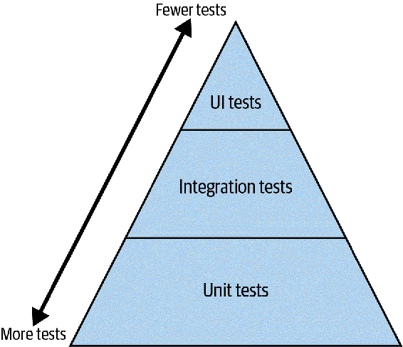
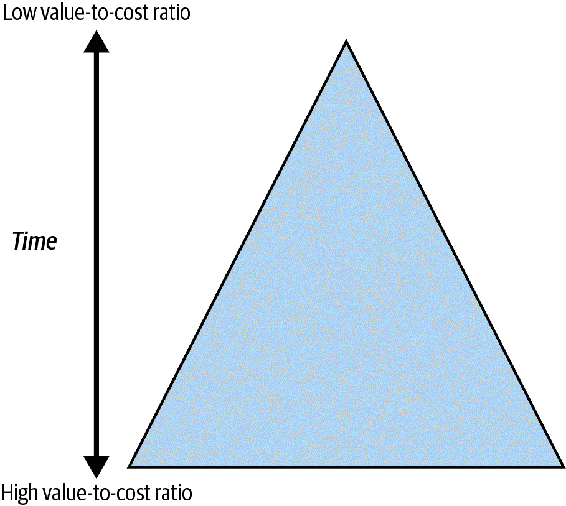

# 第二十一章：测试策略

测试是你可以在代码库周围建立的最重要的安全网之一。改变后，看到所有测试通过是非常令人欣慰的。然而，评估测试的最佳时间使用是具有挑战性的。测试过多会成为负担；你会花更多时间维护测试而非交付功能。测试过少会让潜在的灾难进入生产环境。

在本章中，我将请你专注于你的测试策略。我将分解不同类型的测试以及如何选择要编写的测试。我将关注 Python 在测试构建方面的最佳实践，然后我会结束一些特定于 Python 的常见测试策略。

# 定义你的测试策略

在你编写测试之前，你应该决定你的 *测试策略* 将是什么。测试策略是在测试软件以减少风险方面花费时间和精力的计划。这种策略将影响你编写什么类型的测试，如何编写它们以及你花费多少时间编写（和维护）它们。每个人的测试策略都会有所不同，但它们都会有类似的形式：关于你的系统及其如何计划回答这些问题的问题列表。例如，如果我正在编写一个卡路里计数应用程序，这将是我的测试策略的一部分：

```py
Does my system function as expected?
Tests to write (automated - run daily):
    Acceptance tests: Adding calories to the daily count
    Acceptance tests: Resetting calories on daily boundaries
    Acceptance tests: Aggregating calories over a time period
    Unit tests: Corner Cases
    Unit tests: Happy Path

Will this application be usable by a large user base?
Tests to write (automated - run weekly):
    Interoperability tests: Phones (Apple, Android, etc.)
    Interoperability tests: Tablets
    Interoperability tests: Smart Fridge

Is it hard to use maliciously?
Tests to write: (ongoing audit by security engineer)
    Security tests: Device Interactions
    Security tests: Network Interactions
    Security tests: Backend Vulnerability Scanning (automated)

... etc. ...
```

###### 提示

不要将你的测试策略视为一次创建并永不修改的静态文档。在开发软件时，继续提问并讨论是否需要根据学到的知识进化你的策略。

这种测试策略将决定你在编写测试时的关注点。当你开始填写它时，你首先需要了解什么是测试以及为什么要编写它们。

## 什么是测试？

你应该理解为什么和为什么编写软件。回答这些问题将为编写测试确定目标。测试是验证代码执行 *what* 的一种方式，你编写测试是为了不会负面影响 *why*。软件产生价值。这就是全部。每个软件都有一定的附加值。Web 应用为广大人群提供重要服务。数据科学管道可能创建预测模型，帮助我们更好地理解世界中的模式。即使是恶意软件也有价值；执行攻击的人使用软件来实现目标（即使对受影响者有负面价值）。

这就是软件提供的*内容*，但是为什么要写软件呢？大多数人会说“钱”，我不想否认这一点，但也有其他原因。有时候软件是为了赚钱而写的，有时候是为了自我实现，有时候是为了广告（比如为开源项目做贡献以增强简历）。测试为这些系统提供了验证。它们远不止于捕捉错误或者让你在发布产品时有信心。

如果我为学习目的编写一些代码，那么我的*为什么*纯粹是为了自我实现，价值来自我学到了多少。如果我做错了事情，那也是一个学习机会；如果所有测试只是项目结束时的手工抽查，我也可以应付。然而，市场上为其他开发者提供工具的公司可能有完全不同的策略。这些公司的开发人员可能选择编写测试，以确保他们没有退化任何功能，从而避免公司失去客户（这会转化为利润损失）。每个项目都需要不同层次的测试。

所以，测试是什么？它是用来捕捉错误的东西吗？它是让你有信心发布产品的东西吗？是的，但真正的答案还要深入一些。测试回答了关于你的系统的问题。我希望你思考一下你写的软件。它的目的是什么？关于你构建的东西，你希望永远知道什么？对你重要的东西构成了你的测试策略。  

当你问自己问题时，你真正在问自己的是哪些测试对你有价值：

+   我的应用程序能处理预测的负载吗？

+   我的代码是否满足客户的需求？

+   我的应用程序安全吗？

+   当客户向我的系统输入不良数据时会发生什么？

每一个问题都指向你可能需要编写的不同类型的测试。查看表 21-1，列出了常见问题和相应的测试类型。

表 21-1\. 测试类型及其所回答的问题

| 测试类型 | 测试回答的问题 |
| --- | --- |
| 单元 | 单元（函数和类）是否如开发人员期望的那样工作？ |
| 集成 | 系统的各个部分是否正确地拼接在一起？ |
| 验收 | 系统是否符合最终用户的期望？ |
| 负载 | 系统在重压下是否保持操作能力？ |
| 安全性 | 系统是否能抵御特定的攻击和利用？ |
| 可用性 | 系统是否直观易用？ |

注意，表 21-1 没有提到确保软件没有 bug。正如 Edsger Djikstra 所说，“程序测试可以用来显示 bug 的存在，但永远不能证明其不存在！”¹ 测试回答了关于你的软件*质量*的问题。

*质量* 是一个模糊的、难以定义的术语，经常被人提及。这是一个难以把握的东西，但我更喜欢 Gerald Weinberg 的这句话：“质量是对某个人的价值。”² 我喜欢这句话多么开放式；你需要考虑到任何可能从你的系统中获得价值的人。不仅仅是你的直接客户，还有你客户的客户，你的运维团队，你的销售团队，你的同事等等。

一旦确定了谁从你的系统中获得价值，你需要在出现问题时衡量影响。对于每个未运行的测试，你失去了了解你是否正在交付价值的机会。如果未能交付该价值会有什么影响？对于核心业务需求，影响是相当大的。对于不在最终用户关键路径之外的功能，影响可能较小。了解你的影响，并将其与测试成本进行权衡。如果影响的成本高于测试的成本，写测试。如果低于测试成本，跳过编写测试，花时间做更有影响力的事情。

### 测试金字塔

几乎在任何测试书籍中，你都会碰到类似于 图 21-1 的图：一个“测试金字塔”。³



###### 图 21-1\. 测试金字塔

这个想法是你想要编写大量小型、孤立的单元测试。理论上这些测试成本较低，应该占据你测试的大部分，因此它们位于底部。你有较少的集成测试，这些成本较高，甚至更少的 UI 测试，这些成本非常高。从诞生之时起，开发者们就在多种方式上辩论测试金字塔，包括画线的位置、单元测试的有效性，甚至三角形的形状（我甚至见过倒置的三角形）。

事实上，标签是什么或者你如何分隔你的测试并不重要。你想要的是你的三角形看起来像 图 21-2，它侧重于价值与成本的比率。



###### 图 21-2\. 着眼于价值与成本的测试金字塔

写大量价值与成本比高的测试。无论是单元测试还是验收测试都无所谓。找到方法经常运行它们。让测试快速运行，这样开发者在提交之间多次运行它们，验证事情仍然正常工作。把你的不那么有价值、较慢或者成本较高的测试保留用于每次提交时的测试（或至少定期测试）。

你拥有的测试越多，你就会有越少的未知数。你拥有的未知数越少，你的代码库就会更加健壮。每次你进行更改时，你都有一个更大的安全网来检查任何回归。但是，如果测试变得过于昂贵，远远超过任何影响的成本，该怎么办？如果你觉得这些测试仍然值得，你需要找到一种方式来降低它们的成本。

测试成本包括三个方面：编写的初始成本、运行的成本以及维护的成本。测试至少需要运行一段时间，这将耗费资金。然而，减少这些成本通常成为优化练习，您可以寻找并行化测试或在开发人员机器上更频繁地运行测试的方式。您仍然需要减少编写的初始成本和维护测试的持续成本。幸运的是，迄今为止您所阅读的每一本书都直接适用于减少这些成本。您的测试代码与您代码库的其余部分一样重要，您需要确保它同样强大。选择正确的工具，正确组织您的测试用例，并确保您的测试清晰易读且易于维护。

# 讨论话题

评估系统中测试的成本。编写时间、运行时间或维护时间哪个占主导地位？您可以采取什么措施来降低这些成本？

# 降低测试成本

当您对比测试成本与价值时，您正在收集将帮助您优先考虑测试策略的信息。有些测试可能不值得运行，而有些则会成为您希望首先编写以最大化价值的测试。然而，有时候您可能会遇到这样的情况：有一个非常重要的测试，您希望编写，但编写和/或维护成本非常高。在这种情况下，找到一种方法来降低该测试的成本。编写和组织测试的方式对于使测试更便宜、更易于理解至关重要。

## AAA 测试

与生产代码一样，专注于测试代码的可读性和可维护性。尽可能清晰地传达您的意图。如果测试读者能清楚地看到您试图测试的内容，他们会感谢您。在编写测试时，每个测试遵循相同的基本模式会有所帮助。

在测试中您将发现的最常见的模式之一是 3A 或 AAA 测试模式⁴。AAA 代表*Arrange-Act-Assert*。您将每个测试分为三个独立的代码块：一个用于设置预置条件（arrange），一个用于执行正在测试的操作（act），然后一个用于检查任何后置条件（assert）。您可能也会听说第四个 A，用于*annihilate*或清理代码。我将详细介绍每个步骤，讨论如何使您的测试更易于阅读和维护。

### 安排

*安排*步骤主要是设置系统处于准备测试的状态。这些被称为测试的*前置条件*。您设置任何依赖项或测试数据，以确保测试能够正确运行。

考虑以下测试：

```py
def test_calorie_calculation():

    # arrange (set up everything the test needs to run)
    add_ingredient_to_database("Ground Beef", calories_per_pound=1500)
    add_ingredient_to_database("Bacon", calories_per_pound=2400)
    add_ingredient_to_database("Cheese", calories_per_pound=1800)
    # ... snip 13 more ingredients

    set_ingredients("Bacon Cheeseburger w/ Fries",
                    ingredients=["Ground Beef", "Bacon" ... ])

    # act (the thing getting tested)
    calories = get_calories("Bacon Cheeseburger w/ Fries")

    # assert (verify some property about the program)
    assert calories == 1200

    #annihilate (cleanup any resources that were allocated)
    cleanup_database()
```

首先，我向数据库添加食材，并将食材列表与名为“培根奶酪汉堡配薯条”的菜肴关联。然后，我查找汉堡的卡路里数量，检查它与已知值是否一致，并清理数据库。

看看在我实际进入测试本身之前有多少代码（`get_calories` 调用）。庞大的*arrange*块是一个警告信号。你将会有很多看起来非常相似的测试，你希望读者能够一目了然地知道它们之间的区别。

###### 警告

大型的*arrange*块可能表示依赖关系的复杂设置。代码的任何使用者都可能需要以类似的方式设置这些依赖关系。退一步思考，问自己是否有更简单的方法来处理依赖关系，比如使用第 III 部分中描述的策略。

在前面的示例中，如果我必须在两个单独的测试中添加 15 种成分，但设置一个成分稍有不同以模拟替换，那么眼测这些测试的区别将会很困难。给这些测试起一个能够指示它们不同之处的详细名称是一个不错的方法，但这只能走得这么远。要在保持测试信息丰富与便于一目了然之间找到平衡点。

#### 一致的前提条件与变化的前提条件

查看你的测试并问问自己哪些前提条件在一组测试中是相同的。通过函数提取这些条件并在每个测试中重复使用该函数。看看比较以下两个测试变得多么容易：

```py
def test_calorie_calculation_bacon_cheeseburger():
    add_base_ingredients_to_database()
    add_ingredient_to_database("Bacon", calories_per_pound=2400)

    st /etup_bacon_cheeseburger(bacon="Bacon")
    calories = get_calories("Bacon Cheeseburger w/ Fries")

    assert calories == 1200

    cleanup_database()

def test_calorie_calculation_bacon_cheeseburger_with_substitution():
    add_base_ingredients_to_database()
    add_ingredient_to_database("Turkey Bacon", calories_per_pound=1700)

    setup_bacon_cheeseburger(bacon="Turkey Bacon")
    calories = get_calories("Bacon Cheeseburger w/ Fries")

    assert calories == 1100

    cleanup_database()
```

通过创建辅助函数（在本例中为 `add_base_ingredients_to_database` 和 `setup_bacon_cheeseburger`），你可以将所有不重要的测试样板代码减少，使开发人员能够专注于测试之间的差异。

#### 使用测试框架特性来处理样板代码

大多数测试框架都提供了一种在测试前自动运行代码的方法。在内置的 `unittest` 模块中，你可以编写一个 `setUp` 函数在每个测试前运行。在 `pytest` 中，你可以通过 fixture 实现类似的功能。

在 `pytest` 中，*fixture* 是指定测试初始化和清理代码的一种方式。Fixture 提供了许多有用的功能，如定义对其他 fixture 的依赖（让 `pytest` 控制初始化顺序）和控制初始化，以便每个模块只初始化一次 fixture。在前面的示例中，我们可以为 `test_database` 使用一个 fixture：

```py
import pytest

@pytest.fixture
def db_creation():
    # ... snip  set up local sqlite database
    return database

@pytest.fixture
def test_database(db_creation):
    # ... snip adding all ingredients and meals
    return database

def test_calorie_calculation_bacon_cheeseburger(test_database):
    test_database.add_ingredient("Bacon", calories_per_pound=2400)
    setup_bacon_cheeseburger(bacon="Bacon")

    calories = get_calories("Bacon Cheeseburger w/ Fries")

    assert calories == 1200

    test_database.cleanup()()
```

注意现在测试中有一个 `test_database` 参数。这就是 fixture 的工作原理；函数 `test_database`（以及 `db_creation`）会在测试之前调用。随着测试数量的增加，fixture 变得越来越有用。它们是可组合的，允许你将它们组合在一起，减少代码重复。通常情况下，我不会将它们用来抽象单个文件中的代码，但一旦初始化需要在多个文件中使用时，fixture 就是最佳选择。

#### 模拟

Python 提供了鸭子类型（首次在第二章提到）作为其类型系统的一部分，这意味着只要它们遵循相同的契约，你可以很容易地将类型替换为另一个类型（如在第十二章中讨论的那样）。这意味着你可以完全不同地处理复杂的依赖关系：使用一个简单的模拟对象代替。*mocked*对象是看起来与生产对象完全相同（方法和字段），但提供了简化的数据。

###### 提示

单元测试中经常使用模拟对象（Mocks），但随着测试变得不那么细粒度，它们的使用会减少。这是因为你尝试在更高层次测试系统的同时，你正在模拟的服务往往是测试的一部分。

例如，如果前面示例中的数据库设置非常复杂，有多个表和模式，可能不值得为每个测试设置，特别是如果测试共享一个数据库；你希望保持测试互相隔离。（稍后我将详细讨论这一点。）处理数据库的类可能如下所示：

```py
class DatabaseHandler:

    def __init__(self):
        # ... snip complex setup

    def add_ingredient(self, ingredient):
        # ... snip complex queries

    def get_calories_for_ingredient(self, ingredient):
        # ... snip complex queries
```

而不是直接使用这个类，创建一个看起来像数据库处理程序的模拟类：

```py
class MockDatabaseHandler
    def __init__(self):
        self.data = {
            "Ground Beef": 1500,
            "Bacon": 2400,
            # ... snip ...
        }

    def add_ingredient(self, ingredient):
        name, calories = ingredient
        self.data[name] = calories

    def get_calories_for_ingredient(self, ingredient):
        return self.data[ingredient]
```

对于模拟对象，我只是使用一个简单的字典来存储我的数据。如何模拟你的数据将因情况而异，但如果你能找到一种方法用模拟对象替换真实对象，你可以显著降低设置的复杂性。

###### 警告

有些人使用[*monkeypatching*](https://oreil.ly/xBFHl)，即在运行时替换方法以注入模拟对象。适度使用这种方法是可以接受的，但如果你发现你的测试中充斥着 monkeypatching，这是一种反模式。这意味着你的不同模块之间有过于严格的物理依赖，应该考虑找到方法使你的系统更加模块化。（请参阅第三部分了解更多关于使代码可扩展性的想法。）

### 消灭

技术上，*annihilate* 阶段是你在测试中做的最后一件事，但我却在第二次讨论它。为什么呢？因为它与你的*arrange*步骤密切相关。无论你在*arrange*中设置了什么，如果它可能影响其他测试，都需要拆除。

你希望你的测试互相隔离；这样会使它们更易于维护。对于测试自动化写作者来说，最大的噩梦之一就是测试失败取决于它们运行的顺序（尤其是如果你有成千上万个测试）。这是测试彼此之间存在微妙依赖的明确迹象。在离开之前清理你的测试，并减少测试相互交互的可能性。以下是一些处理测试清理的策略。

#### 不要使用共享资源

如果可以做到的话，测试之间不要共享任何东西。这并不总是可行的，但这应该是你的目标。如果没有测试共享任何资源，那么你就不需要清理任何东西。共享资源可以是 Python 中的（全局变量，类变量）或环境中的（数据库，文件访问，套接字池）。

#### 使用上下文管理器

使用上下文管理器（在第十一章讨论）确保资源始终被清理。在我的上一个示例中，眼尖的读者可能已经注意到了一个错误：

```py
def test_calorie_calculation_bacon_cheeseburger():
    add_base_ingredients_to_database()
    add_ingredient_to_database("Bacon", calories_per_pound=2400)
    setup_bacon_cheeseburger(bacon="Bacon")

    calories = get_calories("Bacon Cheeseburger w/ Fries")

    assert calories == 1200

    cleanup_database()
```

如果断言失败，则会引发异常，`cleanup_database`永远不会执行。更好的方法是通过上下文管理器强制使用：

```py
def test_calorie_calculation_bacon_cheeseburger():
    with construct_test_database() as db:
        db.add_ingredient("Bacon", calories_per_pound=2400)
        setup_bacon_cheeseburger(bacon="Bacon")

        calories = get_calories("Bacon Cheeseburger w/ Fries")

        assert calories == 1200
```

将清理代码放在上下文管理器中，这样你的测试编写者永远不必主动考虑它；它已经为他们完成了。

#### 使用夹具

如果你正在使用`pytest`夹具，你可以像使用上下文管理器一样使用它们。你可以从夹具*yield*值，允许你在测试完成后返回到夹具的执行。观察：

```py
import pytest

@pytest.fixture
def db_creation():
    # ... snip  set up local sqlite database
    return database

@pytest.fixture
def test_database(db_creation):
    # ... snip adding all ingredients and meals
    try:
        yield database
    finally:
        database.cleanup()

def test_calorie_calculation_bacon_cheeseburger(test_database):
    test_database.add_ingredient("Bacon", calories_per_pound=2400)
    setup_bacon_cheeseburger(bacon="Bacon")

    calories = get_calories("Bacon Cheeseburger w/ Fries")

    assert calories == 1200
```

注意现在`test_database`夹具如何产生数据库。当使用此函数的任何测试完成（无论是通过还是失败），数据库清理函数都将始终执行。

### 行动

*act*阶段是测试中最重要的部分。它体现了你要测试的实际操作。在前面的例子中，*act*阶段是获取特定菜品的卡路里。你不希望*act*阶段比一两行代码长。少即是多；通过保持此阶段小，可以减少读者理解测试的核心内容所需的时间。

有时，你希望在多个测试之间重复使用相同的*act*阶段。如果你发现自己想要编写相同的测试，但输入数据和断言略有不同，请考虑对测试*参数化*。测试*参数化*是一种在不同参数上运行相同测试的方法。这允许你编写*table-driven*测试，或以表格形式组织测试数据的方法。

这是使用参数化的`get_calories`测试：

```py
@pytest.mark.parametrize(
    "extra_ingredients,dish_name,expected_calories",
    [
        (["Bacon", 2400], "Bacon Cheeseburger", 900),
        ([],  "Cobb Salad", 1000),
        ([],  "Buffalo Wings", 800),
        ([],  "Garlicky Brussels Sprouts", 200),
        ([],  "Mashed Potatoes", 400)
    ]
)
def test_calorie_calculation_bacon_cheeseburger(extra_ingredients,
                                                dish_name,
                                                expected_calories,
                                                test_database):
    for ingredient in extra_ingredients:
        test_database.add_ingredient(ingredient)

    # assume this function can set up any dish
    # alternatively, dish ingredients could be passed in as a test parameter
    setup_dish_ingredients(dish_name)

    calories = get_calories(dish_name)

    assert calories == expected_calories
```

将参数定义为元组列表，每个测试用例一个。每个参数都作为参数传递给测试用例。`pytest`会自动对每组参数运行此测试。

参数化测试的好处是将许多测试用例压缩到一个函数中。测试的读者只需按照参数化表中列出的顺序查看表格，就可以理解预期的输入和输出是什么（科布沙拉应该有 1,000 卡路里，土豆泥应该有 400 卡路里，等等）。

###### 警告

参数化是将测试数据与实际测试分离的好方法（类似于分离策略和机制，如第十七章所讨论的）。但是要小心。如果你让你的测试过于通用，那么确定它们在测试什么就会更加困难。如果可以的话，避免使用三四个以上的参数。

### 断言

在清理之前要做的最后一步是*断言*关于系统的某个属性为真。最好，在你的测试末尾应该有一个逻辑断言。如果你发现自己在一个测试中塞入了太多断言，要么是你的测试中有太多动作，要么是太多测试匹配到了一个。当一个测试有太多责任时，维护者很难调试软件。如果他们进行了一个导致测试失败的更改，你希望他们能快速找出问题所在。理想情况下，他们可以根据测试名称找出问题，但至少他们应该能打开测试，看上去大约 20 或 30 秒，就能意识到出了什么问题。如果有多个断言，就有多个原因会导致测试失败，维护者需要花时间来梳理它们。

这并不意味着你只能有一个*assert*语句；只要它们都涉及测试相同的属性，有几个*assert*语句也是可以的。同样要使你的断言详细，这样开发人员在出错时能得到有用的信息。在 Python 中，你可以提供一个文本消息，随着`AssertionError`一起传递，以帮助调试。

```py
def test_calorie_calculation_bacon_cheeseburger(test_database):
    test_database.add_ingredient("Bacon", calories_per_pound=2400)
    setup_bacon_cheeseburger(bacon="Bacon")

    calories = get_calories("Bacon Cheeseburger w/ Fries")

    assert calories == 1200, "Incorrect calories for Bacon Cheeseburger w/ Fries"
```

`pytest`重新编写断言语句，这也提供了额外的调试消息级别。如果上述测试失败，返回给测试编写者的消息将是：

```py
E       AssertionError: Incorrect calories for Bacon Cheeseburger w/ Fries
E       assert 1100 == 1200
```

对于更复杂的断言，构建一个断言库可以非常轻松地定义新的测试。这就像在你的代码库中建立词汇表一样；你希望测试代码中有多样的概念可以共享。为此，我推荐使用[Hamcrest 匹配器](http://hamcrest.org)。⁵

*Hamcrest 匹配器*是一种编写断言，以类似自然语言的方式阅读的方法。[`PyHamcrest`](https://github.com/hamcrest/PyHamcrest)库提供了常见的匹配器，帮助你编写你的断言。看看它如何使用自定义断言匹配器来使测试更加清晰：

```py
from hamcrest import assert_that, matches_regexp, is_, empty, equal_to
def test_all_menu_items_are_alphanumeric():
    menu = create_menu()
    for item in menu:
        assert_that(item, matches_regexp(r'[a-zA-Z0-9 ]'))

def test_getting_calories():
    dish = "Bacon Cheeseburger w/ Fries"
    calories = get_calories(dish)
    assert_that(calories, is_(equal_to(1200)))

def test_no_restaurant_found_in_non_matching_areas():
    city = "Huntsville, AL"
    restaurants = find_owned_restaurants_in(city)
    assert_that(restaurants, is_(empty()))
```

`PyHamcrest`的真正强大之处在于你可以定义自己的匹配器。⁶

```py
from hamcrest.core.base_matcher import BaseMatcher
from hamcrest.core.helpers.hasmethod import hasmethod

def is_vegan(ingredient: str) -> bool:
    return ingredient not in ["Beef Burger"]

class IsVegan(BaseMatcher):

    def _matches(self, dish):
        if not hasmethod(dish, "ingredients"):
            return False
        return all(is_vegan(ingredient) for ingredient in dish.ingredients())

    def describe_to(self, description):
        description.append_text("Expected dish to be vegan")

    def describe_mismatch(self, dish, description):
        message = f"the following ingredients are not vegan: "
        message += ", ".join(ing for ing in dish.ingredients()
                             if not is_vegan(ing))
        description.append_text(message)

def vegan():
    return IsVegan()

from hamcrest import assert_that, is_
def test_vegan_substitution():
    dish = create_dish("Hamburger and Fries")
    dish.make_vegan()
    assert_that(dish, is_(vegan()))
```

如果测试失败，你会得到以下错误：

```py
    def test_vegan_substitution():
        dish = create_dish("Hamburger and Fries")
        dish.make_vegan()
>       assert_that(dish, is_(vegan()))
E       AssertionError:
E       Expected: Expected dish to be vegan
E            but: the following ingredients are not vegan: Beef Burger
```

# 讨论主题

在你的测试中，你可以在哪里使用自定义匹配器？讨论在你的测试中共享的测试词汇会是什么，以及自定义匹配器如何提高可读性。

# 总结思考

就像走钢丝的安全网一样，测试在你工作时给予你安全感和信心。这不仅仅是找到错误。测试验证你构建的东西是否按照你的期望执行。它们给未来的合作者提供了更多的自由去做更多风险的改变；他们知道如果他们失败，测试会捕捉到他们。你会发现回归变得更加少见，你的代码库变得更容易工作。

然而，测试并非免费。编写、运行和维护测试都是有成本的。你需要谨慎地安排你的时间和精力。使用构建测试的知名模式来最小化成本：遵循 AAA 模式，保持每个阶段简短，并确保你的测试清晰易读。你的测试和你的代码库一样重要。要同样尊重它们，并使其健壮。

在下一章中，我将专注于验收测试。验收测试有不同于单元测试或集成测试的目的，你使用的一些模式将不同。

你将学习到验收测试如何引发对话，以及如何确保你的代码库为客户正确执行任务。它们是交付价值的代码库中的宝贵工具。

¹ Edsger W. Dijkstra。“关于结构化编程的注释。”荷兰，埃因霍温科技大学，数学系，1970 年。[*https://oreil.ly/NAhWf*](https://oreil.ly/NAhWf)。

² Gerald M. Weinberg。《优质软件管理》。第 1 卷：《系统思维》。纽约，纽约：Dorset House Publishing，1992 年。

³ 这被称为测试金字塔，在迈克·科恩（Mike Cohn）的《成功实现敏捷》（Addison-Wesley Professional）中首次提出。Cohn 最初使用“Service”级别测试代替集成测试，但我看到更多的迭代使用“integration”测试作为中间层。

⁴ AAA 模式最早由 Bill Wake 在 2001 年命名。查看[这篇博文](https://oreil.ly/gdU4T)了解更多信息。

⁵ Hamcrest 是“matchers”的字母重排。

⁶ 查看[PyHamcrest 文档](https://oreil.ly/XWjOd)了解更多信息，如额外的匹配器或与测试框架的集成。
