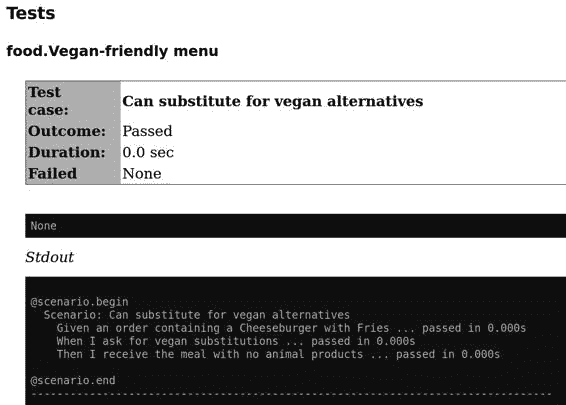

# 第二十二章. 验收测试

作为开发者，很容易专注于直接涉及你代码库的测试：单元测试、集成测试、UI 测试等等。这些测试验证代码是否按照你的意图执行，是保持代码库无回归问题的宝贵工具。然而，它们完全是用来构建客户期望的*错误*工具。

开发人员在编写这些测试时对代码了如指掌，这意味着测试结果偏向于开发者的期望。尽管如此，不能保证这些测试覆盖的行为确实符合*客户*的需求。

考虑以下单元测试：

```py
def test_chili_has_correct_ingredients():
    assert make_chili().ingredients() == [
        "Ground Beef",
        "Chile Blend",
        "Onion",
        ...
        "Tomatoes",
        "Pinto Beans"
    ]
```

这个测试可能是无懈可击的；它能通过并捕捉代码中的任何回归。然而，当呈现给客户时，你可能会遇到：“不，我想要德州风味的辣椒！你知道的，没有番茄或豆子？” 即使世界上所有的单元测试也无法阻止你构建错误的东西。

这就是验收测试的用武之地。*验收测试*检查你是否正在构建正确的产品。虽然单元测试和集成测试是一种*验证*形式，验收测试则是*确认*。它们验证你是否正在构建用户期望的东西。

在本章中，你将了解 Python 中的验收测试。我将向你展示使用 Gherkin 语言定义需求的`behave`框架，以全新的方式进行行为驱动开发。¹ 你将学习 BDD 作为澄清对话的工具。验收测试是构建安全网的重要组成部分；它将保护你免受构建错误东西的风险。

# 行为驱动开发

客户期望与软件行为之间的不匹配问题由来已久。这个问题源于将自然语言转换为编程语言。自然语言充满了歧义、不一致和细微差别。编程语言则是严格的。计算机会严格按照你告诉它的去执行（即使这不是你的本意）。更糟糕的是，这就像是一个电话游戏²，需求经过几个人（客户、销售、经理、测试人员）传递，最后才编写测试。

就像软件生命周期中的所有事情一样，这种错误案例越晚发现修复代价越高。理想情况下，你希望在制定用户需求时就发现这些问题。这就是行为驱动开发发挥作用的时候。

## Gherkin 语言

*行为驱动开发*，最初由[丹尼尔·特霍斯特-诺斯](https://oreil.ly/MnziJ)首创，是一种侧重于定义系统行为的实践。BDD 着重于澄清沟通；你与最终用户一起迭代需求，定义他们想要的行为。

在您编写任何代码之前，确保您已就要构建的正确内容达成一致。定义的行为集将*推动*您编写的代码。您与最终用户（或其代理人，如业务分析师或产品经理）合作，将您的需求定义为一种规范。这些规范遵循一种正式的语言，以在其定义中引入更多的严格性。指定需求的最常见语言之一是 Gherkin。

Gherkin 是一种遵循*Given-When-Then*（GWT）格式的规范。每个需求都组织如下：

```py
Feature: Name of test suite

  Scenario: A test case
    Given some precondition
    When I take some action
    Then I expect this result
```

例如，如果我想捕捉一个检查菜肴素食替代的需求，我会这样写：

```py
Feature: Vegan-friendly menu

  Scenario: Can substitute for vegan alternative
    Given an order containing a Cheeseburger with Fries
    When I ask for vegan substitutions
    Then I receive the meal with no animal products
```

另一个要求可能是某些菜品不能做成素食：

```py
  Scenario: Cannot substitute vegan alternatives for certain meals
    Given an order containing Meatloaf
    When I ask for vegan substitutions
    Then an error shows up stating the meal is not vegan substitutable
```

###### 注意

如果 GWT 格式感觉熟悉，那是因为它与您在第二十一章中学到的 AAA 测试组织完全相同。

通过与最终用户合作，以此方式编写您的需求，您将从以下几个关键原则中获益：

使用简单的语言编写

没有必要深入任何编程语言或正式逻辑。所有内容都以一种对业务人员和开发人员都能理解的形式编写。这使得非常容易抓住最终用户实际想要的东西。

建立共享词汇

随着需求数量的增加，您会发现多个需求中开始有相同的条款（如上所示，使用`When I ask for vegan substitutions`）。这会建立起您的领域语言，并使所有相关方更容易理解需求。

需求是可测试的

这可能是这种需求格式的最大好处。因为您正在以 GWT 方式编写需求，所以您在本章中使用的辣椒示例作为 Gherkin 测试的指定方式：

```py
  Scenario: Texas-Style Chili
    Given a Chili-Making Machine
    When a Chili is dispensed
    Then that dish does not contain beans
    And that dish does not contain tomatoes
```

清楚地表明了需要编写哪些测试作为验收测试。如果 Gherkin 测试存在任何歧义，您可以与最终用户合作，找出一个具体的测试应该是什么样子。这也可以帮助解决传统上模糊的需求，例如，“辣椒制作机应该快速。”相反，通过专注于具体的测试，您最终得到像这样的测试：

```py
Scenario: Chili order takes less than two minutes
Given a Chili-Making Machine
When a Chili is ordered
Then the Chili is dispensed to the customer within two minutes
```

###### 警告

这些需求规格并非消除需求中错误的灵丹妙药，而是一种缓解策略。如果在编写代码之前让技术和业务人员审查它们，您将更有可能发现歧义或意图不匹配。

一旦您开始用 Gherkin 定义您的测试，您可以做一些令人惊讶的事情：您可以使您的规格*可执行*。

## 可执行规格

*可执行规范*直接将一组需求转换为代码。这意味着您的需求不仅是可测试的，而且也是*测试*。当需求变化时，您的测试也会同时变化。这是*可追溯性*的最终形式，或者连接您的需求到具体测试或代码的能力。

# 讨论话题

您的组织如何跟踪需求？如何将这些需求追溯到测试用例？如何处理需求变更？讨论如果您的需求和测试是相同的东西，您的流程会如何变化。

Python 模块[`behave`](https://oreil.ly/VywJX)允许您用具体的测试支持您的 Gherkin 需求。它通过将函数与需求中的特定条款关联起来来实现这一点。

###### 提示

默认情况下，`behave`期望您的 Gherkin 文件在名为*features*的文件夹中，并且您的 Python 函数（称为步骤）在名为*features/steps*的文件夹中。

让我们来看看我在本章前面展示的第一个 Gherkin 需求：

```py
Feature: Vegan-friendly menu

  Scenario: Can substitute for vegan alternative
    Given an order containing a Cheeseburger with Fries
    When I ask for vegan substitutions
    Then I receive the meal with no animal products
```

使用`behave`，我可以编写与每个 GWT 语句相对应的 Python 代码：

```py
from behave import given, when, then

@given("an order containing a Cheeseburger with Fries")
def setup_order(ctx):
    ctx.dish = CheeseburgerWithFries()

@when("I ask for vegan substitutions")
def substitute_vegan(ctx):
    ctx.dish.substitute_vegan_ingredients()

@then("I receive the meal with no animal products")
def check_all_vegan(ctx):
    assert all(is_vegan(ing) for ing in ctx.dish.ingredients())
```

每个步骤表示为与 Gherkin 需求条款匹配的装饰器。装饰的函数是作为规范的一部分执行的。在上面的示例中，Gherkin 需求将由以下代码表示（您无需编写此代码；Gherkin 为您完成）：

```py
from behave.runner import Context
context = Context()
setup_order(context)
substitute_vegan(context)
check_all_vegan(context)
```

要运行此操作，请先安装`behave`：

```py
pip install behave
```

然后，在包含您的需求和步骤的文件夹上运行`behave`：

```py
behave code_examples/chapter22/features
```

您将看到以下输出：

```py
Feature: Vegan-friendly menu

  Scenario: Can substitute for vegan alternatives
    Given an order containing a Cheeseburger with Fries
    When I ask for vegan substitutions
    Then I receive the meal with no animal products

1 feature passed, 0 failed, 0 skipped
1 scenario passed, 0 failed, 0 skipped
3 steps passed, 0 failed, 0 skipped, 0 undefined
Took 0m0.000s
```

当此代码在终端或 IDE 中运行时，所有步骤显示为绿色。如果任何步骤失败，该步骤将变为红色，并显示失败的详细信息。

现在，您可以直接将您的需求与验收测试联系起来。如果最终用户改变主意，他们可以编写新的测试。如果 GWT 条款已经存在于新测试中，那是一个胜利；新测试可以在没有开发人员帮助的情况下编写。如果条款尚不存在，那也是一个胜利，因为当测试立即失败时，它会引发一场对话。您的最终用户和业务人员不需要 Python 知识即可理解您正在测试的内容。

使用 Gherkin 规范来推动关于需要构建的软件的对话。`behave`允许您直接将验收测试与这些需求联系起来，它们作为聚焦对话的一种方式。使用 BDD 防止您直接开始编写错误的内容。正如流行的说法所说：“几周的编码将节省您几小时的计划。”³

# 额外的 behave 特性

前面的示例有些基本，但幸运的是，`behave`提供了一些额外的功能，使测试编写更加简便。

## 参数化步骤

你可能已经注意到，我有两个非常相似的`Given`步骤：

```py
Given an order containing a Cheeseburger with Fries
```

和

```py
Given an order containing Meatloaf
```

在 Python 中编写两个类似的函数将是愚蠢的。`behave` 允许您参数化步骤，以减少编写多个步骤的需要。

```py
@given("an order containing {dish_name}")
def setup_order(ctx, dish_name):
    if dish_name == "a Cheeseburger with Fries":
        ctx.dish = CheeseburgerWithFries()
    elif dish_name == "Meatloaf":
        ctx.dish = Meatloaf()
```

或者，如果需要的话，您可以在函数上堆叠从句：

```py
@given("an order containing a Cheeseburger with Fries")
@given("a typical drive-thru order")
def setup_order(context):
    ctx.dish = CheeseBurgerWithFries()
```

参数化和重用步骤将帮助您构建直观易用的词汇表，从而减少编写 Gherkin 测试的成本。

## 表驱动需求

在 第二十一章 中，我提到您可以参数化测试，以便在表中定义所有的前置条件和断言。`behave` 提供了非常相似的功能：

```py
Feature: Vegan-friendly menu

Scenario Outline: Vegan Substitutions
  Given an order containing <dish_name>,
  When I ask for vegan substitutions
  Then <result>

 Examples: Vegan Substitutable
   | dish_name                  | result |
   | a Cheeseburger with Fries  | I receive the meal with no animal products  |
   | Cobb Salad                 | I receive the meal with no animal products  |
   | French Fries               | I receive the meal with no animal products  |
   | Lemonade                   | I receive the meal with no animal products  |

 Examples: Not Vegan Substitutable
   | dish_name     | result |
   | Meatloaf      | a non-vegan-substitutable error shows up |
   | Meatballs     | a non-vegan-substitutable error shows up |
   | Fried Shrimp  | a non-vegan-substitutable error shows up |
```

`behave` 将自动为每个表项运行一个测试。这是在非常相似的数据上运行相同测试的绝佳方式。

## 步骤匹配

有时，基本的装饰器不足以捕获您尝试表达的内容。您可以告诉 `behave` 在装饰器中使用正则表达式解析。这对于使 Gherkin 规范编写起来更加自然（特别是在处理复杂数据格式或奇怪的语法问题时）非常有用。这里有一个示例，允许您在菜名前面加上可选的“a”或“an”（以简化菜名）。

```py
from behave import use_context_matcher

use_step_matcher("re")

@given("an order containing [a |an ]?(?P<dish_name>.*)")
def setup_order(ctx, dish_name):
    ctx.dish = create_dish(dish_name)
```

## 定制测试生命周期

有时候您需要在测试运行之前或之后运行代码。比如，在所有规范设置之前需要设置数据库，或者告诉服务在测试运行之间清除其缓存。就像内置的 `unittest` 模块中的 `setUp` 和 `tearDown` 一样，`behave` 提供了让您在步骤、特性或整个测试运行之前或之后挂接函数的功能。使用这个功能可以整合通用的设置代码。为了充分利用这个功能，您可以在名为 *environment.py* 的文件中定义具体命名的函数。

```py
def before_all(ctx):
    ctx.database = setup_database()

def before_feature(ctx, feature):
    ctx.database.empty_tables()

def after_all(ctx):
    ctx.database.cleanup()
```

查看 [`behave` documentation](https://oreil.ly/NjEtf) 以获取有关控制环境的更多信息。如果您更喜欢 `pytest` 的 fixture，请查看 `behave` 的 [fixtures](https://oreil.ly/6ZZA4)，它们具有非常相似的思想。

###### 小贴士

`before_feature` 和 `before_scenario` 这样的函数会将相应的特性或场景传递给它们。您可以根据这些特性和场景的名称来执行特定的动作，以处理测试的特定部分。

## 使用标签选择性运行测试

`behave` 还提供了标记某些测试的能力，这些标记可以是任何您想要的：`@wip` 用于正在进行的工作，`@slow` 用于运行缓慢的测试，`@smoke` 用于选择性运行的少数测试等。

要在 `behave` 中标记测试，只需装饰您的 Gherkin 场景：

```py
Feature: Vegan-friendly Menu

  @smoke
  @wip
  Scenario: Can substitute for vegan alternatives
    Given an order containing a Cheeseburger with Fries
    When I ask for vegan substitutions
    Then I receive the meal with no animal products
```

要仅运行带有特定标签的测试，可以在 `behave` 调用时传递 `--tags` 标志：

```py
behave code_examples/chapter22 --tags=smoke
```

###### 小贴士

如果您想要排除运行某些测试，可以在标签前加一个连字符，就像在这个例子中，我排除了带有 `wip` 标签的测试：

`behave code_examples/chapter22 --tags=-wip`

## 报告生成

如果你不涉及最终用户或其代理，使用`behave`和 BDD 进行验收测试将毫无意义。找到让他们易于理解和使用 Gherkin 需求的方法。

你可以通过调用`behave --steps-catalog`获取所有步骤定义的列表。

当然，你还需要一种方法来展示测试结果，让最终用户了解什么在运行，什么不在运行。`behave`允许你以多种不同的方式格式化输出（你也可以定义自己的格式）。开箱即用，还可以从[JUnit](https://junit.org/junit5)创建报告，JUnit 是为 Java 语言设计的单元测试框架。JUnit 将其测试结果写成 XML 文件，并构建了许多工具来接收和可视化测试结果。

要生成 JUnit 测试报告，你可以在`behave`调用中传递`--junit`。然后，你可以使用[`junit2html`](https://github.com/inorton/junit2html)工具为所有测试用例生成报告：

```py
pip install junit2html
behave code_examples/chapter22/features/ --junit
# xml files are in the reports folder
junit2html <filename>
```

示例输出显示在图 22-1 中。



###### 图 22-1\. 使用`junit2html`的示例`behave`报告

有很多 JUnit 报告生成器，所以找一个你喜欢的并使用它生成你的测试结果的 HTML 报告。

# 结语

如果所有的测试都通过了，但未提供最终用户想要的内容，则浪费了时间和精力。构建正确的东西是昂贵的；你希望第一次就做对。使用 BDD 来推动关于系统需求的关键对话。一旦有了需求，使用`behave`和 Gherkin 语言编写验收测试。这些验收测试成为确保你提供最终用户所需内容的安全网。

在下一章中，你将继续学习如何修补你的安全网中的漏洞。你将了解使用名为`Hypothesis`的 Python 工具进行基于属性的测试。它可以为你生成测试用例，包括你可能从未想过的测试。你可以更放心地知道，你的测试覆盖范围比以往任何时候都要广泛。

¹ Gherkin 语言由 Aslak Hellesøy 创建。他的妻子建议他的 BDD 测试工具命名为黄瓜（显然没有具体原因），他希望将规范语言与测试工具本身区分开来。由于黄瓜是一种小型的腌制黄瓜，他延续了这个主题，于是 Gherkin 规范语言诞生了。

² 电话是一个游戏，每个人坐在一个圈子里，一个人对另一个人耳语一条消息。消息继续在圈子里传递，直到回到原点。每个人都会因为消息被扭曲而发笑。

³ 虽然这句话的作者是匿名的，但我最先看到它是在[Programming Wisdom Twitter 账号](https://oreil.ly/rKsVj)上。
