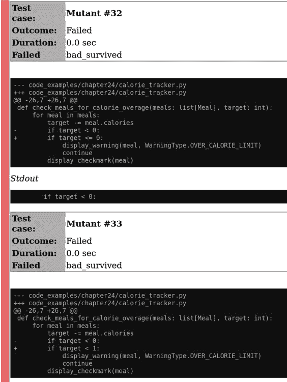

# 第二十四章 突变测试

当你编织静态分析和测试的安全网时，你如何知道你是否尽可能多地进行了测试？测试绝对所有内容是不可能的；你需要在编写测试时聪明地选择。设想每个测试都是安全网中的一根单独的绳索：你拥有的测试越多，你的网越宽。然而，这并不意味着你的安全网就一定构建得很好。一张由破旧、脆弱绳索编织的安全网比没有安全网更糟糕；它会产生安全的错觉，并提供虚假的信心。

目标是加强你的安全网，使其不易破损。你需要一种方式确保当代码中存在 bug 时，你的测试确实能失败。在本章中，你将学习如何通过突变测试来做到这一点。你将学习如何使用一个名为 `mutmut` 的 Python 工具进行突变测试。你将使用突变测试来检查你的测试与代码之间的关系。最后，你将了解代码覆盖工具，如何最佳地使用这些工具，以及如何将 `mutmut` 与你的覆盖报告集成。学习如何进行突变测试将为你提供一种衡量你的测试有效性的方法。

# 什么是突变测试？

*突变测试* 是有意在源代码中引入 bug 的操作。¹ 你每次以这种方式进行的更改称为 *突变体*。然后你运行你的测试套件。如果测试失败，那是好消息；你的测试成功消除了突变体。但是，如果你的测试通过了，这意味着你的测试不够强大，无法捕获合法的失败；突变体存活了下来。突变测试是一种 *元测试* 形式，因为你在测试你的测试有多好。毕竟，你的测试代码应该是代码库中的一等公民；它也需要一定程度的测试。

考虑一个简单的卡路里追踪应用程序。用户可以输入一系列餐食，并在超出他们每日卡路里预算时收到通知。核心功能由以下函数实现：

```py
def check_meals_for_calorie_overage(meals: list[Meal], target: int):
    for meal in meals:
        target -= meal.calories
        if target < 0:
            display_warning(meal, WarningType.OVER_CALORIE_LIMIT)
            continue
        display_checkmark(meal)
```

这里是一组针对此功能的测试，全部通过了：

```py
def test_no_warnings_if_under_calories():
    meals = [Meal("Fish 'n' Chips", 1000)]
    check_meals_for_calorie_overage(meals, 1200)
    assert_no_warnings_displayed_on_meal("Fish 'n' Chips")
    assert_checkmark_on_meal("Fish 'n' Chips")

def test_no_exception_thrown_if_no_meals():
    check_meals_for_calorie_overage([], 1200)
    # no explicit assert, just checking for no exceptions

def test_meal_is_marked_as_over_calories():
    meals = [Meal("Fish 'n' Chips", 1000)]
    check_meals_for_calorie_overage(meals, 900)
    assert_meal_is_over_calories("Fish 'n' Chips")

def test_meal_going_over_calories_does_not_conflict_with_previous_meals():
    meals = [Meal("Fish 'n' Chips", 1000), Meal("Banana Split", 400)]
    check_meals_for_calorie_overage(meals, 1200)
    assert_no_warnings_displayed_on_meal("Fish 'n' Chips")
    assert_checkmark_on_meal("Fish 'n' Chips")
    assert_meal_is_over_calories("Banana Split")
```

这是一个思维练习，我希望你能审视这些测试（暂且不论这是关于突变测试的一章），并问问自己如果在生产环境中发现这些测试，你的观点会是什么。你对它们的正确性有多大信心？你确信我没有漏掉任何东西吗？你相信这些测试能在代码变更时捕获错误吗？

本书的核心主题是软件将会不断变化。你需要让你未来的合作者能够轻松地维护你的代码库，尽管这些变化。你需要编写不仅可以捕获你所写内容中的错误，还能捕获其他开发者在修改你的代码时产生的错误的测试。

无论未来的开发人员是重构方法以使用常用库，更改单个行还是向代码添加更多功能，您希望您的测试都能捕捉到他们引入的任何错误。要进入变异测试的思维方式，您需要考虑可能对代码进行的所有更改，并检查您的测试是否能捕捉到任何错误的变化。表 24-1 逐行分解上述代码，并显示如果缺少该行，则测试的结果。

表 24-1。删除每一行的影响

| 代码行 | 删除后的影响 |
| --- | --- |
| `for meal in meals:` | 测试失败：语法错误，代码不执行循环 |
| `target -= meal.calories` | 测试失败：从未显示任何警告 |
| `if target < 0` | 测试失败：所有餐点显示警告 |
| `display_warning(meal, WarningType.OVER_CALO⁠RIE_LIMIT)` | 测试失败：未显示任何警告 |
| `continue` | 测试通过 |
| `display_checkmark(meal)` | 测试失败：餐点上没有显示勾号 |

查看表 24-1 中`continue`语句所在的行。如果删除该行，则所有测试都通过。这意味着发生了三种情况之一：该行不需要；该行是需要的，但不重要到需要进行测试；或者我们的测试套件中存在覆盖不足。

前两种情况很容易处理。如果不需要该行，请删除它。如果该行不重要到需要进行测试（这在诸如调试日志语句或版本字符串等情况下很常见），则可以忽略对此行的变异测试。但是，如果第三种情况属实，则意味着测试覆盖率不足。你发现了安全网中的一个漏洞。

如果从算法中删除`continue`，则在超过卡路里限制的任何餐点上将显示一个勾号和一个警告。这不是理想的行为；这是一个信号，表明我应该有一个测试来覆盖这种情况。如果我只是添加一个断言，即带有警告的餐点也没有勾号，那么我们的测试套件就会捕捉到这个变异。

删除行只是变异的一个示例。我可以对上述代码应用许多其他的变异。事实上，如果我将`continue`改为`break`，测试仍然通过。浏览我可以想到的每个变异是件令人厌烦的事情，所以我希望有一个自动化工具来为我完成这个过程。进入`mutmut`。

# 使用 mutmut 进行变异测试

[`mutmut`](https://pypi.org/project/mutmut)是一个 Python 工具，用于为您进行变异测试。它附带了一组预编程的变异，可以应用于您的代码库，例如：

+   查找整数字面量并将其加 1 以捕捉偏移一个错误

+   通过在字符串字面量中插入文本来更改字符串字面量

+   交换`break`和`continue`

+   交换`True`和`False`

+   否定表达式，例如将`x is None`转换为`x is not None`

+   更改运算符（特别是从`/`到`//`）

这绝不是一个全面的列表；`mutmut`有很多巧妙的方式来变异你的代码。它通过进行离散变异，运行你的测试套件，然后显示哪些变异在测试过程中存活下来。

要开始使用，您需要安装`mutmut`：

```py
pip install mutmut
```

然后，你运行`mutmut`对所有测试进行测试（警告，这可能需要一些时间）。你可以使用以下命令在我上面的代码片段上运行`mutmut`：

```py
mutmut run --paths-to-mutate code_examples/chapter24
```

###### 提示

对于长时间运行的测试和大型代码库，你可能需要将`mutmut`运行分开，因为它确实需要一些时间。然而，`mutmut`足够智能，可以将其进度保存到名为*.mutmut-cache*的文件夹中，因此如果中途退出，未来的运行将从相同的点继续执行。

`mutmut`在运行时会显示一些统计信息，包括存活的变异数量、被消除的变异数量以及哪些测试耗时过长（例如意外引入无限循环）。

执行完成后，你可以使用`mutmut results`查看结果。在我的代码片段中，`mutmut`识别出三个存活的变异。它将变异列为数字 ID，你可以使用`mutmut show <id>`命令显示具体的变异。

这是我代码片段中存活的三个变异：

```py
mutmut show 32
--- code_examples/chapter24/calorie_tracker.py
+++ code_examples/chapter24/calorie_tracker.py
@@ -26,7 +26,7 @@
 def check_meals_for_calorie_overage(meals: list[Meal], target: int):
     for meal in meals:
         target -= meal.calories
-        if target < 0:
+        if target <= 0:
             display_warning(meal, WarningType.OVER_CALORIE_LIMIT)
             continue
         display_checkmark(meal)

mutmut show 33
--- code_examples/chapter24/calorie_tracker.py
+++ code_examples/chapter24/calorie_tracker.py
@@ -26,7 +26,7 @@
 def check_meals_for_calorie_overage(meals: list[Meal], target: int):
     for meal in meals:
         target -= meal.calories
-        if target < 0:
+        if target < 1:
             display_warning(meal, WarningType.OVER_CALORIE_LIMIT)
             continue
         display_checkmark(meal)

mutmut show 34
--- code_examples/chapter24/calorie_tracker.py
+++ code_examples/chapter24/calorie_tracker.py
@@ -28,6 +28,6 @@
         target -= meal.calories
         if target < 0:
             display_warning(meal, WarningType.OVER_CALORIE_LIMIT)
-            continue
+            break
         display_checkmark(meal)
```

在每个示例中，`mutmut`以*差异符号*显示结果，这是一种表示文件从一个变更集到另一个变更集变化的方法。在这种情况下，任何以减号“-”开头的行表示由`mutmut`更改的行；以加号“+”开头的行是`mutmut`进行的更改；这些就是你的变异。

这些情况中的每一个都是我测试中的潜在漏洞。通过将`<=`更改为`<`，我发现我没有覆盖当餐点的卡路里恰好等于目标时的情况。通过将`0`更改为`1`，我发现我在输入域的边界上没有覆盖（参见第二十三章讨论的边界值分析）。通过将`continue`更改为`break`，我提前终止循环，可能会错过标记后续餐点为 OK 的机会。

## 修复变异

一旦确定了变异，开始修复它们。最好的方法之一是将变异应用到你磁盘上的文件中。在我之前的示例中，我的变异有 32、33 和 34。我可以这样将它们应用到我的代码库中：

```py
mutmut apply 32
mutmut apply 33
mutmut apply 34
```

###### 警告

只对通过版本控制备份的文件执行此操作。这使得完成后还原变异变得容易，恢复原始代码。

一旦   一旦变异已应用到磁盘上，你的目标是编写一个失败的测试。例如，我可以编写以下代码：

```py
def test_failing_mutmut():
    clear_warnings()
    meals = [Meal("Fish 'n' Chips", 1000),
             Meal("Late-Night Cookies", 300),
             Meal("Banana Split", 400)
             Meal("Tub of Cookie Dough", 1000)]

    check_meals_for_calorie_overage(meals, 1300)

    assert_no_warnings_displayed_on_meal("Fish 'n' Chips")
    assert_checkmark_on_meal("Fish 'n' Chips")
    assert_no_warnings_displayed_on_meal("Late-Night Cookies")
    assert_checkmark_on_meal("Late-Night Cookies")
    assert_meal_is_over_calories("Banana Split")
    assert_meal_is_over_calories("Tub of Cookie Dough")
```

即使你只应用了一个变异，你也应该看到这个测试失败。一旦你确信已经捕获了所有变异，就还原变异，并确保测试现在通过。重新运行`mutmut`，应该显示你已消除变异。

## 变异测试报告

`mutmut` 还提供了一种将其结果导出为 JUnit 报告格式的方法。在本书中已经看到其他工具导出为 JUnit 报告（例如第二十二章），`mutmut` 也不例外：

```py
mutmut junitxml > /tmp/test.xml
```

正如第二十二章中提到的那样，我可以使用 `junit2html` 为变异测试生成一个漂亮的 HTML 报告，如图 24-1 所示。



###### Figure 24-1\. 用 `junit2html` 生成的 `mutmut` 报告示例

# 采用突变测试

突变测试在今天的软件开发社区中并不普遍。我认为原因有三：

+   人们对它及其带来的好处并不了解。

+   一个代码库的测试还不够成熟，以至于无法进行有用的突变测试。

+   成本与价值比例太高。

本书正在积极努力改进第一个观点，但第二和第三观点确实有其道理。

如果您的代码库没有成熟的测试集，那么引入突变测试将毫无意义。这将导致信号与噪声比过高。与其试图找到所有的突变体，不如通过改进测试套件来获得更多价值。考虑在代码库中那些已经具有成熟测试套件的较小部分上运行突变测试。

突变测试确实成本高；为了使突变测试值得进行，必须最大化收益。由于多次运行测试套件，突变测试非常缓慢。将突变测试引入现有代码库也很痛苦。从一开始就在全新代码上进行远比较轻松。

但是，由于您正在阅读一本关于提高潜在复杂代码库健壮性的书，很可能您正在处理现有的代码库。如果您想引入突变测试，还是有希望的。与提高健壮性的任何方法一样，关键是选择性地在需要进行突变测试的地方进行。

寻找有大量 bug 的代码区域。查阅 bug 报告并找出表明某个代码区域有问题的趋势。还要考虑找出代码变动频繁的区域，因为这些区域最有可能引入当前测试尚未完全覆盖的变更。² 找到突变测试将多倍回报成本的代码区域。您可以使用 `mutmut` 选择性地在这些区域上运行突变测试。

此外，`mutmut` 还提供了一种只对具有*行覆盖率*的代码库进行突变测试的选项。如果一行代码至少被任何测试执行过一次，则该行代码具有测试套件*覆盖率*。还存在其他覆盖类型，如 API 覆盖率和分支覆盖率，但`mutmut`专注于行覆盖率。`mutmut`只会为您实际上已经有测试的代码生成突变体。

要生成覆盖率，请首先安装 `coverage`：

```py
pip install coverage
```

然后使用`coverage`命令运行你的测试套件。例如，我运行：

```py
coverage run -m pytest code_examples/chapter24
```

接下来，你只需在你的`mutmut`运行中传递`--use-coverage`标志：

```py
mutmut run --paths-to-mutate code_examples/chapter24 --use-coverage
```

有了这个，`mutmut`将忽略任何未经测试的代码，大大减少了噪音量。

## 覆盖率的谬论（及其他度量标准）

每当有一种衡量代码的方法出现时，都会急于将该衡量作为一个*指标*或目标，作为商业价值的代理预测器。然而，在软件开发历史上，出现了许多不明智的度量标准，其中没有比使用编写的代码行数作为项目进展指标更臭名昭著的了。这种想法认为，如果你能直接测量任何一个人编写的代码量，你就能直接衡量该人的生产力。不幸的是，这导致开发人员操纵系统，并试图故意编写冗长的代码。这种指标反而适得其反，因为系统变得复杂且臃肿，开发由于维护性差而放缓。

作为一个行业，我们已经超越了衡量代码行数（希望如此）。然而，一个指标消失之处，另外两个指标便会顶替其位置。我见过其他受到责难的指标出现，如修复的错误数量或编写的测试数量。表面上，这些都是应该做的好事情，但问题在于，当它们作为与商业价值相关联的指标被审视时。在每个指标中都有操纵数据的方法。你是否因为修复的错误数量而受到评判？那么，首先只需写更多的错误！

不幸的是，代码覆盖率在近年来也陷入了同样的陷阱。你会听到诸如“这段代码应该 100%覆盖每一行”或“我们应该争取 90%的分支覆盖率”的目标。这在孤立情况下值得赞扬，但未能预测商业价值。它忽略了首先为什么你要设定这些目标的*原因*。

代码覆盖率预示着健壮性的缺失，而非许多人所认为的质量。覆盖率低的代码可能会或可能不会做你需要的每件事；你无法可靠地知道。这表明你在修改代码时会遇到挑战，因为你的系统中没有任何安全网围绕该部分建立。你绝对应该寻找覆盖率非常低的区域，并改善其周围的测试情况。

相反，这导致许多人认为高覆盖率预示着健壮性，但实际上并非如此。你可以测试每一行和每一个分支，但仍然可能维护性糟糕。测试可能会变得脆弱甚至彻底无用。

我曾在一个开始采用单元测试的代码库中工作过。我遇到了一个类似以下内容的文件：

```py
def test_foo_can_do_something():
    foo = Thingamajiggy()
    foo.doSomething()
    assert foo is not None

def test_foo_parameterized_still_does_the_right_thing():
    foo = Thingamajiggy(y=12)
    foo.doSomethingElse(15)
    assert foo is not None
```

大约有 30 个这样的测试，所有的测试都有良好的名称，并遵循 AAA 模式（如在第二十一章中所见）。但它们实际上是完全无用的：它们只是确保没有抛出异常。最糟糕的是，这些测试实际上具有 100%的行覆盖率和接近 80%的分支覆盖率。这些测试检查没有抛出异常并不是件坏事；坏的是，它们实际上没有测试实际的函数，尽管表面上看起来不是这样。

变异测试是防止关于代码覆盖的错误假设的最佳防御。当你衡量你的测试的有效性时，编写无用、无意义的测试变得更加困难，同时还要消除突变体。变异测试将覆盖率测量提升为更真实的健壮性预测器。覆盖率指标仍然不能完美地代表业务价值，但变异测试确实使它们作为健壮性指标更有价值。

###### 警告

随着变异测试变得越来越流行，我完全预料到，“消除突变体的数量”将成为取代“100%代码覆盖率”的新流行度量标准。虽然你确实希望更少的突变体存活，但要注意任何脱离上下文的单一指标目标；这个数字可以像其他所有指标一样被操控。你仍然需要一个完整的测试策略来确保代码库的健壮性。

# 总结思考

变异测试可能不会是你首选的工具。然而，它是你测试策略的完美补充；它找出你安全网中的漏洞并引起你的注意。通过像`mutmut`这样的自动化工具，你可以利用现有的测试套件轻松进行变异测试。变异测试帮助你提高测试套件的健壮性，进而帮助你编写更加健壮的代码。

这是本书的第四部分的结尾。你从学习静态分析开始，它以低成本提供早期反馈。然后你了解了测试策略以及如何问自己你希望你的测试回答什么样的问题。从那里，你学习了三种具体的测试类型：验收测试、基于属性的测试和变异测试。所有这些都是增强你现有测试策略的方式，为你的代码库建立更密集、更强大的安全网。有了强大的安全网，你将为未来的开发人员提供信心和灵活性，让他们按需发展你的系统。

这也标志着整本书的结束。这是一个漫长的旅程，你在这条路上学到了各种技巧、工具和方法。你深入研究了 Python 的类型系统，学会了如何编写自己的类型以及如何编写可扩展的 Python 代码。本书的每一部分都为你提供了构建块，将帮助你的代码库经受住时间的考验。

虽然这是书的结尾，但这并非关于 Python 鲁棒性终结的故事。我们这个相对年轻的行业仍在不断演变和转型，随着软件不断“吞噬世界”，复杂系统的健康性和可维护性变得至关重要。我预计我们对软件理解的方式将持续变化，并出现新的工具和技术来构建更好的系统。

永远不要停止学习。Python 将继续发展，添加功能并提供新工具。每一个功能都有可能改变你编写代码的方式。我无法预测 Python 或其生态系统的未来。随着 Python 引入新功能，问问自己这个功能表达了什么意图。如果他们看到了这个新功能，代码读者会假设什么？如果没有使用这个功能，他们会假设什么？了解开发者如何与你的代码库交互，并与他们产生共鸣，以创建开发愉悦的系统。

此外，将本书中的每一个观点都经过批判性思考。问问自己：提供了什么价值，以及实施它需要什么代价？我不希望读者把本书的建议完全当作箴言，并用它作为强迫代码库遵循“书中说要用”的标准的工具（任何在 90 年代或 00 年代工作过的开发者可能还记得“设计模式热”，你走 10 步都会碰到一个`AbstractInterfaceFactorySingleton`）。本书中的每一个概念都应被视为工具箱中的一种工具；我希望你已经学到了足够的背景知识，能够在使用它们时做出正确的决策。

最重要的是，记住你是一个在复杂系统上工作的人类，而其他人也将与你一起或在你之后继续工作。每个人都有他们自己的动机、目标和梦想。每个人都会面对自己的挑战和困难。错误会发生。我们永远无法完全消除所有错误。相反，我希望你看待这些错误，并通过从中学习推动我们的领域向前发展。我希望你能帮助未来建立在你工作基础上。尽管软件开发中存在各种变化、歧义、截止日期和范围扩展的困难，以及所有问题，我希望你能站在你的工作背后并说：“我为构建这个系统感到自豪。这是一个好系统。”

感谢你抽出时间阅读本书。现在，继续前进，编写经得起时间考验的精彩代码吧。

¹ 突变测试最初由理查德·A·德米洛（Richard A. DeMillo）、理查德·J·利普顿（Richard J. Lipton）和弗雷德·G·塞沃德（Fred G. Sayward）在“测试数据选择提示：为实践程序员提供帮助”（*IEEE Computer*，11(4): 34–41，1978 年 4 月）中于 1971 年首次提出。首个实现于 1980 年由蒂姆·A·布德（Tim A. Budd）完成，详见“程序测试数据的突变分析”，耶鲁大学博士论文，1980 年。

² 通过统计具有最高提交次数的文件，您可以找到代码更新频繁的代码。我在快速谷歌搜索后找到了以下 Git 一行命令：`git rev-list --objects --all | awk '$2' | sort -k2 | uniq -cf1 | sort -rn | head`。这是由 `sehe` 在[这个 Stack Overflow 问题](https://oreil.ly/39UTx)中提供的。
