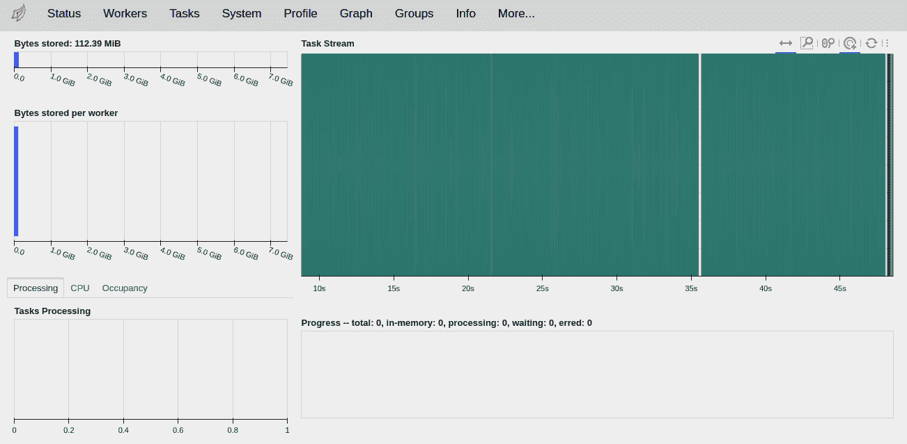
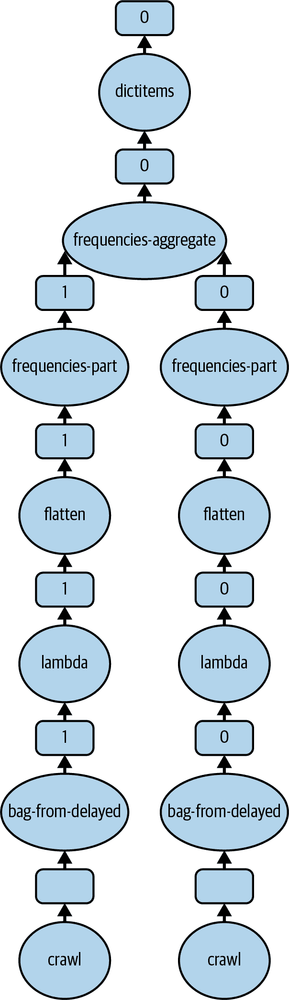

# 第三章：Dask 的工作原理：基础知识

现在您已经使用 Dask 运行了您的前几个任务，是时候了解一下幕后发生的事情了。根据您是在本地使用 Dask 还是分布式使用，行为可能会有所不同。虽然 Dask 很好地抽象了在多线程或多服务器上运行的许多细节，但深入了解 Dask 的工作原理将帮助您更好地决定何时以及如何使用它。

要熟悉 Dask，您需要了解：

+   Dask 能够运行的部署框架，以及其优势和劣势

+   Dask 能够读取的数据类型，以及如何在 Dask 中与这些数据类型进行交互

+   Dask 的计算模式，以及如何将您的想法转化为 Dask 代码

+   如何监控和排查故障

在本章中，我们将介绍每一个概念，并在本书的其余部分进行扩展。

# 执行后端

Dask 有许多不同的执行后端，但我们发现最容易将它们归为两组：本地和分布式。使用本地后端，您的规模受限于单台计算机所能处理的范围。本地后端还具有诸如避免网络开销、更简单的库管理和更低的成本等优势。¹ Dask 的分布式后端有多种部署选项，从 Kubernetes 等集群管理器到作业队列式系统。

## 本地后端

Dask 的三个本地后端是单进程、多线程和多进程。单进程后端没有并行性，主要用于验证问题是否由并发引起。多线程和多进程后端适合数据规模较小或复制成本高于计算时间的问题。

###### 提示

如果未配置特定的本地后端，Dask 将根据您正在使用的库选择后端。

本地多线程调度器能够避免需要序列化数据和进程间通信成本。多线程后端适用于大部分计算发生在 Python 之外的本地代码的任务。这对于许多数值库（如 pandas 和 NumPy）是适用的。如果您的情况也是如此，您可以配置 Dask 使用多线程，如 示例 3-1 所示。

##### 示例 3-1\. 配置 Dask 使用多线程

```py
dask.config.set(scheduler='threads')
```

本地多进程后端，如 示例 3-2 所示，与多线程相比有一些额外的开销，尽管在 Unix 和类 Unix 系统上可以减少这些开销。² 多进程后端通过启动单独的进程来避免 Python 的全局解释器锁。启动新进程比启动新线程更昂贵，而且 Dask 需要序列化在进程之间传输的数据。³

##### 示例 3-2\. 配置 Dask 使用多进程后端

```py
dask.config.set(scheduler='processes')
```

如果您在运行 Unix 系统上，可以使用 *forkserver*，如 示例 3-3，这将[减少每个 Python 解释器启动的开销](https://oreil.ly/U9voe)。使用 forkserver 不会减少通信开销。

##### 示例 3-3\. 配置 Dask 使用多进程 forkserver

```py
dask.config.set({"multiprocessing.context": "forkserver",
                "scheduler": "processes"})
```

此优化通常不适用于 Windows。

Dask 的本地后端旨在提高性能，而不是测试您的代码是否能在分布式调度器上运行。要测试您的代码能否远程运行，应该使用带有 LocalCluster 的 Dask 分布式调度器。

## 分布式（Dask 客户端和调度器）

虽然 Dask 在本地可以很好地工作，但其真正的力量来自于分布式调度器，您可以将问题扩展到多台计算机上。由于物理和财务限制限制了可以放入一台机器的计算能力、存储和内存的量，因此使用多台计算机通常是最具成本效益的解决方案（有时甚至是唯一的解决方案）。分布式计算并非没有缺点；正如 Leslie Lamport 所说，“一个分布式系统是指你甚至都不知道存在的计算机的故障可能使你自己的计算机无法使用。”虽然 Dask 在减少这些故障方面做了很多工作（参见 “容错性”），但是在转向分布式系统时，您需要接受一些复杂性增加。

Dask 有一个分布式调度器后端，它可以与许多不同类型的集群进行通信，包括 LocalCluster。每种类型的集群都在其自己的库中得到支持，这些库安排了调度器⁴，而 Dask 客户端则连接到这些调度器。使用分布式抽象 `dask.distributed` 可以使您在任何时候都可以在不同类型的集群之间移植，包括本地集群。如果您不使用 `dask.distributed`，Dask 也可以在本地计算机上运行得很好，此时您将使用 Dask 库提供的默认单机调度器。

Dask 客户端是您进入 Dask 分布式调度器的入口。在本章中，我们将使用 Dask 与 Kubernetes 集群；如果您有其他类型的集群或需要详细信息，请参见 第十二章。

### 自动扩展

使用自动扩展，Dask 可以根据您要求运行的任务增加或减少使用的计算机/资源⁵。例如，如果您有一个程序，使用许多计算机计算复杂的聚合，但后续大部分操作在聚合数据上进行，则在聚合后，您需要的计算机数量可能会大幅减少。许多工作负载，包括机器学习，不需要在整个时间段内使用相同数量的资源/计算机。

Dask 的某些集群后端，包括 Kubernetes，支持自动缩放，Dask 称之为*自适应部署*。自动缩放主要在共享集群资源或在云提供商上运行时有用，后者的底层资源是按小时计费的情况下使用。

### Dask 客户端的重要限制

Dask 的客户端不具备容错性，因此，虽然 Dask 能够处理其工作节点的故障，但如果客户端与调度器之间的连接中断，您的应用程序将会失败。对此的一个常见解决方法是在与调度器相同的环境中调度客户端，尽管这样做会在某种程度上降低将客户端和调度器作为独立组件的实用性。

### 分布式集群中的库和依赖项

Dask 之所以如此强大的一部分原因是它所在的 Python 生态系统。虽然 Dask 将我们的代码 pickle 或序列化（请参阅“序列化和 Pickling”），并将其发送到工作节点，但这并不包括我们使用的库。⁶ 要利用该生态系统，您需要能够使用其他库。在探索阶段，常常会在运行时安装包，因为您发现需要它们。

`PipInstall` 工作节点插件接受一个包列表，并在所有工作节点上在运行时安装它们。回顾 Example 2-4，要安装 bs4，您将调用 `distributed.diagnostics.plugin.PipInstall(["bs4"])`。然后由 Dask 启动的任何新工作节点都需要等待包被安装。`PipInstall` 插件非常适合在您发现需要哪些包时进行快速原型设计。您可以将 `PipInstall` 视为在笔记本中使用 `!pip install` 的虚拟环境替代方案。

为避免每次启动新工作节点时都需要安装软件包的缓慢性能，您应尝试预先安装您的库。每个集群管理器（例如，YARN、Kubernetes、Coiled、Saturn 等）都有自己的方法来管理依赖关系。这可以在运行时或设置时进行，其中包已经被预先安装。关于不同集群管理器的具体细节，请参阅第十二章。

例如，在 Kubernetes 中，默认启动脚本会检查某些关键环境变量的存在（`EXTRA_APT_PACKAGES`、`EXTRA_CONDA_PACKAGES` 和 `EXTRA_PIP_PACKAGES`），结合自定义的工作节点规范，可以在运行时添加依赖项。其中一些，例如 Coiled 和 Kubernetes，允许在为工作节点构建映像时添加依赖项。另一些，例如 YARN，使用预先分配的 conda/virtual 环境包装。

###### 警告

在所有工作节点和客户端上安装相同版本的 Python 和库非常重要。不同版本的库可能会导致彻底失败或更微妙的数据正确性问题。

# Dask 的诊断用户界面

在理解程序执行的第一步应该是使用 Dask 的诊断 UI。该 UI 允许您查看 Dask 正在执行的操作，工作线程/进程/计算机的数量，内存利用信息等等。如果您在本地运行 Dask，则很可能会在*http:​//localhost:8787*找到该 UI。

如果你正在使用 Dask 客户端连接到集群，UI 将运行在调度器节点上。你可以从`client.dashboard_link`获取仪表板的链接。

###### 提示

对于远程笔记本用户，调度器节点的主机名可能无法直接从您的计算机访问。一种选择是使用 Jupyter 代理；例如，可以访问`http://jupyter.example.com/user/username/proxy/dask-head-4c81d51e-3.jhub:8787/status`来访问端点`dask-head-4c81d51e-3.jhub:8787/status`。

图 3-1 显示了本章示例中运行时的 Dask UI。



###### 图 3-1\. Dask UI ([数字，彩色版本](https://oreil.ly/PuWRN))

该 UI 允许您查看 Dask 的执行情况以及存储在工作节点上的内容，并探索执行图。我们将在“visualize”中重新访问执行图。

# 序列化和 Pickling

分布式和并行系统依赖于序列化，在 Python 中有时称为*pickling*，用于在进程之间共享数据和函数/代码。Dask 使用各种序列化技术来匹配使用情况，并提供扩展钩子以在默认情况不满足需求时进行扩展。

###### 警告

我们在序列化失败（出现错误）时往往会考虑得更多，但同样重要的是可能会出现序列化了比实际需要更多数据的情况，或者数据量如此之大以至于分布式处理不再具备优势。

Cloudpickle 序列化了 Dask 中的函数和通用 Python 类型。大多数 Python 代码不依赖于序列化函数，但集群计算经常需要。Cloudpickle 是一个专为集群计算设计的项目，能够序列化和反序列化比 Python 内置的 pickle 更多的函数。

###### 警告

Dask 具有自己扩展序列化的能力，但是注册方法并不会自动发送到工作节点，并且并非总是使用。⁷

Dask 为 NumPy 数组、稀疏数组和 cuPY 构建了内置特殊处理。这些序列化通常比默认的序列化器更节省空间。当您创建一个包含这些类型且不需要任何特殊初始化的类时，应从`dask.distributed.protocol`中调用`register_generic(YourClass)`以利用 Dask 的特殊处理能力。

如果你有一个不能序列化的类，如示例 3-4，你可以对其进行包装以添加序列化函数，如示例 3-5 所示。

##### 示例 3-4\. Dask 无法序列化

```py
class ConnectionClass:
    def __init__(self, host, port):
        import socket
        self.socket = socket.socket(socket.AF_INET, socket.SOCK_STREAM)
        self.socket.connect((host, port))

@dask.delayed
def bad_fun(x):
    return ConnectionClass("www.scalingpythonml.com", 80)

# Fails to serialize
if False:
    dask.compute(bad_fun(1))
```

##### 示例 3-5\. 自定义序列化

```py
class SerConnectionClass:
    def __init__(self, conn):
        import socket
        self.conn = conn

    def __getstate__(self):
        state_dict = {
            "host": self.conn.socket.getpeername()[0],
            "port": self.conn.socket.getpeername()[1]}
        return state_dict

    def __setsate__(self, state):
        self.conn = ConnectionClass(state["host"], state["port"])
```

如果您控制原始类，还可以直接添加 `getstate`/`setstate` 方法而不是包装它。

###### 注意

Dask 自动尝试压缩序列化数据，通常会提高性能。您可以通过将 `distributed.comm.compression` 设置为 `None` 来禁用此功能。

# 分区/分块集合

分区使您能够控制用于处理数据的任务数量。如果有数十亿行数据，使用每行一个任务将意味着您花费更多时间在任务调度上而非实际工作本身。了解分区是能够最有效地使用 Dask 的关键。

Dask 在其各个集合中为分区使用略有不同的术语。在 Dask 中，分区影响数据在集群上的位置，而对于您的问题来说，选择合适的分区方式可以显著提高性能。分区有几个不同的方面，如每个分区的大小、分区的数量以及可选的属性，如分区键和排序与否。

分区的数量和大小密切相关，并影响最大并行性能。分区太小或数量过多会导致 Dask 在调度任务而非运行任务时花费更多时间。分区大小的一般最佳范围约为 100 MB 到 1 GB，但如果每个元素的计算非常昂贵，较小的分区大小可能会表现更好。

理想情况下，分区大小应该相似，以避免出现滞后情况。分区大小不同的情况称为 *skewed*。导致数据不平衡的原因有很多，从输入文件大小到键的偏斜（当有键时）。当数据过于不平衡时，您需要重新分区数据。

###### 提示

Dask UI 是查看是否可能有滞后任务的好地方。

## Dask 数组

Dask 数组的分区被称为 *chunks*，表示元素的数量。尽管 Dask 总是知道分区的数量，但当您应用过滤器或加载数据时，Dask 不知道每个分区的大小。索引或切片 Dask 数组需要 Dask 知道分区大小，以便找到包含所需元素的分区。根据创建 Dask 数组的方式，Dask 可能知道每个分区的大小，也可能不知道。我们在第五章中会更详细地讨论这个问题。如果要索引一个 Dask 数组，而 Dask 不知道分区大小，您需要先在数组上调用 `compute_chunk_sizes()`。当从本地集合创建 Dask 数组时，可以指定目标分区大小，如示例 3-6 所示。

##### 示例 3-6\. 自定义数组分块大小

```py
distributed_array = da.from_array(list(range(0, 10000)), chunks=10)
```

分区/分块不一定是静态的，`rechunk` 函数允许您更改 Dask 数组的分块大小。

## Dask Bags

Dask bags 的分区称为 *partitions*。与 Dask 数组不同，由于 Dask bags 不支持索引，因此 Dask 不跟踪每个分区中的元素数量。当使用 `scatter` 时，Dask 将尝试尽可能地分区数据，但后续的迭代可能会改变每个分区中的元素数量。与 Dask 数组类似，从本地集合创建时，可以指定 bag 的分区数量，只是参数称为 `npartitions` 而不是 `chunks`。

您可以通过调用 `repartition` 来更改 bag 中的分区数量，可以指定 `npartitions`（用于固定数量的分区）或 `partition_size`（用于每个分区的目标大小）。指定 `partition_size` 更昂贵，因为 Dask 需要进行额外的计算来确定匹配的分区数量。

当数据具有索引或数据可以通过值进行查找时，可以将数据视为键控。虽然 bags 实现了像 `groupBy` 这样的键控操作，其中具有相同键的值被合并，但其分区并不考虑键，而是总是在所有分区上执行键控操作。⁸

## Dask DataFrames

DataFrames 在分区方面拥有最多的选项。DataFrames 可以具有不同大小的分区，以及已知或未知的分区方式。对于未知的分区方式，数据是分布式的，但 Dask 无法确定哪个分区持有特定的键。未知的分区方式经常发生，因为任何可能改变键值的操作都会导致未知的分区方式。DataFrame 上的 `known_divisions` 属性允许您查看 Dask 是否知道分区方式，而 `index` 属性显示了使用的拆分和列。

如果 DataFrame 拥有正确的分区方式，则像 `groupBy` 这样的操作，通常涉及大量节点间通信，可以通过较少的通信来执行。通过 ID 访问行需要 DataFrame 在该键上进行分区。如果要更改 DataFrame 分区的列，可以调用 `set_index` 来更改索引。像所有的重新分区操作一样，设置索引涉及在工作节点之间复制数据，称为 *shuffle*。

###### 小贴士

对于数据集来说，“正确”的分区器取决于数据本身以及您的操作。

## Shuffles

Shuffling 指的是在不同的工作节点之间转移数据以重新分区数据。Shuffling 可能是显式操作的结果，例如调用 `repartition`，也可能是隐式操作的结果，例如按键分组数据或执行聚合操作。Shuffle 操作往往比较昂贵，因此尽量减少其需要的频率，并减少其移动的数据量是很有用的。

理解洗牌的最直接的情况是当您明确要求 Dask 重新分区数据时。在这些情况下，您通常会看到多对多的工作器通信，大多数数据需要在网络上传输。这自然比能够在本地处理数据的情况更昂贵，因为网络比 RAM 慢得多。

触发洗牌的另一个重要方式是通过隐式地进行缩减/聚合。在这种情况下，如果可以在移动数据之前应用部分缩减或聚合，Dask 就能够在网络上传输更少的数据，从而实现更快的洗牌。

###### 提示

有时您会看到事物被称为 *map-side* 和 *reduce-side*；这只是洗牌之前和之后的意思。

我们将在接下来的两章中更深入地探讨如何最小化洗牌的影响，介绍聚合。

## 载入期间的分区

到目前为止，您已经看到如何在从本地集合创建时控制分区，以及如何更改现有分布式集合的分区。从延迟任务创建集合时，分区通常是 1:1 的，每个延迟任务都是自己的分区。当从文件加载数据时，分区变得有些复杂，涉及文件布局和压缩。一般来说，查看已加载数据的分区的做法是调用 bags 的`npartitions`、数组的`chunks`或 DataFrames 的`index`。

# 任务、图和延迟评估

任务是 Dask 用于实现`dask.delayed`、futures 和 Dask 集合上的操作的构建块。每个任务代表了 Dask 无法再进一步分解的一小部分计算。任务通常是细粒度的，计算结果时 Dask 会尝试将多个任务组合成单个执行。

## 惰性评估

大多数 Dask 是惰性评估的，除了 Dask futures。惰性评估将组合计算的责任从您转移到调度程序。这意味着 Dask 将在合适时合并多个函数调用。不仅如此，如果只需要结构的一些部分，Dask 有时能够通过仅评估相关部分（如`head`或`tail`调用）进行优化。实现惰性评估需要 Dask 构建一个任务图。这个任务图也被用于容错。

与大多数 Dask 不同，futures 是急切地评估的，这限制了在将它们链接在一起时可用的优化，因为调度程序在开始执行第一个 future 时对世界的视图不够完整。Futures 仍然创建任务图，您可以通过在下一节中可视化它们来验证这一点。

与 Dask 的其余部分不同，未来值是急切评估的，这限制了在将它们链接在一起时可用的优化，因为调度程序在执行第一个未来时对世界的视图不完整。未来仍然创建任务图，您可以通过可视化它们来验证，正如我们将在下一节中看到的那样。

## 任务依赖

除了嵌套任务外，如 “嵌套任务” 中所见，您还可以将 `dask.delayed` 对象作为另一个延迟计算的输入（参见 示例 3-7），Dask 的 `submit`/`compute` 函数将为您构建任务图。

##### 示例 3-7\. 任务依赖

```py
@dask.delayed()
def string_magic(x, y):
    lower_x = x.lower()
    lower_y = y.lower()
    return (lower_x in lower_y) or (lower_y in lower_x)

@dask.delayed()
def gen(x):
    return x

f = gen("hello world")
compute = string_magic(f, f)
```

现在，当您计算最终组合值时，Dask 将使用其隐式任务图计算所有其他需要的最终函数值。

###### 注意

您不需要传递真实值。例如，如果一个函数更新数据库，而您希望在此之后运行另一个函数，即使您实际上不需要其 Python 返回值，也可以将其用作参数。

通过将延迟对象传递到其他延迟函数调用中，您允许 Dask 重用任务图中的共享节点，从而可能减少网络开销。

## visualize

在学习任务图和未来调试时，可视化任务图是一个优秀的工具。`visualize` 函数在 Dask 库和所有 Dask 对象中都有定义。与在多个对象上单独调用 `.visualize` 不同，您应该调用 `dask.visualize` 并传递您计划计算的对象列表，以查看 Dask 如何组合任务图。

你应该立即通过可视化示例 2-6 至 2-9 来尝试这个。当你在 `words_bag​.fre⁠quen⁠cies()` 上调用 `dask.visualize` 时，你应该得到类似 图 3-2 的结果。



###### 图 3-2\. 可视化的单词计数任务图（重新绘制输出）

###### 提示

Dask UI 还显示任务图的可视化表示，无需修改您的代码。

## 中间任务结果

一旦依赖任务开始执行，中间任务结果通常会立即被删除。当我们需要对相同数据执行多个计算时，这可能不够优化。解决这个问题的一个方法是将所有执行组合到一个对 `dask.compute` 的调用中，以便 Dask 可以根据需要保留数据。在交互式案例中，这种方法会失败，因为我们事先不知道计算是什么，也会在迭代案例中出现类似的问题。在这些情况下，某种形式的缓存或持久性可能是有益的。您将在本章后面学习如何应用缓存。

## 任务大小

Dask 使用集中式调度器，这是许多系统的常见技术。但这也意味着，尽管一般任务调度的开销只有 1 毫秒，但随着系统中任务数量的增加，调度器可能会成为瓶颈，开销也会增加。令人反直觉的是，这意味着随着我们系统的扩展，我们可能会从更大、更粗粒度的任务中受益。

## 当任务图变得太大

有时任务图本身可能对 Dask 处理过多。这个问题可能表现为客户端或调度器上的内存不足异常，或者更常见的是随迭代变慢的作业。最常见的情况是递归算法。一个常见的示例是分布式交替最小二乘法。

遇到任务图过大的情况时的第一步是看看是否可以通过使用更大的工作块或切换算法来减少并行性。例如，如果我们考虑使用递归计算斐波那契数列，更好的选择是使用动态规划或记忆化解决方案，而不是尝试使用 Dask 分发计算任务。

如果你有一个迭代算法，并且没有更好的方法来实现你想要的效果，可以通过定期写入中间结果并重新加载来帮助 Dask。¹⁰ 这样一来，Dask 就不必跟踪创建数据的所有步骤，而只需记住数据的位置。接下来的两章将讨论如何有效地为这些及其他目的编写和加载数据。

###### 提示

在 Spark 中，等价的概念被称为 *checkpointing*。

## 结合计算

要充分利用 Dask 的图优化，最重要的是以较大的批次提交你的工作。首先，当你在 `dask.compute` 中阻塞在结果上时，小批次会限制并行性。如果有一个共享的父节点——比如说，同一数据上的两个结果——一起提交计算允许 Dask 共享底层数据的计算。你可以通过在任务列表上调用 `visualize` 来验证 Dask 能否共享一个公共节点（例如，如果你将示例 2-8 和 2-9 一起可视化，你将在 Figure 3-2 中看到共享节点）。

有时你不能一起提交计算，但你仍然知道你想要重用一些数据。在这些情况下，你应该探索持久化。

## 持久化、缓存和记忆化

持久化允许你在集群中将指定的 Dask 集合保留在内存中。要为将来重用持久化一个集合，只需在集合上调用`dask.persist`。如果选择持久化，你需要负责告诉 Dask 何时完成对分布式集合的使用。与 Spark 不同，Dask 没有简单的`unpersist`等效方法；相反，你需要释放每个分区的底层 future，就像在示例 3-8 中所示。

##### 示例 3-8. 使用 Dask 进行手动持久化和内存管理

```py
df.persist
# You do a bunch of things on DF

# I'm done!
from distributed.client import futures_of
list(map(lambda x: x.release(), futures_of(df)))
```

###### 警告

常见的错误是持久化和缓存那些仅被使用一次或计算成本低廉的东西。

Dask 的本地模式具有基于 cachey 的尽力缓存系统。由于这仅在本地模式下工作，我们不会深入讨论细节，但如果你在本地模式下运行，可以查看[本地缓存文档](https://oreil.ly/VFSVQ)。

###### 警告

当你尝试在分布式方式下使用 Dask 缓存时，Dask 不会引发错误；它只是不起作用。因此，在从本地迁移到分布式时，请确保检查 Dask 本地缓存的使用情况。

# 容错

在像 Dask 这样的分布式系统中，“容错性”通常指的是系统如何处理计算机、网络或程序故障。随着使用计算机数量的增加，容错性变得越来越重要。当你在单台计算机上使用 Dask 时，容错的概念就不那么重要，因为如果你的计算机失败了，就没有什么可恢复的了。然而，当你有数百台机器时，计算机故障的机率就会增加。Dask 的任务图用于提供其容错性。¹¹ 在分布式系统中有许多不同类型的故障，但幸运的是，其中许多可以以相同的方式处理。

当调度器失去与工作节点的连接时，Dask 会自动重试任务。这种重试是通过 Dask 用于惰性评估的计算图来实现的。

###### 警告

Dask 客户端对连接调度器的网络问题不具备容错能力。你可以采用的一种减轻技术是在与调度器相同的网络中运行你的客户端。

在分布式系统中，机器故障是生活中的一个事实。当一个工作节点失败时，Dask 会像处理网络故障一样重新尝试任何必要的任务。然而，Dask 无法从客户端代码的调度器失败中恢复。¹² 因此，在运行于共享环境时，高优先级运行客户端和调度器节点是非常重要的，以避免被抢占。

Dask 会自动重试由于软件失败而退出或崩溃的工作节点。从 Dask 的角度来看，工作节点退出和网络故障看起来是一样的。

IOError 和 OSError 异常是 Dask 将重试的唯二异常类。如果您的工作进程引发其中一个错误，异常将被 pickle 并传输到调度程序。然后 Dask 的调度程序会重试任务。如果您的代码遇到不应重试的 IOError（例如，网页不存在），您需要将其包装在另一个异常中，以防止 Dask 重新尝试它。

由于 Dask 重试失败的计算，因此在处理副作用或更改值时要小心。例如，如果您有一个 Dask transactions 的 bag，并且在 `map` 的一部分更新数据库，Dask 可能会多次重新执行该 bag 上的某些操作，导致数据库更新多次发生。如果我们考虑从 ATM 取款，就能看出这将导致一些不满意的客户和不正确的数据。相反，如果您需要改变小数据位，请将它们带回本地集合。

如果您的程序遇到其他异常，Dask 将把异常返回到您的主线程。¹³

# 结论

通过本章，您应该对 Dask 如何扩展您的 Python 代码有了很好的掌握。您现在应该了解分区的基础知识，为什么这很重要，任务大小以及 Dask 对容错的方法。这将有助于您决定何时应用 Dask，并在接下来的几章中深入研究 Dask 的集合库。在下一章中，我们将专注于 Dask 的 DataFrames，因为它们是 Dask 分布式集合中功能最全的。

¹ 除非您为云提供商工作并且计算机几乎是免费的。如果您确实为云提供商工作，请发送给我们云积分。

² 包括 OS X 和 Linux。

³ 这还涉及必须在驱动程序线程中有对象的第二个副本，然后在工作程序中使用。由于 Dask 对其集合进行分片，这通常不会像正常的多处理那样迅速扩展。

⁴ 快速连续说五次。

⁵ 就像许多现实世界的情况一样，增加 Dask 节点比减少更容易。

⁶ 自动挑选和运输库将非常困难，而且也很慢，尽管在某些情况下可以完成。

⁷ 参见 Dask 分布式 GitHub 问题 [5561](https://oreil.ly/DmFxp) 和 [2953](https://oreil.ly/RxzGS)。

⁸ 对于来自数据库的人来说，您可以将其视为 Spark 的 `groupBy` 的“全扫描”或“全洗牌”。

⁹ 当 Dask 可以优化评估时，这里的情况复杂，但请记住，任务是计算的基本单位，Dask 无法在任务内进一步分解计算。因此，从许多个体任务创建的 DataFrame，当您调用`head`时，是 Dask 优化的一个很好的候选对象；但对于创建大 DataFrame 的单个任务，Dask 无法内部“深入”分解。

¹⁰ 如果数据集足够小，您也可以进行收集和分散。

¹¹ 在 Spark 中使用的相同技术。

¹² 这在大多数类似系统中很常见。Spark 确实具有从头节点故障中恢复的有限能力，但有许多限制，且不经常使用。

¹³ 对于从 Spark 迁移的用户，此重试行为有所不同。Spark 会对大多数异常进行重试，而 Dask 仅在工作节点退出或出现 IOError 或 OSError 时重试。
