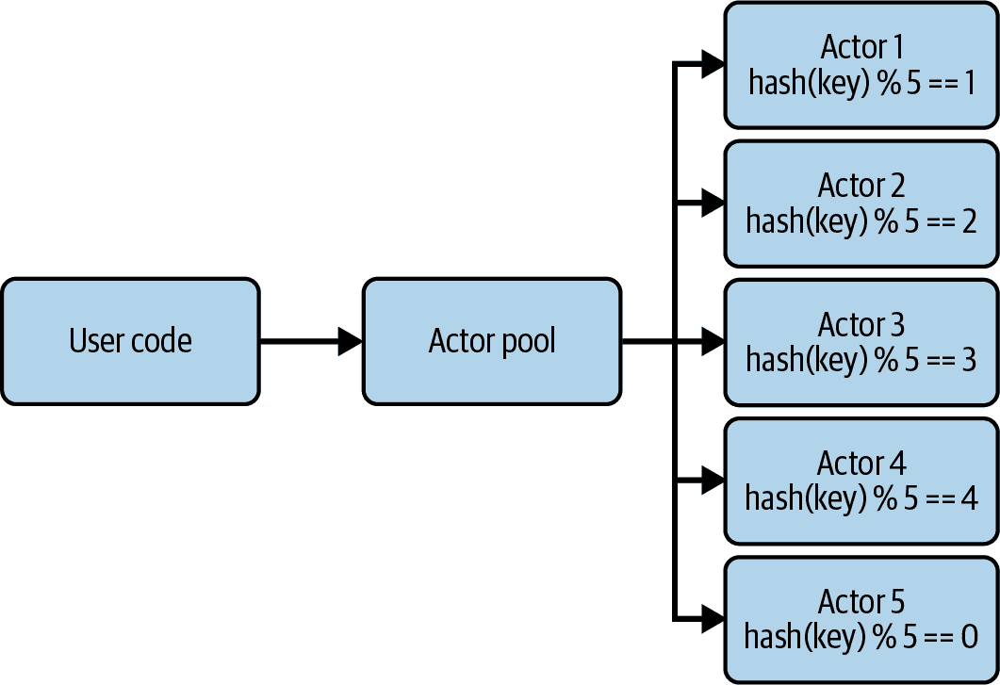

# 第七章。使用 Dask Actors 添加可变状态

Dask 主要专注于扩展分析用例，但您也可以将其用于扩展许多其他类型的问题。到目前为止，在 Dask 中使用的大多数工具都是函数式的。函数式编程意味着先前的调用不会影响未来的调用。在像 Dask 这样的分布式系统中，无状态函数是常见的，因为它们可以在失败时安全地多次重新执行。在训练过程中更新模型的权重是数据科学中常见的状态示例。在分布式系统中处理状态的最常见方法之一是使用演员模型。本章将介绍通用的演员模型及其在 Dask 中的具体实现。

Dask futures 提供了一个非可变的分布式状态，其中的值存储在工作节点上。然而，对于想要更新状态的情况（比如更改银行账户余额，一个替代方案在 示例 7-1 中有所说明），这种方法并不适用，或者在训练过程中更新机器学习模型权重。

###### 提示

Dask 演员有许多限制，我们认为在许多情况下正确的答案是将可变状态保持在 Dask *之外*（比如在数据库中）。

当然，您不必使用分布式可变状态。在某些情况下，您可能选择不使用分布式状态，而是将其全部放入主程序中。这可能会迅速导致负责主程序的节点成为瓶颈。其他选择包括将状态存储在 Dask 之外，比如数据库，这有其自身的权衡。虽然本章重点介绍如何使用演员模型，但我们最后会讨论何时不使用 Dask 演员以及处理状态的替代方法，这同样重要。

###### 提示

Dask 还有分布式可变对象，详见 “用于调度的分布式数据结构”。

# 什么是演员模型？

在演员模型中，演员们会做以下事情：

+   存储数据

+   接收并响应消息，包括来自其他参与者和外部

+   传递消息

+   创建新的演员

演员模型是处理并行和分布式系统中状态的一种技术，避免了锁定。虽然适当的锁定可以确保只有一个代码片段修改给定值，但这可能非常昂贵且难以正确实现。锁定的常见问题称为死锁，这是资源按错误顺序获取/释放，导致程序可能永远阻塞。在分布式系统中，锁定的缓慢和困难只会增加。¹ 演员模型于 1973 年引入，此后已在大多数编程语言中实现。² 一些流行的现代实现包括 Scala 中的 Akka 和 .NET 语言中的实现。

每个 actor 可以被看作是一个持有其状态注释的人，而且只允许该人读取或更新注释。当代码的另一部分想要访问或修改状态时，必须要求 actor 这样做。

从概念上讲，这与面向对象编程中的类非常相似。然而，与通用类不同的是，actors 一次只处理一个请求，以确保 actor 的状态一致性。为了提高吞吐量，人们通常会创建一个 actor 池（假设可以对 actor 的状态进行分片或复制）。我们将在下一节中介绍一个示例。

Actor 模型非常适合许多分布式系统场景。以下是一些典型的使用案例，其中 actor 模型可能具有优势：

+   您需要处理一个大型分布式状态，在调用之间很难同步（例如，ML 模型权重，计数器等）。

+   您希望使用不需要来自外部组件显著交互的单线程对象。这对于不完全理解的遗留代码尤其有用。³

现在您对 actor 模型有了一般的了解，是时候学习 Dask 如何实现它以及其中的权衡了。

# Dask Actors

Dask actors 是 actors 的一种实现方式，其属性与 Dask 和其他系统之间有所不同。与 Dask 的其余部分不同，Dask actors 不具有容错能力。如果运行 actor 的节点或进程失败，则 actor 内部的数据将丢失，Dask 无法恢复。

## 您的第一个 actor（这是一个银行账户）

在 Dask 中创建一个 actor 相对简单。首先，您创建一个普通的 Python 类，其中包含您将调用的函数。这些函数负责在 actor 模型中接收和响应消息。一旦您有了类，您将其 `submit` 给 Dask，同时带有标志 `actor=True`，Dask 将返回一个表示 actor 引用的 future。当您获取此 future 的 `result` 时，Dask 创建并返回给您一个代理对象，该对象将任何函数调用作为消息传递给 actor。

###### 注意

请注意，这实际上是一个面向对象的银行账户实现，但我们没有任何锁，因为我们只有一个单线程改变值。

让我们看看如何为银行账户实现一个常见的 actor。在 Example 7-1 中，我们定义了三个方法——`balance`、`deposit` 和 `withdrawal`——用于与 actor 交互。一旦定义了 actor，我们请求 Dask 调度该 actor，以便我们可以调用它。

##### 示例 7-1\. 制作一个银行账户 actor

```py
class BankAccount:
    """ A bank account actor (similar to counter but with + and -)"""

    # 42 is a good start
    def __init__(self, balance=42.0):
        self._balance = balance

    def deposit(self, amount):
        if amount < 0:
            raise Exception("Cannot deposit negative amount")
        self._balance += amount
        return self._balance

    def withdrawal(self, amount):
        if amount > self._balance:
            raise Exception("Please deposit more money first.")
        self._balance -= amount
        return self._balance

    def balance(self):
        return self._balance

# Create a BankAccount on a worker
account_future = client.submit(BankAccount, actor=True)
account = account_future.result()
```

当您在生成的代理对象上调用方法时（参见示例 7-2），Dask 将调度远程过程调用并立即返回一个特殊的 ActorFuture。这使您可以以非阻塞方式使用 actors。与通用的`@dask.delayed`调用不同，这些调用都被路由到同一个进程，即 Dask 安排 actor 的进程。

##### 示例 7-2\. 使用银行账户 actor

```py
# Non-blocking
balance_future = account.balance()
# Blocks
balance = balance_future.result()
try:
    f = account.withdrawal(100)
    f.result() # throws an exception
except Exception as e:
    print(e)
```

ActorFuture **不可序列化**，因此如果需要传输调用 actor 的结果，需要阻塞并获取其值，如示例 7-3 所示。

##### 示例 7-3\. ActorFutures 不可序列化

```py
def inc(x):
    import time
    time.sleep(x)
    f = counter.add(x)
    # Note: the actor (in this case `counter`) is serializable; 
    # however, the future we get back from it is not.
    # This is likely because the future contains a network connection 
    # to the actor, so need to get its concrete value here. If we don't
    # need the value, you can avoid blocking and it will still execute.
    return f.result()
```

每个银行账户一个 actor 可以很好地避免瓶颈，因为每个银行账户可能不会有太多排队的交易，但这样做稍微低效，因为存在非零的 actor 开销。一个解决方案是通过使用键和哈希映射来扩展我们的银行账户 actor，以支持多个账户，但如果所有账户都在一个 actor 内部，这可能会导致扩展问题。

## 缩放 Dask Actors

本章早期描述的 actor 模型通常假定 actors 是轻量级的，即它们包含单个状态片段，并且不需要扩展/并行化。在 Dask 和类似系统（包括 Akka）中，actors 通常用于更粗粒度的实现，并且可能需要扩展。⁴

与`dask.delayed`类似，您可以通过创建多个 actor 水平（跨进程/机器）或垂直（使用更多资源）来扩展 actors。然而，横向扩展 actors 并不像只需增加更多机器或工作器那样简单，因为 Dask 无法将单个 actor 分割为多个进程。

在横向扩展 actors 时，您需要以一种可以使多个 actors 处理其状态的方式来分割状态。一种技术是使用*actor 池*（见图 7-1）。这些池可以具有静态映射，例如用户→actor，或者在 actors 共享数据库的情况下，可以使用轮询或其他非确定性的负载均衡。



###### 图 7-1\. 使用一致性哈希的扩展 actor 模型

我们将银行账户示例扩展到一个“银行”，其中一个 actor 可能负责多个账户（但不是银行中所有账户）。然后，我们可以使用带哈希的 actor 池将请求路由到正确的“分支”或 actor，如示例 7-4 所示。

##### 示例 7-4\. 用于银行的哈希 actor 池示例扩展

```py
class SketchyBank:
    """ A sketchy bank (handles multiple accounts in one actor)."""

    # 42 is a good start
    def __init__(self, accounts={}):
        self._accounts = accounts

    def create_account(self, key):
        if key in self._accounts:
            raise Exception(f"{key} is already an account.")
        self._accounts[key] = 0.0

    def deposit(self, key, amount):
        if amount < 0:
            raise Exception("Cannot deposit negative amount")
        if key not in self._accounts:
            raise Exception(f"Could not find account {key}")
        self._accounts[key] += amount
        return self._accounts[key]

    def withdrawal(self, key, amount):
        if key not in self._accounts:
            raise Exception(f"Could not find account {key}")
        if amount > self._accounts[key]:
            raise Exception("Please deposit more money first.")
        self._accounts[key] -= amount
        return self._accounts[key]

    def balance(self, key):
        if key not in self._accounts:
            raise Exception(f"Could not find account {key}")
        return self._accounts[key]

class HashActorPool:
    """A basic deterministic actor pool."""

    def __init__(self, actorClass, num):
        self._num = num
        # Make the request number of actors
        self._actors = list(
            map(lambda x: client.submit(SketchyBank, actor=True).result(),
                range(0, num)))

    def actor_for_key(self, key):
        return self._actors[hash(key) % self._num]

holdens_questionable_bank = HashActorPool(SketchyBank, 10)
holdens_questionable_bank.actor_for_key("timbit").create_account("timbit")
holdens_questionable_bank.actor_for_key(
    "timbit").deposit("timbit", 42.0).result()
```

## 限制

如前所述，Dask actors 在机器或进程失败时不具备韧性。这是 Dask 的设计决策，并非所有 actor 系统都是如此。许多 actor 系统提供了不同的选项，用于在失败时持久化和恢复 actors。例如，Ray 具有可恢复 actors 的概念（在工作流内部自动管理或手动管理）。

###### 警告

对 `dask.delayed` 函数的调用在失败时可以重试，如果它们调用 actors 上的函数，则这些函数调用将被复制。如果不能重新执行函数，则需要确保仅从其他 actors 内部调用它。

Dask 的 actor 模型不如 Ray 的 actor 模型功能完善，就像 Ray 的 DataFrame 不如 Dask 的一样。您可能希望考虑在 Ray 上运行 Dask，以获得两者的最佳结合。虽然 Holden 有所偏见，但她建议您如果对 Ray 感兴趣，可以查看她的书 *Scaling Python with Ray*。

# 何时使用 Dask Actors

行业中的一个常见问题是没有意识到我们很酷的新工具并不一定适合当前的工作。正如俗话说，“拿着锤子，眼前的都是钉子。” *如果你不需要改变状态，应该坚持使用任务而不是 actors。* 请记住，处理状态还有其他选择，如在 Table 7-1 中所示。

Table 7-1\. 可变状态管理技术比较

|  | 本地状态（例如驱动程序） | Dask actors | 外部分布式状态（例如 ZooKeeper、Ray 或 AKKA） |
| --- | --- | --- | --- |
| **可扩展性** | 否，所有状态必须适合单台机器。 | 每个 actor 内的状态必须适合一台机器，但 actors 是分布的。 | 是^(a) |
| **韧性** | 中等，但没有增加韧性成本（例如，驱动程序的丢失已经是灾难性的）。 | 不，任何 worker 的丢失对 actor 都是灾难性的。 | 是，整个集群的丢失可以恢复。 |
| **性能开销** | RPC 到驱动程序 | 与 `dask.delayed` 相同 | RPC 到外部系统 + 外部系统开销 |
| **代码复杂性** | 低 | 中等 | 高（需要学习和集成的新库），避免重复执行的额外逻辑 |
| **部署复杂性** | 低 | 低 | 高（需要维护的新系统） |
| ^(a) Ray actors 仍然要求 actor 内的状态必须适合单台机器。Ray 还有其他工具用于分片或创建 actors 池。 |

和生活中的大多数事物一样，选择正确的技术是一种特定问题的妥协。我们认为，在处理需要可变状态的大多数情况下，其中一种本地（例如，驱动程序）状态，或者结合 Dask 的 Ray actors 以利用其分析能力，都是可以应对的。

# 结论

本章中，你已经了解了 actor 模型的基本工作原理以及 Dask 的实现方式。你还学习了一些处理分布式系统中状态的替代方案，并学会了如何在它们之间进行选择。Dask 的 actor 是 Dask 的一个相对较新的部分，并且其容错性质与延迟函数不同。一个包含 actor 的 worker 的失败是无法恢复的。许多其他 actor 系统提供了一些从失败中恢复的能力，如果你发现自己严重依赖于 actors，你可能希望探索其他选择。

¹ 参阅 [ZooKeeper 文档](https://oreil.ly/btzJK) 了解 ZooKeeper 的分布式性能。

² Actor 模型于 1985 年被扩展用于并发计算；参见 Gul Abdulnabi Agha 的 [“Actors: A Model of Concurrent Computation in Distributed Systems”](https://oreil.ly/uPCfx)。

³ 想象一下 COBOL，作者离开后文档丢失，但当你试图关闭它时，会有会计人员跑来，真的。

⁴ *粗粒度*的 actor 可能包含多个状态片段；*细粒度*的 actor 每个状态片段都表示为一个单独的 actor。这类似于 [粗粒度锁](https://oreil.ly/7RMkS) 的概念。
