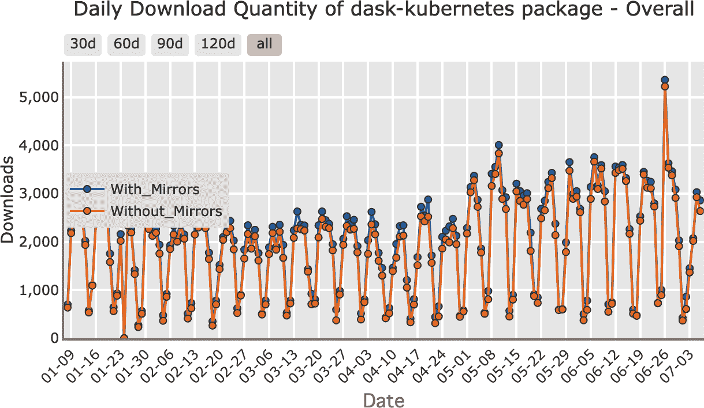
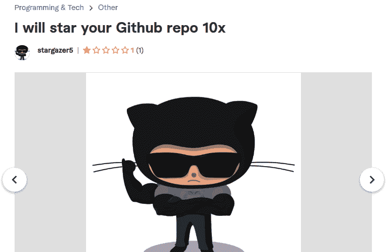

# 第八章：如何评估 Dask 的组件和库

尽管可能，但是构建由不可靠组件组成的可靠系统很难。¹ Dask 是一个主要由社区驱动的开源项目，其组件的发展速度不同。并非所有的 Dask 部分都同样成熟；即使是本书涵盖的组件也有不同的支持和发展水平。虽然 Dask 的核心部分得到了良好的维护和测试，但某些部分缺乏同等水平的维护。

尽管如此，已有数十个特定于 Dask 的流行库，开源 Dask 社区正在围绕它们不断壮大。这使我们对这些库中的许多将长期存在感到有信心。表 8-1 展示了一些基础库的非详尽列表，及其与核心 Dask 项目的关系。这旨在为用户提供路线图，并不是对个别项目的认可。尽管我们没有尝试涵盖所有显示的项目，但我们在整本书中对一些个别项目进行了评估。

表 8-1\. 经常与 Dask 一起使用的库

| **类别** | **子类别** | **库** |
| --- | --- | --- |
| Dask 项目 |  |

+   Dask

+   分布式

+   dask-ml

|

| **数据结构**：扩展 Dask 内置数据结构的功能、特定科学数据处理或部署硬件选项 | 功能和便利性 |
| --- | --- |

+   *xarray*：为 Dask 数组添加轴标签

+   *sparse*：稀疏数组和矩阵的高效实现，通常用于 ML 和深度学习

+   *pint*：科学单位转换

+   *dask-geopandas*：geopandas 的并行化

|

| 硬件 |
| --- |

+   *RAPIDS 项目*：NVIDIA 领导的项目，扩展了 CUDA 数据结构以用于 Dask

+   *dask-cuda*:^(a) 提供 CUDA 集群，扩展了 Dask 的集群以更好地管理支持 CUDA 的 Dask 工作节点

+   *cuPY*:^(a) GPU 启用的数组

+   *cuDF*:^(a) CUDA 数据帧作为 Dask 数据帧的分区

|

| **部署**：扩展部署选项以与 Dask 分布式一起使用 | 容器 |
| --- | --- |

+   *dask-kubernetes*:^(a) 在 k8s 上的 Dask

+   *dask-helm*:^(a) 替代 Dask 在 k8s 和 jupyterhub 在 k8s 上的使用

|

| 云 |
| --- |

+   *dask-cloudprovider*：商品云 API

+   *dask-gateway*

+   *Dask-Yarn*:^(a) 用于 YARN/Hadoop

|

| GPU |
| --- |

+   *dask-cuda*：优化 GPU 的 Dask 集群

|

| HPC |
| --- |

+   *Dask-jobqueue*:^(a) 用于 PBS、Slurm、MOAB、SGE、LSF 和 HTCondor 的部署

+   *dask-mpi*:^(a) MPI 的部署

|

| **ML 和分析**：通过 Dask 扩展 ML 库和计算 |  |
| --- | --- |

+   *dask-ml*:^(a) 分布式实现 scikit-learn 及更多

+   *xgboost*:^(a) 具有原生 Dask 支持的梯度提升

+   *light-gbm*:^(a) 另一种基于树的学习算法，具有本地 Dask 支持

+   *Dask-SQL*:^(a) 基于 CPU 的 Dask SQL 引擎（ETL/计算逻辑可以在 SQL 上下文中运行；类似于 SparkSQL）

+   *BlazingSQL*:^(a) 基于 cuDF 和 Dask 的 SQL 查询

+   *FugueSQL*:^(a) 在 pandas、Dask 和 Spark 之间可移植，使用相同的 SQL 代码（缺点：需要 ANTLR，一个基于 JVM 的工具）

+   *Dask-on-Ray*:^(a) Dask 的分布式数据结构和任务图，在 Ray 调度器上运行

|

| ^(a) 本书涵盖内容。 |
| --- |

了解您考虑使用的组件的状态至关重要。如果您需要使用 Dask 的维护较少或开发较少的部分，[防御性编程](https://oreil.ly/IDXVs)，包括彻底的代码测试，将变得更加关键。在较少建立的 Dask 生态系统部分工作，也可以是参与并贡献修复或文档的激动人心机会。

###### 注意

这并不意味着闭源软件不会遇到相同的挑战（例如，未经测试的组件），但使用开源软件，我们可以更好地评估并做出明智的选择。

当然，并非所有项目都需要可维护性，但俗话说，“没有比临时解决方案更持久的东西。” 如果某件事确实是一次性项目，您可以跳过这里大部分的分析，试用这些库，看它们是否适合您。

Dask 正在快速发展，任何关于哪些组件是生产就绪的静态表格，在阅读时都将过时。因此，与其分享我们认为哪些 Dask 组件目前发展良好，本章旨在为您提供评估您可能考虑的库的工具。在本章中，我们将可以具体测量的指标与模糊的质量指标分开。或许反直觉地是，我们认为“模糊”的质量指标更适合评估组件和项目。

在此过程中，我们将查看一些项目及其衡量方式，但请记住，到您阅读本书时，这些具体观察结果可能已经过时，您应该使用本书提供的工具进行自己的评估。

###### 提示

虽然我们在本章节中关注 Dask 生态系统，但您可以在软件工具选择的大多数情况下应用这些技术。

# 项目评估的质量考虑

我们首先关注质量工具，因为我们认为这些工具是确定特定库适合您的项目的最佳工具。

## 项目优先级

有些项目优先考虑基准测试或性能数字，而其他项目可能更注重正确性和清晰度，还有一些项目可能更注重完整性。项目的 README 或主页通常是项目优先考虑内容的一个良好指标。在创建早期，Apache Spark 的主页专注于性能和基准测试，而现在显示了一个更加完整的工具生态系统。Dask Kubernetes GitHub README 显示了一系列标记，指示代码的状态，除此之外几乎没有其他内容，显示出强烈的开发者关注。

尽管有许多关于是否专注于基准测试的争论，几乎永远不应牺牲正确性。² 这并不意味着库永远不会有 bug；相反，项目应认真对待正确性问题的报告，并将其视为更高优先级的问题。了解项目是否重视正确性的一个很好的方法是查看正确性问题的报告，并观察核心开发人员如何回应。

许多 Dask 生态系统项目使用 GitHub 内置的问题跟踪器，但如果您看不到任何活动，请查看 README 和开发者指南，以查看该项目是否使用不同的问题跟踪器。例如，许多 ASF 项目使用 JIRA。研究人们如何回应问题可以让您了解他们认为哪些问题重要。您不需要查看所有问题，但查看 10 个小样本通常会给您一个很好的想法（查看未解决和已关闭的问题，以及已修复和未修复的问题）。

## 社区

正如非官方 ASF 的一句话说的那样，“社区高于代码。”³ [Apache Way 网站](https://oreil.ly/CcJZ1) 将其描述为“最成功、长期存在的项目重视广泛而协作的社区，而不是代码的细节本身。” 这句话符合我们的经验，我们发现技术改进很容易从其他项目复制，但社区则难以移动。衡量社区是具有挑战性的，人们往往倾向于看开发者或用户的数量，但我们认为必须超越这一点。

找到与特定项目相关联的社区可能有些棘手。花点时间浏览问题跟踪器、源代码、论坛（如 Discourse）和邮件列表。例如，Dask 的 [Discourse 组](https://oreil.ly/hSVE0) 非常活跃。有些项目使用 IRC、Slack 或 Discord，或者它们的“互动”通信方式——在我们看来，一些最好的项目会努力让这些沟通渠道的对话出现在搜索索引中。有时，社区的部分内容可能存在于外部社交媒体网站上，这对社区标准提出了独特的挑战。

开源软件项目有多种类型的社区。用户社区是那些使用软件构建事物的人。开发者社区是致力于改进库的群体。一些项目的这两个社区之间有很大的交集，但通常用户社区远远大于开发者社区。我们倾向于评估开发者社区，但确保两者都健康也很重要。开发者不足的软件项目会进展缓慢，没有用户的项目通常对除了开发者以外的任何人都很难使用。

在许多情况下，一个拥有足够多混混（或者一个主要的混混）的大社区可能比一个由友善的人组成的小社区环境不那么令人愉快。如果你不喜欢你的工作，你就不太可能是高效的。可悲的是，判断某人是否是混混，或者某个社区是否存在混混，是一个复杂的问题。如果人们在邮件列表或问题跟踪器上通常表现粗鲁，这可能是社区对新成员不那么友好的迹象。（参见 4）

###### 注意

一些项目，包括 Holden 的一个项目，已经尝试使用情感分析结合随机抽样来量化这些指标，但这是一个耗时的过程，在大多数情况下你可能可以跳过。（参见 [sentiment analysis combined with random sampling](https://oreil.ly/ZLJ63)）

即使是最友善的人，贡献者所属的机构也可能很重要。例如，如果顶级贡献者都是同一个研究实验室的研究生或在同一家公司工作，软件被遗弃的风险会增加。这并不是说单一公司或甚至单个人的开源项目就是坏事，（参见 5）但你应该调整你的期望来匹配这一点。

###### 注意

如果你担心某个项目不符合你当前的成熟度水平，并且你有预算，这可能是支持关键开源项目的绝佳机会。与维护者联系，看看他们需要什么；有时，简单地给他们写一张新硬件的支票或者雇佣他们为你的公司提供培训就可以了。

除了一个社区中的人是否友好外，如果人们使用项目的方式与你考虑使用的方式类似，这也可能是一个积极的信号。例如，如果你是第一个将 Dask DataFrames 应用到一个新领域的人，尽管 Dask DataFrames 本身非常成熟，你更有可能发现缺失的组件，而不是如果同一领域的其他人已经在使用 Dask。

## Dask 特定的最佳实践

当涉及到 Dask 库时，有一些特定于 Dask 的最佳实践需要注意。总体来说，库不应在客户端节点上做太多的工作，尽可能多的工作应委托给工作节点。有时文档会掩盖哪些部分发生在哪里，而我们的经验中最快的方法是简单地运行示例代码，并查看哪些任务被安排在工作节点上。相关地，库在可能时应尽可能只返回最小的数据块。这些最佳实践与编写自己的 Dask 代码时略有不同，因为你可以预先知道你的数据大小，并确定何时本地计算是最佳路径。

## 最新的依赖项

如果一个项目固定了依赖项的特定版本，重要的是固定的版本不会与你想使用的其他包发生冲突，更重要的是，不会固定不安全的依赖项。什么算是“最新”的是一个主观问题。如果你是喜欢使用一切最新版本的开发者，你可能会最喜欢（大部分）提供最低但不是最高版本的库。然而，这可能会误导，特别是在 Python 生态系统中，许多库并不使用[语义版本控制](https://oreil.ly/RVVI7)—包括 Dask，它使用[CalVer](https://oreil.ly/fTTXZ)—而且仅仅因为一个项目不排除新版本并不意味着它实际上可以与之一起工作。

###### 注意

有些人可能会称之为定量的，但在一个以 CalVer 为中心的生态系统中，我们认为这更多是定性的。

在考虑将新库添加到现有环境中时，一个好的检查是尝试在你计划使用它的虚拟环境中（或等效配置的环境中）运行新库的测试套件。

## 文档

虽然不是每个工具都需要一本书（尽管我们希望你会觉得书籍有用），但真正不需要解释的库却是非常少的。在低端，对于简单的库，一些示例或者写得很好的测试可以代替适当的文档。完整的文档是项目整体成熟的一个良好标志。并非所有的文档都是平等的，正如谚语所说，文档完成时通常已经过时了（如果不是之前）。在你完全深入了解一个新库之前，打开文档并尝试运行示例是一个很好的练习。如果入门示例无法运行（而且你无法弄清楚如何修复它们），你可能会遇到一些麻烦。

有时存在很好的文档，但与项目分离（例如在书籍中），可能需要进行一些研究。如果发现一个项目有良好但不明显的文档，考虑尝试提高文档的可见性。

## 对贡献的开放态度

如果你发现某个库很有前途但还不够完善，能够贡献你的改进至关重要。这对社区是有益的，此外，如果不能将改进内容贡献给库，将来升级到新版本将更具挑战性。⁶ 当今许多项目都有贡献指南，可以让你了解他们的工作方式，但是没有什么比真正的测试贡献更好。开始一个项目的好方法是以新手的视角修复其文档，特别是从前一节获取开始的示例。文档在快速发展的项目中往往会变得过时，如果你发现难以让你的文档变更被接受，这表明贡献更复杂的改进将会多么具有挑战性。

需要注意的是问题报告体验。由于几乎没有软件是完全没有缺陷的，你可能会遇到问题。无论你是否有精力或技能修复这个错误，分享你的经验至关重要，以便修复它。分享这个问题可以帮助下一个遇到相同挑战的人感到不孤单，即使问题没有解决。

###### 注意

在尝试报告问题时，要注意你的体验。大多数有活跃社区的大型项目都会有一些指导，帮助你提交问题并确保不重复之前的问题。如果缺乏这些指导（或者项目的社区规模较小），报告问题可能会更具挑战性。

如果你没有时间进行自己的测试贡献，你总可以查看项目的拉取请求（或等效物），看看回应是否积极或对抗性。

## 可扩展性

并非所有对库的更改都必须能够上游。如果一个库结构合理，你可以在不更改基础代码的情况下添加额外的功能。Dask 之所以强大的一部分原因就是它的可扩展性。例如，添加用户定义的函数和聚合允许 Dask 被许多人使用。

# 用于开源项目评估的定量指标

作为软件开发人员和数据科学家，我们经常试图使用定量指标来做出决策。软件的定量指标，无论是开源还是闭源，都是一个活跃研究领域，因此我们无法覆盖所有的定量指标。所有开源项目的一个重大挑战是，特别是一旦涉及到资金，这些指标可能会受到影响。我们建议集中精力关注定性因素，虽然这些因素更难以衡量，但也更难以被操纵。

这里我们涵盖了一些人们常常试图使用的常见指标，还有许多其他评估开源项目可用性的框架，包括[OSSM](https://oreil.ly/4lvK6)、[OpenSSF 安全度量](https://oreil.ly/Pcioq)，和[更多](https://oreil.ly/6mmHu)。其中一些框架表面上产生了自动化评分（如 OpenSSF），但根据我们的经验，这些度量不仅可被操纵，而且通常被错误地收集。⁷

## 发布历史

频繁的发布可能是一个健康库的标志。如果一个项目很长时间没有发布过，你更有可能与其他库发生冲突。对于建立在诸如 Dask 之类的工具之上的库，要检查的一个细节是新版本库在最新版本 Dask 之上发布需要多长时间（或者是多少天）。有些库不会进行传统的发布，而是建议直接从源代码仓库安装。这通常是一个项目处于开发早期阶段的迹象，这样的项目作为一个依赖项更具挑战性。⁸

发布历史是最容易被操纵的指标之一，因为它只需要开发人员发布一个版本。某些开发风格会在每次成功提交后自动创建发布版本，而在我们看来，这通常是一种反模式，⁹ 因为你通常希望在全面发布之前进行一些额外的人工测试或检查。

## 提交频率（和数量）

人们考虑的另一个流行指标是提交频率或数量。这个指标远非完美，因为频率和数量可能会因编码风格而异，而编码风格与软件质量没有相关性。例如，倾向于压缩提交的开发人员可能会具有较低的提交数量，而主要使用 rebase 的开发人员则会有更高的提交数量。

另一方面，最近提交完全缺乏可能是项目已经被抛弃的迹象，如果你决定使用它，最终会不得不维护一个分支。

## 库的使用情况

最简单的指标之一是人们是否在使用某个包，你可以通过查看安装情况来判断。你可以在[PyPI 统计网站](https://oreil.ly/1HHL8)（见图 8-1）或[Google 的 BigQuery](https://oreil.ly/83RIO)上检查 PyPI 包的安装统计数据，以及使用[condastats 库](https://oreil.ly/4STsP)检查 conda 安装情况。

不幸的是，安装计数是一个嘈杂的指标，因为 PyPI 下载可能来自于任何地方，从 CI 管道到甚至有人启动了一个安装了库但从未使用过的新集群。这个指标不仅是无意的嘈杂，而且相同的技术也可以被用来人为地增加数字。

我们不希望过于依赖包安装数量，而是希望能找到人们使用库的实际例子，比如在 GitHub 或 [Sourcegraph](https://oreil.ly/FrPTE) 上搜索导入情况。例如，我们可以尝试通过在 Sourcegraph 上搜索 [`(file:requirements.txt OR file:setup.py) cudf AND dask`](https://oreil.ly/gQWZY) 和 [`(file:requirements.txt OR file:setup.py) streamz AND dask`](https://oreil.ly/tYIJu) 来获取使用 Streamz 或 cuDF 与 Dask 的人数近似值，分别为 72 和 33。这只能捕捉到一部分情况，但当我们将其与 Dask 的相同查询比较时（得到 500+），这表明在 Dask 生态系统中，Streamz 的使用率低于 cuDF。

###### 图 8-1\. Dask Kubernetes 安装统计数据来自 PyPI 统计

寻找人们使用某个库的例子有其局限性，特别是在数据处理方面。由于数据和机器学习管道并不经常开源，因此对于用于这些目的的库，找到例子可能更加困难。

另一个可以参考使用情况的指标是问题或邮件列表帖子的频率。如果项目托管在类似 GitHub 的平台上，星星数量也可以作为衡量使用情况的一种有趣方式——但由于人们现在可以像购买 Instagram 点赞一样购买 GitHub 星星（如图 8-2 所示），因此不应过分依赖此指标。¹⁰

即使不考虑购买星星的情况，什么样的项目值得加星也因人而异。一些项目会请求许多人加星，虽然没有购买星星，但这可能会快速增加此指标。¹¹

###### 图 8-2\. 有人在出售 GitHub 星星

## 代码和最佳实践

软件测试对许多软件工程师来说是本能反应，但有时项目是匆忙创建的，没有测试。如果一个项目没有测试，或者测试大部分不通过，那么很难对项目的行为有信心。即使是最专业的项目，有时在测试方面也会偷懒，增加更多的测试是确保项目继续按您需要的方式运行的好方法。一个好问题是测试是否覆盖了对您重要的部分。如果一个项目确实有相关的测试，下一个自然的问题是它们是否被使用。如果运行测试太困难，人性往往会占上风，测试可能就不会被运行。因此，一个好的步骤是尝试运行项目中的测试。

###### 注意

测试覆盖率数字可以是特别有信息量的，但不幸的是，对于建立在像 Dask 这样的系统之上的项目，¹² 获得准确的测试覆盖信息是一个挑战。在单机系统中，测试覆盖率可以是一个很好的自动计算的定量指标。

我们认为大多数优秀的库都会有某种形式的持续集成（CI）或自动化测试，包括对提议更改的检查（或创建拉取请求时）。您可以通过查看拉取请求标签来检查 GitHub 项目是否有持续集成。CI 对于总体上减少错误尤其是回归错误非常有帮助。¹³ 历史上，使用 CI 在某种程度上取决于项目的偏好，但随着包括 GitHub actions 在内的免费工具的创建，许多多人软件项目现在都有某种形式的 CI。这是一种常见的软件工程实践，我们认为对于我们依赖的库来说是必不可少的。

静态类型经常被认为是编程的最佳实践，尽管也有一些反对者。虽然关于数据流水线内部的静态类型的争论是复杂的，但我们认为在库级别至少应该期待*一些*类型。

# 结论

在构建基于 Dask 的数据（或其他）应用程序时，您可能需要来自生态系统的许多不同工具。生态系统以不同的速度发展，其中一些部分需要更多的投资，才能有效地使用它们。选择正确的工具，以及因果关系正确的人员，是决定您的项目是否成功以及在我们的经验中，您的工作愉快程度的关键因素。重要的是要记住，这些决定并不是一成不变的，但随着在项目中使用库的时间越长，更改库变得更加困难。在本章中，您已经学会了如何评估生态系统不同组件的项目成熟度。您可以利用这些知识来决定何时使用库而不是自己编写所需的功能。

¹ 尽管在许多方面，分布式系统已经发展到可以克服其不可靠的组件。例如，容错性是单台机器无法实现的，但分布式系统可以通过复制来实现。

² 牺牲正确性意味着产生不正确的结果。一个正确性问题的例子是 Dask-on-Ray 中的 `set_index` 导致行消失；这个问题花了大约一个月的时间来修复，在我们看来是相当合理的，[考虑到复现这个问题的挑战](https://oreil.ly/P1L1W)。有时，像安全修复一样，正确性修复可能导致处理速度变慢；例如，MongoDB 的默认设置非常快，但可能会丢失数据。

³ 我们不确定这句引文确切的来源和出处；它出现在 ASF 董事的立场声明中，也出现在 Apache Way 文档中。

⁴ Linux 内核是一个典型的稍微[更具挑战性的社区](https://oreil.ly/tXjhn)的例子。

⁵ 一个小社区开发了一个非常受欢迎和成功的项目的例子是 homebrew。

⁶ 从上游开源项目中无法贡献回来的更改意味着每次升级都需要重新应用这些更改。虽然现代工具如 Git 简化了这一过程的机制，但这可能是一个耗时的过程。

⁷ 例如，OpenSSF 报告称 Apache Spark 有未签名的发布版本，但所有发布版本均已签名。像 log4j 这样的关键项目错误地被低估了关键性评分，说明这些指标的局限性。

⁸ 在这些情况下，最好选择一个标签或提交来安装，以免出现版本不匹配的情况。

⁹ 快照工件是可以接受的。

¹⁰ 有一些工具可以帮助你更深入地挖掘星级数据，包括[ghrr](https://oreil.ly/eKBdi)，但我们仍认为不要花太多时间或者给予星级太多的权重。

¹¹ 例如，我们可能要求你为我们的[示例仓库](https://oreil.ly/u6S0H)点赞，通过这样做，我们（希望）能增加星级数量，而无需实际上提高我们的质量。

¹² 这是因为大多数检查代码覆盖率的 Python 工具假定只有一个 Python 虚拟机需要附加并查看执行的代码部分。然而，在分布式系统中，情况不再如此，许多这些自动化工具无法正常工作。

¹³ 当某些在较新版本中工作正常的东西停止工作时。
