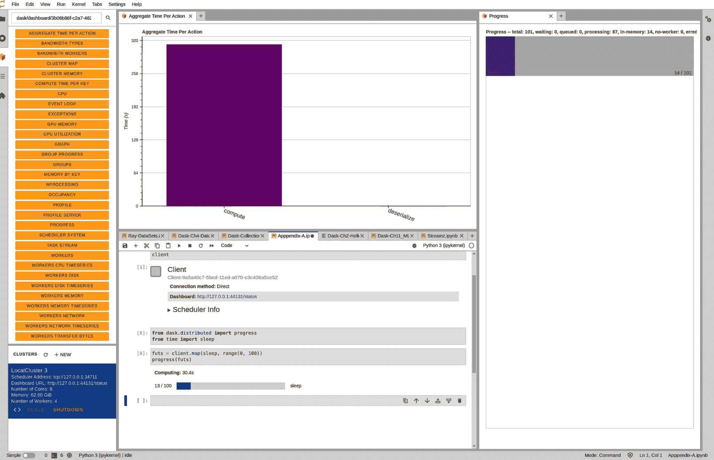

# 第十二章：将 Dask 投入生产：笔记本、部署、调整和监控

在这一章中，我们将捆绑我们认为对您从笔记本电脑转入生产环境至关重要的大部分内容。笔记本和部署是相关联的，因为 Dask 的笔记本界面极大简化了使用其分布式部署的许多方面。虽然您不必使用笔记本来访问 Dask，在许多情况下[笔记本存在严重缺点](https://oreil.ly/oi09S)，但对于交互式用例，很难击败这种权衡。交互式/探索性工作往往会成为永久的关键工作流程，我们将介绍将探索性工作转变为生产部署所需的步骤。

您可以以多种方式部署 Dask，从在其他分布式计算引擎（如 Ray）上运行到部署在 YARN 或原始机器集合上。一旦部署了您的 Dask 作业，您可能需要调整它，以避免将公司的整个 AWS 预算用于一个作业。最后，在离开一个作业之前，您需要设置监控——这样您就会知道它何时出现故障。

###### 注意

如果您只是想学习如何在笔记本中使用 Dask，可以直接跳到该部分。如果您想了解更多关于部署 Dask 的信息，祝贺您并对超出单台计算机处理能力的规模感到遗憾。

在本章中，我们将介绍一些（但不是全部）Dask 的部署选项及其权衡。您将学习如何将笔记本集成到最常见的部署环境中。您将看到如何使用这些笔记本来跟踪您的 Dask 任务的进度，并在远程运行时访问 Dask UI。最后，我们将介绍一些部署您计划任务的选项，这样您就可以放心度假，而不必每天找人按下笔记本的运行按钮。

###### 注意

本章涵盖了 Dask 的分布式部署，但如果您的 Dask 程序在本地模式下运行良好，不必为了部署集群而感到需要。¹

# 在部署选项中考虑的因素

在选择如何部署 Dask 时，有许多不同的因素需要考虑，但通常最重要的因素是您的组织已经在使用哪些工具。大多数部署选项都与不同类型的集群管理器（CMs）相关联。CMs 管理一组计算机，并在用户和作业之间提供一些隔离。隔离可能非常重要——例如，如果一个用户吃掉了所有的糖果（或者 CPU），那么另一个用户就没有糖果了。大多数集群管理器提供 CPU 和内存隔离，有些还隔离其他资源（如磁盘和 GPU）。大多数云平台（AWS、GCP 等）都提供 Kubernetes 和 YARN 集群管理器，可以动态调整节点的数量。Dask 不需要 CM 即可运行，但如果没有 CM，将无法使用自动扩展和其他重要功能。

在选择部署机制时，无论是否使用配置管理器（CM），需要考虑的一些重要因素包括扩展能力、多租户、依赖管理，以及部署方法是否支持异构工作节点。

在许多情况下，扩展能力（或*动态扩展*）非常重要，因为计算机是需要花钱的。对于利用加速器（如 GPU）的工作负载来说，异构或混合工作节点类型非常重要，这样非加速工作可以被调度到成本较低的节点上。支持异构工作节点与动态扩展很搭配，因为工作节点可以被替换。

多租户可以减少不能扩展的系统中浪费的计算资源。

依赖管理允许您在运行时或预先控制工作节点上的软件，这在 Dask 中非常关键；如果工作节点和客户端没有相同的库，您的代码可能无法正常运行。此外，有些库在运行时安装可能很慢，因此能够预先安装或共享环境对某些用例尤其有益，特别是在深度学习领域。

表 12-1 比较了一些 Dask 的部署选项。

表 12-1\. 部署选项比较

| 部署方法 | 动态扩展 | 推荐用例^(a) | 依赖管理 | 在笔记本内部部署^(b) | 混合工作节点类型 |
| --- | --- | --- | --- | --- | --- |
| localhost | 否 | 测试，独立开发，仅 GPU 加速 | 运行时或预安装 | 是 | 否 |
| ssh | 否 | 单独实验室，测试，但通常不推荐（使用 k8s 替代） | 仅运行时 | 是 | 是（手动） |
| Slurm + GW | 是 | 现有的高性能计算/Slurm 环境 | 是（运行时或预安装） | 单独的项目 | 各异 |
| Dask “Cloud” | 是 | 不推荐；在云提供商上使用 Dask + K8s 或 YARN | 仅运行时 | 中等难度^(c) | 否 |
| Dask + K8s | 是 | 云环境，现有的 K8s 部署 | 运行时或预安装（但需要更多工作） | 单独的项目，中等难度 | 是 |
| Dask + YARN | 是 | 现有的大数据部署 | 运行时或预安装（但需要更多工作） | 自 2019 年以来未更新的单独项目 | 是 |
| Dask + Ray + [CM] | 取决于 CM | 现有的 Ray 部署，多工具（TF 等），或者 actor 系统 | 取决于 CM（至少总是运行时） | 取决于 CM | 是 |
| Coiled | 是 | 新的云部署 | 是，包括魔术“自动同步” | 否 | 是 |
| ^(a) 这主要基于我们的经验，可能偏向于大公司和学术环境。请随意做出您自己的决定。^(b) 有[一些解决方案](https://oreil.ly/TqhBb)。^(c) 有些大型通用云提供商比其他更容易。Mika 自己的经验认为，Google Cloud 最容易，Amazon 居中，Azure 最难处理。Google Cloud 在使用 Dask 与 RAPIDS NVIDIA 架构和工作流程方面有良好的工作指南。同样，Amazon Web Services 在多个 Amazon Elastic Compute Cloud (EC2) 实例上运行 Dask workers 和挂载 S3 存储桶的文档都很好。Azure 需要做一些工作才能使 worker 配置工作良好，主要是由于其环境和用户配置工作流程与 AWS 或 GCP 有所不同。 |

# 在 Kubernetes 部署 Dask

有两种主要的方式可以在 Kubernetes 上部署 Dask:² KubeCluster 和 HelmCluster。Helm 是管理 Kubernetes 上部署的流行工具，部署在 Helm 图表中指定。由于 Helm 是管理 Kubernetes 上部署的新推荐方式，我们将在这里涵盖这一点。

[Helm 文档](https://oreil.ly/EBzBm) 提供了关于不同安装 Helm 方式的优秀起始点，但是对于那些着急的人，`curl https://raw.githubuser​con⁠tent.com/helm/helm/main/scripts/get-helm-3 | bash` 就可以搞定了。³

###### 注意

Dask 在 Kubernetes 上的 Helm 图表部署了所谓的*operator*。当前，安装 operators 需要安装自定义资源定义（CRDs）的能力，并且可能需要管理员权限。如果你无法获取权限（或者有权限的人），你仍然可以使用[“vanilla” or “classic” deployment mode](https://oreil.ly/-MLRk)。

由于 GPU 资源昂贵，通常希望只分配所需数量的资源。一些集群管理器接口，包括 Dask 的 Kubernetes 插件，允许您配置多种类型的 workers，以便 Dask 只在需要时分配 GPU workers。在我们的 Kubernetes 集群上，我们部署 Dask operator 如 Example 12-1 所示。

##### Example 12-1\. 使用 Helm 部署 Dask operator

```py
# Add the repo
helm repo add dask https://helm.dask.org
helm repo update
# Install the operator; you will use this to create clusters
helm install --create-namespace -n \
     dask-operator --generate-name dask/dask-kubernetes-operator
```

现在你可以通过创建 YAML 文件（可能不是你最喜欢的方式）或者使用`KubeCluster` API 来使用 Dask operator，如 Example 12-2 所示，在这里我们创建一个集群，然后添加额外的 worker 类型，允许 Dask 创建两种不同类型的 workers。⁴

##### Example 12-2\. 使用 Dask operator

```py
from dask_kubernetes.operator import KubeCluster

cluster = KubeCluster(name='simple',
                      n_workers=1,
                      resources={
                          "requests": {"memory": "16Gi"},
                          "limits": {"memory": "16Gi"}
                      })

cluster.add_worker_group(name="highmem",
                         n_workers=0,
                         resources={
                             "requests": {"memory": "64Gi"},
                             "limits": {"memory": "64Gi"}
                         })

cluster.add_worker_group(name="gpu",
                         n_workers=0,
                         resources={
                             "requests": {"nvidia.com/gpu": "1"},
                             "limits": {"nvidia.com/gpu": "1"}
                         })
# Now you can scale these worker groups up and down as needed
cluster.scale("gpu", 5, worker_group="gpu")
# Fancy machine learning logic
cluster.scale("gpu", , worker_group="gpu")
# Or just auto-scale
cluster.adapt(minimum=1, maximum=10)
```

2020 年，Dask 添加了一个[DaskHub Helm 图表](https://oreil.ly/otOQX)，它将 JupyterHub 的部署与 Dask Gateway 结合在一起。

# Dask on Ray

将 Dask 部署到 Ray 上与所有其他选项略有不同，因为它不仅改变了 Dask 工作节点和任务的调度方式，还改变了[Dask 对象的存储方式](https://oreil.ly/PIwuX)。这可以减少需要存储的同一对象的副本数量，从而更有效地利用集群内存。

如果您已经有一个可用的 Ray 部署，启用 Dask 可能会非常简单，就像在示例 12-3 中所示的那样。

##### 示例 12-3\. 在 Ray 上运行 Dask

```py
import dask

enable_dask_on_ray()
ddf_students = ray.data.dataset.Dataset.to_dask(ray_dataset)
ddf_students.head()

disable_dask_on_ray()
```

然而，如果您没有现有的 Ray 集群，您仍然需要在某处部署 Ray，并考虑与 Dask 相同的考虑因素。部署 Ray 超出了本书的范围。Ray 的[生产指南](https://oreil.ly/PNb0_)以及*Scaling Python with Ray*中有有关在 Ray 上部署的详细信息。

# 在 YARN 上的 Dask

YARN 是来自大数据领域的流行集群管理器，它在开源和商业的本地（例如 Cloudera）和云（例如 Elastic Map Reduce）环境中都有提供。在 YARN 集群上运行 Dask 有两种方式：一种是使用 Dask-Yarn，另一种是使用 Dask-Gateway。尽管这两种方法相似，但 Dask-Gateway 可能需要更多的操作，因为它添加了一个集中管理的服务器来管理 Dask 集群，但它具有更精细的安全性和管理控制。

根据集群的不同，您的工作节点可能比其他类型的工作节点更加短暂，并且它们的 IP 地址在重新启动时可能不是静态的。您应确保为自己的集群设置工作节点/调度器服务发现方法。可以简单地使用一个共享文件让它们读取，或者使用更可靠的代理。如果没有提供额外的参数，Dask 工作节点将使用`DASK_SCHEDULER_ADDRESS`环境变量进行连接。

示例 12-4 在一个自定义的 conda 环境和日志框架中扩展了示例 9-1。

##### 示例 12-4\. 使用自定义 conda 环境在 YARN 上部署 Dask

```py
from dask_yarn import YarnCluster
from dask.distributed import Client
import logging
import os
import sys
import time

logger = logging.getLogger(__name__)

WORKER_ENV = {
    "HADOOP_CONF_DIR": "/data/app/spark-yarn/hadoop-conf",
    "JAVA_HOME": "/usr/lib/jvm/java"}

logging.basicConfig(
    level=logging.DEBUG,
    format="%(asctime)s %(levelname)s %(name)s: %(message)s")

logger.info("Initializing YarnCluster")
cluster_start_time = time.time()

# say your desired conda environment for workers is located at
# /home/mkimmins/anaconda/bin/python
# similar syntax for venv and python executable
cluster = YarnCluster(
    environment='conda:///home/mkimmins/anaconda/bin/python',
    worker_vcores=2,
    worker_memory="4GiB")

logger.info(
    "Initializing YarnCluster: done in %.4f",
    time.time() -
    cluster_start_time)

logger.info("Initializing Client")
client = Client(cluster)
logger.info(
    "Initializing Client: done in %.4f",
    time.time() -
    client_start_time)

# Important and common misconfig is mismatched versions on nodes
versions = dask_client.get_versions(check=True)
```

或者，您可以使用 Dask-Yarn 公开的 CLI 界面运行集群。您首先会在您选择的 Shell 脚本中部署 YARN；然后，Shell 脚本会调用您要运行的 Python 文件。在 Python 文件中，您引用部署的 YARN 集群，如示例 12-5 所示。这可以是一个更简单的方式来链接您的作业并检查和获取日志。请注意，CLI 仅在 Python 版本高于 2.7.6 时受支持。

##### 示例 12-5\. 使用 CLI 界面在 YARN 上部署 Dask

```py
get_ipython().system('dask-yarn submit')

'''
--environment home/username/anaconda/bin/python --worker-count 20 \
--worker-vcores 2 --worker-memory 4GiB your_python_script.py
'''

# Since we already deployed and ran YARN cluster,
# we replace YarnCluster(...) with from_current() to reference it
cluster = YarnCluster.from_current()

# This would give you YARN application ID
# application_1516806604516_0019
# status check, kill, view log of application
get_ipython().system('dask-yarn status application_1516806604516_0019')
get_ipython().system('dask-yarn kill application_1516806604516_0019')
get_ipython().system('yarn logs -applicationId application_1516806604516_0019')
```

# 在高性能计算中的 Dask

Dask 已经获得了大量的学术和科学用户群体。这在一定程度上归功于使用现有的高性能计算（HPC）集群与 Dask 一起，可以轻松实现可扩展的科学计算，而无需重写所有代码。⁵

您可以将您的 HPC 帐户转换为高性能 Dask 环境，从而可以在本地机器上的 Jupyter 中连接到它。Dask 使用其 Dask-jobqueue 库来支持许多 HPC 集群类型，包括 HTCondor、LSF、Moab、OAR、PBS、SGE、TORQUE、DRMAA 和 Slurm。另一个库 Dask-MPI 支持 MPI 集群。在 示例 9-2 中，我们展示了如何在 Slurm 上使用 Dask 的示例，并在接下来的部分中，我们将进一步扩展该示例。

## 在远程集群中设置 Dask

在集群上使用 Dask 的第一步是在集群中设置自己的 Python 和 iPython 环境。确切的操作方法会因集群管理员的偏好而异。一般来说，用户通常使用 [virtualenv](https://oreil.ly/mLAOj) 或 [miniconda](https://oreil.ly/zXsTP) 在用户级别安装相关库。Min⁠i­conda 不仅可以更轻松地使用您自己的库，还可以使用您自己的 Python 版本。完成此操作后，请确保您的 Python 命令指向用户空间中的 Python 二进制文件，方法是运行`which python`或安装和导入系统 Python 中不可用的库。

Dask-jobqueue 库将您的 Dask 设置和配置转换为一个作业脚本，该脚本将提交到 HPC 集群。以下示例启动了一个包含 Slurm 工作节点的集群，对其他 HPC API，语义类似。Dask-MPI 使用稍有不同的模式，因此请务必参考其文档获取详细信息。`job_directives_skip` 是一个可选参数，用于忽略自动生成的作业脚本插入您的特定集群不识别的命令的错误。`job_script_prologue` 也是一个可选参数，指定在每次工作节点生成时运行的 shell 命令。这是确保设置适当的 Python 环境或特定集群设置脚本的好地方。

###### 小贴士

确保工作节点的内存和核心的 HPC 集群规格在`resource_spec`参数中正确匹配，这些参数将传递给您的 HPC 系统本身来请求工作节点。前者用于 Dask 调度器设置其内部；后者用于您在 HPC 内部请求资源。

HPC 系统通常利用高性能网络接口，这是在标准以太网网络之上加快数据移动的关键方法。您可以通过将可选的接口参数传递给 Dask（如在 示例 12-6 中所示），以指示其使用更高带宽的网络。如果不确定哪些接口可用，请在终端上输入`ifconfig`，它将显示 Infiniband，通常为 `ib0`，作为可用网络接口之一。

最后，核心和内存描述是每个工作节点资源，`n_workers` 指定您想要最初排队的作业数量。您可以像在 示例 12-6 中那样，在事后扩展和添加更多工作节点，使用 `cluster.scale()` 命令。

###### 小贴士

一些 HPC 系统在使用 GB 时实际上是指 1024 为基础的单位。Dask-jobqueue 坚持使用 GiB 的正确符号。1 GB 等于 1000³字节，而 1 GiB 等于 1024³字节。学术设置通常使用二进制测量单位，而商业设置通常选择 SI 单位，因此存在差异。

在新环境中运行 Dask 之前，您应该检查由 Dask-jobqueue 自动生成的作业脚本，以查找不受支持的命令。虽然 Dask 的作业队列库尝试与许多 HPC 系统兼容，但可能不具备您机构设置的所有特殊性。如果您熟悉集群的能力，可以通过调用`print(cluster.job_script())`来查找不受支持的命令。您还可以尝试先运行一个小版本的作业，使用有限数量的工作节点，看看它们在哪里失败。如果发现脚本存在任何问题，应使用`job_directives_skip`参数跳过不受支持的组件，如示例 12-6 所述。

##### 示例 12-6\. 手动在 HPC 集群上部署 Dask

```py
from dask_jobqueue import SLURMCluster
from dask.distributed import Client

def create_slurm_clusters(cores, processes, workers, memory="16GB",
                          queue='regular', account="account", username="user"):
    cluster = SLURMCluster(
        #ensure walltime request is reasonable within your specific cluster
        walltime="04:00:00",
        queue=queue,
        account=account,
        cores=cores,
        processes=processes,
        memory=memory,
        worker_extra_args=["--resources GPU=1"],
        job_extra=['--gres=gpu:1'],
        job_directives_skip=['--mem', 'another-string'],
        job_script_prologue=[
            '/your_path/pre_run_script.sh',
            'source venv/bin/activate'],
        interface='ib0',
        log_directory='dask_slurm_logs',
        python=f'srun -n 1 -c {processes} python',
        local_directory=f'/dev/{username}',
        death_timeout=300
    )
    cluster.start_workers(workers)
    return cluster

cluster = create_slurm_clusters(cores=4, processes=1, workers=4)
cluster.scale(10)
client = Client(cluster)
```

在示例 12-7 中，我们整合了许多我们介绍的概念。在这里，我们使用 Dask delayed 执行了一些异步任务，该任务部署在一个 Slurm 集群上。该示例还结合了我们提到的几种日志记录策略，例如显示底层部署的 HPC 作业脚本，并为用户在笔记本或所选择的 CLI 中提供进度条以跟踪进度。

##### 示例 12-7\. 使用 Dask futures 在 Slurm 上通过 jobqueue 部署 Dask

```py
import time
from dask import delayed
from dask.distributed import Client, LocalCluster
# Note we introduce progress bar for future execution in a distributed
# context here
from dask.distributed import progress
from dask_jobqueue import SLURMCluster
import numpy as np
import logging

logger = logging.getLogger(__name__)
logging.basicConfig(
    level=logging.DEBUG,
    format="%(asctime)s %(levelname)s %(name)s: %(message)s")

def visit_url(i):
    return "Some fancy operation happened. Trust me."

@delayed
def crawl(url, depth=0, maxdepth=1, maxlinks=4):
    # some complicated and async job
    # refer to Chapter 2 for full implementation of crawl
    time.sleep(1)
    some_output = visit_url(url)
    return some_output

def main_event(client):
    njobs = 100
    outputs = []
    for i in range(njobs):
        # assume we have a queue of work to do
        url = work_queue.deque()
        output = crawl(url)
        outputs.append(output)

    results = client.persist(outputs)
    logger.info(f"Running main loop...")
    progress(results)

def cli():
    cluster = create_slurm_clusters(cores=10, processes=10, workers=2)
    logger.info(f"Submitting SLURM job with jobscript: {cluster.job_script()}")
    client = Client(cluster)
    main_event(client)

if __name__ == "__main__":
    logger.info("Initializing SLURM Cluster")
    cli()
```

###### 提示

始终确保您的 walltime 请求不会违反 HPC 资源管理器的规则。例如，Slurm 有一个后台填充调度程序，应用其自己的逻辑，如果您请求的 walltime 过长，则可能会导致您的计算资源请求在队列中被卡住，无法按时启动。在这种情况下，Dask 客户端可能会因为“Failed to start worker process. Restarting.”等非描述性消息而报错。在撰写本文时，尚没有太多方法可以从用户端的日志代码中突显特定的部署问题。

在更高级的情况下，您可以通过更新在第一次运行时生成并存储在*/.config/dask/jobqueue.yaml*路径下的 Dask-jobqueue YAML 文件来控制集群配置。作业队列配置文件包含了许多不同类型集群的默认配置，这些配置被注释掉了。要开始编辑该文件，取消注释您正在使用的集群类型（例如，Slurm），然后您可以更改值以满足您的特定需求。作业队列配置文件允许您配置通过 Python 构造函数无法访问的附加参数。

如果 Dask 开始内存不足，它将默认开始将数据写入磁盘（称为溢写到磁盘）。这通常很好，因为我们通常有更多的磁盘空间而不是内存，尽管它较慢，但速度并不会慢太多。但是，在 HPC 环境中，Dask 可能写入的默认位置可能是网络存储驱动器，这将像在网络上传输数据一样慢。您应确保 Dask 写入本地存储。您可以向集群管理员询问本地临时目录，或者使用 `df -h` 查看不同存储设备映射到哪里。如果没有可用的本地存储，或者存储太小，还可以关闭溢写到磁盘功能。在集群上配置禁用和更改溢写到磁盘的位置可以在 *~/.config/dask/distributed.yaml* 文件中进行（首次运行时也会创建此文件）。

###### 小贴士

*自适应缩放* 是在应用程序运行时调整作业大小的好方法，特别是在忙碌的共享机器（如 HPC 系统）上。然而，每个 HPC 系统都是独特的，有时 Dask-jobqueue 处理自适应缩放方式可能会出现问题。我们在使用 jobqueue 在 Slurm 上运行 Dask 自适应缩放时遇到了这样的问题，但通过一些努力，我们能够正确配置它。

Dask 也使用文件进行锁定，在使用共享网络驱动器时可能会出现问题，这在 HPC 集群中很常见。如果有多个工作进程同时运行，它会使用锁定机制，该机制会排除其他进程访问此文件，以协调自身。在 HPC 上的一些问题可能归结为锁定事务不完整，或者由于管理限制而无法在磁盘上写入文件。可以切换工作进程配置以禁用此行为。

###### 小贴士

集群参数，如内存分配和作业数、工作进程、进程和任务每个任务的 CPU 数，对用户输入非常敏感，初学者可能难以理解。例如，如果使用多个进程启动 HPC 集群，则每个进程将占用总分配内存的一部分。10 个进程配备 30 GB 内存意味着每个进程获取 3 GB 内存。如果您的工作流在峰值时占用了超过 95% 的进程内存（例如我们的示例中的 2.85 GB），您的进程将因内存溢出风险而被暂停甚至提前终止，可能导致任务失败。有关内存管理的更多信息，请参阅 “工作进程内存管理”。

对于 HPC 用户，大多数启动的进程都将有一个有限的墙上时间，该作业允许保持运行。您可以以一种方式交错地创建工作进程，以便始终至少有一个工作进程在运行，从而创建一个无限工作循环。或者，您还可以交错地创建和结束工作进程，以避免所有工作进程同时结束。示例 12-8 展示了如何做到这一点。

##### 示例 12-8\. 自适应缩放管理 Dask 工作节点

```py
from dask_jobqueue import SLURMCluster
from dask import delayed
from dask.distributed import Client

#we give walltime of 4 hours to the cluster spawn
#each Dask worker is told they have 5 min less than that for Dask to manage
#we tell workers to stagger their start and close in a random interval of 5 min
# some workers will die, but others will be staggered alive, avoiding loss
# of job

cluster = SLURMCluster(
    walltime="04:00:00",
    cores=24,
    processes=6
    memory="8gb",
    #args passed directly to worker
    worker_extra_args=["--lifetime", "235m", "--lifetime-stagger", "5m"],
    #path to the interpreter that you want to run the batch submission script
    shebang='#!/usr/bin/env zsh',
    #path to desired python runtime if you have a separate one
    python='~/miniconda/bin/python'
)

client = Client(cluster)
```

###### 提示

不同的工作节点启动时间可能不同，并且包含的数据量也可能不同，这会影响故障恢复的成本。

虽然 Dask 有良好的工具来监控其自身的行为，但有时 Dask 与您的 HPC 集群（或其他集群）之间的集成可能会中断。如果您怀疑 jobqueue 没有为特定集群发送正确的工作节点命令，您可以直接检查或在运行时动态检查 `/.config/dask/jobqueue.yaml` 文件，或者在 Jupyter 笔记本中运行 `config.get('jobqueue.yaml')`。

## 将本地机器连接到 HPC 集群

远程运行 Dask 的一部分是能够连接到服务器以运行您的任务。如果您希望将客户端连接到远程集群，远程运行 Jupyter，或者只是在集群上访问 UI，则需要能够连接到远程机器上的一些端口。

###### 警告

另一种选择是让 Dask 绑定到公共 IP 地址，但是如果没有仔细配置防火墙规则，这意味着任何人都可以访问您的 Dask 集群，这可能不是您的意图。

在 HPC 环境中，通常已经使用 SSH 进行连接，因此使用 SSH 端口转发通常是最简便的连接方式。SSH 端口转发允许您将另一台计算机上的端口映射到本地计算机上的一个端口。⁶ 默认的 Dask 监控端口是 8787，但如果该端口已被占用（或者您配置了不同的端口），Dask 可能会绑定到其他端口。Dask 服务器在启动时会打印绑定的端口信息。要将远程机器上的 8787 端口转发到本地相同的端口，您可以运行 `ssh -L localhost:8787:my-awesome-hpc-node.hpc.fake:8787`。您可以使用相同的技术（但使用不同的端口号）连接远程 JupyterLab，或者将 Dask 客户端连接到远程调度程序。

###### 提示

如果您希望远程保持运行某个进程（如 JupyterLab），`screen` 命令是让进程持续超出单个会话的好方法。

随着笔记本的广泛流行，一些 HPC 集群提供特殊工具，使启动 Jupyter 笔记本更加简便。我们建议查阅您集群管理员的文档，了解如何正确启动 Jupyter 笔记本，否则可能会导致安全问题。

# Dask JupyterLab 扩展和魔法命令

您可以像运行其他库一样在 Jupyter 中运行 Dask，但是使用 Dask 的 JupyterLab 扩展可以更轻松地了解您的 Dask 作业在运行时的状态。

## 安装 JupyterLab 扩展

Dask 的 lab 扩展需要安装 `nodejs`，可以通过 `conda install -c conda-forge nodejs` 安装。如果您没有使用 conda，也可以在苹果上使用 `brew install node` 或者在 Ubuntu 上使用 `sudo apt install nodejs` 安装。

Dask 的 lab 扩展包名为 `dask-labextension`。

安装完实验室扩展后，它将显示带有 Dask 标志的左侧，如图 12-1 所示。


###### 图 12-1\. 在 JupyterLab 上成功部署的 Dask 实例（[数字，彩色版本](https://oreil.ly/TlOSc))

## 启动集群

从那里，您可以启动您的集群。默认情况下，该扩展程序启动一个本地集群，但您可以通过编辑*~/.config/dask*来配置它以使用不同的部署选项，包括 Kubernetes。

## 用户界面

如果您正在使用 Dask 的 JupyterLab 扩展（参见图 12-2），它提供了一个到集群 UI 的链接，以及将单个组件拖放到 Jupyter 界面中的功能。


###### 图 12-2\. 在 JupyterHub 内使用 JupyterLab 扩展显示的 Dask Web UI（[数字，彩色版本](https://oreil.ly/5UOHI)）

JupyterLab 扩展程序链接到 Dask Web UI，您还可以通过集群的`repr`获取链接。如果集群链接不起作用/无法访问，您可以尝试安装`jupyter-server-proxy`扩展程序，以便将笔记本主机用作[跳转主机](https://oreil.ly/0eIhP)。

## 观察进度

Dask 作业通常需要很长时间才能运行；否则我们不会努力并行化它们。您可以使用 Dask 的`dask.distributed`中的`progress`函数来跟踪您笔记本中的未来进度（参见图 12-3）。



###### 图 12-3\. 在 JupyterHub 中实时监控 Dask 进度（[数字，彩色版本](https://oreil.ly/amaBq)）

# 理解 Dask 性能

调整您的 Dask 程序涉及理解多个组件的交集。您需要了解您的代码行为以及其与给定数据和机器的交互方式。您可以使用 Dask 指标来深入了解其中的许多内容，但特别是如果不是您创建的代码，查看程序本身也很重要。

## 分布式计算中的指标

分布式计算需要不断做出决策，并权衡分发工作负载的优化成本和收益。大部分低级别的决策都委托给 Dask 的内部。用户仍应监控运行时特性，并根据需要修改代码和配置。

Dask 会自动跟踪相关的计算和运行时指标。您可以利用这一点来帮助决定如何存储数据，以及在优化代码时应该关注哪些方面。

当然，计算成本不仅仅是计算时间。用户还应考虑通过网络传输数据的时间，工作节点内存占用情况，GPU/CPU 利用率以及磁盘 I/O 成本。这些因素帮助理解数据移动和计算流的更高层次洞见，比如工作节点中有多少内存用于存储尚未传递给下一个计算的先前计算，或者哪些特定函数占用了大部分时间。监控这些可以帮助优化集群和代码，同时还可以帮助识别可能出现的计算模式或逻辑瓶颈，从而进行调整。

Dask 的仪表板提供了大量统计数据和图表来回答这些问题。该仪表板是一个与您的 Dask 集群在运行时绑定的网页。您可以通过本地机器或运行它的远程机器访问它，方法我们在本章前面已经讨论过。在这里，我们将覆盖一些从性能指标中获取洞见并据此调整 Dask 以获得更好结果的方法。

## Dask 仪表板

Dask 的仪表板包含许多不同页面，每个页面可以帮助理解程序的不同部分。

### 任务流

任务流仪表板提供了每个工作节点及其行为的高级视图。精确调用的方法以颜色代码显示，并可以通过缩放来检查它们。每行代表一个工作节点。自定义颜色的条形图是用户生成的任务，有四种预设颜色表示常见的工作节点任务：工作节点之间的数据传输、磁盘读写、序列化和反序列化时间以及失败的任务。图 12-4 展示了分布在 10 个工作节点上的计算工作负载，平衡良好，没有一个工作节点完成较晚，计算时间均匀分布，并且最小化了网络 IO 开销。


###### 图 12-4\. 带有良好平衡工作节点的任务流（[数字版，彩色](https://oreil.ly/VbpGF)）

另一方面，图 12-5 展示了计算不均匀的情况。你可以看到计算之间有很多空白，这意味着工作人员被阻塞，并且在此期间实际上没有计算。此外，您可以看到一些工作人员开始较早，而其他人结束较晚，暗示代码分发中存在问题。这可能是由于代码本身的依赖性或子优化调整不当所致。改变 DataFrame 或数组块的大小可能会减少这些碎片化。您可以看到，每个工作人员启动工作时，他们处理的工作量大致相同，这意味着工作本身仍然相当平衡，并且分配工作负载带来了良好的回报。这是一个相当虚构的例子，因此此任务仅花了几秒钟，但相同的想法也适用于更长和更笨重的工作负载。


###### 图 12-5\. 任务流中有太多小数据块（[数字，彩色版](https://oreil.ly/oI2ab)）

### 内存

您可以监视内存使用情况，有时称为*内存压力*，⁷ 每个工作人员在“存储字节”部分的使用情况（参见图 12-6）。这些默认情况下颜色编码，表示在限制内存压力、接近限制和溢出到磁盘。即使内存使用在限制内，当其超过 60%至 70%时，可能会遇到性能减慢。由于内存使用正在上升，Python 和 Dask 的内部将运行更昂贵的垃圾收集和内存优化任务，以防止其上升。


###### 图 12-6\. 监视 UI 中每个工作人员的内存使用情况（[数字，彩色版](https://oreil.ly/9GfNp)）

### 任务进度

你可以通过进度条看到任务完成的汇总视图，参见图 12-7。执行顺序是从上到下，虽然这并不总是完全顺序的。条的颜色对调整特别信息丰富。在图 12-7 中，`sum()` 和 `random_sample()` 的实心灰色表示任务准备运行，依赖数据已准备好但尚未分配给工作人员。加粗的非灰色条表示任务已完成，结果数据等待下一个任务序列处理。较淡的非灰色块表示任务已完成，结果数据已移交并从内存中清除。您的目标是保持实心色块的可管理大小，以确保充分利用分配的大部分内存。


###### 图 12-7\. 按任务监视的进度，所有工作人员汇总（[数字，彩色版](https://oreil.ly/v8XoP)）

### 任务图

类似的信息也可以在任务图上找到（参见 图 12-8），从单个任务的视角来看。您可能熟悉这些类似 MapReduce 的有向无环图。计算顺序从左到右显示，您的任务来源于许多并行工作负载，分布在工作人员之间，并以此种方式结束，最终得到由 10 个工作人员分布的结果。该图还准确地描述了任务依赖关系的低级视图。颜色编码还突出显示了计算生命周期中当前每个工作和数据所处的位置。通过查看这些信息，您可以了解哪些任务是瓶颈，因此可能是优化代码的良好起点。


###### 图 12-8\. 显示每个任务的颜色编码状态及其前后任务的任务图（[数字，彩色版本](https://oreil.ly/RSBiv)）

工作人员标签页允许您实时查看 CPU、内存和磁盘 IO 等情况（参见 图 12-9）。如果您怀疑您的工作人员内存不足或磁盘空间不足，监视此标签页可能会很有用。解决这些问题的一些方法可以包括为工作人员分配更多内存或选择不同的数据分块大小或方法。

图 12-10 显示了工作事件监视。Dask 的分布式调度器在称为事件循环的循环上运行，该循环管理要安排的所有任务以及管理执行、通信和计算状态的工作人员。`event_loop_interval` 指标衡量了每个工作人员的此循环迭代之间的平均时间。较短的时间意味着调度器在为该工作人员执行其管理任务时花费的时间较少。如果此时间增加，可能意味着诸如网络配置不佳、资源争用或高通信开销等问题。如果保持较高，您可能需要查看是否为计算分配了足够的资源，并且可以为每个工作人员分配更大的资源或重新对数据进行分块。


###### 图 12-9\. 具有 10 个工作人员的 Dask 集群的工作人员监视（[数字，彩色版本](https://oreil.ly/QlDQE)）


###### 图 12-10\. Dask 集群的工作事件监视（[数字，彩色版本](https://oreil.ly/vU6lG)）

系统标签允许您跟踪 CPU、内存、网络带宽和文件描述符的使用情况。CPU 和内存易于理解。如果作业需要大量数据传输，那么 HPC 用户会特别关注网络带宽。这里的文件描述符跟踪系统同时打开的输入和输出资源数量。这包括实际打开的读/写文件，以及在机器之间通信的网络套接字。系统同时可以打开的描述符数量有限，因此一个非常复杂的作业或者开启了许多连接但未关闭的漏洞工作负载可能会造成问题。类似于内存泄漏，这会随着时间的推移导致性能问题。

Profile 标签允许您查看执行代码所花费的时间，可以精确到每次函数调用的细节，以聚合级别显示。这有助于识别造成瓶颈的任务。Figure 12-11 显示了一个任务持续时间直方图，展示了每个任务及其所有调用的子例程的细粒度视图，以及它们的运行时间。这有助于快速识别比其他任务持续时间更长的任务。


###### 图 12-11\. Dask 作业的任务持续时间直方图（[数字，彩色版本](https://oreil.ly/dIq2o)）

###### 提示

您可以通过 Dask 客户端配置中的 `distributed​.cli⁠ent.scheduler-info-interval` 参数更改日志记录间隔。

## 保存和共享 Dask 指标/性能日志

您可以通过仪表板实时监控 Dask，但一旦关闭集群，仪表板将消失。您可以保存 HTML 页面，导出指标为 DataFrame，并编写用于指标的自定义代码（参见 Example 12-9）。

##### 示例 12-9\. 生成并保存 Dask 仪表板至文件

```py
from dask.distributed import performance_report

with performance_report(filename="computation_report.html"):
    gnarl = da.random.beta(
        1, 2, size=(
            10000, 10000, 10), chunks=(
            1000, 1000, 5))
    x = da.random.random((10000, 10000, 10), chunks=(1000, 1000, 5))
    y = (da.arccos(x) * gnarl).sum(axis=(1, 2))
    y.compute()
```

您可以为任何计算块手动生成性能报告，而无需保存整个运行时报告，只需使用 Example 12-9 中的代码执行 `performance_report("filename")`。请注意，在幕后，这需要安装 Bokeh。

对于更加重型的使用，您可以结合流行的 Python 指标和警报工具 Prometheus 使用 Dask。这需要您已部署 Prometheus。然后通过 Prometheus，您可以连接其他工具，例如用于可视化的 Grafana 或用于警报的 PagerDuty。

Dask 的分布式调度器提供了作为任务流对象的度量信息，而无需使用 UI 本身。您可以直接从 Dask 的任务流 UI 标签中访问信息，以及您希望对其进行性能分析的代码行级别。示例 12-10 展示了如何使用任务流，并将一些统计信息提取到一个小的 pandas DataFrame 中，以供进一步分析和分享。

##### 示例 12-10\. 使用任务流生成和计算 Dask 运行时统计

```py
from dask.distributed import get_task_stream

with get_task_stream() as ts:
    gnarl = da.random.beta(1, 2, size=(100, 100, 10), chunks=(100, 100, 5))
    x = da.random.random((100, 100, 10), chunks=(100, 100, 5))
    y = (da.arccos(x) * gnarl).sum(axis=(1, 2))
    y.compute()
history = ts.data

#display the task stream data as dataframe
history_frame = pd.DataFrame(
    history,
    columns=[
        'worker',
        'status',
        'nbytes',
        'thread',
        'type',
        'typename',
        'metadata',
        'startstops',
        'key'])

#plot task stream
ts.figure
```

## 高级诊断

您可以使用`dask.distributed.diagnostics`类插入自定义度量。其中一个函数是`MemorySampler`上下文管理器。当您在`ms.sample()`中运行您的 Dask 代码时，它会记录集群上的详细内存使用情况。示例 12-11 虽然是人为的，但展示了如何在两种不同的集群配置上运行相同的计算，然后绘制以比较两个不同的环境配置。

##### 示例 12-11\. 为您的代码插入内存采样器

```py
from distributed.diagnostics import MemorySampler
from dask_kubernetes import KubeCluster
from distributed import Client

cluster = KubeCluster()
client = Client(cluster)

ms = MemorySampler()

#some gnarly compute
gnarl = da.random.beta(1, 2, size=(100, 100, 10), chunks=(100, 100, 5))
x = da.random.random((100, 100, 10), chunks=(100, 100, 5))
y = (da.arccos(x) * gnarl).sum(axis=(1, 2))

with ms.sample("memory without adaptive clusters"):
    y.compute()

#enable adaptive scaling
cluster.adapt(minimum=0, maximum=100)

with ms.sample("memory with adaptive clusters"):
    y.compute()

#plot the differences
ms.plot(align=True, grid=True)
```

# 扩展和调试最佳实践

在这里，我们讨论了在分布式集群设置中运行代码时常见的问题和被忽视的考虑因素。

## 手动扩展

如果您的集群管理器支持，您可以通过调用`scale`并设置所需的工作节点数来进行工作节点的动态扩展和缩减。您还可以告知 Dask 调度器等待直到请求的工作节点数分配完成，然后再使用`client.wait_for_workers(n_workers)`命令进行计算。这在训练某些机器学习模型时非常有用。

## 自适应/自动扩展

我们在前几章节简要介绍了自适应扩展。您可以通过在 Dask 客户端上调用`adapt()`来启用集群的自动/自适应扩展。调度器会分析计算并调用`scale`命令来增加或减少工作节点。Dask 集群类型——KubeCluster、PBSCluster、LocalClusters 等——是处理实际请求以及工作节点的动态扩展和缩减的集群类。如果在自适应扩展中遇到问题，请确保您的 Dask 正确地向集群管理器请求资源。当然，要使 Dask 中的自动扩展生效，您必须能够在运行作业的集群内部自行扩展资源分配，无论是 HPC、托管云等。我们在示例 12-11 中已经介绍了自适应扩展；请参考该示例获取代码片段。

## 持久化和删除成本高昂的数据

一些中间结果可以在代码执行的后续阶段使用，但不能立即使用。在这些情况下，Dask 可能会删除数据，而不会意识到在稍后会再次需要它，从而需要进行另一轮昂贵的计算。如果识别出这种模式，可以使用`.persist()`命令。使用此命令时，还应使用 Python 的内置`del`命令，以确保数据在不再需要时被删除。

## Dask Nanny

Dask Nanny 是一个管理工作进程的进程。它的工作是防止工作进程超出其资源限制，导致机器状态无法恢复。它不断监视工作进程的 CPU 和内存使用情况，并触发内存清理和压缩。如果工作进程达到糟糕的状态，它会自动重新启动工作进程，并尝试恢复先前的状态。

如果某个工作进程因某种原因丢失，其中包含计算密集和大数据块，可能会出现问题。Nanny 将重新启动工作进程，并尝试重新执行导致问题的工作。在此期间，其他工作进程也将保留它们正在处理的数据，导致内存使用量激增。解决此类问题的策略各不相同，可以禁用 Nanny，修改块大小、工作进程大小等。如果此类情况经常发生，应考虑持久化或将数据写入磁盘。⁸

如果看到诸如“工作进程超过 95% 内存预算。正在重启”之类的错误消息，则很可能是 Nanny 引起的。它是负责启动、监视、终止和重新启动工作进程的类。这种内存分数以及溢出位置可以在 *distributed.yaml* 配置文件中设置。如果 HPC 用户的系统本身具有自己的内存管理策略，则可以关闭 Nanny 的内存监控。如果系统还重新启动被终止的作业，则可以使用 `--no-nanny` 选项关闭 Nanny。

## 工作进程内存管理

默认情况下，当工作进程的内存使用达到大约 60% 时，它开始将一些数据发送到磁盘。超过 80% 时，停止分配新数据。达到 95% 时，工作进程会预防性地终止，以避免内存耗尽。这意味着在工作进程的内存使用超过 60% 后，性能会下降，通常最好保持内存压力较低。

高级用户可以使用 Active Memory Manager，这是一个守护进程，从整体视角优化集群工作进程的内存使用。您可以为此管理器设定特定的优化目标，例如减少集群内相同数据的复制，或者在工作进程退休时进行内存转移，或其他自定义策略。在某些情况下，Active Memory Manager 已被证明能够减少相同任务的内存使用高达 20%。⁹

## 集群规模

自动/自适应缩放解决了“有多少”工作进程的问题，但没有解决每个工作进程“有多大”的问题。尽管如此，以下是一些经验法则：

+   在调试时使用较小的工作进程大小，除非你预期 bug 是由于大量工作进程导致的。

+   根据输入数据大小和使用的工作进程数量调整工作进程内存分配。

+   数据中的块数应大致匹配工作人员的数量。工作人员少于块数将导致一些块在第一轮计算结束之前未被处理，从而导致中间数据的内存占用量较大。相反，工作人员多于块数将导致空闲的工作人员。

+   如果你可以选择高工作人数和较小的单个工作内存（与较少工作人数和更大的单个工作内存相比），分析你的数据块大小。这些块必须适合一个工作人员进行一些计算，并设置工作人员所需的最小内存。

调整你的机器大小可能成为一个永无止境的练习，所以了解对你的目的来说什么是“足够好”的很重要。

## 块划分再探讨

我们之前简要讨论了块和块大小，现在我们将此扩展到集群规模。块大小和工作人员大小对于 Dask 的功能至关重要，因为它使用任务图执行模型中的块级视图来进行计算和数据。这是决定分布式计算如何工作的重要参数。在使用 Dask 和其他分布式系统时，我们发现这是在调整这些大型机器的旋钮和控制器时要记住的重要理念之一。

对于正在进行的任何给定的工作人员硬件配置和计算，都会有一个适合块大小的最佳点，用户的任务是设置这个大小。找到确切的数字可能没有用，但大致找到可能会给你带来最佳结果的配置类型可以产生巨大的差异。

块划分的关键思想是在计算和存储之间实现负载平衡，但会增加通信的开销。在一个极端，你有单机数据工程，数据在一个 pandas DataFrame 中，或者一个没有分区的单个 Dask DataFrame 中。通信成本不高，因为所有通信发生在 RAM 和 GPU 或 CPU 之间，数据通过单台计算机的主板移动。随着数据大小的增长，这种单体块将无法工作，你会遇到内存不足的错误，失去所有之前在内存中的计算。因此，你会使用像 Dask 这样的分布式系统。

在另一个极端，一个非常分散的数据集，使用多台机器通过以太网连接，将在通信开销增加时更慢地共同工作，甚至可能超出调度程序处理通信、收集和协调的能力。在现代分布式数据工程中，保持两个极端之间的良好平衡，并了解哪个问题需要哪些工具，是一项重要工作。

## 避免重新划分块

在将多个数据流管道化到作业中时，你可能会有两个数据集，其数据维度匹配，但具有不同的块大小。在运行时，Dask 将不得不重新对一个数据集进行重新分块，以匹配另一个数据集的块大小。如果发现了这种情况，可以考虑在作业进入之前执行单独的重新分块作业。

# 计划任务

有许多不同的系统可以让你的作业按计划运行。这些计划可以是周期性的和基于时间的，也可以是由上游事件触发的（比如数据变为可用）。流行的调度作业工具包括 Apache Airflow、Flyte、Argo、GitHub Actions 和 Kubeflow。¹⁰ Airflow 和 Flyte 内置支持 Dask，可以简化运行计划任务，因此我们认为它们都是优秀的 Dask 计划任务选项。内置操作符使得跟踪失败更加容易，这很重要，因为对陈旧数据采取行动和对错误数据采取行动一样糟糕。

我们也经常看到人们使用 Unix crontab 和 schtasks，但我们建议不要这样做，因为它们只在单台机器上运行，并且需要大量的额外工作。

###### 提示

对于 Kubernetes 上的计划任务，你还可以让调度器创建一个 [DaskJob 资源](https://oreil.ly/Uw5Rp)，这将在集群内运行你的 Dask 程序。

在 附录 A 中，你将了解有关测试和验证的详细信息，这对于计划和自动化作业尤为重要，因为没有时间进行手动检查。

# 部署监控

像许多其他分布式库一样，Dask 提供了日志记录功能，你可以配置 Dask 日志记录发送到存储系统。具体方法会因部署环境以及是否使用 Jupyter 而有所不同。

你可以通过 Dask 客户端的 `get_worker_logs()` 和 `get_scheduler_logs()` 方法通用地获取工作器和调度器的日志。你可以指定特定的主题来记录或读取相关主题的日志。更多信息请参考 示例 9-6。

你不仅限于记录字符串，还可以记录结构化事件。这在性能分析或者日志消息可能被可视化而不是人工逐个查看的情况下特别有用。在 示例 12-12 中，我们通过分布式`softmax`函数实现了这一点，并记录了事件，并在客户端检索它们。

##### 示例 12-12\. 工作器上的结构化日志记录

```py
from dask.distributed import Client, LocalCluster

client = Client(cluster)  # Connect to distributed cluster and override default

d = {'x': [3.0, 1.0, 0.2], 'y': [2.0, 0.5, 0.1], 'z': [1.0, 0.2, 0.4]}
scores_df = dd.from_pandas(pd.DataFrame(data=d), npartitions=1)

def compute_softmax(partition, axis=0):
    """ computes the softmax of the logits
 :param logits: the vector to compute the softmax over
 :param axis: the axis we are summing over
 :return: the softmax of the vector
 """
    if partition.empty:
        return
    import timeit
    x = partition[['x', 'y', 'z']].values.tolist()
    start = timeit.default_timer()
    axis = 0
    e = np.exp(x - np.max(x))
    ret = e / np.sum(e, axis=axis)
    stop = timeit.default_timer()
    partition.log_event("softmax", {"start": start, "x": x, "stop": stop})
    dask.distributed.get_worker().log_event(
        "softmax", {"start": start, "input": x, "stop": stop})
    return ret

scores_df.apply(compute_softmax, axis=1, meta=object).compute()
client.get_events("softmax")
```

# 结论

在本章中，你已经学到了 Dask 分布式的各种部署选项，从大众化云到 HPC 基础设施。你还学到了简化远程部署获取信息的 Jupyter 魔术。根据我们的经验，Dask 在 Kubernetes 上和 Dask 在 Ray 上的 Kubernetes 提供了我们需要的灵活性。你自己关于如何部署 Dask 的决定可能会有所不同，特别是如果你在一个拥有现有集群部署的较大机构中工作。大部分部署选项都在[“部署 Dask 集群”指南](https://oreil.ly/j8ueU)中有详细介绍，但 Dask 在 Ray 上的情况则在[Ray 文档](https://oreil.ly/hN3Tk)中有介绍。

你还学到了运行时考虑因素以及运行分布式工作时要跟踪的度量标准，以及 Dask 仪表板中的各种工具，用于生成更高级的用户定义的度量标准。通过使用这些度量标准，你学到了调整 Dask 分布式集群、故障排除的概念基础，以及这与 Dask 和分布式计算的基本设计原则的关系。

¹ 我们目前并不为云提供商工作，所以如果你的工作负载适合在笔记本电脑上运行，那就更好了。只是记得使用源代码控制。但是，如果可能的话，将其放在服务器上可能是一个有用的练习，以捕获依赖关系并确保您的生产环境可以承受丢失笔记本电脑的情况。

² PEP20 对于显而易见的做事方式的看法仍然更多地是一种建议，而不是普遍遵守的规范。

³ 请注意，这会安装 Helm 3.X。与 Python 3 一样，Helm 3 与 Helm 2 相比有[大量的破坏性变化](https://oreil.ly/vR5BM)，所以当您阅读文档（或安装软件包）时，请确保它引用的是当前的主要版本。

⁴ 混合的工作类型；参见[Dask 文档中的“Worker Resources”](https://oreil.ly/O52ib)以及博客文章[“如何使用 Dask Helm 图运行不同的工作类型”](https://oreil.ly/mJR6b)。

⁵ 在某些方面，HPC 和集群管理器是同一个东西的不同名称，其中集群管理器来自于工业，而 HPC 来自于研究。HPC 集群倾向于拥有并使用不太常见于工业的共享网络存储。

⁶ 你还可以运行 SSH socks 代理，这样就可以轻松访问 HPC 集群内的其他服务器，但这也需要更改您的浏览器配置（并且对于 Dask 客户端不起作用）。

⁷ 你可以把内存想象成一个我们填充的气球，随着压力的增加，出现问题的可能性也越大。我们承认这个比喻有点牵强。

⁸ 有一个旋钮可以控制前置任务完成的速度。有时候运行所有简单的任务太快可能会导致大量中间数据堆积，后续步骤处理时可能会出现不良的内存饱和现象。查看与 `distributed​.sched⁠uler.worker-saturation` 相关的文档，以获取更多信息。

⁹ 您可以在 Dask 的[文档](https://oreil.ly/MhMHf)中找到更多信息。

¹⁰ Holden 是 [*Kubeflow for Machine Learning*](https://learning.oreilly.com/library/view/kubeflow-for-machine/9781492050117/)（O’Reilly）的合著者，所以她在这里有偏见。
