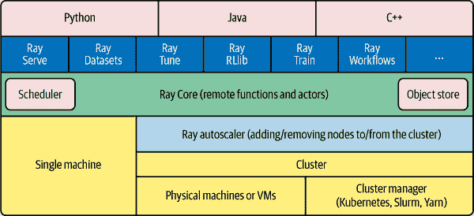

# 第一章：什么是 Ray，它在哪里？

*Ray* 主要是一个用于快速和简单分布式计算的 Python 工具。Ray 由加州大学伯克利分校的[RISELab](https://oreil.ly/aGtp8)创建。该实验室的早期版本创建了最初的软件，最终成为 Apache Spark。RISELab 的研究人员成立了 Anyscale 公司，继续开发和提供围绕 Ray 的产品和服务。

###### 注

您还可以从 Java 使用 Ray。与许多 Python 应用程序一样，Ray 在底层使用大量的 C++ 和一些 Fortran。Ray 流处理还包含一些 Java 组件。

Ray 的目标是解决比其前身更广泛的问题，支持从 actors 到机器学习（ML）到数据并行性等各种可扩展编程模型。其远程函数和 actor 模型使其成为一个真正通用的开发环境，而不仅仅是大数据环境。

Ray 根据需要自动扩展计算资源，使您可以专注于代码而不是管理服务器。除了传统的水平扩展（例如增加更多机器），Ray 还可以安排任务以利用不同的机器规模和加速器，如图形处理单元（GPUs）。

自从引入亚马逊 Web 服务（AWS）Lambda 以来，对*无服务器计算*的兴趣激增。在这种云计算模型中，云提供商根据需求分配机器资源，并代表其客户管理服务器。Ray 通过以下功能为[通用无服务器平台奠定了坚实基础](https://oreil.ly/BfxqQ)：

+   Ray 自动隐藏服务器。根据应用程序的需求，Ray 自动调整服务器规模。

+   通过支持 actors，Ray 实现了不仅是状态无关的编程模型（对于大多数无服务器实现来说是典型的），还包括有状态的编程模型。

+   它允许您指定资源，包括执行您的无服务器函数所需的硬件加速器。

+   它支持任务之间的直接通信，因此不仅支持简单函数，还支持复杂的分布式应用程序。

Ray 提供了丰富的库，简化了能够充分利用 Ray 无服务器功能的应用程序的创建。通常情况下，您需要不同的工具来处理从数据处理到工作流管理的所有内容。通过使用单一工具处理应用程序的较大部分，您不仅简化了开发，还简化了运营管理。

在本章中，我们将探讨 Ray 在生态系统中的定位，并帮助您决定它是否适合您的项目。

# 为什么需要 Ray？

当我们的问题变得太大，无法在单一进程中处理时，通常需要像 Ray 这样的工具。根据问题的规模，这可能意味着从多核到多台计算机的扩展，Ray 支持这些都支持。如果您发现自己在思考如何处理下个月的用户增长、数据或复杂性时，希望您能看看 Ray。Ray 的存在是因为扩展软件很难，而且随着时间推移，这类问题往往变得更加复杂而不是更简单。

Ray 不仅可以扩展到多台计算机，还可以在您无需直接管理服务器的情况下进行扩展。计算机科学家 Leslie Lamport [曾说过](https://oreil.ly/QHxmt)，“分布式系统是一种在其中您甚至不知道存在的计算机的故障可能导致您自己的计算机无法使用的系统。”尽管这种故障仍然可能发生，但 Ray 能够自动从许多类型的故障中恢复。

Ray 可以在您的笔记本电脑上以及使用相同的 API 在大规模上运行。这为使用 Ray 提供了一个简单的起始选项，无需您去云端开始实验。一旦您对 API 和应用程序结构感到满意，您可以简单地将代码移至云端，以获得更好的可扩展性，而无需修改代码。这填补了分布式系统和单线程应用程序之间存在的需求。Ray 能够使用相同的抽象来管理多线程和 GPU。

# Ray 可以运行在哪些地方？

Ray 可以部署在各种环境中，从您的笔记本电脑到云端，再到像 Kubernetes 或 Yarn 这样的集群管理器，甚至可以部署在藏在桌子底下的六台树莓派上。¹ 在本地模式下，开始使用 Ray 可以简单到执行 `pip install` 和调用 `ray.init`。现代化的 Ray 大部分将在没有上下文的情况下自动初始化一个上下文，允许您甚至跳过这一步。

`ray up` 命令是 Ray 的一部分，允许您创建集群并执行以下操作：

+   使用提供商的软件开发工具包（SDK）或访问物理机器（如果直接在物理机器上运行）来配置新的实例/机器（如果在云端或集群管理器上运行）

+   执行 shell 命令以设置具有所需选项的 Ray

+   运行任何自定义的用户定义设置命令（例如，设置环境变量和安装软件包）

+   初始化 Ray 集群

+   部署自动缩放器（autoscaler）（如有必要）

除了 `ray up` 外，如果在 Kubernetes 上运行，还可以使用 Ray Kubernetes 运算符。虽然 `ray up` 和 Kubernetes 运算符是创建 Ray 集群的首选方法，但如果您有一组现有的机器（物理或虚拟机器），您也可以手动设置 Ray 集群。

根据部署选项的不同，相同的 Ray 代码将以不同的速度运行。例如，当您需要特定的库或硬件来运行代码时，情况可能变得更加复杂。我们将在下一章中更详细地讨论在本地模式下运行 Ray，并且如果您希望进一步扩展，我们将在 附录 B 中涵盖云和资源管理器的部署。

# 使用 Ray 运行您的代码

Ray 不仅仅是一个要导入的库；它也是一个集群管理工具。除了导入库之外，您还需要*连接*到一个 Ray 集群。有三种选项可以将您的代码连接到 Ray 集群：

调用 `ray.init` 而不带任何参数

这启动了一个嵌入式的单节点 Ray 实例，可以立即供应用程序使用。

使用 [Ray 客户端 `ray.init("ray://*<head_node_host>*:10001")`](https://oreil.ly/7your)

默认情况下，每个 Ray 集群都会启动一个 Ray 客户端服务器在主节点上运行，可以接收远程客户端连接。然而，需要注意的是，当客户端位于远程位置时，一些直接从客户端运行的操作可能会因广域网（WAN）延迟而变慢。Ray 在主节点和客户端之间的网络故障上不具有容错性。

使用 Ray 命令行 API

您可以使用 `ray submit` 命令在集群上执行 Python 脚本。这将把指定的文件复制到主节点集群上，并使用给定的参数执行它。如果要传递参数，则您的代码应使用 Python 的 `sys` 模块，该模块通过 `sys.argv` 提供对任何命令行参数的访问。这样做可以消除使用 Ray 客户端时的潜在网络故障点。

# 它在生态系统中的位置是什么？

Ray 位于问题空间的一个独特交汇点。

Ray 解决的第一个问题是通过管理资源（服务器、线程或 GPU）扩展您的 Python 代码。Ray 的核心构建模块包括调度器、分布式数据存储和一个 actor 系统。Ray 使用的强大调度器通用到足以实现简单的工作流，同时处理传统的规模问题。Ray 的 actor 系统为您提供了一种处理分布式执行状态的简单方法。因此，Ray 能够作为*反应式系统*，其多个组件能够对其周围环境作出反应。

除了可扩展的构建模块之外，Ray 还具有更高级别的库，如 Serve、Datasets、Tune、RLlib、Train 和 Workflows，这些库存在于机器学习问题领域。它们的设计面向的是具有数据科学背景而不一定是分布式系统背景的人员。

总体来说，Ray 生态系统在 图 1-2 中展示。

###### 图 1-2\. Ray 生态系统

让我们来看看这些问题领域，看看 Ray 如何适应并与现有工具进行比较。以下列表，改编自 Ray 团队的[“Ray 1.x 架构”文档](https://oreil.ly/VJFlK)，比较了 Ray 与几个相关的系统类别：

集群编排器

类似于[Kubernetes](https://oreil.ly/OpVAA)、[Slurm](https://oreil.ly/GAn27)和 Yarn 的集群编排器安排容器。Ray 可以利用这些来分配集群节点。

并行化框架

与 Python 并行化框架（如[multiprocessing](https://oreil.ly/kij8j)或[Celery](https://oreil.ly/xwEYN)）相比，Ray 提供了一个更通用、性能更高的 API。此外，Ray 的分布式对象支持跨并行执行器的数据共享。

数据处理框架

Ray 的低级 API 比现有的数据处理框架如[Spark](https://oreil.ly/7DSc3)、[Mars](https://oreil.ly/ejcw4)或[Dask](https://oreil.ly/Ol4SQ)更灵活，更适合作为“分布式粘合”框架。虽然 Ray 没有对数据模式、关系表或流数据流有固有的理解，但它支持运行许多这些数据处理框架，例如[Modin](https://oreil.ly/SZKkm)、[Dask on Ray](https://oreil.ly/9O2RK)、[Mars on Ray](https://oreil.ly/GjawU)和[Spark on Ray（RayDP）](https://oreil.ly/cSE1V)。

演员框架

与[Erlang](https://oreil.ly/uRUun)、[Akka](https://oreil.ly/Y4O4S)和[Orleans](https://oreil.ly/7WOhb)等专门的演员框架不同，Ray 将演员框架直接集成到编程语言中。此外，Ray 的分布式对象支持跨演员的数据共享。

工作流程

大多数人谈论工作流程时，讨论的是 UI 或脚本驱动的低代码开发。尽管这种方法对非技术用户可能有用，但它经常给软件工程师带来更多痛苦而非价值。Ray 使用编程化的工作流程实现，类似于[Cadence](https://oreil.ly/w6pjl)。这种实现结合了 Ray 动态任务图的灵活性和强大的耐久性保证。Ray 工作流程在任务启动时的开销不到一秒，并支持数十万步的工作流程。它还利用 Ray 对象存储在步骤之间传递分布式数据集。

HPC 系统

不同于 Ray 的是，大多数高性能计算（HPC）系统暴露了任务和演员 API，提供了更大的应用程序灵活性。此外，许多 HPC 实现提供了优化的集体通信原语。Ray 提供了一个集体通信库，实现了许多这些功能。

## 大数据 / 可扩展数据帧

Ray 为可扩展 DataFrame 提供了几个 API，这是大数据生态系统的基石。Ray 建立在 Apache Arrow 项目之上，提供了一个（有限的）分布式 DataFrame API，称为`ray.data.Dataset`。这主要用于最简单的转换和从云端或分布式存储中读取数据。此外，Ray 还通过 Dask on Ray 提供了更类似于 pandas 的体验，后者利用 Ray 上的 Dask 接口。

我们在第九章中详细介绍了可扩展的 DataFrame。

###### 警告

除了之前提到的库外，你可能会在 Mars on Ray 或 Ray 的（已弃用的）内置 pandas 支持中找到参考资料。这些库不支持分布式模式，因此可能会限制你的可扩展性。这是一个快速发展的领域，未来需要密切关注。

## 机器学习

Ray 有多个 ML 库，大多数情况下，它们用于将 ML 的精彩部分委托给现有工具，如 PyTorch、scikit-learn 和 TensorFlow，同时利用 Ray 的分布式计算功能进行扩展。*Ray Tune*实现了使用 Ray 能力在分布式机器组中并行训练多个本地 Python 模型的超参数调优。*Ray Train*实现了使用 PyTorch 或 TensorFlow 进行分布式训练。Ray 的*RLlib*接口提供了带有核心算法的强化学习。

Ray 之所以在 ML 的纯数据并行系统中脱颖而出，部分原因在于其 Actor 模型，它允许更轻松地跟踪状态（包括参数）和工作进程间通信。你可以使用该模型实现自己的定制算法，这些算法不属于 Ray 核心的一部分。

我们在第十章中详细介绍了机器学习。

## 工作流调度

工作流调度是一个乍看起来可能非常简单的领域之一。一个工作流“只是”需要完成的工作的图表。然而，所有程序都可以被表达为“只是”需要完成的工作的图表。在 2.0 版本中，Ray 引入了一个工作流库，用于简化传统业务逻辑工作流和大规模（例如，ML 训练）工作流的表达。

Ray 在工作流调度中独具特色，因为它允许任务调度其他任务，而无需回调到中心节点。这样可以提供更大的灵活性和吞吐量。

如果你觉得 Ray 的工作流引擎过于低级，你可以使用 Ray 来运行 Apache Airflow。Airflow 是大数据领域中较受欢迎的工作流调度引擎之一。[Ray 的 Apache Airflow 提供程序](https://oreil.ly/sxMC8)允许你将 Ray 集群用作 Airflow 的工作池。

我们在第八章中详细介绍了工作流调度。

## 流式处理

流处理通常被认为是处理“准实时”数据或“随到随用”数据。流处理增加了另一层复杂性，特别是在尝试接近实时处理时，因为并非所有数据都会按顺序或按时到达。Ray 提供标准的流处理基元，并可以使用 Kafka 作为流数据的来源和接收端。Ray 使用其 Actor 模型 API 与流数据进行交互。

Ray 流处理，像许多将流处理系统附加到批处理系统的系统一样，具有一些有趣的怪癖。值得注意的是，Ray 流处理主要在 Java 中实现其逻辑，与 Ray 的其他组件不同。这可能会使得调试流处理应用程序比 Ray 的其他组件更具挑战性。

我们将在第六章中讨论如何使用 Ray 构建流式应用程序。

## 交互式

并非所有“准实时”应用程序都必然是流式应用程序。一个常见的例子是交互式地探索数据集。类似地，与用户输入进行交互（例如，服务模型）可以被视为交互式而不是批处理过程，但它与 Ray Serve 的流处理库分开处理。

# Ray 不是什么

尽管 Ray 是一个通用的分布式系统，但重要的是要注意 Ray 并非（至少在不付出大量努力的情况下）：

+   结构化查询语言（SQL）或分析引擎

+   数据存储系统

+   适合运行核反应堆

+   完全独立于语言

Ray 可以用来执行所有这些操作，但您可能更适合使用更专业的工具。例如，虽然 Ray 有一个键/值存储，但它并非设计用于生存领导节点的丢失。这并不意味着如果您发现自己的问题需要一点 SQL 或一些非 Python 库，Ray 就不能满足您的需求——您可能只需引入额外的工具。

# 结论

Ray 有潜力极大地简化中到大规模问题的开发和运维负担。它通过提供统一的 API 解决传统上分离的各种问题，同时提供无服务器可扩展性来实现这一目标。如果您的问题跨越 Ray 服务的领域，或者您已经厌倦了管理自己集群的运维负担，我们希望您能加入我们，共同探索学习 Ray 的旅程。

在下一章中，我们将向您展示如何在本地模式下在您的计算机上安装 Ray。我们还将查看 Ray 支持的生态系统中一些 Hello World 示例。

¹ ARM 支持，包括树莓派，目前需要手动构建。
