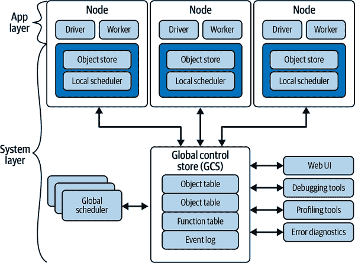

# 第五章 光线设计细节

现在你已经创建并使用了远程函数和演员，是时候了解幕后发生了什么了。在本章中，你将了解重要的分布式系统概念，如容错性、Ray 的资源管理以及加速远程函数和演员的方法。当在分布式环境中使用 Ray 时，这些细节尤为重要，但即使是本地用户也会受益。对 Ray 工作原理的扎实理解将帮助你决定如何以及何时使用它。

# 容错性

*容错性*是指系统如何处理从用户代码到框架本身或其运行的机器的所有失败。Ray 为每个系统定制了不同的容错机制。与许多系统一样，Ray 无法从主节点故障中恢复。¹

###### 警告

Ray 中存在一些不可恢复的错误，目前你无法配置它们。如果主节点、GCS 或应用与主节点之间的连接失败，你的应用程序将失败，并且无法被 Ray 恢复。如果你需要这些情况的容错性，你将不得不自行编写高可用性，很可能使用 ZooKeeper 或类似的低级工具。

总的来说，Ray 的 [架构](https://oreil.ly/eHV9H)（见 图 5-1）包括一个应用层和一个系统层，两者都可以处理失败。



###### 图 5-1。总体 Ray 架构

*系统层*由三个主要组件组成：一个 GCS，一个分布式调度器和一个分布式对象存储。除了 GCS 外，所有组件都是水平可扩展和容错的。

Ray 架构的核心是维护系统的整个控制状态的 GCS。在内部，GCS 是一个具有发布/订阅功能的键/值存储。² 目前，GCS 是一个单点故障，并且运行在主节点上。

使用集中维护 Ray 状态的 GCS 显着简化了整体架构，使得系统层的其他组件可以成为无状态的。这种设计对容错性（即在故障时，组件简单地重新启动并从 GCS 中读取血统）至关重要，并且使得可以独立扩展分布式对象存储和调度器变得容易，因为所有组件都通过 GCS 共享所需的状态。

由于远程函数不包含任何持久状态，因此从它们的故障中恢复相对简单。Ray 将尝试再次执行，直到成功或达到最大重试次数。正如前一章所示，你可以通过`@ray.remote`注解中的`max_retries`参数来控制重试次数。为了尝试并更好地理解 Ray 的容错性，请编写一个有一定百分比失败率的不稳定远程函数，如 示例 5-1 所示。

##### 示例 5-1\. [自动重试远程函数](https://oreil.ly/ytqOu)

```py
@ray.remote
def flaky_remote_fun(x):
    import random
    import sys
    if random.randint(0, 2) == 1:
        sys.exit(0)
    return x

r = flaky_remote_fun.remote(1)
```

如果您的不稳定函数失败，您将在标准错误输出看到`WARNING worker.py:1215 -- A worker died or was killed while executing a task by an unexpected system error.`的输出。当您执行`ray.get`时，您仍将得到正确的返回值，展示了 Ray 的容错能力。

###### 提示

或者，为了查看容错机制的实际效果，如果您正在运行分布式 Ray 集群，您可以通过返回主机名并在运行请求时关闭节点来找到运行远程函数的节点。

对于远程 actor 而言，由于它们内部包含状态，因此容错是一个复杂的情况。这就是为什么在第四章中，您探讨了持久化和恢复该状态的选项。Actor 在任何阶段都可能经历故障：设置、消息处理或消息之间。

与远程函数不同，如果 actor 在处理消息时失败，Ray 不会自动重试。即使您设置了`max_restarts`，也是如此。Ray 将重新启动您的 actor 以处理下一个消息。发生错误时，您将收到一个`RayActorError`异常。

###### 提示

Ray 的 actor 是惰性初始化的，因此在初始化阶段失败与在第一个消息上失败是相同的。

当 actor 在消息之间失败时，Ray 会自动尝试在下次调用时恢复 actor，最多重试`max_retries`次。如果您编写了良好的状态恢复代码，除了稍微慢一些的处理时间外，消息之间的故障通常是不可见的。如果没有状态恢复，每次重新启动都会将 actor 重置为初始值。

如果您的应用程序失败，几乎所有使用的资源最终都将被垃圾回收。唯一的例外是已分离资源，如已分离的 actor 或已分离的放置组。Ray 将根据配置继续重新启动这些资源，超出当前程序生命周期，只要集群不会失败。这可以防止您的集群缩减规模，因为 Ray 不会释放资源。

当首次存储后，Ray 不会自动尝试重新创建丢失的对象。当访问时，您可以配置 Ray 尝试重新创建丢失的对象。在下一节中，您将更多了解 Ray 对象以及如何配置这种弹性。

# Ray 对象

*Ray 对象*可以包含任何可序列化的内容（在下一节中介绍），包括对其他 Ray 对象的引用，称为`ObjectRef`。`ObjectRef`本质上是一个唯一的 ID，指向远程对象，概念上类似于 futures。Ray 对象会自动为任务结果和 actor 及远程函数的大参数创建。您可以通过调用`ray.put`手动创建对象，它将返回一个立即准备就绪的`ObjectRef`，例如`o = ray.put(1)`。

###### 提示

通常情况下，小对象最初存储在其所有者的进程存储中，而 Ray 将大对象存储在生成它们的工作节点上。这使得 Ray 能够平衡每个对象的内存占用和解析时间。

对象的所有者是创建初始 `ObjectRef` 的工作节点，通过提交创建任务或调用 `ray.put` 来管理对象的生命周期。所有者通过引用计数管理对象的生命周期。

###### 提示

引用计数在定义对象时特别重要，当你完成使用对象时应将其设置为 `None`，或确保它们超出作用域。Ray 的引用计数容易受到循环引用的影响，即对象相互引用。通过运行 `ray memory --group-by STACK_TRACE` 打印存储在集群中的对象是查找 Ray 无法垃圾回收的对象的好方法。

Ray 对象是不可变的；它们不能被修改。需要注意的是，如果你改变了从 Ray 读取的对象（例如，使用 `ray.get`），或者存储在 Ray 中的对象（例如，使用 `ray.put`），这些改变不会反映在对象存储中。参见 示例 5-2。

##### 示例 5-2\. [不可变的 Ray 对象](https://oreil.ly/ytqOu)

```py
remote_array = ray.put([1])
v = ray.get(remote_array)
v.append(2)
print(v)
print(ray.get(remote_array))
```

当你运行此代码时，你会发现虽然可以改变一个值，但这种改变不会传播到对象存储中。

如果一个参数或返回值很大并且被多次使用，或者中等大小但频繁使用，将其显式存储为对象可能是值得的。然后，你可以使用 `ObjectRef` 替换常规参数，Ray 将自动将 `ObjectRef` 转换为 Python 类型，如 示例 5-3 所示。

##### 示例 5-3\. [使用 `ray.put`](https://oreil.ly/ytqOu)

```py
import numpy as np
@ray.remote
def sup(x):
    import random
    import sys
    return len(x)

p = ray.put(np.array(range(0, 1000)))
ray.get([sup.remote(p), sup.remote(p), sup.remote(p)])
```

当另一个节点需要一个对象时，它会询问所有者是否有该对象的任何副本，然后获取并在本地创建该对象的副本。因此，同一对象的多个副本可以存在于不同节点的对象存储中。Ray 不会主动复制对象，因此也可能 Ray 只有一个对象的副本。

默认情况下，当尝试获取一个丢失的对象时，Ray 将引发 `ObjectLostError`。你可以通过向 `ray.init` 提供 `enable_object_reconstruction=True` 或在 `ray start` 中添加 `--enable-object-reconstruction` 来启用重构。这种重构仅在需要对象时（重构是按需解析的）使用 GCS 中的信息。

我们可以通过两种方式丢失一个对象。由于所有者负责引用计数，如果所有者丢失，对象也会丢失，无论是否存在对象的其他副本。如果没有对象的副本留下（例如，存储它的所有节点都死了），Ray 也会丢失对象。（这种情况是不同的，因为对象可能仅存储在与所有者不同的节点上。）

###### 提示

Ray 在重构期间会遵循先前讨论的 `max_retries` 限制。

Ray 的对象存储使用引用计数垃圾回收来清理程序不再需要的对象。³ 对象存储跟踪直接和间接引用。⁴

即使有垃圾回收，对象存储也可能被对象填满。当对象存储填满时，Ray 会首先执行垃圾回收，删除没有引用的对象。如果内存压力仍然存在，对象存储将尝试溢出到磁盘。*溢出到磁盘* 将对象从内存复制到磁盘，称为`spilling`，因为它发生在内存使用溢出时。

###### 注意

早期版本的 Ray 具有通过设置`object_store_memory`限制来按 actor 逐个删除对象的功能。

您可能希望微调对象存储设置。根据您的用例，您可能需要更多或更少的对象存储内存。您可以通过`_system_config`设置来配置对象存储。两个重要的配置选项包括溢出到磁盘的最小聚合大小`min_spilling_size`和分配给对象存储的总内存`object_store_memory_mb`。您可以在调用`ray.init`时设置这些选项，如示例 5-4 所示。

如果您有快慢不一的磁盘——例如固态驱动器（SSD）、硬盘驱动器（HDD）和网络——您应该考虑使用更快的存储来存储溢出的对象。与其余存储配置不同，您可以使用嵌套的 JavaScript Object Notation（JSON）块配置溢出对象存储位置。与对象存储设置的其他部分一样，`object_spilling_config`存储在`_system_config`下。这有点反直觉，但如果您的机器在*/tmp/fast*上有快速临时存储，您可以像示例 5-4 中那样配置 Ray 来使用它。

##### 示例 5-4\. [Ray 对象存储配置](https://oreil.ly/ytqOu)

```py
    ray.init(num_cpus=20,
         _system_config={
            "min_spilling_size": 1024 * 1024,  # Spill at least 1 MB
            "object_store_memory_mb": 500,
            "object_spilling_config": json.dumps(
                {"type": "filesystem", "params": {"directory_path": "/tmp/fast"}},
                )
             })
```

类似 Ray 的框架使用序列化在 worker 之间传递数据和函数。在 Ray 能够将对象传输到对象存储之前，必须对对象进行序列化。

# 序列化/Pickling

Ray 及其类似系统依赖于序列化来存储和移动数据（和函数）在进程之间。不是所有对象都可序列化，因此不能在 worker 之间移动。除了对象存储和 IPC 之外，容错性依赖于序列化，因此相同的限制适用。

有许多种类的序列化，从多语言数据工具如 JSON 和 Arrow 到 Python 的内部 pickle。使用 pickle 进行序列化称为*pickling*。Pickling 可以处理比 JSON 更广泛的类型，但只能在 Python 进程之间使用。Pickling 并不适用于所有对象——在大多数情况下，没有好的方法来序列化（如网络连接），在其他情况下，是因为没有人有时间去实现它。

除了进程间通信外，Ray 还具有共享内存对象存储。该对象存储允许同一台计算机上的多个进程共享对象。

Ray 根据用例使用几种序列化技术。除了一些例外情况外，Ray 的 Python 库通常使用 cloudpickle 的分支，这是一种改进的 pickle。对于数据集，Ray 会尝试使用 Arrow，并在 Arrow 不适用时回退到 cloudpickle。Ray 的 Java 库使用各种序列化程序，包括 Fast Serialization 和 MessagePack。在内部，Ray 在工作节点之间使用 Google Protocol Buffers。作为 Ray Python 开发人员，您将从深入理解 cloudpickle 和 Arrow 序列化工具中获益最多。

## cloudpickle

cloudpickle 工具序列化 Ray 中的函数、执行器和大部分数据。大多数非分布式 Python 代码不依赖于序列化函数。然而，集群计算通常需要序列化函数。cloudpickle 项目专为集群计算设计，可以序列化和反序列化比 Python 内置的 pickle 更多的函数。

###### 提示

如果您不确定某些数据为何不可序列化，可以尝试查看堆栈跟踪或使用 Ray 函数 `ray.util.inspect_serializability`。

在对类进行 pickle 处理时，cloudpickle 仍然使用与 pickle 相同的扩展机制（`get​ne⁠wargs`、`getstate`、`setstate` 等）。如果您的类具有非可序列化组件（如数据库连接），您可以编写自定义序列化程序。尽管这不允许您序列化诸如数据库连接之类的内容，但您可以序列化创建类似对象所需的信息。示例 5-5 采用此方法序列化包含线程池的类。

##### 示例 5-5\. [自定义序列化程序](https://oreil.ly/ytqOu)

```py
import ray.cloudpickle as pickle
from multiprocessing import Pool
pickle

class BadClass:
    def __init__(self, threadCount, friends):
        self.friends = friends
        self.p = Pool(threadCount) # not serializable

i = BadClass(5, ["boo", "boris"])
# This will fail with a "NotImplementedError: pool objects cannot be passed between 
# processes or pickled"
# pickle.dumps(i)

class LessBadClass:
    def __init__(self, threadCount, friends):
        self.friends = friends
        self.p = Pool(threadCount)
    def __getstate__(self):
        state_dict = self.__dict__.copy()
        # We can't move the threads but we can move the info to make a pool 
        # of the same size
        state_dict["p"] = len(self.p._pool)
        return state_dict
    def __setsate__(self):
        self.__dict__.update(state)
        self.p = Pool(self.p)
k = LessBadClass(5, ["boo", "boris"])
pickle.loads(pickle.dumps(k))
```

或者，Ray 允许您为类注册序列化程序。这种方法允许您更改不是您自己的类的序列化方式，如 示例 5-6 所示。

##### 示例 5-6\. [自定义序列化程序，外部类](https://oreil.ly/ytqOu)

```py
def custom_serializer(bad):
    return {"threads": len(bad.p._pool), "friends": bad.friends}

def custom_deserializer(params):
    return BadClass(params["threads"], params["friends"])

# Register serializer and deserializer the BadClass:
ray.util.register_serializer(
  BadClass, serializer=custom_serializer, deserializer=custom_deserializer)
ray.get(ray.put(i))
```

否则，您需要对类进行子类化和扩展，这在使用外部库时可能会使您的代码难以阅读。

###### 注意

cloudpickle 要求加载和读取 Python 的版本完全相同。这一要求持续存在，这意味着所有 Ray 的工作节点必须具有相同的 Python 版本。

## Apache Arrow

正如前面提到的，Ray 在可能时使用 Apache Arrow 序列化数据集。Ray 数据帧可以具有 Apache Arrow 不支持的类型。在底层，Ray 在加载数据到数据集时执行模式推断或转换。如果 Arrow 无法表示某一类型，则 Ray 将通过 cloudpickle 使用列表序列化数据集。

Arrow 可与许多数据处理和 ML 工具一起使用，包括 pandas、PySpark、TensorFlow 和 Dask。Arrow 是一种列式格式，具有强类型模式。它通常比 pickle 更节省空间，并且不仅可以在不同版本的 Python 之间使用，还可以在不同编程语言之间使用，例如 Rust、C、Java、Python 和 Compute Unified Device Architecture (CUDA)。

###### 注意

并非所有使用 Arrow 的工具都支持相同的数据类型。例如，Arrow 支持嵌套列，而 pandas 不支持。

# 资源 / 垂直扩展

默认情况下，Ray 假设所有函数和 actors 具有相同的资源要求（例如，一个 CPU）。对于具有不同资源要求的 actors 或 functions，您可以指定所需的资源。调度程序将尝试找到具有这些可用资源的节点，如果没有，则下一个将尝试分配符合这些要求的节点的自动缩放程序将会运行。

`ray.remote` 装饰器将 `num_cpus`、`num_gpus` 和 `memory` 作为参数，用于指示 actor 或远程函数将消耗的资源量。默认值为一个 CPU 和零个 GPU。

###### 提示

当未指定 CPU 要求时，远程函数和 actors 的资源分配行为不同。对于远程函数，分配和运行都需要一个 CPU。另外，对于 actors，如果未指定 CPU 资源，则 Ray 在调度时使用一个 CPU，运行时使用零个 CPU。这意味着该 actor 无法被调度到零 CPU 节点上，但可以在任何非零 CPU 节点上运行无限数量。另一方面，如果显式指定了资源，则分配和运行都需要这些资源。我们建议始终显式指定 CPU 资源要求，不要依赖默认值。

要覆盖默认资源值，请在 `@ray.remote` 注释中指定所需的资源。例如，使用注释 `@ray.remote(num_cpus=4, num_gpus=2)` 将请求四个 CPU 和两个 GPU 用于函数执行。

###### 提示

Ray 中的大多数资源请求是 *软* 的，这意味着 Ray 不强制执行或保证限制，但会尽力尝试满足它们。

如果您知道任务或 actor 需要的内存量，可以在其 `ray.remote` 注释的资源要求中指定它以启用内存感知调度。⁵ 例如，`@ray.remote(memory=500 * 1024 * 1024)` 将为该任务请求 500 MiB 的内存。

Ray 还可以通过与内存和 CPU 资源相同的机制来跟踪和分配自定义资源。在工作器进程启动时，需要知道所有存在的资源。对于手动启动的工作器，您可以使用 `--resources` 参数指定自定义资源。例如，在混合架构集群上，您可能希望在 x86 节点上添加 `--resources={"x86": "1"}`，在 ARM 节点上添加 `--resources={"arm64":"1"}`。参见 附录 B 了解如何使用部署机制配置资源。

###### 提示

这些资源不必局限于硬件。如果由于许可问题某些节点上只有某些库或数据集可用，您可以使用相同的技术。

到目前为止，我们关注的是水平扩展，但您也可以使用 Ray 为每个进程获取更多资源。使用具有更多资源的机器进行扩展称为*垂直扩展*。您可以向 Ray 请求不同数量的内存、CPU 核心甚至 GPU 来执行任务和角色。默认的 Ray 配置仅支持相同大小的机器，但如 附录 B 所述，您可以创建多个节点类型。如果您创建了不同大小的节点或容器类型，可以用于垂直扩展。

# 自动缩放器

Ray 的一个重要组成部分是*自动缩放器*，负责管理工作器。更具体地说，自动缩放器负责以下三个功能：

根据需求启动新的工作器

包括上传用户定义的文件或目录，并在已启动的工作器上运行初始化/设置/启动命令。

终止工作节点

如果节点空闲、节点无法启动/初始化或节点配置发生更改，则会发生此情况。

重启工作器

如果 Raylet 运行的工作器崩溃或工作器的设置/启动/文件挂载发生变化，则会发生此情况。

自动缩放器会响应以下事件创建新节点：

使用 `min-nodes` 配置创建集群

在这种情况下，自动缩放器会创建所需数量的节点。

资源需求

对于具有资源需求的远程函数，自动缩放器会检查集群是否能够满足额外的资源需求，如果不能，则创建一个或多个新的工作节点。

放置组

类似于资源需求，对于新的放置组，自动缩放器会检查集群是否有足够的资源，如果不够，则创建新的工作节点。

[一个 SDK `request_resources` 函数调用](https://oreil.ly/S9wHA)

这类似于集群创建请求，但这些资源在集群的整个生命周期中永不释放。

Ray 的自动缩放器可与不同类型的节点/计算机配合工作，这些节点可以映射到不同的物理实例类型（例如不同的 AWS 节点类型）或加速器（例如 GPU）。

若要了解有关自动扩展器的更多信息，请参考阿米尔·哈吉·阿里的视频 [“瞥见 Ray 自动扩展器”](https://oreil.ly/CB5Gl)。有关在不同平台上创建工作节点的更多信息，请参阅 Ray 的 [云 VM 文档](https://oreil.ly/u7h4m)。

# 放置组：组织您的任务和执行器

Ray 应用程序使用*放置组*来组织任务以及预分配资源。有时为了重用资源和增加数据局部性，组织任务是很重要的。

###### 提示

Ray 使用基于节点的数据存储，因此在同一节点上运行多个涉及大数据交换的函数会导致数据局部性，从而通常可以提高整体执行性能。

*数据局部性*可以减少需要传输的数据量，其基于这样的思想：序列化一个函数通常比序列化数据快得多。⁶ 另一方面，数据局部性还可以用来通过确保工作分布在许多计算机上来最小化硬件故障的影响。通过允许自动扩展器在需要之前请求多台机器来预分配资源，可以加快工作速度。

当您启动远程函数或执行器时，Ray 可能需要启动额外的节点来满足资源需求，这会延迟函数/执行器的创建。如果您尝试连续创建几个大函数/执行器，Ray 会按顺序创建工作节点，从而进一步减慢您的作业。您可以使用 Ray 的放置组来强制并行分配，通常可以减少资源的等待时间。

###### 提示

Ray 会原子地创建放置组，因此如果您的任务运行之前需要最低数量的资源，您也可以使用放置组来实现此效果。请注意，放置组可能会经历部分重新启动。

您可以使用放置组来达到几个目的：

+   预分配资源

+   [团体调度](https://oreil.ly/d6wxR)，以确保所有任务和执行器将在同一时间被调度并启动

+   在集群内部组织你的任务和执行器，以支持以下任一策略：

    最大化数据局部性

    确保将所有任务和执行器的放置尽可能靠近数据，以避免对象传输开销

    负载平衡

    通过尽可能将你的执行器或任务放置在不同的物理机器上来提高应用程序的可用性

放置组由每个工作节点的期望资源以及放置策略组成。

由于一个放置组可以跨多个工作节点，因此您必须为每个工作节点指定所需的资源（或资源捆绑包）。每个工作节点的资源组称为*资源捆绑包*，并且必须能够适应单台机器。否则，自动扩展器将无法创建节点类型，并且放置组将永远不会被调度。

放置组是资源包的集合，其中资源包是资源（CPU、GPU 等）的集合。您使用相同的参数定义资源包。每个资源包必须适合单台机器。

通过设置放置策略，您可以控制 Ray 调度资源组的方式。您的放置策略可以试图减少节点数量（提高局部性）或更加分散工作（提高可靠性和负载平衡）。您可以选择几种核心策略的变体：

`STRICT_PACK`

所有资源包必须放置在集群的单个节点上。

`PACK`

所有提供的资源包都尽可能打包到单个节点上。如果严格打包不可行，则资源包可以放置到其他节点上。这是默认的放置组策略。

`STRICT_SPREAD`

每个资源包必须安排在单独的节点上。

`SPREAD`

每个资源包将尽最大努力分散到不同的节点上。如果严格分散不可行，则某些资源包可以在节点上合并。

###### 提示

多个远程函数或者角色可以位于同一个资源包中。使用同一个资源包的任何函数或角色将始终位于同一节点上。

放置组的生命周期具有以下阶段：

创建

放置组创建请求发送到 GCS，GCS 计算如何分发资源包，并发送资源预留请求给所有节点。Ray 保证放置组的原子性放置。

分配

放置组正在等待创建。如果现有的 Ray 节点能够满足给定策略的资源需求，则分配放置组并返回成功。否则，结果取决于 Ray 是否能够添加节点。如果自动扩展器不存在或节点限制已达到，则放置组分配失败并返回错误。否则，自动扩展器会扩展集群，以确保可以分配待处理组。

节点故障

当包含某个放置组某些资源包的工作节点失败时，GCS 将在不同节点上重新调度所有资源包。⁷ 放置组的原子性仅适用于初始放置创建。一旦放置组创建完成，由于节点故障可能变得部分。

清理

当创建放置组的作业完成时，Ray 会自动删除放置组。如果希望无论创建它的作业如何，保持放置组的活跃性，您应在放置组创建期间指定`lifetime="detached"`。您还可以随时通过调用`remove_placement_group`显式释放放置组。

要创建放置组，您需要一些额外的导入，如 示例 5-7 所示。如果在本地模式下使用 Ray，因为只有一个节点，很难看到放置组的效果。您仍然可以将仅 CPU 组合到一个放置组中。创建放置组后，您可以使用 `options` 在特定组中运行函数或执行器，如 示例 5-8 所示。

##### 示例 5-7\. [放置组导入](https://oreil.ly/ytqOu)

```py
from ray.util.placement_group import (
    placement_group,
    placement_group_table,
    remove_placement_group
)
```

##### 示例 5-8\. [仅 CPU 的放置组](https://oreil.ly/ytqOu)

```py
# Create a placement group.
cpu_bundle = {"CPU": 3}
mini_cpu_bundle = {"CPU": 1}
pg = placement_group([cpu_bundle, mini_cpu_bundle])
ray.get(pg.ready())
print(placement_group_table(pg))
print(ray.available_resources())
# Run remote_fun in cpu_bundle
handle = remote_fun.options(placement_group=pg, 
placement_group_bundle_index=0).remote(1)
```

如果在集群上运行 Ray，可以创建更复杂的资源组。如果集群中有一些 GPU 节点，则可以创建更复杂的放置组。当我们在测试集群上运行 示例 5-9 时，自动缩放器会分配一个带有 GPU 的节点。完成放置组后，您可以使用`remove_placement_group(pg)`来删除它。

##### 示例 5-9\. [混合 CPU 和 GPU 放置组](https://oreil.ly/Wxxdo)

```py
# Create a placement group.
cpu_bundle = {"CPU": 1}
gpu_bundle = {"GPU": 1}
pg = placement_group([cpu_bundle, gpu_bundle])
ray.get(pg.ready())
print(placement_group_table(pg))
print(ray.available_resources())
```

可以为放置组分配名称。您可以在创建放置组时通过指定参数`name="desired_name"`来实现这一点。这使您能够通过名称从 Ray 集群中的任何作业中检索并使用放置组，而无需传递放置组句柄。

# 命名空间

*命名空间* 是提供有限隔离的作业和执行器的逻辑分组。默认情况下，每个 Ray 程序都在自己的匿名命名空间中运行。匿名命名空间无法从另一个 Ray 程序中访问。要在您的 Ray 应用程序之间共享执行器，您需要将两个程序放在同一个命名空间中。在使用`ray.init`构建 Ray 上下文时，只需添加名为 `namespace` 的命名参数—例如，`ray.init(namespace="timbit")`。

###### 注意

命名空间不旨在提供安全隔离。

您可以通过调用 `ray.get_runtime_context().namespace` 获取当前命名空间。

# 使用运行时环境管理依赖关系

Python 的一个重要优点是其丰富的工具生态系统。Ray 支持使用 Conda 和 Virtualenv 管理依赖关系。Ray 根据需要在更大的容器内动态创建这些虚拟环境，并使用匹配的环境启动工作进程。

将几个包添加到运行时上下文的最快方法是从 [PyPI](https://oreil.ly/IS5mx) 指定所需包的列表。查看来自 第二章 的网络爬虫示例，您可以通过创建具有它的执行上下文来确保此包在分布式环境中可用，如 示例 5-10 所示。

##### 示例 5-10\. [pip 包列表](https://oreil.ly/ytqOu)

```py
runtime_env = {"pip": ["bs4"]}
```

这对少数依赖项非常有效，但是如果你有像 Holden 的 [print-the-world 项目](https://oreil.ly/xBDkK) 中的 *requirements.txt* 文件，也可以直接指向你本地的 *requirements.txt*，就像 示例 5-11 中所示。

##### 示例 5-11\. [pip 包需求文件](https://oreil.ly/ytqOu)

```py
runtime_env = {"pip": "requirements.txt"}
```

###### 提示

如果使用 Conda 进行更复杂的设置，可以通过使用 `conda=` 而不是 `pip=` 将 Conda 环境文件或包列表的路径传递给运行时上下文。

创建了运行时上下文后，可以在创建 Ray 客户端时全局指定它，例如 示例 5-12，或者在 `ray.remote` 装饰器内部指定，例如 示例 5-13。

##### 示例 5-12\. [使用整个程序的运行时环境](https://oreil.ly/ytqOu)

```py
    ray.init(num_cpus=20, runtime_env=runtime_env)
```

##### 示例 5-13\. [为特定函数使用运行时环境](https://oreil.ly/ytqOu)

```py
@ray.remote(runtime_env=runtime_env)
def sup(x):
    from bs4 import BeautifulSoup
```

###### 警告

并非所有的依赖都适合动态创建的执行上下文。涉及大型原生代码编译且没有预先存在的 wheel 的任何内容都太耗时（例如 ARM 上的 TensorFlow）。

将某些包添加到运行时执行上下文可能导致启动和扩展速度较慢。例如，想想在没有 wheel 的情况下安装 TensorFlow 要花多长时间。如果 Ray 每次启动另一个工作节点都要做这件事，那速度会慢很多。你可以通过在集群或容器中创建 Conda 环境来解决这个问题。我们在 附录 B 中讨论了如何做到这一点。

# 使用 Ray 作业 API 部署 Ray 应用程序

除了通过 `ray.init` 将作业连接到现有集群外，Ray 还提供了作业 API。作业 API 提供了一种轻量级机制来提交作业，无需担心库不匹配的问题，也避免了远程集群与头节点之间不稳定网络的问题。你将使用作业 API 的三种主要方法来完成以下任务：

+   提交一个新的作业到集群，返回作业 ID

+   根据执行 ID 获取作业状态，返回提交作业的状态

+   根据执行 ID 获取作业的执行日志

作业请求包括以下内容：

+   一个包含文件和配置集合的目录，用于定义一个应用程序。

+   执行的入口点

+   由所需文件、Python 库和环境变量组成的运行时环境

示例 5-14 展示了如何使用作业 API 在 Ray 集群上运行你的代码。这是我们想要提交到集群的 Ray 代码。

##### 示例 5-14\. [作业提交](https://oreil.ly/qptxx)

```py
class ParseKwargs(argparse.Action):
   def __call__(self, parser, namespace, values, option_string=None):
       setattr(namespace, self.dest, dict())
       for value in values:
           key, value = value.split('=')
           getattr(namespace, self.dest)[key] = value

parser = argparse.ArgumentParser()
parser.add_argument('-k', '--kwargs', nargs='*', action=ParseKwargs)
args = parser.parse_args()

numberOfIterations = int(args.kwargs["iterations"])
print(f"Requested number of iterations is: {numberOfIterations}")

print(f'Environment variable MY_VARIABLE has a value " +
f"of {os.getenv("MY_VARIABLE")}')

ray.init()

@ray.remote
class Counter:
   def __init__(self):
       self.counter = 0

   def inc(self):
       self.counter += 1

   def get_counter(self):
       return self.counter

counter = Counter.remote()

for _ in range(numberOfIterations):
   ray.get(counter.inc.remote())
   print(ray.get(counter.get_counter.remote()))

print("Requests", requests.__version__)
print("Qiskit", qiskit.__version__)
```

除了 Ray 代码本身，此示例还展示了其他几个内容：

+   获取在作业提交期间可用的变量

+   访问可以在作业提交期间设置的环境变量

+   获取在作业提交期间安装的库的版本

有了这些准备，您现在可以按以下方式将作业提交到 Ray 集群[如下](https://oreil.ly/LMiEB)：

```py
client = JobSubmissionClient("*`<your Ray URL>`*")

job_id = client.submit_job(
   # Entrypoint shell command to execute
   entrypoint="python script_with_parameters.py --kwargs iterations=7",
   # Working dir
   runtime_env={
       "working_dir": ".",
       "pip": ["requests==2.26.0", "qiskit==0.34.2"],
       "env_vars": {"MY_VARIABLE": "foo"}
   }
)

print(f"Submitted job with ID : {job_id}")

while True:
   status = client.get_job_status(job_id)
   print(f"status: {status}")
   if status in {JobStatus.SUCCEEDED, JobStatus.STOPPED, JobStatus.FAILED}:
       break
   time.sleep(5)

logs = client.get_job_logs(job_id)
print(f"logs: {logs}")
```

# 结论

通过本章，您深入了解了 Ray 的工作方式。您对序列化的了解将有助于理解哪些工作需要分发，哪些需要保留在同一进程中。现在您了解了选择正确扩展技术的选项。您还掌握了一些管理 Python 依赖项的技巧，甚至是冲突的依赖项，在 Ray 集群上。您已经准备好了解本书下一部分涵盖的更高级构建块。

¹ 一些分布式系统可以在头节点故障时继续运行；诸如 Apache ZooKeeper 和像 Paxos 或 Raft 这样的算法使用多台计算机监控并重新启动作业，采用投票系统。如果需要处理头节点故障，您可以编写自己的恢复逻辑，但这样做是复杂的。相反，像 Spark 这样具有集成作业重启功能的系统可能是更好的选择。

² 发布/订阅系统允许进程按类别订阅更新。

³ 此过程使用与 Python 相同的算法。

⁴ 这与 Python 的循环问题相同。

⁵ 指定内存需求并*不*对内存使用施加任何限制。这些需求仅用于调度时的准入控制（类似于 Ray 中的 CPU 调度方式）。任务本身应该避免超出请求的内存限制。

⁶ Ray 之前的系统，如 Apache Spark 和 Hadoop，利用数据本地性。

⁷ Ray 的头节点是单点故障，因此如果它失败，整个集群将失败，如“容错性”中所述。
