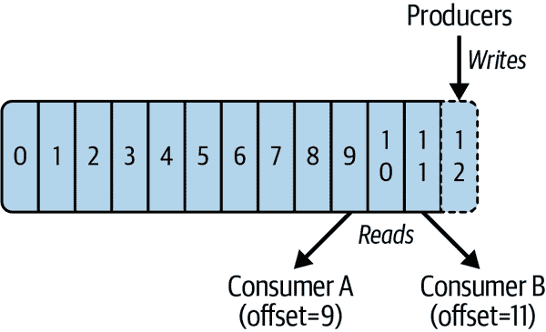
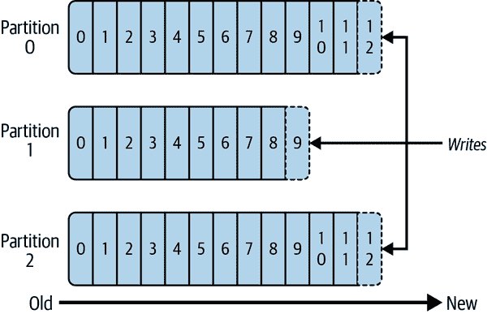
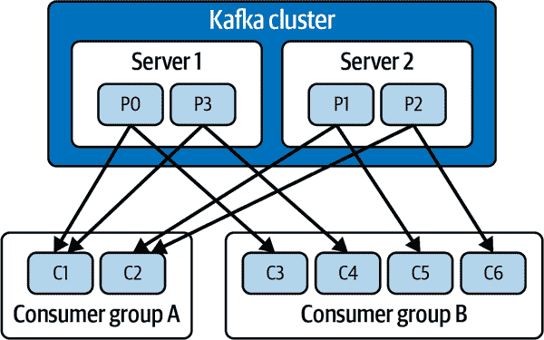

# 第六章：实施流处理应用程序

到目前为止，在本书中，我们一直在使用 Ray 来实现无服务器批处理应用程序。在这种情况下，数据被收集或者从用户那里提供，然后用于计算。另一个重要的用例组是需要您实时处理数据的情况。我们使用过载的术语*实时*来表示在某些延迟约束条件下处理数据。这种类型的数据处理称为*流处理*。

在本书中，我们将*流*定义为在数据生成接近时间点时采取行动。

一些常见的流处理[用例](https://oreil.ly/QQnmm)包括以下内容：

日志分析

一种了解硬件和软件状态的方式。通常作为流日志的分布式处理实现，即在产生日志时即时处理流。

欺诈检测

监控金融交易并查找实时信号的异常，以及停止欺诈交易。

网络安全

监控系统与用户的互动以检测异常，允许实时识别安全问题并隔离威胁。

流处理物流

实时监控汽车、卡车、车队和货物，以优化路由。

物联网数据处理

例如，收集关于引擎的数据，以便在问题变成主要问题之前检测到故障情况。

推荐引擎

用于根据在线行为了解用户兴趣，用于提供广告、推荐产品和服务等。

当谈到在 Ray 中实现流处理应用程序时，您目前有两个主要选项：

+   Ray 的生态系统提供了许多底层组件，这些组件在前几章中已经描述过，可以用于自定义实现流处理应用程序。

+   可以使用外部库和工具与 Ray 一起实现流处理。

Ray 并非作为一个流处理系统构建。它是一个生态系统，使公司能够在这些低级基元上构建流处理系统。你可以找到多个大公司和小公司用户构建基于 Ray 的流处理应用程序的故事。

说到这里，在 Ray 上构建一个小型流处理应用程序将为您提供一个完美的例子，展示如何思考 Ray 应用程序以及如何有效使用 Ray，并将帮助您理解流处理应用程序的基础知识以及如何利用 Ray 的能力来实现它。即使您决定使用外部库，这些材料也将帮助您更好地决定是否以及如何使用这些库。

实施流处理应用程序的一个最受欢迎的方法是使用[Apache Kafka](https://oreil.ly/kMiQC)连接数据生产者和实施数据处理的消费者。在深入研究 Ray 的流处理实现之前，让我们先快速介绍一下 Kafka。

# [Apache Kafka](https://oreil.ly/kMiQC)

这里仅描述了对我们讨论有关的 Kafka 功能。有关详细信息，请参阅[Kafka 文档](https://oreil.ly/E9Inp)。

## Kafka 基础概念

尽管许多人认为 Kafka 是一种类似于例如[RabbitMQ](https://oreil.ly/UD8ov)的消息系统，但实际上它是完全不同的东西。Kafka 是一个[分布式日志](https://oreil.ly/zXwQs)，按顺序存储记录（见图 6-1）¹。



###### 图 6-1\. 分布式日志

Kafka 记录是键值对。（键和值都是可选的，可以使用空值来标记现有值的删除。）键和值都被表示为字节数组，并且对 Kafka 本身是不透明的。生产者始终写入日志的末尾，而消费者可以选择他们希望从哪个位置（偏移量）读取。

Kafka 等面向日志的系统与 RabbitMQ 等消息系统的主要区别如下：

+   队列系统中的消息是短暂的；它们只在系统中保留到被传递。另一方面，日志系统中的消息是持久的。因此，您可以在日志系统中重播消息，这在传统消息系统中是不可能的²。

+   在传统的消息代理中，管理消费者及其偏移量，而在日志系统中，消费者负责管理其偏移量。这使得基于日志的系统能够支持更多的消费者。

与消息系统类似，Kafka 将数据组织成*主题*。不同于消息系统的是，Kafka 中的主题是纯逻辑构造，由多个分区组成（见图 6-2）。



###### 图 6-2\. 主题的解剖

分区中的数据是顺序的，并可以在多个代理（broker）之间复制。分区是一种重要的可扩展性机制，允许单独的消费者并行读取专用分区，并允许 Kafka 将分区分开存储。

在向主题写入时，Kafka 支持两种主要的分区机制：如果未定义键，则使用轮询分区，将主题的消息均匀分布在分区中；如果定义了键，则写入的分区由键确定。默认情况下，Kafka 使用键哈希进行分区。您还可以使用 Kafka 实现自定义的分区机制。消息排序仅在分区内部进行，因此要按顺序处理的任何消息必须位于同一分区中。

将 Kafka 以多个（1 至 *n*）经纪人（服务器）组成的集群形式部署，以维护负载平衡。³ 根据配置的复制因子，每个分区可以存在于一个或多个经纪人上，这可以提高 Kafka 的吞吐量。Kafka 客户端可以连接到任何经纪人，并且经纪人会将请求透明地路由到正确的经纪人之一。

要理解应用程序如何与 Kafka 一起扩展，您需要理解 Kafka 消费者组的工作方式（图 6-3）。



###### 图 6-3\. Kafka 消费者组

您可以分配从相同主题集中读取的消费者到一个 *消费者组*。然后 Kafka 为组中的每个消费者分配一个分区子集。

例如，如果您有一个具有 10 个分区和单个消费者的主题，这个消费者将读取所有主题的分区。对于相同的主题，如果您的消费者组中有 5 个消费者，每个消费者将从主题中读取两个分区。如果您有 11 个消费者，则其中 10 个消费者将各自读取一个分区，而第 11 个将不读取任何数据。

如您所见，您可以扩展 Kafka 读取的两个主要因素是分区数量和消费者组中的消费者数量。向消费者组添加更多消费者比添加新分区更容易，因此超额配置分区数量是最佳实践。

## Kafka API

如 [Kafka 文档](https://oreil.ly/1Edbr) 所定义，Kafka 具有五个核心 API 组：

生产者 API

允许应用程序向 Kafka 集群中的主题发送数据流

消费者 API

允许应用程序从 Kafka 集群中的主题读取数据流

AdminClient API

允许管理和检查主题、经纪人和其他 Kafka 对象

流 API

允许将输入主题的数据流转换到输出主题

连接 API

允许实现连接器，持续地从源系统或应用程序拉取到 Kafka，或者从 Kafka 推送到接收系统或应用程序

这些 API 实现了多种 [语言](https://oreil.ly/gPVs8)，包括 Java、C/C++、Go、C# 和 Python。我们将使用 Kafka 的 [Python API](https://oreil.ly/c7g3l) 与 Ray 集成，实现前三个 API 组，这对我们的目的足够了。关于使用 Python Kafka API 的简单示例，请参阅本书的 [GitHub 仓库](https://oreil.ly/0VJ3D)。

与其他消息传递系统不同，Kafka 不保证不重复的消息。相反，每个 Kafka 消费者负责确保消息仅被处理一次。

###### 注意

如果您有兴趣了解更多信息，Confluent 的[“Kafka Python Client”文档](https://oreil.ly/QOfMd)提供了有关提交选项及其对交付保证的影响的更多信息。默认情况下，Python 客户端使用自动提交，这也是我们在示例中使用的。对于实际实现，请考虑您需要提供的交付保证（精确一次、至少一次等），并使用适当的提交方法。

# 使用 Kafka 与 Ray

现在您已经了解了 Kafka 及其基本 API，让我们来看看如何将 Kafka 与 Ray 集成的选项。我们将实现 Kafka 消费者和生产者都作为 Ray actor。⁴ 使用 Ray actor 与 Kafka 的原因如下：

+   Kafka 消费者在一个无限循环中运行，等待新记录的到来，并且需要跟踪已消费的消息。作为一个有状态的服务，Ray actor 提供了实现 Kafka 消费者的理想范式。

+   将 Kafka 生产者放入 actor 中，您可以异步地将记录写入任何 Kafka 主题，而无需创建单独的生产者。

一个简单的 Kafka 生产者 actor 的实现如示例 6-1 所示。

##### 示例 6-1\. [Kafka 生产者 actor](https://oreil.ly/5Ycum)

```py
@ray.remote
class KafkaProducer:
   def __init__(self, broker: str = 'localhost:9092'):
       from confluent_kafka import Producer
       conf = {'bootstrap.servers': broker}
       self.producer = Producer(**conf)

   def produce(self, data: dict, key: str = None, topic: str = 'test'):

       def delivery_callback(err, msg):
           if err:
               print('Message failed delivery: ', err)
           else:
               print(f"Message delivered to topic {msg.topic()} " +
               f"partition {msg.partition()} offset {msg.offset()}')

       binary_key = None
       if key is not None:
           binary_key = key.encode('UTF8')
       self.producer.produce(topic=topic, value=json.dumps(data).encode('UTF8'),
       key=binary_key, callback=delivery_callback)
       self.producer.poll(0)

   def destroy(self):
       self.producer.flush(30)
```

此示例中的 actor 实现包括以下方法：

构造函数

此方法根据 Kafka 集群的位置初始化 Kafka 生产者。

`produce`

这是您调用以发送数据的方法。它将要写入 Kafka 的数据（作为 Python 字典）、可选键（作为字符串）和要写入的 Kafka 主题。在这里，我们选择使用字典来表示数据，因为这是一种通用的表示数据的方式，并且可以很容易地编组/解组为 JSON。为了调试，我们添加了一个内部的`delivery_callback`方法，用于在写入消息或发生错误时打印输出。

`destroy`

Ray 在退出应用程序之前调用此方法。我们的`destroy`方法等待最多 30 秒，以便交付任何未完成的消息并触发交付报告的回调。

示例 6-2 展示了一个 Kafka 消费者 actor 的简单实现。

##### 示例 6-2\. [Kafka 消费者 actor](https://oreil.ly/5Ycum)

```py
@ray.remote
class KafkaConsumer:
   def __init__(self, callback, group: str = 'ray', broker: str = 'localhost:9092',
       topic: str = 'test', restart: str = 'latest'):
       from confluent_kafka import Consumer
       from uuid import uuid4
       # Configuration
       consumer_conf = {'bootstrap.servers': broker,   # Bootstrap server
                'group.id': group,                      # Group ID
                'session.timeout.ms': 6000,      # Session tmout
                'auto.offset.reset': restart}         # Restart

       # Create Consumer instance
       self.consumer = Consumer(consumer_conf)
       self.topic = topic
       self.id = str(uuid4())
       self.callback = callback

   def start(self):
       self.run = True
       def print_assignment(consumer, partitions):
           print(f'Consumer {self.id}')
           print(f'Assignment: {partitions}')

       # Subscribe to topics
       self.consumer.subscribe([self.topic], on_assign = print_assignment)
       while self.run:
           msg = self.consumer.poll(timeout=1.0)
           if msg is None:
               continue
           if msg.error():
               print(f"Consumer error: {msg.error()}")
           else:
               # Proper message
               self.callback(self.id, msg)
   def stop(self):
       self.run = False

   def destroy(self):
       self.consumer.close()
```

此示例中的消费者 actor 具有以下方法：

构造函数

初始化 Kafka 消费者。与生产者相比，这里有更多的参数。除了经纪人位置外，您还需要指定以下内容：

+   主题名称

+   消费者组名称（用于并行运行）

+   重新启动，配置客户端在从无偏移量启动或者当前偏移量在服务器上不存在时的行为⁵

+   回调函数，指向客户端用于处理消息的函数

`start`

运行一个无限循环，轮询记录。在我们的示例中，新记录只是被打印出来。为了调试，我们还打印了消费者的分区分配情况。

`stop`

更新停止无限循环的类属性。

`destroy`

在应用程序退出之前由 Ray 调用以终止消费者。

除了这两个参与者外，我们还需要设置 Kafka 主题。虽然 Kafka 在使用时会自动创建新的主题，但默认的分区数和[复制因子](https://oreil.ly/ew9Oc)可能不符合您的需求。我们将使用我们的首选设置在 示例 6-3 中创建主题。

##### 示例 6-3\. [主题设置函数](https://oreil.ly/cKafn)

```py
def setup_topics(broker: str = 'localhost:9092', topics: [] = ['test'],
                partitions: int = 10, replication: int = 1):
   # Re-create topic
   # Wait for operation completion method
   def wait_for_operation_completion(futures: dict, success: str, failure: str):
       for topic, f in futures.items():
           try:
               f.result()  # The result itself is None
               print(f"Topic {topic} {success}")
           except Exception as e:
               print(f"{failure} {topic} error {e}")

   admin = AdminClient({'bootstrap.servers': broker})

   # Delete topics
   fs = admin.delete_topics(topics)

   # Wait for each operation to finish.
   wait_for_operation_completion(fs, " is deleted", "Failed to delete topic ")

   # Wait to make sure topic is deleted
   sleep(3)
   # Call create_topics to asynchronously create topics.
   new_topics = [NewTopic(topic, num_partitions=partitions,
                          replication_factor=replication) for topic in topics]
   fs = admin.create_topics(new_topics)

   # Wait for each operation to finish.
   wait_for_operation_completion(fs, " is created", "Failed to create topic ")
```

因为主题可能已经存在，所以代码首先删除它们。一旦删除完成，代码会等待一段时间，以确保删除在集群上生效，然后使用目标分区数和复制因子重新创建主题。

有了这三个组件，您现在可以创建一个 Ray 应用程序来发布和从 Kafka 中读取消息。您可以在本地或集群上运行此应用程序。Ray 应用程序本身看起来像 示例 6-4。

##### 示例 6-4\. [将所有内容整合在一起](https://oreil.ly/97nue)

```py
# Simple callback function to print topics
def print_message(consumer_id: str, msg):
    print(f"Consumer {consumer_id} new message: topic={msg.topic()} "
          f"partition= {msg.partition()} offset={msg.offset()} "
          f"key={msg.key().decode('UTF8')}")
    print(json.loads(msg.value().decode('UTF8')))
# Set up topics
setup_topics()
# Set up random number generator
seed(1)
# Start Ray
ray.init()
# Start consumers and producers
n_consumers = 1     # Number of consumers
consumers = [KafkaConsumer.remote(print_message) for _ in range(n_consumers)]
producer = KafkaProducer.remote()
refs = [c.start.remote() for c in consumers]
# Publish messages
user_name = 'john'
user_favorite_color = 'blue'
# Loop forever publishing messages to Kafka
try:
   while True:
       user = {
           'name': user_name,
           'favorite_color': user_favorite_color,
           'favorite_number': randint(0, 1000)
       }
       producer.produce.remote(user, str(randint(0, 100)))
       sleep(1)

# End gracefully
except KeyboardInterrupt:
   for c in consumers:
       c.stop.remote()
finally:
   for c in consumers:
       c.destroy.remote()
   producer.destroy.remote()
   ray.kill(producer)
```

此代码执行以下操作：

1.  定义了一个简单的回调函数，用于 Kafka 消费者，只是打印消息。

1.  初始化 Ray。

1.  创建所需的主题。

1.  同时启动生产者和消费者（该代码允许我们指定要使用的消费者数量）。

1.  对所有创建的消费者调用 `start` 方法。

1.  一旦所有消费者都创建完毕，生产者就开始每秒发送一次 Kafka 请求。

此外，代码还实现了优雅的终止，确保在作业被中断时清理所有资源。

一旦代码运行，它将生成 示例 6-5 中显示的输出。

##### 示例 6-5\. 单一消费者的执行结果

```py
Topic  test  is deleted
Topic  test  is created
2021-08-23 17:00:57,951	INFO services.py:1264 -- View the Ray dashboard at http://...
(pid=19981) Consumer  04c698a5-db3a-4da9-86df-cd7d6fb7dc6d
(pid=19981) Assignment: TopicPartition{topic=test,partition=0,offset=-1001,error=...
…………………………………………………………………………………………..
(pid=19981) Consumer  ... new message: topic= test  partition= 8  offset= 0  key= 57
(pid=19981) {'name': 'john', 'favorite_color': 'blue', 'favorite_number': 779}
(pid=19981) Consumer  ... new message: topic= test  partition= 2  offset= 0  key= 63
(pid=19981) {'name': 'john', 'favorite_color': 'blue', 'favorite_number': 120}
(pid=19981) Consumer  ... new message: topic= test  partition= 8  offset= 1  key= 83
(pid=19981) {'name': 'john', 'favorite_color': 'blue', 'favorite_number': 483}
(pid=19977) Message delivered to topic  test  partition  8  offset 0
(pid=19977) Message delivered to topic  test  partition  2  offset 0
(pid=19977) Message delivered to topic  test  partition  8  offset 1
(pid=19981) Consumer  ... new message: topic= test  partition= 8  offset= 2  key= 100
(pid=19981) {'name': 'john', 'favorite_color': 'blue', 'favorite_number': 388}
(pid=19981) Consumer  ... new message: topic= test  partition= 5  offset= 0  key= 12
(pid=19981) {'name': 'john', 'favorite_color': 'blue', 'favorite_number': 214}
(pid=19977) Message delivered to topic  test  partition  8  offset 2
(pid=19981) Consumer  ... new message: topic= test  partition= 1  offset= 0  key= 3
(pid=19981) {'name': 'john', 'favorite_color': 'blue', 'favorite_number': 499}
(pid=19977) Message delivered to topic  test  partition  5  offset 0
(pid=19981) Consumer  ... new message: topic= test  partition= 6  offset= 0  key= 49
(pid=19981) {'name': 'john', 'favorite_color': 'blue', 'favorite_number': 914}
(pid=19977) Message delivered to topic  test  partition  1  offset 0
(pid=19977) Message delivered to topic  test  partition  6  offset 0
(pid=19981) Consumer  ... new message: topic= test  partition= 8  offset= 3  key= 77
…………………………...
```

如您从结果中可以看到的那样，执行以下操作：

1.  删除并重新创建主题 `test`。

1.  创建一个消费者，监听一个主题的所有分区（这里我们只运行一个消费者）。

1.  处理消息。请注意，生产者的消息会被传递到不同的分区，但始终由单个消费者接收和处理。

# 扩展我们的实现

现在一切都正常运行，让我们看看如何扩展我们的实现。正如本章前面讨论的那样，扩展从 Kafka 读取消息的应用程序的基本方法是增加 Kafka 消费者的数量（假设主题有足够的分区）。幸运的是，代码（[示例 6-4）已经支持这一点，所以我们可以通过设置 `n_consumer=5` 来轻松增加消费者的数量。一旦完成这个更新，重新运行代码将生成 示例 6-6 的输出。

##### Example 6-6\. 五个消费者的执行结果

```py
Topic  test  is deleted
Topic  test  is created
2021-08-23 17:15:12,353	INFO services.py:1264 -- View the Ray dashboard at http://...
(pid=20100) Message delivered to topic  test  partition  8  offset 0
(pid=20100) Message delivered to topic  test  partition  2  offset 0
(pid=20103) Consumer  9e2773d4-f006-4d4d-aac3-fe75ed27f44b
(pid=20103) Assignment: TopicPartition{topic=test,partition=0,offset=-1001,error=...
(pid=20107) Consumer  bdedddd9-db16-4c24-a7ef-338e91b4e100
(pid=20107) Assignment: [TopicPartition{topic=test,partition=4,offset=-1001,error=...
(pid=20101) Consumer  d76b7fad-0b98-4e03-92e3-510aac2fcb11
(pid=20101) Assignment: [TopicPartition{topic=test,partition=6,offset=-1001,error=...
(pid=20106) Consumer  e3d181af-d095-4b7f-b3d6-830299c207a8
……………………………………………………………………………………..
(pid=20100) Message delivered to topic  test  partition  8  offset 1
(pid=20104) Consumer ... new message: topic= test  partition= 8  offset= 2  key= 100
(pid=20104) {'name': 'john', 'favorite_color': 'blue', 'favorite_number': 388}
(pid=20100) Message delivered to topic  test  partition  8  offset 2
(pid=20107) Consumer ... new message: topic= test  partition= 5  offset= 0  key= 12
(pid=20107) {'name': 'john', 'favorite_color': 'blue', 'favorite_number': 214}
(pid=20100) Message delivered to topic  test  partition  5  offset 0
(pid=20103) Consumer ... new message: topic= test  partition= 1  offset= 0  key= 3
(pid=20103) {'name': 'john', 'favorite_color': 'blue', 'favorite_number': 499}
(pid=20100) Message delivered to topic  test  partition  1  offset 0
(pid=20101) Consumer ... new message: topic= test  partition= 6  offset= 0  key= 49
(pid=20101) {'name': 'john', 'favorite_color': 'blue', 'favorite_number': 914}
(pid=20100) Message delivered to topic  test  partition  6  offset 0
(pid=20104) Consumer ... new message: topic= test  partition= 8  offset= 3  key= 77
(pid=20104) {'name': 'john', 'favorite_color': 'blue', 'favorite_number': 443}
(pid=20100) Message delivered to topic  test  partition  8  offset 3
(pid=20103) Consumer ... new message: topic= test  partition= 1  offset= 1  key= 98
(pid=20103) {'name': 'john', 'favorite_color': 'blue', 'favorite_number': 780}
……………………………………………………….
```

在这里，与[Example 6-5 不同，五个 Kafka 消费者中的每一个都开始监听 2 个分区（请记住，我们的主题使用 10 个分区）。您还可以看到消息被传递到不同分区时，它们由不同的消费者实例处理。因此，我们可以手动扩展我们的 Kafka 应用程序，但是自动扩展呢？

与本地 Kubernetes 自动扩展器不同—例如，[KEDA](https://oreil.ly/zJ3yw)，它基于[queue depth](https://oreil.ly/u7uEE)来扩展消费者—Ray 使用了[不同的方法](https://oreil.ly/4cgo2)。Ray 固定数量的消费者并将它们分布在节点上（如果需要，添加节点）。这为每个消费者提供了更好的性能，但是当分区不足时仍会遇到问题。

现在您已经知道如何将 Ray 与 Kafka 集成，让我们讨论如何利用这种技术来构建流应用程序。

# 使用 Ray 构建流处理应用程序

流处理有两个重要的类别：

无状态流处理

每个事件完全独立于任何先前事件或可变共享状态进行处理。给定一个事件，流处理器将无论先前到达的数据是什么或执行状态如何，每次都以完全相同的方式处理它。

有状态流处理

事件之间共享状态，可以影响当前事件的处理方式。在这种情况下，状态可以是先前事件的结果或由外部系统产生，用于控制流处理。

无状态流处理实现通常简单而直接。它们需要扩展 Kafka 消费者的`start`方法（见 Example 6-2）来实现对传入消息的任何必要转换。这些转换的结果可以发送到不同的 Kafka 主题或代码的任何其他部分。Javier Redondo 的[“Serverless Kafka Stream Processing with Ray”](https://oreil.ly/S51JF)描述了一个无状态流处理应用程序的示例。

实施有状态流处理通常更加复杂。让我们看看基于[dynamically controlled streams](https://oreil.ly/AliOW)实施有状态流处理的选项。

我们的样本实现使用了一个具有以下特征的加热器控制器示例：⁶

+   消息生产者提供传感器的温度测量的恒定流。

+   温控器的设置被定义为所需的温度 Td 和∆t。

+   温控器设置可以在任何时候到达。

+   当温度低于 Td - ∆t 时，实施会向加热器发送信号以启动。

+   当温度高于 Td + ∆t 时，会向加热器发送信号以停止。

+   这里使用了一个非常简单的加热器模型，当加热器开启时，每 *N*（可配置）分钟温度增加 1 度，关闭时每 *M*（可配置）分钟温度降低 1 度。

以下是我们对原始示例所做的简化：

+   我们不使用 Protobuf 编组，而是使用 JSON 编组（与前面的示例相同），这允许我们通用地编组/解组 Python 字典消息。

+   为了简化我们的实现，我们不像原始示例中那样使用两个队列，而是使用一个包含控制和传感器消息的单个队列，在接收它们时区分两者。尽管在我们的示例中可以工作，但在具有大量消息的实际实现中可能不是一个好的解决方案，因为它可能会减慢传感器消息的处理速度。

有了这些简化，我们现在将演示两种使用 Ray 实现有状态流处理的方法：基于键的方法和基于键独立的方法。

## 基于键的方法

许多有状态的流式应用程序依赖于 Kafka 消息键。请记住，Kafka 分区使用键散列来确定将消息写入到哪个分区。这意味着 Kafka 保证所有具有相同键的消息始终由同一个消费者接收。在这种情况下，可以在接收它们的 Kafka 消费者上本地实现有状态的流处理。因为消费者是作为 Ray actor 实现的，Ray 会跟踪 actor 内部的数据。⁷

对于这个实现，我们创建了一个小型的加热器模拟程序，您可以在[附带的 GitHub 项目](https://oreil.ly/A6iTb)中找到，该程序基于加热器 ID 发布和获取数据。⁸有了这个，你可以像 示例 6-7 中那样实现温度控制器。

##### 示例 6-7\. [温度控制器的实现](https://oreil.ly/VoVAk)

```py
from enum import Enum
class Action(Enum):
    NONE = -1
    OFF = 0
    ON = 1

class BaseTemperatureController:
    def __init__(self, id: str):
        self.current_setting = None
        self.previous_command = -1
        self.id = id

    # Process new message
    def process_new_message(self, message: dict):
        if 'measurement' in message:    # Measurement request
            self.process_sensor_data(message)
        else:                           # Temp set request
            self.set_temperature(message)

    # Set new temperature
    def set_temperature(self, setting: dict):
        desired = setting['temperature']
        updelta = setting['up_delta']
        downdelta = setting['down_delta']
        print(f'Controller {self.id} new temperature setting {desired} up '
              f'delta {updelta} down delta {downdelta}')
        self.current_setting = desired
        self.up_delta = updelta
        self.down_delta = down_delta

    # Process new measurements
    def process_sensor_data(self, sensor: dict) ->bool:
        # Desired temperature is set, otherwise ignore
        if self.current_setting is not None:           
            # Calculate desired action
            measurement = sensor['measurement']
            action = Action.NONE
            if measurement > (self.current_setting + self.up_delta):
                action = Action.ON
            if measurement < (self.current_setting - self.down_delta):
                action = Action.OFF
            # New action
            if action != Action.NONE and self.previous_command != action:  
                self.previous_command = action
                # Publish new action to kafka
                return True
            else:
                return False
        else:
            return False
```

实现是一个 Python 类，具有以下方法：

构造函数接受一个 Kafka 生产者 actor（示例 6-1）。

此类使用 `set_temperature` 将控制数据写入 Kafka，以及此温度控制器的 ID（与加热器设备 ID 相同）。

`process_new_message`

接收消息，并根据其内容调用 `set_temperature` 或 `process_sensordata` 中的一个。

`set_temperature`

处理来自恒温器的新设置温度方法。此消息包含新的期望温度以及额外的加热器特定参数（在其中控制被忽略的温度间隔）。

`process_sensordata`

处理温度控制。如果设置了期望温度，该方法将当前温度与期望温度进行比较，并计算所需的控制（加热器开/关）。为了避免重复发送相同的控制值，该方法还将计算的控制值与当前（缓存的）进行比较，并仅在更改时提交新的控制值。

由于 Kafka 根据键的哈希计算分区，同一个分区可以服务于多个键。为了管理每个分区的多个键，我们引入了一个 `TemperatureControllerManager` 类，其目的是管理各个温度控制器（Example 6-8）。

##### Example 6-8\. [温度控制器管理实现](https://oreil.ly/sQbyW)

```py
class TemperatureControllerManager:
   def __init__(self, producer: KafkaProducer):
       self.controllers = {}
       self.producer = producer

   def process_controller_message(self, key: str,  request: dict):
       if not key in self.controllers:   # Create a new controller
           print(f'Creating a new controller {controller_id}')
           controller = TemperatureController(producer=self.producer, id=key)
           self.controllers[key] = controller
       self.controllers[key].process_new_message(request)
```

此实现基于一个字典来跟踪基于其 ID 的温度控制器。该类提供了两种方法：

构造函数接受一个 Kafka 生产者演员（Example 6-1）

创建一个新的空字典来管理各个温度控制器。

`process_controller_message` 函数

对于每个*本地* Kafka 消费者接收到的新消息，根据一个键来决定是否存在所需的温度控制器。如果不存在，将创建一个新的温度控制器并存储对其的引用。找到或创建控制器后，然后将消息传递给它进行处理。

要将此实现链接到 Kafka 消费者，我们需要稍微修改 Kafka 消费者（Example 6-2）和温度控制器管理器集成（Example 6-9）。

##### Example 6-9\. [将 Kafka 消费者与温度控制器管理器集成](https://oreil.ly/5Ycum)

```py
@ray.remote
class KafkaConsumer:
   def __init__(self, producer: KafkaProducer, group: str = 'ray',
broker: str = 'localhost:9092', topic: str = 'sensor', restart: str = 'earliest'):
       from confluent_kafka import Consumer
       import logging
       # Configuration
       consumer_conf = {'bootstrap.servers': broker,   # Bootstrap server
                'group.id': group,                      # Group ID
                'session.timeout.ms': 6000,            # Session tmout
                'auto.offset.reset': restart}          # Restart

       # Create Consumer instance
       self.consumer = Consumer(consumer_conf)
       self.topic = topic
       self.callback = TemperatureControllerManager(producer).
process_controller_message

   def start(self):
       self.run = True
       def print_assignment(consumer, partitions):
       	print(f'Assignment: {partitions}')

       # Subscribe to topics
       self.consumer.subscribe([self.topic], on_assign = print_assignment)
       while self.run:
       	msg = self.consumer.poll(timeout=1.0)
       	if msg is None:
                 continue
       	If msg.error():
                  print(f'Consumer error: {msg.error()}')
                continue
       	else:
                # Proper message
                print(f"New message: topic={msg.topic()} " +
                f"partition= {msg.partition()} offset={msg.offset()}")
                key = None
                if msg.key() != None:
                    key = msg.key().decode("UTF8")
                print(f'key={key}')
                value = json.loads(msg.value().decode("UTF8"))
                print(f'value = {value}')
                self.callback(key, value)

   def stop(self):
       self.run = False

   def destroy(self):
       self.consumer.close()
```

这种实现与原始实现之间存在一些显著差异：

+   构造函数接受一个额外的参数——Kafka 生产者——该参数在演员初始化时用于创建*温度控制器管理器*。

+   对于每个传入的消息，除了打印它之外，我们还调用温度*控制器管理器*来处理它。

通过这些变更，您可以实现类似于(Example 6-4)的[主程序](https://oreil.ly/e9Lm0)并启动执行。部分执行结果（在 Example 6-10）显示了处理的输出。

##### Example 6-10\. 控制器执行结果

```py
(pid=29041) New message: topic= sensor  partition= 9  offset= 18
(pid=29041) key  1234  value  {'measurement': 45.0}
(pid=29041) New message: topic= sensor  partition= 9  offset= 19
(pid=29041) key  1234  value  {'measurement': 45.2}
(pid=29041) New message: topic= sensor  partition= 9  offset= 20
(pid=29041) key  1234  value  {'measurement': 45.3}
(pid=29041) New message: topic= sensor  partition= 9  offset= 21
(pid=29041) key  1234  value  {'measurement': 45.5}
(pid=29041) New message: topic= sensor  partition= 9  offset= 22
(pid=29041) key  1234  value  {'measurement': 45.7}
(pid=29041) New message: topic= sensor  partition= 9  offset= 23
(pid=29041) key  1234  value  {'measurement': 45.9}
(pid=29041) New message: topic= sensor  partition= 9  offset= 24
(pid=29041) key  1234  value  {'measurement': 46.0}
(pid=29041) New message: topic= sensor  partition= 9  offset= 25
(pid=29041) key  1234  value  {'measurement': 46.2}
(pid=29040) Message delivered to topic  heatercontrol  partition  9  offset 0
(pid=29041) New message: topic= sensor  partition= 9  offset= 26
(pid=29041) key  1234  value  {'measurement': 46.1}
(pid=29041) New message: topic= sensor  partition= 9  offset= 27
(pid=29041) key  1234  value  {'measurement': 46.0}
(pid=29041) New message: topic= sensor  partition= 9  offset= 28
(pid=29041) key  1234  value  {'measurement': 46.0}
(pid=29041) New message: topic= sensor  partition= 9  offset= 29
(pid=29041) key  1234  value  {'measurement': 45.9}
(pid=29041) New message: topic= sensor  partition= 9  offset= 30
(pid=29041) key  1234  value  {'measurement': 45.7}
```

此列表显示了在温度接近期望值（45 度）时控制器的行为。正如预期的那样，温度会持续增加，直到超过 46 度（为了避免控制器的频繁开关，当期望和实际温度之间的差异小于 1 度时，不执行任何操作）。当测量值为 46.2 时，新消息将发送到加热器以关闭，温度开始下降。同时查看此列表，我们可以看到请求始终传递到同一分区（它们具有相同的键）。

对于许多实际的实现来说，基于键的方法是一个很好的选择。这种方法的优势在于所有的数据处理都在同一个 Kafka 消费者 Actor 内部完成。

这样的实现有两个潜在的缺陷：

+   随着键的数量增加，确保这些键均匀分布在 Kafka 主题分区中是必要的。确保这种键分布有时可能需要额外的键设计过程，但默认的哈希通常已经足够。

+   当执行是 CPU 和内存密集型时，执行局部性可能会成为问题。因为所有的执行都是 Kafka 消费者 Actor 的一部分，它的扩展性可能不足以应对高流量。

一些这些缺点可以在独立于键的方法中得到纠正。

## 独立于键的方法

这种方法与之前的方法的不同之处在于，温度控制器（示例 6-8）和温度控制器管理器（示例 6-9）都被转换为[Ray actors](https://oreil.ly/b7hSK)。通过这样做，它们都变成了可单独寻址的，可以放置在任何地方。这种方法会失去执行局部性（可能会导致轻微的执行时间增加），但可以提高解决方案的整体可扩展性（每个 Actor 可以在单独的节点上运行）。如果需要，您可以通过利用 Actor 池（在第四章中描述）进一步提高可扩展性，从而允许 Ray 将执行分割到更多节点上。

# 超越 Kafka

在本章中，您学习了如何使用 Ray 的本地能力通过直接集成 Ray 与 Kafka 来实现流式处理。但是如果您需要使用不同的消息基础设施怎么办？如果您喜欢的通信支撑提供了 Python API，您可以像之前描述的 Kafka 集成一样将其与 Ray 集成。

另一种选择，正如本章开头提到的，是使用外部库——例如项目 [Rayvens](https://oreil.ly/xv2xB)，它在内部利用 [Apache Camel](https://oreil.ly/HT77R)（一个通用集成框架），可以使用各种消息背景。您可以在 Gheorghe-Teodor Bercea 和 Olivier Tardieu 的文章 [“使用 Rayvens 访问数百个事件源和接收器”](https://oreil.ly/y4kYx) 中找到对支持的消息背景的描述以及它们的使用示例。

类似于我们描述的 Kafka 集成，在底层，Rayvens 被实现为一组 Ray actors。Rayvens 的基类 `Stream` 是一个无状态、可序列化的包装器，封装了 `Stream` Ray actor 类，负责跟踪当前的 Rayvens 状态（详见第四章关于使用 actors 管理全局变量的内容），包括当前定义的源和接收器及其连接性。`Stream` 类隐藏了 `Stream` actor 的远程特性，并实现了内部实现所有与底层远程 actor 的通信的包装器。如果您希望在执行时控制更多（例如执行时机），可以直接调用 `Stream` actor 上的方法。当原始流句柄超出范围时，将回收 `Stream` actor。

由于 Rayvens 基于 Camel，它需要设置 Camel 以使其工作。Rayvens 支持两种主要的 Camel 使用选项：

本地模式

Camel 源或接收器与使用 Camel 客户端连接的 `Stream` actor 在同一个执行上下文中运行：同一容器，同一虚拟或物理机器。

运算符模式

Camel 源或接收器在 Kubernetes 集群内运行，依赖 Camel 运算符来管理专用的 Camel Pod。

# 结论

在本章中，您了解了使用 Ray 实现流处理的一种选项。您首先了解了 Kafka 的基础知识——今天最流行的流处理应用背骨，并学习了如何将其与 Ray 集成。然后，您学习了如何使用 Ray 扩展基于 Kafka 的应用程序。我们还概述了使用 Ray 实现无状态和有状态流应用程序的实现方法，这些方法可以作为自定义实现的基础。

最后，我们简要讨论了使用 Kafka 作为传输方式的替代方案。Rayvens 是一个基于 Apache Camel 的通用集成框架，可用于集成各种流式背景。您可以利用这些讨论来决定如何实现您的特定传输。

在下一章中，我们将介绍 Ray 的微服务框架及其用于模型服务的使用方法。

¹ 分布式日志实现的其他示例包括 [Apache BookKeeper](https://oreil.ly/4Km4h)、[Apache Pulsar](https://oreil.ly/ChJdY) 和 [Pravega](https://oreil.ly/getrt)。

² 尽管我们倾向于思考无限日志，但实际上，Kafka 日志受限于相应 Kafka 服务器的磁盘空间。Kafka 引入了[日志保留和清理策略](https://oreil.ly/0wudH)，防止日志无限增长，从而导致 Kafka 服务器崩溃。因此，当我们在生产系统中谈论日志重放时，我们是在谈论在保留窗口内的重放。

³ 更多详细信息，请参阅[Jason Bell 的“Kafka 集群的容量规划”](https://oreil.ly/rC2RY)。Kafka 也作为 Confluent Cloud 等供应商提供的无服务器产品。

⁴ 另一个采用同样方法的例子，请参阅[Javier Redondo 的“使用 Ray 进行无服务器 Kafka 流处理”](https://oreil.ly/iRxWq)。

⁵ `reset`的允许值有`earliest`，它会自动将偏移重置到日志的开头，以及`latest`，它会自动将偏移重置到消费者组最近处理的偏移量。

⁶ 这个例子在[Boris 的“如何使用动态控制流为机器学习模型提供服务”](https://oreil.ly/jekKs)博客文章中进一步描述。

⁷ 如第四章所述，Ray 的 actors 不是持久化的。因此，在节点故障的情况下，actor 状态将丢失。我们可以实现持久性，如第四章中所述，以克服这一问题。

⁸ 注意使用线程来确保 Kafka 消费者无限运行，而不干扰测量计算。再次强调，这是我们为玩具示例而做的简化；在真实实现中，每个对温度控制器的请求应包含一个`replyTo`主题，以确保任何回复都能到达正确的加热器实例。
