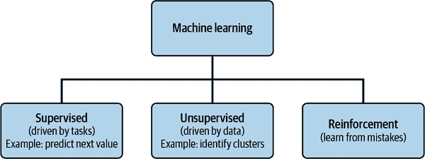
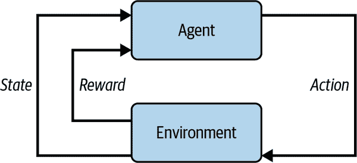
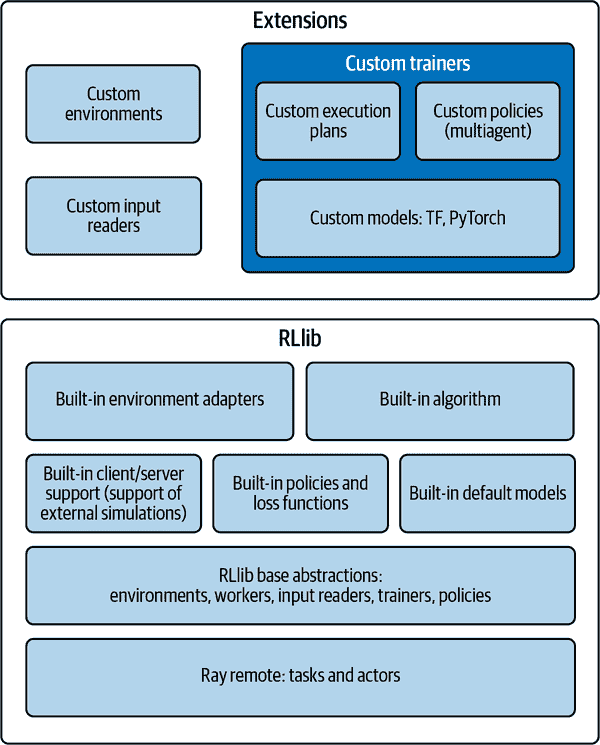

# 第十章：Ray 如何驱动机器学习

现在您已经牢固掌握了 Ray 中为准备数据以训练 ML 模型所需的一切。在本章中，您将学习如何使用流行的 Ray 库[scikit-learn](https://oreil.ly/2a56M)、[XGBoost](https://oreil.ly/TAofd)和[PyTorch](https://oreil.ly/ziXhR)。本章不旨在介绍这些库，因此如果您对其中任何一个不熟悉，建议首先选择一个（我们建议选择 scikit-learn）进行阅读。即使对这些库熟悉的人也可以通过查阅自己喜欢的工具文档来刷新记忆。本章关注的是 Ray 如何用于驱动 ML，而不是 ML 的教程。

###### 注意

如果您有兴趣深入学习 Ray 中的 ML，[*学习 Ray*](https://oreil.ly/k5ItW)由 Max Pumperla 等人（O’Reilly）撰写的全长书籍专注于 ML 与 Ray，可以扩展您的 ML 技能组。

Ray 有两个内置的 ML 库。您将学习如何使用 Ray 的增强学习库[RLlib](https://oreil.ly/3Rv0B)，与 TensorFlow 一起使用，并通过[Tune](https://oreil.ly/9ISlc)进行通用超参数调整，可以与任何 ML 库一起使用。

# 使用 scikit-learn 与 Ray

scikit-learn 是 ML 社区中使用最广泛的工具之一，提供数十种易于使用的 ML 算法。它最初由 David Cournapeau 在 2007 年作为 Google 夏季代码项目开发。通过一致的接口提供广泛的监督和无监督学习算法。

scikit-learn ML 算法包括以下内容：

聚类

用于对未标记数据进行分组，如 k 均值

监督模型

包括广义线性模型、判别分析、朴素贝叶斯、惰性方法、神经网络、支持向量机和决策树等

集成方法

用于组合多个监督模型的预测

scikit-learn 还包含重要的工具支持 ML：

交叉验证

用于评估监督模型在未见数据上的表现

数据集

用于测试数据集和生成具有特定属性的数据集，以研究模型行为

维度减少

用于减少数据中属性数量，以进行总结、可视化和特征选择，例如主成分分析

特征提取

用于定义图像和文本数据的属性

特征选择

用于识别用于创建监督模型的有意义的属性

参数调整

为了充分利用监督模型

流形学习

用于总结和描绘复杂的多维数据

虽然您可以直接在 Ray 中使用大多数 scikit-learn API 来调整模型的超参数，但当您想要并行执行时情况会变得有些复杂。

如果我们使用用于创建模型的基本代码来优化决策树的参数，我们的代码将如示例 10-1 所示。

##### 示例 10-1\. [使用 scikit-learn 构建我们的葡萄酒质量模型](https://oreil.ly/z1KPe)

```py
# Get data
df = pd.read_csv("winequality-red.csv", delimiter=";")
print(f"Rows, columns: {str(df.shape)}")
print(df.head)
print(df.isna().sum())

# Create Classification version of target variable
df['goodquality'] = [1 if x >= 6 else 0 for x in df['quality']]
X = df.drop(['quality','goodquality'], axis = 1)
y = df['goodquality']
print(df['goodquality'].value_counts())

# Normalize feature variables
X_features = X
X = StandardScaler().fit_transform(X)
# Splitting the data
X_train, X_test, y_train, y_test = \
    train_test_split(X, y, test_size=.25, random_state=0)

param_model = {'max_depth':range(10, 20),
                'max_features': range(3,11)}

start = time.time()
model = GridSearchCV(DecisionTreeClassifier(random_state=1),
                     param_grid=param_model,
                     scoring='accuracy',
                     n_jobs=-1)

model = model.fit(X_train, y_train)
print(f"executed in {time.time() - start}, "
      f"nodes {model.best_estimator_.tree_.node_count}, "
      f"max_depth {model.best_estimator_.tree_.max_depth}")

y_pred = model.predict(X_test)
print(classification_report(y_test, y_pred))
```

请注意，在`GridSearchCV`中，我们使用参数`n_jobs=-1`，这会让实现在所有可用处理器上并行运行模型评估。¹ 即使在单机上并行运行模型评估也可以显著提高性能一个数量级。

不幸的是，这在 Ray 集群中并不能直接使用。`GridSearchCV`使用[Joblib](https://oreil.ly/s9x0Y)进行并行执行（和许多其他 scikit-learn 算法一样）。但是 Joblib 不能直接与 Ray 兼容。

Ray [实现了一个 Joblib 后端](https://oreil.ly/80Dwb)，采用 Ray actors 池（见第 4 章），而不是本地进程。这允许你简单地将 Joblib 后端更改为使用 Ray，从而使 scikit-learn 从使用本地进程切换到 Ray。

具体来说，要使示例 10-1 在 Ray 上运行，你需要注册 Ray 的 Joblib 后端，并在`GridSearchCV`执行中使用它，就像在示例 10-2 中一样。

##### 示例 10-2\. [使用 Ray Joblib 后端与 scikit-learn 构建葡萄酒质量模型](https://oreil.ly/cqR34)

```py
# Get data
df = pd.read_csv("winequality-red.csv", delimiter=";")
print(f"Rows, columns: {str(df.shape)}")
print(df.head)
print(df.isna().sum())

# Create Classification version of target variable
df['goodquality'] = [1 if x >= 6 else 0 for x in df['quality']]
X = df.drop(['quality','goodquality'], axis = 1)
y = df['goodquality']
print(df['goodquality'].value_counts())

# Normalize feature variables
X_features = X
X = StandardScaler().fit_transform(X)
# Splitting the data
X_train, X_test, y_train, y_test = train_test_split(X, y, test_size=.25, 
                                                    random_state=0)

param_model = {'max_depth':range(10, 20),
               'max_features': range(3,11)}

start = time.time()

mode = GridSearchCV(DecisionTreeClassifier(random_state=1),
                     param_grid=param_model,
                     scoring='accuracy',
                     n_jobs=-1)

register_ray()
with joblib.parallel_backend('ray'):
    model = mode.fit(X_train, y_train)

model = model.fit(X_train, y_train)
print(f"executed in {time.time() - start}, "
      f"nodes {model.best_estimator_.tree_.node_count}, "
      f"max_depth {model.best_estimator_.tree_.max_depth}")

y_pred = model.predict(X_test)
print(classification_report(y_test, y_pred))
```

# 使用 Boosting 算法与 Ray

由于 Boosting 算法训练多个模型，因此非常适合并行计算。你可以独立训练每个子模型，然后再训练另一个模型来组合结果。目前最流行的两个 Boosting 库如下：

XGBoost

一个优化的分布式梯度提升库，旨在高效、灵活和可移植。它在[梯度提升框架](https://oreil.ly/ceOze)下实现了机器学习算法。XGBoost 提供了并行树提升，也称为梯度提升决策树（GBDT）和梯度提升机（GBM），能够快速准确地解决许多数据科学问题。同样的代码可以运行在多种分布式环境上，包括 Hadoop、Sun Grid Engine（SGE）和消息传递接口（MPI），可以处理数十亿个示例以上的问题。

[LightGBM](https://oreil.ly/PdV9o)

一个快速、分布式、高性能的[梯度提升框架](https://oreil.ly/XZdQD)，基于决策树算法，用于排名、分类和许多其他机器学习任务。

我们将比较 Ray 如何并行训练 XGBoost 和 LightGBM，但是比较这两个库的细节超出了本书的范围。如果你对这两个库的区别感兴趣，可以参考 Sumit Saha 的[“XGBoost vs. LighGBM: How Are They Different”](https://oreil.ly/yk800)。

## 使用 XGBoost

继续我们的葡萄酒质量示例，我们使用 XGBoost 构建模型，并且相关代码在示例 10-3 中展示。

##### 示例 10-3\. [使用 XGBoost 构建我们的葡萄酒质量模型](https://oreil.ly/s6ORf)

```py
# Get data
df = pd.read_csv("winequality-red.csv", delimiter=";")
print(f"Rows, columns: {str(df.shape)}")
print(df.head)
print(df.isna().sum())

# Create Classification version of target variable
df['goodquality'] = [1 if x >= 6 else 0 for x in df['quality']]
X = df.drop(['quality','goodquality'], axis = 1)
y = df['goodquality']
print(df['goodquality'].value_counts())

# Normalize feature variables
X_features = X
X = StandardScaler().fit_transform(X)
# Splitting the data
X_train, X_test, y_train, y_test = \
    train_test_split(X, y, test_size=.25, random_state=0)

start = time.time()
model = xgb.XGBClassifier(random_state=1)
model.fit(X_train, y_train)
print(f"executed XGBoost in {time.time() - start}")
y_pred = model.predict(X_test)
print(classification_report(y_test, y_pred))
```

XGBoost 之所以性能出色，部分原因在于它使用[OpenMP](https://oreil.ly/saVa9)来独立创建树分支，而这种方式并不直接支持 Ray。Ray 通过提供 xgboost-ray 库来与 XGBoost 集成，该库用 Ray actor 池替代了 OpenMP。您可以将此库用于 XGBoost 或 scikit-learn API。在后一种情况下，该库提供了以下估计器的一个插入式替代品：

+   `RayXGBClassifier`

+   `RayXGRegressor`

+   `RayXGBRFClassifier`

+   `RayXGBRFRegressor`

+   `RayXGBRanker`

它还提供了`RayParams`，允许您显式定义 Ray 的执行参数。使用这个库，我们可以修改示例 10-3，使其能够与 Ray 一起工作，如同示例 10-4。

##### 示例 10-4\. [使用 XGBoost Ray 库构建我们的葡萄酒质量模型](https://oreil.ly/EgHdZ)

```py
start = time.time()
model = RayXGBClassifier(
    n_jobs=10,  # In XGBoost-Ray, n_jobs sets the number of actors
    random_state=1
)

model.fit(X=X_train, y=y_train, ray_params=RayParams(num_actors=3))
print(f"executed XGBoost in {time.time() - start}")
```

在这里，我们使用`RayParams`来指定用于并行化的 Ray actor 池的大小。或者，您可以使用`RayXGBClassifier`中的`n_jobs`参数来实现相同的效果。

## 使用 LightGBM

我们展示了如何使用 LightGBM 构建我们的葡萄酒质量模型，详见示例 10-5。

##### 示例 10-5\. [使用 LightGBM 构建我们的葡萄酒质量模型](https://oreil.ly/oHzxy)

```py
# Get data
df = pd.read_csv("winequality-red.csv", delimiter=";")
print(f"Rows, columns: {str(df.shape)}")
print(df.head)
print(df.isna().sum())

# Create Classification version of target variable
df['goodquality'] = [1 if x >= 6 else 0 for x in df['quality']]
X = df.drop(['quality','goodquality'], axis = 1)
y = df['goodquality']
print(df['goodquality'].value_counts())

# Normalize feature variables
X_features = X
X = StandardScaler().fit_transform(X)
# Splitting the data
X_train, X_test, y_train, y_test = \
    train_test_split(X, y, test_size=.25, random_state=0)

train_data = lgb.Dataset(X_train,label=y_train)
param = {'num_leaves':150, 'objective':'binary','learning_rate':.05,'max_bin':200}
param['metric'] = ['auc', 'binary_logloss']

start = time.time()
model = lgb.train(param,train_data,100)
print(f"executed LightGBM in {time.time() - start}")
y_pred = model.predict(X_test)

# Converting probabilities into 0 or 1

for i in range(len(y_pred)):
    if y_pred[i] >= .5:       # Setting threshold to .5
        y_pred[i] = 1
    else:
        y_pred[i] = 0
print(classification_report(y_test, y_pred))
```

类似于 XGBoost，LightGBM 使用 OpenMP 进行并行化。因此，Ray 提供了[Distributed LightGBM on Ray library](https://oreil.ly/l6wuQ)，该库使用 Ray 的 actor 池来实现并行化。类似于 xgboost-ray 库，此库支持原生和 scikit-learn API。在后一种情况下，该库实现了以下估计器的替代：

+   `RayLGBMClassifier`

+   `RayLGBMRegressor`

与 XGBoost 类似，`RayParams`提供了执行 Ray 所需的参数，用于定义 Ray 的执行参数。使用这个库，我们可以修改示例 10-5，使其能够与 Ray 一起工作，如同示例 10-6。

##### 示例 10-6\. [使用 LightGBM Ray 库构建我们的葡萄酒质量模型](https://oreil.ly/pocKo)

```py
model = RayLGBMClassifier(
    random_state=42)

start = time.time()
model.fit(X=X_train, y=y_train, ray_params=RayParams(num_actors=3))
print(f"executed LightGBM in {time.time() - start}")
```

在这里，我们使用`RayParams`来指定用于并行化的 Ray actor 池的大小。或者，您可以使用`RayLGBMClassifier`中的`n_jobs`参数来实现相同的效果。

# 使用 Ray 与 PyTorch

另一个非常流行的机器学习框架是[PyTorch](https://oreil.ly/fMTL8)，这是由 Facebook 开发和维护的开源 Python 深度学习库。PyTorch 简单灵活，因此成为许多学术界和研究人员开发新的深度学习模型和应用的首选。

对于 PyTorch，已经实现了许多特定应用程序的扩展（如文本、计算机视觉和音频数据）。还有很多预训练模型可供直接使用。如果您对 PyTorch 不太熟悉，请参阅 Jason Brownlee 的[PyTorch 教程](https://oreil.ly/zzXb6)，了解其结构、功能和解决各种问题的用法。

我们将继续解决葡萄酒质量问题，并展示如何使用 PyTorch 构建一个用于预测葡萄酒质量的多层感知器（MLP）模型。为此，您需要从创建一个可以扩展和定制以加载您的数据集的自定义 PyTorch [Dataset 类](https://oreil.ly/E1MGh) 开始。对于我们的葡萄酒质量示例，自定义数据集类在 示例 10-7 中展示。

##### 示例 10-7\. [用于加载葡萄酒质量数据的 PyTorch 数据集类](https://oreil.ly/hkLLE)

```py
# dataset
class WineQualityDataset(Dataset):
    # load the dataset
    def __init__(self, path):
        # load the csv file as a dataframe
        df = pd.read_csv(path, delimiter=";")
        print(f"Rows, columns: {str(df.shape)}")
        print(df.head)
        # create Classification version of target variable
        df['goodquality'] = [1 if x >= 6 else 0 for x in df['quality']]
        df = df.drop(['quality'], axis = 1)
        print(df['goodquality'].value_counts())
        # store the inputs and outputs
        self.X = StandardScaler().fit_transform(df.values[:, :-1])
        self.y = df.values[:, -1]
        # ensure input data is floats
        self.X = self.X.astype('float32')
        self.y = self.y.astype('float32')
        self.y = self.y.reshape((len(self.y), 1))

    # number of rows in the dataset
    def __len__(self):
        return len(self.X)

    # get a row at an index
    def __getitem__(self, idx):
        return [self.X[idx], self.y[idx]]

    # get indexes for train and test rows
    def get_splits(self, n_test=0.33):
        # determine sizes
        test_size = round(n_test * len(self.X))
        train_size = len(self.X) - test_size
        # calculate the split
        return random_split(self, [train_size, test_size])
```

请注意，除了最低要求之外，我们还实现了 `get_splits`，一个将原始数据集分成两个部分（一个用于训练，一个用于测试）的方法。

一旦您定义了数据类，就可以使用 PyTorch 制作模型。要在 PyTorch 中定义模型，您需要扩展基本的 PyTorch [Module 类](https://oreil.ly/ShyFD)。为了我们的目的，模型类在 示例 10-8 中呈现。

##### 示例 10-8\. [用于葡萄酒质量的 PyTorch 模型类](https://oreil.ly/CZX2A)

```py
# model definition
class WineQualityModel(Module):
    # define model elements
    def __init__(self, n_inputs):
        super(WineQualityModel, self).__init__()
        # input to first hidden layer
        self.hidden1 = Linear(n_inputs, 10)
        kaiming_uniform_(self.hidden1.weight, nonlinearity='relu')
        self.act1 = ReLU()
        # second hidden layer
        self.hidden2 = Linear(10, 8)
        kaiming_uniform_(self.hidden2.weight, nonlinearity='relu')
        self.act2 = ReLU()
        # third hidden layer and output
        self.hidden3 = Linear(8, 1)
        xavier_uniform_(self.hidden3.weight)
        self.act3 = Sigmoid()

    # forward-propagate input
    def forward(self, X):
        # input to first hidden layer
        X = self.hidden1(X)
        X = self.act1(X)
        # second hidden layer
        X = self.hidden2(X)
        X = self.act2(X)
        # third hidden layer and output
        X = self.hidden3(X)
        X = self.act3(X)
        return X
```

此类构造函数通过定义其层及其连接来构建模型。`forward` 方法定义了如何通过模型进行前向传播的方法。有了这两个类，整体代码看起来像是 示例 10-9。

##### 示例 10-9\. [葡萄酒质量模型构建的 PyTorch 实现](https://oreil.ly/6TIHG)

```py
# ensure reproducibility
torch.manual_seed(42)
# load the dataset
dataset = WineQualityDataset("winequality-red.csv")

# calculate split
train, test = dataset.get_splits()
# prepare data loaders
train_dl = DataLoader(train, batch_size=32, shuffle=True)
test_dl = DataLoader(test, batch_size=32, shuffle=False)

# train the model
model = WineQualityModel(11)
# define the optimization
criterion = BCELoss()
optimizer = SGD(model.parameters(), lr=0.01, momentum=0.9)
start = time.time()
# enumerate epochs
for epoch in range(500):
    # enumerate mini batches
    for i, (inputs, targets) in enumerate(train_dl):
        # clear the gradients
        optimizer.zero_grad()
        # compute the model output
        yhat = model(inputs)
        # calculate loss
        loss = criterion(yhat, targets)
        # credit assignment
        loss.backward()
        # update model weights
        optimizer.step()
print(f"Build model in {time.time() - start}")
print(model)
# evaluate a model
predictions, actuals = list(), list()
for i, (inputs, targets) in enumerate(test_dl):
    # evaluate the model on the test set
    yhat = model(inputs)
    # retrieve numpy array
    yhat = yhat.detach().numpy()
    actual = targets.numpy()
    actual = actual.reshape((len(actual), 1))
    # round to class values
    yhat = yhat.round()
    # store
    predictions.append(yhat)
    actuals.append(actual)
predictions, actuals = vstack(predictions), vstack(actuals)
# calculate accuracy
acc = accuracy_score(actuals, predictions)
print("Model accuracy", acc)
```

示例 10-9 可以运行，但 Ray 与 [Lightning](https://oreil.ly/SCakx)（之前称为 PyTorch Lightning）集成，而不是 PyTorch。 Lightning 会结构化您的 PyTorch 代码，使其可以抽象出训练的细节。这使得 AI 研究可扩展且快速迭代。

要将 示例 10-9 转换为 Lightning，我们首先需要修改 示例 10-8。在 Lightning 中，它需要派生自 [`lightning_module`](https://oreil.ly/sFSCd)，而不是 `module`，这意味着我们需要向我们的模型添加两种方法（示例 10-10）。

##### 示例 10-10\. [Lightning 模型额外功能用于葡萄酒质量](https://oreil.ly/1eTnI)

```py
    # training step
    def training_step(self, batch, batch_idx):
        x, y = batch
        y_hat = self(x)
        loss = self.bce(y_hat, y)
        return loss
    # optimizer
    def configure_optimizers(self):
        return Adam(self.parameters(), lr=0.02)
```

这里的 `training_step` 方法定义了一个单独的步骤，而 `configure_optimized` 定义了要使用的优化器。当您将此与 示例 10-8 进行比较时，您会注意到某些例子的代码已经移到了这两个方法中（这里我们使用 `Adam` 优化器而不是 `BCELoss` 优化器）。有了这个更新的模型类，模型训练看起来像是 示例 10-11。

##### 示例 10-11\. [葡萄酒质量模型构建的 Lightning 实现](https://oreil.ly/T7xza)

```py
# train
trainer = Trainer(max_steps=1000)
trainer.fit(model, train_dl)
```

请注意，与 示例 10-9 不同，其中训练是以编程方式实现的，Lightning 引入了一个 trainer 类，该类在内部实现了一个 trainer 循环。这种方法允许所有所需的优化都在训练循环中进行。

PyTorch 和 Lightning 都使用 Joblib 通过内置的 [`ddp_cpu` 后端](https://oreil.ly/RNLuq)或更普遍地说，[Horovod](https://oreil.ly/x8Ba2) 分发训练。与其他库一样，为了允许 Ray 上的分布式 Lightning，Ray 有一个库 [分布式 PyTorch Lightning 训练](https://oreil.ly/Ii51T)，它为使用 Ray 进行分布式训练添加了新的 Lightning 插件。这些插件允许您快速轻松地并行化训练，同时仍然获得 Lightning 的所有好处，并使用您想要的训练协议，无论是 `ddp_cpu` 还是 Horovod。

一旦将插件添加到 Lightning 训练器中，您就可以将它们配置为将训练并行化到笔记本电脑的所有核心，或跨大规模多节点、多 GPU 集群，而无需额外的代码更改。此库还与 [Ray Tune](https://oreil.ly/ZJDeP) 集成，因此您可以执行分布式超参数调整实验。

`RayPlugin` 类提供了在 Ray 集群上的分布式数据并行（DDP）训练。PyTorch DDP 被用作 PyTorch 的分布式训练协议，而在这种情况下，Ray 被用于启动和管理训练工作进程。使用此插件的基本代码如 示例 10-12 所示。

##### 示例 10-12\. [使我们的葡萄酒质量模型构建的 Lightning 实现在 Ray 上运行](https://oreil.ly/oF44p)

```py
# train
plugin = RayPlugin(num_workers=6)
trainer = Trainer(max_steps=1000, plugins=[plugin])
trainer.fit(model, train_dl)
print(f"Build model in {time.time() - start}")
print(model)
```

该库中包含的另外两个插件如下：

HorovodRayPlugin

与 Horovod 集成为分布式训练协议。

RayShardedPlugin

与 [FairScale](https://oreil.ly/drOkZ) 集成，以在 Ray 集群上提供分片 DDP 训练。通过分片训练，您可以利用数据并行训练的可伸缩性，同时大大减少训练大型模型时的内存使用。

# 使用 Ray 的强化学习

Ray 最初是作为*强化学习*（RL）的平台而创建的，这是现代人工智能领域最热门的研究课题之一，其受欢迎程度仅增不减。RL 是一种机器学习技术，它使代理能够在交互式环境中通过试错学习，利用自身的行动和经验反馈；参见 图 10-1。



###### 图 10-1\. 机器学习的类型

监督学习和强化学习都创建了输入和输出之间的映射。但是，监督学习使用一组已知的输入和输出进行训练，而强化学习使用奖励和惩罚作为正面和负面行为的信号。无监督学习和强化学习都利用实验数据，但它们有不同的目标。在无监督学习中，我们正在寻找数据点之间的相似性和差异，而在强化学习中，我们试图找到一个合适的动作模型，以最大化总累积奖励并改进模型。

RL 实现的关键组件如下，并且在图 10-2 中有所描绘：

环境

代理操作的物理世界

状态

代理的当前状态

奖励

从环境中向代理提供的反馈

策略

将代理状态映射到行动的方法

价值

代理在特定状态下执行行动后会收到的未来奖励



###### 图 10-2\. 强化学习模型实现

RL 是一个广泛的主题，其详细信息超出了本书的范围（我们只是试图用一个简单的例子来解释如何开始使用该库），但如果您有兴趣了解更多，Shweta Bhatt 的[“强化学习 101”](https://oreil.ly/YvgzA) 是一个很好的起点。

Ray 的 RLlib 是一个 RL 库，允许生产级高度分布式 RL 工作负载，同时为不同行业的各种应用提供统一且简单的 API。它支持[无模型](https://oreil.ly/tA22j)和[基于模型](https://oreil.ly/n7mB9)的强化学习。

如图 10-3 所示，RLlib 是建立在 Ray 之上的，提供现成的高度分布式算法、策略、损失函数和默认模型。



###### 图 10-3\. RLlib 组件

*策略* 封装了 RL 算法的核心数值组件。它包括一个策略模型，根据环境变化确定行动，并且定义一个损失函数，根据后处理的环境确定行动的结果。根据环境的不同，RL 可以有单个代理和属性，多个代理的单一策略，或多个策略，每个策略控制一个或多个代理。

代理与之交互的一切都称为*环境*。环境是外部世界，包括代理外的一切。

在给定环境和策略的情况下，策略评估由*工作器*完成。RLlib 提供了一个[RolloutWorker 类](https://oreil.ly/WgnmE)，在大多数 RLlib 算法中都会使用。

在高层次上，RLlib 提供了[训练器类](https://oreil.ly/JRjMw)，用于持有环境交互的策略。通过训练器接口，可以训练策略、创建检查点或计算行动。在多代理训练中，训练器管理多个策略的查询和优化。训练器类通过利用 Ray 的[并行迭代器](https://oreil.ly/2TTeo)来协调运行回合和优化策略的分布式工作流程。

除了 Python 中定义的环境外，Ray 还支持在 [离线数据集](https://oreil.ly/u88nx) 上进行批处理训练，通过 *输入读取器*。这对于 RL 是一个重要的用例，当无法在传统的训练和模拟环境（如化工厂或装配线）中运行时，适当的模拟器不存在。在这种方法中，过去活动的数据用于训练策略。

从单个进程到大型集群，RLlib 中所有数据交换都使用 [样本批次](https://oreil.ly/kP0sH)。样本批次编码一个或多个数据片段。通常，RLlib 从 rollout workers 收集 `rollout_fragment_length` 大小的批次，并将其中一个或多个批次连接成 `train_batch_size` 大小的批次，这是随机梯度下降（SGD）的输入。

RLlib 的主要特性如下：

+   支持最流行的深度学习框架，包括 PyTorch 和 TensorFlow。

+   实施高度分布式学习时，RLlib 算法——[PPO](https://oreil.ly/5oJU8) 或 [IMPALA](https://oreil.ly/dkaNw)——允许您设置 `num_workers` 配置参数，使得您的工作负载可以在数百个 CPU 或节点上运行，从而并行化并加速学习。

+   支持 [多智能体 RL](https://oreil.ly/wc9dO)，允许训练支持以下任何策略的代理。

    +   与共享或分离的策略和/或价值函数的合作性

    +   使用 [自我对弈](https://oreil.ly/c7hyz) 和 [联赛训练](https://oreil.ly/wBnHl) 的对抗场景。

    +   [独立学习](https://oreil.ly/2RRS2) 的中性/共存代理

+   支持外部可插拔模拟器环境的 API，配备了一个可插拔的、现成的 [客户端](https://oreil.ly/aaQ6s) ∕ [服务器](https://oreil.ly/eMn1j) 设置，允许您在“外部”运行数百个独立的模拟器，连接到中央的 RLlib 策略服务器，学习并提供动作。

此外，RLlib 提供了简单的 API 来定制训练和实验工作流的所有方面。例如，您可以通过使用 [OpenAI’s Gym](https://oreil.ly/ECLhC) 或 [DeepMind’s OpenSpiel](https://oreil.ly/eI9y9) 编写自己的 Python 环境，提供自定义的 [TensorFlow/Keras](https://oreil.ly/EQUpK) 或 [PyTorch](https://oreil.ly/nE4r3) 模型，并编写自己的 [策略和损失定义](https://oreil.ly/pbPyT) 或定义自定义的 [探索行为](https://oreil.ly/QUtq7)。

实现 RL 训练的简单代码，以解决倒立摆问题——即 [CartPole](https://oreil.ly/lJIDX)——（该环境存在于 OpenAI 的 Gym 中），如 Example 10-13 所示。

##### 示例 10-13\. [CartPole 强化学习](https://oreil.ly/d6tHJ)

```py
ray.init()
config = {
    # Environment (RLlib understands OpenAI Gym registered strings).
    'env': 'CartPole-v0',
    # Use 4 environment workers (aka "rollout workers") that parallelly
    # collect samples from their own environment clone(s).
    "num_workers": 4,
    'framework': 'tf2',
    'eager_tracing': True,
    # This is just our model arch, choosing the right one is beyond the scope
    # of this book.
    'model': {
        'fcnet_hiddens': [64, 64],
        'fcnet_activation': 'relu',
    },
    # Set up a separate evaluation worker set for the
    # `trainer.evaluate()` call after training.
    'evaluation_num_workers': 1,
    # Only for evaluation runs, render the env.
    'evaluation_config': {
        "render_env": True,
    },
    'gamma': 0.9,
    'lr': 1e-2,
    'train_batch_size': 256,
}

# Create RLlib Trainer.
trainer = agents.ppo.PPOTrainer(config=config)

# Run it for n training iterations. A training iteration includes
# parallel sample collection by the environment workers as well as
# loss calculation on the collected batch and a model update.
for i in range(5):
    print(f"Iteration {i}, training results {trainer.train()}")

# Evaluate the trained Trainer (and render each timestep to the shell's
# output).
trainer.evaluate()
```

示例 10-13 从创建一个训练器的配置开始。配置定义了一个环境，³，工作者数量（我们使用四个），框架（我们使用 TensorFlow 2），模型，训练批量大小和其他执行参数。此配置用于创建训练器。然后我们执行几个训练迭代并显示结果。这就是实现简单 RL 所需要的全部。

你可以通过创建你自己的[环境](https://oreil.ly/APjBE)或引入你自己的[算法](https://oreil.ly/OFzk0)，轻松扩展这个简单的例子。

Michael Galarnyk 在 [“Best Reinforcement Learning Talks from Ray Summit 2021”](https://oreil.ly/4I1Dv) 中描述了 Ray RLlIB 的许多用法示例。

# 使用 Ray 进行超参数调整

在创建 ML 模型时，你经常面临各种选择，从模型类型到特征选择技术。ML 的一个自然扩展是使用类似的技术来找到建立模型时的正确值（或参数）。定义模型架构的参数称为*超参数*，搜索理想模型架构的过程称为*超参数调整*。与指定如何将输入数据转换为期望输出的模型参数不同，超参数定义了如何构造模型。

与提升算法一样，超参数调整特别适合并行化，因为它涉及训练和比较许多模型。根据搜索技术，训练这些单独的模型可能是一个“尴尬地并行”的问题，因为它们之间几乎不需要通信。

这里是一些超参数的示例：

+   应该为线性模型使用的多项式特征的程度

+   决策树允许的最大深度

+   决策树叶节点所需的最小样本数

+   神经网络层的神经元数量

+   神经网络的层数

+   梯度下降的学习率

[Ray Tune](https://oreil.ly/PzkxQ) 是基于 Ray 的超参数调整本地库。Tune 的主要特点如下：

+   它提供了分布式、异步优化的功能，利用了 Ray。

+   同样的代码可以从单机扩展到大型分布式集群。

+   它提供了包括（但不限于）[ASHA](https://oreil.ly/lY6nX)、[BOHB](https://oreil.ly/iAiK9) 和 [Population-Based Training](https://oreil.ly/PrsmS) 在内的最先进的算法。

+   它与 [TensorBoard](https://oreil.ly/FM7uR) 或 [MLflow](https://oreil.ly/pzYA6) 集成以可视化调整结果。

+   它与许多优化库集成，如 [Ax/Botorch](https://oreil.ly/25sEx)、[Hyperopt](https://oreil.ly/gCJ2I) 和 [Bayesian Optimization](https://oreil.ly/xA9nC)，并使它们能够透明地扩展。

+   它支持许多 ML 框架，包括 PyTorch、TensorFlow、XGBoost、LightGBM 和 Keras。

下面是 Tune 的主要组件：

Trainable

一个训练函数，具有一个目标函数。Tune 为 trainable 提供了两个接口 API：函数式和类式。

搜索空间

您的超参数的有效值，可以指定这些值如何被采样（例如，从均匀分布或正态分布中）。Tune 提供各种功能来定义搜索空间和采样方法。

搜索算法

用于超参数优化的算法。Tune 具有与许多流行优化库集成的搜索算法，例如[Nevergrad](https://oreil.ly/x5oaM)和[Hyperopt](https://oreil.ly/G2bGl)。Tune 自动将提供的搜索空间转换为搜索算法/底层库期望的搜索空间。

Trial

执行或运行一个单一超参数配置的逻辑表示。每个试验与 trainable 实例相关联。一组试验组成一个实验。Tune 使用 Ray actors 作为工作节点的进程，以并行运行多个试验。

实验分析

一个由 Tune 返回的对象，具有可用于分析训练的方法。它可以与 TensorBoard 和 MLflow 集成以进行结果可视化。

为了展示如何使用 Tune，让我们优化我们的 PyTorch 葡萄酒质量模型构建实现（示例 10-8）。我们将尝试优化用于构建模型的优化器的两个参数：`lr`和`momentum`。

首先，我们重新组织我们的代码（示例 10-9），引入了三个额外的函数（示例 10-14）。

##### 示例 10-14\. [为我们的 PyTorch 葡萄酒质量模型实现支持函数](https://oreil.ly/dEMDF)

```py
# train function
def model_train(model, optimizer, criterion, train_loader):
    # for every mini batch
    for i, (inputs, targets) in enumerate(train_loader):
        # clear the gradients
        optimizer.zero_grad()
        # compute the model output
        yhat = model(inputs)
        # calculate loss
        loss = criterion(yhat, targets)
        # credit assignment
        loss.backward()
        # update model weights
        optimizer.step()

# test model
def model_test(model, test_loader):
    predictions, actuals = list(), list()
    for i, (inputs, targets) in enumerate(test_loader):
        # evaluate the model on the test set
        yhat = model(inputs)
        # retrieve numpy array
        yhat = yhat.detach().numpy()
        actual = targets.numpy()
        actual = actual.reshape((len(actual), 1))
        # round to class values
        yhat = yhat.round()
        # store
        predictions.append(yhat)
        actuals.append(actual)
    predictions, actuals = vstack(predictions), vstack(actuals)
    # calculate accuracy
    return accuracy_score(actuals, predictions)

# train wine quality model
def train_winequality(config):

    # calculate split
    train, test = dataset.get_splits()
    train_dl = DataLoader(train, batch_size=32, shuffle=True)
    test_dl = DataLoader(test, batch_size=32, shuffle=False)

    # model
    model = WineQualityModel(11)
    # define the optimization
    criterion = BCELoss()
    optimizer = SGD(
        model.parameters(), lr=config["lr"], momentum=config["momentum"])
    for i in range(50):
        model_train(model, optimizer, criterion, train_dl)
        acc = model_test(model, test_dl)

        # send the current training result back to Tune
        tune.report(mean_accuracy=acc)

        if i % 5 == 0:
            # this saves the model to the trial directory
            torch.save(model.state_dict(), "./model.pth")
```

在这段代码中，我们引入了三个支持函数：

`model_train`

封装了模型训练。

`model_test`

封装了模型质量评估。

`train_winequality`

实现了模型训练的所有步骤，并向 Tune 报告它们。这使得 Tune 能够在训练过程中做出决策。

有了这三个函数，与 Tune 的集成非常简单（示例 10-15）。

##### 示例 10-15\. [将模型构建与 Tune 集成](https://oreil.ly/1zhR6)

```py
# load the dataset
dataset = WineQualityDataset("winequality-red.csv")

search_space = {
    "lr": tune.sample_from(lambda spec: 10**(-10 * np.random.rand())),
    "momentum": tune.uniform(0.1, 0.9)
}

analysis = tune.run(
    train_winequality,
    num_samples=100,
    scheduler=ASHAScheduler(metric="mean_accuracy", mode="max"),
    config=search_space
)
```

加载数据集后，代码定义了一个搜索空间——可能的超参数空间——并通过使用`train_winequality`方法进行调优。这里的参数如下：

可调用的

定义了一个训练函数（在我们的案例中是`train_winequality`）。

`num_samples`

指示 Tune 的最大运行次数。

`scheduler`

在这里，我们使用[ASHA](https://oreil.ly/frU6p)，一种用于[原则性提前停止](https://oreil.ly/ASVYC)的可扩展算法。为了使优化过程更有效，ASHA 调度器终止不太有前途的试验，并为更有前途的试验分配更多时间和资源。

`config`

包含算法的搜索空间。

运行上述代码会生成 示例 10-16 中显示的结果。

##### 示例 10-16\. 调整模型结果

```py
+-------------------------------+------------+-----------------+------------- ...

| Trial name | status | loc | lr | momentum | acc | iter | total time (s) |

|-------------------------------+------------+-----------------+------------- ...

| ...00000 | TERMINATED | ... | 2.84411e-07 | 0.170684 | 0.513258 | 50 | 4.6005 |

| ...00001 | TERMINATED | ... | 4.39914e-10 | 0.562412 | 0.530303 | 1 | 0.0829589 |

| ...00002 | TERMINATED | ... | 5.72621e-06 | 0.734167 | 0.587121 | 16 | 1.2244 |

| ...00003 | TERMINATED | ... | 0.104523 | 0.316632 | 0.729167 | 50 | 3.83347 |

……………………………..

| ...00037 | TERMINATED | ... | 5.87006e-09 | 0.566372 | 0.625 | 4 | 2.41358 |

|| ...00043 | TERMINATED | ... | 0.000225694 | 0.567915 | 0.50947 | 1 | 0.130516 |

| ...00044 | TERMINATED | ... | 2.01545e-07 | 0.525888 | 0.405303 | 1 | 0.208055 |

| ...00045 | TERMINATED | ... | 1.84873e-07 | 0.150054 | 0.583333 | 4 | 2.47224 |

| ...00046 | TERMINATED | ... | 0.136969 | 0.567186 | 0.742424 | 50 | 4.52821 |

| ...00047 | TERMINATED | ... | 1.29718e-07 | 0.659875 | 0.443182 | 1 | 0.0634422 |

| ...00048 | TERMINATED | ... | 0.00295002 | 0.349696 | 0.564394 | 1 | 0.107348 |

| ...00049 | TERMINATED | ... | 0.363802 | 0.290659 | 0.725379 | 4 | 0.227807 |

+-------------------------------+------------+-----------------+------------- ...
```

正如您所看到的，虽然我们为模型搜索定义了 50 次迭代，但使用 ASHA 显着提高了性能，因为平均使用的运行次数显著减少（在这个例子中，超过 50% 的情况下只使用了一次迭代）。

# 结论

在本章中，您了解了如何利用 Ray 构建用于扩展执行不同 ML 库（scikit-learn、XGBoost、LightGBM 和 Lightning）的能力的多机器 Ray 集群的方法。

我们向您展示了将现有的 ML 代码移植到 Ray 的简单示例，以及 Ray 如何扩展 ML 库以实现扩展的内部工作原理。我们还展示了使用 Ray 特定实现的 RL 和超参数调整的简单示例。

我们希望通过查看这些相对简单的示例，您能更好地了解如何在日常实现中最好地使用 Ray。

¹ 在这个例子中，我们使用了 `GridSearchCV`，它实现了一种穷举搜索。虽然这对于这个简单的例子有效，但 scikit-learn 目前提供了一个新的库，[Tune-sklearn](https://oreil.ly/p5p8d)，它提供了更强大的 [调整算法](https://oreil.ly/aQoEw) 来显著提高调整速度。这意味着，相同的 Joblib 后端对这些算法的工作方式都是一样的。

² 在我们的测试中，对于 XGBoost，执行时间为 0.15 秒，而对于 LightGBM，执行时间为 0.24 秒。

³ 在这里，我们使用了现有的 [OpenAI Gym 环境](https://oreil.ly/BSXIK)，因此我们只需使用其名称即可。
