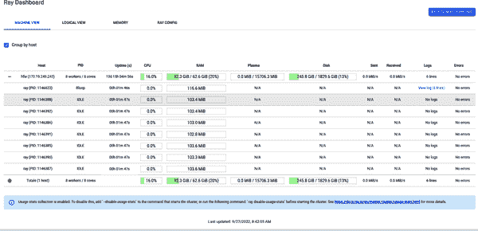
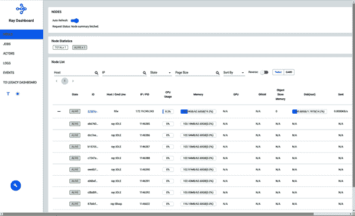
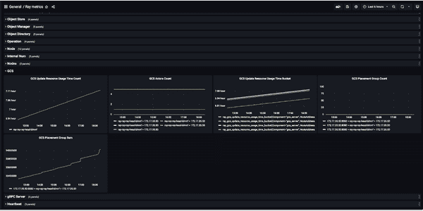

# 第十二章 Ray 在企业中

在企业环境中部署软件通常需要满足额外的要求，特别是在安全方面。企业部署往往涉及多个利益相关者，并且需要为更大的科学家/工程师群体提供服务。虽然不是必需的，但许多企业集群往往具有某种形式的多租户性质，以允许更有效地利用资源（包括人力资源，如运营人员）。

# Ray 依赖项安全问题

不幸的是，Ray 的默认要求文件引入了一些不安全的库。许多企业环境都有某种容器扫描或类似系统来检测此类问题¹。在某些情况下，您可以简单地删除或升级标记的依赖项问题，但当 Ray 将依赖项包含在其 wheel 中时（例如，Apache Log4j 问题），限制自己使用预构建的 wheel 会有严重的缺点。如果发现 Java 或本地库有问题，则需要使用升级版本从源代码重新构建 Ray。Derwen.ai 在其[ray_base repo](https://oreil.ly/Qef7S)中有一个关于在 Docker 中执行此操作的示例。

# 与现有工具进行交互

企业部署通常涉及与现有工具及其产生的数据的交互。此处进行集成的一些潜在点包括使用 Ray 的数据集通用 Arrow 接口与其他工具交互。当数据处于“静止”状态时，Parquet 是与其他工具交互的最佳格式。

# 使用 Ray 与 CI/CD 工具

在大型团队中工作时，持续集成和交付（CI/CD）是项目有效协作的重要组成部分。使用 Ray 与 CI/CD 的最简单选择是在本地模式下使用 Ray，并将其视为正常的 Python 项目。另外，您可以通过使用 Ray 的作业提交 API 提交测试作业并验证结果。这可以让您测试超出单台计算机规模的 Ray 作业。无论您使用 Ray 的作业 API 还是 Ray 的本地模式，都可以使用 Ray 与任何 CI/CD 工具和虚拟环境。

# 与 Ray 进行身份验证

[Ray](https://ray.io)的默认部署使您可以轻松入门，因此，在客户端和服务器之间没有任何身份验证。这种缺乏身份验证意味着任何能连接到您的 Ray 服务器的人都可能提交作业并执行任意代码。通常，企业环境需要比默认配置提供的更高级别的访问控制。

Ray 的 gRPC 端点（而不是作业服务器）可以配置为在客户端和服务器之间进行互相认证的传输层安全性（TLS）。Ray 在客户端和头节点之间以及工作节点之间使用相同的 TLS 通信机制。

###### 警告

Ray 的 TLS 实现要求客户端具有私钥。您应该将 Ray 的 TLS 实现视为类似于共享密钥加密，但速度较慢。

另一种选项是使用作业服务器，将端点保持不安全，但限制可以与端点通信的人。这可以通过入口控制器、网络规则甚至作为虚拟私有网络（VPN）的集成部分来完成，例如[Tailscale 的 Grafana RBAC 规则示例](https://oreil.ly/M5O7q)。幸运的是，Ray 的仪表板——以及作业服务器端点——已绑定到*local​host/127.0.0.1*，并在 8265 端口上运行。例如，如果你在 Kubernetes 上使用 Traefik 作为入口，你可以像这样通过基本身份验证暴露作业 API：

```py
apiVersion: traefik.containo.us/v1alpha1
kind: Middleware
metadata:
  name: basicauth
  namespace: ray-cluster
spec:
  basicAuth:
    secret: basic-auth
-
apiVersion: networking.k8s.io/v1
kind: Ingress
metadata:
  name: longhorn-ingress
  namespace: longhorn-system
annotations:
  traefik.ingress.kubernetes.io/router.entrypoints: websecure
  traefik.ingress.kubernetes.io/router.tls.certresolver: le
  traefik.ingress.kubernetes.io/router.tls: "true"
  kubernetes.io/ingress.class: traefik
  traefik.ingress.kubernetes.io/router.middlewares: ba-ray-cluster@kubernetescrd
        spec:
          rules:
            - host: "mymagicendpoints.pigscanfly.ca"
              http:
                paths:
                - pathType: Prefix
                  path: "/"
                  backend:
                    service:
                      name: ray-head-svc
                      port:
                        number: 8265
```

依赖于限制端点访问的方式存在一个缺点，即任何可以访问该计算机的人都可以向你的集群提交作业，因此对于共享计算资源效果不佳。

# Ray 上的多租户

在箱外，Ray 集群支持多个运行作业。当所有作业都来自同一用户且你不关心隔离作业时，你不需要考虑多租户的影响。

在我们看来，Ray 的租户隔离相对于其他部分来说发展不足。Ray 通过将独立的工作节点绑定到作业来实现每个用户的多租户安全，从而降低了不同用户之间意外信息泄露的机会。与 Ray 的执行环境一样，你的用户可以安装不同的 Python 库，但 Ray 不会隔离系统级库（例如 CUDA）。

我们认为 Ray 中的租户隔离就像门上的锁。它的存在是为了保持诚实的人诚实，并防止意外泄露。然而，像命名的演员这样的命名资源可以从任何其他作业中调用。这是命名演员的预期功能，但由于 Ray 经常使用 cloudpickle，你应该考虑任何命名演员都有允许同一集群上的恶意演员执行任意代码的*潜力*。

###### 警告

命名资源会破坏 Ray 的租户隔离。

虽然 Ray 对多租户有一些支持，但我们建议部署多租户 Kubernetes 或 Yarn 集群。多租户很好地引出了为数据源提供凭据的下一个问题。

# 数据源的凭据

多租户使得数据源的凭据变得复杂，因为你不能依赖基于实例的角色/配置。通过向运行环境添加`env_vars`，你可以在整个作业中指定凭据。理想情况下，你不应该在源代码中硬编码这些凭据，而是从类似 Kubernetes 秘钥中获取并传播这些值：

```py
ray.init(
                runtime_env={
                    "env_vars": {
                        "AWS_ACCESS_KEY_ID": "key",
                        "AWS_SECRET_ACCESS_KEY": "secret",
                    }
                }
            )
```

你还可以使用相同的技术为每个函数分配凭据（例如，如果只有一个演员应该具有写权限），通过分配带有`.option`的运行环境。然而，在实践中，跟踪这些单独的凭据可能会成为一个头疼的问题。

# 永久与临时集群

部署 Ray 时，您必须选择永久集群还是瞬时集群。对于永久集群，多租户问题和确保自动缩放器能够缩小（例如，没有悬空资源）尤为重要。然而，随着越来越多的企业采用 Kubernetes 或其他云原生技术，我们认为瞬时集群的吸引力将增加。

## 瞬时集群

瞬时集群有许多好处。最重要的两个好处是低成本和不需要多租户集群。瞬时集群允许在计算结束时完全释放资源。通过提供瞬时集群，您可以避免多租户问题，这可以减少操作负担。瞬时集群使得试验新版本的 Ray 和新的本地库相对轻量化。这也可以防止强制迁移带来的问题，每个团队可以运行自己的 Ray 版本。⁴

瞬时集群在做出选择时也有一些您应该注意的缺点。最明显的两个缺点是需要等待集群启动，以及在应用程序启动时间之上，不能在集群上使用缓存/持久性。启动瞬时集群取决于能够分配计算资源，这取决于您的环境和预算，可能需要从几秒到几天的时间（在云问题期间）。如果您的计算依赖于大量状态或数据，每次在新集群上启动应用程序时，它都会先读取大量信息，这可能会相当慢。

## 永久集群

除了成本和多租户问题之外，永久集群还带来了额外的缺点。永久集群更容易积累配置“残留物”，当迁移到新集群时可能更难重新创建。随着基础硬件老化，这些集群随时间变得更加脆弱。即使在云中，长时间运行的实例越来越可能遇到故障。永久集群中的长期资源可能最终会包含需要基于监管原因清除的信息。

永久集群还有一些重要的好处，可以很有用。从开发者的角度来看，一个优势是能够拥有长期存在的参与者或其他资源。从运营的角度来看，永久集群不需要同样的启动时间，因此如果需要执行新任务，你不必等待集群变得可用。表 12-1 总结了瞬时和永久集群之间的差异。

表 12-1\. 瞬时和永久集群比较表

|  | 瞬时/瞬时集群 | 永久集群 |
| --- | --- | --- |
| **资源成本** | 通常较低，除非运行时，工作负载可以进行二进制打包或在用户之间共享资源 | 当资源泄漏阻止自动缩放器缩减时成本较高 |
| **库隔离** | 灵活（包括本地） | 仅在 venv/Conda 环境级别隔离 |
| **尝试新版本 Ray 的能力** | 是，可能需要针对新 API 进行代码更改 | 开销较大 |
| **最长 actor 生命周期** | 短暂（与集群一起） | “永久”（除非集群崩溃/重新部署） |
| **共享 actors** | 否 | 是 |
| **启动新应用程序的时间** | 可能较长（依赖云） | 可变（如果集群具有几乎即时的备用容量；否则，依赖于云） |
| **数据读取摊销** | 否（每个集群必须读取任何共享数据集） | 可能（如果结构良好） |

使用短暂集群或永久集群的选择取决于您的用例和要求。在某些部署中，短暂集群和永久集群的混合可能提供正确的权衡。

# 监控

随着您组织中 Ray 集群的规模或数量增长，监控变得越来越重要。Ray 通过其内部仪表板或 Prometheus 提供内置的度量报告，尽管 Prometheus 默认情况下是禁用的。

###### 注意

安装 `ray​[default]` 时会安装 Ray 的内部仪表板，但仅安装 `ray` 不会。

当您独自工作或调试生产问题时，Ray 的仪表板非常出色。如果安装了仪表板，Ray 将打印一条包含指向仪表板的链接的信息日志（例如，`在 http://127.0.0.1:8265 查看 Ray 仪表板`）。此外，`ray.init` 的结果包含 `webui_url`，指向度量仪表板。然而，Ray 的仪表板无法创建警报，因此仅在您知道出现问题时才有帮助。Ray 的仪表板 UI 正在 Ray 2 中升级；图 12-1 显示旧版仪表板，而 图 12-2 显示新版仪表板。



###### 图 12-1\. 旧版（2.0 之前）Ray 仪表板



###### 图 12-2\. 新的 Ray 仪表板

如您所见，新仪表板并非自然演化而来；相反，它是经过有意设计的，并包含新信息。两个版本的仪表板均包含有关执行器进程和内存使用情况的信息。新仪表板还具有用于通过 ID 查找对象的 Web UI。

###### 警告

仪表板不应公开，作业 API 使用相同的端口。

Ray 的指标也可以导出到 Prometheus，Ray 默认会选择一个随机端口。您可以通过查看 *ray.init* 的结果中的 `metrics_export_port` 来找到端口，或者在启动 Ray 的主节点时指定一个固定的端口 `--metrics-export-port=`。Ray 与 Prometheus 的集成不仅提供了与 Grafana 等指标可视化工具的集成（见图 12-3），而且在某些参数超出预定范围时添加了警报功能。



###### 图 12-3\. Ray 的示例 Grafana 仪表板⁵

要获取导出的指标，需要配置 Prometheus 来抓取哪些主机或 Pod。对于静态集群的用户，只需提供一个主机文件即可；但对于动态用户，有[多种选择](https://oreil.ly/RR0kf)。Kubernetes 用户可以使用[pod monitors](https://oreil.ly/85MrY)配置 Prometheus 的 Pod 抓取。由于 Ray 集群没有统一的标签适用于所有节点，因此这里我们使用了两个 Pod Monitor——一个用于主节点，一个用于工作节点。

非 Kubernetes 用户可以使用 Prometheus 的[file-based discovery](https://oreil.ly/eYXbq)，使用 Ray 在主节点自动生成的文件*/tmp/ray/prom_metrics_service​_dis⁠covery.json*。

除了监控 Ray 本身，您还可以在 Ray 内部对代码进行仪表化。您可以将自己的指标添加到 Ray 的 Prometheus 指标中，或者与 OpenTelemetry 集成。正确的指标和仪表化主要取决于您的组织其余部分的使用情况。比较 OpenTelemetry 和 Prometheus 超出了本书的范围。

# 使用 Ray 指标仪表化您的代码

Ray 的内置指标很好地报告了集群的健康状况，但我们通常关心的是应用程序的健康状况。例如，由于所有作业都处于停滞状态而导致的低内存使用的集群在集群级别看起来很好，但我们实际关心的（为用户提供服务、训练模型等）并没有发生。幸运的是，您可以向 Ray 添加自己的指标来监视应用程序的使用情况。

###### Tip

您添加到 Ray 指标的指标会像 Ray 的内置指标一样暴露为 Prometheus 指标。

Ray 指标支持在 `ray.util.metrics` 内的 [counter](https://oreil.ly/aW2y9), [gauge](https://oreil.ly/xBLAh) 和 [histogram](https://oreil.ly/tNiTX) 指标类型。这些指标对象不可序列化，因为它们引用了 C 对象。在记录任何值之前，您需要明确创建该指标。在创建新指标时，可以指定名称、描述和标签。一个常用的标签是指标在 actor 内部使用的 actor 名称，用于 actor 分片。由于它们不可序列化，您需要将它们要么创建并在 actors 内使用，如 Example 12-1，要么使用 [lazy singleton 模式](https://oreil.ly/zKck9)，如 Example 12-2。

##### Example 12-1\. [在 actor 内部使用 Ray 计数器](https://oreil.ly/LEzXb)

```py
# Singleton for reporting a Ray metric

@ray.remote
class MySpecialActor(object):
    def __init__(self, name):
        self.total = 0
        from ray.util.metrics import Counter, Gauge
        self.failed_withdrawls = Counter(
            "failed_withdrawls", description="Number of failed withdrawls.",
            tag_keys=("actor_name",), # Useful if you end up sharding actors
        )
        self.failed_withdrawls.set_default_tags({"actor_name": name})
        self.total_guage = Gauge(
            "money",
            description="How much money we have in total. Goes up and down.",
            tag_keys=("actor_name",), # Useful if you end up sharding actors
        )
        self.total_guage.set_default_tags({"actor_name": name})
        self.accounts = {}

    def deposit(self, account, amount):
        if account not in self.accounts:
            self.accounts[account] = 0
        self.accounts[account] += amount
        self.total += amount
        self.total_guage.set(self.total)

    def withdrawl(self, account, amount):
        if account not in self.accounts:
            self.failed_withdrawls.inc()
            raise Exception("No account")
        if self.accounts[account] < amount:
            self.failed_withdrawls.inc()
            raise Exception("Not enough money")
        self.accounts[account] -= amount
        self.total -= amount
        self.total_guage.set(self.total)
```

##### Example 12-2\. [使用全局单例方法使 Ray 计数器与远程函数一起使用](https://oreil.ly/LEzXb)

```py
# Singleton for reporting a Ray metric

class FailureCounter(object):
    _instance = None

    def __new__(cls):
        if cls._instance is None:
            print('Creating the object')
            cls._instance = super(FailureCounter, cls).__new__(cls)
            from ray.util.metrics import Counter
            cls._instance.counter = Counter(
                "failure",
                description="Number of failures (goes up only).")
        return cls._instance

# This will fail with every zero because divide by zero
@ray.remote
def remote_fun(x):
    try:
        return 10 / x
    except:
        FailureCounter().counter.inc()
        return None
```

OpenTelemetry 可以在包括 Python 在内的多种语言中使用。Ray 具有基本的 OpenTelemetry 实现，但其使用范围不如其 Prometheus 插件广泛。

# 使用 Ray 包装自定义程序

Python 的一个强大功能是使用 [subprocess 模块](https://oreil.ly/rRlWj)⁶ 启动子进程。这些进程可以是系统上的任何 shell 命令或任何应用程序。这种能力允许在 Ray 实现中有许多有趣的选项。我们将在这里展示其中一个选项，即作为 Ray 执行的一部分运行任何自定义 Docker 镜像⁷。Example 12-3 演示了如何实现这一点。

##### Example 12-3\. [在 Ray 远程函数中执行 Docker 镜像](https://oreil.ly/gacKK)

```py
ray.init(address='ray://<*`your IP`*>:10001')

@ray.remote(num_cpus=6)
def runDocker(cmd):
   with open("result.txt", "w") as output:
       result = subprocess.run(
           cmd,
           shell=True,  # Pass single string to shell, let it handle.
           stdout=output,
           stderr=output
       )

   print(f"return code {result.returncode}")
   with open("result.txt", "r") as output:
       log = output.read()
   return log

cmd='docker run --rm busybox echo "Hello world"'

result=runDocker.remote(cmd)
print(f"result: {ray.get(result)}")
```

此代码包含一个简单的远程函数，执行外部命令并返回执行结果。主函数向其传递一个简单的 `docker run` 命令，然后打印调用结果。

此方法允许您在 Ray 远程函数执行的一部分中执行任何现有的 Docker 镜像，这反过来允许多语言 Ray 实现，甚至执行具有特定库需求的 Python 需要为此远程函数运行创建虚拟环境。它还允许在 Ray 执行中轻松包含预构建的镜像。

在 Ray 内部使用 `subprocess` 运行 Docker 镜像只是其有用应用之一。一般来说，可以通过这种方法调用安装在 Ray 节点上的任何应用程序。

# 结论

尽管 Ray 最初是在研究实验室中创建的，您可以通过这里描述的实现增强将 Ray 引入主流企业计算基础设施。具体来说，请确保执行以下操作：

+   仔细评估此操作可能带来的安全性和多租户问题。

+   要注意与 CI/CD 和可观察性工具的集成。

+   决定是否需要永久或短暂的 Ray 集群。

这些考虑因您的企业环境和 Ray 的具体用例而异。

到达本书的这一点，您应该对所有 Ray 基础知识有了扎实的掌握，并了解下一步的指引。我们期待您加入 Ray 社区，并鼓励您查看[社区资源](https://oreil.ly/9xrm8)，包括[Ray 的 Slack 频道](https://oreil.ly/PnLJO)。如果您想看看如何将 Ray 的各个部分组合起来，附录 A 探讨了如何为开源卫星通信系统构建后端的一种方式。

¹ 一些常见的安全扫描工具包括 Grype、Anchore 和 Dagda。

² 使其与 gRPC 客户端配合工作更复杂，因为 Ray 的工作节点需要能够与头节点和 Redis 服务器通信，这在使用本地主机进行绑定时会出现问题。

³ 本书作者中有些人有在 Tailscale 工作的朋友，其他解决方案也完全可以。

⁴ 在实际操作中，我们建议仅支持少数几个版本的 Ray，因为它在快速发展。

⁵ 查看[*Ray metrics-1650932823424.json*](https://oreil.ly/oKtmW)获取配置信息。

⁶ 特别感谢 Michael Behrendt 建议本节讨论的实现方法。

⁷ 这仅适用于使用 VM 上的 Ray 安装的云安装环境。参考附录 B 了解如何在 IBM Cloud 和 AWS 上执行此操作。
