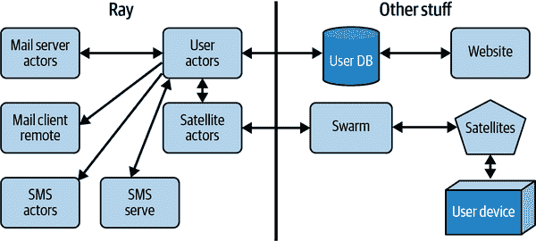

# 附录 A. Space Beaver 案例研究：Actors、Kubernetes 等

[Space Beaver 项目](https://oreil.ly/IDSzc)（来自 Pigs Can Fly Labs）利用 Swarm 和简单邮件传输协议（SMTP）提供被礼貌称为性价比高（即便宜）的离网消息服务。¹ Space Beaver 核心架构的初稿使用了 Scala 和 Akka，但后来我们转而使用 Ray。通过使用 Python 的 Ray 而不是 Scala 的 Akka，我们能够重用网站的对象关系映射（ORM）并简化部署。

虽然在 Kubernetes 上部署 Akka 应用是可能的，但（依据 Holden 的意见）相比使用 Ray 完成相同任务要复杂得多。² 在本附录中，我们将概述 Space Beaver 后端的一般设计，各种 actor 的代码，并展示如何部署它（以及类似的应用）。

###### 注意

您可以在 [Pigs Can Fly Labs GitHub 仓库](https://oreil.ly/cyuw4) 找到此案例研究的代码。

# 高级设计

Space Beaver 的核心要求是作为电子邮件（通过 SMTP）、短信（通过 Twilio）和 Swarm 卫星 API 之间的桥梁。其中大部分涉及一定程度的状态，例如运行 SMTP 服务器，但出站邮件消息可以在没有任何状态的情况下实现。图 A-1 展示了设计的大致轮廓。



###### 图 A-1\. Actor 布局

# 实施

现在您已经看到了一个大致的设计，是时候探索您在整本书中学到的模式是如何应用来将所有内容整合在一起的了。

## 出站邮件客户端

出站邮件客户端是唯一一个无状态的代码，因为它为每个出站消息建立连接。由于它是无状态的，我们将其实现为常规的远程函数，每个传入请求创建一个。根据传入请求的数量，Ray 可以根据需要扩展或缩减远程函数实例的数量。由于客户端可能在外部主机上阻塞，因此能够扩展包含邮件客户端的远程函数实例的数量非常有用。

###### 提示

调度每个远程函数调用都需要一些开销。在我们的情况下，预期的消息速率并不高。如果您对所需并发有很好的了解，应考虑使用 Ray 的 `multiprocessing.Pool` 来避免函数创建开销。

但是，我们希望序列化某些设置，比如在设置类中，所以我们用一个特殊的方法包装出站邮件客户端函数，通过自引用传递，尽管它不是一个 actor，如 示例 A-1 所示。

##### 示例 A-1\. [邮件客户端](https://oreil.ly/9zM1N)

```py
class MailClient(object):
    """
 Mail Client
 """

    def __init__(self, settings: Settings):
        self.settings = settings

    def send_message(self, *args, **kwargs):
        """
 Wrap send_msg to include settings.
 """
        return self.send_msg.remote(self, *args, **kwargs)

    @ray.remote(retry_exceptions=True)
    def send_msg(self, msg_from: str, msg_to: str, data: str):
        message = MIMEMultipart("alternative")
        message["From"] = msg_from
        message["To"] = msg_to
        message["Subject"] = f"A satelite msg: f{data[0:20]}"
        part1 = MIMEText(data, "plain")
        # Possible later: HTML
        message.attach(part1)

        with SMTP(self.settings.mail_server, port=self.settings.mail_port) as smtp:
            if self.settings.mail_username is not None:
                smtp.login(self.settings.mail_username,
                           self.settings.mail_password)
            logging.info(f"Sending message {message}")
            r = smtp.sendmail(
                msg=str(message),
                from_addr=msg_from,
                to_addrs=msg_to)
            return r
```

另一个合理的方法是使其有状态，并跨消息维持连接。

## 共享的 actor 模式和工具

系统的其余组件在长期网络连接或数据库连接的上下文中都是有状态的。 由于用户参与者需要与系统中运行的所有其他参与者进行通信（反之亦然），为了简化发现其他运行中参与者的过程，我们添加了一个`LazyNamedActorPool`，它结合了命名参与者和参与者池的概念（示例 A-2）。³

##### 示例 A-2\. [懒加载命名参与者池](https://oreil.ly/pNolb)

```py
class LazyNamedPool:
    """
 Lazily constructed pool by name.
 """

    def __init__(self, name, size, min_size=1):
        self._actors = []
        self.name = name
        self.size = size
        self.min_actors = min_size

    def _get_actor(self, idx):
        actor_name = f"{self.name}_{idx}"
        try:
            return [ray.get_actor(actor_name)]
        except Exception as e:
            print(f"Failed to fetch {actor_name}: {e} ({type(e)})")
            return []

    def _get_actors(self):
        """
 Get actors by name, caches result once we have the "full" set.
 """
        if len(self._actors) < self.size:
            return list(flat_map(self._get_actor, range(0, self.size)))

    def get_pool(self):
        new_actors = self._get_actors()
        # Wait for at least min_actors to show up
        c = 0
        while len(new_actors) < self.min_actors and c < 10:
            print(f"Have {new_actors} waiting for {self.min_actors}")
            time.sleep(2)
            new_actors = self._get_actors()
            c = c + 1
        # If we got more actors
        if (len(new_actors) > len(self._actors)):
            self._actors = new_actors
            self._pool = ActorPool(new_actors)
        if len(new_actors) < self.min_actors:
            raise Exception("Could not find enough actors to launch pool.")
        return self._pool
```

我们使用的另一个共享模式是*优雅关闭*，在此模式下，我们要求参与者停止处理新消息。 一旦参与者停止接受新消息，队列中的现有消息将被排出，根据需要发送到卫星网络或 SMTP 网络。 然后可以删除参与者，而不必持久化和恢复参与者正在处理的消息。 我们将在接下来看到的邮件服务器中实现此模式，如示例 A-3 所示。

##### 示例 A-3\. [停止进行升级](https://oreil.ly/0PAD1)

```py
    async def prepare_for_shutdown(self):
        """
 Prepare for shutdown, so stop remove pod label (if present) 
 then stop accepting connections.
 """
        if self.label is not None:
            try:
                self.update_label(opp="remove")
                await asyncio.sleep(120)
            except Exception:
                pass
        self.server.stop()
```

## 邮件服务器参与者

邮件服务器参与者负责接受新的入站消息并将其传递给用户参与者。 这是作为 aiosmtpd 服务器处理程序实现的，如示例 A-4 所示。

##### 示例 A-4\. [邮件服务器消息处理](https://oreil.ly/0PAD1)

```py
    async def handle_RCPT(self, server, session, envelope, address, rcpt_options):
        """
 Call back for RCPT. This only accepts email for us, no relaying.
 """
        logging.info(f"RCPT to with {address} received.")
        if not address.endswith(f"@{self.domain}"):
            self.emails_rejected.inc()
            return '550 not relaying to that domain'
        # Do we really want to support multiple emails? idk.
        envelope.rcpt_tos.append(address)
        return '250 OK'

    async def handle_DATA(self, server, session, envelope):
        """
 Call back for the message data.
 """
        logging.info(f"Received message {envelope}")
        print('Message for %s' % envelope.rcpt_tos)
        parsed_email = message_from_bytes(envelope.content, policy=policy.SMTPUTF8)
        text = ""
        if "subject" in parsed_email:
            subject = parsed_email["subject"]
            text = f"{subject}\n"
        body = None
        # You would think "get_body" would give us the body but...maybe not? ugh
        try:
            body = (parsed_email.get_body(preferencelist=('plain', 'html',)).
                    get_content())
        except Exception:
            if parsed_email.is_multipart():
                for part in parsed_email.walk():
                    ctype = part.get_content_type()
                    cdispo = str(part.get('Content-Disposition'))

                    # skip any text/plain (txt) attachments
                    if ctype == 'text/plain' and 'attachment' not in cdispo:
                        body = part.get_payload(decode=True)  # decode
                        break
                    # not multipart - i.e. plain text, no attachments, 
                    # keeping fingers crossed
            else:
                body = parsed_email.get_payload(decode=True)
        text = f"{text}{body}"
        text = text.replace("\r\n", "\n").rstrip("\n")
        self.emails_forwaded.inc()
        for rcpt in envelope.rcpt_tos:
            message = CombinedMessage(
                text=text,
                to=parseaddr(rcpt)[1].split('@')[0],
                msg_from=envelope.mail_from,
                from_device=False,
                protocol=EMAIL_PROTOCOL)
            self.user_pool.get_pool().submit(
                lambda actor, message: actor.handle_message.remote(message),
                message)
        return '250 Message accepted for delivery'
```

拥有邮件服务器的一个重要部分是外部用户可以连接到服务器。 对于 HTTP 服务（如推理服务器），您可以使用 Ray Serve 公开您的服务。 但是，邮件服务器使用 SMTP，目前无法使用 Ray Serve 公开。 因此，为了允许 Kubernetes 将请求路由到正确的主机，邮件参与者会像示例 A-5 中所示那样标记自身。

##### 示例 A-5\. [邮件服务器 Kubernetes 标记](https://oreil.ly/0PAD1)

```py
    def update_label(self, opp="add"):
        label = self.label
        patch_json = (
            "[{" +
            f""" "op": "{opp}", "path": "/metadata/labels/{label}", """ + 
            f""" "value": "present" """ +
            "}]")
        print(f"Preparing to patch with {patch_json}")
        try:
            kube_host = os.getenv("KUBERNETES_SERVICE_HOST")
            kube_port = os.getenv("KUBERNETES_PORT_443_TCP_PORT", "443")
            pod_namespace = os.getenv("POD_NAMESPACE")
            pod_name = os.getenv("POD_NAME")
            url = f"http://{kube_host}:{kube_port}/api/v1/namespace/" + 
                  f"{pod_namespace}/pods/{pod_name}"
            headers = {"Content-Type": "application/json-patch+json"}
            print(f"Patching with url {url}")
            result = requests.post(url, data=patch_json, headers=headers)
            logging.info(f"Got back {result} updating header.")
            print(f"Got patch result {result}")
            if result.status_code != 200:
                raise Exception(f"Got back a bad status code {result.status_code}")
        except Exception as e:
            print(f"Got an error trying to patch with https API {e}")
            patch_cmd = [
                "kubectl",
                "patch",
                "pod",
                "-n",
                pod_namespace,
                pod_name,
                "--type=json",
                f"-p={patch_json}"]
            print("Running cmd:")
            print(" ".join(patch_cmd))
            out = subprocess.check_output(patch_cmd)
            print(f"Got {out} from patching pod.")
        print("Pod patched?")
```

## 卫星参与者

*卫星参与者*类似于邮件服务器参与者，但不是接受入站请求，而是通过轮询获取新消息，并且我们也通过它发送消息。 轮询就像在车上开着一个六岁的孩子一样，不停地问：“我们到了吗？” 但在我们的情况下，问题是“你有没有新消息？” 在 Ray 中，异步参与者是实现轮询的最佳选项，因为轮询循环永远运行，但您仍然希望能够处理其他消息。 示例 A-6 展示了卫星参与者的轮询实现。

##### 示例 A-6\. [卫星参与者轮询](https://oreil.ly/kqkxU)

```py
    async def run(self):
        print("Prepairing to run.")
        internal_retries = 0
        self.running = True
        while self.running:
            try:
                self._login()
                while True:
                    await asyncio.sleep(self.delay)
                    await self.check_msgs()
                    internal_retries = 0  # On success reset retry counter.
            except Exception as e:
                print(f"Error {e} while checking messages.")
                logging.error(f"Error {e}, retrying")
                internal_retries = internal_retries + 1
                if (internal_retries > self.max_internal_retries):
                    raise e
```

此轮询循环大部分逻辑委托给`check_msgs`，如示例 A-7 所示。

##### 示例 A-7\. [卫星检查消息](https://oreil.ly/kqkxU)

```py
    async def check_msgs(self):
        print("Checking messages...")
        res = self.session.get(
            self._getMessageURL,
            headers=self.hdrs,
            params={'count': self._page_request_size, 'status': 0})
        messages = res.json()
        for item in messages:
            # Is this a message we are responsible for
            if int(item["messageId"]) % self.poolsize == self.idx:
                try:
                    await self._process_mesage(item)
                except Exception as e:
                    logging.error(f"Error {e} processing {item}")
                self.session.post(
                    self._ackMessageURL.format(item['packetId']),
                    headers=self.hdrs)
        print("Done!")
```

在卫星参与者中我们使用的另一个有趣模式是在测试中暴露可序列化的结果，但在正常流程中保持数据以更高效的异步表示。 这种模式在消息解码方式中展示，如示例 A-8 所示。

##### 示例 A-8\. [卫星处理消息](https://oreil.ly/kqkxU)

```py
    async def _decode_message(self, item: dict) -> AsyncIterator[CombinedMessage]:
        """
 Decode a message. Note: result is not serializable.
 """
        raw_msg_data = item["data"]
        logging.info(f"msg: {raw_msg_data}")
        messagedata = MessageDataPB()  # noqa
        bin_data = base64.b64decode(raw_msg_data)
        # Note: this really does no validation, so if it gets a message instead
        # of MessageDataPb it just gives back nothing
        messagedata.ParseFromString(bin_data)
        logging.info(f"Formatted: {text_format.MessageToString(messagedata)}")
        if (len(messagedata.message) < 1):
            logging.warn(f"Received {raw_msg_data} with no messages?")
        for message in messagedata.message:
            yield CombinedMessage(
                text=message.text, to=message.to, protocol=message.protocol,
                msg_from=item["deviceId"], from_device=True
            )

    async def _ser_decode_message(self, item: dict) -> List[CombinedMessage]:
        """
 Decode a message. Serializeable but blocking. Exposed for testing.
 """
        gen = self._decode_message(item)
        # See PEP-0530
        return [i async for i in gen]

    async def _process_message(self, item: dict):
        messages = self._decode_message(item)
        async for message in messages:
            self.user_pool.get_pool().submit(
                lambda actor, msg: actor.handle_message.remote(msg),
                message)
```

## 用户演员

虽然其他演员都是异步的，允许在演员内部进行并行处理，但用户演员是同步的，因为 ORM 尚未处理异步执行。用户演员的代码在 示例 A-9 中展示得相当完整，因此你可以看到共享的模式（其他演员因简洁起见而跳过）。

##### 示例 A-9\. [用户演员](https://oreil.ly/oym1M)

```py
class UserActorBase():
    """
 Base client class for talking to the swarm.space APIs.
 Note: this actor is not async because Django's ORM is not happy with
 async.
 """

    def __init__(self, settings: Settings, idx: int, poolsize: int):
        print(f"Running on {platform.machine()}")
        self.settings = settings
        self.idx = idx
        self.poolsize = poolsize
        self.satellite_pool = utils.LazyNamedPool("satellite", poolsize)
        self.outbound_sms = utils.LazyNamedPool("sms", poolsize)
        self.mail_client = MailClient(self.settings)
        self.messages_forwarded = Counter(
            "messages_forwarded",
            description="Messages forwarded",
            tag_keys=("idx",),
        )
        self.messages_forwarded.set_default_tags(
            {"idx": str(idx)})
        self.messages_rejected = Counter(
            "messages_rejected",
            description="Rejected messages",
            tag_keys=("idx",),
        )
        self.messages_rejected.set_default_tags(
            {"idx": str(idx)})
        print(f"Starting user actor {idx}")

    def _fetch_user(self, msg: CombinedMessage) -> User:
        """
 Find the user associated with the message.
 """
        if (msg.from_device):
            device = Device.objects.get(serial_number=msg.msg_from)
            return device.user
        elif (msg.protocol == EMAIL_PROTOCOL):
            username = msg.to
            print(f"Fetching user {msg.to}")
            try:
                return User.objects.get(username=username)
            except Exception as e:
                print(f"Failed to get user: {username}?")
                raise e
        elif (msg.protocol == SMS_PROTOCOL):
            print(f"Looking up user for phone {msg.to}")
            try:
                return User.objects.get(twillion_number=str(msg.to))
            except Exception as e:
                print(f"Failed to get user: {username}?")
                raise e
        else:
            raise Exception(f"Unhandled protocol? - {msg.protocol}")

    def prepare_for_shutdown(self):
        """
 Prepare for shutdown (not needed for sync DB connection)
 """
        pass

    def handle_message(self, input_msg: CombinedMessage):
        """
 Handle messages.
 """
        print(f"Handling message {input_msg}")
        user = self._fetch_user(input_msg)
        self.messages_forwarded.inc()
        if (input_msg.from_device):
            msg = {
                "data": input_msg.text,
                "msg_from": f"{user.username}@spacebeaver.com",
                "msg_to": input_msg.to
            }
            # Underneath this calls a ray.remote method.
            self.mail_client.send_message(**msg)
        else:
            msg = {
                "protocol": input_msg.protocol,
                "msg_from": input_msg.msg_from,
                "msg_to": user.device.serial_number,
                "data": input_msg.text
            }
            self.satellite_pool.get_pool().submit(
                lambda actor, msg: actor.send_message.remote(**msg),
                msg)

@ray.remote(max_restarts=-1)
class UserActor(UserActorBase):
    """
 Routes messages and checks the user account info.
 """
```

###### 注释

Django 是一个流行的 Python Web 开发框架，包括许多组件，包括我们正在使用的 ORM。

## SMS 演员和 Serve 实现

除了卫星和电子邮件网关的演员外，Space Beaver 还使用 Ray Serve 来公开 `phone-api`，如 示例 A-10 所示。

##### 示例 A-10\. [使用 Ray Serve 处理入站短信](https://oreil.ly/BkdmL)

```py
from messaging.utils import utils
from pydantic import BaseModel, Field
from fastapi import FastAPI, HTTPException, Request
from ray import serve
from messaging.settings.settings import Settings
from messaging.proto.MessageDataPB_pb2 import SMS as SMS_PROTOCOL
from messaging.internal_types import CombinedMessage
from typing import Optional
from twilio.request_validator import RequestValidator

# 1: Define a FastAPI app and wrap it in a deployment with a route handler.
app = FastAPI()

class InboundMessage(BaseModel):
    x_twilio_signature: str
    message_from: str = Field(None, alias='from')
    to: str
    body: str
    msg_type: Optional[str] = Field(None, alias="type")

@serve.deployment(num_replicas=3, route_prefix="/")
@serve.ingress(app)
class PhoneWeb:
    def __init__(self, settings: Settings, poolsize: int):
        self.settings = settings
        self.poolsize = poolsize
        self.user_pool = utils.LazyNamedPool("user", poolsize)
        self.validator = RequestValidator(settings.TW_AUTH_TOKEN)

    # FastAPI will automatically parse the HTTP request for us.
    @app.get("/sms")
    async def inbound_message(self, request: Request, 
    message: InboundMessage) -> str:
        # Validate the message
        request_valid = self.validator.validate(
            request.url,
            request.form,
            request.headers.get('X-TWILIO-SIGNATURE', ''))
        if request_valid:
            internal_message = CombinedMessage(
                text=message.body, to=message.to, protocol=SMS_PROTOCOL,
                msg_from=message.message_from, from_device=False
            )
            self.user_pool.get_pool().submit(
                lambda actor, msg: actor.handle_message.remote(msg), 
                internal_message)
            return ""
        else:
            raise HTTPException(status_code=403, detail="Validation failed.")
```

# 测试

为了方便测试，演员代码被分解为一个基类，然后扩展为演员类。这允许独立测试邮件服务器，而不依赖其在 Ray 上的部署，如 示例 A-11 中所示。

##### 示例 A-11\. [独立邮件测试](https://oreil.ly/7RwYR)

```py
class StandaloneMailServerActorTests(unittest.TestCase):
    port = 7779 + 100 * random.randint(0, 9)

    def setUp(self):
        self.port = self.port + 1
        self.actor = mailserver_actor.MailServerActorBase(
            idx=1, poolsize=1, port=self.port, hostname="0.0.0.0",
            label=None)
        self.actor.user_pool = test_utils.FakeLazyNamedPool("u", 1)
        self.pool = self.actor.user_pool.get_pool()

    def tearDown(self):
        self.actor.server.stop()
        self.server = None

    def test_constructor_makes_server(self):
        self.assertEquals(self.actor.server.hostname, "0.0.0.0")

    def test_extract_body_and_connect(self):
        client = Client("localhost", self.port)
        msg_text = "Hi Boop, this is timbit."
        client.sendmail("c@gull.com", "boop@spacebeaver.com",
                        msg_text)
        self.assertEquals(self.pool.submitted[0][1].text, msg_text)
        self.assertEquals(self.pool.submitted[0][1].protocol, EMAIL_PROTOCOL)
        self.assertEquals(self.pool.submitted[0][1].from_device, False)
```

尽管这些独立测试可以减少开销，但最好还是有一些完整的演员测试。你可以通过在测试中重复使用 Ray 上下文来加快速度（尽管当出现问题时，调试是很痛苦的），就像在 示例 A-12 中展示的那样。

##### 示例 A-12\. [完整演员测试](https://oreil.ly/VOvbo)

```py
@ray.remote
class MailServerActorForTesting(mailserver_actor.MailServerActorBase):
    def __init__(self, idx, poolsize, port, hostname):
        mailserver_actor.MailServerActorBase.__init__(self, idx, poolsize, 
                                                      port, hostname)
        self.user_pool = test_utils.FakeLazyNamedPool("user", 1)

class MailServerActorTestCases(unittest.TestCase):
    @classmethod
    def setUpClass(cls):
        ray.init()

    @classmethod
    def tearDownClass(cls):
        ray.shutdown()

    def test_mail_server_actor_construct(self):
        mailserver_actor.MailServerActor.remote(0, 1, 7587, "localhost")
```

# 部署

尽管 Ray 处理了大部分部署工作，我们仍然需要创建一个 Kubernetes 服务来使我们的 SMTP 和 SMS 服务可访问。在我们的测试集群上，我们通过暴露一个负载均衡器服务来实现，如 示例 A-13 所示。

##### 示例 A-13\. [SMTP 和 SMS 服务](https://oreil.ly/3pGrx)

```py
apiVersion: v1
kind: Service
metadata:
  name: message-backend-svc
  namespace: spacebeaver
spec:
  selector:
    mail_ingress: present
  ports:
    - name: smtp
      protocol: TCP
      port: 25
      targetPort: 7420
  type: LoadBalancer
  loadBalancerIP: 23.177.16.210
  sessionAffinity: None
---
apiVersion: v1
kind: Service
metadata:
  name: phone-api-svc
  namespace: spacebeaver
spec:
  selector:
    ray-cluster-name: spacebeaver
  ports:
    - name: http
      protocol: TCP
      port: 80
      targetPort: 8000
  type: LoadBalancer
  sessionAffinity: None
---
apiVersion: networking.k8s.io/v1
kind: Ingress
metadata:
  name: spacebeaver-phone-api-ingress
  namespace: spacebeaver
  annotations:
    cert-manager.io/cluster-issuer: letsencrypt
    cert-manager.io/issue-temporary-certificate: "true"
    acme.cert-manager.io/http01-edit-in-place: "true"
spec:
  ingressClassName: nginx
  tls:
  - hosts:
      - phone-api.spacebeaver.com
    secretName: phone-api-tls-secret
  rules:
    - host: "phone-api.spacebeaver.com"
      http:
        paths:
        - pathType: Prefix
          path: "/"
          backend:
            service:
              name: phone-api-svc
              port:
                number: 80
```

如图所示，SMTP 和 SMS 服务使用不同的节点选择器将请求路由到正确的 pod。

# 结论

Space Beaver 消息后端的 Ray 移植大大减少了部署和打包的复杂性，同时增加了代码复用。部分原因来自于广泛的 Python 生态系统（流行的前端工具和后端工具），但其余部分来自于 Ray 的无服务器特性。与之相对应的 Akka 系统需要用户在调度演员时考虑意图，而使用 Ray，我们可以把这些交给调度器。当然，Akka 带来了许多好处，比如强大的 JVM 生态系统，但希望这个案例研究已经展示了你可以如何有趣地使用 Ray。

¹ Holden Karau 是 Pigs Can Fly Labs 的管理合伙人，虽然她真的希望你会购买这款离线消息设备，但她意识到阅读编程书籍的人群和需要低成本开源卫星电子邮件消息的人群之间的交集相当小。实际上，对于许多消费者使用案例来说，[Garmin inReach Mini2](https://oreil.ly/M7DEs) 或者 Apple 可能更好。

² 在 Akka on Kubernetes 中，用户需要手动将 actors 调度到单独的容器上并重新启动 actors，而 Ray 可以为我们处理这些。

³ 另一种解决方案是让主程序或启动程序在创建 actors 时通过引用来调用它们。
