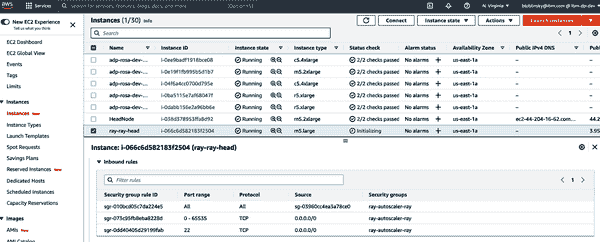
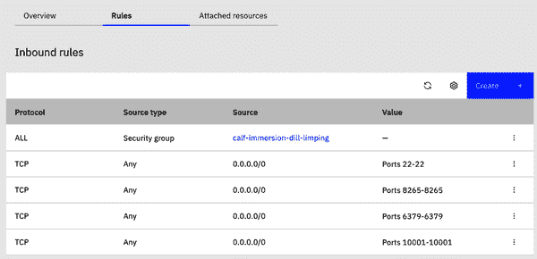
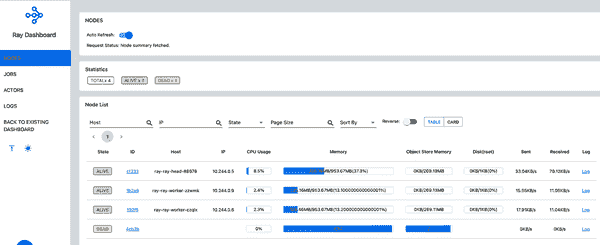

# 附录 B. 安装和部署 Ray

Ray 的强大之处在于它支持各种部署模型，从单节点部署——允许您在本地进行 Ray 实验——到包含数千台机器的集群。在本附录中，我们将展示编写本书时评估的一些安装选项。

# 在本地安装 Ray

最简单的 Ray 安装是使用 `pip` 在本地进行的。使用以下命令：

```py
pip install -U ray
```

此命令安装了运行本地 Ray 程序或在 Ray 集群上启动程序所需的所有代码（参见 “使用 Ray 集群”）。该命令安装了最新的官方发布版本。此外，还可以从 [每日发布](https://oreil.ly/2VzQD) 或 [特定提交](https://oreil.ly/f9k7H) 安装 Ray。还可以在 [Conda 环境](https://oreil.ly/1TsIZ) 中安装 Ray。最后，您可以按照 [Ray 文档](https://oreil.ly/rjane) 中的说明从源代码构建 Ray。

# 使用 Ray Docker 镜像

除了在本地机器上进行本地安装外，Ray 还提供了通过运行提供的 [Docker 镜像](https://oreil.ly/zrvoq) 的选项。Ray 项目提供了丰富的 [Docker 镜像](https://oreil.ly/0qv77)，适用于各种 Python 版本和硬件选项。这些镜像可以用来通过启动相应的 Ray 镜像来执行 Ray 的代码：

```py
docker run --rm --shm-size=<*shm-size*> -t -i <*image name*>
```

在这里 `<*shm-size*>` 是 Ray 内部用于对象存储的内存大小。对于此值的一个良好估计是使用您可用内存的大约 30%；`<*image name*>` 是所使用的镜像的名称。

执行此命令后，您将收到一个命令行提示符，并可以输入任何 Ray 代码。

# 使用 Ray 集群

尽管本地 Ray 安装对于实验和初始调试非常有用，但 Ray 的真正强大之处在于其能够在机器集群上运行和扩展。

Ray *集群节点*是基于 Docker 镜像的逻辑节点。Ray 项目提供的 Docker 镜像包含了运行逻辑节点所需的所有代码，但不一定包含运行用户应用程序所需的所有代码。问题在于用户的代码可能需要特定的 Python 库，而这些库并不包含在 Ray 的 Docker 镜像中。

为了解决这个问题，Ray 允许在集群安装的一部分中向节点安装特定库，这对于初始测试非常有帮助，但可能会显著影响节点的创建性能。因此，在生产安装中，通常建议使用从 Ray 提供的自定义镜像派生的镜像并添加所需的库。

Ray 提供了两种主要的安装选项：直接安装在硬件节点或云提供商的 VM 上，以及在 Kubernetes 上安装。在这里，我们将讨论 Ray 在云提供商和 Kubernetes 上的安装。有关 Ray 在硬件节点上的安装信息，请参阅[Ray 文档](https://oreil.ly/3hYV0)。

官方[文档](https://oreil.ly/mrThY)描述了 Ray 在包括 AWS、Azure、Google Cloud、阿里巴巴和自定义云在内的多个云提供商上的安装。在这里，我们将讨论在 AWS 上的安装（因为它是最流行的）和 IBM Cloud 上的安装（因为其中一位合著者在 IBM 工作，采用了独特的方法）。¹

## 在 AWS 上安装 Ray

AWS 云安装利用了 Python 的 Boto3 AWS SDK，并且需要在*~/.aws/credentials*文件中配置您的 AWS 凭证。²

一旦凭证创建并安装了 Boto3，您可以使用从[Ray GitHub 存储库](https://oreil.ly/h0UnW)适配的[*ray-aws.yaml*文件](https://oreil.ly/zkodJ)，通过以下命令在 AWS 上安装 Ray：

```py
ray up <*your location*>/ray-aws.yaml
```

此命令创建了集群，并提供了一组您可以使用的有用命令：

```py
Monitor autoscaling with
    ray exec ~/Projects/Platform-Infrastructure/middleware\
    /ray/install/ray-aws.yaml\
    'tail -n 100 -f /tmp/ray/session_latest/logs/monitor*'
Connect to a terminal on the cluster head:
    ray attach ~/Projects/Platform-Infrastructure/middleware\
    /ray/install/ray-aws.yaml
Get a remote shell to the cluster manually:
    ssh -o IdentitiesOnly=yes\
    -i /Users/boris/Downloads/id.rsa.ray-boris root@52.118.80.225
```

请注意，您将看到的 IP 地址与此处显示的不同。在创建集群时，它使用了一个只允许通过 Secure Shell（SSH）连接到集群的防火墙。如果您想访问集群的仪表板，您需要打开 8265 端口；如果需要 gRPC 访问，请使用 10001 端口。为此，请在 Amazon Elastic Compute Cloud（EC2）仪表板中找到您的节点，点击“安全组”选项卡，选择安全组，并修改入站规则。Figure B-1 显示了一个允许来自任何地方的实例端口访问的新规则。有关入站规则配置的更多信息，请参阅[AWS 文档](https://oreil.ly/MRfib)。



###### 图 B-1\. AWS 控制台中的实例视图

按照您的 YAML 文件的请求，您只能看到一个头部，并且工作节点将被创建以满足提交作业的执行要求。要验证集群是否正常运行，您可以使用 GitHub 上[*localPython.py*](https://oreil.ly/OzOQN)中的代码，该代码验证它是否可以连接到集群及其节点。

使用 VM 直接安装 Ray 的替代方法是[直接在 VM 上安装 Ray](https://oreil.ly/k733p)。这种方法的优势在于能够轻松地向 VM 添加附加软件，这在实际中非常有用。一个明显的用例是管理 Python 库。您可以使用基于 Docker 的安装来做到这一点，但随后需要为每个库配置构建 Docker 镜像。在基于 VM 的方法中，无需创建和管理 Docker 镜像；只需适当地使用`pip`进行安装即可。此外，您还可以在 VM 上安装应用程序，以便在 Ray 执行中利用它们（参见“使用 Ray 包装自定义程序”）。

###### 提示

在 VM 上安装 Ray 需要大量的设置命令，因此 Ray 节点启动可能需要相当长的时间。推荐的方法是先启动 Ray 集群一次，创建一个新镜像，然后使用此镜像并移除额外的设置命令。

## 在 IBM Cloud 上安装 Ray

IBM Cloud 安装基于[Gen2 连接器](https://oreil.ly/tIF6Y)，该连接器使 Ray 集群可以部署在 IBM 的 Gen2 云基础设施上。与在 AWS 上使用 Ray 一样，您将首先在 YAML 文件中创建集群规范。如果您不想手动创建 YAML 文件，可以交互式地使用 Lithopscloud 完成此操作。您可以像平常一样使用`pip`安装 Lithopscloud：

```py
pip3 install lithopscloud
```

要使用 Lithopscloud，您首先需要创建一个[API 密钥](https://oreil.ly/ZO9Nv)或重用现有的密钥。有了您的 API 密钥，您可以运行 `lithopscloud -o cluster.yaml` 来生成一个*cluster.yaml*文件。启动 Lithopscloud 后，按照提示生成文件（您需要使用上下箭头进行选择）。您可以在[GitHub](https://oreil.ly/rQNOx)上找到生成文件的示例。

自动生成文件的限制在于它对头节点和工作节点使用相同的镜像类型，这并不总是理想的。通常情况下，您可能希望为这些节点提供不同的类型。要做到这一点，您可以修改自动生成的[*cluster.yaml*文件](https://oreil.ly/LqpIl)如下：

```py
available_node_types:
 ray_head_default:
   max_workers: 0
   min_workers: 0
   node_config:
     boot_volume_capacity: 100
     image_id: r006-dd164da8-c4d9-46ba-87c4-03c614f0532c
     instance_profile_name: bx2-4x16
     key_id: r006-d6d823da-5c41-4e92-a6b6-6e98dcc90c8e
     resource_group_id: 5f6b028dc4ef41b9b8189bbfb90f2a79
     security_group_id: r006-c8e44f9c-7159-4041-a7ab-cf63cdb0dca7
     subnet_id: 0737-213b5b33-cee3-41d0-8d25-95aef8e86470
     volume_tier_name: general-purpose
     vpc_id: r006-50485f78-a76f-4401-a742-ce0a748b46f9
   resources:
     CPU: 4
 ray_worker_default:
   max_workers: 10
   min_workers: 0
   node_config:
     boot_volume_capacity: 100
     image_id: r006-dd164da8-c4d9-46ba-87c4-03c614f0532c
     instance_profile_name: bx2-8x32
     key_id: r006-d6d823da-5c41-4e92-a6b6-6e98dcc90c8e
     resource_group_id: 5f6b028dc4ef41b9b8189bbfb90f2a79
     security_group_id: r006-c8e44f9c-7159-4041-a7ab-cf63cdb0dca7
     subnet_id: 0737-213b5b33-cee3-41d0-8d25-95aef8e86470
     volume_tier_name: general-purpose
     vpc_id: r006-50485f78-a76f-4401-a742-ce0a748b46f9
   resources:
     CPU: 8
```

在这里，您定义了两种类型的节点：默认的头节点和默认的工作节点（您可以定义多个工作节点类型，并设置每次的最大工作节点数）。因此，您现在可以拥有一个相对较小的头节点（始终运行），以及会根据需要创建的更大的工作节点。

###### 提示

如果您查看生成的 YAML 文件，您会注意到它包含许多设置命令，因此 Ray 节点启动可能需要相当长的时间。推荐的方法是先启动 Ray 集群一次，创建一个新镜像，然后使用此镜像并移除设置命令。

生成 YAML 文件后，您可以安装 Gen2 连接器以便使用它。运行 `pip3 install gen2-connector`。然后，通过运行 `ray up cluster.yaml` 来创建您的集群。

类似于在 AWS 上安装 Ray，此安装显示了一系列有用的命令：

```py
Monitor autoscaling with
    ray exec /Users/boris/Downloads/cluster.yaml \
    'tail -n 100 -f /tmp/ray/session_latest/logs/monitor*'
Connect to a terminal on the cluster head:
    ray attach ~/Downloads/cluster.yaml
Get a remote shell to the cluster manually:
    ssh -o IdentitiesOnly=yes -i ~/Downloads/id.rsa.ray-boris root@52.118.80.225
```

要访问集群，请确保按照[IBM Cloud 文档](https://oreil.ly/8oTDR)（图 B-2）开放所需端口。



###### 图 B-2\. IBM Cloud 控制台显示防火墙规则

根据您的 YAML 文件的请求，您只能看到一个头部；工作节点将被创建以满足提交作业的执行需求。要验证集群是否正确运行，请执行 [*localPython.py* 脚本](https://oreil.ly/rl5SL)。

## 在 Kubernetes 上安装 Ray

在实际集群在 Kubernetes 上的安装中，Ray 提供了两种基本机制：

集群启动器

与使用虚拟机进行安装类似，这使得在任何云上部署 Ray 集群变得简单。它将使用云提供商的 SDK 创建新的实例或机器，执行 shell 命令以使用提供的选项设置 Ray，并初始化集群。

Ray Kubernetes 操作器

这简化了在现有 Kubernetes 集群上部署 Ray 的过程。操作器定义了一个称为 `RayCluster` 的[自定义资源](https://oreil.ly/RTWR9)，它描述了 Ray 集群的期望状态，以及一个[自定义控制器](https://oreil.ly/ADp7y)，即 Ray 操作器，它处理 RayCluster 资源并管理 Ray 集群。

###### 提示

当您使用集群启动器和操作器在 Kubernetes 集群上安装 Ray 时，Ray 利用 Kubernetes 的能力创建一个新的 Ray 节点，形式为 Kubernetes Pod。虽然 Ray 自动扩展器的工作方式相同，但它有效地从 Kubernetes 集群中“窃取”资源。因此，您的 Kubernetes 集群要么足够大以支持 Ray 的所有资源需求，要么提供自己的自动缩放机制。此外，由于 Ray 的节点在这种情况下是作为底层 Kubernetes Pod 实现的，因此 Kubernetes 资源管理器可以随时删除这些 Pod 以获取额外的资源。

## 在 kind 集群上安装 Ray

为了演示两种方法，让我们首先在 [kind (Kubernetes in Docker) 集群](https://oreil.ly/qvuAi) 上安装并访问 Ray 集群。这个流行的工具通过使用 Docker 容器“节点”来运行本地 Kubernetes 集群，并且经常用于本地开发。为此，您需要首先通过运行以下命令来创建一个集群：

```py
kind create cluster
```

这将使用默认配置创建一个集群。要修改配置，请参考[配置文档](https://oreil.ly/Rvq54)。一旦集群启动运行，您可以使用 `ray up` 或 Kubernetes 操作器来创建 Ray 集群。

## 使用 ray up

要使用 `ray up` 创建 Ray 集群，必须在一个 YAML 文件中指定资源需求，例如[*raycluster.yaml*](https://oreil.ly/YGOp5)，该文件改编自 [Ray GitHub 仓库](https://oreil.ly/m2mm2) 中的 Ray Kubernetes 自动缩放器默认值。该文件包含创建 Ray 集群所需的所有信息：

+   关于集群名称和自动缩放参数的一般信息。

+   关于集群提供程序（在我们的情况下是 Kubernetes）的信息，包括创建 Ray 集群节点所需的特定于提供程序的信息。

+   特定于节点的信息（CPU/内存等）。这还包括节点启动命令列表，包括安装所需的 Python 库。

有了这个文件，创建集群的命令看起来像这样：

```py
ray up <*your location*>/raycluster.yaml
```

完成集群创建后，您可以看到有几个 pod 在运行：

```py
> get pods -n ray
NAME                   READY   STATUS    RESTARTS   AGE
ray-ray-head-88978     1/1     Running   0          2m15s
ray-ray-worker-czqlx   1/1     Running   0          23s
ray-ray-worker-lcdmm   1/1     Running   0          23s
```

根据我们的 YAML 文件的请求，您可以看到一个 head 和两个 worker 节点。要验证集群是否正常运行，可以使用以下 [作业](https://oreil.ly/swESN)：

```py
kubectl create -f <your location>/jobexample.yaml -n ray
```

执行的结果类似于这样：

```py
> kubectl logs ray-test-job-bx4xj-4nfbl -n ray
--2021-09-28 15:18:59--  https://raw.githubusercontent.com/scalingpythonml/...
Resolving raw.githubusercontent.com (raw.githubusercontent.com) ...
Connecting to raw.githubusercontent.com (raw.githubusercontent.com) ...
Length: 1750 (1.7K) [text/plain]
Saving to: ‘servicePython.py’

     0K .                                                     100% 9.97M=0s

2021-09-28 15:18:59 (9.97 MB/s) - ‘servicePython.py’ saved [1750/1750]

Connecting to Ray at service ray-ray-head, port 10001
Iteration 0
Counter({('ray-ray-head-88978', 'ray-ray-head-88978'): 30, ...
Iteration 1
……………………………….
Success!
```

作业启动后，您还可以通过运行以下命令将 `ray-ray-head` 服务进行端口转发：³

```py
kubectl port-forward -n ray service/ray-ray-head 10001
```

然后，使用书籍示例文件中的[*localPython.py*测试脚本](https://oreil.ly/RV8yx)从本地机器连接到它。执行此代码会产生与先前显示的相同结果。

此外，您可以将 ray 服务端口转发到 8265 端口以查看 Ray 仪表板：

```py
kubectl port-forward -n ray service/ray-ray-head 8265
```

完成后，您可以查看 Ray 仪表板（图 B-3）。



###### 图 B-3\. Ray 仪表板

使用以下命令可以卸载 Ray 集群：⁴

```py
ray down <*your location*>/raycluster.yaml
```

## 使用 Ray Kubernetes 操作员

对于部署到 Kubernetes 集群，我们还可以使用 Ray 操作员，这是一种推荐的方法。为了简化操作员的使用，Ray 提供了作为 Ray GitHub 仓库的一部分可用的[Helm 图表](https://oreil.ly/4jjfI)。在这里，我们使用多个 YAML 文件来部署 Ray，以使安装变得更加简单，而不是使用 Helm 图表。

我们的部署分为三个文件：[*operatorcrd.yaml*](https://oreil.ly/wORyi)，其中包含用于 CustomResourceDefinition（CRD）创建的所有命令；[*operator.yaml*](https://oreil.ly/RyjD7)，其中包含用于操作员创建的所有命令；以及[*rayoperatorcluster.yaml*](https://oreil.ly/Ibqbn)，其中包含用于集群创建的所有命令。这些文件假定操作员是在 *ray* 命名空间中创建的。

要安装操作员本身，我们需要执行这两个命令：

```py
kubectl apply -f <*your location*>/operatorcrd.yaml
kubectl apply -f <*your location*>/operator.yaml
```

完成后，请使用以下命令确保操作员 pod 正在运行：

```py
> kubectl get pods -n ray
NAME                            READY   STATUS    RESTARTS   AGE
ray-operator-6c9954cddf-cjn9c   1/1     Running   0          110s
```

一旦操作员启动并运行，您可以使用以下命令启动集群本身：⁵

```py
kubectl apply -f <*your location*>/rayoperatorcluster.yaml -n ray
```

*rayoperatorcluster.yaml* 的内容与 *raycluster.yaml* 类似，但格式略有不同。一旦集群运行起来，你可以使用与之前描述的 `ray up` 相同的验证代码。

## 在 OpenShift 上安装 Ray

OpenShift 是一种 Kubernetes 集群类型，因此理论上可以使用 Kubernetes 运算符在 OpenShift 集群上安装 Ray。不过，这种安装过程会稍微复杂一些。

如果你曾经使用过 OpenShift，你会知道默认情况下，所有 OpenShift 中的 pod 都以 [限制模式](https://oreil.ly/ZkcDY) 运行。此模式拒绝访问所有主机功能，并要求 pod 使用分配给命名空间的唯一标识符 (UID) 和安全增强型 Linux (SELinux) 上下文来运行。

不幸的是，对于 Ray operator 来说，设计为以用户 1000 运行的情况不太适用。为了启用此功能，你需要对安装在 kind（以及任何其他纯 Kubernetes 集群）上的文件进行几处更改：

+   添加 `ray-operator-serviceaccount` 服务账户，该账户由运算符使用，设置为 `anyuid` 模式。这允许用户使用任何非根 UID 运行：

    ```py
    oc adm policy add-scc-to-user anyuid -z ray-operator-serviceaccount
    ```

+   修改 [*operator.yaml*](https://oreil.ly/eYIht)，确保运算符 pod 以用户 1000 的身份运行。

此外，必须稍微修改 [测试作业](https://oreil.ly/R2r8x)，以用户 1000 的身份运行。这需要创建一个 `ray-node-serviceaccount` 服务账户用于运行作业，并将该服务账户设置为 `anyuid` 模式，允许用户使用任何非根 UID 运行。

# 结论

Ray 提供丰富的部署选项。当使用 Ray 解决特定问题时，你需要决定哪个选项最适合你的具体情况。

¹ 为了透明起见：Boris 目前在 IBM 工作，Holden 曾在 IBM 工作过。Holden 也曾在 Google、Microsoft 和 Amazon 工作过。

² 参见 [“Boto3 Docs 1.24.95” 文档](https://oreil.ly/5A6jE) 获取有关设置 Boto3 配置的信息。

³ 理论上，你也可以创建一个入口来连接 Ray 集群。但遗憾的是，在 NGINX 入口控制器的情况下，它将无法工作。问题在于 Ray 客户端使用的是不安全的 gRPC，而 NGINX 入口控制器仅支持安全的 gRPC 调用。在使用 Ray 集群时，请检查入口是否支持不安全的 gRPC，在将 Ray 的 head 服务公开为入口之前。

⁴ 此命令会删除 pod，并且会留下作为集群一部分创建的服务。你必须手动删除服务以进行完全清理。

⁵ 尽管文档提到了集群范围的部署运算符，但它仅适用于部署运算符的命名空间。
