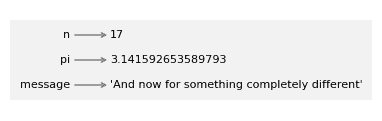

# 2\. 变量与语句

> 原文：[`allendowney.github.io/ThinkPython/chap02.html`](https://allendowney.github.io/ThinkPython/chap02.html)

在上一章中，我们使用运算符编写了执行算术计算的表达式。

在本章中，你将学习关于变量和语句、`import`语句以及`print`函数的知识。我还将介绍更多我们用来讨论程序的词汇，包括“参数”和“模块”。

## 2.1\. 变量

**变量**是指向某个值的名称。要创建一个变量，我们可以像这样写一个**赋值语句**。

```py
n = 17 
```

一个赋值语句有三个部分：左边是变量名，等号操作符`=`，右边是表达式。在这个示例中，表达式是一个整数。在以下示例中，表达式是一个浮动小数。

```py
pi = 3.141592653589793 
```

在以下示例中，表达式是一个字符串。

```py
message = 'And now for something completely different' 
```

当你执行赋值语句时，没有输出。Python 会创建变量并赋予它一个值，但赋值语句没有可见的效果。然而，在创建变量后，你可以将其作为表达式使用。因此我们可以这样显示`message`的值：

```py
message 
```

```py
'And now for something completely different' 
```

你还可以将变量用作包含算术运算符的表达式的一部分。

```py
n + 25 
```

```py
42 
```

```py
2 * pi 
```

```py
6.283185307179586 
```

你还可以在调用函数时使用变量。

```py
round(pi) 
```

```py
3 
```

```py
len(message) 
```

```py
42 
```

## 2.2\. 状态图

在纸面上表示变量的常见方式是写下变量名，并画一个箭头指向它的值。



这种图形被称为**状态图**，因为它展示了每个变量的状态（可以把它看作是变量的“心理状态”）。我们将在全书中使用状态图来表示 Python 如何存储变量及其值的模型。

## 2.3\. 变量名

变量名可以任意长。它们可以包含字母和数字，但不能以数字开头。使用大写字母是合法的，但通常约定变量名使用小写字母。

变量名中唯一可以出现的标点符号是下划线字符`_`。它通常用于多个单词的名字中，例如`your_name`或`airspeed_of_unladen_swallow`。

如果给变量一个非法的名称，就会得到语法错误。`million!`是非法的，因为它包含了标点符号。

```py
million!  =  1000000 
```

```py
 Cell In[12], line 1
    million!  =  1000000
           ^
SyntaxError: invalid syntax 
```

`76trombones`是非法的，因为它以数字开头。

```py
76trombones = 'big parade' 
```

```py
 Cell In[13], line 1
  76trombones = 'big parade'
     ^
SyntaxError: invalid decimal literal 
```

`class`也是非法的，但可能不太明显为什么。

```py
class = 'Self-Defence Against Fresh Fruit' 
```

```py
 Cell In[14], line 1
    class = 'Self-Defence Against Fresh Fruit'
          ^
SyntaxError: invalid syntax 
```

事实证明，`class`是一个**关键字**，是用来指定程序结构的特殊词汇。关键字不能用作变量名。

这是 Python 关键字的完整列表：

```py
False      await      else       import     pass
None       break      except     in         raise
True       class      finally    is         return
and        continue   for        lambda     try
as         def        from       nonlocal   while
assert     del        global     not        with
async      elif       if         or         yield 
```

你不需要记住这个列表。在大多数开发环境中，关键字会以不同的颜色显示；如果你尝试将其作为变量名使用，你会知道的。

## 2.4\. 导入语句

为了使用一些 Python 功能，你必须**导入**它们。例如，下面的语句导入了 `math` 模块。

```py
import math 
```

**模块**是一个包含变量和函数的集合。数学模块提供了一个叫做`pi`的变量，包含了数学常数\(\pi\)的值。我们可以像这样显示它的值。

```py
math.pi 
```

```py
3.141592653589793 
```

要在模块中使用变量，你必须在模块名称和变量名称之间使用**点操作符**（`.`）。

数学模块还包含函数。例如，`sqrt` 计算平方根。

```py
math.sqrt(25) 
```

```py
5.0 
```

而 `pow` 将一个数字提升为第二个数字的幂。

```py
math.pow(5, 2) 
```

```py
25.0 
```

到目前为止，我们已经看到两种将数字提升为幂的方法：我们可以使用 `math.pow` 函数或指数运算符 `**`。两者都可以，但运算符的使用频率比函数更高。

## 2.5\. 表达式和语句

到目前为止，我们已经看到几种类型的表达式。一个表达式可以是一个单独的值，比如整数、浮点数或字符串。它也可以是一个包含值和运算符的集合。它还可以包括变量名和函数调用。这是一个包含这些元素的表达式。

```py
19 + n + round(math.pi) * 2 
```

```py
42 
```

我们也见过几种类型的语句。**语句**是一个有作用但没有值的代码单元。例如，一个赋值语句创建一个变量并赋予它一个值，但语句本身没有值。

```py
n = 17 
```

同样，导入语句也有一个作用——它导入一个模块，以便我们可以使用它包含的变量和函数——但它没有可见的效果。

```py
import math 
```

计算表达式的值称为**求值**。执行语句称为**执行**。

## 2.6\. print 函数

当你求值一个表达式时，结果会被显示出来。

```py
n + 1 
```

```py
18 
```

但是，如果你计算多个表达式，只有最后一个表达式的值会被显示。

```py
n + 2
n + 3 
```

```py
20 
```

要显示多个值，你可以使用 `print` 函数。

```py
print(n+2)
print(n+3) 
```

```py
19
20 
```

它同样适用于浮点数和字符串。

```py
print('The value of pi is approximately')
print(math.pi) 
```

```py
The value of pi is approximately
3.141592653589793 
```

你还可以使用由逗号分隔的表达式序列。

```py
print('The value of pi is approximately', math.pi) 
```

```py
The value of pi is approximately 3.141592653589793 
```

注意，`print` 函数会在值之间添加空格。

## 2.7\. 参数

当你调用一个函数时，括号中的表达式被称为**参数**。通常我会解释为什么，但是在这种情况下，术语的技术含义几乎与词汇的常见含义无关，所以我就不尝试了。

到目前为止，我们看到的一些函数只接受一个参数，像 `int`。

```py
int('101') 
```

```py
101 
```

有些需要两个参数，像 `math.pow`。

```py
math.pow(5, 2) 
```

```py
25.0 
```

有些可以接受额外的可选参数。例如，`int` 可以接受一个第二个参数，指定数字的基数。

```py
int('101', 2) 
```

```py
5 
```

二进制中的数字序列`101`表示十进制中的数字 5。

`round`还可以接受一个可选的第二个参数，表示四舍五入的位数。

```py
round(math.pi, 3) 
```

```py
3.142 
```

一些函数可以接受任意数量的参数，比如`print`。

```py
print('Any', 'number', 'of', 'arguments') 
```

```py
Any number of arguments 
```

如果你调用一个函数并提供了太多的参数，那也是一个`TypeError`。

```py
float('123.0', 2) 
```

```py
TypeError: float expected at most 1 argument, got 2 
```

如果你提供了太少的参数，那也是一个`TypeError`。

```py
math.pow(2) 
```

```py
TypeError: pow expected 2 arguments, got 1 
```

如果你提供了一个类型函数无法处理的参数，那也是一个`TypeError`。

```py
math.sqrt('123') 
```

```py
TypeError: must be real number, not str 
```

在开始时进行这种检查可能会让人烦恼，但它有助于你发现和修正错误。

## 2.8\. 注释

随着程序变得越来越大和复杂，它们变得更难阅读。正式的编程语言是密集的，通常很难看一段代码就明白它在做什么以及为什么这么做。

因此，最好在程序中添加注释，用自然语言解释程序在做什么。这些注释被称为**注释**，以`#`符号开头。

```py
# number of seconds in 42:42
seconds = 42 * 60 + 42 
```

在这种情况下，注释会单独出现在一行上。你也可以将注释放在一行的末尾：

```py
miles = 10 / 1.61     # 10 kilometers in miles 
```

从`#`到行末的所有内容都会被忽略——它对程序的执行没有影响。

注释在记录代码中不明显的特性时最有用。可以合理假设读者能够弄明白*代码做了什么*；更有用的是解释*为什么*代码这么做。

这个注释与代码重复，毫无用处：

```py
v = 8     # assign 8 to v 
```

这个注释包含了代码中没有的信息：

```py
v = 8     # velocity in miles per hour 
```

良好的变量名可以减少注释的需要，但过长的名字可能会让复杂的表达式难以阅读，因此需要做出取舍。

## 2.9\. 调试

程序中可能发生三种类型的错误：语法错误、运行时错误和语义错误。区分它们很有用，这样可以更快地定位问题。

+   **语法错误**：“语法”是指程序的结构以及关于该结构的规则。如果程序中的任何地方存在语法错误，Python 不会运行程序，而是立即显示一条错误信息。

+   **运行时错误**：如果程序中没有语法错误，它就可以开始运行。但如果发生错误，Python 会显示一条错误信息并停止运行。这种错误被称为运行时错误，也叫做**异常**，因为它表示发生了某些异常情况。

+   **语义错误**：第三种类型的错误是“语义”错误，即与含义相关的错误。如果程序中存在语义错误，它会运行，但不会生成错误信息，而且它不会按你预期的方式工作。识别语义错误可能很棘手，因为它需要你通过查看程序的输出，反向推理出程序在做什么。

如我们所见，非法的变量名是语法错误。

```py
million!  =  1000000 
```

```py
 Cell In[40], line 1
    million!  =  1000000
           ^
SyntaxError: invalid syntax 
```

如果你使用了不支持的操作符类型，这就是一个运行时错误。

```py
'126' / 3 
```

```py
TypeError: unsupported operand type(s) for /: 'str' and 'int' 
```

最后，这里有一个语义错误的例子。假设我们想要计算`1`和`3`的平均值，但我们忽略了操作顺序，写成了这样：

```py
1 + 3 / 2 
```

```py
2.5 
```

当此表达式被求值时，它不会产生错误信息，因此没有语法错误或运行时错误。但结果不是`1`和`3`的平均值，因此程序不正确。这是一个语义错误，因为程序运行了，但没有达到预期的效果。

## 2.10\. 术语表

**变量：** 一个代表值的名称。

**赋值语句：** 给变量赋值的语句。

**状态图：** 一组变量及其引用值的图形表示。

**关键字：** 用来指定程序结构的特殊词语。

**导入语句：** 读取模块文件，使我们可以使用其中的变量和函数的语句。

**模块：** 一个包含 Python 代码的文件，包括函数定义，有时还包括其他语句。

**点操作符：** 用于通过指定模块名称后跟点和函数名来访问另一个模块中的函数的操作符`。`。

**求值：** 执行表达式中的操作以计算值。

**语句：** 一行或多行代码，表示一个命令或操作。

**执行：** 运行一个语句并按照它的指示操作。

**参数：** 在调用函数时提供给函数的值。

**注释：** 程序中包含的文本，提供关于程序的信息，但对程序执行没有影响。

**运行时错误：** 导致程序显示错误信息并退出的错误。

**异常：** 在程序运行时检测到的错误。

**语义错误：** 一个错误，导致程序执行不正确，但不会显示错误信息。

## 2.11\. 练习

```py
# This cell tells Jupyter to provide detailed debugging information
# when a runtime error occurs. Run it before working on the exercises.

%xmode Verbose 
```

```py
Exception reporting mode: Verbose 
```

### 2.11.1\. 向虚拟助手提问

再次鼓励你使用虚拟助手来了解本章中的任何主题。

如果你对我列出的任何关键字感到好奇，你可以问：“为什么 class 是一个关键字？”或“为什么变量名不能是关键字？”

你可能注意到，`int`、`float`和`str`不是 Python 的关键字。它们是代表类型的变量，也可以作为函数使用。因此，使用这些名称作为变量或函数是*合法的*，但强烈不建议这样做。可以问助手：“为什么使用 int、float 和 str 作为变量名不好？”

也可以问：“Python 中的内置函数有哪些？”如果你对其中的任何函数感兴趣，询问更多信息。

在本章中，我们导入了`math`模块，并使用了其中的一些变量和函数。可以问助手：“math 模块中有哪些变量和函数？”以及“除了 math，还有哪些模块是 Python 的核心模块？”

### 2.11.2\. 练习

重申我在上一章中的建议，每当你学习一个新特性时，你应该故意犯一些错误，看看会发生什么。

+   我们已经看到`n = 17`是合法的。那么`17 = n`呢？

+   `x = y = 1` 怎么样？

+   在一些编程语言中，每条语句都以分号（`;`）结尾。如果在 Python 语句末尾加上分号，会发生什么？

+   如果在语句末尾加一个句点，会发生什么？

+   如果你拼写模块名错误并尝试导入`maath`，会发生什么？

### 2.11.3\. 练习

练习使用 Python 解释器作为计算器：

**第一部分。** 半径为\(r\)的球体的体积是\(\frac{4}{3} \pi r³\)。半径为 5 的球体体积是多少？首先创建一个名为`radius`的变量，然后将结果赋给一个名为`volume`的变量，并显示结果。添加注释，表示`radius`的单位是厘米，`volume`的单位是立方厘米。

**第二部分。** 一条三角学定理说，对于任何值\(x\)，\((\cos x)² + (\sin x)² = 1\)。让我们看看对于特定值\(x = 42\)，它是否成立。

创建一个名为`x`的变量并赋值。然后使用`math.cos`和`math.sin`计算\(x\)的正弦和余弦，以及它们平方的和。

结果应该接近 1。它可能不是精确的 1，因为浮点运算并不完全准确——它只是近似正确的。

**第三部分。** 除了`pi`，在`math`模块中定义的另一个变量是`e`，它代表自然对数的底数，数学符号表示为\(e\)。如果你不熟悉这个值，可以问虚拟助手“`math.e`是什么？”现在让我们通过三种方法计算\(e²\)：

+   使用`math.e`和指数运算符(`**`)。

+   使用`math.pow`将`math.e`的值提高到`2`的幂。

+   使用`math.exp`，它接受一个参数\(x\)，并计算\(e^x\)。

你可能注意到，最后一个结果与其他两个略有不同。看看你能不能找出哪个是正确的。

[《Think Python: 第三版》](https://allendowney.github.io/ThinkPython/index.html)

版权 2024 [Allen B. Downey](https://allendowney.com)

代码许可证：[MIT 许可证](https://mit-license.org/)

文本许可证：[知识共享署名-非商业性使用-相同方式共享 4.0 国际版](https://creativecommons.org/licenses/by-nc-sa/4.0/)
