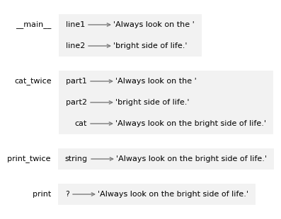

# 3. 函数

> 原文：[`allendowney.github.io/ThinkPython/chap03.html`](https://allendowney.github.io/ThinkPython/chap03.html)

在上一章中，我们使用了 Python 提供的几个函数，比如 `int` 和 `float`，以及 `math` 模块提供的一些函数，如 `sqrt` 和 `pow`。在这一章中，你将学习如何创建自己的函数并运行它们。我们还将展示一个函数如何调用另一个函数。作为示例，我们将展示《蒙提·派森》歌曲的歌词。这些搞笑的例子展示了一个重要特性——编写自己函数的能力是编程的基础。

本章还介绍了一个新的语句——`for` 循环，它用于重复计算。

## 3.1. 定义新函数

**函数定义**指定了一个新函数的名称以及在调用该函数时运行的语句序列。下面是一个例子：

```py
def print_lyrics():
    print("I'm a lumberjack, and I'm okay.")
    print("I sleep all night and I work all day.") 
```

`def` 是一个关键字，表示这是一个函数定义。函数的名字是 `print_lyrics`。任何合法的变量名也是合法的函数名。

函数名后面的空括号表示该函数不接受任何参数。

函数定义的第一行叫做 **头部**，其余部分称为 **函数体**。头部必须以冒号结束，函数体必须缩进。按惯例，缩进通常使用四个空格。这个函数的体部分包含两个打印语句；通常，函数体可以包含任意数量的语句。

定义一个函数会创建一个 **函数对象**，我们可以像这样显示它。

```py
print_lyrics 
```

```py
<function __main__.print_lyrics()> 
```

输出表明 `print_lyrics` 是一个不接受任何参数的函数。`__main__` 是包含 `print_lyrics` 的模块名。

现在我们已经定义了一个函数，我们可以像调用内建函数一样调用它。

```py
print_lyrics() 
```

```py
I'm a lumberjack, and I'm okay.
I sleep all night and I work all day. 
```

当函数运行时，它会执行函数体中的语句，这些语句会显示《伐木工歌》的前两行。

## 3.2. 参数

我们看到的一些函数需要参数；例如，当你调用 `abs` 时，你传递一个数字作为参数。一些函数需要多个参数；例如，`math.pow` 需要两个参数，一个是底数，另一个是指数。

这是一个接收参数的函数定义。

```py
def print_twice(string):
    print(string)
    print(string) 
```

括号中的变量名是一个 **参数**。当调用函数时，参数会被赋予实参的值。例如，我们可以这样调用 `print_twice`。

```py
print_twice('Dennis Moore, ') 
```

```py
Dennis Moore, 
Dennis Moore, 
```

运行这个函数的效果与将参数赋值给参数变量，然后执行函数体相同，如下所示。

```py
string = 'Dennis Moore, '
print(string)
print(string) 
```

```py
Dennis Moore, 
Dennis Moore, 
```

你也可以使用一个变量作为参数。

```py
line = 'Dennis Moore, '
print_twice(line) 
```

```py
Dennis Moore, 
Dennis Moore, 
```

在这个例子中，`line` 的值被赋给了参数 `string`。

## 3.3. 调用函数

一旦定义了一个函数，你就可以在另一个函数中使用它。为了演示，我们将编写打印《Spam 歌》歌词的函数([`www.songfacts.com/lyrics/monty-python/the-spam-song`](https://www.songfacts.com/lyrics/monty-python/the-spam-song))。

> Spam，Spam，Spam，Spam，
> 
> Spam，Spam，Spam，Spam，
> 
> Spam，Spam，
> 
> （可爱的 Spam，神奇的 Spam！）
> 
> Spam，Spam，

我们从以下函数开始，它接受两个参数。

```py
def repeat(word, n):
    print(word * n) 
```

我们可以使用这个函数来打印歌曲的第一行，像这样。

```py
spam = 'Spam, '
repeat(spam, 4) 
```

```py
Spam, Spam, Spam, Spam, 
```

为了显示前两行，我们可以定义一个新的函数，使用`repeat`。

```py
def first_two_lines():
    repeat(spam, 4)
    repeat(spam, 4) 
```

然后像这样调用它。

```py
first_two_lines() 
```

```py
Spam, Spam, Spam, Spam, 
Spam, Spam, Spam, Spam, 
```

为了显示最后三行，我们可以定义另一个函数，这个函数同样使用`repeat`。

```py
def last_three_lines():
    repeat(spam, 2)
    print('(Lovely Spam, Wonderful Spam!)')
    repeat(spam, 2) 
```

```py
last_three_lines() 
```

```py
Spam, Spam, 
(Lovely Spam, Wonderful Spam!)
Spam, Spam, 
```

最后，我们可以通过一个函数将所有内容组合起来，打印出整首诗。

```py
def print_verse():
    first_two_lines()
    last_three_lines() 
```

```py
print_verse() 
```

```py
Spam, Spam, Spam, Spam, 
Spam, Spam, Spam, Spam, 
Spam, Spam, 
(Lovely Spam, Wonderful Spam!)
Spam, Spam, 
```

当我们运行`print_verse`时，它调用了`first_two_lines`，而`first_two_lines`又调用了`repeat`，`repeat`则调用了`print`。这涉及了很多函数。

当然，我们本可以用更少的函数做同样的事情，但这个示例的重点是展示函数如何协同工作。

## 3.4\. 重复

如果我们想显示多于一段的歌词，可以使用`for`语句。下面是一个简单的示例。

```py
for i in range(2):
    print(i) 
```

```py
0
1 
```

第一行是以冒号结尾的头部。第二行是主体，需要缩进。

头部以关键字`for`开始，后面跟着一个名为`i`的新变量和另一个关键字`in`。它使用`range`函数创建一个包含两个值的序列，这两个值分别是`0`和`1`。在 Python 中，当我们开始计数时，通常是从`0`开始的。

当`for`语句运行时，它将`range`中的第一个值赋给`i`，然后在主体中运行`print`函数，显示`0`。

当程序执行到主体末尾时，它会回到头部，这就是为什么这个语句被称为**循环**。第二次进入循环时，它将`range`中的下一个值赋给`i`并显示出来。然后，由于这是`range`中的最后一个值，循环结束。

这是我们如何使用`for`循环打印歌曲的两段歌词。

```py
for i in range(2):
    print("Verse", i)
    print_verse()
    print() 
```

```py
Verse 0
Spam, Spam, Spam, Spam, 
Spam, Spam, Spam, Spam, 
Spam, Spam, 
(Lovely Spam, Wonderful Spam!)
Spam, Spam, 

Verse 1
Spam, Spam, Spam, Spam, 
Spam, Spam, Spam, Spam, 
Spam, Spam, 
(Lovely Spam, Wonderful Spam!)
Spam, Spam, 
```

你可以在一个函数内部放置一个`for`循环。例如，`print_n_verses`接受一个名为`n`的参数，该参数必须是整数，并显示给定数量的诗句。

```py
def print_n_verses(n):
    for i in range(n):
        print_verse()
        print() 
```

在这个例子中，我们没有在循环主体中使用`i`，但头部仍然需要有一个变量名。

## 3.5\. 变量和参数是局部的

当你在函数内部创建一个变量时，它是**局部的**，意味着它只在函数内部存在。例如，下面的函数接受两个参数，将它们连接起来并打印结果两次。

```py
def cat_twice(part1, part2):
    cat = part1 + part2
    print_twice(cat) 
```

这是一个使用它的示例：

```py
line1 = 'Always look on the '
line2 = 'bright side of life.'
cat_twice(line1, line2) 
```

```py
Always look on the bright side of life.
Always look on the bright side of life. 
```

当`cat_twice`运行时，它会创建一个名为`cat`的局部变量，而该变量在函数结束时被销毁。如果我们尝试显示它，就会得到一个`NameError`：

```py
print(cat) 
```

```py
NameError: name 'cat' is not defined 
```

在函数外部，`cat`是未定义的。

参数也是局部的。例如，在`cat_twice`外部，没有`part1`或`part2`这样的东西。

## 3.6\. 堆栈图

为了跟踪哪些变量可以在哪些地方使用，有时画一个**堆栈图**会很有用。像状态图一样，堆栈图展示了每个变量的值，但它们还展示了每个变量所属的函数。

每个函数都由一个**框架**表示。框架是一个外面写着函数名称、里面包含函数参数和局部变量的框。

这是上一个例子的堆栈图。



这些框架按照堆栈的顺序排列，表示哪个函数调用了哪个函数，依此类推。从底部开始，`print`由`print_twice`调用，`print_twice`由`cat_twice`调用，`cat_twice`由`__main__`调用——这是最上层框架的一个特殊名称。当你在任何函数外部创建一个变量时，它属于`__main__`。

在`print`的框架中，问号表示我们不知道参数的名称。如果你感到好奇，可以问虚拟助手：“Python 的 print 函数的参数是什么？”

## 3.7\. 追踪栈

当函数中发生运行时错误时，Python 会显示正在运行的函数的名称、调用它的函数的名称，依此类推，直到堆栈的顶部。为了看到一个例子，我将定义一个包含错误的`print_twice`版本——它试图打印`cat`，这是另一个函数中的局部变量。

```py
def print_twice(string):
    print(cat)            # NameError
    print(cat) 
```

现在让我们来看一下运行`cat_twice`时会发生什么。

```py
# This cell tells Jupyter to provide detailed debugging information
# when a runtime error occurs, including a traceback.

%xmode Verbose 
```

```py
Exception reporting mode: Verbose 
```

```py
cat_twice(line1, line2) 
```

```py
---------------------------------------------------------------------------
NameError  Traceback (most recent call last)
Cell In[27], line 1
----> 1 cat_twice(line1, line2)
        line1 = 'Always look on the '
        line2 = 'bright side of life.'

Cell In[20], line 3, in cat_twice(part1='Always look on the ', part2='bright side of life.')
  1 def cat_twice(part1, part2):
  2     cat = part1 + part2
----> 3     print_twice(cat)
        cat = 'Always look on the bright side of life.'

Cell In[25], line 2, in print_twice(string='Always look on the bright side of life.')
  1 def print_twice(string):
----> 2     print(cat)            # NameError
  3     print(cat)

NameError: name 'cat' is not defined 
```

错误信息包含一个**追踪栈**，显示了错误发生时正在运行的函数、调用该函数的函数等。在这个例子中，它显示了`cat_twice`调用了`print_twice`，并且错误发生在`print_twice`中。

追踪栈中函数的顺序与堆栈图中框架的顺序相同。正在运行的函数位于底部。

## 3.8\. 为什么要使用函数？

可能还不清楚为什么将程序划分为多个函数值得花费精力。这里有几个原因：

+   创建一个新函数让你有机会为一组语句命名，这使得程序更易于阅读和调试。

+   函数可以通过消除重复的代码使程序变得更小。以后，如果需要修改，你只需在一个地方做出更改。

+   将一个长程序拆分成多个函数可以让你逐个调试各个部分，然后将它们组合成一个完整的工作程序。

+   设计良好的函数通常对许多程序都有用。一旦你写并调试了一个函数，你可以重用它。

## 3.9\. 调试

调试可能令人沮丧，但它也充满挑战、有趣，有时甚至是令人愉快的。而且它是你可以学习的最重要的技能之一。

从某种意义上说，调试就像侦探工作。你会得到线索，然后推测出导致你看到的结果的事件。

调试也像实验科学。一旦你对发生了什么有了一些想法，你就修改程序并再次尝试。如果你的假设是正确的，你就能预测修改的结果，并且离一个可用的程序更近一步。如果假设错了，你就得提出新的假设。

对某些人来说，编程和调试是同一回事；也就是说，编程是逐步调试程序，直到它按你想要的方式工作。这个想法是你应该从一个能正常工作的程序开始，然后逐步进行小的修改，并在修改时调试它们。

如果你发现自己花了很多时间调试，这通常是一个信号，说明你在开始测试之前写了太多的代码。如果你采取更小的步骤，你可能会发现自己能更快地前进。

## 3.10\. 词汇表

**function definition:** 创建函数的语句。

**header:** 函数定义的第一行。

**body:** 函数定义内部的语句序列。

**function object:** 通过函数定义创建的值。函数的名称是一个引用函数对象的变量。

**parameter:** 在函数内部用于引用作为参数传递的值的名称。

**loop:** 一个运行一个或多个语句的语句，通常是重复的。

**local variable:** 在函数内部定义的变量，只能在函数内部访问。

**stack diagram:** 函数堆栈的图形表示，显示了它们的变量以及它们引用的值。

**frame:** 堆栈图中的一个框，表示一个函数调用。它包含该函数的局部变量和参数。

**traceback:** 当发生异常时打印的正在执行的函数列表。

## 3.11\. 练习

```py
# This cell tells Jupyter to provide detailed debugging information
# when a runtime error occurs. Run it before working on the exercises.

%xmode Verbose 
```

```py
Exception reporting mode: Verbose 
```

### 3.11.1\. 向虚拟助手提问

函数或`for`循环中的语句按照约定缩进四个空格。但并非所有人都同意这一约定。如果你对这一伟大的争论的历史感到好奇，可以让虚拟助手“告诉我关于 Python 中的空格和制表符”。

虚拟助手在编写小函数方面非常擅长。

1.  请让你喜欢的虚拟助手“编写一个名为 repeat 的函数，它接收一个字符串和一个整数，并将该字符串打印指定的次数。”

1.  如果结果使用了`for`循环，你可以问：“能不能不用`for`循环？”

1.  从本章中任选一个其他函数，并请虚拟助手编写它。挑战在于准确描述函数，以便得到你想要的结果。使用你在本书中学到的词汇。

虚拟助手在调试函数方面也非常擅长。

1.  询问 VA，这个`print_twice`版本有什么问题。

    ```py
    def print_twice(string):
        print(cat)
        print(cat) 
    ```

如果您在以下任何练习中遇到困难，请考虑向 VA 寻求帮助。

### 3.11.2\. 练习

编写一个名为`print_right`的函数，它以名为`text`的字符串作为参数，并打印字符串，使得字符串的最后一个字母位于显示的第 40 列。

提示：使用`len`函数、字符串连接运算符（`+`）和字符串重复运算符（`*`）。

这里有一个示例展示它应该如何工作。

```py
print_right("Monty")
print_right("Python's")
print_right("Flying Circus") 
```

```py
 Monty
                                Python's
                           Flying Circus 
```

### 3.11.3\. 练习

编写一个名为`triangle`的函数，它接受一个字符串和一个整数，并绘制一个具有给定高度的金字塔，由字符串的副本组成。这里有一个使用字符串`'L'`的 5 级金字塔的示例。

```py
triangle('L', 5) 
```

```py
L
LL
LLL
LLLL
LLLLL 
```

### 3.11.4\. 练习

编写一个名为`rectangle`的函数，它接受一个字符串和两个整数，并绘制一个具有给定宽度和高度的矩形，由字符串的副本组成。这里有一个宽度为`5`，高度为`4`的矩形的示例，由字符串`'H'`组成。

```py
rectangle('H', 5, 4) 
```

```py
HHHHH
HHHHH
HHHHH
HHHHH 
```

### 3.11.5\. 练习

歌曲“99 瓶啤酒”以这首诗歌开始：

> 墙上有 99 瓶啤酒
> 
> 99 瓶啤酒
> 
> 拿一个下来，传递它
> 
> 墙上有 98 瓶啤酒

然后第二节是一样的，只是从 98 瓶开始，以 97 结束。歌曲会继续——很长时间——直到没有啤酒为止。

编写一个名为`bottle_verse`的函数，它以一个数字作为参数，并显示以给定数量的瓶子开头的诗句。

提示：考虑从能够打印诗歌的第一、第二或最后一行的函数开始，然后使用它来编写`bottle_verse`。

使用这个函数调用来显示第一节。

```py
bottle_verse(99) 
```

```py
99 bottles of beer on the wall
99 bottles of beer 
Take one down, pass it around
98 bottles of beer on the wall 
```

如果你想打印整首歌，可以使用这个`for`循环，它从`99`数到`1`。你不必完全理解这个例子——我们稍后会更详细地了解`for`循环和`range`函数。

```py
for n in range(99, 0, -1):
    bottle_verse(n)
    print() 
```

[Think Python: 3rd Edition](https://allendowney.github.io/ThinkPython/index.html)

版权所有 2024 年 [Allen B. Downey](https://allendowney.com)

代码许可：[MIT 许可证](https://mit-license.org/)

文本许可证：[知识共享署名-非商业性使用-相同方式共享 4.0 国际许可协议](https://creativecommons.org/licenses/by-nc-sa/4.0/)
