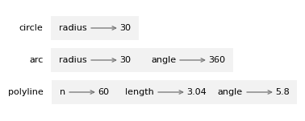
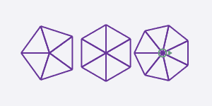
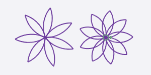

# 4\. 函数与接口

> 原文：[`allendowney.github.io/ThinkPython/chap04.html`](https://allendowney.github.io/ThinkPython/chap04.html)

本章介绍了一个名为`jupyturtle`的模块，它允许你通过给一只虚拟的海龟下指令来创建简单的图形。我们将使用这个模块编写绘制正方形、多边形和圆形的函数，并演示**接口设计**，这是一种设计能协同工作的函数的方式。

## 4.1\. jupyturtle 模块

要使用`jupyturtle`模块，我们可以这样导入它。

```py
import jupyturtle 
```

现在我们可以使用模块中定义的函数，如`make_turtle`和`forward`。

```py
jupyturtle.make_turtle()
jupyturtle.forward(100) 
```

`make_turtle`创建一个**画布**，这是屏幕上可以绘图的区域，并且创建一只海龟，海龟通过一个圆形的壳和一个三角形的头来表示。圆形表示海龟的位置，三角形表示它面朝的方向。

`forward`指令让海龟沿着它面朝的方向移动指定的距离，并在此过程中绘制一条线段。这个距离使用的是任意单位，实际的大小取决于你的计算机屏幕。

我们将多次使用`jupyturtle`模块中定义的函数，所以如果我们每次都不必写模块名，那就更方便了。如果我们像这样导入模块，这样做是可能的。

```py
from jupyturtle import make_turtle, forward 
```

这个版本的导入语句从`jupyturtle`模块导入了`make_turtle`和`forward`，这样我们就可以像这样调用它们。

```py
make_turtle()
forward(100) 
```

`jupyturtle`还提供了另外两个函数，我们将使用它们，分别是`left`和`right`。我们将这样导入它们。

```py
from jupyturtle import left, right 
```

`left`指令使海龟向左转动。它接受一个参数，表示转动的角度，单位是度。例如，我们可以这样使海龟左转 90 度。

```py
make_turtle()
forward(50)
left(90)
forward(50) 
```

这个程序使海龟先向东移动然后向北移动，留下了两条线段。在继续之前，试试看能否修改之前的程序，绘制一个正方形。

## 4.2\. 绘制一个正方形

这是绘制正方形的一种方式。

```py
make_turtle()

forward(50)
left(90)

forward(50)
left(90)

forward(50)
left(90)

forward(50)
left(90) 
```

因为这个程序会重复执行相同的一对语句四次，我们可以通过`for`循环来更简洁地实现同样的效果。

```py
make_turtle()
for i in range(4):
    forward(50)
    left(90) 
```

## 4.3\. 封装与泛化

让我们将上一节的绘制正方形的代码放到一个名为`square`的函数里。

```py
def square():
    for i in range(4):
        forward(50)
        left(90) 
```

现在我们可以这样调用这个函数。

```py
make_turtle()
square() 
```

将一段代码封装到一个函数中叫做**封装**。封装的好处之一是它为代码附上了一个名称，这可以作为一种文档说明。另一个好处是，如果你要重复使用这段代码，调用函数比复制粘贴函数体要简洁得多！

在当前版本中，正方形的大小始终是`50`。如果我们想绘制不同大小的正方形，可以将边长作为参数传入。

```py
def square(length):
    for i in range(4):
        forward(length)
        left(90) 
```

现在我们可以绘制不同大小的正方形了。

```py
make_turtle()
square(30)
square(60) 
```

向函数添加一个参数叫做**泛化**，因为它使得函数变得更加通用：在之前的版本中，正方形的大小总是一样的；而在这个版本中，它可以是任意大小。

如果我们添加另一个参数，我们可以使它更通用。以下函数绘制具有给定边数的规则多边形。

```py
def polygon(n, length):
    angle = 360 / n
    for i in range(n):
        forward(length)
        left(angle) 
```

在一个具有`n`条边的规则多边形中，相邻边之间的角度是`360 / n`度。

以下示例绘制一个具有 7 条边、边长为 30 的多边形。

```py
make_turtle()
polygon(7, 30) 
```

当一个函数有很多数值型参数时，很容易忘记它们是什么，或者它们应该按什么顺序排列。一个好主意是，在参数列表中包含参数的名称。

```py
make_turtle()
polygon(n=7, length=30) 
```

这些有时被称为“命名参数”，因为它们包括了参数名称。但在 Python 中，它们更常被称为**关键字参数**（不要与 Python 中的保留字如`for`和`def`混淆）。

这种赋值运算符`=`的使用提醒我们参数和参数列表的工作方式——当你调用一个函数时，实参会被赋值给形参。

## 4.4\. 近似圆形

现在假设我们要画一个圆。我们可以通过画一个边数非常多的多边形来近似画圆，这样每一条边足够小，几乎看不见。这里有一个函数，使用`polygon`绘制一个具有`30`条边的多边形，近似一个圆。

```py
import math

def circle(radius):
    circumference = 2 * math.pi * radius
    n = 30
    length = circumference / n
    polygon(n, length) 
```

`circle`接受圆的半径作为参数。它计算`circumference`，即具有给定半径的圆的周长。`n`是边数，所以`circumference / n`是每条边的长度。

这个函数可能需要很长时间才能运行。我们可以通过使用一个名为`delay`的关键字参数来加速它，该参数设置海龟每一步后等待的时间（以秒为单位）。默认值是`0.2`秒——如果我们将其设置为`0.02`秒，运行速度大约快 10 倍。

```py
make_turtle(delay=0.02)
circle(30) 
```

这个解决方案的一个局限性是`n`是一个常量，这意味着对于非常大的圆，边太长了，而对于小圆，我们浪费时间绘制非常短的边。一个选择是通过将`n`作为参数来泛化这个函数。但现在我们暂时保持简单。

## 4.5\. 重构

现在让我们写一个更通用的`circle`版本，叫做`arc`，它接受第二个参数`angle`，并绘制一个跨度为给定角度的圆弧。例如，如果`angle`是`360`度，它绘制一个完整的圆。如果`angle`是`180`度，它绘制一个半圆。

为了编写`circle`，我们能够重用`polygon`，因为多边形的边数多时是圆的一个良好近似。但我们不能用`polygon`来编写`arc`。

相反，我们将创建`polygon`的更通用版本，叫做`polyline`。

```py
def polyline(n, length, angle):
    for i in range(n):
        forward(length)
        left(angle) 
```

`polyline`接受三个参数：要绘制的线段数`n`，线段长度`length`，以及它们之间的角度`angle`。

现在，我们可以重写`polygon`来使用`polyline`。

```py
def polygon(n, length):
    angle = 360.0 / n
    polyline(n, length, angle) 
```

我们可以使用`polyline`来绘制`arc`。

```py
def arc(radius, angle):
    arc_length = 2 * math.pi * radius * angle / 360
    n = 30
    length = arc_length / n
    step_angle = angle / n
    polyline(n, length, step_angle) 
```

`arc`类似于`circle`，只是它计算`arc_length`，即圆周的一部分。

最后，我们可以重写`circle`来使用`arc`。

```py
def circle(radius):
    arc(radius,  360) 
```

为了检查这些函数是否按预期工作，我们将用它们画出像蜗牛一样的图形。使用`delay=0`时，海龟运行得尽可能快。

```py
make_turtle(delay=0)
polygon(n=20, length=9)
arc(radius=70, angle=70)
circle(radius=10) 
```

在这个例子中，我们从有效的代码开始，并通过不同的函数重新组织它。像这样的改变，通过改进代码而不改变其行为，称为**重构**。

如果我们提前规划，可能会先编写`polyline`并避免重构，但通常在项目开始时，你还不知道足够多的内容来设计所有的函数。一旦开始编写代码，你会更好地理解问题。有时候，重构是你已经学到一些东西的标志。

## 4.6\. 堆栈图

当我们调用`circle`时，它会调用`arc`，而`arc`又会调用`polyline`。我们可以使用堆栈图来展示这一系列的函数调用及每个函数的参数。



请注意，`polyline`中的`angle`值与`arc`中的`angle`值不同。参数是局部的，这意味着你可以在不同的函数中使用相同的参数名；它在每个函数中都是一个不同的变量，并且可能指向不同的值。

## 4.7\. 开发计划

**开发计划**是编写程序的过程。我们在这一章中使用的过程是“封装与泛化”。这个过程的步骤如下：

1.  首先编写一个没有函数定义的小程序。

1.  一旦你让程序正常工作，找出其中的一个连贯部分，将其封装成一个函数并为其命名。

1.  通过添加适当的参数来泛化函数。

1.  重复步骤 1 到 3，直到你有一组有效的函数。

1.  寻找通过重构改进程序的机会。例如，如果你在多个地方有相似的代码，考虑将它提取到一个适当的通用函数中。

这个过程有一些缺点——稍后我们会看到一些替代方法——但是如果你事先不知道如何将程序分解成函数，它是有用的。这个方法让你在编写过程中逐步设计。

函数的设计有两个部分：

+   **接口**是指函数的使用方式，包括它的名称、它接受的参数以及它应该做什么。

+   **实现**是指函数如何完成其预定的任务。

例如，这是我们编写的第一个版本的`circle`，它使用了`polygon`。

```py
def circle(radius):
    circumference = 2 * math.pi * radius
    n = 30
    length = circumference / n
    polygon(n, length) 
```

这是使用`arc`的重构版本。

```py
def circle(radius):
    arc(radius,  360) 
```

这两个函数有相同的接口——它们接受相同的参数并做相同的事情——但它们的实现不同。

## 4.8\. 文档字符串

**文档字符串**是函数开头的字符串，用于解释接口（“doc”是“documentation”的缩写）。下面是一个例子：

```py
def polyline(n, length, angle):
  """Draws line segments with the given length and angle between them.

 n: integer number of line segments
 length: length of the line segments
 angle: angle between segments (in degrees)
 """    
    for i in range(n):
        forward(length)
        left(angle) 
```

按惯例，文档字符串是三引号括起来的字符串，也称为**多行字符串**，因为三引号允许字符串跨越多行。

文档字符串应该：

+   简洁地说明函数的作用，而不深入细节说明它是如何工作的，

+   解释每个参数对函数行为的影响，并且

+   如果参数类型不明显，请指明每个参数应是什么类型。

编写这类文档是接口设计的重要部分。设计良好的接口应该简洁易懂；如果你很难解释你的函数，可能是接口设计有待改进。

## 4.9\. 调试

接口就像是函数和调用者之间的契约。调用者同意提供某些参数，函数同意执行某些操作。

例如，`polyline` 函数需要三个参数：`n` 必须是整数；`length` 应该是正数；`angle` 必须是一个数值，且理解为角度单位是度。

这些要求被称为**前置条件**，因为它们应在函数开始执行之前为真。相反，函数结束时的条件是**后置条件**。后置条件包括函数的预期效果（比如绘制线段）和任何副作用（比如移动海龟或进行其他更改）。

前置条件由调用者负责。如果调用者违反了前置条件，导致函数不能正常工作，那么错误在调用者，而不是函数本身。

如果前置条件满足而后置条件不满足，则说明问题出在函数中。如果你的前置条件和后置条件明确，它们可以帮助调试。

## 4.10\. 术语表

**接口设计：** 设计函数接口的过程，其中包括函数应接受的参数。

**画布：** 用于显示图形元素的窗口，包括线条、圆形、矩形和其他形状。

**封装：** 将一系列语句转化为函数定义的过程。

**泛化：** 将某些不必要的具体内容（如一个数字）替换为适当的一般内容（如一个变量或参数）的过程。

**关键字参数：** 包括参数名称的参数。

**重构：** 修改一个已工作的程序，以改善函数接口和代码的其他质量的过程。

**开发计划：** 编写程序的过程。

**文档字符串：** 出现在函数定义顶部的字符串，用于记录函数的接口。

**多行字符串：** 用三引号括起来的字符串，可以跨越程序中的多行。

**前置条件：** 函数开始前调用者应满足的要求。

**后置条件：** 函数结束前应该满足的要求。

## 4.11\. 练习

```py
# This cell tells Jupyter to provide detailed debugging information
# when a runtime error occurs. Run it before working on the exercises.

%xmode Verbose 
```

```py
Exception reporting mode: Verbose 
```

对于以下练习，可能有一些额外的海龟函数你可能想要使用。

+   `penup`将海龟的虚拟笔抬起，这样它在移动时不会留下轨迹。

+   `pendown`将笔放下。

以下函数使用`penup`和`pendown`来移动海龟而不留下轨迹。

```py
from jupyturtle import penup, pendown

def jump(length):
  """Move forward length units without leaving a trail.

 Postcondition: Leaves the pen down.
 """
    penup()
    forward(length)
    pendown() 
```

### 4.11.1\. 练习

编写一个名为`rectangle`的函数，绘制一个给定边长的矩形。例如，下面是一个宽度为`80`单位，高度为`40`单位的矩形。

### 4.11.2\. 练习

编写一个名为`rhombus`的函数，绘制一个给定边长和内角的菱形。例如，下面是一个边长为`50`，内角为`60`度的菱形。

### 4.11.3\. 练习

现在编写一个更通用的函数，名为`parallelogram`，绘制一个具有平行边的四边形。然后重写`rectangle`和`rhombus`，使其使用`parallelogram`。

### 4.11.4\. 练习

编写一组适当通用的函数，能够绘制像这样的形状。



提示：编写一个名为`triangle`的函数，绘制一个三角形段，然后编写一个名为`draw_pie`的函数，使用`triangle`。

### 4.11.5\. 练习

编写一组适当通用的函数，能够绘制像这样的花朵。



提示：使用`arc`编写一个名为`petal`的函数，绘制一片花瓣。

### 4.11.6\. 请虚拟助手帮忙

Python 中有几个像`jupyturtle`这样的模块，我们在本章中使用的模块是为本书定制的。所以如果你请虚拟助手帮忙，它可能不知道使用哪个模块。但如果你给它一些示例，它应该能够弄明白。例如，试试这个提示，看看它能否写出一个绘制螺旋的函数：

```py
The following program uses a turtle graphics module to draw a circle:

from jupyturtle import make_turtle, forward, left
import math

def polygon(n, length):
    angle = 360 / n
    for i in range(n):
        forward(length)
        left(angle)

def circle(radius):
    circumference = 2 * math.pi * radius
    n = 30
    length = circumference / n
    polygon(n, length)

make_turtle(delay=0)
circle(30)

Write a function that draws a spiral. 
```

请记住，结果可能使用了我们还没有见过的功能，并且可能包含错误。复制虚拟助手的代码，看看能否使其工作。如果没有得到你想要的结果，试着修改提示。

[Think Python: 第 3 版](https://allendowney.github.io/ThinkPython/index.html)

版权所有 2024 [Allen B. Downey](https://allendowney.com)

代码许可：[MIT License](https://mit-license.org/)

文字许可：[Creative Commons Attribution-NonCommercial-ShareAlike 4.0 International](https://creativecommons.org/licenses/by-nc-sa/4.0/)
