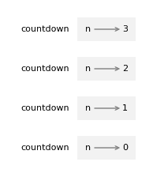

# 5. 条件语句与递归

> 原文：[`allendowney.github.io/ThinkPython/chap05.html`](https://allendowney.github.io/ThinkPython/chap05.html)

本章的主要主题是`if`语句，根据程序的状态执行不同的代码。通过`if`语句，我们将能够探索计算机科学中的一个强大概念——**递归**。

但我们将从三个新特性开始：取模运算符、布尔表达式和逻辑运算符。

## 5.1. 整数除法与取模

回想一下，整数除法运算符`//`将两个数字相除并向下舍入为整数。例如，假设一部电影的放映时间是 105 分钟，你可能想知道这是多少小时。常规除法返回一个浮动数值：

```py
minutes = 105
minutes / 60 
```

```py
1.75 
```

但是我们通常不写带小数点的小时数。整数除法返回整数小时数，并向下舍入：

```py
minutes = 105
hours = minutes // 60
hours 
```

```py
1 
```

要得到余数，你可以用分钟形式减去一小时：

```py
remainder = minutes - hours * 60
remainder 
```

```py
45 
```

或者你可以使用**取模运算符**，`%`，它将两个数字相除并返回余数。

```py
remainder = minutes % 60
remainder 
```

```py
45 
```

取模运算符比看起来更有用。例如，它可以检查一个数字是否能被另一个数字整除——如果`x % y`为零，那么`x`能被`y`整除。

同时，它还可以提取数字的最右边一位或几位。例如，`x % 10`返回`x`的最右一位数字（以十进制表示）。类似地，`x % 100`返回最后两位数字。

```py
x = 123
x % 10 
```

```py
3 
```

```py
x % 100 
```

```py
23 
```

最后，取模运算符可以进行“钟表算术”。例如，如果一个事件从上午 11 点开始并持续三小时，我们可以使用取模运算符来计算它结束的时间。

```py
start = 11
duration = 3
end = (start + duration) % 12
end 
```

```py
2 
```

该事件将于下午 2 点结束。

## 5.2. 布尔表达式

**布尔表达式**是一个值为真或假的表达式。例如，下面的表达式使用了等于运算符`==`，它比较两个值，如果它们相等则返回`True`，否则返回`False`：

```py
5 == 5 
```

```py
True 
```

```py
5 == 7 
```

```py
False 
```

一个常见的错误是使用单个等号（`=`）而不是双等号（`==`）。记住，`=`是将值赋给变量，而`==`是比较两个值。

```py
x = 5
y = 7 
```

```py
x == y 
```

```py
False 
```

`True`和`False`是属于`bool`类型的特殊值；它们不是字符串：

```py
type(True) 
```

```py
bool 
```

```py
type(False) 
```

```py
bool 
```

`==`运算符是**关系运算符**之一；其他的有：

```py
x != y               # x is not equal to y 
```

```py
True 
```

```py
x > y                # x is greater than y 
```

```py
False 
```

```py
x < y               # x is less than to y 
```

```py
True 
```

```py
x >= y               # x is greater than or equal to y 
```

```py
False 
```

```py
x <= y               # x is less than or equal to y 
```

```py
True 
```

## 5.3. 逻辑运算符

要将布尔值组合成表达式，我们可以使用**逻辑运算符**。最常见的有`and`、`or`和`not`。这些运算符的意义与它们在英语中的含义相似。例如，下面的表达式的值为`True`，当且仅当`x`大于`0` *并且*小于`10`。

```py
x > 0 and x < 10 
```

```py
True 
```

如果*任一或两个*条件为真，下面的表达式的值为`True`，即如果数字能被 2 *或* 3 整除：

```py
x % 2 == 0 or x % 3 == 0 
```

```py
False 
```

最后，`not`运算符否定一个布尔表达式，因此如果`x > y`为`False`，下面的表达式将是`True`。

```py
not x > y 
```

```py
True 
```

严格来说，逻辑运算符的操作数应该是布尔表达式，但 Python 并不严格。任何非零数字都会被解释为`True`：

```py
42 and True 
```

```py
True 
```

这种灵活性可能很有用，但它有一些细节可能让人困惑。你可能会想避免使用它。

## 5.4\. if 语句

为了编写有用的程序，我们几乎总是需要能够检查条件，并根据条件改变程序的行为。**条件语句**赋予我们这个能力。最简单的形式是`if`语句：

```py
if x > 0:
    print('x is positive') 
```

```py
x is positive 
```

`if`是 Python 的关键字。`if`语句的结构与函数定义相同：一个头部，后跟一个缩进的语句或语句序列，称为**块**。

`if`后面的布尔表达式称为**条件**。如果条件为真，缩进块中的语句会执行。如果条件为假，则不执行。

在块中可以包含任意数量的语句，但必须至少包含一个。有时，创建一个什么也不做的块是有用的——通常是作为你还未编写代码的占位符。在这种情况下，你可以使用`pass`语句，它什么也不做。

```py
if x < 0:
    pass          # TODO: need to handle negative values! 
```

注释中的`TODO`字样是一个约定，提醒你稍后需要做某事。

## 5.5\. `else`子句

一个`if`语句可以有第二部分，称为`else`子句。语法如下：

```py
if x % 2 == 0:
    print('x is even')
else:
    print('x is odd') 
```

```py
x is odd 
```

如果条件为真，则执行第一个缩进的语句；否则，执行第二个缩进的语句。

在这个例子中，如果`x`是偶数，那么`x`除以`2`的余数是`0`，所以条件为真，程序显示`x is even`。如果`x`是奇数，则余数是`1`，条件为假，程序显示`x is odd`。

由于条件必须为真或假，最终只有一个分支会被执行。分支被称为**分支**。

## 5.6\. 链式条件语句

有时可能存在多于两个的可能性，需要更多的分支。表达这种计算的一种方式是**链式条件语句**，它包含一个`elif`子句。

```py
if x < y:
    print('x is less than y')
elif x > y:
    print('x is greater than y')
else:
    print('x and y are equal') 
```

```py
x is less than y 
```

`elif`是“else if”的缩写。`elif`子句的数量没有限制。如果有`else`子句，它必须位于最后，但不必存在。

每个条件都会按顺序检查。如果第一个条件为假，则检查下一个，以此类推。如果其中一个条件为真，则执行相应的分支，`if`语句结束。即使有多个条件为真，也只有第一个为真的分支会执行。

## 5.7\. 嵌套条件语句

一个条件语句也可以嵌套在另一个条件语句中。我们可以像这样重新编写前一节中的例子：

```py
if x == y:
    print('x and y are equal')
else:
    if x < y:
        print('x is less than y')
    else:
        print('x is greater than y') 
```

```py
x is less than y 
```

外部的`if`语句包含了两个分支。第一个分支包含一个简单的语句。第二个分支包含另一个`if`语句，它有自己的两个分支。那两个分支都是简单语句，尽管它们也可以是条件语句。

尽管语句的缩进使得结构变得清晰，**嵌套条件语句**可能仍然难以阅读。我建议你尽量避免使用它们。

逻辑运算符通常提供了一种简化嵌套条件语句的方法。这里是一个包含嵌套条件的例子。

```py
if 0 < x:
    if x < 10:
        print('x is a positive single-digit number.') 
```

```py
x is a positive single-digit number. 
```

只有当我们通过了两个条件判断，`print`语句才会执行，因此我们可以通过`and`运算符获得相同的效果。

```py
if 0 < x and x < 10:
    print('x is a positive single-digit number.') 
```

```py
x is a positive single-digit number. 
```

对于这种情况，Python 提供了一种更简洁的选项：

```py
if 0 < x < 10:
    print('x is a positive single-digit number.') 
```

```py
x is a positive single-digit number. 
```

## 5.8\. 递归

一个函数调用自身是合法的。虽然它为什么是个好事可能不那么显而易见，但事实证明，这是程序能够做的最神奇的事情之一。这里有一个例子。

```py
def countdown(n):
    if n <= 0:
        print('Blastoff!')
    else:
        print(n)
        countdown(n-1) 
```

如果`n`为 0 或负数，`countdown`输出单词“Blastoff!”否则，它输出`n`，然后调用自身，传递`n-1`作为参数。

这是当我们以参数`3`调用此函数时发生的情况。

```py
countdown(3) 
```

```py
3
2
1
Blastoff! 
```

`countdown`的执行从`n=3`开始，由于`n`大于`0`，它显示`3`，然后调用自身。…

> `countdown`的执行从`n=2`开始，由于`n`大于`0`，它显示`2`，然后调用自身。…
> 
> > `countdown`的执行从`n=1`开始，由于`n`大于`0`，它显示`1`，然后调用自身。…
> > 
> > > `countdown`的执行从`n=0`开始，由于`n`不大于`0`，它显示“Blastoff!”并返回。
> > > 
> > 得到`n=1`的`countdown`返回。
> > 
> 得到`n=2`的`countdown`返回。

得到`n=3`的`countdown`返回。

一个调用自身的函数是**递归的**。作为另一个例子，我们可以写一个函数，打印字符串`n`次。

```py
def print_n_times(string, n):
    if n > 0:
        print(string)
        print_n_times(string, n-1) 
```

如果`n`为正数，`print_n_times`会显示`string`的值，然后调用自身，传递`string`和`n-1`作为参数。

如果`n`为`0`或负数，条件为假，`print_n_times`什么也不做。

下面是它的工作原理。

```py
print_n_times('Spam ', 4) 
```

```py
Spam 
Spam 
Spam 
Spam 
```

对于像这样的简单例子，可能使用`for`循环会更容易。但稍后我们会看到一些使用`for`循环很难编写而递归容易编写的例子，所以早点开始学习递归是有益的。

## 5.9\. 递归函数的栈图

这是一个栈图，展示了当我们用`n=3`调用`countdown`时创建的框架。



四个`countdown`框架的参数`n`值各不相同。栈底部，即`n=0`的地方，称为**基准情况**。它不再做递归调用，因此没有更多的框架。

## 5.10\. 无限递归

如果递归永远无法到达基准情况，它将不断进行递归调用，程序也永远不会结束。这被称为**无限递归**，通常来说，这种情况是不推荐的。下面是一个包含无限递归的最小函数。

```py
def recurse():
    recurse() 
```

每当`recurse`被调用时，它会调用自己，这样就会创建另一个栈帧。在 Python 中，栈上同时存在的栈帧数量是有限制的。如果程序超出了这个限制，就会导致运行时错误。

```py
recurse() 
```

```py
---------------------------------------------------------------------------
RecursionError  Traceback (most recent call last)
Cell In[40], line 1
----> 1 recurse()

Cell In[38], line 2, in recurse()
  1 def recurse():
----> 2     recurse()

Cell In[38], line 2, in recurse()
  1 def recurse():
----> 2     recurse()

    [... skipping similar frames: recurse at line 2 (2957 times)]

Cell In[38], line 2, in recurse()
  1 def recurse():
----> 2     recurse()

RecursionError: maximum recursion depth exceeded 
```

错误追踪信息显示，错误发生时栈上几乎有 3000 个栈帧。

如果不小心遇到无限递归，检查你的函数，确认是否有一个不进行递归调用的基准情况。如果有基准情况，检查是否能够保证到达它。

## 5.11\. 键盘输入

到目前为止，我们编写的程序没有接收任何来自用户的输入。它们每次都会做相同的事情。

Python 提供了一个内置函数叫做`input`，它会暂停程序并等待用户输入。当用户按下*Return*或*Enter*键时，程序恢复执行，`input`会返回用户输入的内容作为字符串。

```py
text = input() 
```

在获取用户输入之前，你可能想要显示一个提示，告诉用户应该输入什么。`input`可以接受一个提示作为参数：

```py
name = input('What...is your name?\n')
name 
```

```py
What...is your name?
It is Arthur, King of the Britons 
```

```py
'It is Arthur, King of the Britons' 
```

提示末尾的序列`\n`表示**换行符**，它是一个特殊字符，导致换行——这样用户的输入就会显示在提示的下方。

如果你期望用户输入一个整数，可以使用`int`函数将返回值转换为`int`。

```py
prompt = 'What...is the airspeed velocity of an unladen swallow?\n'
speed = input(prompt)
speed 
```

```py
What...is the airspeed velocity of an unladen swallow?
What do you mean: an African or European swallow? 
```

```py
'What do you mean: an African or European swallow?' 
```

但如果用户输入了非整数的内容，你将得到一个运行时错误。

```py
int(speed) 
```

```py
ValueError: invalid literal for int() with base 10: 'What do you mean: an African or European swallow?' 
```

我们将在后面学习如何处理这种类型的错误。

## 5.12\. 调试

当出现语法错误或运行时错误时，错误消息包含了大量信息，但可能会让人感到不知所措。通常最有用的部分是：

+   错误的类型是什么，以及

+   错误发生的位置。

语法错误通常很容易找到，但也有一些陷阱。与空格和制表符相关的错误可能会很棘手，因为它们是不可见的，而我们习惯于忽略它们。

```py
x = 5
 y = 6 
```

```py
 Cell In[49], line 2
    y = 6
    ^
IndentationError: unexpected indent 
```

在这个例子中，问题在于第二行缩进了一个空格。但是错误信息指向了`y`，这很具有误导性。错误消息指示问题被发现的位置，但实际的错误可能出现在代码的更早部分。

运行时错误也有类似情况。例如，假设你尝试将一个比率转换为分贝，如下所示：

```py
import math
numerator = 9
denominator = 10
ratio = numerator // denominator
decibels = 10 * math.log10(ratio) 
```

```py
---------------------------------------------------------------------------
ValueError  Traceback (most recent call last)
Cell In[51], line 5
  3 denominator = 10
  4 ratio = numerator // denominator
----> 5 decibels = 10 * math.log10(ratio)

ValueError: math domain error 
```

错误信息显示的是第 5 行，但那一行没有问题。问题出在第 4 行，那里使用了整数除法而不是浮点数除法——结果是`ratio`的值为`0`。当我们调用`math.log10`时，会得到一个`ValueError`，错误信息为`math domain error`，因为`0`不在`math.log10`的有效参数“域”内，因为`0`的对数是未定义的。

一般来说，你应该花时间仔细阅读错误信息，但不要假设它们说的每句话都是正确的。

## 5.13\. 词汇表

**递归：** 调用当前正在执行的函数的过程。

**取模运算符：** 一个运算符`%`，用于整数，并返回一个数字除以另一个数字后的余数。

**布尔表达式：** 其值为`True`或`False`的表达式。

**关系运算符：** 用于比较操作数的运算符：`==`、`!=`、`>`、`<`、`>=`和`<=`。

**逻辑运算符：** 用于组合布尔表达式的运算符，包括`and`、`or`和`not`。

**条件语句：** 根据某些条件控制执行流程的语句。

**条件：** 条件语句中的布尔表达式，决定执行哪个分支。

**代码块：** 一个或多个缩进的语句，表示它们是另一个语句的一部分。

**分支：** 条件语句中的一个替代执行语句序列。

**链式条件：** 具有一系列替代分支的条件语句。

**嵌套条件：** 出现在另一个条件语句分支中的条件语句。

**递归：** 调用自身的函数就是递归的。

**基本情况：** 递归函数中的一个条件分支，不进行递归调用。

**无限递归：** 没有基本情况或永远达不到基本情况的递归。最终，无限递归会导致运行时错误。

**换行符：** 在字符串的两个部分之间创建换行的字符。

## 5.14\. 练习

```py
# This cell tells Jupyter to provide detailed debugging information
# when a runtime error occurs. Run it before working on the exercises.

%xmode Verbose 
```

```py
Exception reporting mode: Verbose 
```

### 5.14.1\. 向虚拟助手提问

+   向虚拟助手询问：“取模运算符有什么用途？”

+   Python 提供了运算符来计算逻辑操作`and`、`or`和`not`，但它没有计算排他性`or`操作的运算符，通常写作`xor`。向助手询问：“什么是逻辑`xor`操作，我如何在 Python 中计算它？”

在本章中，我们看到了两种写三分支`if`语句的方法，使用链式条件或嵌套条件。你可以使用虚拟助手将它们相互转换。例如，问虚拟助手：“将这条语句转换为链式条件。”

```py
if x == y:
    print('x and y are equal')
else:
    if x < y:
        print('x is less than y')
    else:
        print('x is greater than y') 
```

```py
x is less than y 
```

向虚拟助手询问：“用一个条件重写这条语句。”

```py
if 0 < x:
    if x < 10:
        print('x is a positive single-digit number.') 
```

```py
x is a positive single-digit number. 
```

看看虚拟助手是否能简化这个不必要的复杂性。

```py
if not x <= 0 and not x >= 10:
    print('x is a positive single-digit number.') 
```

```py
x is a positive single-digit number. 
```

这是一个尝试递归的函数，它以 2 为步长倒数。

```py
def countdown_by_two(n):
    if n == 0:
        print('Blastoff!')
    else:
        print(n)
        countdown_by_two(n-2) 
```

看起来它能正常工作。

```py
countdown_by_two(6) 
```

```py
6
4
2
Blastoff! 
```

但它有一个错误。询问虚拟助手问题出在哪里，以及如何修复它。将它提供的解决方案粘贴回来并进行测试。

### 5.14.2\. 练习

`time`模块提供了一个名为`time`的函数，它返回自“Unix 纪元”（1970 年 1 月 1 日 00:00:00 UTC 协调世界时）以来的秒数。

```py
from time import time

now = time()
now 
```

```py
1716394001.8466134 
```

使用整数除法和取模运算符来计算自 1970 年 1 月 1 日以来的天数，并且计算当前的时、分、秒。

你可以在[`docs.python.org/3/library/time.html`](https://docs.python.org/3/library/time.html)上阅读更多关于`time`模块的信息。

### 5.14.3\. 练习

如果你给定了三根棍子，你可能无法将它们排列成三角形。例如，如果其中一根棍子长 12 英寸，而其他两根棍子长 1 英寸，你就无法让短棍在中间相遇。对于任何三条边，都有一个测试来判断是否可以形成三角形：

> 如果三条边中的任何一条大于其他两条边的和，那么就不能形成三角形。否则，可以形成三角形。（如果两条边的和等于第三条边，它们就形成了所谓的“退化”三角形。）

编写一个名为`is_triangle`的函数，接受三个整数作为参数，并根据是否能够从给定长度的棍子中形成三角形，打印“是”或“否”。提示：使用链式条件。

### 5.14.4\. 练习

以下程序的输出是什么？绘制一个堆栈图，展示程序打印结果时的状态。

```py
def recurse(n, s):
    if n == 0:
        print(s)
    else:
        recurse(n-1, n+s)

recurse(3, 0) 
```

```py
6 
```

### 5.14.5\. 练习

以下练习使用了第四章中描述的`jupyturtle`模块。

阅读以下函数，看看你能否弄清楚它的作用。然后运行它，看看你是否理解正确。调整`length`、`angle`和`factor`的值，观察它们对结果的影响。如果你不确定自己理解其工作原理，可以尝试问一个虚拟助手。

```py
from jupyturtle import forward, left, right, back

def draw(length):
    angle = 50
    factor = 0.6

    if length > 5:
        forward(length)
        left(angle)
        draw(factor * length)
        right(2 * angle)
        draw(factor * length)
        left(angle)
        back(length) 
```

### 5.14.6\. 练习

问虚拟助手：“什么是科赫曲线？”

要画一个长度为`x`的科赫曲线，你只需要

1.  画一个长度为`x/3`的科赫曲线。

1.  向左转 60 度。

1.  画一个长度为`x/3`的科赫曲线。

1.  向右转 120 度。

1.  画一个长度为`x/3`的科赫曲线。

1.  向左转 60 度。

1.  画一个长度为`x/3`的科赫曲线。

例外情况是如果`x`小于`5`——在这种情况下，你可以直接画一条长度为`x`的直线。

编写一个名为`koch`的函数，接受`x`作为参数，并绘制给定长度的科赫曲线。

结果应如下所示：

```py
make_turtle(delay=0)
koch(120) 
```

### 5.14.7\. 练习

虚拟助理知道`jupyturtle`模块中的功能，但这些功能有许多版本，名称不同，因此助理可能不知道你在谈论哪个版本。

解决这个问题的方法是，在提问之前，你可以提供额外的信息。例如，你可以以“这是一个使用`jupyturtle`模块的程序”开头，然后粘贴本章节中的一个示例。之后，助理应该能够生成使用此模块的代码。

例如，向助理询问绘制谢尔宾斯基三角形的程序。你得到的代码应该是一个很好的起点，但你可能需要进行一些调试。如果第一次尝试不起作用，你可以告诉助理发生了什么，并请求帮助，或者自行调试。

这是结果的大致样子，尽管你得到的版本可能会有所不同。

```py
make_turtle(delay=0, height=200)

draw_sierpinski(100, 3) 
```

[《Think Python：第三版》](https://allendowney.github.io/ThinkPython/index.html)

版权 2024 [Allen B. Downey](https://allendowney.com)

代码许可：[MIT 许可证](https://mit-license.org/)

文本许可：[知识共享署名-非商业性使用-相同方式共享 4.0 国际](https://creativecommons.org/licenses/by-nc-sa/4.0/)
