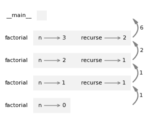

# 6. 返回值

> 原文：[`allendowney.github.io/ThinkPython/chap06.html`](https://allendowney.github.io/ThinkPython/chap06.html)

在前面的章节中，我们使用了内置函数——如`abs`和`round`——以及数学模块中的函数——如`sqrt`和`pow`。当你调用这些函数中的一个时，它返回一个值，你可以将其赋值给一个变量或作为表达式的一部分使用。

迄今为止我们编写的函数是不同的。有些使用`print`函数显示值，有些使用 turtle 函数绘制图形。但它们没有返回我们赋值给变量或在表达式中使用的值。

在本章中，我们将看到如何编写返回值的函数。

## 6.1. 有些函数有返回值

当你像调用`math.sqrt`这样的函数时，结果被称为**返回值**。如果函数调用出现在单元格的末尾，Jupyter 会立即显示返回值。

```py
import math

math.sqrt(42 / math.pi) 
```

```py
3.656366395715726 
```

如果你将返回值赋值给一个变量，它不会被显示。

```py
radius = math.sqrt(42 / math.pi) 
```

但你可以稍后显示它。

```py
radius 
```

```py
3.656366395715726 
```

或者你可以将返回值作为表达式的一部分使用。

```py
radius + math.sqrt(42 / math.pi) 
```

```py
7.312732791431452 
```

这是一个返回值的函数示例。

```py
def circle_area(radius):
    area = math.pi * radius**2
    return area 
```

`circle_area`将`radius`作为参数，计算该半径的圆的面积。

最后一行是一个`return`语句，它返回`area`的值。

如果我们像这样调用函数，Jupyter 会显示返回值。

```py
circle_area(radius) 
```

```py
42.00000000000001 
```

我们可以将返回值赋值给一个变量。

```py
a = circle_area(radius) 
```

或者将其作为表达式的一部分使用。

```py
circle_area(radius) + 2 * circle_area(radius / 2) 
```

```py
63.000000000000014 
```

后面我们可以显示赋值给结果的变量的值。

```py
a 
```

```py
42.00000000000001 
```

但我们无法访问`area`。

```py
area 
```

```py
NameError: name 'area' is not defined 
```

`area`是函数中的局部变量，因此我们无法从函数外部访问它。

## 6.2. 有些函数返回 None

如果一个函数没有`return`语句，它会返回`None`，这是一个特殊的值，类似于`True`和`False`。例如，这里是第三章中的`repeat`函数。

```py
def repeat(word, n):
    print(word * n) 
```

如果我们像这样调用它，它会显示蒙提·派森歌曲《芬兰》的第一行。

```py
repeat('Finland, ', 3) 
```

```py
Finland, Finland, Finland, 
```

这个函数使用`print`函数来显示一个字符串，但它没有使用`return`语句返回值。如果我们将结果赋值给一个变量，它仍然会显示这个字符串。

```py
result = repeat('Finland, ', 3) 
```

```py
Finland, Finland, Finland, 
```

如果我们显示变量的值，我们什么也得不到。

```py
result 
```

`result`实际上有一个值，但 Jupyter 不会显示它。不过我们可以像这样显示它。

```py
print(result) 
```

```py
None 
```

`repeat`的返回值是`None`。

现在这里有一个类似`repeat`的函数，不同之处在于它有一个返回值。

```py
def repeat_string(word, n):
    return word * n 
```

请注意，我们可以在`return`语句中使用一个表达式，而不仅仅是一个变量。

使用这个版本，我们可以将结果赋值给一个变量。当函数运行时，它不会显示任何内容。

```py
line = repeat_string('Spam, ', 4) 
```

但之后我们可以显示赋值给`line`的值。

```py
line 
```

```py
'Spam, Spam, Spam, Spam, ' 
```

这样的函数被称为**纯函数**，因为它不会显示任何内容或产生任何其他效果——除了返回一个值。

## 6.3. 返回值与条件语句

如果 Python 没有提供`abs`，我们可以像这样编写它。

```py
def absolute_value(x):
    if x < 0:
        return -x
    else:
        return x 
```

如果`x`为负，第一条`return`语句返回`-x`，函数立即结束。否则，第二条`return`语句返回`x`，函数结束。因此，这个函数是正确的。

然而，如果你将`return`语句放在条件语句中，你必须确保程序的每一条路径都能到达一个`return`语句。例如，这是一个错误版本的`absolute_value`。

```py
def absolute_value_wrong(x):
    if x < 0:
        return -x
    if x > 0:
        return x 
```

如果我们以`0`作为参数调用这个函数，会发生什么呢？

```py
absolute_value_wrong(0) 
```

什么都没有得到！问题在于：当`x`为`0`时，两个条件都不成立，函数结束而没有执行`return`语句，这意味着返回值是`None`，因此 Jupyter 不会显示任何内容。

另一个例子，这是一个带有额外`return`语句的`absolute_value`版本。

```py
def absolute_value_extra_return(x):
    if x < 0:
        return -x
    else:
        return x

    return 'This is dead code' 
```

如果`x`为负，第一条`return`语句执行，函数结束。否则，第二条`return`语句执行，函数结束。无论哪种情况，我们都不会到达第三条`return`语句——因此它永远不会执行。

不能运行的代码叫做**死代码**。通常情况下，死代码不会造成任何危害，但它通常表明存在误解，并且可能会让试图理解程序的人感到困惑。

## 6.4\. 增量开发

当你编写更大的函数时，可能会发现你花费更多时间在调试上。为了应对越来越复杂的程序，你可能会想尝试**增量开发**，这是一种每次只添加和测试少量代码的方式。

举个例子，假设你想找出由坐标\((x_1, y_1)\)和\((x_2, y_2)\)表示的两点之间的距离。根据毕达哥拉斯定理，距离是：

\[\mathrm{distance} = \sqrt{(x_2 - x_1)² + (y_2 - y_1)²}\]

第一步是考虑一个`distance`函数在 Python 中应该是什么样子的——也就是说，输入（参数）是什么，输出（返回值）是什么？

对于这个函数，输入是点的坐标。返回值是距离。你可以立即写出函数的大纲：

```py
def distance(x1, y1, x2, y2):
    return 0.0 
```

这个版本尚未计算距离——它总是返回零。但它是一个完整的函数，具有返回值，这意味着你可以在使其更复杂之前进行测试。

为了测试这个新函数，我们将用样本参数调用它：

```py
distance(1, 2, 4, 6) 
```

```py
0.0 
```

我选择这些值是为了让水平距离为`3`，垂直距离为`4`。这样，结果就是`5`，这是一个`3-4-5`直角三角形的斜边长度。测试一个函数时，知道正确的答案是非常有用的。

此时，我们已经确认函数可以运行并返回一个值，我们可以开始向函数体中添加代码。一个好的下一步是找出`x2 - x1`和`y2 - y1`的差值。这是一个将这些值存储在临时变量中的版本，并显示它们。

```py
def distance(x1, y1, x2, y2):
    dx = x2 - x1
    dy = y2 - y1
    print('dx is', dx)
    print('dy is', dy)
    return 0.0 
```

如果函数正常工作，它应该显示`dx is 3`和`dy is 4`。如果是这样，我们就知道函数已经得到了正确的参数并且正确地进行了第一次计算。如果不是，检查的代码行就很少。

```py
distance(1, 2, 4, 6) 
```

```py
dx is 3
dy is 4 
```

```py
0.0 
```

到目前为止很好。接下来我们计算`dx`和`dy`的平方和：

```py
def distance(x1, y1, x2, y2):
    dx = x2 - x1
    dy = y2 - y1
    dsquared = dx**2 + dy**2
    print('dsquared is: ', dsquared)
    return 0.0 
```

再次运行函数并检查输出，应该是`25`。

```py
distance(1, 2, 4, 6) 
```

```py
dsquared is:  25 
```

```py
0.0 
```

最后，我们可以使用`math.sqrt`来计算距离：

```py
def distance(x1, y1, x2, y2):
    dx = x2 - x1
    dy = y2 - y1
    dsquared = dx**2 + dy**2
    result = math.sqrt(dsquared)
    print("result is", result) 
```

然后进行测试。

```py
distance(1, 2, 4, 6) 
```

```py
result is 5.0 
```

结果是正确的，但这个版本的函数显示了结果，而不是返回它，因此返回值是`None`。

我们可以通过用`return`语句替换`print`函数来修复这个问题。

```py
def distance(x1, y1, x2, y2):
    dx = x2 - x1
    dy = y2 - y1
    dsquared = dx**2 + dy**2
    result = math.sqrt(dsquared)
    return result 
```

这个版本的`distance`是一个纯函数。如果我们这样调用它，只有结果会被显示。

```py
distance(1, 2, 4, 6) 
```

```py
5.0 
```

如果我们将结果赋值给一个变量，什么也不会显示。

```py
d = distance(1, 2, 4, 6) 
```

我们编写的`print`语句对于调试很有用，但一旦函数正常工作，就可以将它们移除。这样的代码称为**临时代码**，它在构建程序时很有帮助，但不是最终产品的一部分。

这个例子演示了渐进式开发。这个过程的关键方面包括：

1.  从一个可运行的程序开始，进行小的修改，并在每次修改后进行测试。

1.  使用变量来保存中间值，以便你可以显示和检查它们。

1.  一旦程序工作正常，就可以移除临时代码。

在任何时候，如果出现错误，你应该有一个清晰的方向去找出问题。渐进式开发可以节省大量的调试时间。

## 6.5\. 布尔函数

函数可以返回布尔值`True`和`False`，这通常方便将复杂的测试封装在函数中。例如，`is_divisible`检查`x`是否能被`y`整除且没有余数。

```py
def is_divisible(x, y):
    if x % y == 0:
        return True
    else:
        return False 
```

这是我们如何使用它的方式。

```py
is_divisible(6, 4) 
```

```py
False 
```

```py
is_divisible(6, 3) 
```

```py
True 
```

在函数内部，`==`运算符的结果是一个布尔值，因此我们可以通过直接返回它来更简洁地编写这个函数。

```py
def is_divisible(x, y):
    return x % y == 0 
```

布尔函数通常用于条件语句中。

```py
if is_divisible(6, 2):
    print('divisible') 
```

```py
divisible 
```

可能会想写成这样：

```py
if is_divisible(6, 2) == True:
    print('divisible') 
```

```py
divisible 
```

但是比较是没有必要的。

## 6.6\. 带返回值的递归

现在我们可以编写具有返回值的函数，我们也可以编写具有返回值的递归函数，有了这个能力，我们已经跨越了一个重要的门槛——我们现在拥有的 Python 子集是**图灵完备**的，这意味着我们可以执行任何可以通过算法描述的计算。

为了演示带返回值的递归，我们将评估几个递归定义的数学函数。递归定义类似于循环定义，定义中会引用正在定义的事物。真正的循环定义并不十分有用：

> vorpal：用于描述某物是 vorpal 的形容词。

如果你在字典里看到了这个定义，可能会觉得很烦恼。另一方面，如果你查阅阶乘函数的定义，用符号\(!\)表示，可能会得到如下内容：

\[\begin{split}\begin{aligned} 0! &= 1 \\ n! &= n~(n-1)! \end{aligned}\end{split}\]

这个定义表示，\(0\)的阶乘是\(1\)，而任何其他值\(n\)的阶乘是\(n\)与\(n-1\)的阶乘相乘。

如果你能写出某个东西的递归定义，你就能写一个 Python 程序来计算它。按照增量开发的过程，我们首先从一个接受`n`作为参数并总是返回`0`的函数开始。

```py
def factorial(n):
    return 0 
```

现在让我们添加定义的第一部分——如果参数恰好是`0`，我们只需要返回`1`：

```py
def factorial(n):
    if n == 0:
        return 1
    else:
        return 0 
```

现在让我们填写第二部分——如果`n`不为`0`，我们必须进行递归调用，找到`n-1`的阶乘，然后将结果与`n`相乘：

```py
def factorial(n):
    if n == 0:
        return 1
    else:
        recurse = factorial(n-1)
        return n * recurse 
```

这个程序的执行流程类似于第五章中的`countdown`流程。如果我们用值`3`调用`factorial`：

由于`3`不等于`0`，我们采取第二个分支并计算`n-1`的阶乘。…

> 由于`2`不等于`0`，我们采取第二个分支并计算`n-1`的阶乘。…
> 
> > 由于`1`不等于`0`，我们采取第二个分支并计算`n-1`的阶乘。…
> > 
> > > 由于`0`等于`0`，我们采取第一个分支并返回`1`，不再进行递归调用。
> > > 
> > 返回值`1`与`n`（即`1`）相乘，结果被返回。
> > 
> 返回值`1`与`n`（即`2`）相乘，结果被返回。

返回值`2`与`n`（即`3`）相乘，结果`6`成为整个过程启动时函数调用的返回值。

下图展示了这个函数调用序列的栈图。



返回值被显示为从栈中返回。在每一帧中，返回值是`n`与`recurse`的乘积。

在最后一帧中，本地变量`recurse`不存在，因为创建它的分支没有执行。

## 6.7\. 信念的飞跃

跟踪执行流程是阅读程序的一种方式，但它很快就会变得让人不堪重负。另一种方法是我所称的“信念的飞跃”。当你遇到一个函数调用时，与你跟踪执行流程不同，你可以*假设*该函数正确工作并返回正确的结果。

实际上，当你使用内置函数时，你已经在实践这种“信念的飞跃”。当你调用`abs`或`math.sqrt`时，你并没有检查这些函数的内部实现——你只是认为它们是有效的。

当你调用自己的函数时，也是如此。例如，之前我们写了一个名为`is_divisible`的函数，用来判断一个数是否能被另一个数整除。一旦我们确信这个函数是正确的，就可以在不再查看函数体的情况下使用它。

递归程序也是如此。当你到达递归调用时，应该假设递归调用是正确的，而不是跟随执行流程。然后你应该问自己，“假设我可以计算\(n-1\)的阶乘，我能计算\(n\)的阶乘吗？”阶乘的递归定义意味着你可以通过乘以\(n\)来计算。

当然，假设一个函数在你还没写完的时候就能正确工作，这有点奇怪，但这就是为什么它被称为信任的跳跃！

## 6.8\. 斐波那契

在`factorial`之后，最常见的递归函数示例是`fibonacci`，它有如下定义：

\[\begin{split}\begin{aligned} \mathrm{fibonacci}(0) &= 0 \\ \mathrm{fibonacci}(1) &= 1 \\ \mathrm{fibonacci}(n) &= \mathrm{fibonacci}(n-1) + \mathrm{fibonacci}(n-2) \end{aligned}\end{split}\]

将其翻译为 Python 代码，像这样：

```py
def fibonacci(n):
    if n == 0:
        return 0
    elif  n == 1:
        return 1
    else:
        return fibonacci(n-1) + fibonacci(n-2) 
```

如果你尝试跟踪这里的执行流程，即使是对于较小的\(n\)值，你也会感到头晕目眩。但根据信任的跳跃法则，如果你假设两个递归调用是正确的，你就可以确信最后的`return`语句是正确的。

顺便提一下，这种计算斐波那契数的方法效率非常低。在第十章中，我会解释为什么，并提出一种改进方法。

## 6.9\. 检查类型

如果我们调用`factorial`并将`1.5`作为参数传递，会发生什么呢？

```py
factorial(1.5) 
```

```py
RecursionError: maximum recursion depth exceeded in comparison 
```

看起来像是无限递归。这怎么可能呢？函数在`n == 1`或`n == 0`时有基本情况。但如果`n`不是整数，我们可能会*错过*基本情况并进行无限递归。

在这个例子中，`n`的初始值为`1.5`。在第一次递归调用中，`n`的值是`0.5`。接下来是`-0.5`，然后它变得更小（更负），但永远不会是`0`。

为了避免无限递归，我们可以使用内置函数`isinstance`来检查参数的类型。下面是我们检查一个值是否为整数的方法。

```py
isinstance(3, int) 
```

```py
True 
```

```py
isinstance(1.5, int) 
```

```py
False 
```

现在，这是一个带有错误检查的`factorial`版本。

```py
def factorial(n):
    if not isinstance(n, int):
        print('factorial is only defined for integers.')
        return None
    elif n < 0:
        print('factorial is not defined for negative numbers.')
        return None
    elif n == 0:
        return 1
    else:
        return n * factorial(n-1) 
```

首先，它检查`n`是否为整数。如果不是，它会显示一个错误消息并返回`None`。

```py
factorial('crunchy frog') 
```

```py
factorial is only defined for integers. 
```

然后，它检查`n`是否为负数。如果是，它会显示一个错误消息并返回`None`。

```py
factorial(-2) 
```

```py
factorial is not defined for negative numbers. 
```

如果我们通过了两个检查，我们就知道`n`是一个非负整数，因此可以确信递归会终止。检查函数的参数以确保它们具有正确的类型和值，称为**输入验证**。

## 6.10\. 调试

将一个大型程序分解成更小的函数会创建自然的调试检查点。如果某个函数无法正常工作，可以考虑三种可能性：

+   函数获取的参数有问题——也就是说，前置条件被违反了。

+   函数有问题——也就是说，后置条件被违反了。

+   调用者在返回值的使用上出现了问题。

为了排除第一种可能性，可以在函数的开始处添加`print`语句，显示参数的值（可能还包括它们的类型）。或者你可以写代码显式检查前置条件。

如果参数看起来没问题，可以在每个`return`语句之前添加`print`语句，显示返回值。如果可能，使用有助于检查结果的参数调用函数。

如果函数似乎在工作，检查函数调用，确保返回值被正确使用——或者至少被使用！

在函数的开始和结束处添加`print`语句可以帮助使执行流程更加可见。例如，以下是带有`print`语句的`factorial`函数版本：

```py
def factorial(n):
    space = ' ' * (4 * n)
    print(space, 'factorial', n)
    if n == 0:
        print(space, 'returning 1')
        return 1
    else:
        recurse = factorial(n-1)
        result = n * recurse
        print(space, 'returning', result)
        return result 
```

`space` 是一个由空格字符组成的字符串，用来控制输出的缩进。以下是`factorial(3)`的结果：

```py
factorial(3) 
```

```py
 factorial 3
         factorial 2
     factorial 1
 factorial 0
 returning 1
     returning 1
         returning 2
             returning 6 
```

```py
6 
```

如果你对执行流程感到困惑，这种输出可能会很有帮助。开发有效的脚手架代码需要一些时间，但少量的脚手架代码可以节省大量调试时间。

## 6.11\. 术语表

**返回值：** 函数的结果。如果函数调用作为表达式使用，则返回值是该表达式的值。

**纯函数：** 一个不会显示任何内容或产生任何其他副作用的函数，除了返回返回值之外。

**死代码：** 程序中无法运行的部分，通常是因为它出现在`return`语句之后。

**增量开发：** 一种程序开发计划，旨在通过一次只添加和测试少量代码来避免调试。

**脚手架代码：** 在程序开发过程中使用的代码，但不是最终版本的一部分。

**图灵完备：** 如果一个语言或语言的子集能够执行任何可以通过算法描述的计算，那么它是图灵完备的。

**输入验证：** 检查函数的参数，确保它们具有正确的类型和值。

## 6.12\. 练习

```py
# This cell tells Jupyter to provide detailed debugging information
# when a runtime error occurs. Run it before working on the exercises.

%xmode Verbose 
```

```py
Exception reporting mode: Verbose 
```

### 6.12.1\. 向虚拟助手询问

在本章中，我们看到一个不正确的函数，它可能在没有返回值的情况下结束。

```py
def absolute_value_wrong(x):
    if x < 0:
        return -x
    if x > 0:
        return x 
```

这是同一个函数的一个版本，它在末尾有死代码。

```py
def absolute_value_extra_return(x):
    if x < 0:
        return -x
    else:
        return x

    return 'This is dead code.' 
```

我们看到了以下示例，这虽然是正确的，但不够地道。

```py
def is_divisible(x, y):
    if x % y == 0:
        return True
    else:
        return False 
```

向虚拟助手询问这些函数的错误，并看看它是否能发现错误或改进风格。

然后问：“编写一个函数，接受两点的坐标并计算它们之间的距离。”看看结果是否与我们在本章中编写的`distance`函数类似。

### 6.12.2\. 练习

使用增量开发编写一个名为`hypot`的函数，给定直角三角形的其他两个边的长度作为参数，返回斜边的长度。

注意：在数学模块中有一个叫做`hypot`的函数，执行相同的操作，但你不应该在这个练习中使用它！

即使你第一次就能正确编写该函数，还是从一个始终返回`0`的函数开始，并练习逐步修改，边修改边测试。完成后，该函数应仅返回一个值——不应输出任何内容。

### 6.12.3\. 练习

编写一个布尔函数`is_between(x, y, z)`，如果\(x < y < z\)或者\(z < y < x\)，则返回`True`，否则返回`False`。

### 6.12.4\. 练习

阿克曼函数\(A(m, n)\)定义如下：

\[\begin{split}\begin{aligned} A(m, n) = \begin{cases} n+1 & \mbox{如果} m = 0 \\ A(m-1, 1) & \mbox{如果} m > 0 \mbox{ 且 } n = 0 \\ A(m-1, A(m, n-1)) & \mbox{如果} m > 0 \mbox{ 且 } n > 0. \end{cases} \end{aligned}\end{split}\]

编写一个名为`ackermann`的函数来计算阿克曼函数。当你调用`ackermann(5, 5)`时，会发生什么？

### 6.12.5\. 练习

\(a\)和\(b\)的最大公约数（GCD）是能够整除它们两者且没有余数的最大数。

找到两个数的 GCD 的一种方法是基于以下观察：如果\(r\)是将\(a\)除以\(b\)后的余数，那么\(gcd(a, b) = gcd(b, r)\)。作为基础情况，我们可以使用\(gcd(a, 0) = a\)。

编写一个名为`gcd`的函数，接受参数`a`和`b`，并返回它们的最大公约数。

[Think Python: 第 3 版](https://allendowney.github.io/ThinkPython/index.html)

版权 2024 [Allen B. Downey](https://allendowney.com)

代码许可证：[MIT 许可证](https://mit-license.org/)

文本许可证：[创意共享署名-非商业性使用-相同方式共享 4.0 国际版](https://creativecommons.org/licenses/by-nc-sa/4.0/)
