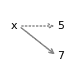

# 7\. 迭代与搜索

> 原文：[`allendowney.github.io/ThinkPython/chap07.html`](https://allendowney.github.io/ThinkPython/chap07.html)

1939 年，厄尼斯特·文森特·赖特（Ernest Vincent Wright）出版了一本名为*《盖兹比》*的小说，这本小说有 50,000 个单词，却不包含字母“e”。因为“e”是英语中最常见的字母，甚至写几个不使用它的单词也是困难的。为了感受它的难度，在本章中我们将计算英语单词中至少包含一个“e”的比例。

为此，我们将使用`for`语句循环遍历字符串中的字母和文件中的单词，并在循环中更新变量以统计包含字母“e”的单词数量。我们将使用`in`运算符来检查字母是否出现在单词中，你将学习一种叫做“线性搜索”的编程模式。

作为练习，你将使用这些工具来解决一个叫做“拼字蜂”（Spelling Bee）的字谜。

## 7.1\. 循环与字符串

在第三章中，我们看到一个使用`range`函数的`for`循环来显示一系列数字。

```py
for i in range(3):
    print(i, end=' ') 
```

```py
0 1 2 
```

这个版本使用了关键字参数`end`，因此`print`函数在每个数字后面添加一个空格，而不是换行符。

我们还可以使用`for`循环来显示字符串中的字母。

```py
for letter in 'Gadsby':
    print(letter, end=' ') 
```

```py
G a d s b y 
```

请注意，我将变量名从`i`更改为`letter`，这样可以提供更多关于它所代表的值的信息。在`for`循环中定义的变量称为**循环变量**。

现在我们可以遍历单词中的字母，检查它是否包含字母“e”。

```py
for letter in "Gadsby":
    if letter == 'E' or letter == 'e':
        print('This word has an "e"') 
```

在继续之前，我们将把这个循环封装成一个函数。

```py
def has_e():
    for letter in "Gadsby":
        if letter == 'E' or letter == 'e':
            print('This word has an "e"') 
```

我们让它成为一个纯函数，如果单词包含“e”则返回`True`，否则返回`False`。

```py
def has_e():
    for letter in "Gadsby":
        if letter == 'E' or letter == 'e':
            return True
    return False 
```

我们可以将其推广为以单词作为参数。

```py
def has_e(word):
    for letter in word:
        if letter == 'E' or letter == 'e':
            return True
    return False 
```

现在我们可以这样测试：

```py
has_e('Gadsby') 
```

```py
False 
```

```py
has_e('Emma') 
```

```py
True 
```

## 7.2\. 阅读单词列表

为了查看有多少单词包含字母“e”，我们需要一个单词列表。我们将使用一个包含约 114,000 个官方填字游戏单词的列表；即那些被认为在填字游戏和其他字谜游戏中有效的单词。

单词列表保存在一个名为`words.txt`的文件中，该文件已在本章的笔记本中下载。为了读取它，我们将使用内置函数`open`，它接受文件名作为参数，并返回一个**文件对象**，我们可以用它来读取文件。

```py
file_object = open('words.txt') 
```

文件对象提供了一个叫做`readline`的函数，它从文件中读取字符，直到遇到换行符，并将结果作为字符串返回：

```py
file_object.readline() 
```

```py
'aa\n' 
```

请注意，调用`readline`的语法与我们到目前为止看到的函数不同。这是因为它是一个**方法**，即与对象相关联的函数。在这种情况下，`readline`与文件对象相关联，因此我们使用对象的名称、点操作符和方法名称来调用它。

列表中的第一个单词是“aa”，它是一种岩浆。序列`\n`代表换行符，分隔这个单词与下一个单词。

文件对象会记录它在文件中的位置，因此如果你再次调用`readline`，就会得到下一个单词：

```py
line = file_object.readline()
line 
```

```py
'aah\n' 
```

为了去掉单词结尾的换行符，我们可以使用`strip`，它是一个与字符串关联的方法，因此我们可以这样调用它。

```py
word = line.strip()
word 
```

```py
'aah' 
```

`strip`方法会去除字符串开头和结尾的空白字符——包括空格、制表符和换行符。

你还可以在`for`循环中使用文件对象。这个程序读取`words.txt`并打印每个单词，每行一个：

```py
for line in open('words.txt'):
    word = line.strip()
    print(word) 
```

现在我们可以读取单词列表，下一步是统计它们的数量。为此，我们需要能够更新变量。

## 7.3\. 更新变量

正如你可能已经发现的，给同一个变量做多个赋值是合法的。新的赋值语句会使一个已存在的变量指向新的值（并停止指向旧值）。

例如，下面是一个创建变量的初始赋值。

```py
x = 5
x 
```

```py
5 
```

这里是一个改变变量值的赋值语句。

```py
x = 7
x 
```

```py
7 
```

下图展示了这些赋值在状态图中的样子。



虚线箭头表示`x`不再指向`5`。实线箭头表示它现在指向`7`。

一种常见的赋值类型是**更新**，其中变量的新值依赖于旧值。

```py
x = x + 1
x 
```

```py
8 
```

这条语句的意思是：“获取`x`的当前值，增加 1，然后将结果重新赋值给`x`。”

如果你试图更新一个不存在的变量，会得到一个错误，因为 Python 在赋值给变量之前会先计算右边的表达式。

```py
z = z + 1 
```

```py
NameError: name 'z' is not defined 
```

在你更新变量之前，你必须**初始化**它，通常通过简单的赋值来实现：

```py
z = 0
z = z + 1
z 
```

```py
1 
```

增加变量值的操作称为**增量**；减少变量值的操作称为**减量**。由于这些操作非常常见，Python 提供了**增强赋值运算符**，使得更新变量变得更加简洁。例如，`+=` 运算符会将变量增加给定的数值。

```py
z += 2
z 
```

```py
3 
```

其他算术运算符也有增强赋值运算符，包括`-=`和`*=`。

## 7.4\. 循环与计数

以下程序计算单词列表中单词的数量。

```py
total = 0

for line in open('words.txt'):
    word = line.strip()
    total += 1 
```

它首先将`total`初始化为`0`。每次循环时，它会将`total`增加`1`。因此，当循环结束时，`total`表示单词的总数。

```py
total 
```

```py
113783 
```

这种用来计算某件事情发生次数的变量叫做**计数器**。

我们可以在程序中添加第二个计数器，用来追踪包含字母“e”的单词数量。

```py
total = 0
count = 0

for line in open('words.txt'):
    word = line.strip()
    total = total + 1
    if has_e(word):
        count += 1 
```

让我们来看一看有多少个单词包含字母“e”。

```py
count 
```

```py
76162 
```

作为`total`的百分比，大约三分之二的单词使用了字母“e”。

```py
count / total * 100 
```

```py
66.93618554617122 
```

因此，你可以理解为什么在不使用这些词的情况下构造一本书是多么困难。

## 7.5\. `in` 运算符

我们在本章编写的 `has_e` 版本比实际需要的要复杂。Python 提供了一个运算符 `in`，它检查一个字符是否出现在字符串中。

```py
word = 'Gadsby'
'e' in word 
```

```py
False 
```

所以我们可以将 `has_e` 改写为这样。

```py
def has_e(word):
    if 'E' in word or 'e' in word:
        return True
    else:
        return False 
```

由于 `if` 语句的条件有布尔值，我们可以省略 `if` 语句，直接返回布尔值。

```py
def has_e(word):
    return 'E' in word or 'e' in word 
```

我们可以通过使用 `lower` 方法进一步简化这个函数，`lower` 会将字符串中的字母转换为小写。这里是一个例子。

```py
word.lower() 
```

```py
'gadsby' 
```

`lower` 会创建一个新的字符串——它不会修改现有的字符串——所以 `word` 的值不会改变。

```py
word 
```

```py
'Gadsby' 
```

这是我们在 `has_e` 中如何使用 `lower` 的方法。

```py
def has_e(word):
    return 'e' in word.lower() 
```

```py
has_e('Gadsby') 
```

```py
False 
```

```py
has_e('Emma') 
```

```py
True 
```

## 7.6\. 搜索

基于这个简化版的 `has_e`，我们可以编写一个更通用的函数 `uses_any`，它接受第二个参数，该参数是一个字母的字符串。如果单词中使用了这些字母中的任何一个，它返回 `True`，否则返回 `False`。

```py
def uses_any(word, letters):
    for letter in word.lower():
        if letter in letters.lower():
            return True
    return False 
```

这里是一个结果为 `True` 的例子。

```py
uses_any('banana', 'aeiou') 
```

```py
True 
```

另一个例子中结果是 `False`。

```py
uses_any('apple', 'xyz') 
```

```py
False 
```

`uses_any` 会将 `word` 和 `letters` 转换为小写，因此它可以处理任何大小写组合。

```py
uses_any('Banana', 'AEIOU') 
```

```py
True 
```

`uses_any` 的结构类似于 `has_e`。它会循环遍历 `word` 中的字母并逐个检查。如果找到一个出现在 `letters` 中的字母，它会立即返回 `True`。如果循环结束都没有找到任何字母，它会返回 `False`。

这种模式称为**线性搜索**。在本章末的练习中，你将编写更多使用这种模式的函数。

## 7.7\. Doctest

在第四章中，我们使用了文档字符串来记录函数——即解释它的作用。也可以使用文档字符串来*测试*一个函数。这里是包含测试的 `uses_any` 函数版本。

```py
def uses_any(word, letters):
  """Checks if a word uses any of a list of letters.

 >>> uses_any('banana', 'aeiou')
 True
 >>> uses_any('apple', 'xyz')
 False
 """
    for letter in word.lower():
        if letter in letters.lower():
            return True
    return False 
```

每个测试都以 `>>>` 开头，这是一些 Python 环境中用来表示用户可以输入代码的提示符。在 doctest 中，提示符后跟一个表达式，通常是一个函数调用。接下来的一行表示如果函数正确工作，表达式应具有的值。

在第一个例子中，`'banana'` 使用了 `'a'`，所以结果应该是 `True`。在第二个例子中，`'apple'` 没有使用 `'xyz'` 中的任何字符，所以结果应该是 `False`。

为了运行这些测试，我们必须导入 `doctest` 模块，并运行一个名为 `run_docstring_examples` 的函数。为了让这个函数更容易使用，我编写了以下函数，它接受一个函数对象作为参数。

```py
from doctest import run_docstring_examples

def run_doctests(func):
    run_docstring_examples(func, globals(), name=func.__name__) 
```

我们还没有学习 `globals` 和 `__name__`，可以忽略它们。现在我们可以像这样测试 `uses_any`。

```py
run_doctests(uses_any) 
```

`run_doctests` 会找到文档字符串中的表达式并对其进行评估。如果结果是预期的值，则测试**通过**。否则，它**失败**。

如果所有测试都通过，`run_doctests`将不显示任何输出——在这种情况下，无消息即好消息。若要查看测试失败时发生的情况，下面是`uses_any`的一个错误版本。

```py
def uses_any_incorrect(word, letters):
  """Checks if a word uses any of a list of letters.

 >>> uses_any_incorrect('banana', 'aeiou')
 True
 >>> uses_any_incorrect('apple', 'xyz')
 False
 """
    for letter in word.lower():
        if letter in letters.lower():
            return True
        else:
            return False     # INCORRECT! 
```

这是我们测试时发生的情况。

```py
run_doctests(uses_any_incorrect) 
```

```py
**********************************************************************
File "__main__", line 4, in uses_any_incorrect
Failed example:
    uses_any_incorrect('banana', 'aeiou')
Expected:
    True
Got:
    False 
```

输出包括失败的示例、函数预期生成的值和函数实际生成的值。

如果你不确定为什么这个测试失败，你将有机会作为练习进行调试。

## 7.8\. 词汇表

**循环变量：** 在`for`循环头部定义的变量。

**文件对象：** 一个表示已打开文件的对象，负责追踪文件的哪些部分已被读取或写入。

**方法：** 与对象关联的函数，并通过点操作符调用。

**更新：** 一种赋值语句，用于给已存在的变量赋新值，而不是创建新变量。

**初始化：** 创建一个新变量并为其赋值。

**增量：** 增加变量的值。

**递减：** 减少变量的值。

**计数器：** 用于计数的变量，通常初始化为零，然后递增。

**线性搜索：** 一种计算模式，它通过一系列元素进行搜索，并在找到目标时停止。

**通过：** 如果测试运行并且结果符合预期，则该测试通过。

**失败：** 如果测试运行后结果与预期不符，则该测试失败。

## 7.9\. 练习

```py
# This cell tells Jupyter to provide detailed debugging information
# when a runtime error occurs. Run it before working on the exercises.

%xmode Verbose 
```

```py
Exception reporting mode: Verbose 
```

### 7.9.1\. 向虚拟助手询问

在`uses_any`中，你可能注意到第一个`return`语句在循环内部，而第二个在外部。

```py
def uses_any(word, letters):
    for letter in word.lower():
        if letter in letters.lower():
            return True
    return False 
```

当人们第一次编写像这样的函数时，通常会犯一个错误，就是将两个`return`语句放在循环内部，像这样。

```py
def uses_any_incorrect(word, letters):
    for letter in word.lower():
        if letter in letters.lower():
            return True
        else:
            return False     # INCORRECT! 
```

向虚拟助手询问这个版本有什么问题。

### 7.9.2\. 练习

编写一个名为`uses_none`的函数，它接受一个单词和一个禁用字母的字符串，如果该单词不包含任何禁用字母，则返回`True`。

这是一个包含两个文档测试的函数大纲。填写函数代码以通过这些测试，并添加至少一个文档测试。

```py
def uses_none(word, forbidden):
  """Checks whether a word avoid forbidden letters.

 >>> uses_none('banana', 'xyz')
 True
 >>> uses_none('apple', 'efg')
 False
 """
    return None 
```

### 7.9.3\. 练习

编写一个名为`uses_only`的函数，它接受一个单词和一个字母字符串，如果该单词仅包含字符串中的字母，则返回`True`。

这是一个包含两个文档测试的函数大纲。填写函数代码以通过这些测试，并添加至少一个文档测试。

```py
def uses_only(word, available):
  """Checks whether a word uses only the available letters.

 >>> uses_only('banana', 'ban')
 True
 >>> uses_only('apple', 'apl')
 False
 """
    return None 
```

### 7.9.4\. 练习

编写一个名为`uses_all`的函数，它接受一个单词和一个字母字符串，如果该单词包含该字符串中的所有字母至少一次，则返回`True`。

这是一个包含两个文档测试的函数大纲。填写函数代码以通过这些测试，并添加至少一个文档测试。

```py
def uses_all(word, required):
  """Checks whether a word uses all required letters.

 >>> uses_all('banana', 'ban')
 True
 >>> uses_all('apple', 'api')
 False
 """
    return None 
```

### 7.9.5\. 练习

*纽约时报*每天发布一个名为“拼字蜂”的谜题，挑战读者使用七个字母拼尽可能多的单词，其中一个字母是必需的。单词必须至少有四个字母。

例如，在我写这篇文章的那一天，字母是`ACDLORT`，其中`R`是必需的字母。所以“color”是一个合法的单词，但“told”不是，因为它没有使用`R`，而“rat”也不是，因为它只有三个字母。字母可以重复，因此“ratatat”是合法的。

编写一个名为`check_word`的函数，用于检查给定的单词是否符合要求。它应该接受三个参数：要检查的单词、一个包含七个可用字母的字符串，以及一个包含单个必需字母的字符串。你可以使用你在之前练习中写的函数。

下面是包含文档测试的函数大纲。填写函数并检查所有测试是否通过。

```py
def check_word(word, available, required):
  """Check whether a word is acceptable.

 >>> check_word('color', 'ACDLORT', 'R')
 True
 >>> check_word('ratatat', 'ACDLORT', 'R')
 True
 >>> check_word('rat', 'ACDLORT', 'R')
 False
 >>> check_word('told', 'ACDLORT', 'R')
 False
 >>> check_word('bee', 'ACDLORT', 'R')
 False
 """
    return False 
```

根据“拼字蜂”的规则，

+   四个字母的单词值 1 分。

+   较长的单词每个字母得 1 分。

+   每个谜题至少包含一个“全字母句”（pangram），即包含所有字母的句子。这些可以获得 7 个额外分数！

编写一个名为`score_word`的函数，接受一个单词和一串可用字母，并返回该单词的得分。你可以假设这个单词是合法的。

再次，这是包含文档测试的函数大纲。

```py
def word_score(word, available):
  """Compute the score for an acceptable word.

 >>> word_score('card', 'ACDLORT')
 1
 >>> word_score('color', 'ACDLORT')
 5
 >>> word_score('cartload', 'ACDLORT')
 15
 """
    return 0 
```

### 7.9.6\. 练习

你可能注意到你在之前练习中写的函数有很多相似之处。实际上，它们如此相似，以至于你可以经常用一个函数来写另一个。

例如，如果一个单词没有使用任何一组禁止字母，这意味着它根本没有使用任何字母。所以我们可以这样写一个`uses_none`的版本。

```py
def uses_none(word, forbidden):
  """Checks whether a word avoids forbidden letters.

 >>> uses_none('banana', 'xyz')
 True
 >>> uses_none('apple', 'efg')
 False
 >>> uses_none('', 'abc')
 True
 """
    return not uses_any(word, forbidden) 
```

`uses_only`和`uses_all`之间也有相似之处，你可以加以利用。如果你已经有了`uses_only`的工作版本，看看你能否写出一个调用`uses_only`的`uses_all`版本。

### 7.9.7\. 练习

如果你在前一个问题上卡住了，试着向虚拟助手提问：“给定一个函数，`uses_only`，它接受两个字符串并检查第一个字符串是否只使用第二个字符串中的字母，用它来写`uses_all`，它接受两个字符串并检查第一个字符串是否使用了第二个字符串中的所有字母，允许重复字母。”

使用`run_doctests`检查答案。

### 7.9.8\. 练习

现在让我们看看是否能基于`uses_any`写出`uses_all`。

向虚拟助手提问：“给定一个函数，`uses_any`，它接受两个字符串并检查第一个字符串是否使用了第二个字符串中的任何字母，你能否用它来写`uses_all`，它接受两个字符串并检查第一个字符串是否使用了第二个字符串中的所有字母，允许重复字母。”

如果它说可以，确保测试结果！

```py
# Here's what I got from ChatGPT 4o December 26, 2024
# It's correct, but it makes multiple calls to uses_any 

def uses_all(s1, s2):
  """Checks if all characters in s2 are in s1, allowing repeats."""
    for char in s2:
        if not uses_any(s1, char):
            return False
    return True 
```

[Think Python: 第 3 版](https://allendowney.github.io/ThinkPython/index.html)

版权所有 2024 [Allen B. Downey](https://allendowney.com)

代码许可证：[MIT 许可证](https://mit-license.org/)

文本许可证：[创作共用署名-非商业性使用-相同方式共享 4.0 国际版](https://creativecommons.org/licenses/by-nc-sa/4.0/)
