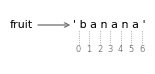

# 8\. 字符串和正则表达式

> 原文：[`allendowney.github.io/ThinkPython/chap08.html`](https://allendowney.github.io/ThinkPython/chap08.html)

字符串不同于整数、浮点数和布尔值。字符串是一个**序列**，意味着它包含多个按特定顺序排列的值。在本章中，我们将学习如何访问组成字符串的值，并使用处理字符串的函数。

我们还将使用正则表达式，它是查找字符串中模式并执行如搜索和替换等操作的强大工具。

作为练习，你将有机会将这些工具应用到一个叫做 Wordle 的单词游戏中。

## 8.1\. 字符串是一个序列

字符串是字符的序列。**字符**可以是字母（几乎所有字母表中的字母）、数字、标点符号或空格。

你可以使用方括号操作符从字符串中选择一个字符。这个示例语句从`fruit`中选择第 1 个字符，并将其赋值给`letter`：

```py
fruit = 'banana'
letter = fruit[1] 
```

方括号中的表达式是一个**索引**，之所以这么叫，是因为它*指示*要选择序列中的哪个字符。但结果可能不是你预期的。

```py
letter 
```

```py
'a' 
```

索引为`1`的字母实际上是字符串中的第二个字母。索引是从字符串开始位置的偏移量，所以第一个字母的偏移量是`0`。

```py
fruit[0] 
```

```py
'b' 
```

你可以把`'b'`当作`'banana'`的第 0 个字母——读作“零个”。

方括号中的索引可以是一个变量。

```py
i = 1
fruit[i] 
```

```py
'a' 
```

或者是包含变量和运算符的表达式。

```py
fruit[i+1] 
```

```py
'n' 
```

但是，索引的值必须是整数——否则你会遇到`TypeError`。

```py
fruit[1.5] 
```

```py
TypeError: string indices must be integers 
```

正如我们在第一章中看到的，我们可以使用内置函数`len`来获取字符串的长度。

```py
n = len(fruit)
n 
```

```py
6 
```

为了获取字符串中的最后一个字母，你可能会想写成这样：

```py
fruit[n] 
```

```py
IndexError: string index out of range 
```

但这会导致`IndexError`，因为在`'banana'`中没有索引为 6 的字母。因为我们从`0`开始计数，所以六个字母的编号是`0`到`5`。要获取最后一个字符，你需要从`n`中减去`1`：

```py
fruit[n-1] 
```

```py
'a' 
```

但有更简单的方法。要获取字符串中的最后一个字母，你可以使用负索引，它从字符串的末尾向后计数。

```py
fruit[-1] 
```

```py
'a' 
```

索引`-1`选择最后一个字母，`-2`选择倒数第二个字母，以此类推。

## 8.2\. 字符串切片

字符串的一部分称为**切片**。选择切片类似于选择单个字符。

```py
fruit = 'banana'
fruit[0:3] 
```

```py
'ban' 
```

运算符`[n:m]`返回字符串从第`n`个字符到第`m`个字符的部分，包括第一个字符但不包括第二个字符。这种行为是反直觉的，但可以通过想象索引指向*字符之间*的空间来帮助理解，如图所示：



例如，切片`[3:6]`选择了字母`ana`，这意味着`6`在作为切片的一部分时是合法的，但作为索引时是不合法的。

如果省略第一个索引，切片将从字符串的开头开始。

```py
fruit[:3] 
```

```py
'ban' 
```

如果省略第二个索引，切片将一直延伸到字符串的末尾：

```py
fruit[3:] 
```

```py
'ana' 
```

如果第一个索引大于或等于第二个索引，结果将是一个**空字符串**，由两个引号表示：

```py
fruit[3:3] 
```

```py
'' 
```

空字符串不包含任何字符，长度为 0。

继续这个例子，你认为`fruit[:]`意味着什么？试试看吧。

## 8.3\. 字符串是不可变的

很容易在赋值语句的左侧使用`[]`运算符，试图更改字符串中的字符，如下所示：

```py
greeting = 'Hello, world!'
greeting[0] = 'J' 
```

```py
TypeError: 'str' object does not support item assignment 
```

结果是一个`TypeError`。在错误信息中，“对象”是字符串，“项”是我们试图赋值的字符。目前，**对象**与值是相同的，但我们稍后会进一步细化这个定义。

发生这个错误的原因是字符串是**不可变的**，这意味着你不能更改一个已有的字符串。你能做的最好的事是创建一个新的字符串，它是原始字符串的变体。

```py
new_greeting = 'J' + greeting[1:]
new_greeting 
```

```py
'Jello, world!' 
```

这个例子将一个新的首字母连接到`greeting`的切片上。它不会对原始字符串产生影响。

```py
greeting 
```

```py
'Hello, world!' 
```

## 8.4\. 字符串比较

关系运算符适用于字符串。要检查两个字符串是否相等，我们可以使用`==`运算符。

```py
word = 'banana'

if word == 'banana':
    print('All right, banana.') 
```

```py
All right, banana. 
```

其他关系运算符对于将单词按字母顺序排列很有用：

```py
def compare_word(word):
    if word < 'banana':
        print(word, 'comes before banana.')
    elif word > 'banana':
        print(word, 'comes after banana.')
    else:
        print('All right, banana.') 
```

```py
compare_word('apple') 
```

```py
apple comes before banana. 
```

Python 处理大写字母和小写字母的方式不同于人类。所有大写字母都排在所有小写字母之前，所以：

```py
compare_word('Pineapple') 
```

```py
Pineapple comes before banana. 
```

为了解决这个问题，我们可以在进行比较之前将字符串转换为标准格式，例如全小写。请记住，如果你需要防御一个手持菠萝的人时，这一点非常重要。

## 8.5\. 字符串方法

字符串提供了执行多种有用操作的方法。方法类似于函数——它接受参数并返回一个值——但语法有所不同。例如，`upper`方法接受一个字符串并返回一个新的字符串，其中所有字母都为大写。

它使用的方法语法是`word.upper()`，而不是函数语法`upper(word)`。

```py
word = 'banana'
new_word = word.upper()
new_word 
```

```py
'BANANA' 
```

这种使用点运算符的方式指定了方法的名称`upper`，以及要应用该方法的字符串名称`word`。空的括号表示此方法不接受任何参数。

方法调用称为**调用**；在这种情况下，我们可以说我们正在对`word`调用`upper`方法。

## 8.6\. 写入文件

字符串运算符和方法对于读取和写入文本文件非常有用。举个例子，我们将处理*德古拉*的文本，这本由布拉姆·斯托克创作的小说可以从古腾堡计划获取（[`www.gutenberg.org/ebooks/345`](https://www.gutenberg.org/ebooks/345)）。

我已经将这本书下载为名为`pg345.txt`的纯文本文件，我们可以像这样打开它进行阅读：

```py
reader = open('pg345.txt') 
```

除了书籍的文本外，这个文件在开头包含了一段关于书籍的信息，在结尾包含了一段关于许可证的信息。在处理文本之前，我们可以通过找到以 `'***'` 开头的特殊行来去除这些额外的内容。

以下函数接收一行并检查它是否是特殊行之一。它使用 `startswith` 方法，检查字符串是否以给定的字符序列开头。

```py
def is_special_line(line):
    return line.startswith('*** ') 
```

我们可以使用这个函数来遍历文件中的行，并仅打印特殊行。

```py
for line in reader:
    if is_special_line(line):
        print(line.strip()) 
```

```py
*** START OF THE PROJECT GUTENBERG EBOOK DRACULA ***
*** END OF THE PROJECT GUTENBERG EBOOK DRACULA *** 
```

现在，让我们创建一个新的文件，命名为 `pg345_cleaned.txt`，其中只包含书籍的文本。为了再次循环遍历书籍，我们必须重新打开它以进行读取。并且，为了写入新文件，我们可以以写入模式打开它。

```py
reader = open('pg345.txt')
writer = open('pg345_cleaned.txt', 'w') 
```

`open` 接受一个可选参数，指定“模式”——在这个例子中，`'w'` 表示我们以写入模式打开文件。如果文件不存在，它将被创建；如果文件已经存在，内容将被替换。

作为第一步，我们将遍历文件，直到找到第一行特殊行。

```py
for line in reader:
    if is_special_line(line):
        break 
```

`break` 语句“跳出”循环——也就是说，它会立即结束循环，而不等到文件末尾。

当循环退出时，`line` 包含了使条件为真的特殊行。

```py
line 
```

```py
'*** START OF THE PROJECT GUTENBERG EBOOK DRACULA ***\n' 
```

因为 `reader` 会跟踪文件中的当前位置，我们可以使用第二个循环从我们离开的地方继续。

以下循环逐行读取文件的其余部分。当它找到表示文本结束的特殊行时，它会跳出循环。否则，它会将该行写入输出文件。

```py
for line in reader:
    if is_special_line(line):
        break
    writer.write(line) 
```

当这个循环退出时，`line` 包含第二个特殊行。

```py
line 
```

```py
'*** END OF THE PROJECT GUTENBERG EBOOK DRACULA ***\n' 
```

此时，`reader` 和 `writer` 仍然打开，这意味着我们可以继续从 `reader` 读取行或向 `writer` 写入行。为了表示我们完成了，我们可以通过调用 `close` 方法关闭这两个文件。

```py
reader.close()
writer.close() 
```

为了检查这个过程是否成功，我们可以读取刚创建的新文件中的前几行。

```py
for line in open('pg345_cleaned.txt'):
    line = line.strip()
    if len(line) > 0:
        print(line)
    if line.endswith('Stoker'):
        break 
```

```py
DRACULA
_by_
Bram Stoker 
```

`endswith` 方法检查字符串是否以给定的字符序列结尾。

## 8.7\. 查找与替换

在 1901 年的冰岛语版《德古拉》中，其中一个角色的名字从 “Jonathan” 改成了 “Thomas”。为了在英文版中进行这一更改，我们可以遍历整本书，使用 `replace` 方法将一个名字替换成另一个，并将结果写入新文件。

我们将从计数文件清理版的行数开始。

```py
total = 0
for line in open('pg345_cleaned.txt'):
    total += 1

total 
```

```py
15499 
```

为了查看一行是否包含“Jonathan”，我们可以使用 `in` 运算符，检查该字符序列是否出现在行中。

```py
total = 0
for line in open('pg345_cleaned.txt'):
    if 'Jonathan' in line:
        total += 1

total 
```

```py
199 
```

有 199 行包含这个名字，但这还不是它出现的总次数，因为它可能在一行中出现多次。为了得到总数，我们可以使用 `count` 方法，它返回字符串中某个序列出现的次数。

```py
total = 0
for line in open('pg345_cleaned.txt'):
    total += line.count('Jonathan')

total 
```

```py
200 
```

现在我们可以像这样将 `'Jonathan'` 替换为 `'Thomas'`：

```py
writer = open('pg345_replaced.txt', 'w')

for line in open('pg345_cleaned.txt'):
    line = line.replace('Jonathan', 'Thomas')
    writer.write(line) 
```

结果是一个新文件，名为 `pg345_replaced.txt`，其中包含了*德古拉*的一个版本，在这个版本中，Jonathan Harker 被称为 Thomas。

## 8.8\. 正则表达式

如果我们确切知道要寻找的字符序列，可以使用 `in` 运算符来查找，并使用 `replace` 方法替换它。但还有一种工具，叫做**正则表达式**，也可以执行这些操作——而且功能更多。

为了演示，我将从一个简单的例子开始，然后逐步增加难度。假设，我们再次想要找到所有包含特定单词的行。为了换个方式，我们来看一下书中提到主人公德古拉伯爵的地方。这里有一行提到他。

```py
text = "I am Dracula; and I bid you welcome, Mr. Harker, to my house." 
```

这是我们将用于搜索的**模式**。

```py
pattern = 'Dracula' 
```

一个名为 `re` 的模块提供了与正则表达式相关的函数。我们可以像这样导入它，并使用 `search` 函数来检查模式是否出现在文本中。

```py
import re

result = re.search(pattern, text)
result 
```

```py
<re.Match object; span=(5, 12), match='Dracula'> 
```

如果模式出现在文本中，`search` 将返回一个包含搜索结果的 `Match` 对象。除了其他信息外，它还包含一个名为 `string` 的变量，其中包含被搜索的文本。

```py
result.string 
```

```py
'I am Dracula; and I bid you welcome, Mr. Harker, to my house.' 
```

它还提供了一个名为 `group` 的方法，可以返回匹配模式的文本部分。

```py
result.group() 
```

```py
'Dracula' 
```

它还提供了一个名为 `span` 的方法，可以返回模式在文本中开始和结束的位置。

```py
result.span() 
```

```py
(5, 12) 
```

如果模式在文本中没有出现，`search` 的返回值是 `None`。

```py
result = re.search('Count', text)
print(result) 
```

```py
None 
```

因此，我们可以通过检查结果是否为 `None` 来判断搜索是否成功。

```py
result == None 
```

```py
True 
```

将这些都结合起来，这里有一个函数，它循环遍历书中的每一行，直到找到匹配给定模式的行，并返回 `Match` 对象。

```py
def find_first(pattern):
    for line in open('pg345_cleaned.txt'):
        result = re.search(pattern, line)
        if result != None:
            return result 
```

我们可以用它来找到某个字符的首次出现。

```py
result = find_first('Harker')
result.string 
```

```py
'CHAPTER I. Jonathan Harker’s Journal\n' 
```

对于这个例子，我们并不需要使用正则表达式——我们可以用 `in` 运算符更轻松地完成相同的事情。但正则表达式可以做一些 `in` 运算符无法做到的事情。

例如，如果模式中包括竖线字符，`'|'`，它可以匹配左边或右边的序列。假设我们想要在书中找到 Mina Murray 的首次提及，但我们不确定她是用名字还是姓氏来称呼的。我们可以使用以下模式，它可以匹配这两个名字。

```py
pattern = 'Mina|Murray'
result = find_first(pattern)
result.string 
```

```py
'CHAPTER V. Letters—Lucy and Mina\n' 
```

我们可以使用这样的模式来查看某个字符通过名字提到的次数。这里有一个函数，它会遍历书中的每一行，并统计与给定模式匹配的行数。

```py
def count_matches(pattern):
    count = 0
    for line in open('pg345_cleaned.txt'):
        result = re.search(pattern, line)
        if result != None:
            count += 1
    return count 
```

现在让我们看看 Mina 被提到多少次。

```py
count_matches('Mina|Murray') 
```

```py
229 
```

特殊字符`'^'`匹配字符串的开始，因此我们可以找到以给定模式开头的行。

```py
result = find_first('^Dracula')
result.string 
```

```py
'Dracula, jumping to his feet, said:--\n' 
```

特殊字符`'$'`匹配字符串的结尾，因此我们可以找到以给定模式结尾的行（忽略行尾的换行符）。

```py
result = find_first('Harker$')
result.string 
```

```py
"by five o'clock, we must start off; for it won't do to leave Mrs. Harker\n" 
```

## 8.9\. 字符串替换

布拉姆·斯托克出生在爱尔兰，*而《德古拉》*于 1897 年出版时，他正居住在英格兰。因此，我们可以预期他会使用英国拼写方式，例如“centre”和“colour”。为了验证这一点，我们可以使用以下模式，这个模式可以匹配“centre”或者美国拼写“center”。

```py
pattern = 'cent(er|re)' 
```

在这个模式中，括号包围的是竖线（`|`）所应用的模式部分。所以这个模式匹配的是一个以`'cent'`开头并且以`'er'`或`'re'`结尾的序列。

```py
result = find_first(pattern)
result.string 
```

```py
'horseshoe of the Carpathians, as if it were the centre of some sort of\n' 
```

正如预期的那样，他使用了英国拼写。

我们还可以检查他是否使用了“colour”的英国拼写。以下模式使用了特殊字符`'?'`，表示前一个字符是可选的。

```py
pattern = 'colou?r' 
```

这个模式可以匹配带有`'u'`的“colour”或没有`'u'`的“color”。

```py
result = find_first(pattern)
line = result.string
line 
```

```py
'undergarment with long double apron, front, and back, of coloured stuff\n' 
```

同样，正如预期的那样，他使用了英国拼写。

现在假设我们想制作一本使用美国拼写的书籍版本。我们可以使用`re`模块中的`sub`函数，它执行**字符串替换**。

```py
re.sub(pattern, 'color', line) 
```

```py
'undergarment with long double apron, front, and back, of colored stuff\n' 
```

第一个参数是我们想要查找并替换的模式，第二个是我们想用来替换的内容，第三个是我们要搜索的字符串。在结果中，你可以看到“colour”已被替换为“color”。

## 8.10\. 调试

当你在读取和写入文件时，调试可能会很棘手。如果你在使用 Jupyter 笔记本，可以使用**shell 命令**来帮助。例如，要显示文件的前几行，可以使用命令`!head`，像这样：

```py
!head  pg345_cleaned.txt 
```

初始的感叹号`!`表示这是一个 shell 命令，而不是 Python 的一部分。要显示最后几行，可以使用`!tail`。

```py
!tail  pg345_cleaned.txt 
```

当你处理大文件时，调试可能会变得困难，因为输出可能过多，无法手动检查。一个好的调试策略是从文件的一部分开始，先让程序正常工作，然后再用完整的文件运行它。

为了制作一个包含大文件部分内容的小文件，我们可以再次使用`!head`并配合重定向符号`>`，表示结果应该写入文件而不是显示在屏幕上。

```py
!head  pg345_cleaned.txt  >  pg345_cleaned_10_lines.txt 
```

默认情况下，`!head`读取前 10 行，但它也接受一个可选参数，用于指示要读取的行数。

```py
!head  -100  pg345_cleaned.txt  >  pg345_cleaned_100_lines.txt 
```

这个 shell 命令读取`pg345_cleaned.txt`的前 100 行，并将它们写入名为`pg345_cleaned_100_lines.txt`的文件。

注意：shell 命令`!head`和`!tail`并非在所有操作系统上都可用。如果它们在你这里无法使用，我们可以用 Python 编写类似的函数。请参考本章最后的第一个练习获取建议。

## 8.11\. 术语表

**sequence（序列）：** 一种有序的值集合，每个值由一个整数索引标识。

**character（字符）：** 字符串中的一个元素，包括字母、数字和符号。

**index（索引）：** 用于选择序列中项的整数值，例如字符串中的字符。在 Python 中，索引从`0`开始。

**slice（切片）：** 由一系列索引范围指定的字符串的一部分。

**empty string（空字符串）：** 一个不包含任何字符且长度为`0`的字符串。

**object（对象）：** 一个变量可以引用的事物。对象有类型和数值。

**immutable（不可变）：** 如果一个对象的元素不能被改变，则该对象是不可变的。

**invocation（调用）：** 一个表达式——或表达式的一部分——用于调用方法。

**regular expression（正则表达式）：** 定义搜索模式的字符序列。

**pattern（模式）：** 规定一个字符串必须满足的要求，以便构成匹配。

**string substitution（字符串替换）：** 用另一个字符串替换字符串的部分内容。

**shell command（shell 命令）：** 用于与操作系统交互的 shell 语言中的语句。

## 8.12\. 练习

```py
# This cell tells Jupyter to provide detailed debugging information
# when a runtime error occurs. Run it before working on the exercises.

%xmode Verbose 
```

```py
Exception reporting mode: Verbose 
```

### 8.12.1\. 向虚拟助手提问

在本章中，我们仅触及了正则表达式能做的事情的表面。为了了解正则表达式的可能性，可以问虚拟助手：“Python 正则表达式中最常用的特殊字符有哪些？”

你还可以请求匹配特定类型字符串的模式。例如，尝试询问：

+   编写一个匹配带有连字符的 10 位电话号码的 Python 正则表达式。

+   编写一个匹配带有数字和街道名称的街道地址的 Python 正则表达式，地址后跟`ST`或`AVE`。

+   编写一个匹配完整姓名的 Python 正则表达式，该姓名可能包含常见的称谓，如`Mr`或`Mrs`，后跟一个或多个以大写字母开头的名字，名字之间可能有连字符。

如果你想看一些更复杂的内容，可以尝试询问正则表达式，它匹配任何合法的 URL。

正则表达式通常在引号前面加上字母`r`，表示这是一个“原始字符串”。欲了解更多信息，可以问虚拟助手：“Python 中的原始字符串是什么？”

### 8.12.2\. 练习

看看你能否编写一个函数，实现与 shell 命令`!head`相同的功能。它应该接受三个参数：要读取的文件名、要读取的行数以及要将这些行写入的文件名。如果第三个参数是`None`，它应该显示这些行，而不是将它们写入文件。

考虑请虚拟助手帮忙，但如果这样做，请告诉它不要使用`with`语句或`try`语句。

### 8.12.3\. 练习

“Wordle”是一个在线字谜游戏，目标是在六次或更少的尝试中猜出一个五个字母的单词。每次尝试必须被识别为一个单词，不包括专有名词。每次尝试后，你会得到有关你猜测的字母哪些出现在目标单词中，哪些在正确位置的信息。

例如，假设目标单词是`MOWER`，你猜测了`TRIED`。你会得知`E`在单词中并且位置正确，`R`在单词中但位置不正确，`T`、`I`和`D`不在单词中。

作为一个不同的例子，假设你已经猜测了单词`SPADE`和`CLERK`，并且你得知`E`在这个单词中，但不在这两个位置上，且其他字母都没有出现在单词中。在单词列表中的单词中，有多少个可能是目标单词？编写一个名为`check_word`的函数，接收一个五个字母的单词并检查它是否可能是目标单词，基于这些猜测。

你可以使用上一章中的任何函数，如`uses_any`。

### 8.12.4\. 练习

继续上一个练习，假设你猜测了单词`TOTEM`，并得知`E`*仍然*不在正确的位置，但`M`在正确的位置。剩下多少个单词？

### 8.12.5\. 练习

*基督山伯爵*是亚历山大·仲马的小说，被认为是经典。然而，在这本书的英文版序言中，作家翁贝托·埃科承认他发现这本书是“有史以来写得最糟糕的小说之一”。

特别地，他说它在“重复使用相同的形容词”方面是“厚颜无耻的”，并特别提到“它的角色要么颤抖，要么变得苍白”的次数。

为了验证他的意见是否有效，让我们统计包含单词`pale`的所有行，无论是`pale`、`pales`、`paled`、`paleness`，还是相关的单词`pallor`。使用一个正则表达式匹配这些单词。作为额外的挑战，确保它不会匹配其他单词，比如`impale`——你可能需要向虚拟助手寻求帮助。

[Think Python: 第三版](https://allendowney.github.io/ThinkPython/index.html)

版权所有 2024 [Allen B. Downey](https://allendowney.com)

代码许可：[MIT 许可证](https://mit-license.org/)

文本许可：[创作共用 署名-非商业性使用-相同方式共享 4.0 国际版](https://creativecommons.org/licenses/by-nc-sa/4.0/)
