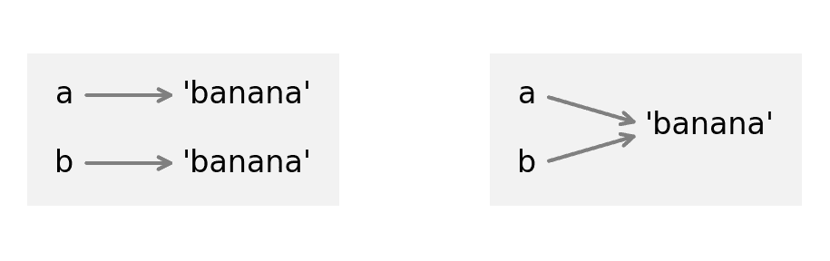

# 9\. 列表

> 原文：[`allendowney.github.io/ThinkPython/chap09.html`](https://allendowney.github.io/ThinkPython/chap09.html)

本章介绍了 Python 最有用的内建类型之一——列表。你还将学习更多关于对象的知识，以及当多个变量指向同一对象时会发生什么。

在本章末的练习中，我们将创建一个单词列表，并用它来查找特殊单词，如回文和变位词。

## 9.1\. 列表是一个序列

像字符串一样，**列表**是值的序列。在字符串中，值是字符；在列表中，它们可以是任何类型。列表中的值称为**元素**。

有多种方法可以创建一个新列表；最简单的方法是将元素括在方括号(`[`和`]`)中。例如，这是一个包含两个整数的列表。

```py
numbers = [42, 123] 
```

这里是一个包含三个字符串的列表。

```py
cheeses = ['Cheddar', 'Edam', 'Gouda'] 
```

列表的元素不必是相同的类型。以下列表包含了一个字符串，一个浮点数，一个整数，甚至另一个列表。

```py
t = ['spam', 2.0, 5, [10, 20]] 
```

一个包含在另一个列表中的列表被称为**嵌套**列表。

一个不包含任何元素的列表被称为空列表；你可以用空括号`[]`来创建一个空列表。

```py
empty = [] 
```

`len`函数返回列表的长度。

```py
len(cheeses) 
```

```py
3 
```

空列表的长度是`0`。

以下图显示了`cheeses`、`numbers`和`empty`的状态图。


列表用带有“list”字样的盒子表示，列表的编号元素位于其中。

## 9.2\. 列表是可变的

要读取列表的一个元素，我们可以使用括号运算符。第一个元素的索引是`0`。

```py
cheeses[0] 
```

```py
'Cheddar' 
```

与字符串不同，列表是可变的。当括号运算符出现在赋值语句的左侧时，它标识了将被赋值的列表元素。

```py
numbers[1] = 17
numbers 
```

```py
[42, 17] 
```

`numbers`的第二个元素，原本是`123`，现在是`17`。

列表索引的工作方式与字符串索引相同：

+   任何整数表达式都可以用作索引。

+   如果你尝试读取或写入一个不存在的元素，将会出现`IndexError`。

+   如果索引是负值，它从列表的末尾开始倒数。

`in`运算符作用于列表——它检查给定的元素是否出现在列表中的任何位置。

```py
'Edam' in cheeses 
```

```py
True 
```

```py
'Wensleydale' in cheeses 
```

```py
False 
```

虽然一个列表可以包含另一个列表，但嵌套的列表仍然被视为一个元素——因此，在以下列表中，只有四个元素。

```py
t = ['spam', 2.0, 5, [10, 20]]
len(t) 
```

```py
4 
```

而`10`不被视为`t`的一个元素，因为它是嵌套列表中的一个元素，而不是`t`的元素。

```py
10 in t 
```

```py
False 
```

## 9.3\. 列表切片

切片运算符作用于列表的方式与它在字符串上作用的方式相同。以下示例选择了四个字母列表中的第二和第三个元素。

```py
letters = ['a', 'b', 'c', 'd']
letters[1:3] 
```

```py
['b', 'c'] 
```

如果省略第一个索引，切片将从列表的开头开始。

```py
letters[:2] 
```

```py
['a', 'b'] 
```

如果省略第二个索引，切片将延伸到列表的末尾。

```py
letters[2:] 
```

```py
['c', 'd'] 
```

如果省略两个索引，切片将是整个列表的副本。

```py
letters[:] 
```

```py
['a', 'b', 'c', 'd'] 
```

复制列表的另一种方式是使用 `list` 函数。

```py
list(letters) 
```

```py
['a', 'b', 'c', 'd'] 
```

由于 `list` 是一个内置函数的名称，你应该避免将它用作变量名。

## 9.4\. 列表操作

`+` 运算符用于连接列表。

```py
t1 = [1, 2]
t2 = [3, 4]
t1 + t2 
```

```py
[1, 2, 3, 4] 
```

`*` 运算符会将列表重复给定的次数。

```py
['spam'] * 4 
```

```py
['spam', 'spam', 'spam', 'spam'] 
```

没有其他数学运算符可以与列表一起使用，但内置函数 `sum` 会将元素相加。

```py
sum(t1) 
```

```py
3 
```

`min` 和 `max` 用于找到最小和最大元素。

```py
min(t1) 
```

```py
1 
```

```py
max(t2) 
```

```py
4 
```

## 9.5\. 列表方法

Python 提供了对列表操作的方法。例如，`append` 会将一个新元素添加到列表的末尾：

```py
letters.append('e')
letters 
```

```py
['a', 'b', 'c', 'd', 'e'] 
```

`extend` 接受一个列表作为参数，并将其中的所有元素附加到当前列表中：

```py
letters.extend(['f', 'g'])
letters 
```

```py
['a', 'b', 'c', 'd', 'e', 'f', 'g'] 
```

有两种方法可以从列表中删除元素。如果你知道要删除元素的索引，可以使用 `pop`。

```py
t = ['a', 'b', 'c']
t.pop(1) 
```

```py
'b' 
```

返回值是被删除的元素。我们也可以确认列表已经被修改。

```py
t 
```

```py
['a', 'c'] 
```

如果你知道要删除的元素（但不知道索引），可以使用 `remove`：

```py
t = ['a', 'b', 'c']
t.remove('b') 
```

`remove` 的返回值是 `None`，但我们可以确认列表已经被修改。

```py
t 
```

```py
['a', 'c'] 
```

如果你请求的元素不在列表中，那就会抛出 ValueError 错误。

```py
t.remove('d') 
```

```py
ValueError: list.remove(x): x not in list 
```

## 9.6\. 列表和字符串

字符串是字符的序列，而列表是值的序列，但字符列表和字符串并不相同。要将字符串转换为字符列表，可以使用 `list` 函数。

```py
s = 'spam'
t = list(s)
t 
```

```py
['s', 'p', 'a', 'm'] 
```

`list` 函数将字符串拆分为单独的字母。如果你想将字符串拆分为单词，可以使用 `split` 方法：

```py
s = 'pining for the fjords'
t = s.split()
t 
```

```py
['pining', 'for', 'the', 'fjords'] 
```

一个可选参数叫做**分隔符**，用于指定哪些字符作为单词边界。以下示例使用了连字符作为分隔符。

```py
s = 'ex-parrot'
t = s.split('-')
t 
```

```py
['ex', 'parrot'] 
```

如果你有一个字符串列表，可以使用 `join` 将它们连接成一个单一的字符串。`join` 是一个字符串方法，因此你需要在分隔符上调用它，并将列表作为参数传递。

```py
delimiter = ' '
t = ['pining', 'for', 'the', 'fjords']
s = delimiter.join(t)
s 
```

```py
'pining for the fjords' 
```

在这个例子中，分隔符是空格字符，所以 `join` 会在单词之间加上空格。要将字符串连接在一起而不添加空格，可以使用空字符串 `''` 作为分隔符。

## 9.7\. 遍历列表

你可以使用 `for` 语句遍历列表中的元素。

```py
for cheese in cheeses:
    print(cheese) 
```

```py
Cheddar
Edam
Gouda 
```

例如，使用 `split` 将字符串分割成单词列表后，我们可以使用 `for` 遍历它们。

```py
s = 'pining for the fjords'

for word in s.split():
    print(word) 
```

```py
pining
for
the
fjords 
```

对一个空列表进行 `for` 循环时，缩进的语句永远不会执行。

```py
for x in []:
    print('This never happens.') 
```

## 9.8\. 排序列表

Python 提供了一个内置函数 `sorted`，用于对列表的元素进行排序。

```py
scramble = ['c', 'a', 'b']
sorted(scramble) 
```

```py
['a', 'b', 'c'] 
```

原始列表保持不变。

```py
scramble 
```

```py
['c', 'a', 'b'] 
```

`sorted` 可以与任何类型的序列一起使用，不仅限于列表。所以我们可以像这样对字符串中的字母进行排序。

```py
sorted('letters') 
```

```py
['e', 'e', 'l', 'r', 's', 't', 't'] 
```

结果是一个列表。要将列表转换为字符串，我们可以使用 `join`。

```py
''.join(sorted('letters')) 
```

```py
'eelrstt' 
```

使用空字符串作为分隔符时，列表中的元素将被连接在一起，中间没有任何分隔符。

## 9.9\. 对象和值

如果我们运行这些赋值语句：

```py
a = 'banana'
b = 'banana' 
```

我们知道 `a` 和 `b` 都指向一个字符串，但我们不知道它们是否指向*同一个*字符串。有两种可能的状态，如下图所示。



在左侧的图表中，`a` 和 `b` 引用两个具有相同值的不同对象。在右侧的图表中，它们引用同一个对象。要检查两个变量是否引用同一个对象，可以使用 `is` 运算符。

```py
a = 'banana'
b = 'banana'
a is b 
```

```py
True 
```

在这个例子中，Python 只创建了一个字符串对象，`a` 和 `b` 都引用它。但是当你创建两个列表时，你得到两个对象。

```py
a = [1, 2, 3]
b = [1, 2, 3]
a is b 
```

```py
False 
```

所以状态图看起来是这样的。


在这种情况下，我们会说这两个列表是**等价**的，因为它们有相同的元素，但不是**相同**的，因为它们不是同一个对象。如果两个对象是相同的，则它们也是等价的，但如果它们是等价的，则它们不一定是相同的。

## 9.10\. 别名

如果 `a` 引用一个对象，然后你赋值 `b = a`，那么两个变量都引用同一个对象。

```py
a = [1, 2, 3]
b = a
b is a 
```

```py
True 
```

所以状态图看起来是这样的。


将变量与对象的关联称为**引用**。在这个例子中，有两个对同一对象的引用。

拥有多个引用的对象有多个名称，因此我们说对象是**别名**的。如果别名对象是可变的，则使用一个名称进行更改会影响到另一个名称。在这个例子中，如果我们更改 `b` 所引用的对象，也会更改 `a` 所引用的对象。

```py
b[0] = 5
a 
```

```py
[5, 2, 3] 
```

因此我们会说 `a` “看到”了这个变化。虽然这种行为可能很有用，但也容易出错。一般来说，在处理可变对象时最好避免使用别名。

对于像字符串这样的不可变对象，别名不是太大的问题。在这个例子中：

```py
a = 'banana'
b = 'banana' 
```

是否 `a` 和 `b` 引用同一个字符串几乎没有影响。

## 9.11\. 列表参数

当你将列表传递给函数时，函数会得到对列表的引用。如果函数修改了列表，则调用者会看到更改。例如，`pop_first` 使用列表方法 `pop` 来删除列表中的第一个元素。

```py
def pop_first(lst):
    return lst.pop(0) 
```

我们可以这样使用它。

```py
letters = ['a', 'b', 'c']
pop_first(letters) 
```

```py
'a' 
```

返回值是已从列表中删除的第一个元素，我们可以通过显示修改后的列表来看到。

```py
letters 
```

```py
['b', 'c'] 
```

在这个例子中，参数 `lst` 和变量 `letters` 是同一个对象的别名，所以状态图看起来是这样的：

```py
[2.04, 1.24, 1.06, 0.85] 
```


将对象的引用作为参数传递给函数会创建一种别名形式。如果函数修改了该对象，这些更改将在函数结束后持续存在。

## 9.12\. 创建单词列表

在上一章中，我们读取了 `words.txt` 文件并搜索了具有特定属性的单词，比如使用字母 `e`。但是我们多次读取整个文件，这样效率不高。更好的做法是只读取一次文件，并将单词存入列表。以下循环展示了如何操作。

```py
word_list = []

for line in open('words.txt'):
    word = line.strip()
    word_list.append(word)

len(word_list) 
```

```py
113783 
```

在循环之前，`word_list` 被初始化为空列表。每次循环时，`append` 方法会将一个单词添加到列表末尾。当循环结束时，列表中有超过 113,000 个单词。

另一种做法是使用 `read` 将整个文件读取为一个字符串。

```py
string = open('words.txt').read()
len(string) 
```

```py
1016511 
```

结果是一个包含超过百万个字符的单一字符串。我们可以使用 `split` 方法将其拆分为一个单词列表。

```py
word_list = string.split()
len(word_list) 
```

```py
113783 
```

现在，为了检查一个字符串是否出现在列表中，我们可以使用 `in` 运算符。例如，`'demotic'` 在列表中。

```py
'demotic' in word_list 
```

```py
True 
```

但是，`'contrafibularities'` 不是。

```py
'contrafibularities' in word_list 
```

```py
False 
```

我得说，我对它感到有点麻木。

## 9.13\. 调试

请注意，大多数列表方法修改参数并返回 `None`。这与字符串方法相反，后者返回一个新字符串，并且不修改原始字符串。

如果你习惯于编写像这样的字符串代码：

```py
word = 'plumage!'
word = word.strip('!')
word 
```

```py
'plumage' 
```

很容易写出像这样的列表代码：

```py
t = [1, 2, 3]
t = t.remove(3)           # WRONG! 
```

`remove` 修改列表并返回 `None`，因此你接下来在 `t` 上执行的操作可能会失败。

```py
t.remove(2) 
```

```py
AttributeError: 'NoneType' object has no attribute 'remove' 
```

这个错误信息需要一些解释。一个**属性**是与对象关联的变量或方法。在这个案例中，`t` 的值是 `None`，它是一个 `NoneType` 对象，并没有一个名为 `remove` 的属性，因此结果是 `AttributeError`。

如果你看到这样的错误信息，应该向后检查程序，看看你是否错误地调用了列表方法。

## 9.14\. 术语表

**列表:** 一种包含一系列值的对象。

**元素:** 列表或其他序列中的一个值。

**嵌套列表:** 作为另一个列表的元素的列表。

**分隔符:** 用于指示字符串应该在哪儿拆分的字符或字符串。

**等价的:** 具有相同的值。

**相同的:** 是指相同的对象（这意味着等价性）。

**引用:** 变量与其值之间的关联。

**别名化:** 如果有多个变量引用同一个对象，那么这个对象就是别名化的。

**属性:** 与对象关联的命名值之一。

## 9.15\. 练习

```py
# This cell tells Jupyter to provide detailed debugging information
# when a runtime error occurs. Run it before working on the exercises.

%xmode Verbose 
```

### 9.15.1\. 向虚拟助手提问

在本章中，我使用了“contrafibularities”和“anaspeptic”这两个词，但它们实际上并不是英语单词。它们出现在英国电视节目*黑爵士*第 3 季第 2 集“墨水与无能”中。

然而，当我询问 ChatGPT 3.5（2023 年 8 月 3 日版本）这些单词的来源时，它最初声称这些单词来自《蒙提·派森》，后来又声称它们来自汤姆·斯托帕德的剧作*《罗斯恩·克兰茨与吉尔登斯特恩死了》*。

如果你现在提问，你可能会得到不同的结果。但这个例子提醒我们，虚拟助手并不总是准确的，因此你应该检查结果是否正确。随着经验的积累，你会对哪些问题虚拟助手能够可靠回答有一个直觉。在这个例子中，常规的网络搜索可以迅速识别这些单词的来源。

如果在本章的任何练习中遇到困难，可以考虑向虚拟助手寻求帮助。如果你得到的结果使用了我们还没有学过的功能，你可以为虚拟助手分配一个“角色”。

例如，在你提问之前，尝试输入“Role: Basic Python Programming Instructor”。之后，你得到的回答应该仅使用基本功能。如果你仍然看到我们还没有学过的功能，你可以跟进询问：“能否只用基本的 Python 功能编写那个？”

### 9.15.2\. 练习

如果两个单词的字母可以重新排列使其拼写为另一个单词，则这两个单词是字谜。例如，`tops`是`stop`的字谜。

检查两个单词是否是字谜的一种方法是将两个单词中的字母排序。如果排序后的字母列表相同，则这两个单词是字谜。

编写一个名为`is_anagram`的函数，该函数接受两个字符串，并返回`True`（如果它们是字谜）或`False`（如果它们不是字谜）。

使用你的函数和单词列表，找到`takes`的所有字谜。

### 9.15.3\. 练习

Python 提供了一个名为`reversed`的内置函数，它接受一个序列（如列表或字符串）作为参数，并返回一个`reversed`对象，其中包含按相反顺序排列的元素。

```py
reversed('parrot') 
```

```py
<reversed at 0x7fe3de636b60> 
```

如果你希望反转的元素以列表形式返回，可以使用`list`函数。

```py
list(reversed('parrot')) 
```

```py
['t', 'o', 'r', 'r', 'a', 'p'] 
```

或者，如果你希望它们以字符串形式呈现，可以使用`join`方法。

```py
''.join(reversed('parrot')) 
```

```py
'torrap' 
```

所以我们可以这样编写一个函数来反转一个单词。

```py
def reverse_word(word):
    return ''.join(reversed(word)) 
```

回文是指正着读和反着读都一样的单词，如“noon”和“rotator”。编写一个名为`is_palindrome`的函数，该函数接受一个字符串作为参数，如果它是回文，返回`True`，否则返回`False`。

你可以使用以下循环查找单词列表中至少包含 7 个字母的所有回文。

```py
for word in word_list:
    if len(word) >= 7 and is_palindrome(word):
        print(word) 
```

### 9.15.4\. 练习

编写一个名为`reverse_sentence`的函数，该函数接受一个字符串作为参数，该字符串包含由空格分隔的若干单词。它应该返回一个新的字符串，其中包含按相反顺序排列的单词。例如，如果参数是“Reverse this sentence”，结果应该是“Sentence this reverse”。

提示：你可以使用`capitalize`方法将第一个单词首字母大写，并将其他单词转换为小写。

### 9.15.5\. 练习

编写一个名为`total_length`的函数，接受一个字符串列表，并返回这些字符串的总长度。`word_list`中单词的总长度应该是\(902{,}728\)。

[《思考 Python：第三版》](https://allendowney.github.io/ThinkPython/index.html)

版权所有 2024 [Allen B. Downey](https://allendowney.com)

代码许可证：[MIT 许可证](https://mit-license.org/)

文本许可证：[创意共享署名-非商业性使用-相同方式共享 4.0 国际版](https://creativecommons.org/licenses/by-nc-sa/4.0/)
