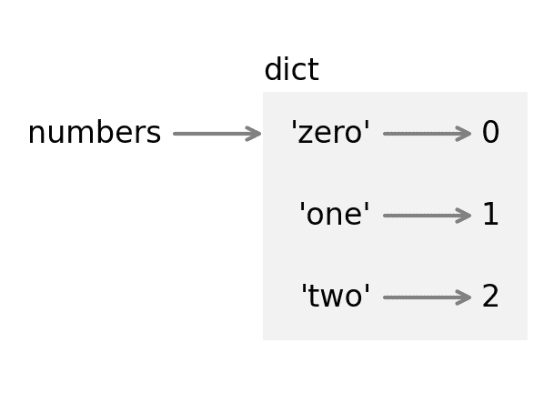
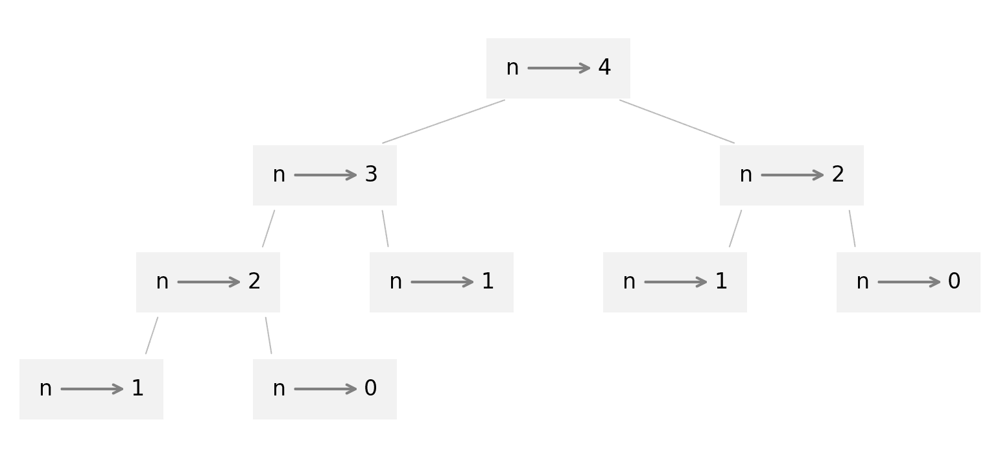

# 10\. 字典

> 原文：[`allendowney.github.io/ThinkPython/chap10.html`](https://allendowney.github.io/ThinkPython/chap10.html)

本章介绍了一种内置类型——字典。它是 Python 最棒的特性之一，也是许多高效优雅算法的构建模块。

我们将使用字典来计算书中独特单词的数量以及每个单词出现的次数。在练习中，我们还将使用字典来解决单词谜题。

## 10.1\. 字典是一个映射

**字典**像列表，但更为通用。在列表中，索引必须是整数；在字典中，索引可以是（几乎）任何类型。例如，假设我们创建一个数字单词的列表，如下所示。

```py
lst = ['zero', 'one', 'two'] 
```

我们可以使用整数作为索引来获取对应的单词。

```py
lst[1] 
```

```py
'one' 
```

但假设我们想反过来查找一个单词，以得到对应的整数。我们不能用列表做到这一点，但可以用字典。我们首先创建一个空字典，并将其赋值给 `numbers`。

```py
numbers = {}
numbers 
```

```py
{} 
```

花括号 `{}` 表示一个空字典。要向字典中添加项目，我们将使用方括号。

```py
numbers['zero'] = 0 
```

本作业向字典添加了一个**项目**，表示**键**与**值**的关联。在这个例子中，键是字符串 `'zero'`，值是整数 `0`。如果我们显示字典，会看到它包含一个项目，项目中的键和值由冒号 `:` 分隔。

```py
numbers 
```

```py
{'zero': 0} 
```

我们可以像这样添加更多项目。

```py
numbers['one'] = 1
numbers['two'] = 2
numbers 
```

```py
{'zero': 0, 'one': 1, 'two': 2} 
```

现在字典包含了三个项目。

要查找键并获取对应的值，我们使用括号运算符。

```py
numbers['two'] 
```

```py
2 
```

如果键不在字典中，我们会得到一个 `KeyError`。

```py
numbers['three'] 
```

```py
KeyError: 'three' 
```

`len` 函数适用于字典；它返回项目的数量。

```py
len(numbers) 
```

```py
3 
```

用数学语言来说，字典表示从键到值的**映射**，因此你也可以说每个键“映射到”一个值。在这个例子中，每个数字单词映射到对应的整数。

下图展示了 `numbers` 的状态图。



字典通过一个框表示，框外有“dict”字样，框内是各项内容。每个项目由一个键和指向值的箭头表示。引号表明这里的键是字符串，而不是变量名。

## 10.2\. 创建字典

在前一节中，我们创建了一个空字典，并使用括号运算符一次添加一个项目。相反，我们也可以像这样一次性创建字典。

```py
numbers = {'zero': 0, 'one': 1, 'two': 2} 
```

每个项目由键和值组成，键和值之间用冒号分隔。项目之间用逗号分隔，并被花括号括起来。

另一种创建字典的方法是使用 `dict` 函数。我们可以像这样创建一个空字典。

```py
empty = dict()
empty 
```

```py
{} 
```

我们也可以像这样复制一个字典。

```py
numbers_copy = dict(numbers)
numbers_copy 
```

```py
{'zero': 0, 'one': 1, 'two': 2} 
```

在执行修改字典的操作之前，通常建议先创建一个字典的副本。

## 10.3\. `in`操作符

`in`操作符也适用于字典；它会告诉你某个元素是否作为*键*出现在字典中。

```py
'one' in numbers 
```

```py
True 
```

`in`操作符*不会*检查某个元素是否作为值出现。

```py
1 in numbers 
```

```py
False 
```

要查看某个元素是否作为字典中的值出现，你可以使用`values`方法，它返回一个值序列，然后使用`in`操作符。

```py
1 in numbers.values() 
```

```py
True 
```

Python 字典中的项存储在一个**哈希表**中，哈希表是一种组织数据的方式，具有一个显著的特性：无论字典中有多少项，`in`操作符所需的时间大致相同。这使得编写一些高效的算法成为可能。

为了演示，我们将比较两种算法，用于寻找一对单词，其中一个是另一个的反转——比如`stressed`和`desserts`。我们将从读取单词列表开始。

```py
word_list = open('words.txt').read().split()
len(word_list) 
```

```py
113783 
```

这是上一章中的`reverse_word`函数。

```py
def reverse_word(word):
    return ''.join(reversed(word)) 
```

以下函数遍历列表中的单词。对于每个单词，它会反转字母，然后检查反转后的单词是否在单词列表中。

```py
def too_slow():
    count = 0
    for word in word_list:
        if reverse_word(word) in word_list:
            count += 1
    return count 
```

这个函数运行需要超过一分钟。问题在于，`in`操作符会逐个检查列表中的单词，从头开始。如果它没有找到需要的内容——大多数情况下是这样——它就必须一直搜索到末尾。

并且`in`操作符位于循环内部，因此它会为每个单词执行一次。由于列表中有超过 10 万个单词，而对于每个单词我们检查超过 10 万个单词，总的比较次数是单词数的平方——大约是 130 亿次。

```py
len(word_list)**2 
```

```py
12946571089 
```

我们可以通过字典使这个函数变得更快。以下循环创建一个字典，将单词作为键存储。

```py
word_dict = {}
for word in word_list:
    word_dict[word] = 1 
```

`word_dict`中的值都是`1`，但它们可以是任何值，因为我们永远不会查找它们——我们仅仅使用这个字典来检查键是否存在。

现在这里有一个版本的函数，它将`word_list`替换为`word_dict`。

```py
def much_faster():
    count = 0
    for word in word_dict:
        if reverse_word(word) in word_dict:
            count += 1
    return count 
```

这个函数运行时间不到一秒钟，因此比之前的版本快大约 10,000 倍。

通常，在列表中查找元素所需的时间与列表的长度成正比。而在字典中查找一个键的时间几乎是恒定的——无论项目的数量是多少。

## 10.4\. 计数器集合

假设你有一个字符串，并且想要统计每个字母出现的次数。字典是做这件事的一个好工具。我们从一个空字典开始。

```py
counter = {} 
```

当我们遍历字符串中的字母时，假设我们第一次看到字母`'a'`。我们可以像这样将它添加到字典中。

```py
counter['a'] = 1 
```

值 `1` 表示我们已看到该字母一次。稍后，如果我们再次看到相同的字母，可以像这样增加计数器。

```py
counter['a'] += 1 
```

现在与 `'a'` 相关联的值是 `2`，因为我们已经看到了两次该字母。

```py
counter 
```

```py
{'a': 2} 
```

以下函数使用这些功能来计算每个字母在字符串中出现的次数。

```py
def value_counts(string):
    counter = {}
    for letter in string:
        if letter not in counter:
            counter[letter] = 1
        else:
            counter[letter] += 1
    return counter 
```

每次循环时，如果 `letter` 不在字典中，我们就创建一个键为 `letter`、值为 `1` 的新项。如果 `letter` 已经在字典中，我们就增加与 `letter` 相关联的值。

这是一个例子。

```py
counter = value_counts('brontosaurus')
counter 
```

```py
{'b': 1, 'r': 2, 'o': 2, 'n': 1, 't': 1, 's': 2, 'a': 1, 'u': 2} 
```

`counter` 中的项目显示字母 `'b'` 出现一次，字母 `'r'` 出现两次，以此类推。

## 10.5\. 循环和字典

如果你在 `for` 语句中使用字典，它会遍历字典的键。为了演示，让我们创建一个字典来统计 `'banana'` 中字母的出现次数。

```py
counter = value_counts('banana')
counter 
```

```py
{'b': 1, 'a': 3, 'n': 2} 
```

以下循环打印的是键，它们是字母。

```py
for key in counter:
    print(key) 
```

```py
b
a
n 
```

为了打印值，我们可以使用 `values` 方法。

```py
for value in counter.values():
    print(value) 
```

```py
1
3
2 
```

为了打印键和值，我们可以遍历键并查找相应的值。

```py
for key in counter:
    value = counter[key]
    print(key, value) 
```

```py
b 1
a 3
n 2 
```

在下一章，我们将看到一种更简洁的方法来完成相同的事情。

## 10.6\. 列表和字典

你可以将列表作为字典的值。例如，下面是一个字典，它将数字 `4` 映射到一个包含四个字母的列表。

```py
d = {4: ['r', 'o', 'u', 's']}
d 
```

```py
{4: ['r', 'o', 'u', 's']} 
```

但你不能将列表作为字典的键。以下是我们尝试时发生的情况。

```py
letters = list('abcd')
d[letters] = 4 
```

```py
TypeError: unhashable type: 'list' 
```

我之前提到过，字典使用哈希表，这意味着键必须是**可哈希的**。

**哈希**是一个函数，它接受一个值（任何类型）并返回一个整数。字典使用这些整数，称为哈希值，用来存储和查找键。

这个系统只有在键是不可变的情况下才有效，因此它的哈希值始终相同。但如果键是可变的，它的哈希值可能会改变，字典将无法工作。这就是为什么键必须是可哈希的，以及为什么像列表这样的可变类型不能作为键的原因。

由于字典是可变的，它们也不能作为键使用。不过，它们*可以*作为值使用。

## 10.7\. 累积列表

对于许多编程任务，遍历一个列表或字典同时构建另一个是非常有用的。例如，我们将遍历 `word_dict` 中的单词，生成一个回文列表——即那些正反拼写相同的单词，如“noon”和“rotator”。

在上一章，其中一个练习要求你编写一个函数，检查一个单词是否是回文。这里是一个使用 `reverse_word` 的解决方案。

```py
def is_palindrome(word):
  """Check if a word is a palindrome."""
    return reverse_word(word) == word 
```

如果我们遍历 `word_dict` 中的单词，就可以像这样计算回文的数量。

```py
count = 0

for word in word_dict:
    if is_palindrome(word):
        count +=1

count 
```

```py
91 
```

到现在为止，这个模式已经很熟悉了。

+   在循环之前，`count` 被初始化为 `0`。

+   在循环内，如果 `word` 是回文，我们就增加 `count`。

+   当循环结束时，`count` 包含回文的总数。

我们可以使用类似的模式来列出回文。

```py
palindromes = []

for word in word_dict:
    if is_palindrome(word):
        palindromes.append(word)

palindromes[:10] 
```

```py
['aa', 'aba', 'aga', 'aha', 'ala', 'alula', 'ama', 'ana', 'anna', 'ava'] 
```

下面是它的工作原理：

+   在循环之前，`palindromes` 被初始化为空列表。

+   在循环中，如果 `word` 是回文，我们将它添加到 `palindromes` 的末尾。

+   当循环结束时，`palindromes` 是一个回文列表。

在这个循环中，`palindromes` 被用作 **累加器**，即一个在计算过程中收集或累积数据的变量。

现在假设我们只想选择具有七个或更多字母的回文。我们可以遍历 `palindromes`，并生成一个新列表，其中只包含长回文。

```py
long_palindromes = []

for word in palindromes:
    if len(word) >= 7:
        long_palindromes.append(word)

long_palindromes 
```

```py
['deified', 'halalah', 'reifier', 'repaper', 'reviver', 'rotator', 'sememes'] 
```

遍历列表，选择一些元素并忽略其他元素，这个过程称为 **过滤**。 ## 10.8\. 备忘录

如果你运行了来自 第六章 的 `fibonacci` 函数，也许你注意到，提供的参数越大，函数运行的时间就越长。

```py
def fibonacci(n):
    if n == 0:
        return 0

    if n == 1:
        return 1

    return fibonacci(n-1) + fibonacci(n-2) 
```

此外，运行时间会迅速增加。为了理解原因，请考虑以下图示，它展示了 `fibonacci` 的 **调用图**，其中 `n=4`：



调用图展示了一组函数框架，框架之间通过连接线显示每个框架与其调用的函数框架之间的关系。在图的顶部，`fibonacci` 的 `n=4` 调用 `fibonacci` 的 `n=3` 和 `n=2`。接下来，`fibonacci` 的 `n=3` 调用 `fibonacci` 的 `n=2` 和 `n=1`，依此类推。

计算 `fibonacci(0)` 和 `fibonacci(1)` 被调用的次数。这是一个低效的解决方案，且随着参数的增大，效率会更差。

一种解决方案是通过将已经计算的值存储在字典中来跟踪这些值。一个先前计算过并为以后使用而存储的值被称为 **备忘录**。这是一个“备忘录化”版本的 `fibonacci`：

```py
known = {0:0, 1:1}

def fibonacci_memo(n):
    if n in known:
        return known[n]

    res = fibonacci_memo(n-1) + fibonacci_memo(n-2)
    known[n] = res
    return res 
```

`known` 是一个字典，用来追踪我们已经知道的斐波那契数。它一开始有两个条目：`0` 映射到 `0`，`1` 映射到 `1`。

每当调用 `fibonacci_memo` 时，它都会检查 `known`。如果结果已经存在，它可以立即返回。否则，它必须计算新的值，将其添加到字典中，并返回该值。

比较这两个函数，`fibonacci(40)` 运行大约需要 30 秒，而 `fibonacci_memo(40)` 只需大约 30 微秒，因此速度快了约一百万倍。在本章的笔记本中，你会看到这些测量的来源。

## 10.9\. 调试

当你处理更大的数据集时，通过打印输出并手动检查调试可能变得非常繁琐。以下是一些调试大数据集的建议：

1.  缩小输入数据：如果可能，减小数据集的大小。例如，如果程序读取一个文本文件，可以从前 10 行开始，或者从你能找到的最小示例开始。你可以编辑文件本身，或者（更好）修改程序，使其只读取前 `n` 行。

    如果发生错误，可以将`n`减小到发生错误的最小值。当你找到并修正错误后，可以逐渐增加`n`。

1.  检查摘要和类型：与其打印并检查整个数据集，不如考虑打印数据的摘要，例如字典中的项数或数字列表的总和。

    运行时错误的一个常见原因是值的类型不正确。调试此类错误时，通常只需打印出值的类型即可。

1.  编写自检代码：有时你可以编写代码来自动检查错误。例如，如果你正在计算一个数字列表的平均值，你可以检查结果是否不大于列表中的最大值，或不小于最小值。这被称为“合理性检查”，因为它能够检测出“不合理”的结果。

    另一种检查方法是比较两个不同计算结果的差异，以查看它们是否一致。这叫做“一致性检查”。

1.  格式化输出：格式化调试输出可以让错误更容易被发现。在第六章中，我们看到过一个例子。你可能会觉得有用的另一个工具是`pprint`模块，它提供了一个`pprint`函数，以更人性化的格式显示内建类型（`pprint`代表“漂亮打印”）。

    再次强调，花时间构建框架可以减少调试时所花费的时间。

## 10.10\. 词汇表

**字典：** 包含键值对的对象，也叫做项。

**项：** 在字典中，键值对的另一种说法。

**键：** 在字典中，作为键值对的第一部分出现的对象。

**值：** 在字典中，作为键值对的第二部分出现的对象。这个概念比我们之前使用的“值”更为具体。

**映射：** 一种关系，其中一个集合的每个元素与另一个集合的元素相对应。

**哈希表：** 一种由键值对组成的集合，组织方式使得我们可以高效地查找键并找到其对应的值。

**可哈希：** 像整数、浮点数和字符串这样的不可变类型是可哈希的。像列表和字典这样的可变类型则不是。

**哈希函数：** 一个接受对象并计算出一个整数，用来在哈希表中定位键的函数。

**累加器：** 在循环中用于累加结果的变量。

**过滤：** 遍历一个序列并选择或省略元素。

**调用图：** 显示程序执行过程中每个帧的图示，图中从每个调用者指向每个被调用者。

**备忘录：** 为了避免不必要的未来计算，存储的计算结果。

## 10.11\. 练习

```py
# This cell tells Jupyter to provide detailed debugging information
# when a runtime error occurs. Run it before working on the exercises.

%xmode Verbose 
```

### 10.11.1\. 请求助手

在本章中，我提到字典中的键必须是可哈希的，并给出了简短的解释。如果你想了解更多细节，可以问虚拟助手：“为什么 Python 字典中的键必须是可哈希的？”

在前一节中，我们将一组单词存储为字典的键，以便能够使用更高效的`in`运算符版本。我们也可以使用`set`，这是另一种内建的数据类型，来完成同样的操作。你可以问虚拟助手：“如何从字符串列表创建一个 Python 集合，并检查一个字符串是否是集合的元素？”

### 10.11.2\. 练习

字典有一个名为`get`的方法，它接受一个键和一个默认值。如果键出现在字典中，`get`返回对应的值；否则，它返回默认值。例如，这里有一个字典，将字符串中的字母映射到它们出现的次数。

```py
counter = value_counts('brontosaurus') 
```

如果我们查找一个出现在单词中的字母，`get`方法会返回它出现的次数。

```py
counter.get('b', 0) 
```

```py
1 
```

如果我们查找一个没有出现的字母，我们会得到默认值`0`。

```py
counter.get('c', 0) 
```

```py
0 
```

使用`get`编写`value_counts`的简洁版。你应该能够消除`if`语句。

### 10.11.3\. 练习

你能想到的最长的单词是什么？其中每个字母只出现一次。让我们看看能否找到一个比`unpredictably`更长的单词。

编写一个名为`has_duplicates`的函数，该函数接受一个序列（如列表或字符串）作为参数，并返回`True`，如果序列中有任何元素出现超过一次。

### 10.11.4\. 练习

编写一个名为`find_repeats`的函数，它接受一个字典，该字典将每个键映射到一个计数器（类似`value_counts`的结果）。该函数应遍历字典并返回一个包含计数大于`1`的键的列表。你可以使用以下框架开始编写代码。

```py
def find_repeats(counter):
  """Makes a list of keys with values greater than 1.

 counter: dictionary that maps from keys to counts

 returns: list of keys
 """
    return [] 
```

### 10.11.5\. 练习

假设你用两个不同的单词运行`value_counts`并将结果保存在两个字典中。

```py
counter1 = value_counts('brontosaurus')
counter2 = value_counts('apatosaurus') 
```

每个字典都将一组字母映射到它们出现的次数。编写一个名为`add_counters`的函数，该函数接受两个这样的字典，并返回一个新的字典，包含所有字母以及它们在两个单词中出现的总次数。

有许多方法可以解决这个问题。解决后，你可以考虑问虚拟助手提供其他不同的解决方案。

### 10.11.6\. 练习

如果一个单词是“交错的”，那么我们可以通过交替取字母将其拆分为两个单词。例如，“schooled”是一个交错词，因为它可以拆分为“shoe”和“cold”。

要从一个字符串中选择交替字母，你可以使用切片操作符，它有三个组成部分：起始位置、结束位置和字母之间的“步长”。

在以下切片中，第一个组件是`0`，所以我们从第一个字母开始。第二个组件是`None`，这意味着我们应该一直选择到字符串的末尾。第三个组件是`2`，因此我们选择的字母之间有两个步长。

```py
word = 'schooled'
first = word[0:None:2]
first 
```

```py
'shoe' 
```

我们可以通过完全省略第二个组件，而不是提供`None`，来达到相同的效果。例如，下面的切片选择交替的字母，从第二个字母开始。

```py
second = word[1::2]
second 
```

```py
'cold' 
```

编写一个名为`is_interlocking`的函数，它接受一个单词作为参数，如果该单词可以被拆分为两个交织的单词，则返回`True`。

```py
for word in word_list:
    if len(word) >= 8 and is_interlocking(word):
        first = word[0::2]
        second = word[1::2]
        print(word, first, second) 
```

[Think Python: 第 3 版](https://allendowney.github.io/ThinkPython/index.html)

版权 2024 [Allen B. Downey](https://allendowney.com)

代码许可证: [MIT 许可证](https://mit-license.org/)

文本许可证: [创意共享署名-非商业性使用-相同方式共享 4.0 国际版](https://creativecommons.org/licenses/by-nc-sa/4.0/)
