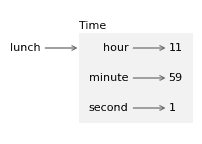
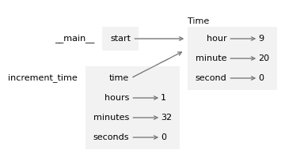

# 14\. 类和函数

> 原文：[`allendowney.github.io/ThinkPython/chap14.html`](https://allendowney.github.io/ThinkPython/chap14.html)

到目前为止，你已经学会了如何使用函数组织代码，以及如何使用内置类型组织数据。下一步是**面向对象编程**，它使用程序员定义的类型来组织代码和数据。

面向对象编程是一个庞大的话题，因此我们将逐步进行。在本章中，我们将从不规范的代码开始——也就是说，它不是经验丰富的程序员所写的那种代码——但这是一个不错的起点。在接下来的两章中，我们将使用更多的特性来编写更规范的代码。

## 14.1\. 程序员定义的类型

我们已经使用了许多 Python 的内置类型——现在我们将定义一个新类型。作为第一个例子，我们将创建一个名为`Time`的类型，表示一天中的时间。程序员定义的类型也叫做**类**。一个类的定义如下：

```py
class Time:
  """Represents a time of day.""" 
```

头部表示新类的名称是`Time`。主体部分是一个文档字符串，用来说明这个类的用途。定义一个类会创建一个**类对象**。

类对象就像是一个创建对象的工厂。要创建一个`Time`对象，你可以像调用函数一样调用`Time`。

```py
lunch = Time() 
```

结果是一个新对象，它的类型是`__main__.Time`，其中`__main__`是定义`Time`的模块的名称。

```py
type(lunch) 
```

```py
__main__.Time 
```

当你打印一个对象时，Python 会告诉你它的类型以及它在内存中的存储位置（前缀`0x`表示后面的数字是十六进制的）。

```py
print(lunch) 
```

```py
<__main__.Time object at 0x7f31440ad0c0> 
```

创建一个新对象称为**实例化**，该对象是类的**实例**。

## 14.2\. 属性

一个对象可以包含变量，这些变量被称为**属性**，重音在第一个音节上，发音为“AT-trib-ute”，而不是重音在第二个音节上，发音为“a-TRIB-ute”。我们可以使用点符号来创建属性。

```py
lunch.hour = 11
lunch.minute = 59
lunch.second = 1 
```

这个例子创建了名为`hour`、`minute`和`second`的属性，它们分别表示时间`11:59:01`的小时、分钟和秒，按我个人的理解，这是午餐时间。

以下图表显示了在这些赋值之后，`lunch`及其属性的状态。



变量`lunch`引用一个`Time`对象，该对象包含三个属性。每个属性都引用一个整数。像这样的状态图——展示了对象及其属性——被称为**对象图**。

你可以使用点操作符来读取属性的值。

```py
lunch.hour 
```

```py
11 
```

你可以将一个属性作为任何表达式的一部分。

```py
total_minutes = lunch.hour * 60 + lunch.minute
total_minutes 
```

```py
719 
```

你还可以在 f-string 表达式中使用点操作符。

```py
f'{lunch.hour}:{lunch.minute}:{lunch.second}' 
```

```py
'11:59:1' 
```

但请注意，之前的例子并不符合标准格式。为了解决这个问题，我们需要在打印 `minute` 和 `second` 属性时加上前导零。我们可以通过在大括号中的表达式后面添加 **格式说明符** 来实现。以下示例中的格式说明符表示 `minute` 和 `second` 应该至少显示两位数字，并在需要时加上前导零。

```py
f'{lunch.hour}:{lunch.minute:02d}:{lunch.second:02d}' 
```

```py
'11:59:01' 
```

我们将使用这个 f-string 来编写一个函数，显示 `Time` 对象的值。你可以像往常一样将一个对象作为参数传递。例如，下面的函数将 `Time` 对象作为参数。

```py
def print_time(time):
    s = f'{time.hour:02d}:{time.minute:02d}:{time.second:02d}'
    print(s) 
```

当我们调用它时，我们可以将 `lunch` 作为参数传递。

```py
print_time(lunch) 
```

```py
11:59:01 
```

## 14.3\. 对象作为返回值

函数可以返回对象。例如，`make_time` 接受名为 `hour`、`minute` 和 `second` 的参数，将它们作为属性存储在 `Time` 对象中，并返回新对象。

```py
def make_time(hour, minute, second):
    time = Time()
    time.hour = hour
    time.minute = minute
    time.second = second
    return time 
```

可能会让人惊讶的是，参数和属性的名称相同，但这是编写此类函数的常见方式。下面是我们如何使用 `make_time` 来创建一个 `Time` 对象。

```py
time = make_time(11, 59, 1)
print_time(time) 
```

```py
11:59:01 
```

## 14.4\. 对象是可变的

假设你去看一场电影，比如 *Monty Python and the Holy Grail*，它从 `9:20 PM` 开始，持续 `92` 分钟，也就是 `1` 小时 `32` 分钟。电影什么时候结束？

首先，我们将创建一个表示开始时间的 `Time` 对象。

```py
start = make_time(9, 20, 0)
print_time(start) 
```

```py
09:20:00 
```

为了找到结束时间，我们可以修改 `Time` 对象的属性，加入电影的时长。

```py
start.hour += 1
start.minute += 32
print_time(start) 
```

```py
10:52:00 
```

电影将在 `10:52 PM` 结束。

让我们将这个计算封装成一个函数，并将其通用化，以接受电影时长的三个参数：`hours`、`minutes` 和 `seconds`。

```py
def increment_time(time, hours, minutes, seconds):
    time.hour += hours
    time.minute += minutes
    time.second += seconds 
```

这是一个演示效果的示例。

```py
start = make_time(9, 20, 0)
increment_time(start, 1, 32, 0)
print_time(start) 
```

```py
10:52:00 
```

以下堆栈图显示了在 `increment_time` 修改对象之前，程序的状态。



在函数内部，`time` 是 `start` 的别名，因此当 `time` 被修改时，`start` 也会改变。

这个函数是有效的，但运行后，我们会留下一个名为 `start` 的变量，它指向表示 *结束* 时间的对象，而我们不再拥有表示开始时间的对象。最好不要改变 `start`，而是创建一个新的对象来表示结束时间。我们可以通过复制 `start` 并修改副本来实现。

## 14.5\. 复制

`copy` 模块提供了一个名为 `copy` 的函数，可以复制任何对象。我们可以像这样导入它。

```py
from copy import copy 
```

为了查看它是如何工作的，我们从一个新的 `Time` 对象开始，表示电影的开始时间。

```py
start = make_time(9, 20, 0) 
```

并且制作一个副本。

```py
end = copy(start) 
```

现在 `start` 和 `end` 包含相同的数据。

```py
print_time(start)
print_time(end) 
```

```py
09:20:00
09:20:00 
```

但 `is` 运算符确认它们不是同一个对象。

```py
start is end 
```

```py
False 
```

让我们看看 `==` 运算符的作用。

```py
start == end 
```

```py
False 
```

你可能会期望`==`返回`True`，因为这些对象包含相同的数据。但对于程序员自定义的类，`==`运算符的默认行为与`is`运算符相同——它检查的是身份，而不是等价性。

## 14.6\. 纯函数

我们可以使用`copy`来编写不修改其参数的纯函数。例如，下面是一个函数，它接受一个`Time`对象和一个持续时间（小时、分钟和秒）。它复制原始对象，使用`increment_time`来修改副本，并返回它。

```py
def add_time(time, hours, minutes, seconds):
    total = copy(time)
    increment_time(total, hours, minutes, seconds)
    return total 
```

下面是我们如何使用它。

```py
end = add_time(start, 1, 32, 0)
print_time(end) 
```

```py
10:52:00 
```

返回值是一个表示电影结束时间的新对象。我们可以确认`start`没有改变。

```py
print_time(start) 
```

```py
09:20:00 
```

`add_time`是一个**纯函数**，因为它不会修改任何传入的对象，其唯一的作用是返回一个值。

任何可以通过不纯函数完成的事情，也可以通过纯函数完成。事实上，一些编程语言只允许使用纯函数。使用纯函数的程序可能更不容易出错，但不纯函数有时也很方便，并且可能更高效。

一般来说，我建议你在合理的情况下编写纯函数，并且只有在有充分的优势时才使用不纯函数。这种方法可能被称为**函数式编程风格**。

## 14.7\. 原型和修补

在前面的示例中，`increment_time`和`add_time`似乎可以工作，但如果我们尝试另一个例子，就会发现它们并不完全正确。

假设你到达电影院，发现电影的开始时间是`9:40`，而不是`9:20`。当我们计算更新后的结束时间时，情况如下。

```py
start = make_time(9, 40, 0)
end = add_time(start, 1, 32, 0)
print_time(end) 
```

```py
10:72:00 
```

结果不是一个有效的时间。问题在于`increment_time`没有处理秒数或分钟数加到超过`60`的情况。

这是一个改进版本，检查`second`是否大于或等于`60`——如果是，它会增加`minute`——然后检查`minute`是否大于或等于`60`——如果是，它会增加`hour`。

```py
def increment_time(time, hours, minutes, seconds):
    time.hour += hours
    time.minute += minutes
    time.second += seconds

    if time.second >= 60:
        time.second -= 60
        time.minute += 1

    if time.minute >= 60:
        time.minute -= 60
        time.hour += 1 
```

修复`increment_time`也修复了使用它的`add_time`。所以现在之前的示例可以正确运行。

```py
end = add_time(start, 1, 32, 0)
print_time(end) 
```

```py
11:12:00 
```

但是这个函数仍然不正确，因为参数可能大于`60`。例如，假设我们给出的运行时间是`92`分钟，而不是`1`小时`32`分钟。我们可能像这样调用`add_time`。

```py
end = add_time(start, 0, 92, 0)
print_time(end) 
```

```py
10:72:00 
```

结果不是一个有效的时间。所以我们尝试不同的方法，使用`divmod`函数。我们将复制`start`并通过增加`minute`属性来修改它。

```py
end = copy(start)
end.minute = start.minute + 92
end.minute 
```

```py
132 
```

现在`minute`是`132`，相当于`2`小时`12`分钟。我们可以使用`divmod`除以`60`，返回整数小时数和剩余的分钟数。

```py
carry, end.minute = divmod(end.minute, 60)
carry, end.minute 
```

```py
(2, 12) 
```

现在`minute`是正确的，我们可以将小时数加到`hour`中。

```py
end.hour += carry
print_time(end) 
```

```py
11:12:00 
```

结果是一个有效的时间。我们可以对`hour`和`second`做同样的事情，并将整个过程封装成一个函数。

```py
def increment_time(time, hours, minutes, seconds):
    time.hour += hours
    time.minute += minutes
    time.second += seconds

    carry, time.second = divmod(time.second, 60)
    carry, time.minute = divmod(time.minute + carry, 60)
    carry, time.hour = divmod(time.hour + carry, 60) 
```

在这个版本的`increment_time`中，即使参数超过`60`，`add_time`也能正常工作。

```py
end = add_time(start, 0, 90, 120)
print_time(end) 
```

```py
11:12:00 
```

本节展示了一种我称之为**原型与修补**的程序开发计划。我们从一个简单的原型开始，它在第一个例子中工作正常。然后我们用更复杂的例子进行了测试——当发现错误时，我们修改程序来修复它，就像给有破洞的轮胎打补丁一样。

这种方法可能有效，特别是当你对问题的理解还不够深入时。但增量修正可能会产生不必要复杂的代码——因为它处理了许多特殊情况——而且不可靠——因为很难确定你是否已经找到了所有错误。

## 14.8\. 设计优先开发

另一种方案是**设计优先开发**，这种方法在原型设计之前涉及更多的规划。在设计优先的过程中，有时对问题的高层次洞察能让编程变得更加容易。

在这个例子中，洞察力在于我们可以将`Time`对象视为一个 60 进制的三位数——也叫做性数字。`second`属性是“个位数”列，`minute`属性是“六十位数”列，`hour`属性是“三千六百位数”列。当我们编写`increment_time`时，我们实际上是在进行 60 进制的加法，这就是为什么我们必须从一个列进位到另一个列的原因。

这个观察结果暗示了另一种解决问题的方法——我们可以将`Time`对象转换为整数，利用 Python 处理整数运算的特性。

这里是一个将`Time`转换为整数的函数。

```py
def time_to_int(time):
    minutes = time.hour * 60 + time.minute
    seconds = minutes * 60 + time.second
    return seconds 
```

结果是自一天开始以来的秒数。例如，`01:01:01`是从一天开始算起的`1`小时、`1`分钟和`1`秒，这个值是`3600`秒、`60`秒和`1`秒的总和。

```py
time = make_time(1, 1, 1)
print_time(time)
time_to_int(time) 
```

```py
01:01:01 
```

```py
3661 
```

这里有一个将整数转换为`Time`对象的函数——它使用了`divmod`函数。

```py
def int_to_time(seconds):
    minute, second = divmod(seconds, 60)
    hour, minute = divmod(minute, 60)
    return make_time(hour, minute, second) 
```

我们可以通过将前面的例子转换回`Time`对象来进行测试。

```py
time = int_to_time(3661)
print_time(time) 
```

```py
01:01:01 
```

使用这些函数，我们可以编写一个更加简洁版的`add_time`。

```py
def add_time(time, hours, minutes, seconds):
    duration = make_time(hours, minutes, seconds)
    seconds = time_to_int(time) + time_to_int(duration)
    return int_to_time(seconds) 
```

第一行将参数转换为名为`duration`的`Time`对象。第二行将`time`和`duration`转换为秒并相加。第三行将结果转换为一个`Time`对象并返回。

这就是它的工作原理。

```py
start = make_time(9, 40, 0)
end = add_time(start, 1, 32, 0)
print_time(end) 
```

```py
11:12:00 
```

在某些方面，从 60 进制转换到 10 进制再转换回来，比直接处理时间值要难一些。进制转换更为抽象，而我们对时间值的直觉理解要更强。

但是，如果我们有足够的洞察力，将时间视为以 60 为基数的数字——并投入精力编写转换函数`time_to_int`和`int_to_time`——我们就能得到一个更简洁、更易于阅读和调试、更可靠的程序。

它也更容易在之后添加新特性。例如，假设你要对两个`Time`对象进行相减，以求得它们之间的持续时间。直接实现减法操作需要借位处理，使用转换函数更简单，也更可能正确。

具有讽刺意味的是，有时将问题做得更复杂——或者更通用——反而能使问题更容易，因为特例更少，出错的机会也更少。

## 14.9\. 调试

Python 提供了多个内置函数，可以帮助测试和调试与对象相关的程序。例如，如果你不确定一个对象的类型，可以直接询问。

```py
type(start) 
```

```py
__main__.Time 
```

你还可以使用`isinstance`来检查一个对象是否是某个特定类的实例。

```py
isinstance(end, Time) 
```

```py
True 
```

如果你不确定一个对象是否具有某个特定属性，你可以使用内置函数`hasattr`。

```py
hasattr(start, 'hour') 
```

```py
True 
```

要获取字典中所有属性及其值，可以使用`vars`。

```py
vars(start) 
```

```py
{'hour': 9, 'minute': 40, 'second': 0} 
```

`structshape`模块，我们在第十一章中看到的，它也适用于程序员定义的类型。

```py
from structshape import structshape

t = start, end
structshape(t) 
```

```py
'tuple of 2 Time' 
```

## 14.10\. 术语表

**面向对象编程：** 一种使用对象来组织代码和数据的编程风格。

**类：** 程序员定义的类型。类定义会创建一个新的类对象。

**类对象：** 表示一个类的对象——它是类定义的结果。

**实例化：** 创建属于某个类的对象的过程。

**实例：** 属于某个类的对象。

**属性：** 与对象相关联的变量，也叫实例变量。

**对象图：** 对象、其属性及其值的图形表示。

**格式化说明符：** 在 f-string 中，格式化说明符决定了值如何被转换为字符串。

**纯函数：** 一种不会修改其参数，也没有其他副作用的函数，唯一的作用是返回一个值。

**函数式编程风格：** 一种编程方式，尽可能使用纯函数。

**原型与修补：** 一种开发程序的方式，通过从粗略草图开始，逐步添加功能和修复错误。

**设计优先开发：** 一种开发程序的方式，通过更细致的规划，而不是原型开发和修补。

## 14.11\. 练习

```py
# This cell tells Jupyter to provide detailed debugging information
# when a runtime error occurs. Run it before working on the exercises.

%xmode Verbose 
```

```py
Exception reporting mode: Verbose 
```

### 14.11.1\. 向虚拟助手提问

本章包含了很多新的词汇。与虚拟助手的对话有助于加深理解。可以考虑询问：

+   “类和类型有什么区别？”

+   “对象和实例有什么区别？”

+   “变量和属性有什么区别？”

+   “纯函数与非纯函数相比有哪些优缺点？”

因为我们刚刚开始学习面向对象编程，本章中的代码并不符合惯用法——这不是经验丰富的程序员所写的代码。如果你向虚拟助手求助于这些练习，你可能会看到我们还没有介绍的特性。特别是，你可能会看到一个名为`__init__`的方法，用于初始化实例的属性。

如果这些特性对你来说有意义，尽管使用它们。但如果没有，耐心点——我们很快就会讲到。在此期间，试着仅用我们已学习过的特性来解决以下练习。

此外，在本章中我们看到一个格式说明符的例子。如需更多信息，请问：“Python f-string 中可以使用哪些格式说明符？”

### 14.11.2\. 练习

编写一个名为`subtract_time`的函数，该函数接受两个`Time`对象，并返回它们之间的间隔（秒数）——假设它们是同一天的两个时间点。

### 14.11.3\. 练习

编写一个名为`is_after`的函数，该函数接受两个`Time`对象，并返回`True`如果第一个时间点比第二个时间点晚，反之返回`False`。

```py
def is_after(t1, t2):
  """Checks whether `t1` is after `t2`.

 >>> is_after(make_time(3, 2, 1), make_time(3, 2, 0))
 True
 >>> is_after(make_time(3, 2, 1), make_time(3, 2, 1))
 False
 >>> is_after(make_time(11, 12, 0), make_time(9, 40, 0))
 True
 """
    return None 
```

### 14.11.4\. 练习

这里有一个`Date`类的定义，它表示一个日期——即年份、月份和日期。

```py
class Date:
  """Represents a year, month, and day""" 
```

1.  编写一个名为`make_date`的函数，该函数接受`year`、`month`和`day`作为参数，创建一个`Date`对象，将这些参数赋值给属性，并返回新对象。创建一个表示 1933 年 6 月 22 日的对象。

1.  编写一个名为`print_date`的函数，该函数接受一个`Date`对象，使用 f-string 格式化属性并打印结果。如果你用你创建的`Date`对象进行测试，结果应为`1933-06-22`。

1.  编写一个名为`is_after`的函数，该函数接受两个`Date`对象作为参数，并返回`True`如果第一个对象在第二个对象之后。创建一个表示 1933 年 9 月 17 日的第二个对象，并检查它是否在第一个对象之后。

提示：你可能会发现编写一个名为`date_to_tuple`的函数很有用，该函数接受一个`Date`对象并返回一个元组，包含按年份、月份、日期顺序排列的属性。

[Think Python: 第 3 版](https://allendowney.github.io/ThinkPython/index.html)

版权所有 2024 [Allen B. Downey](https://allendowney.com)

代码许可：[MIT 许可证](https://mit-license.org/)

文字许可：[知识共享署名-非商业性使用-相同方式共享 4.0 国际版](https://creativecommons.org/licenses/by-nc-sa/4.0/)
