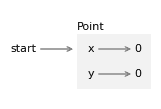
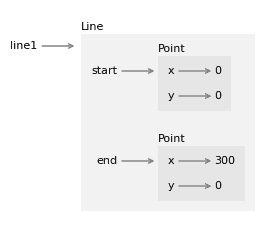
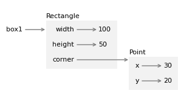
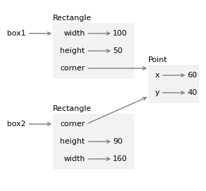

# 16\. 类和对象

> 原文：[`allendowney.github.io/ThinkPython/chap16.html`](https://allendowney.github.io/ThinkPython/chap16.html)

到目前为止，我们已经定义了类，并创建了表示一天中的时间和一年中的某一天的对象。我们还定义了可以创建、修改以及进行计算的这些对象的方法。

在本章中，我们将继续探索面向对象编程（OOP），通过定义表示几何对象的类，包括点、线、矩形和圆形。我们将编写方法来创建和修改这些对象，并使用 `jupyturtle` 模块来绘制它们。

我将使用这些类来演示面向对象编程（OOP）主题，包括对象身份与等价性、浅拷贝与深拷贝、多态等。

## 16.1\. 创建一个点

在计算机图形学中，屏幕上的位置通常通过一对坐标在 `x`-`y` 平面中表示。按照惯例，点 `(0, 0)` 通常表示屏幕的左上角，而 `(x, y)` 表示从原点出发，向右移动 `x` 单位，向下移动 `y` 单位的点。与数学课上可能见过的笛卡尔坐标系相比，`y` 轴是上下颠倒的。

在 Python 中，我们可以通过几种方式来表示一个点：

+   我们可以将坐标分别存储在两个变量 `x` 和 `y` 中。

+   我们可以将坐标作为列表或元组中的元素存储。

+   我们可以创建一个新的类型来表示点作为对象。

在面向对象编程中，最符合惯例的做法是创建一个新类型。为此，我们将从 `Point` 的类定义开始。

```py
class Point:
  """Represents a point in 2-D space."""

    def __init__(self, x, y):
        self.x = x
        self.y = y

    def __str__(self):
        return f'Point({self.x}, {self.y})' 
```

`__init__` 方法将坐标作为参数并将其赋值给属性 `x` 和 `y`。`__str__` 方法返回 `Point` 对象的字符串表示。

现在我们可以像这样实例化并显示一个 `Point` 对象。

```py
start = Point(0, 0)
print(start) 
```

```py
Point(0, 0) 
```

以下图显示了新对象的状态。



像往常一样，程序员定义的类型由一个外部有类型名称、内部有属性的框表示。

通常，程序员定义的类型是可变的，因此我们可以编写一个像 `translate` 这样的函数，它接受两个数字 `dx` 和 `dy`，并将它们加到属性 `x` 和 `y` 上。

```py
%%add_method_to Point

    def translate(self, dx, dy):
        self.x += dx
        self.y += dy 
```

这个函数将 `Point` 从平面中的一个位置平移到另一个位置。如果我们不想修改现有的 `Point`，可以使用 `copy` 来复制原始对象，然后修改副本。

```py
from copy import copy

end1 = copy(start)
end1.translate(300, 0)
print(end1) 
```

```py
Point(300, 0) 
```

我们可以将这些步骤封装到另一个名为 `translated` 的方法中。

```py
%%add_method_to Point

    def translated(self, dx=0, dy=0):
        point = copy(self)
        point.translate(dx, dy)
        return point 
```

与内置函数 `sort` 修改列表，`sorted` 函数创建一个新列表类似，我们现在有了一个 `translate` 方法来修改 `Point`，还有一个 `translated` 方法来创建一个新的 `Point`。

这里有一个例子：

```py
end2 = start.translated(0, 150)
print(end2) 
```

```py
Point(0, 150) 
```

在下一节中，我们将使用这些点来定义并绘制一条线。

## 16.2\. 创建一个 Line

现在让我们定义一个表示两个点之间线段的类。像往常一样，我们将从`__init__`方法和`__str__`方法开始。

```py
class Line:
    def __init__(self, p1, p2):
        self.p1 = p1
        self.p2 = p2

    def __str__(self):
        return f'Line({self.p1}, {self.p2})' 
```

有了这两个方法，我们可以实例化并显示一个`Line`对象，我们将用它来表示`x`轴。

```py
line1 = Line(start, end1)
print(line1) 
```

```py
Line(Point(0, 0), Point(300, 0)) 
```

当我们调用`print`并传入`line`作为参数时，`print`会在`line`上调用`__str__`方法。`__str__`方法使用 f-string 来创建`line`的字符串表示。

f-string 包含了两个大括号中的表达式`self.p1`和`self.p2`。当这些表达式被求值时，结果是`Point`对象。然后，当它们被转换为字符串时，会调用`Point`类中的`__str__`方法。

这就是为什么，当我们显示一个`Line`时，结果包含了`Point`对象的字符串表示。

以下对象图展示了这个`Line`对象的状态。



字符串表示和对象图对于调试很有用，但这个示例的重点是生成图形，而不是文本！所以我们将使用`jupyturtle`模块在屏幕上绘制线条。

正如我们在第四章中所做的那样，我们将使用`make_turtle`来创建一个`Turtle`对象以及一个可以绘制的画布。为了绘制线条，我们将使用`jupyturtle`模块中的两个新函数：

+   `jumpto`，它接受两个坐标并将`Turtle`移动到给定位置，而不绘制线条，和

+   `moveto`，它将`Turtle`从当前位置移动到给定位置，并在它们之间绘制一条线段。

这是我们如何导入它们。

```py
from jupyturtle import make_turtle, jumpto, moveto 
```

这里有一个方法，它绘制了一个`Line`。

```py
%%add_method_to Line

    def draw(self):
        jumpto(self.p1.x, self.p1.y)
        moveto(self.p2.x, self.p2.y) 
```

为了展示它是如何使用的，我将创建第二条代表`y`轴的线。

```py
line2 = Line(start, end2)
print(line2) 
```

```py
Line(Point(0, 0), Point(0, 150)) 
```

然后绘制坐标轴。

```py
make_turtle()
line1.draw()
line2.draw() 
```

随着我们定义并绘制更多对象，我们将再次使用这些线条。但首先，让我们来讨论对象的等价性和标识。

## 16.3\. 等价性和标识

假设我们创建了两个坐标相同的点。

```py
p1 = Point(200, 100)
p2 = Point(200, 100) 
```

如果我们使用`==`运算符来比较它们，我们会得到程序员定义类型的默认行为——结果只有在它们是同一个对象时才为`True`，而它们并不是。

```py
p1 == p2 
```

```py
False 
```

如果我们想改变这种行为，我们可以提供一个特殊的方法`__eq__`，定义两个`Point`对象相等的标准。

```py
%%add_method_to Point

def __eq__(self, other):
    return (self.x == other.x) and (self.y == other.y) 
```

这个定义认为，当两个`Point`对象的属性相等时，它们被认为是相等的。现在当我们使用`==`运算符时，它会调用`__eq__`方法，这表示`p1`和`p2`被认为是相等的。

```py
p1 == p2 
```

```py
True 
```

但是`is`运算符仍然表示它们是不同的对象。

```py
p1 is p2 
```

```py
False 
```

不可能重载 `is` 运算符 —— 它始终检查对象是否相同。但对于程序员定义的类型，你可以重载 `==` 运算符，以便它检查对象是否等价。并且你可以定义什么是“等价”。

## 16.4\. 创建一个矩形

现在让我们定义一个类来表示和绘制矩形。为了简化起见，我们假设矩形要么是垂直的，要么是水平的，而不是倾斜的。你认为我们应该使用什么属性来指定矩形的位置和大小？

至少有两种可能性：

+   你可以指定矩形的宽度和高度，以及一个角的位置。

+   你可以指定两个对角的角。

此时，很难说哪种方式比另一种更好，因此让我们先实现第一种。以下是类的定义。

```py
class Rectangle:
  """Represents a rectangle. 

 attributes: width, height, corner.
 """
    def __init__(self, width, height, corner):
        self.width = width
        self.height = height
        self.corner = corner

    def __str__(self):
        return f'Rectangle({self.width}, {self.height}, {self.corner})' 
```

和往常一样，`__init__` 方法将参数赋值给属性，而 `__str__` 返回对象的字符串表示。现在我们可以实例化一个 `Rectangle` 对象，使用一个 `Point` 作为左上角的位置。

```py
corner = Point(30, 20)
box1 = Rectangle(100, 50, corner)
print(box1) 
```

```py
Rectangle(100, 50, Point(30, 20)) 
```

以下图展示了该对象的状态。



为了绘制一个矩形，我们将使用以下方法来创建四个 `Point` 对象，表示矩形的四个角。

```py
%%add_method_to Rectangle

    def make_points(self):
        p1 = self.corner
        p2 = p1.translated(self.width, 0)
        p3 = p2.translated(0, self.height)
        p4 = p3.translated(-self.width, 0)
        return p1, p2, p3, p4 
```

然后我们将创建四个 `Line` 对象来表示矩形的边。

```py
%%add_method_to Rectangle

    def make_lines(self):
        p1, p2, p3, p4 = self.make_points()
        return Line(p1, p2), Line(p2, p3), Line(p3, p4), Line(p4, p1) 
```

然后我们将绘制矩形的边。

```py
%%add_method_to Rectangle

    def draw(self):
        lines = self.make_lines()
        for line in lines:
            line.draw() 
```

这是一个示例。

```py
make_turtle()
line1.draw()
line2.draw()
box1.draw() 
```

图中包含两条线来表示坐标轴。

## 16.5\. 修改矩形

现在让我们考虑两种修改矩形的方法，`grow` 和 `translate`。我们将看到 `grow` 按预期工作，但 `translate` 存在一个细微的 bug。在我解释之前，看看你能否先找出这个问题。

`grow` 需要两个数字，`dwidth` 和 `dheight`，并将它们加到矩形的 `width` 和 `height` 属性上。

```py
%%add_method_to Rectangle

    def grow(self, dwidth, dheight):
        self.width += dwidth
        self.height += dheight 
```

这是一个示例，通过复制 `box1` 并在复制对象上调用 `grow` 来演示效果。

```py
box2 = copy(box1)
box2.grow(60, 40)
print(box2) 
```

```py
Rectangle(160, 90, Point(30, 20)) 
```

如果我们绘制 `box1` 和 `box2`，可以确认 `grow` 按预期工作。

```py
make_turtle()
line1.draw()
line2.draw()
box1.draw()
box2.draw() 
```

现在让我们看看 `translate`。它需要两个数字，`dx` 和 `dy`，并将矩形在 `x` 和 `y` 方向上移动给定的距离。

```py
%%add_method_to Rectangle

    def translate(self, dx, dy):
        self.corner.translate(dx, dy) 
```

为了演示效果，我们将 `box2` 向右和向下移动。

```py
box2.translate(30, 20)
print(box2) 
```

```py
Rectangle(160, 90, Point(60, 40)) 
```

现在让我们再看看如果我们重新绘制 `box1` 和 `box2` 会发生什么。

```py
make_turtle()
line1.draw()
line2.draw()
box1.draw()
box2.draw() 
```

看起来两个矩形都移动了，这并不是我们想要的结果！下一节将解释出了什么问题。

## 16.6\. 深拷贝

当我们使用 `copy` 来复制 `box1` 时，它复制了 `Rectangle` 对象，但没有复制其中包含的 `Point` 对象。所以 `box1` 和 `box2` 是不同的对象，这正是我们想要的效果。

```py
box1 is box2 
```

```py
False 
```

但是它们的 `corner` 属性指向相同的对象。

```py
box1.corner is box2.corner 
```

```py
True 
```

以下图展示了这些对象的状态。



`copy`所做的操作称为**浅拷贝**，因为它复制了对象本身，而不是对象内部包含的其他对象。因此，改变一个`Rectangle`的`width`或`height`不会影响另一个`Rectangle`，但改变共享的`Point`属性会影响两个对象！这种行为容易导致混淆和错误。

幸运的是，`copy`模块提供了另一个函数，叫做`deepcopy`，它不仅复制对象本身，还会复制它所引用的对象，甚至是它们所引用的对象，依此类推。这个操作称为**深拷贝**。

为了演示，我们从一个新的`Rectangle`开始，并包含一个新的`Point`。

```py
corner = Point(20, 20)
box3 = Rectangle(100, 50, corner)
print(box3) 
```

```py
Rectangle(100, 50, Point(20, 20)) 
```

然后我们将进行深拷贝。

```py
from copy import deepcopy

box4 = deepcopy(box3) 
```

我们可以确认这两个`Rectangle`对象分别引用了不同的`Point`对象。

```py
box3.corner is box4.corner 
```

```py
False 
```

因为`box3`和`box4`是完全独立的对象，我们可以修改一个而不影响另一个。为了演示，我们将移动`box3`并增大`box4`。

```py
box3.translate(50, 30)
box4.grow(100, 60) 
```

我们可以确认效果如预期。

```py
make_turtle()
line1.draw()
line2.draw()
box3.draw()
box4.draw() 
```

## 16.7\. 多态性

在前面的例子中，我们对两个`Line`对象和两个`Rectangle`对象调用了`draw`方法。我们可以通过将对象列表化来更简洁地做同样的事情。

```py
shapes = [line1, line2, box3, box4] 
```

这个列表中的元素是不同类型的，但它们都提供了一个`draw`方法，因此我们可以遍历这个列表并对每个元素调用`draw`。

```py
make_turtle()

for shape in shapes:
    shape.draw() 
```

在循环的第一次和第二次中，`shape`指向一个`Line`对象，因此当调用`draw`时，执行的是`Line`类中定义的方法。

第三次和第四次循环时，`shape`指向一个`Rectangle`对象，因此当调用`draw`时，执行的是`Rectangle`类中定义的方法。

从某种意义上讲，每个对象都知道如何绘制自己。这个特性被称为**多态性**。这个词来源于希腊语，意思是“多形态”。在面向对象编程中，多态性是指不同类型的对象能够提供相同的方法，这使得我们可以通过在不同类型的对象上调用相同的方法来执行许多计算——比如绘制图形。

作为本章末尾的练习，你将定义一个新的类，表示一个圆形并提供一个`draw`方法。然后，你可以利用多态性来绘制线条、矩形和圆形。

## 16.8\. 调试

在本章中，我们遇到了一个微妙的 bug，因为我们创建了一个`Point`对象，它被两个`Rectangle`对象共享，然后我们修改了这个`Point`。通常，有两种方法可以避免此类问题：要么避免共享对象，要么避免修改对象。

为了避免共享对象，我们可以使用深拷贝，正如我们在本章中所做的那样。

为了避免修改对象，考虑用纯函数如`translated`替换不纯函数如`translate`。例如，这是一个创建新`Point`并且永不修改其属性的`translated`版本。

```py
 def translated(self, dx=0, dy=0):
        x = self.x + dx
        y = self.y + dy
        return Point(x, y) 
```

Python 提供的功能使得避免修改对象变得更容易。虽然这些功能超出了本书的范围，但如果你感兴趣，可以询问虚拟助手：“如何让一个 Python 对象变为不可变？”

创建一个新对象比修改现有对象花费更多时间，但在实际应用中，这种差异通常并不重要。避免共享对象和不纯函数的程序通常更容易开发、测试和调试——而最好的调试方式是你不需要进行调试。

## 16.9\. 词汇表

**浅拷贝：** 一种拷贝操作，不会拷贝嵌套对象。

**深拷贝：** 一种拷贝操作，也会拷贝嵌套对象。

**多态：** 方法或运算符能够与多种类型的对象一起工作。

## 16.10\. 练习

```py
# This cell tells Jupyter to provide detailed debugging information
# when a runtime error occurs. Run it before working on the exercises.

%xmode Verbose 
```

### 16.10.1\. 请求虚拟助手

对于以下所有练习，可以考虑请求虚拟助手的帮助。如果这样做，你需要将`Point`、`Line`和`Rectangle`类的定义作为提示的一部分提供——否则虚拟助手会猜测它们的属性和方法，生成的代码将无法正常工作。

### 16.10.2\. 练习

为`Line`类编写一个`__eq__`方法，如果`Line`对象引用的`Point`对象是相等的（无论顺序如何），则返回`True`。

你可以使用以下大纲来开始。

```py
%%add_method_to Line

def __eq__(self, other):
    return None 
```

你可以使用这些示例来测试你的代码。

```py
start1 = Point(0, 0)
start2 = Point(0, 0)
end = Point(200, 100) 
```

这个示例应该是`True`，因为`Line`对象引用的`Point`对象是相等的，并且顺序相同。

```py
line_a = Line(start1, end)
line_b = Line(start2, end)
line_a == line_b    # should be True 
```

```py
True 
```

```py
line_c = Line(end, start1)
line_a == line_c     # should be True 
```

```py
True 
```

等价关系应始终具有传递性——也就是说，如果`line_a`和`line_b`是相等的，且`line_a`和`line_c`是相等的，那么`line_b`和`line_c`也应该是相等的。

```py
line_b == line_c     # should be True 
```

```py
True 
```

这个示例应该是`False`，因为`Line`对象引用的`Point`对象是不相等的。

```py
line_d = Line(start1, start2)
line_a == line_d    # should be False 
```

```py
False 
```

### 16.10.3\. 练习

编写一个名为`midpoint`的`Line`方法，该方法计算线段的中点并将结果作为`Point`对象返回。

你可以使用以下大纲来开始。

```py
%%add_method_to Line

    def midpoint(self):
        return Point(0, 0) 
```

你可以使用以下示例来测试你的代码并绘制结果。

```py
start = Point(0, 0)
end1 = Point(300, 0)
end2 = Point(0, 150)
line1 = Line(start, end1)
line2 = Line(start, end2) 
```

```py
mid1 = line1.midpoint()
print(mid1) 
```

```py
Point(150.0, 0.0) 
```

```py
mid2 = line2.midpoint()
print(mid2) 
```

```py
Point(0.0, 75.0) 
```

```py
line3 = Line(mid1, mid2) 
```

```py
make_turtle()

for shape in [line1, line2, line3]:
    shape.draw() 
```

### 16.10.4\. 练习

编写一个名为`midpoint`的`Rectangle`方法，该方法找到矩形中心的点并将结果作为`Point`对象返回。

你可以使用以下大纲来开始。

```py
%%add_method_to Rectangle

    def midpoint(self):
        return Point(0, 0) 
```

你可以使用以下示例来测试你的代码。

```py
corner = Point(30, 20)
rectangle = Rectangle(100, 80, corner) 
```

```py
mid = rectangle.midpoint()
print(mid) 
```

```py
Point(80.0, 60.0) 
```

```py
diagonal = Line(corner, mid) 
```

```py
make_turtle()

for shape in [line1, line2, rectangle, diagonal]:
    shape.draw() 
```

### 16.10.5\. 练习

编写一个名为`make_cross`的`Rectangle`方法，该方法：

1.  使用`make_lines`来获取表示矩形四个边的`Line`对象列表。

1.  计算四条线的中点。

1.  创建并返回一个包含两个`Line`对象的列表，这些对象代表连接相对中点的线，形成一个穿过矩形中部的十字。

你可以使用以下大纲来开始。

```py
%%add_method_to Rectangle

    def make_diagonals(self):
        return [] 
```

你可以使用以下示例来测试你的代码。

```py
corner = Point(30, 20)
rectangle = Rectangle(100, 80, corner) 
```

```py
lines = rectangle.make_cross() 
```

```py
make_turtle()

rectangle.draw()
for line in lines:
    line.draw() 
```

### 16.10.6\. 练习

编写一个名为`Circle`的类的定义，具有属性`center`和`radius`，其中`center`是一个 Point 对象，`radius`是一个数字。包括特殊方法`__init__`和`__str__`，以及一个名为`draw`的方法，使用`jupyturtle`函数绘制圆形。

你可以使用以下函数，这是我们在第四章中编写的`circle`函数的版本。

```py
from jupyturtle import make_turtle, forward, left, right
import math

def draw_circle(radius):
    circumference = 2 * math.pi * radius
    n = 30
    length = circumference / n
    angle = 360 / n
    left(angle / 2)
    for i in range(n):
        forward(length)
        left(angle) 
```

你可以使用以下示例来测试你的代码。我们将从一个宽度和高度为`100`的正方形`Rectangle`开始。

```py
corner = Point(20, 20)
rectangle = Rectangle(100, 100, corner) 
```

以下代码应该创建一个可以适应正方形的`Circle`。

```py
center = rectangle.midpoint()
radius = rectangle.height / 2

circle = Circle(center, radius)
print(circle) 
```

```py
Circle(Point(70.0, 70.0), 50.0) 
```

如果一切正常，以下代码应该会在正方形内部绘制一个圆（触及四个边）。

```py
make_turtle(delay=0.01)

rectangle.draw()
circle.draw() 
```

[Think Python: 第 3 版](https://allendowney.github.io/ThinkPython/index.html)

版权所有 2024 [Allen B. Downey](https://allendowney.com)

代码许可证：[MIT 许可证](https://mit-license.org/)

文本许可证：[知识共享署名-非商业性使用-相同方式共享 4.0 国际版](https://creativecommons.org/licenses/by-nc-sa/4.0/)
