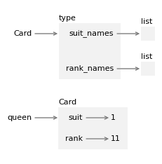

# 17. 继承

> 原文：[`allendowney.github.io/ThinkPython/chap17.html`](https://allendowney.github.io/ThinkPython/chap17.html)

与面向对象编程最常关联的语言特性是**继承**。继承是定义一个新的类，该类是现有类的修改版本的能力。在本章中，我将通过表示扑克牌、扑克牌组和扑克手牌的类来演示继承。如果你不玩扑克，不用担心——我会告诉你需要了解的内容。

## 17.1. 表示牌

一副标准的扑克牌有 52 张——每一张牌属于四种花色之一和十三种点数之一。花色有黑桃、红桃、方块和梅花。点数有 Ace（王牌）、2、3、4、5、6、7、8、9、10、J（杰克）、Q（女王）和 K（国王）。根据你玩的游戏规则，Ace 可以比 K 高，也可以比 2 低。

如果我们想定义一个新的对象来表示一张扑克牌，属性应该是显而易见的：`rank` 和 `suit`。然而，属性应该是什么类型就不那么明显了。一个可能的选择是使用字符串，比如用 `'Spade'` 表示花色，`'Queen'` 表示点数。这个实现的问题在于，比较牌的大小，看看哪张牌的点数或花色更高，将变得不那么容易。

另一种选择是使用整数来**编码**点数和花色。在这里，“编码”意味着我们将定义一个数字与花色之间，或者数字与点数之间的映射。这种编码并不意味着是保密的（那是“加密”）。

例如，这个表格展示了花色和相应的整数代码：

| 花色 | 代码 |
| --- | --- |
| 黑桃 | 3 |
| 红桃 | 2 |
| 方块 | 1 |
| 梅花 | 0 |

使用这种编码，我们可以通过比较它们的代码来比较花色。

为了编码点数，我们将使用整数 `2` 来表示点数 `2`，`3` 来表示 `3`，依此类推，一直到 `10`。下面的表格展示了面牌的代码。

| 点数 | 代码 |
| --- | --- |
| 杰克 | 11 |
| 女王 | 12 |
| 国王 | 13 |

我们可以使用 `1` 或 `14` 来表示 Ace（王牌），具体取决于我们希望它被视为比其他点数低还是高。

为了表示这些编码，我们将使用两个字符串列表，一个包含花色的名称，另一个包含点数的名称。

这是一个表示扑克牌的类的定义，使用这些字符串列表作为**类变量**，类变量是定义在类内部，但不在方法内部的变量。

```py
class Card:
  """Represents a standard playing card."""

    suit_names = ['Clubs', 'Diamonds', 'Hearts', 'Spades']
    rank_names = [None, 'Ace', '2', '3', '4', '5', '6', '7', 
                  '8', '9', '10', 'Jack', 'Queen', 'King', 'Ace'] 
```

`rank_names` 的第一个元素是 `None`，因为没有点数为零的牌。通过包括 `None` 作为占位符，我们得到了一个很好的属性：索引 `2` 映射到字符串 `'2'`，以此类推。

类变量与类相关联，而不是与类的实例相关联，因此我们可以像这样访问它们。

```py
Card.suit_names 
```

```py
['Clubs', 'Diamonds', 'Hearts', 'Spades'] 
```

我们可以使用 `suit_names` 来查找花色并获取相应的字符串。

```py
Card.suit_names[0] 
```

```py
'Clubs' 
```

并且可以使用 `rank_names` 来查找点数。

```py
Card.rank_names[11] 
```

```py
'Jack' 
```

## 17.2\. 卡片属性

这是`Card`类的`__init__`方法——它接受`花色`和`点数`作为参数，并将它们分配给具有相同名称的属性。

```py
%%add_method_to Card

    def __init__(self, suit, rank):
        self.suit = suit
        self.rank = rank 
```

现在我们可以这样创建一个`Card`对象。

```py
queen = Card(1, 12) 
```

我们可以使用新的实例来访问属性。

```py
queen.suit, queen.rank 
```

```py
(1, 12) 
```

使用实例来访问类变量也是合法的。

```py
queen.suit_names 
```

```py
['Clubs', 'Diamonds', 'Hearts', 'Spades'] 
```

但如果使用类来访问，能够更清楚地表明它们是类变量，而不是实例属性。

## 17.3\. 打印卡片

这是一个`__str__`方法，用于`Card`对象。

```py
%%add_method_to Card

    def __str__(self):
        rank_name = Card.rank_names[self.rank]
        suit_name = Card.suit_names[self.suit]
        return f'{rank_name} of {suit_name}' 
```

当我们打印一个`Card`对象时，Python 会调用`__str__`方法来获取该卡片的可读表示。

```py
print(queen) 
```

```py
Queen of Diamonds 
```

以下是`Card`类对象和卡片实例的示意图。`Card`是一个类对象，所以它的类型是`type`。`queen`是`Card`的实例，所以它的类型是`Card`。为了节省空间，我没有画出`suit_names`和`rank_names`的内容。



每个`Card`实例都有自己的`suit`和`rank`属性，但只有一个`Card`类对象，并且类变量`suit_names`和`rank_names`只有一份副本。

## 17.4\. 比较卡片

假设我们创建了第二个具有相同花色和点数的`Card`对象。

```py
queen2 = Card(1, 12)
print(queen2) 
```

```py
Queen of Diamonds 
```

如果我们使用`==`运算符来比较它们，它会检查`queen`和`queen2`是否指向同一个对象。

```py
queen == queen2 
```

```py
False 
```

它们不相等，所以返回`False`。我们可以通过定义特殊方法`__eq__`来改变这种行为。

```py
%%add_method_to Card

    def __eq__(self, other):
        return self.suit == other.suit and self.rank == other.rank 
```

`__eq__`接受两个`Card`对象作为参数，如果它们具有相同的花色和点数，即使它们不是同一个对象，也会返回`True`。换句话说，它会检查它们是否等价，即使它们不是同一个对象。

当我们使用`==`运算符比较`Card`对象时，Python 会调用`__eq__`方法。

```py
queen == queen2 
```

```py
True 
```

作为第二个测试，让我们创建一张具有相同花色但不同点数的卡片。

```py
six = Card(1, 6)
print(six) 
```

```py
6 of Diamonds 
```

我们可以确认`queen`和`six`不是等价的。

```py
queen == six 
```

```py
False 
```

如果我们使用`!=`运算符，Python 会调用一个叫做`__ne__`的特殊方法（如果存在）。如果没有，它会调用`__eq__`并反转结果——也就是说，如果`__eq__`返回`True`，那么`!=`运算符的结果就是`False`。

```py
queen != queen2 
```

```py
False 
```

```py
queen != six 
```

```py
True 
```

现在假设我们想比较两张卡片，看看哪一张更大。如果我们使用关系运算符之一，将会出现`TypeError`。

```py
queen < queen2 
```

```py
TypeError: '<' not supported between instances of 'Card' and 'Card' 
```

要改变`<`运算符的行为，我们可以定义一个特殊的方法叫做`__lt__`，它是“less than”（小于）的缩写。为了简单起见，假设花色比点数更重要——所以所有黑桃的等级高于所有红心，红心又高于所有方块，依此类推。如果两张卡片的花色相同，那么点数较大的卡片获胜。

为了实现这个逻辑，我们将使用以下方法，它返回一个元组，包含卡片的花色和点数，按此顺序。

```py
%%add_method_to Card

    def to_tuple(self):
        return (self.suit, self.rank) 
```

我们可以使用这个方法来编写`__lt__`。

```py
%%add_method_to Card

    def __lt__(self, other):
        return self.to_tuple() < other.to_tuple() 
```

元组比较会比较每个元组的第一个元素，这些元素表示花色。如果它们相同，则比较第二个元素，这些元素表示点数。

现在，如果我们使用`<`运算符，它会调用`__lt__`方法。

```py
six < queen 
```

```py
True 
```

如果我们使用`>`运算符，它会调用一个名为`__gt__`的特殊方法（如果存在）。否则，它会使用`__lt__`，并将参数顺序调换。

```py
queen < queen2 
```

```py
False 
```

```py
queen > queen2 
```

```py
False 
```

最后，如果我们使用`<=`运算符，它会调用一个名为`__le__`的特殊方法。

```py
%%add_method_to Card

    def __le__(self, other):
        return self.to_tuple() <= other.to_tuple() 
```

所以我们可以检查一张牌是否小于或等于另一张牌。

```py
queen <= queen2 
```

```py
True 
```

```py
queen <= six 
```

```py
False 
```

如果我们使用`>=`运算符，它会使用`__ge__`（如果存在）。否则，它会使用`__le__`，并将参数顺序调换。

```py
queen >= six 
```

```py
True 
```

正如我们所定义的，这些方法是完整的，因为我们可以比较任何两个`Card`对象，而且是相容的，因为不同运算符的结果不互相矛盾。拥有这两个特性，我们可以说`Card`对象是**完全有序**的。这意味着，正如我们很快将看到的，它们可以被排序。

## 17.5\. 牌组

现在我们有了表示牌的对象，让我们定义表示牌组的对象。以下是`Deck`类的定义，其中`__init__`方法接收一个`Card`对象列表作为参数，并将其赋值给一个名为`cards`的属性。

```py
class Deck:

    def __init__(self, cards):
        self.cards = cards 
```

要创建一个包含标准牌组 52 张牌的列表，我们将使用以下静态方法。

```py
%%add_method_to Deck

    def make_cards():
        cards = []
        for suit in range(4):
            for rank in range(2, 15):
                card = Card(suit, rank)
                cards.append(card)
        return cards 
```

在`make_cards`中，外循环枚举从`0`到`3`的花色，内循环枚举从`2`到`14`的点数——其中`14`表示比国王还大的 Ace。每次迭代都会用当前的花色和点数创建一张新的`Card`，并将其添加到`cards`列表中。

下面是我们如何制作一组牌并创建一个包含这些牌的`Deck`对象。

```py
cards = Deck.make_cards()
deck = Deck(cards)
len(deck.cards) 
```

```py
52 
```

它包含 52 张牌，符合预期。

## 17.6\. 打印牌组

这是`Deck`的`__str__`方法。

```py
%%add_method_to Deck

    def __str__(self):
        res = []
        for card in self.cards:
            res.append(str(card))
        return '\n'.join(res) 
```

这个方法展示了一种高效地积累大字符串的方式——先构建一个字符串列表，然后使用字符串方法`join`。

我们将用一副只包含两张牌的牌组来测试这个方法。

```py
small_deck = Deck([queen, six]) 
```

如果我们调用`str`，它会调用`__str__`方法。

```py
str(small_deck) 
```

```py
'Queen of Diamonds\n6 of Diamonds' 
```

当 Jupyter 显示字符串时，它会显示字符串的“表示”形式，其中换行符用序列`\n`表示。

然而，如果我们打印结果，Jupyter 会显示字符串的“可打印”形式，其中换行符被显示为空格。

```py
print(small_deck) 
```

```py
Queen of Diamonds
6 of Diamonds 
```

所以这些牌会显示在不同的行上。

## 17.7\. 添加、删除、洗牌和排序

要发牌，我们需要一个方法，它从牌组中移除一张牌并返回。列表方法`pop`提供了一个方便的方式来实现这一点。

```py
%%add_method_to Deck

    def take_card(self):
        return self.cards.pop() 
```

下面是我们如何使用它。

```py
card = deck.take_card()
print(card) 
```

```py
Ace of Spades 
```

我们可以确认牌组中还剩下`51`张牌。

```py
len(deck.cards) 
```

```py
51 
```

要添加一张牌，我们可以使用列表方法`append`。

```py
%%add_method_to Deck

    def put_card(self, card):
        self.cards.append(card) 
```

作为示例，我们可以把刚刚弹出的牌放回去。

```py
deck.put_card(card)
len(deck.cards) 
```

```py
52 
```

要洗牌，我们可以使用`random`模块中的`shuffle`函数：

```py
import random 
```

```py
%%add_method_to Deck

    def shuffle(self):
        random.shuffle(self.cards) 
```

如果我们洗牌并打印前几张卡片，我们会看到它们的顺序看似随机。

```py
deck.shuffle()
for card in deck.cards[:4]:
    print(card) 
```

```py
2 of Diamonds
4 of Hearts
5 of Clubs
8 of Diamonds 
```

要对卡片进行排序，我们可以使用列表方法`sort`，该方法会“就地”排序元素——也就是说，它修改原列表，而不是创建一个新的列表。

```py
%%add_method_to Deck

    def sort(self):
        self.cards.sort() 
```

当我们调用`sort`时，它会使用`__lt__`方法来比较卡片。

```py
deck.sort() 
```

如果我们打印前几张卡片，可以确认它们是按升序排列的。

```py
for card in deck.cards[:4]:
    print(card) 
```

```py
2 of Clubs
3 of Clubs
4 of Clubs
5 of Clubs 
```

在这个例子中，`Deck.sort`除了调用`list.sort`之外并不会做其他事情。将责任传递给其他方法的做法称为**委托**。

## 17.8\. 父类和子类

继承是定义一个新类的能力，这个新类是现有类的修改版。例如，假设我们想定义一个类来表示“手牌”，也就是一个玩家持有的卡片。

+   `Hand`类似于`Deck`——两者都是由卡片集合组成，并且都需要执行像添加和移除卡片这样的操作。

+   `Hand`和`Deck`也有不同之处——我们希望对`Hand`进行的操作在`Deck`上没有意义。例如，在扑克中，我们可能会比较两副牌，看看哪一副胜出。在桥牌中，我们可能会计算一副牌的分数，以便进行叫牌。

这种类之间的关系——其中一个是另一个的专门化版本——非常适合继承。

要定义一个基于现有类的新类，我们将现有类的名称放在括号中。

```py
class Hand(Deck):
  """Represents a hand of playing cards.""" 
```

这个定义表明`Hand`继承自`Deck`，这意味着`Hand`对象可以访问`Deck`中定义的方法，如`take_card`和`put_card`。

`Hand`也继承了`Deck`中的`__init__`方法，但如果我们在`Hand`类中定义了`__init__`，它将覆盖`Deck`类中的版本。

```py
%%add_method_to Hand

    def __init__(self, label=''):
        self.label = label
        self.cards = [] 
```

这个版本的`__init__`方法接受一个可选的字符串作为参数，并且总是从一个空的卡片列表开始。当我们创建一个`Hand`对象时，Python 会调用这个方法，而不是在`Deck`中的方法——我们可以通过检查结果是否包含`label`属性来确认这一点。

```py
hand = Hand('player 1')
hand.label 
```

```py
'player 1' 
```

要发一张卡片，我们可以使用`take_card`从`Deck`中移除一张卡片，并使用`put_card`将卡片添加到`Hand`中。

```py
deck = Deck(cards)
card = deck.take_card()
hand.put_card(card)
print(hand) 
```

```py
Ace of Spades 
```

让我们将这段代码封装到一个名为`move_cards`的`Deck`方法中。

```py
%%add_method_to Deck

    def move_cards(self, other, num):
        for i in range(num):
            card = self.take_card()
            other.put_card(card) 
```

这个方法是多态的——也就是说，它可以与多种类型一起工作：`self`和`other`可以是`Hand`或`Deck`。因此，我们可以使用这个方法将一张卡片从`Deck`发给`Hand`，从一副`Hand`发给另一副，或者从`Hand`发回`Deck`。

当一个新类继承自现有类时，现有类称为**父类**，新类称为**子类**。一般来说：

+   子类的实例应该拥有父类的所有属性，但它们可以有额外的属性。

+   子类应该拥有父类的所有方法，但它可以有额外的方法。

+   如果子类重写了父类的方法，则新方法应该采用相同的参数，并返回兼容的结果。

这一套规则被称为“李斯科夫替代原则”，以计算机科学家芭芭拉·李斯科夫的名字命名。

如果你遵循这些规则，任何设计用来处理父类实例的函数或方法，比如`Deck`，也可以用来处理子类实例，比如`Hand`。如果违反这些规则，你的代码将像纸牌屋一样崩塌（抱歉）。

## 17.9\. 专门化

让我们创建一个名为`BridgeHand`的类，用来表示桥牌中的一手牌——这是一种广泛玩的纸牌游戏。我们将从`Hand`继承，并添加一个名为`high_card_point_count`的新方法，使用“高牌点数”方法来评估一手牌，该方法会为手中的高牌加总分数。

这是一个类定义，其中包含一个类变量，映射了从卡片名称到其点数值的字典。

```py
class BridgeHand(Hand):
  """Represents a bridge hand."""

    hcp_dict = {
        'Ace': 4,
        'King': 3,
        'Queen': 2,
        'Jack': 1,
    } 
```

给定一张卡片的等级，比如`12`，我们可以使用`Card.rank_names`获取该等级的字符串表示，然后使用`hcp_dict`获取它的分数。

```py
rank = 12
rank_name = Card.rank_names[rank]
score = BridgeHand.hcp_dict.get(rank_name, 0)
rank_name, score 
```

```py
('Queen', 2) 
```

以下方法遍历`BridgeHand`中的卡片，并加总它们的分数。

```py
%%add_method_to BridgeHand

    def high_card_point_count(self):
        count = 0
        for card in self.cards:
            rank_name = Card.rank_names[card.rank]
            count += BridgeHand.hcp_dict.get(rank_name, 0)
        return count 
```

为了进行测试，我们将发一手五张牌——桥牌通常有十三张，但使用小例子更容易测试代码。

```py
hand = BridgeHand('player 2')

deck.shuffle()
deck.move_cards(hand, 5)
print(hand) 
```

```py
4 of Diamonds
King of Hearts
10 of Hearts
10 of Clubs
Queen of Diamonds 
```

这是国王和皇后的总分。

```py
hand.high_card_point_count() 
```

```py
5 
```

`BridgeHand`继承了`Hand`的变量和方法，并增加了一个类变量和一个特定于桥牌的方法。使用这种方式进行继承被称为**专门化**，因为它定义了一个针对特定用途（如打桥牌）而专门化的新类。

## 17.10\. 调试

继承是一个有用的特性。一些如果没有继承就会重复的程序，可以用继承更简洁地编写。此外，继承有助于代码复用，因为你可以在不修改父类的情况下定制其行为。在某些情况下，继承结构反映了问题的自然结构，这使得设计更容易理解。

另一方面，继承可能会让程序变得难以阅读。当调用一个方法时，有时不清楚在哪里找到它的定义——相关代码可能分散在多个模块中。

每当你不确定程序的执行流程时，最简单的解决方法是，在相关方法的开始处添加打印语句。如果`Deck.shuffle`打印一条类似于`Running Deck.shuffle`的消息，那么程序运行时就能追踪执行流程。

作为替代，你可以使用以下函数，它接受一个对象和一个方法名（作为字符串），并返回提供该方法定义的类。

```py
def find_defining_class(obj, method_name):
  """Find the class where the given method is defined."""
    for typ in type(obj).mro():
        if method_name in vars(typ):
            return typ
    return f'Method {method_name} not found.' 
```

`find_defining_class`使用`mro`方法获取类对象（类型）的列表，该列表将用于搜索方法。“MRO”代表“方法解析顺序”，即 Python 搜索的类的顺序，用于“解析”方法名——也就是说，找到该名称所引用的函数对象。

作为示例，我们实例化一个 `BridgeHand`，然后找到 `shuffle` 的定义类。

```py
hand = BridgeHand('player 3')
find_defining_class(hand, 'shuffle') 
```

```py
__main__.Deck 
```

`BridgeHand` 对象的 `shuffle` 方法是 `Deck` 中的那个。

## 17.11\. 词汇表

**继承：** 定义一个新类，该类是先前定义的类的修改版本。

**编码：** 使用另一组值来表示一组值，通过在它们之间构建映射。

**类变量：** 在类定义内部定义的变量，但不在任何方法内部。

**完全有序：** 如果我们能比较任何两个元素并且比较结果是一致的，那么该集合就是完全有序的。

**委托：** 当一个方法将责任传递给另一个方法来完成大部分或所有工作时。

**父类：** 被继承的类。

**子类：** 继承自另一个类的类。

**专门化：** 使用继承来创建一个新类，该类是现有类的专门化版本。

## 17.12\. 练习

```py
# This cell tells Jupyter to provide detailed debugging information
# when a runtime error occurs. Run it before working on the exercises.

%xmode Verbose 
```

```py
Exception reporting mode: Verbose 
```

### 17.12.1\. 请求虚拟助手

当它运行顺利时，面向对象编程可以使程序更易读、可测试和可重用。但它也可能使程序变得复杂，难以维护。因此，面向对象编程是一个有争议的话题——一些人喜欢它，而另一些人则不喜欢。

要了解更多关于该主题的信息，请请求虚拟助手：

+   面向对象编程有哪些优缺点？

+   当人们说“偏好组合而非继承”时，这是什么意思？

+   里氏替换原则是什么？

+   Python 是面向对象的语言吗？

+   一个集合要是完全有序的，需要满足哪些要求？

和往常一样，考虑使用虚拟助手来帮助完成以下练习。

### 17.12.2\. 练习

在桥牌中，“trick” 是一轮比赛，其中四名玩家各出一张牌。为了表示这些牌，我们将定义一个继承自 `Deck` 的类。

```py
class Trick(Deck):
  """Represents a trick in contract bridge.""" 
```

作为示例，考虑这个技巧，第一位玩家以方块 3 出牌，这意味着方块是“领先花色”。第二位和第三位玩家“跟花色”，也就是出与领先花色相同的牌。第四位玩家出了一张不同花色的牌，这意味着他们不能赢得这一轮。所以这轮的赢家是第三位玩家，因为他们出了领先花色中的最大牌。

```py
cards = [Card(1, 3),
         Card(1, 10),
         Card(1, 12),
         Card(2, 13)]
trick = Trick(cards)
print(trick) 
```

```py
3 of Diamonds
10 of Diamonds
Queen of Diamonds
King of Hearts 
```

编写一个 `Trick` 方法，名为 `find_winner`，它遍历 `Trick` 中的牌，并返回获胜牌的索引。在前面的示例中，获胜牌的索引是 `2`。

### 17.12.3\. 练习

接下来的几个练习要求你编写函数来分类扑克牌型。如果你不熟悉扑克牌，我会解释你需要知道的内容。我们将使用以下类来表示扑克牌型。

```py
class PokerHand(Hand):
  """Represents a poker hand."""

    def get_suit_counts(self):
        counter = {}
        for card in self.cards:
            key = card.suit
            counter[key] = counter.get(key, 0) + 1
        return counter

    def get_rank_counts(self):
        counter = {}
        for card in self.cards:
            key = card.rank
            counter[key] = counter.get(key, 0) + 1
        return counter 
```

`PokerHand` 提供了两个方法，帮助完成练习。

+   `get_suit_counts`循环遍历`PokerHand`中的牌，计算每种花色的牌数，并返回一个字典，将每个花色代码映射到它出现的次数。

+   `get_rank_counts`与牌的等级执行相同的操作，返回一个字典，将每个等级代码映射到它出现的次数。

所有接下来的练习都可以仅使用我们迄今学到的 Python 特性完成，但其中一些比以前的练习更难。我鼓励你寻求虚拟助手的帮助。

对于这样的问题，通常很好地寻求关于策略和算法的一般建议。然后你可以自己编写代码，或者请求代码。如果你请求代码，你可能需要在提示的一部分中提供相关的类定义。

作为第一练习，我们将编写一个名为`has_flush`的方法，检查一手牌是否有“同花” - 即是否包含至少五张同一花色的牌。

在大多数扑克牌的变体中，一手牌通常包含五张或七张牌，但也有一些异国情调的变体，一手牌包含其他数量的牌。但不管一手牌有多少张牌，只有五张牌才算在内，这五张牌可以组成最好的一手牌。

### 17.12.4\. 练习

编写一个名为`has_straight`的方法，检查一手牌是否包含顺子，即五张具有连续等级的牌。例如，如果一手牌包含等级`5`、`6`、`7`、`8`和`9`，那么它就包含顺子。

一张 A 可以出现在 2 之前或 K 之后，所以`A`、`2`、`3`、`4`、`5`是顺子，`10`、`J`、`Q`、`K`、`A`也是顺子。但顺子不能“绕过”，所以`K`、`A`、`2`、`3`、`4`不是顺子。

### 17.12.5\. 练习

一手牌有一个顺子同花顺，如果它包含五张既是顺子又是同一花色的牌 - 也就是说，五张具有连续等级的相同花色的牌。编写一个`PokerHand`方法，检查一手牌是否有顺子同花顺。

### 17.12.6\. 练习

一手扑克牌有一对，如果它包含两张或更多张同等级的牌。编写一个`PokerHand`方法，检查一手牌是否包含一对。

要测试你的方法，这里有一个有一对的手牌。

```py
pair = deepcopy(bad_hand)
pair.put_card(Card(1, 2))
print(pair) 
```

```py
2 of Clubs
3 of Clubs
4 of Hearts
5 of Spades
7 of Clubs
2 of Diamonds 
```

```py
pair.has_pair()    # should return True 
```

```py
True 
```

```py
bad_hand.has_pair()    # should return False 
```

```py
False 
```

```py
good_hand.has_pair()   # should return False 
```

```py
False 
```

### 17.12.7\. 练习

一手牌有一个葫芦，如果它包含一组三张同一等级的牌和两张另一等级的牌。编写一个`PokerHand`方法，检查一手牌是否有葫芦。

### 17.12.8\. 练习

这个练习是一个关于一个常见错误的警示故事，这种错误往往很难调试。考虑以下的类定义。

```py
class Kangaroo:
  """A Kangaroo is a marsupial."""

    def __init__(self, name, contents=[]):
  """Initialize the pouch contents.

 name: string
 contents: initial pouch contents.
 """
        self.name = name
        self.contents = contents

    def __str__(self):
  """Return a string representaion of this Kangaroo.
 """
        t = [ self.name + ' has pouch contents:' ]
        for obj in self.contents:
            s = '    ' + object.__str__(obj)
            t.append(s)
        return '\n'.join(t)

    def put_in_pouch(self, item):
  """Adds a new item to the pouch contents.

 item: object to be added
 """
        self.contents.append(item) 
```

`__init__`接受两个参数：`name`是必需的，但`contents`是可选的 - 如果没有提供，则默认值为空列表。

`__str__`返回对象的字符串表示，包括袋子的名称和内容。

`put_in_pouch`接受任何对象并将其附加到`contents`中。

现在让我们看看这个类是如何工作的。我们将创建两个名为'Kanga'和'Roo'的`Kangaroo`对象。

```py
kanga = Kangaroo('Kanga')
roo = Kangaroo('Roo') 
```

我们将向 Kanga 的袋子中添加两个字符串和 Roo。

```py
kanga.put_in_pouch('wallet')
kanga.put_in_pouch('car keys')
kanga.put_in_pouch(roo) 
```

如果我们打印`kanga`，似乎一切正常。

```py
print(kanga) 
```

```py
Kanga has pouch contents:
    'wallet'
    'car keys'
    <__main__.Kangaroo object at 0x7f44f9b4e500> 
```

但是如果我们打印`roo`会发生什么呢？

```py
print(roo) 
```

```py
Roo has pouch contents:
    'wallet'
    'car keys'
    <__main__.Kangaroo object at 0x7f44f9b4e500> 
```

Roo 的袋子里包含与 Kanga 的袋子相同的内容，包括对`roo`的引用！

看看你能否弄清楚哪里出了问题。然后问虚拟助手：“以下程序有什么问题？”并粘贴`Kangaroo`的定义。

[Think Python: 第 3 版](https://allendowney.github.io/ThinkPython/index.html)

版权所有 2024 [Allen B. Downey](https://allendowney.com)

代码许可：[MIT 许可证](https://mit-license.org/)

文本许可：[创作共用 署名-非商业性使用-相同方式共享 4.0 国际版](https://creativecommons.org/licenses/by-nc-sa/4.0/)
