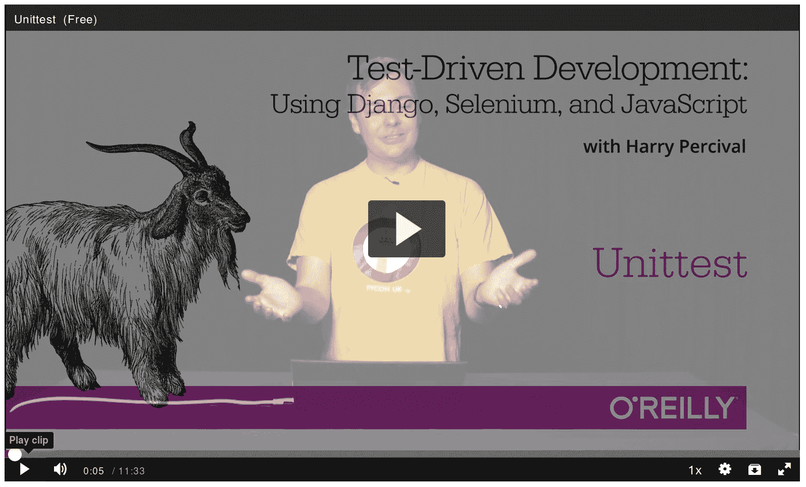

# 前言

这本书是我尝试与世界分享我从“黑客”到“软件工程师”的旅程。主要讲的是测试，但如你即将看到的，内容还有很多。

我想感谢你阅读它。

如果你购买了一本书，那么我非常感激。如果你正在阅读免费的在线版本，那么我仍然感激你决定把你的一些时间花在上面。谁知道，也许一旦你读完，你会觉得这本书足够好，值得为自己或朋友购买一本真实的复印件。

如果您有任何意见、问题或建议，我很乐意听取。您可以通过 obeythetestinggoat@gmail.com 直接联系我，或者在 Twitter 上找到我[@hjwp](https://www.twitter.com/hjwp)。您还可以查看[网站和我的博客](http://www.obeythetestinggoat.com)，以及[邮件列表](https://groups.google.com/forum/#!forum/obey-the-testing-goat-book)。

希望您阅读这本书能像我写作时的愉快一样愉快。

# 为什么我写了一本关于测试驱动开发的书

*`‘你是谁，你为什么写这本书，我为什么要读它？’*我听到你问。

在我的职业早期，我很幸运地加入了一群 TDD 狂热者，这对我的编程产生了巨大影响，我迫不及待地想与所有人分享。可以说我像一个新皈依者一样充满热情，学习经验对我来说仍然是个新鲜记忆，这就是为什么在 2014 年推出第一版的原因。

当我第一次学习 Python（来自 Mark Pilgrim 优秀的《*Dive Into Python*》）时，我接触到了 TDD 的概念，心想“是的，我完全能理解其中的道理。”或许当你第一次听说 TDD 时也有类似的反应？听起来是一个非常明智的方法，一种很好的习惯——就像定期用牙线清洁牙齿一样。

然后来了我的第一个大项目，你可以猜到发生了什么——有客户，有截止日期，有很多事情要做，对于 TDD 的任何良好意图都荡然无存。

实际上，一切都挺好。我也挺好。

起初。

起初，我知道我并不真的需要 TDD，因为那只是一个小网站，我可以通过手动检查来轻松测试是否有效。点击这个链接*这里*，选择那个下拉项*那里*，然后*这个*应该发生。简单。整个写测试的事情听起来好像要花*很久*的时间，而且，从我短短三周的成人编程经验中，我自认为是一个相当不错的程序员。我能搞定。很简单。

然后来了可怕的复杂女神。她很快向我展示了我的经验局限性。

项目逐渐扩展。系统的部分开始依赖于其他部分。我尽力遵循像 DRY（不要重复自己）这样的良好原则，但这只是引入了一些非常危险的领域。很快，我开始涉足多重继承。八层深的类层次结构。`eval`语句。

我开始害怕改动我的代码。我不再确定依赖关系，如果我改变了这里的代码，可能会发生什么，哦天啊，我想这部分可能继承自它——不，它不是，它被重写了。哦，但它依赖于那个类变量。好吧，只要我重写重写就应该没问题。我只是要检查一下——但是检查变得越来越困难。现在网站有很多部分，手动点击它们都开始变得不切实际。最好让一切继续如此，不再重构，只是将就着用。

不久后，我的代码变得混乱而丑陋。新的开发变得痛苦起来。

不久之后，我有幸在一个名叫 Resolver Systems（现在称为[PythonAnywhere](https://www.pythonanywhere.com)）的公司找到了一份工作，那里极限编程（XP）是常规。他们向我介绍了严格的 TDD。

尽管我的以前经验确实使我意识到自动化测试的可能好处，但我在每个阶段都拖延不前。“我的意思是，总体上测试可能是个好主意，但*真的吗*？所有这些测试？其中一些看起来完全是浪费时间…… 什么？功能测试*和*单元测试？得了吧，这也太过了！还有这个 TDD 的测试/最小代码更改/测试循环？这太愚蠢了！我们不需要这些步步为营！来吧，我们可以看到正确答案是什么，为什么不直接跳到结尾？”

相信我，我对每条规则都有过犹豫，我提出了每一个捷径，我要求对 TDD 每一个看似毫无意义的方面进行解释，最终我看到了其中的智慧。我不记得多少次想到“谢谢，测试”，因为一个功能测试揭示了一个我们永远不会预料到的回归，或者一个单元测试让我避免了一个非常愚蠢的逻辑错误。从心理上讲，这使得开发过程不再那么紧张。它生成的代码非常令人愉快地使用。

所以，让我告诉你*全部*关于它！

# 本书的目标

我的主要目标是传授一种方法论——一种进行 Web 开发的方式，我认为这能使 Web 应用更好，开发者更快乐。如果一本书只涵盖你通过 Google 可以找到的材料，那它就没什么意义，所以这本书不是 Python 语法指南，也不是 Web 开发教程*本身*。相反，我希望教你如何使用 TDD 更可靠地实现我们共同的神圣目标：*能运行的干净代码*。

话虽如此：我会不断地参考一个实际的实例，通过使用 Django、Selenium、jQuery 和 Mocks 等工具从头开始构建 Web 应用程序。我不假设读者对这些工具有任何先前的了解，所以你应该在本书的最后掌握这些工具的基本知识，以及 TDD 的方法论。

在极限编程中，我们总是成对编程，所以我想象自己写这本书，就像是和我的前任自己一起编程，需要解释工具的工作原理并回答为什么要以这种特定方式编码的问题。所以，如果我有时听起来有点自大，那是因为我并不是那么聪明，我必须对自己非常耐心。如果我听起来有点防守，那是因为我是那种总是与别人持不同意见的烦人人物，所以有时候我必须花费很多精力来说服自己接受任何事情。

# 大纲

我把这本书分成了三部分。

第 I 部分（章节 1–7）：基础知识

直接开始构建一个简单的 Web 应用程序，使用 TDD 进行。我们首先编写一个功能测试（使用 Selenium），然后逐步讲解 Django 的基础——模型、视图、模板——并在每个阶段都进行严格的单元测试。我还介绍了 Testing Goat。

第 II 部分（章节 8–[链接即将到来]）：Web 开发基础

涵盖了 Web 开发中一些更棘手但不可避免的方面，并展示了测试如何帮助我们处理这些问题：静态文件、部署到生产环境、表单数据验证、数据库迁移以及可怕的 JavaScript。

[链接即将到来]（章节 [链接即将到来]–[链接即将到来]）：更高级的测试主题

模拟、集成第三方系统、测试固件、Outside-In TDD 和持续集成（CI）。

继续进行一些日常事务…​

# 本书中使用的约定

本书使用以下排版约定：

*斜体*

表示新术语、URL、电子邮件地址、文件名和文件扩展名。

`固定宽度`

用于程序清单，以及在段落内引用程序元素，如变量或函数名、数据库、数据类型、环境变量、语句和关键字。

`**固定宽度加粗**`

显示用户应该按照字面意义输入的命令或其他文本。

偶尔我会使用符号：

```py
[...]
```

表示某些内容已被跳过，以缩短输出的长度，或跳转到相关部分。

###### 提示

此元素表示一个提示或建议。

###### 注意

此元素表示一般提示或旁注。

###### 警告

此元素表示警告或注意事项。

# 提交勘误

发现错误或错别字？本书的源代码可在 GitHub 上获取，我非常乐意接收问题和拉取请求：[*https://github.com/hjwp/Book-TDD-Web-Dev-Python/*](https://github.com/hjwp/Book-TDD-Web-Dev-Python/)。

# 使用代码示例

代码示例可在[*https://github.com/hjwp/book-example/*](https://github.com/hjwp/book-example/)找到；每章节有对应的分支（例如，[*https://github.com/hjwp/book-example/tree/chapter_unit_test_first_view*](https://github.com/hjwp/book-example/tree/chapter_unit_test_first_view)）。完整列表及有关使用此代码库的建议，详见[Link to Come]。

如果您有技术问题或在使用代码示例时遇到问题，请发送电子邮件至*support@oreilly.com*。

本书旨在帮助您完成工作任务。一般而言，如果本书提供示例代码，您可以在自己的程序和文档中使用它。除非您复制了大量代码片段，否则无需征得我们的许可。例如，编写一个使用本书中多个代码片段的程序无需许可。销售或分发 O’Reilly 书籍中的示例代码则需许可。引用本书回答问题并引用示例代码无需许可。将本书中大量示例代码整合到产品文档中需要许可。

我们感谢但不要求署名。通常的署名包括标题、作者、出版商和 ISBN。例如：“*Python 测试驱动开发*, 第 3 版，作者 Harry J.W. Percival（O’Reilly）。版权 2024 Harry Percival，978-1-098-14871-3。”

如果您认为您使用的示例代码超出了合理使用范围或上述许可，请随时通过*permissions@oreilly.com*与我们联系。

# O’Reilly 在线学习

###### 注意

40 多年来，[*O’Reilly Media*](https://oreilly.com)为企业提供技术和商业培训、知识和见解，帮助其取得成功。

我们独特的专家和创新者网络通过书籍、文章和在线学习平台分享他们的知识和专业知识。O’Reilly 的在线学习平台为您提供按需访问实时培训课程、深度学习路径、交互式编码环境以及来自 O’Reilly 和其他 200 多家出版商的大量文本和视频。更多信息，请访问[*https://oreilly.com*](https://oreilly.com)。

# 如何联系我们

请将有关本书的评论和问题发送至出版商：

+   O’Reilly Media, Inc.

+   1005 Gravenstein Highway North

+   加利福尼亚州塞巴斯托波尔 95472

+   800-889-8969（美国或加拿大）

+   707-829-7019（国际或本地）

+   707-829-0104（传真）

+   *support@oreilly.com*

+   [*https://www.oreilly.com/about/contact.xhtml*](https://www.oreilly.com/about/contact.xhtml)

我们为本书设有网页，列出勘误、示例及其他相关信息。请访问[*https://learning.oreilly.com/library/view/~/9781098148706*](https://learning.oreilly.com/library/view/~/9781098148706)。

获取有关我们的书籍和课程的新闻和信息，请访问[*https://oreilly.com*](https://oreilly.com)。

在 LinkedIn 上找到我们：[*https://linkedin.com/company/oreilly-media*](https://linkedin.com/company/oreilly-media)

关注我们的 Twitter：[*https://twitter.com/oreillymedia*](https://twitter.com/oreillymedia)

在 YouTube 上观看我们：[*https://youtube.com/oreillymedia*](https://youtube.com/oreillymedia)

# 免费版许可证

如果你正在阅读托管在[*http://www.obeythetestinggoat.com*](http://www.obeythetestinggoat.com)的免费版这本书，那么许可证是[知识共享 署名-非商业性使用-禁止演绎](https://creativecommons.org/licenses/by-nc-nd/4.0/legalcode) ¹。我要感谢 O’Reilly 对于许可证的积极态度，大多数出版商都没有这样的前瞻性。

我把这看作是一个“试读再购买”的计划。如果你正在阅读这本书是出于职业原因，我希望如果你喜欢它，你会购买一本——如果不是为了自己，那就为了朋友！O’Reilly 做得很棒，值得你的支持。你可以在[主页上找到购买链接](http://www.obeythetestinggoat.com/)。

¹（没有衍生条款是因为 O’Reilly 希望对衍生作品保持一定的控制，但他们经常允许这样的权限，所以如果你想基于这本书构建某些东西，不要犹豫，与他们联系。）

# 先决条件和假设

这是我对你的假设以及你已经知道的内容的概述，以及你需要在你的电脑上准备并安装哪些软件。

# Python 3 和编程

我尽量以初学者为考虑对象来写这本书，但是如果你是新手程序员，我假设你已经学会了 Python 的基础知识。所以如果你还没有，先跑一遍 Python 初学者教程或者获取一本介绍性的书籍，比如[*The Quick Python Book*](https://www.manning.com/books/the-quick-python-book-third-edition) 或 [*Think Python*](https://greenteapress.com/thinkpython/html/index.xhtml)，又或者，只是为了好玩，[*Invent Your Own Computer Games with Python*](https://inventwithpython.com/#invent)，它们都是很好的入门材料。

如果你是一位有经验的程序员，但是对 Python 还很陌生，你应该能够顺利进行。Python 简单易懂。

你应该能够在 Mac、Windows 或 Linux 上跟着这本书。每个操作系统的详细安装说明如下。

###### 提示

这本书是在 Python 3.11 上测试的。如果你使用的是早期版本，你会发现我的命令输出列表中的东西看起来有轻微的差异（例如，追踪不会有 `^^^^^^` 标记错误位置），所以最好是升级，如果可能的话。

如果你考虑使用 [PythonAnywhere](http://www.pythonanywhere.com) 而不是本地安装的 Python，则在开始之前你应该去快速看一下 [Link to Come]。

无论如何，我希望你能够访问 Python，并知道如何从命令行启动它，以及如何编辑一个 Python 文件并运行它。如果你有任何疑问，再次查看我之前推荐的三本书籍。

# HTML 的工作原理

我还假设你对网络的工作原理有基本的了解 —— HTML 是什么，什么是 POST 请求等等。如果你对这些不确定，你需要找一些基本的 HTML 教程；在[*http://www.webplatform.org/*](http://www.webplatform.org/)上有几个。如果你能够弄清楚如何在你的电脑上创建一个 HTML 页面并在浏览器中查看它，并理解表单是什么以及它可能是如何工作的，那么你可能已经没问题了。

# Django

本书使用 Django 框架，这可能是 Python 世界中最成熟的 Web 框架。我写这本书的时候假设读者对 Django 没有任何先前的了解，但是如果你是 Python 和 Web 开发的新手，并且对测试也不熟悉，你可能会偶尔发现有一些主题和概念太多了，难以掌握。如果是这样的话，我建议你暂时离开这本书，去看一看 Django 的教程。[DjangoGirls](https://tutorial.djangogirls.org/) 是我知道的最好的、最适合初学者的教程。官方教程也非常适合有经验的程序员。

# JavaScript

本书的后半部分有一点 JavaScript。如果您不了解 JavaScript，请直到那时不要担心，如果您发现自己有些困惑，我会在那时推荐一些指南。

继续阅读安装说明。

# 必要的软件安装

除了 Python，您还需要：

Firefox 网页浏览器

Selenium 实际上可以驱动任何主流浏览器，但我选择了 Firefox，因为它受企业利益的控制最少。

Git 版本控制系统

这适用于任何平台，地址为[*http://git-scm.com/*](http://git-scm.com/)。在 Windows 上，它附带了 *Bash* 命令行，这是本书所需的。请参阅 “Windows 注”。

一个包含 Python 3.11、Django 4.2 和 Selenium 4 的虚拟环境

Python 的 virtualenv 和 pip 工具现在与 Python 捆绑在一起（它们以前并不总是如此，所以这是一个大好消息）。接下来是准备虚拟环境的详细说明。

## 安装 Firefox

Firefox 可在 Windows 和 MacOS 上下载安装，地址为[*https://www.mozilla.org/firefox/*](https://www.mozilla.org/firefox/)。在 Linux 上，你可能已经安装了它，但如果没有的话，你可以通过包管理器安装。

确保您拥有最新版本，以便“geckodriver”浏览器自动化模块可用。

# 设置您的虚拟环境

Python 虚拟环境（简称虚拟环境）是您为不同 Python 项目设置环境的方式。它允许您在每个项目中使用不同的软件包（例如，不同版本的 Django，甚至不同版本的 Python）。由于您不是系统范围内安装软件，因此意味着您不需要 root 权限。

让我们创建一个虚拟环境。我假设您在一个名为 *goat-book* 的文件夹中工作，但您可以根据喜好命名您的工作文件夹。但请确保虚拟环境的名称为 “.venv”。

```py
$ cd goat-book
$ py -3.11 -m venv .venv
```

在 Windows 上，`py` 可执行文件是不同 Python 版本的快捷方式。在 Mac 或 Linux 上，我们使用 `python3.11`：

```py
$ cd goat-book
$ python3.11 -m venv .venv
```

## 激活和停用虚拟环境

每当您阅读本书时，都应确保您的虚拟环境已“激活”。您可以根据提示符中是否显示 `(.venv)` 来确定您的虚拟环境是否处于活动状态。但您也可以通过运行 `which python` 检查当前是否为系统安装的 Python，还是虚拟环境的 Python。

激活虚拟环境的命令是在 Windows 上执行 `source .venv/Scripts/activate`，在 Mac/Linux 上执行 `source .venv/bin/activate`。停用的命令只是 `deactivate`。

这样尝试一下：

```py
$ source .venv/Scripts/activate
(.venv)$
(.venv)$ which python
/C/Users/harry/goat-book/.venv/Scripts/python
(.venv)$ deactivate
$
$ which python
/c/Users/harry/AppData/Local/Programs/Python/Python311-32/python
```

```py
$ source .venv/bin/activate
(.venv)$
(.venv)$ which python
/home/myusername/goat-book/.venv/bin/python
(.venv)$ deactivate
$
$ which python
/usr/bin/python
```

###### 提示

在编写本书时，请始终确保您的虚拟环境处于活动状态。请注意您的提示符中是否有 `(.venv)`，或者运行 `which python` 进行检查。

## 安装 Django 和 Selenium

我们将安装 Django 4.2 和最新的 Selenium²。请确保你的虚拟环境已激活！

```py
(.venv) $ pip install "django<4.3" "selenium"
Collecting django<4.3
  Downloading Django-4.2-py3-none-any.whl (8.0 MB)
     ---------------------------------------- 8.1/8.1 MB 7.6 MB/s eta 0:00:00
Collecting selenium
  Downloading selenium-4.9.0-py3-none-any.whl (6.5 MB)
     ---------------------------------------- 6.5/6.5 MB 6.3 MB/s eta 0:00:00
Installing collected packages: django, selenium
Successfully installed [...] django-4.2 [...] selenium-4.9.0 [...]
```

检查是否正常工作：

```py
(.venv) $ python -c "from selenium import webdriver; webdriver.Firefox()"
```

这应该会弹出一个 Firefox 网页浏览器，你需要关闭它。

###### 小提示

如果你看到一个错误，你需要在继续之前进行调试。在 Linux/Ubuntu 上，我遇到了 [这个 bug](https://github.com/mozilla/geckodriver/issues/2010)，你需要通过设置一个名为 `TMPDIR` 的环境变量来修复它。

## 当你 *不可避免* 地无法激活你的虚拟环境时，你可能会看到一些错误信息。

如果你是虚拟环境的新手——或者坦白说，即使你不是——在某个时候你肯定会忘记激活它，然后你会盯着一个错误信息。这时我经常遇到。这里是一些需要注意的事项：

```py
ModuleNotFoundError: No module named 'selenium'
```

或者：

```py
ImportError: No module named django.core.management
```

一如既往，留意命令提示符中的 `(.venv)`，只需快速输入 `source .venv/Scripts/activate` 或 `source .venv/bin/activate`，就可能是你重新运行它所需要的。

这里还有更多的错误信息，作为参考：

```py
bash: .venv/Scripts/activate: No such file or directory
```

这意味着你当前不在项目的正确目录中。尝试 `cd goat-book` 或类似的命令。

或者，如果你确定自己在正确的位置，可能遇到了一个旧版 Python 的 bug，导致无法安装与 Git-Bash 兼容的激活脚本。重新安装 Python 3，确保你有 3.6.3 及以上版本，然后删除并重新创建你的虚拟环境。

如果你看到类似的情况，那很可能是同一个问题，你需要升级 Python：

```py
bash: @echo: command not found
bash: .venv/Scripts/activate.bat: line 4:
      syntax error near unexpected token `(
bash: .venv/Scripts/activate.bat: line 4: `if not defined PROMPT ('
```

最后一个！如果你看到这个：

```py
'source' is not recognized as an internal or external command,
operable program or batch file.
```

这是因为你启动了默认的 Windows 命令提示符 `cmd`，而不是 Git-Bash。关闭它并打开后者。

编码愉快！ 

###### 注意

这些说明对你不起作用吗？或者你有更好的建议？请联系：obeythetestinggoat@gmail.com!

¹ 不过我不会推荐通过 Homebrew 安装 Firefox：`brew` 会将 Firefox 二进制文件放在一个奇怪的位置，这会让 Selenium 感到困惑。你可以绕过这个问题，但直接以正常方式安装 Firefox 更简单。

² 你可能会想知道为什么我没有提到 Selenium 的特定版本。这是因为 Selenium 不断更新，以跟上网页浏览器的变化，并且由于我们无法将浏览器固定在特定版本，我们最好使用最新的 Selenium。写作时是版本 4.9。

# 伴随视频

我录制了一系列[包含本书的 10 集视频系列](https://learning.oreilly.com/videos/test-driven-development/9781491919163)。¹ 它涵盖了第 I 部分的内容。如果你发现通过视频材料学习效果更好，我鼓励你查看它。除了书中内容外，它还可以让你感受 TDD 的“流程”，在测试和代码之间切换，并解释我们的思考过程。

此外，我穿着一件可爱的黄色 T 恤。



¹ 这段视频尚未更新至第三版，但内容大致相同。

# 致谢

还有很多人要感谢，没有你们这本书将不会出现，或者会比现在更糟糕。

首先感谢“Greg”在$OTHER_PUBLISHER，你是第一个鼓励我相信这本书真的可以完成的人。尽管你的雇主在版权问题上持有过于保守的观点，我永远感激你对我的信任。

感谢 Michael Foord，另一位 Resolver Systems 的前员工，因为他自己写了一本书，给了我最初的灵感，并对这个项目给予了持续的支持。也感谢我的老板 Giles Thomas，因为他愚蠢地允许另一个员工写书（尽管我相信他现在已经修改了标准的雇佣合同，不允许写书）。也感谢你的智慧和引导我走上测试的道路。

感谢我的其他同事 Glenn Jones 和 Hansel Dunlop，你们是我宝贵的智囊团，感谢你们在过去一年里对我这个“单曲轨迹”的对话的耐心。

感谢我的妻子 Clementine，以及我的两个家庭，没有你们的支持和耐心，我是无法完成这本书的。对于在原本应该是值得纪念的家庭时光里，我把时间都花在电脑前，我感到非常抱歉。当初开始写这本书时，“闲暇时间写写，听起来很合理啊……”我根本不知道这本书会对我的生活有何影响。没有你们，我做不到这一切。

感谢我的技术审阅人员 Jonathan Hartley，Nicholas Tollervey 和 Emily Bache，谢谢你们的鼓励和宝贵的反馈。特别是 Emily，你实际上认真阅读了每一章节。对 Nick 和 Jon 表示部分认可，但依然要表达永恒的感激之情。有了你们在身边，整个过程变得不再孤单。没有你们，这本书将不过是一个白痴的胡言乱语。

感谢所有愿意花时间给予反馈的人，出于他们纯粹的善良：Gary Bernhardt，Mark Lavin，Matt O’Donnell，Michael Foord，Hynek Schlawack，Russell Keith-Magee，Andrew Godwin，Kenneth Reitz 和 Nathan Stocks。感谢你们比我聪明，并阻止我说出一些愚蠢的话。当然，这本书中依然有很多愚蠢的内容，完全不能让你们负责。

感谢我的编辑 Meghan Blanchette，你是一个非常友善和可爱的“驱使者”，感谢你在时间安排和抑制我一些愚蠢想法方面对这本书的帮助。感谢 O’Reilly 的所有其他人员，包括 Sarah Schneider，Kara Ebrahim 和 Dan Fauxsmith，让我继续使用英国英语。感谢 Charles Roumeliotis 在文体和语法方面的帮助。或许我们在芝加哥学派的引用/标点规则的优缺点上看法不同，但我真的很高兴有你在我身边。还要感谢设计部门为我们的封面提供了一只山羊！

特别感谢所有早期发行读者，感谢你们帮助找错字，提供反馈和建议，在书中帮助我们平滑学习曲线的方方面面，尤其是你们那些充满鼓励和支持的亲切话语。谢谢你，杰森·沃斯、戴夫·波森、杰夫·奥尔、凯文·德·巴尔、crainbf、dsisson、Galeran、迈克尔·艾伦、詹姆斯·奥唐纳、马雷克·图尔诺维克、SoonerBourne、朱尔兹、科迪·法尔默、威廉·文森特、特雷·亨纳、大卫·萨瑟、汤姆·帕金、索尔查·鲍勒、乔恩·波勒、查尔斯·夸斯特、悉达塔·内塔尼、史蒂夫·扬、罗杰·卡马戈、韦斯利·汉森、约翰森·克里斯汀·维尔米尔、伊恩·洛林、肖恩·罗伯逊、哈里·贾亚拉姆、拜亚德·兰德尔、康拉德·科日尔、马修·沃勒、朱利安·哈利、巴里·麦克伦登、西蒙·雅科比、安吉洛·科尔登、杰尔基·卡亚拉、马尼什·贾因、马哈德万·斯里尼瓦桑、康拉德·科日尔、德里克·克拉戈、科斯莫·史密斯、马库斯·凯默林、安德烈亚·科斯坦蒂尼、丹尼尔·帕特里克、瑞安·艾伦、杰森·塞尔比、格雷格·沃恩、乔纳森·桑德克维斯特、理查德·贝利、黛安·索因尼、戴尔·斯图尔特、马克·基顿、约翰·瑞利、拉法尔·西马尼斯基、罗尔·范德古特、伊格纳西奥·雷格罗、TJ·托尔顿、乔纳森·米恩斯、泰奥多尔·诺尔特、孟中洙、克雷格·库克、加布里埃尔·伊维拉扎鲁斯、文森佐·潘多尔福、大卫“farbish2”、尼科·科茨、丹尼尔·冈萨雷斯、赵赵亮及其他许多人。如果我错过了你的名字，你绝对有权感到委屈；我对你们感激不尽，所以请写信给我，我将尽力弥补。

最后感谢你，最新的读者，决定查看这本书！希望你喜欢它。

# 第二版额外感谢

感谢第二版的出色编辑南·巴伯和苏珊·康纳特，克里斯汀·布朗以及整个 O'Reilly 团队。再次感谢艾米丽和乔纳森进行技术审查，以及爱德华·王为其非常详尽的笔记。任何剩余的错误和不足都是我自己的责任。

还要感谢免费版的读者们，他们提供了评论、建议，甚至一些拉取请求。我肯定错过了这份名单上的一些人，所以如果你的名字不在这里，请原谅，但感谢埃姆雷·戈努拉特斯、耶稣·戈麦斯、乔丹·伯克、詹姆斯·埃文斯、伊恩·休斯顿、杰森·德维特、朗尼·雷尼、斯宾塞·奥格登、苏雷什·尼姆巴尔卡尔、达里乌斯、卡科、勒博德罗、杰夫、邓肯·贝茨、wasabigeek、joegnis、拉尔斯、穆斯塔法、贾里德、克雷格、索尔查、TJ、伊格纳西奥、罗埃尔、尤斯蒂娜、内森、安德烈亚、亚历山大、bilyanhadzhi、mosegontar、sfarzy、henziger、hunterji、das-g、juanriaza、GeoWill、Windsooon、gonulate、玛琪·罗斯韦尔、本·艾略特、拉姆齐·迈卡、彼得·J、1hx、Wi、邓肯·贝茨、马修·森科、内里克“卡苏”卡兹、多米尼克·斯科托及其他许多人。

# 第三版额外感谢

在撰写本文时，我们仅仅刚刚开始，但提前感谢我的编辑 Rita Fernando，以及感谢我的技术审阅人员 Csanad 和 David 无私地提供帮助！
