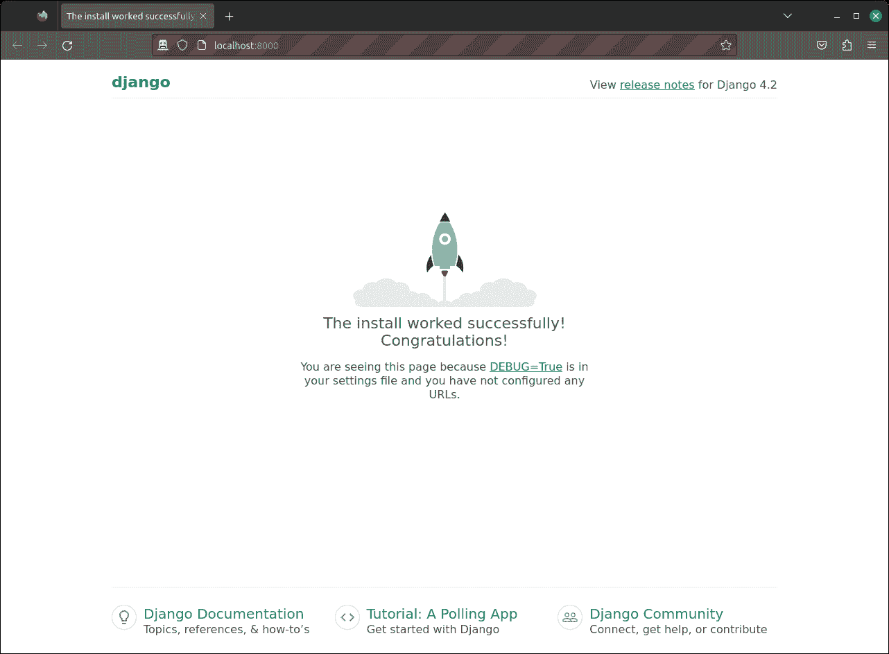
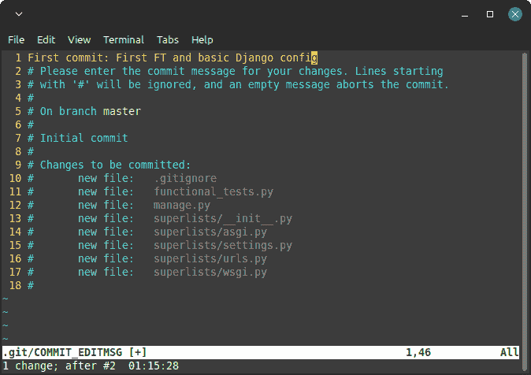

# 第一章. 使用功能测试设置 Django

TDD 并不是一种自然而然的事情。这是一种纪律，就像一种武术，就像功夫电影中一样，你需要一个脾气暴躁且不合理的师父来强迫你学习这种纪律。我们的师父就是测试山羊。

# 服从测试山羊！在没有测试之前什么也不要做

在 Python 测试社区中，测试山羊是 TDD 的非官方吉祥物¹。对不同的人来说，它可能有不同的含义，但对我来说，测试山羊是我脑海中的一种声音，它让我始终坚持测试的正确路径——就像卡通片中肩膀上出现的小天使或小恶魔一样，只是它关心的事情比较特别。我希望通过这本书，也能在你的脑海中种下测试山羊的种子。

所以，即使我们还不太确定它将要做什么，我们已决定要构建一个 Web 应用程序。通常，Web 开发的第一步是安装和配置您的 Web 框架。*下载这个，安装那个，配置另一个，运行脚本*……但是 TDD 需要一种不同的心态。当您在进行 TDD 时，您始终将测试山羊放在脑海中——像山羊一样专注——喊着“先测试，先测试！”

在 TDD 中，第一步总是一样的：*编写一个测试*。

*首先*我们编写测试；*然后*我们运行它并检查它是否按预期失败；*只有在此之后*我们才继续构建我们的应用程序。用山羊般的声音重复这句话。我知道我自己也是这么做的。

山羊的另一特点是它们一步一步地走。这就是为什么它们很少会从事物上掉下来的原因，无论事物有多陡。正如你在图 1-1 中所见。


###### 图 1-1\. 山羊比你想象的更灵活（来源：[Caitlin Stewart, on Flickr](http://www.flickr.com/photos/caitlinstewart/2846642630/)）

我们将采取良好的小步骤；我们将使用*Django*，这是一个流行的 Python Web 框架，来构建我们的应用程序。

我们要做的第一件事是检查我们是否已经安装了 Django，并且它已准备好供我们使用。我们将通过确认我们可以启动 Django 的开发服务器并实际看到它在我们的本地计算机上提供网页，来检查。我们将使用*Selenium*浏览器自动化工具来完成这项检查。

创建一个名为*functional_tests.py*的新 Python 文件，无论您希望将代码放在哪里，都可以输入以下代码。如果您在做这些事情时觉得发出几声山羊般的声音有帮助，那可能会有所帮助：

functional_tests.py

```py
from selenium import webdriver

browser = webdriver.Firefox()
browser.get("http://localhost:8000")

assert "Congratulations!" in browser.title
print("OK")
```

这是我们的第一个*功能测试*（FT）；稍后我会详细讨论我所说的功能测试，以及它们与单元测试的对比。目前，我们只需确保我们理解它在做什么即可。

+   启动 Selenium“webdriver”以弹出一个真正的 Firefox 浏览器窗口。

+   使用它来打开我们预期从本地计算机提供的网页。

+   检查（进行测试断言）页面的标题是否包含“Congratulations！”。

+   如果一切顺利，我们会打印 OK。

让我们试着运行它：

```py
$ python functional_tests.py
Traceback (most recent call last):
  File "...goat-book/functional_tests.py", line 4, in <module>
    browser.get("http://localhost:8000")
  File ".../selenium/webdriver/remote/webdriver.py", line 449, in get
    self.execute(Command.GET, {"url": url})
  File ".../selenium/webdriver/remote/webdriver.py", line 440, in execute
    self.error_handler.check_response(response)
  File ".../selenium/webdriver/remote/errorhandler.py", line 245, in
check_response
    raise exception_class(message, screen, stacktrace)
selenium.common.exceptions.WebDriverException: Message: Reached error page: abo
ut:neterror?e=connectionFailure&u=http%3A//localhost%3A8000/[...]
Stacktrace:
RemoteError@chrome://remote/content/shared/RemoteError.sys.mjs:8:8
WebDriverError@chrome://remote/content/shared/webdriver/Errors.sys.mjs:180:6
UnknownError@chrome://remote/content/shared/webdriver/Errors.sys.mjs:507:5
[...]
```

你应该看到一个浏览器窗口弹出并尝试打开*localhost:8000*，显示“无法连接”错误页面。如果你切回到控制台，会看到一个大而丑的错误消息，告诉我们 Selenium 遇到了错误页面。然后，你可能会因为它在桌面上留下了 Firefox 窗口而感到恼火。我们稍后会解决这个问题！

###### 注意

如果你在尝试导入 Selenium 时遇到错误，或者试图找到一个叫做“geckodriver”的东西时出错，可能需要回头再看一下“前提条件与假设”部分。

不过，目前我们有一个*失败的测试*，这意味着我们可以开始构建我们的应用程序了。

# 让 Django 启动和运行

既然你肯定已经阅读了“前提条件与假设”部分，你应该已经安装了 Django（对吧？）。让 Django 运行起来的第一步是创建一个*项目*，它将是我们站点的主要容器。Django 为此提供了一个小的命令行工具：

```py
$ django-admin startproject superlists .
```

别忘了结尾的那个“.”，它很重要！

这将在当前文件夹中创建一个名为*manage.py*的文件，以及一个名为*superlists*的子文件夹，其中包含更多内容：

```py
.
├── functional_tests.py
├── geckodriver.log
├── manage.py
└── superlists
    ├── __init__.py
    ├── asgi.py
    ├── settings.py
    ├── urls.py
    └── wsgi.py
```

###### 注意

确保你的项目文件夹看起来像这样！如果你看到两个嵌套的名为 superlists 的文件夹，那是因为你忘记了上面的“.”。删除它们，然后再试一次，否则路径和工作目录会造成很多混乱。

*superlists*文件夹用于适用于整个项目的东西—例如*settings.py*，它用于存储站点的全局配置信息。

但需要注意的主要事项是*manage.py*。这是 Django 的瑞士军刀之一，其中之一是运行开发服务器。让我们现在试试：

```py
$ python manage.py runserver
Watching for file changes with StatReloader
Performing system checks...

System check identified no issues (0 silenced).

You have 18 unapplied migration(s). Your project may not work properly until
you apply the migrations for app(s): admin, auth, contenttypes, sessions.
Run 'python manage.py migrate' to apply them.
March 17, 2023 - 18:07:30
Django version 4.2, using settings 'superlists.settings'
Starting development server at *http://127.0.0.1:8000/*
Quit the server with CONTROL-C.
```

那么，Django 的开发服务器现在在我们的机器上运行起来了。

###### 注意

目前可以忽略关于“未应用迁移”的消息。我们将在第五章中讨论迁移。

将其留在那里，并打开另一个命令行窗口。导航到你的项目文件夹，激活你的虚拟环境，然后再次尝试运行我们的测试：

```py
$ python functional_tests.py
OK
```

命令行上没有太多动作，但你应该注意两件事情：首先，没有出现难看的`AssertionError`，其次，Selenium 弹出的 Firefox 窗口上显示的页面看起来不同。

###### 提示

如果你看到一个错误提示“没有找到模块 selenium”，那么你可能忘记激活你的虚拟环境了。如果需要的话，再次检查“前提条件与假设”部分。

嗯，它可能看起来不起眼，但这是我们第一个通过的测试！万岁！

如果一切感觉有点像魔术，或者感觉不太真实，为什么不自己打开 Web 浏览器并手动访问*http://localhost:8000*来查看开发服务器呢？你应该会看到类似于图 1-2 的内容。

如果你愿意，你现在可以退出开发服务器，回到原始的 shell 界面，使用 Ctrl-C。



###### 图 1-2\. 它成功了！

# 开始一个 Git 仓库

在我们结束本章之前还有一件事要做：开始将我们的工作提交到版本控制系统（VCS）。如果你是一名经验丰富的程序员，你不需要听我说版本控制的重要性，但如果你是新手，请相信我，VCS 是必不可少的。一旦你的项目超过几周的时间并且代码超过几行，拥有一个工具可以查看旧版本的代码、恢复更改、安全地探索新想法，甚至只是作为备份……这是多么有用，简直无法言喻。测试驱动开发与版本控制密不可分，所以我希望确保你明白它在工作流程中的角色。

所以，我们的第一次提交！如果说有什么迟到的话，那真是有点晚了；我们使用*Git*作为我们的版本控制系统，因为它是最好的。

让我们从执行`git init`开始初始化仓库：

```py
$ ls
db.sqlite3  functional_tests.py  geckodriver.log  manage.py  superlists

$ git init .
Initialised empty Git repository in ...goat-book/.git/
```

现在让我们看看我们想要提交哪些文件：

```py
$ ls
db.sqlite3 functional_tests.py geckodriver.log manage.py superlists
```

这里有一些我们不希望纳入版本控制的东西：*db.sqlite3*是数据库文件，*geckodriver.log*包含 Selenium 的调试输出，最后我们的虚拟环境也不应该在 Git 中。我们将它们全部添加到一个名为*.gitignore*的特殊文件中，告诉 Git 忽略它们：

```py
$ echo "db.sqlite3" >> .gitignore
$ echo "geckodriver.log" >> .gitignore
$ echo ".venv" >> .gitignore
```

接下来我们可以添加当前文件夹“.”下的其余内容：

```py
$ git add .
$ git status
On branch main

No commits yet

Changes to be committed:
  (use "git rm --cached <file>..." to unstage)

        new file:   .gitignore
        new file:   functional_tests.py
        new file:   manage.py
        new file:   superlists/__init__.py
        new file:   superlists/__pycache__/__init__.cpython-311.pyc
        new file:   superlists/__pycache__/settings.cpython-311.pyc
        new file:   superlists/__pycache__/urls.cpython-311.pyc
        new file:   superlists/__pycache__/wsgi.cpython-311.pyc
        new file:   superlists/asgi.py
        new file:   superlists/settings.py
        new file:   superlists/urls.py
        new file:   superlists/wsgi.py
```

糟糕！我们这里有一堆*.pyc*文件；提交它们是毫无意义的。让我们从 Git 中移除它们并且也将它们加入*.gitignore*：

```py
$ git rm -r --cached superlists/__pycache__
rm 'superlists/__pycache__/__init__.cpython-311.pyc'
rm 'superlists/__pycache__/settings.cpython-311.pyc'
rm 'superlists/__pycache__/urls.cpython-311.pyc'
rm 'superlists/__pycache__/wsgi.cpython-311.pyc'
$ echo "__pycache__" >> .gitignore
$ echo "*.pyc" >> .gitignore
```

现在让我们看看我们的位置……

```py
$ git status
On branch main

Initial commit

Changes to be committed:
  (use "git rm --cached <file>..." to unstage)

        new file:   .gitignore
        new file:   functional_tests.py
        new file:   manage.py
        new file:   superlists/__init__.py
        new file:   superlists/asgi.py
        new file:   superlists/settings.py
        new file:   superlists/urls.py
        new file:   superlists/wsgi.py

Changes not staged for commit:
  (use "git add <file>..." to update what will be committed)
  (use "git restore <file>..." to discard changes in working directory)

        modified:   .gitignore
```

###### 提示

你会看到我经常使用`git status`——以至于我经常将它的别名设置为`git st`……不过，我不会告诉你如何做到这一点；我留给你自己去探索 Git 别名的秘密！

看起来不错——我们已经准备好做我们的第一次提交了！

```py
$ git add .gitignore
$ git commit
```

当你输入`git commit`时，它会弹出一个编辑窗口让你写提交消息。我的看起来像图 1-3。²



###### 图 1-3\. 第一次 Git 提交

###### 注意

如果你真的想深入了解 Git，现在是时候学习如何将你的工作推送到像 GitHub 或 GitLab 这样的基于云的版本控制系统托管服务了。如果你想在不同的电脑上跟着本书学习，这些服务将会很有用。我让你自己去了解它们是如何工作的；它们有很好的文档。或者，你可以等到[链接即将来临]时再用它们来部署。

VCS 讲座就到这里了。恭喜！你已经使用 Selenium 编写了一个功能测试，并且已经以一种可验证、测试驱动、羊认证的 TDD 方式安装并运行了 Django。在继续前往第二章之前，给自己一个当之无愧的鼓励。

¹ 这其实是一个来自 2010 年代中期 Pycon 的一个小段轻松笑话，我正在试图让它变成一件事情。

² 看到一个奇怪的基于终端的编辑器（可怕的 vim）突然弹出来，你不知道该怎么办？或者看到关于账户身份和`git config --global user.username`的消息？查看 Git 手册及其[基本配置部分。](http://git-scm.com/book/en/Customizing-Git-Git-Configuration) PS - 要退出 vim，按 Esc，然后输入`:q!`
