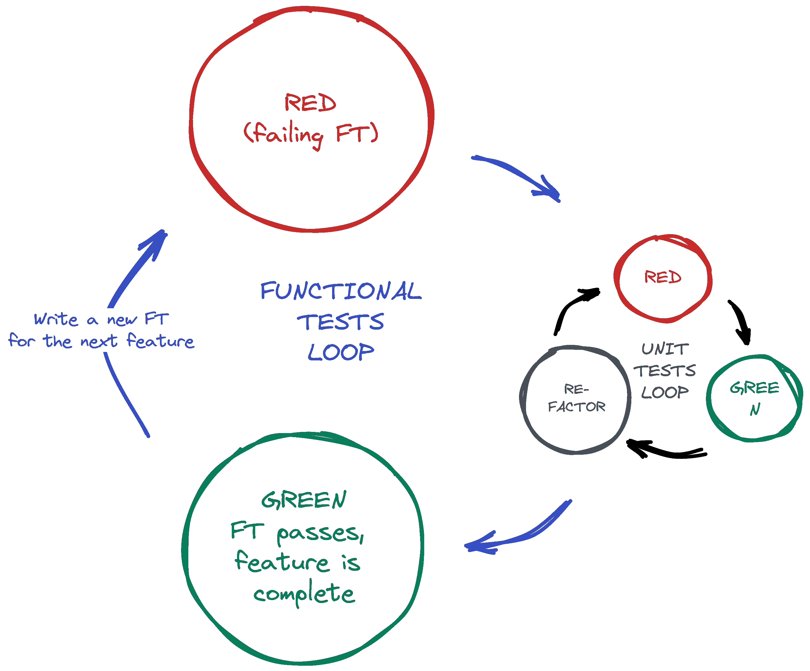

# 第四章：我们对所有这些测试究竟做了什么？（以及重构）

现在我们已经看到 TDD 的基础行动了，是时候暂停一下，谈谈我们为什么要这样做了。

我想象着你们中的一些，亲爱的读者，一直在忍受着一些愤怒和沮丧——也许你们中的一些之前进行过一些单元测试，也许你们中的一些只是匆忙之间。你们一直在忍耐着像这样的问题：

+   所有这些测试难道不是有点过多了吗？

+   当然，其中一些是多余的吗？功能测试和单元测试之间存在重复。

+   那些单元测试看起来太琐碎了——测试一个返回常量的单行函数！那不是在浪费时间吗？我们不应该把测试留给更复杂的事情吗？

+   那么在单元测试/编码周期中的所有这些微小变化呢？我们可以直接跳到最后吗？我的意思是，`home_page = None`！？真的吗？

+   你不是真的在生活中 *真的* 像这样编码吧？

啊，年轻的蚱蜢啊。我也曾经充满了这些问题。但只因为它们确实是好问题。事实上，我一直都在问自己这样的问题，时时刻刻。这些东西真的有价值吗？这是不是某种崇拜船运的表现？

# 编程就像是从井里提水一样

最终，编程是困难的。通常情况下，我们很聪明，所以我们成功了。TDD 在我们不那么聪明时帮了我们很多。Kent Beck（基本上发明了 TDD）用提水井中的水桶抽水的比喻来解释：当井不太深，水桶没有装满时，这很容易。即使开始时提起一个满满的水桶也相对容易。但是过了一会儿，你会感到疲倦。TDD 就像是一把棘轮，让你保存进度，这样你可以休息一下，并确保你永远不会倒退。

这样你就不必一直聪明到底了。


###### 图 4-1。测试所有东西（原始插图来源：[Allie Brosh, Hyperbole and a Half](http://bit.ly/1iXxdYp)）

好吧，也许 *总体上* 你愿意承认 TDD 是个好主意，但也许你仍然认为我做得过火了？测试最微小的东西，采取荒谬地多的小步骤？

TDD 是一种 *纪律*，这意味着它不是什么天生的技能；因为许多好处不是即刻显现的，而是长期的，你必须在当下强迫自己去做。这就是测试山羊形象想要表达的——你需要在这件事上有点固执。

现在，让我们回到正题。

# 使用 Selenium 进行用户交互测试

上一章末尾我们到了哪里？让我们重新运行测试看看：

```py
$ python functional_tests.py
F
======================================================================
FAIL: test_can_start_a_todo_list
(__main__.NewVisitorTest.test_can_start_a_todo_list)
 ---------------------------------------------------------------------
Traceback (most recent call last):
  File "...goat-book/functional_tests.py", line 21, in
test_can_start_a_todo_list
    self.fail("Finish the test!")
AssertionError: Finish the test!

 ---------------------------------------------------------------------
Ran 1 test in 1.609s

FAILED (failures=1)
```

你有没有试过，出现了 *问题加载页面* 或 *无法连接* 的错误？我也试过。那是因为我们忘记先用 `manage.py runserver` 启动开发服务器。做到这一点，你会得到我们需要的失败消息。

###### 注

TDD 的一个很棒的地方就是你永远不用担心忘记接下来要做什么—只需重新运行你的测试，它们会告诉你接下来需要做什么。

“完成测试”，它说，那我们就这样做吧！打开 *functional_tests.py*，我们将扩展我们的 FT：

functional_tests.py（ch04l001）

```py
from selenium import webdriver
from selenium.webdriver.common.by import By
from selenium.webdriver.common.keys import Keys
import time
import unittest

class NewVisitorTest(unittest.TestCase):
    def setUp(self):
        self.browser = webdriver.Firefox()

    def tearDown(self):
        self.browser.quit()

    def test_can_start_a_todo_list(self):
        # Edith has heard about a cool new online to-do app.
        # She goes to check out its homepage
        self.browser.get("http://localhost:8000")

        # She notices the page title and header mention to-do lists
        self.assertIn("To-Do", self.browser.title)
        header_text = self.browser.find_element(By.TAG_NAME, "h1").text  
        self.assertIn("To-Do", header_text)

        # She is invited to enter a to-do item straight away
        inputbox = self.browser.find_element(By.ID, "id_new_item")  
        self.assertEqual(inputbox.get_attribute("placeholder"), "Enter a to-do item")

        # She types "Buy peacock feathers" into a text box
        # (Edith's hobby is tying fly-fishing lures)
        inputbox.send_keys("Buy peacock feathers")  

        # When she hits enter, the page updates, and now the page lists
        # "1: Buy peacock feathers" as an item in a to-do list table
        inputbox.send_keys(Keys.ENTER)  
        time.sleep(1)  

        table = self.browser.find_element(By.ID, "id_list_table")
        rows = table.find_elements(By.TAG_NAME, "tr")  
        self.assertTrue(any(row.text == "1: Buy peacock feathers" for row in rows))

        # There is still a text box inviting her to add another item.
        # She enters "Use peacock feathers to make a fly"
        # (Edith is very methodical)
        self.fail("Finish the test!")

        # The page updates again, and now shows both items on her list
        [...]
```


我们正在使用 Selenium 提供的两种方法来检查网页：`find_element` 和 `find_elements`（注意额外的 `s`，这意味着它将返回多个元素而不仅仅是一个）。每一个都是使用 `By.SOMETHING` 参数化的，这让我们可以使用不同的 HTML 属性和属性来搜索。


我们还使用 `send_keys`，这是 Selenium 在输入元素上键入的方式。


`Keys` 类（不要忘记导入它）让我们发送像 Enter 这样的特殊键。¹


当我们按 Enter 键时，页面将刷新。 `time.sleep` 的作用是确保浏览器在我们对新页面进行任何断言之前已经加载完成。这称为“显式等待”（一个非常简单的等待方式；我们将在第六章中进行改进）。

###### 提示

注意 Selenium 的 `find_element()` 和 `find_elements()` 函数之间的区别。一个返回一个元素并在找不到时引发异常，而另一个返回一个可能为空的列表。

还有，看看那个 `any()` 函数。这是一个鲜为人知的 Python 内置函数。我甚至不需要解释它，对吧？Python 真是一种乐趣。²

###### 注意

如果你是我这些读者中的一个，不懂 Python，`any()` 函数内部发生了什么可能需要一些解释。基本语法是*列表推导式*，如果你还没学过，现在就应该去学了！ [Trey Hunner 的解释非常出色。](https://www.pythonmorsels.com/what-are-list-comprehensions/) 实际上，因为我们省略了方括号，所以我们实际上使用的是*生成器表达式*而不是列表推导式。了解这两者之间的区别可能不那么重要，但如果你感兴趣，可以看看[Guido 自己的这篇博客文章](http://python-history.blogspot.com/2010/06/from-list-comprehensions-to-generator.xhtml)来解释这两者的区别。

让我们看看它的表现：

```py
$ python functional_tests.py
[...]
selenium.common.exceptions.NoSuchElementException: Message: Unable to locate
element: h1
```

解码后，测试显示无法在页面上找到 `<h1>` 元素。让我们看看如何将其添加到我们主页的 HTML 中。

对功能测试进行大的更改通常是一个好主意。当我首次为本章编写代码时，我没有这样做，后来当我改变主意并且改变混合了一堆其他更改时，我后悔了。您的提交越原子化，越好：

```py
$ git diff  # should show changes to functional_tests.py
$ git commit -am "Functional test now checks we can input a to-do item"
```

# “不要测试常量”规则，以及模板的拯救

让我们来看看我们的单元测试，*lists/tests.py*。目前，我们正在寻找特定的 HTML 字符串，但这不是测试 HTML 的特别有效的方法。一般来说，单元测试的一个规则是*不要测试常量*，而测试 HTML 作为文本很像测试一个常量。

换句话说，如果你有一些代码，如下所示：

```py
wibble = 3
```

测试一个说法并没有多大意义：

```py
from myprogram import wibble
assert wibble == 3
```

单元测试实际上是关于测试逻辑、流控制和配置的。对我们的 HTML 字符串中确切字符序列进行断言并不能做到这一点。

其实并不*完全*那么简单，因为 HTML 毕竟也是代码，我们确实希望有一些东西来检查我们编写的代码是否有效，但这是我们功能测试的工作，而不是单元测试的工作。

无论如何，在 Python 中操纵原始字符串并不是处理 HTML 的好方法。有一个更好的解决方案，那就是使用模板。除此之外，如果我们能够将 HTML 保留在以*.xhtml*结尾的文件中，我们将获得更好的语法高亮！市面上有很多 Python 模板框架，而 Django 也有自己的模板框架，非常好用。让我们使用它。

## 重构以使用模板

我们现在想做的是使我们的视图函数返回完全相同的 HTML，但只是使用不同的过程。这就是重构——试图改进代码*而不改变其功能*。

最后一点非常重要。如果您在重构的同时尝试添加新功能，那么遇到问题的可能性要高得多。重构实际上是一门完整的学科，甚至有一本参考书：Martin Fowler 的[*Refactoring*](http://refactoring.com/)。

第一条规则是，在没有测试的情况下不能重构。幸运的是，我们正在进行 TDD，所以我们已经领先了。让我们检查一下我们的测试是否通过；它们将确保我们的重构保持行为不变：

```py
$ python manage.py test
[...]
OK
```

很棒！我们将从将 HTML 字符串放入自己的文件开始。创建一个名为*lists/templates*的目录以存放模板，并打开一个文件*lists/templates/home.xhtml*，将 HTML 转移到其中：³

lists/templates/home.xhtml（ch04l002）

```py
<html>
  <title>To-Do lists</title>
</html>
```

嗯，语法高亮……好多了！现在来修改我们的视图函数：

lists/views.py（ch04l003）

```py
from django.shortcuts import render

def home_page(request):
    return render(request, "home.xhtml")
```

现在我们不再构建自己的`HttpResponse`，而是使用 Django 的`render()`函数。它将请求作为其第一个参数（我们稍后会解释原因），并指定要渲染的模板的名称。Django 会自动搜索任何应用程序目录中名为 *templates* 的文件夹。然后它根据模板的内容为您构建一个`HttpResponse`。

###### 注意

模板是 Django 的一个非常强大的特性，其主要优势在于将 Python 变量替换为 HTML 文本。我们现在还没有使用这个功能，但在未来的章节中会用到。这就是为什么我们使用`render()`而不是手动使用内置的`open()`从磁盘读取文件。

让我们看看它是否有效：

```py
$ python manage.py test
[...]
======================================================================
ERROR: test_home_page_returns_correct_html
(lists.tests.HomePageTest.test_home_page_returns_correct_html)  
----------------------------------------------------------------------
Traceback (most recent call last):
  File "...goat-book/lists/tests.py", line 7, in test_home_page_returns_correct_html
    response = self.client.get("/")  
               ^^^^^^^^^^^^^^^^^^^^
[...]
  File "...goat-book/lists/views.py", line 4, in home_page
    return render(request, "home.xhtml")  
           ^^^^^^^^^^^^^^^^^^^^^^^^^^^^
  File ".../django/shortcuts.py", line 24, in render
    content = loader.render_to_string(template_name, context, request, using=using)
              ^^^^^^^^^^^^^^^^^^^^^^^^^^^^^^^^^^^^^^^^^^^^^^^^^^^^^^^^^^^^^^^^^^^^^
  File ".../django/template/loader.py", line 61, in render_to_string
    template = get_template(template_name, using=using)
               ^^^^^^^^^^^^^^^^^^^^^^^^^^^^^^^^^^^^^^^^
  File ".../django/template/loader.py", line 19, in get_template
    raise TemplateDoesNotExist(template_name, chain=chain)
django.template.exceptions.TemplateDoesNotExist: home.xhtml  

----------------------------------------------------------------------
Ran 1 test in 0.074s
```

又一次分析回溯的机会：


我们从错误开始：它找不到模板。


然后我们再次确认哪个测试失败了：果然，是我们对视图 HTML 的测试。


然后我们找到在测试中导致失败的行：当我们请求根 URL（“/”）时。


最后，我们寻找导致失败的自己应用代码的部分：就是当我们尝试调用`render`时。

那么为什么 Django 找不到模板呢？它就在应该在的地方，即*lists/templates*文件夹中。

问题在于我们尚未*正式*向 Django 注册我们的 lists 应用程序。不幸的是，只运行`startapp`命令并在项目文件夹中有明显的应用程序并不够。您必须告诉 Django 您*确实*是这样想的，并将其添加到*settings.py*中。加上腰带和裤子。打开它并查找一个名为`INSTALLED_APPS`的变量，我们将向其中添加`lists`：

superlists/settings.py（ch04l004）

```py
# Application definition

INSTALLED_APPS = [
    "django.contrib.admin",
    "django.contrib.auth",
    "django.contrib.contenttypes",
    "django.contrib.sessions",
    "django.contrib.messages",
    "django.contrib.staticfiles",
    "lists",
]
```

你可以看到默认已经有很多应用程序了。我们只需将我们的应用程序添加到列表底部即可。不要忘记最后的逗号—​它可能不是必需的，但有一天当你忘记它时，Python 会连接两行不同行的字符串…​

现在我们可以尝试再次运行测试：

```py
$ python manage.py test
[...]
OK
```

我们对代码的重构现在已经完成，而且测试表明我们对行为感到满意。现在我们可以修改测试，使其不再测试常量；相反，它们应该只检查我们是否渲染了正确的模板。

## 检查模板渲染

Django 测试客户端有一个方法，`assertTemplateUsed`，可以做我们想要的事情：

lists/tests.py（ch04l005）

```py
def test_home_page_returns_correct_html(self):
    response = self.client.get("/")
    self.assertContains(response, "<title>To-Do lists</title>")  
    self.assertContains(response, "<html>")
    self.assertContains(response, "</html>")
    self.assertTemplateUsed(response, "home.xhtml")  
```


我们现在先保留旧的测试，只是为了确保一切都按照我们的想法工作。


`.assertTemplateUsed`让我们检查用于渲染响应的模板（注：它仅适用于测试客户端检索到的响应）。

而且那个测试仍然通过：

```py
Ran 1 tests in 0.016s

OK
```

因为我总是对我没有见过失败的测试持怀疑态度，所以让我们故意破坏它一下：

lists/tests.py (ch04l006)

```py
self.assertTemplateUsed(response, "wrong.xhtml")
```

这样我们还会了解它的错误消息是什么样的：

```py
AssertionError: False is not true : Template 'wrong.xhtml' was not a template
used to render the response. Actual template(s) used: home.xhtml
```

这非常有帮助！让我们把断言改回正确的内容。顺便说一下，我们可以删除旧的断言，并给测试方法一个更具体的名称：

lists/tests.py (ch04l007)

```py
from django.test import TestCase

class HomePageTest(TestCase):
    def test_uses_home_template(self):
        response = self.client.get("/")
        self.assertTemplateUsed(response, "home.xhtml")
```

但主要的观点是，我们不是测试常量，而是测试我们的实现。太好了！

# 关于重构

那只是重构的一个绝对微不足道的例子。但正如肯特·贝克在《*测试驱动开发：通过示例学习*》中所说，“我推荐你真的要这样工作吗？不，我推荐你*能够*这样工作”。

实际上，当我写这篇文章时，我的第一反应是立即进行测试优先——直接使用`assertTemplateUsed`函数；删除三个多余的断言，只留下一个检查内容是否与预期渲染一致的断言；然后进行代码更改。但请注意，这实际上会给我留下破坏事物的空间：我本可以将模板定义为包含*任何*任意字符串，而不仅仅是具有正确的`<html>`和`<title>`标签的字符串。

###### 提示

在重构时，要么修改代码，要么修改测试，但不能同时进行。

总是有一种倾向，跳过几个步骤，一边重构一边进行一些行为调整，但很快你就会对半打不同的文件进行更改，完全失去自己的方向，并且什么都不再起作用。如果你不想像[重构猫](http://bit.ly/1iXyRt4)（图 4-2）那样结束，请坚持小步骤；完全将重构和功能更改分开。


###### 图 4-2\. 重构猫——确保查看完整的动画 GIF（来源：4GIFs.com）

###### 注意

在本书的过程中，我们还会再次遇到“重构猫”，作为我们过度沉迷于想要一次性改变太多事物时的一个例子。把它想象成测试山羊的小卡通恶魔对手，突然跳到你的另一只肩膀上，给出了不良建议。

在任何重构之后进行提交是个好主意：

```py
$ git status # see tests.py, views.py, settings.py, + new templates folder
$ git add .  # will also add the untracked templates folder
$ git diff --staged # review the changes we're about to commit
$ git commit -m "Refactor home page view to use a template"
```

# 我们前页的一点小进展

与此同时，我们的功能测试仍然失败。现在让我们进行实际的代码更改，使其通过。因为我们的 HTML 现在在模板中，所以可以随意进行更改，而不需要编写额外的单元测试。

###### 注意

这是 FT 和单元测试之间的另一个区别；由于 FT 使用真实的网络浏览器，我们将它们用作测试 UI 及其实现的 HTML 的主要工具。

因此，想要一个`<h1>`：

lists/templates/home.xhtml（ch04l008）

```py
<html>
  <head>
    <title>To-Do lists</title>
  </head>
  <body>
    <h1>Your To-Do list</h1>
  </body>
</html>
```

看看我们的功能测试是否稍微满意：

```py
selenium.common.exceptions.NoSuchElementException: Message: Unable to locate
element: [id="id_new_item"]
```

好的，让我们添加一个带有该 ID 的输入：

lists/templates/home.xhtml（ch04l009）

```py
  [...]
  <body>
    <h1>Your To-Do list</h1>
    <input id="id_new_item" />
  </body>
</html>
```

现在 FT 说什么？

```py
AssertionError: '' != 'Enter a to-do item'
```

我们添加我们的占位文本……

lists/templates/home.xhtml（ch04l010）

```py
    <input id="id_new_item" placeholder="Enter a to-do item" />
```

这给出了：

```py
selenium.common.exceptions.NoSuchElementException: Message: Unable to locate
element: [id="id_list_table"]
```

因此，我们可以继续将表格放在页面上。在这个阶段，它将是空的：

lists/templates/home.xhtml（ch04l011）

```py
    <input id="id_new_item" placeholder="Enter a to-do item" />
    <table id="id_list_table">
    </table>
  </body>
```

FT 怎么看？

```py
  File "...goat-book/functional_tests.py", line 40, in
test_can_start_a_todo_list
    self.assertTrue(any(row.text == "1: Buy peacock feathers" for row in rows))
AssertionError: False is not true
```

有点神秘！我们可以使用行号来跟踪它，原来是`any()`函数，我之前为此感到很自豪——或者更精确地说，是`assertTrue`，它没有非常明确的失败消息。在`unittest`中，我们可以将自定义错误消息作为参数传递给大多数`assertX`方法：

functional_tests.py（ch04l012）

```py
    self.assertTrue(
        any(row.text == "1: Buy peacock feathers" for row in rows),
        "New to-do item did not appear in table",
    )
```

如果您再次运行 FT，您应该会看到我们的帮助信息：

```py
AssertionError: False is not true : New to-do item did not appear in table
```

但是现在，为了使其通过，我们需要实际处理用户的表单提交。这是下一章的主题。

现在让我们进行一次提交：

```py
$ git diff
$ git commit -am "Front page HTML now generated from a template"
```

多亏了一点重构，我们已经设置好视图以渲染模板，停止了测试常量，并且现在很好地开始处理用户输入。

# 小结：TDD 过程

我们现在已经在实践中看到了 TDD 过程的所有主要方面：

+   功能测试

+   单元测试

+   单元测试/代码循环

+   重构

现在是时候做一点小结了，也许甚至是一些流程图（原谅我，我在管理顾问的岁月里荒废了。好的一面是，这些流程图将包含递归！）

整个 TDD 过程是什么样子？

+   我们编写一个测试。

+   我们运行测试，看到它失败。

+   我们编写一些最小的代码，使其进展一点。

+   我们重新运行测试，并重复直到通过（单元测试/代码循环）

+   然后，我们寻找重构我们的代码的机会，利用我们的测试来确保不会出现任何问题。

+   并从头再开始！

参见图 4-3。


###### 图 4-3。TDD 过程作为流程图，包括单元测试/代码循环

非常普遍地使用三个词*Red, Green, Refactor*来描述这个过程。见图 4-4。


###### 图 4-4。红色、绿色、重构

+   我们编写一个测试，并看到它失败（“Red”）。

+   我们在代码和测试之间循环，直到测试通过：“Green”。

+   然后，我们寻找重构的机会。

+   根据需要重复！

## 双重循环 TDD

但是当我们既有功能测试 *又有* 单元测试时，这又如何应用呢？嗯，你可以将功能测试看作是驱动同一循环的更高层版本，需要一个内部的红/绿/重构循环，以将功能测试从红色变为绿色；参见 图 4-5。



###### 图 4-5\. 双循环 TDD：内部和外部循环

当出现新的特性或业务需求时，我们编写一个新的（失败的）功能测试来捕获需求的高级视图。它可能不涵盖每一个边界情况，但应足以让我们放心事情在运行。

要让功能测试通过，我们接着进入更低层级的单元测试循环，组装所需的所有移动部件，为所有边界情况添加测试。每当我们在单元测试层面达到绿灯并进行重构时，我们可以回到功能测试层面，引导我们进行下一步工作。一旦两个层次都通过测试，我们可以进行额外的重构或处理边界情况。

我们将在接下来的章节中更详细地探讨这个工作流程的各个部分。

¹ 你也可以只使用字符串 `"\n"`，但 `Keys` 还让你发送像 Ctrl 这样的特殊键，所以我觉得有必要展示一下它。

² Python *确实* 非常有趣，但如果你认为我在这里有点自鸣得意，我也不怪你！事实上，我希望我能意识到这种自满感，并把它看作是我过于聪明的一个警示标志。在下一章中，你会看到我受到了惩罚。

³ 有些人喜欢使用另一个以应用程序命名的子文件夹（即 *lists/templates/lists*），然后将模板命名为 *lists/home.xhtml*。这被称为“模板命名空间”。我觉得对于这个小项目来说，这有点复杂了，但在大型项目上可能是值得的。在 [Django 教程](https://docs.djangoproject.com/en/4.2/intro/tutorial03/#write-views-that-actually-do-something) 中有更多内容。
