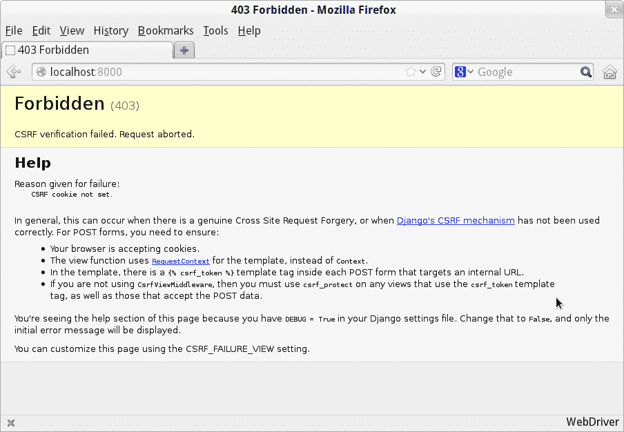
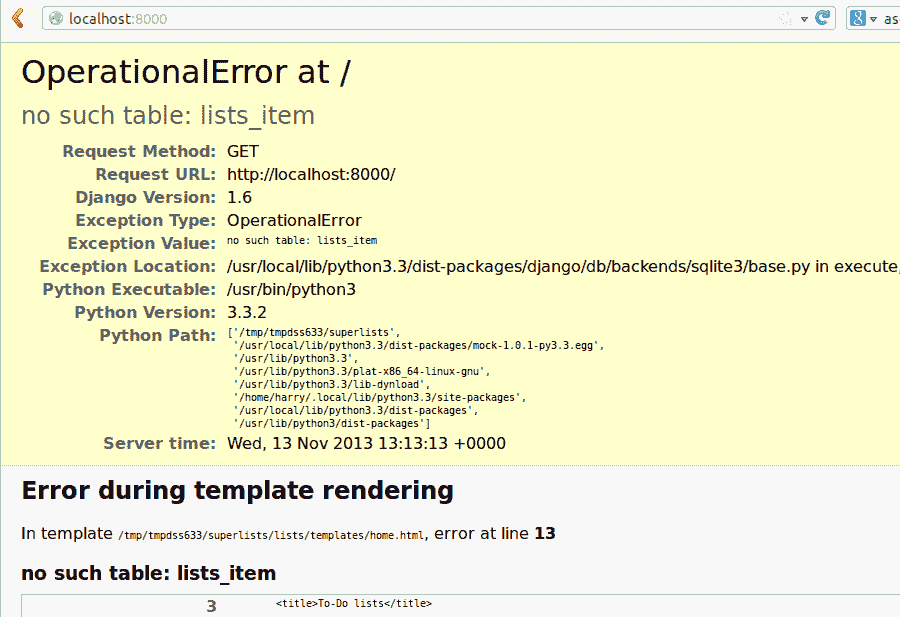
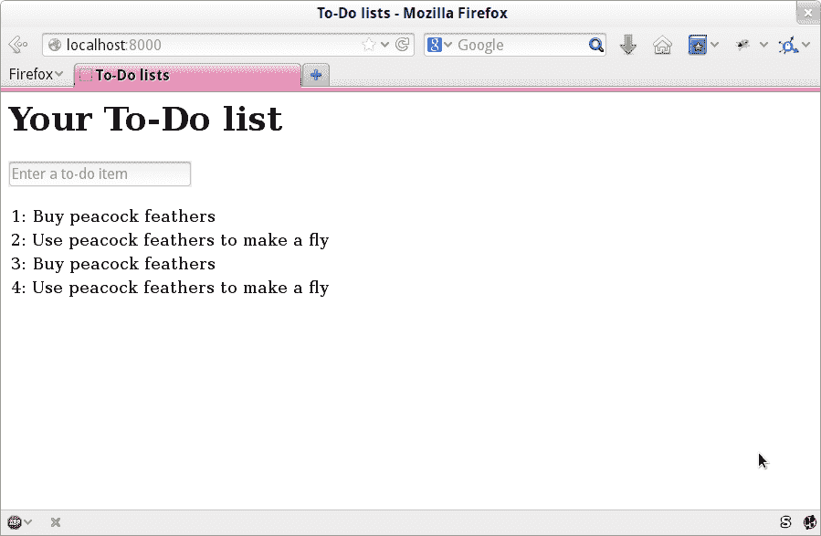

# 第五章。保存用户输入：测试数据库

到目前为止，我们已经成功返回了一个包含输入框的静态 HTML 页面。接下来，我们想要获取用户在输入框中输入的文本，并将其发送到服务器，以便我们稍后能够保存并显示给她。

第一次开始为这一章写代码时，我立即想要跳到我认为正确的设计：为列表和列表项创建多个数据库表，一堆不同的 URL 用于添加新的列表和项目，三个新的视图函数，以及大约半打新的单元测试。但我停了下来。虽然我相当确信自己足够聪明可以一次性解决所有这些问题，但 TDD 的要点是允许你在需要时一次只做一件事。所以我决定故意近视，在任何给定的时刻*只*做必要的事情，以使功能测试有所进展。

这将是一个演示如何支持增量、迭代式开发风格的 TDD 的例子——可能不是最快的路径，但你最终会到达¹。这有一个很好的附带好处，它允许我逐步引入新概念，如模型、处理 POST 请求、Django 模板标签等，*逐步引入*，而不是一次性抛给你。

这些都没有说你*不应该*试图提前思考和聪明。在下一章中，我们将使用更多的设计和前期思考，并展示它如何与 TDD 结合。但现在让我们继续盲目前行，只做测试告诉我们要做的事情。

# 将我们的表单连接到发送 POST 请求

在上一章的结束时，测试告诉我们我们无法保存用户的输入：

```py
  File "...goat-book/functional_tests.py", line 40, in
test_can_start_a_todo_list
[...]
AssertionError: False is not true : New to-do item did not appear in table
```

为了将其发送到服务器，目前我们将使用标准的 HTML POST 请求。有点无聊，但也简单易行——我们可以在书中后面使用各种性感的 HTML5 和 JavaScript。

要使我们的浏览器发送 POST 请求，我们需要做两件事：

1.  给 `<input>` 元素添加一个 `name=` 属性。

1.  用 `method="POST"` 将其包装在 `<form>` 标签内²。

让我们调整我们的模板在*lists/templates/home.xhtml*：

列表/模板/home.xhtml（ch05l001）

```py
    <h1>Your To-Do list</h1>
    <form method="POST">
      <input name="item_text" id="id_new_item" placeholder="Enter a to-do item" />
    </form>
    <table id="id_list_table">
```

现在，运行我们的功能测试会出现一个稍微神秘的意外错误：

```py
$ python functional_tests.py
[...]
Traceback (most recent call last):
  File "...goat-book/functional_tests.py", line 38, in
test_can_start_a_todo_list
    table = self.browser.find_element(By.ID, "id_list_table")
[...]
selenium.common.exceptions.NoSuchElementException: Message: Unable to locate
element: [id="id_list_table"]
```

天哪，我们现在在提交表单后，但在能够进行断言之前，正在失败两行*之前*。 Selenium 似乎无法找到我们的列表表格。为什么会这样？让我们再看看我们的代码：

functional_tests.py

```py
        # When she hits enter, the page updates, and now the page lists
        # "1: Buy peacock feathers" as an item in a to-do list table
        inputbox.send_keys(Keys.ENTER)
        time.sleep(1)

        table = self.browser.find_element(By.ID, "id_list_table")  
        rows = table.find_elements(By.TAG_NAME, "tr")
        self.assertTrue(
            any(row.text == "1: Buy peacock feathers" for row in rows),
            "New to-do item did not appear in table",
        )
```


我们的测试意外地在这一行失败。我们如何找出发生了什么？

# 调试功能测试

当功能测试因意外失败而失败时，我们可以采取几种方法来调试它：

+   添加 `print` 语句，例如显示当前页面文本是什么。

+   改进*错误消息*以显示有关当前状态的更多信息。

+   手动访问网站自己。

+   使用 `time.sleep` 在执行过程中暂停测试，以便您可以检查发生了什么事情。³

在本书的过程中，我们会详细查看所有这些内容，但 `time.sleep` 选项是在 FT 中出现这种错误时首先想到的选项。现在让我们试一试。

方便地，我们在错误发生之前已经有了一个延迟；让我们稍微延长一下：

functional_tests.py（ch05l003）

```py
    # When she hits enter, the page updates, and now the page lists
    # "1: Buy peacock feathers" as an item in a to-do list table
    inputbox.send_keys(Keys.ENTER)
    time.sleep(10)

    table = self.browser.find_element(By.ID, "id_list_table")
```

根据 Selenium 在您的 PC 上运行的速度，您可能已经一瞥过这个，但当我们再次运行功能测试时，我们有时间看看发生了什么：您应该看到一个看起来像 Figure 5-1 的页面，其中包含大量的 Django 调试信息。



###### 图 5-1\. 显示 CSRF 错误的 Django DEBUG 页面

Django 的 CSRF 保护涉及将一个小的自动生成的唯一令牌放入每个生成的表单中，以便能够验证 POST 请求确实来自服务器生成的表单。到目前为止，我们的模板一直是纯 HTML，在这一步中，我们首次使用了 Django 的模板魔法。为了添加 CSRF 令牌，我们使用了一个 *模板标记*，其具有花括号/百分号的语法，``——这对于是世界上最烦人的两个键触摸打字组合而闻名：

lists/templates/home.xhtml（ch05l004）

```py
  <form method="POST">
    <input name="item_text" id="id_new_item" placeholder="Enter a to-do item" />
    
  </form>
```

在渲染过程中，Django 将使用模板标记替换一个包含 CSRF 令牌的 `<input type="hidden">`。重新运行功能测试现在将使我们回到之前的（预期的）失败状态：

```py
  File "...goat-book/functional_tests.py", line 40, in
test_can_start_a_todo_list
[...]
AssertionError: False is not true : New to-do item did not appear in table
```

由于我们长时间的 `time.sleep` 仍然存在，测试将暂停在最终屏幕上，显示新项目文本在表单提交后消失，并且页面刷新显示空表单。这是因为我们还没有配置服务器来处理 POST 请求——它只是忽略它并显示正常的首页。

现在我们可以把我们正常的短 `time.sleep` 放回去了：

functional_tests.py（ch05l005）

```py
    # "1: Buy peacock feathers" as an item in a to-do list table
    inputbox.send_keys(Keys.ENTER)
    time.sleep(1)

    table = self.browser.find_element(By.ID, "id_list_table")
```

# 处理服务器上的 POST 请求

因为我们在表单中没有指定 `action=` 属性，它默认会提交回渲染时的同一 URL（即 `/`），由我们的 `home_page` 函数处理。目前这样也可以，让我们修改视图以处理 POST 请求。

这意味着需要为 `home_page` 视图编写一个新的单元测试。打开 *lists/tests.py*，并且在 `HomePageTest` 中添加一个新的方法：

lists/tests.py（ch05l006）

```py
class HomePageTest(TestCase):
    def test_uses_home_template(self):
        response = self.client.get("/")
        self.assertTemplateUsed(response, "home.xhtml")

    def test_can_save_a_POST_request(self):
        response = self.client.post("/", data={"item_text": "A new list item"})
        self.assertContains(response, "A new list item")
```

要执行 POST 请求，我们调用 `self.client.post`，正如您所见，它接受一个 `data` 参数，其中包含我们要发送的表单数据。然后我们检查来自我们的 POST 请求的文本最终出现在呈现的 HTML 中。这给了我们预期的失败：

```py
$ python manage.py test
[...]
AssertionError: False is not true : Couldn't find 'A new list item' in response
```

有点夸张的 TDD 风格，我们可以单一地做“可能有效的最简单的事情”来处理这个测试失败，也就是为 POST 请求添加一个 `if` 和一个新的代码路径，带有一个故意愚蠢的返回值：

lists/views.py（ch05l007）

```py
from django.http import HttpResponse
from django.shortcuts import render

def home_page(request):
    if request.method == "POST":
        return HttpResponse("You submitted: " + request.POST["item_text"])
    return render(request, "home.xhtml")
```

好的，这样可以让我们的单元测试通过，但实际上这并不是我们想要的。⁴

我们真正想做的是将 POST 提交添加到主页模板中的待办事项表中。

# 将 Python 变量传递到模板中进行渲染

我们已经有了一点线索，现在是时候开始了解 Django 模板语法的真正威力了，这是将变量从 Python 视图代码传递到 HTML 模板中的关键。

让我们首先看看模板语法如何让我们在模板中包含一个 Python 对象。符号是`{{ ... }}`，它将对象显示为字符串：

lists/templates/home.xhtml (ch05l008)

```py
<body>
  <h1>Your To-Do list</h1>
  <form method="POST">
    <input name="item_text" id="id_new_item" placeholder="Enter a to-do item" />  </form>
  <table id="id_list_table">
    <tr><td>{{ new_item_text }}</td></tr>  
  </table>
</body>
```


这是我们的模板变量。`new_item_text`将是我们在模板中显示的用户输入的变量名。

让我们调整我们的单元测试，以检查我们是否仍在使用模板：

lists/tests.py (ch05l009)

```py
    def test_can_save_a_POST_request(self):
        response = self.client.post("/", data={"item_text": "A new list item"})
        self.assertContains(response, "A new list item")
        self.assertTemplateUsed(response, "home.xhtml")
```

而且这将如预期地失败：

```py
AssertionError: No templates used to render the response
```

很好，我们故意愚弄的返回值现在不再蒙混我们的测试，所以我们可以重新编写我们的视图，并告诉它将 POST 参数传递给模板。`render`函数的第三个参数是一个字典，它将模板变量名映射到它们的值。

理论上，我们可以将其用于 POST 情况以及默认的 GET 情况，所以让我们删除`if request.method == "POST"`并简化我们的视图：

lists/views.py (ch05l010)

```py
def home_page(request):
    return render(
        request,
        "home.xhtml",
        {"new_item_text": request.POST["item_text"]},
    )
```

测试认为什么？

```py
ERROR: test_uses_home_template
(lists.tests.HomePageTest.test_uses_home_template)

[...]
    {"new_item_text": request.POST["item_text"]},
                      ~~~~~~~~~~~~^^^^^^^^^^^^^
[...]
django.utils.datastructures.MultiValueDictKeyError: 'item_text'
```

## 一个意外的失败

糟糕，一个*意外的失败*。

如果你记得阅读跟踪 back 的规则，你会发现实际上是*不同*的测试失败了。我们确实让我们正在处理的实际测试通过了，但单元测试却发现了一个意外的后果，即一个回归：我们打破了没有 POST 请求路径的代码。

这就是进行测试的全部意义。是的，也许我们可以预料到会发生这种情况，但想象一下，如果我们当时心情不好或者注意力不集中：我们的测试刚刚帮我们避免了意外地破坏我们的应用程序，并且因为我们使用了 TDD，我们立即发现了问题。我们不需要等待质量保证团队的检查，也不需要切换到网页浏览器并手动点击我们的网站，我们可以立即着手修复它。具体方法如下：

lists/views.py (ch05l011)

```py
def home_page(request):
    return render(
        request,
        "home.xhtml",
        {"new_item_text": request.POST.get("item_text", "")},
    )
```

我们使用[`dict.get`](http://docs.python.org/3/library/stdtypes.xhtml#dict.get)提供一个默认值，用于处理普通的 GET 请求时 POST 字典为空的情况。

现在应该通过单元测试了。让我们看看功能测试的反应：

```py
AssertionError: False is not true : New to-do item did not appear in table
```

###### 小贴士

如果你的功能测试在这一点或本章的任何时候显示不同的错误，并且抱怨`StaleElementReferenceException`，可能需要增加`time.sleep`显式等待时间——尝试 2 或 3 秒而不是 1；然后继续阅读下一章，找到一个更加稳健的解决方案。

嗯，不是一个非常有帮助的错误。让我们使用另一种我们的功能测试调试技术：改进错误消息。这可能是最有建设性的技术，因为这些改进的错误消息会继续帮助调试任何未来的错误：

functional_tests.py (ch05l012)

```py
self.assertTrue(
    any(row.text == "1: Buy peacock feathers" for row in rows),
    f"New to-do item did not appear in table. Contents were:\n{table.text}",
)
```

这样我们就得到了一个更有帮助的错误消息：

```py
AssertionError: False is not true : New to-do item did not appear in table.
Contents were:
Buy peacock feathers
```

实际上，你知道更好的是什么吗？让那个断言少聪明点！正如你可能从第四章中记得的那样，我为使用`any()`函数感到非常满意，但我的早期版本读者之一（谢谢，Jason！）建议了一个更简单的实现。我们可以用单个`assertIn`替换所有四行的`assertTrue`：

functional_tests.py (ch05l013)

```py
    self.assertIn("1: Buy peacock feathers", [row.text for row in rows])
```

好多了。每当你觉得自己很聪明时，你应该非常担心，因为你可能只是*过于复杂化*。

现在我们免费得到了错误消息：

```py
    self.assertIn("1: Buy peacock feathers", [row.text for row in rows])
AssertionError: '1: Buy peacock feathers' not found in ['Buy peacock feathers']
```

让我适当地反省一下。

###### 提示

如果相反，你的功能测试似乎在说表格为空（“not found in ['']”），检查你的`<input>`标签——它是否有正确的`name="item_text"`属性？它是否有`method="POST"`？如果没有，用户的输入将不会放在`request.POST`的正确位置。

关键是功能测试希望我们以“1:”开头列举列表项。

最快的方法是通过另一个快速的“作弊”更改模板来使其通过：

lists/templates/home.xhtml (ch05l014)

```py
    <tr><td>1: {{ new_item_text }}</td></tr>
```

现在我们来到了`self.fail('Finish the test!')`。如果去掉这个并完成我们的功能测试，添加检查将第二个项目添加到表格中（复制粘贴是我们的朋友），我们开始看到我们的第一次尝试解决方案真的行不通：

functional_tests.py (ch05l015)

```py
    # There is still a text box inviting her to add another item.
    # She enters "Use peacock feathers to make a fly"
    # (Edith is very methodical)
    inputbox = self.browser.find_element(By.ID, "id_new_item")
    inputbox.send_keys("Use peacock feathers to make a fly")
    inputbox.send_keys(Keys.ENTER)
    time.sleep(1)

    # The page updates again, and now shows both items on her list
    table = self.browser.find_element(By.ID, "id_list_table")
    rows = table.find_elements(By.TAG_NAME, "tr")
    self.assertIn(
        "1: Buy peacock feathers",
        [row.text for row in rows],
    )
    self.assertIn(
        "2: Use peacock feathers to make a fly",
        [row.text for row in rows],
    )

    # Satisfied, she goes back to sleep
```

确实，功能测试返回了一个错误：

```py
AssertionError: '1: Buy peacock feathers' not found in ['1: Use peacock
feathers to make a fly']
```

# 三次重复就重构

但在我们继续之前——在这个功能测试中有一个糟糕的*代码异味*⁵。我们有三个几乎相同的代码块，检查列表表中的新项目。当我们想要应用 DRY 原则时，我喜欢遵循“三次重复就重构”的口头禅。你可以复制粘贴代码一次，也许试图消除它带来的重复性有点过早，但一旦出现三次，就是时候整理了。

让我们从目前为止的内容开始提交。尽管我们知道我们的网站有一个主要缺陷——它只能处理一个列表项——但它仍然比以前进步了。我们可能需要重写所有内容，也可能不需要，但规则是在进行任何重构之前，始终先提交：

```py
$ git diff
# should show changes to functional_tests.py, home.xhtml,
# tests.py and views.py
$ git commit -a
```

###### 提示

在进行重构之前，一定要进行提交。

进入我们的功能测试重构：让我们使用一个辅助方法——记住，只有以`test_`开头的方法才会作为测试运行，所以你可以使用其他方法来达到你的目的：

functional_tests.py (ch05l016)

```py
    def tearDown(self):
        self.browser.quit()

    def check_for_row_in_list_table(self, row_text):
        table = self.browser.find_element(By.ID, "id_list_table")
        rows = table.find_elements(By.TAG_NAME, "tr")
        self.assertIn(row_text, [row.text for row in rows])

    def test_can_start_a_todo_list(self):
        [...]
```

我喜欢把辅助方法放在类的顶部，`tearDown`和第一个测试之间。让我们在功能测试中使用它：

functional_tests.py（ch05l017）

```py
    # When she hits enter, the page updates, and now the page lists
    # "1: Buy peacock feathers" as an item in a to-do list table
    inputbox.send_keys(Keys.ENTER)
    time.sleep(1)
    self.check_for_row_in_list_table("1: Buy peacock feathers")

    # There is still a text box inviting her to add another item.
    # She enters "Use peacock feathers to make a fly"
    # (Edith is very methodical)
    inputbox = self.browser.find_element(By.ID, "id_new_item")
    inputbox.send_keys("Use peacock feathers to make a fly")
    inputbox.send_keys(Keys.ENTER)
    time.sleep(1)

    # The page updates again, and now shows both items on her list
    self.check_for_row_in_list_table("1: Buy peacock feathers")
    self.check_for_row_in_list_table("2: Use peacock feathers to make a fly")

    # Satisfied, she goes back to sleep
```

我们再次运行 FT 来检查它是否仍然以相同的方式运行...​

```py
AssertionError: '1: Buy peacock feathers' not found in ['1: Use peacock
feathers to make a fly']
```

很好。现在我们可以将 FT 重构为其自己的小型原子更改：

```py
$ git diff # check the changes to functional_tests.py
$ git commit -a
```

回到工作。如果我们要处理多个列表项，我们将需要某种持久化方法，而数据库在这一领域中是一个可靠的解决方案。

# Django ORM 和我们的第一个模型

对象关系映射器（ORM）是一个用于处理数据库中表、行和列数据的抽象层。它让我们使用熟悉的面向对象的隐喻来处理数据库，这些隐喻与代码很好地配合。类映射到数据库表，属性映射到列，类的一个实例表示数据库中的一行数据。

Django 提供了一个出色的 ORM，编写使用它的单元测试实际上是学习它的一个绝佳方法，因为它通过指定我们希望它如何工作来练习代码。

让我们在*lists/tests.py*中创建一个新类：

lists/tests.py（ch05l018）

```py
from django.test import TestCase
from lists.models import Item

class HomePageTest(TestCase):
    [...]

class ItemModelTest(TestCase):
    def test_saving_and_retrieving_items(self):
        first_item = Item()
        first_item.text = "The first (ever) list item"
        first_item.save()

        second_item = Item()
        second_item.text = "Item the second"
        second_item.save()

        saved_items = Item.objects.all()
        self.assertEqual(saved_items.count(), 2)

        first_saved_item = saved_items[0]
        second_saved_item = saved_items[1]
        self.assertEqual(first_saved_item.text, "The first (ever) list item")
        self.assertEqual(second_saved_item.text, "Item the second")
```

你可以看到，在数据库中创建新记录相对来说是一件相当简单的事情，只需创建一个对象，分配一些属性，并调用`.save()`函数。Django 还为我们提供了一个通过类属性`.objects`查询数据库的 API，我们使用最简单的查询`.all()`，它检索该表的所有记录。结果作为一个称为`QuerySet`的类似列表的对象返回，我们可以从中提取单个对象，并调用更多函数，如`.count()`。然后，我们检查保存到数据库中的对象，以确认是否保存了正确的信息。

Django 的 ORM 具有许多其他有用且直观的功能；现在可能是浏览[Django 教程](https://docs.djangoproject.com/en/4.2/intro/tutorial01/)的好时机，该教程对这些功能进行了很好的介绍。

###### 注意

我已经以非常冗长的风格编写了这个单元测试，作为介绍 Django ORM 的一种方式。我不建议在“现实生活”中像这样编写模型测试，因为这是在测试框架，而不是测试我们自己的代码。我们实际上将重写这个测试，使其在[待定链接]（具体来说，在[待定链接]）上更加简洁。

让我们尝试运行单元测试。这里又来了另一个单元测试/代码循环：

```py
ImportError: cannot import name 'Item' from 'lists.models'
```

非常好，让我们从*lists/models.py*中给它一些要导入的东西。我们感到很有信心，所以我们将跳过`Item = None`步骤，直接创建一个类：

lists/models.py（ch05l019）

```py
from django.db import models

# Create your models here.
class Item:
    pass
```

这使我们的测试达到了如下程度：

```py
[...]
  File "...goat-book/lists/tests.py", line 20, in
test_saving_and_retrieving_items
    first_item.save()
    ^^^^^^^^^^^^^^^
AttributeError: 'Item' object has no attribute 'save'
```

为了给我们的`Item`类添加一个`save`方法，并使其成为一个真正的 Django 模型，我们让它继承自`Model`类：

lists/models.py（ch05l020）

```py
from django.db import models

class Item(models.Model):
    pass
```

## 我们的第一个数据库迁移

接下来发生的事情是一个非常长的回溯，简而言之，与数据库有问题：

```py
django.db.utils.OperationalError: no such table: lists_item
```

在 Django 中，ORM 的工作是对数据库表进行建模、读写，但有一个第二系统负责*创建*数据库中的表，称为“迁移”。它的工作是允许你根据对 *models.py* 文件的更改，添加、删除和修改表和列。

一种思考的方式是把它看作是数据库的版本控制系统。正如我们稍后将看到的，当我们需要升级部署在实时服务器上的数据库时，它特别有用。

目前我们只需要知道如何建立我们的第一个数据库迁移，我们使用 `makemigrations` 命令来做到这一点：⁶

```py
$ python manage.py makemigrations
Migrations for 'lists':
  lists/migrations/0001_initial.py
    - Create model Item
$ ls lists/migrations
0001_initial.py  __init__.py  __pycache__
```

如果你感兴趣，你可以去查看迁移文件，你会看到它是对我们在 *models.py* 中增加内容的表示。

与此同时，我们应该发现我们的测试可以进一步进行。

## 测试实际上进展得相当顺利

测试实际上进展得相当顺利：

```py
$ python manage.py test
[...]
    self.assertEqual(first_saved_item.text, "The first (ever) list item")
                     ^^^^^^^^^^^^^^^^^^^^^
AttributeError: 'Item' object has no attribute 'text'
```

这比上次失败晚了整整八行——我们已经完全保存了两个 `Item`，并检查它们是否保存在数据库中，但 Django 似乎并没有“记住”`.text` 属性。

如果你是 Python 新手，也许会对我们被允许分配 `.text` 属性感到惊讶。在像 Java 这样的语言中，你可能会得到一个编译错误。Python 更加宽松。

从 `models.Model` 继承的类映射到数据库中的表。默认情况下，它们会得到一个自动生成的 `id` 属性，这将是数据库中的主键列⁷，但你必须显式定义任何其他列和属性；这是我们如何设置文本列的方式：

lists/models.py (ch05l022)

```py
class Item(models.Model):
    text = models.TextField()
```

Django 还有许多其他字段类型，如 `IntegerField`、`CharField`、`DateField` 等等。我选择了 `TextField` 而不是 `CharField`，因为后者在这一点上需要长度限制，这似乎是任意的。你可以在 Django [教程](https://docs.djangoproject.com/en/4.2/intro/tutorial02/#creating-models) 和 [文档](https://docs.djangoproject.com/en/4.2/ref/models/fields/) 中了解更多关于字段类型的信息。

## 新字段意味着新迁移

运行测试会给我们带来另一个数据库错误：

```py
django.db.utils.OperationalError: table lists_item has no column named text
```

这是因为我们向数据库添加了另一个新字段，这意味着我们需要创建另一个迁移。很高兴我们的测试告诉我们！

让我们试一下：

```py
$ python manage.py makemigrations
It is impossible to add a non-nullable field 'text' to item without specifying
a default. This is because the database needs something to populate existing
rows.
Please select a fix:
 1) Provide a one-off default now (will be set on all existing rows with a null
value for this column)
 2) Quit and manually define a default value in models.py.
Select an option:2
```

啊。它不允许我们添加没有默认值的列。让我们选择选项 2，在 *models.py* 中设置一个默认值。我认为你会发现语法相当不难理解：

lists/models.py (ch05l023)

```py
class Item(models.Model):
    text = models.TextField(default="")
```

现在迁移应该已经完成了：

```py
$ python manage.py makemigrations
Migrations for 'lists':
  lists/migrations/0002_item_text.py
    - Add field text to item
```

因此，在 *models.py* 中新增两行，两个数据库迁移，因此，我们的模型对象上的 `.text` 属性现在被识别为特殊属性，因此它确实保存到数据库中，并且测试通过……

```py
$ python manage.py test
[...]

Ran 3 tests in 0.010s
OK
```

让我们为我们的第一个模型进行提交！

```py
$ git status # see tests.py, models.py, and 2 untracked migrations
$ git diff # review changes to tests.py and models.py
$ git add lists
$ git commit -m "Model for list Items and associated migration"
```

# 将 POST 保存到数据库

让我们调整我们首页的 POST 请求测试，并说我们希望视图将一个新项目保存到数据库中，而不仅仅是将其传递到其响应中。我们可以通过在现有测试`test_can_save_a_POST_request`中添加三行来实现：

lists/tests.py (ch05l025)

```py
def test_can_save_a_POST_request(self):
    response = self.client.post("/", data={"item_text": "A new list item"})

    self.assertEqual(Item.objects.count(), 1)  
    new_item = Item.objects.first()  
    self.assertEqual(new_item.text, "A new list item")  

    self.assertContains(response, "A new list item")
    self.assertTemplateUsed(response, "home.xhtml")
```


我们检查数据库中是否保存了一个新的`Item`。`objects.count()`是`objects.all().count()`的简写。


`objects.first()` 相当于 `objects.all()[0]`。


我们检查项目的文本是否正确。

这个测试变得有点冗长了。它似乎在测试很多不同的东西。这是另一个*代码异味*——一个冗长的单元测试要么需要拆分成两个，要么可能表明你正在测试的东西太复杂了。让我们把它加到我们自己的待办事项清单上，或许在一张废纸上：

把它写在这样一个废纸上让我们放心不会忘记，所以我们可以舒心地回到我们正在处理的事情上。我们重新运行测试，看到了一个预期的失败：

```py
    self.assertEqual(Item.objects.count(), 1)
AssertionError: 0 != 1
```

让我们调整我们的视图：

lists/views.py (ch05l026)

```py
from django.shortcuts import render
from lists.models import Item

def home_page(request):
    item = Item()
    item.text = request.POST.get("item_text", "")
    item.save()

    return render(
        request,
        "home.xhtml",
        {"new_item_text": request.POST.get("item_text", "")},
    )
```

我编写了一个非常天真的解决方案，你可能已经发现了一个非常明显的问题，那就是我们将会在每次请求首页时保存空项目。让我们把它加到我们稍后要修复的事情清单上。你知道，还有一个非常显而易见的事实，我们目前根本没有办法为不同的人保存不同的列表。我们暂时忽略这一点。

记住，我并不是说在“现实生活”中你应该总是忽视这样的显而易见的问题。每当我们提前发现问题时，就需要做出判断，是停下手头的工作重新开始，还是留到以后再解决。有时候完成手头的工作仍然是值得的，有时候问题可能太严重需要停下来重新思考。

让我们看看单元测试进行得如何……

```py
Ran 3 tests in 0.010s

OK
```

它们通过了！很好。让我们来看看我们的废纸。我已经加了几件我们关注的其他事情：

让我们从第一个草稿项开始：*每次请求都不要保存空项目*。我们可以向现有测试添加一个断言，但最好一次只测试一个单元，所以我们添加一个新的测试：

lists/tests.py (ch05l027)

```py
class HomePageTest(TestCase):
    def test_uses_home_template(self):
        [...]

    def test_can_save_a_POST_request(self):
        [...]

    def test_only_saves_items_when_necessary(self):
        self.client.get("/")
        self.assertEqual(Item.objects.count(), 0)
```

这导致了 `1 != 0` 的失败。让我们通过重新加上 `if request.method` 检查并将 Item 创建放在其中来修复它：

lists/views.py (ch05l028)

```py
def home_page(request):
    if request.method == "POST":
        item = Item()
        item.text = request.POST["item_text"]
        item.save()

    return render(
        request,
        "home.xhtml",
        {"new_item_text": request.POST.get("item_text", "")},
    )
```

这样测试通过：

```py
Ran 4 tests in 0.010s

OK
```

# 在 POST 请求后重定向

但是，糟糕的是，这些重复的`request.POST`访问让我感到非常不高兴。幸运的是，我们即将有机会修复它。视图函数有两个作业：处理用户输入和返回适当的响应。我们已经处理了第一部分，即将用户输入保存到数据库，现在让我们来处理第二部分。

[总是在 POST 之后重定向](https://en.wikipedia.org/wiki/Post/Redirect/Get)，他们说，所以我们来做吧。我们再次改变我们的单元测试，保存 POST 请求：不再期望响应包含项目，而是期望重定向回主页。

lists/tests.py (ch05l029)

```py
    def test_can_save_a_POST_request(self):
        response = self.client.post("/", data={"item_text": "A new list item"})

        self.assertEqual(Item.objects.count(), 1)
        new_item = Item.objects.first()
        self.assertEqual(new_item.text, "A new list item")

        self.assertRedirects(response, "/")  

    def test_only_saves_items_when_necessary(self):
        [...]
```


我们不再期望模板渲染的 HTML 内容作为响应，所以我们不再使用`assertContains`调用。相反，我们使用 Django 的`assertRedirects`辅助函数来检查我们是否返回了 HTTP 302 重定向，回到主页 URL。

这给我们带来了预期的失败：

```py
AssertionError: 200 != 302 : Response didn't redirect as expected: Response
code was 200 (expected 302)
```

现在我们可以大幅整理我们的视图：

lists/views.py (ch05l030)

```py
from django.shortcuts import redirect, render
from lists.models import Item

def home_page(request):
    if request.method == "POST":
        item = Item()
        item.text = request.POST["item_text"]
        item.save()
        return redirect("/")

    return render(
        request,
        "home.xhtml",
        {"new_item_text": request.POST.get("item_text", "")},
    )
```

现在测试应该通过了：

```py
Ran 4 tests in 0.010s

OK
```

我们已经成功了，是时候进行一点重构了！

让我们来看看*views.py*，看看可能存在哪些改进的机会：

lists/views.py

```py
def home_page(request):
    if request.method == "POST":
        item = Item()  
        item.text = request.POST["item_text"]  
        item.save()  
        return redirect("/")

    return render(
        request,
        "home.xhtml",
        {"new_item_text": request.POST.get("item_text", "")},  
    )
```


有一种更快的方法可以用`.objects.create()`完成这三行代码


现在这行看起来不太对劲，实际上根本行不通。让我们在草稿纸上记下注意事项，解决将列表项传递给模板的问题。这与“显示多个项目”密切相关，因此我们将其放在那个之前：

这是使用 Django 提供的`.objects.create()`辅助方法重构后的*views.py*版本，用于一行代码创建对象：

lists/views.py (ch05l031)

```py
def home_page(request):
    if request.method == "POST":
        Item.objects.create(text=request.POST["item_text"])
        return redirect("/")

    return render(
        request,
        "home.xhtml",
        {"new_item_text": request.POST.get("item_text", "")},
    )
```

# 更好的单元测试实践：每个测试应该只测试一件事情

让我们解决“POST 测试太长”的代码异味。

良好的单元测试实践说，每个测试应该只测试一件事情。原因是这样可以更容易地追踪错误。如果一个测试在早期断言失败，你不知道后续断言的状态。正如我们将在下一章中看到的那样，如果我们意外地破坏了这个视图，我们想知道是对象保存有问题，还是响应类型有问题。

在你第一次编写完美的单元测试并单个断言的时候可能并不总是，但现在感觉是一个分离我们关注的好时机：

lists/tests.py (ch05l032)

```py
    def test_can_save_a_POST_request(self):
        self.client.post("/", data={"item_text": "A new list item"})
        self.assertEqual(Item.objects.count(), 1)
        new_item = Item.objects.first()
        self.assertEqual(new_item.text, "A new list item")

    def test_redirects_after_POST(self):
        response = self.client.post("/", data={"item_text": "A new list item"})
        self.assertRedirects(response, "/")
```

现在应该看到五个测试通过而不是四个：

```py
Ran 5 tests in 0.010s

OK
```

# 在模板中渲染项目

好多了！回到我们的待办事项清单：

将事项从列表中划掉几乎和看到测试通过一样令人满足！

第三和第四项是“简单”任务的最后一项。我们的视图现在对 POST 请求执行正确操作，将新列表项保存到数据库。现在我们希望 GET 请求加载当前存在的所有列表项，并将它们传递给模板进行渲染。让我们为此编写一个新的单元测试：

lists/tests.py (ch05l033)

```py
class HomePageTest(TestCase):
    def test_uses_home_template(self):
        [...]

    def test_displays_all_list_items(self):
        Item.objects.create(text="itemey 1")
        Item.objects.create(text="itemey 2")
        response = self.client.get("/")
        self.assertContains(response, "itemey 1")
        self.assertContains(response, "itemey 2")

    def test_can_save_a_POST_request(self):
        [...]
```

预期的失败：

```py
AssertionError: False is not true : Couldn't find 'itemey 1' in response
```

Django 模板语法有一个用于迭代列表的标签 ``；我们可以像这样使用它：

lists/templates/home.xhtml (ch05l034)

```py
<table id="id_list_table">
  
    <tr><td>1: {{ item.text }}</td></tr>
  
</table>
```

这是模板系统的主要优势之一。现在模板将渲染多个 `<tr>` 行，每个变量 `items` 中的项目都会有一行。非常棒！在我们继续的过程中，我会介绍一些更多的 Django 模板魔法，但你最终会想要阅读其他部分的 [Django 文档](https://docs.djangoproject.com/en/4.2/topics/templates/)。

只是改变模板并不能让我们的测试变绿；我们需要实际将项目传递给它，从我们的主页视图：

lists/views.py (ch05l035)

```py
def home_page(request):
    if request.method == "POST":
        Item.objects.create(text=request.POST["item_text"])
        return redirect("/")

    items = Item.objects.all()
    return render(request, "home.xhtml", {"items": items})
```

这确实使单元测试通过了…事实的时刻来了，功能测试会通过吗？

```py
$ python functional_tests.py
[...]
AssertionError: 'To-Do' not found in 'OperationalError at /'
```

糟糕，显然不行。让我们使用另一种功能测试调试技术，这是其中最直接的之一：手动访问网站！在你的网络浏览器中打开 *http://localhost:8000*，你会看到一个 Django 调试页面显示“no such table: lists_item”，如 Figure 5-2 中所示。



###### Figure 5-2\. 另一个有帮助的调试消息

# 使用 migrate 创建我们的生产数据库

另一个来自 Django 的有用错误消息，基本上在抱怨我们没有正确设置数据库。你会问为什么在单元测试中一切运行正常？因为 Django 为单元测试创建了一个特殊的 *test database*；这是 Django 的 `TestCase` 所做的神奇之一。

要设置我们的“真实”数据库，我们需要显式创建它。SQLite 数据库只是磁盘上的一个文件，在 *settings.py* 中你会看到，Django 默认会将其放在名为 *db.sqlite3* 的文件中：

superlists/settings.py

```py
[...]
# Database
# https://docs.djangoproject.com/en/4.2/ref/settings/#databases

DATABASES = {
    "default": {
        "ENGINE": "django.db.backends.sqlite3",
        "NAME": BASE_DIR / "db.sqlite3",
    }
}
```

我们告诉 Django 它需要创建数据库的所有内容，首先是通过 *models.py*，然后是在我们创建迁移文件时。要将其应用于创建真正的数据库，我们使用另一个 Django 瑞士军刀 *manage.py* 命令，`migrate`：

```py
$ python manage.py migrate
Operations to perform:
  Apply all migrations: admin, auth, contenttypes, lists, sessions
Running migrations:
  Applying contenttypes.0001_initial... OK
  Applying auth.0001_initial... OK
  Applying admin.0001_initial... OK
  Applying admin.0002_logentry_remove_auto_add... OK
  Applying admin.0003_logentry_add_action_flag_choices... OK
  Applying contenttypes.0002_remove_content_type_name... OK
  Applying auth.0002_alter_permission_name_max_length... OK
  Applying auth.0003_alter_user_email_max_length... OK
  Applying auth.0004_alter_user_username_opts... OK
  Applying auth.0005_alter_user_last_login_null... OK
  Applying auth.0006_require_contenttypes_0002... OK
  Applying auth.0007_alter_validators_add_error_messages... OK
  Applying auth.0008_alter_user_username_max_length... OK
  Applying auth.0009_alter_user_last_name_max_length... OK
  Applying auth.0010_alter_group_name_max_length... OK
  Applying auth.0011_update_proxy_permissions... OK
  Applying auth.0012_alter_user_first_name_max_length... OK
  Applying lists.0001_initial... OK
  Applying lists.0002_item_text... OK
  Applying sessions.0001_initial... OK
```

现在我们可以刷新 *localhost* 上的页面，看到我们的错误消失了，并尝试再次运行功能测试:⁸

```py
AssertionError: '2: Use peacock feathers to make a fly' not found in ['1: Buy
peacock feathers', '1: Use peacock feathers to make a fly']
```

差一点！我们只需要让我们的列表编号正确。另一个令人惊叹的 Django 模板标签，`forloop.counter`，在这里会有所帮助：

lists/templates/home.xhtml (ch05l036)

```py
  
    <tr><td>{{ forloop.counter }}: {{ item.text }}</td></tr>
  
```

如果你再试一次，你现在应该会看到功能测试已经到达终点：

```py
$ python functional_tests.py
.
 ---------------------------------------------------------------------
Ran 1 test in 5.036s

OK
```

万岁！

但是，当它运行时，你可能会注意到有些问题，就像在 Figure 5-3 中看到的那样。



###### 图 5-3\. 测试的最后运行留下了一些列表项

哎呀。看起来之前的测试运行留下了一些东西在我们的数据库里。事实上，如果你再次运行测试，你会发现情况变得更糟：

```py
1: Buy peacock feathers
2: Use peacock feathers to make a fly
3: Buy peacock feathers
4: Use peacock feathers to make a fly
5: Buy peacock feathers
6: Use peacock feathers to make a fly
```

噢，糟糕。我们快要成功了！我们需要一种自动化的方式来清理这些。暂时来说，如果你愿意，你可以手动删除数据库，并使用 `migrate` 命令重新创建（你需要先关闭 Django 服务器）：

```py
$ rm db.sqlite3
$ python manage.py migrate --noinput
```

然后（重新启动服务器后！）确保你的功能测试仍然通过。

除了我们功能测试中的小 bug 外，我们已经有了大致正常工作的代码。让我们进行一次提交。

首先执行 **`git status`** 和 **`git diff`** 命令，你会看到 *home.xhtml*、*tests.py* 和 *views.py* 有变动。让我们将它们加入：

```py
$ git add lists
$ git commit -m "Redirect after POST, and show all items in template"
```

###### 小贴士

你可能会发现，为每一章节添加标记很有用，比如 **`git tag end-of-chapter-05`**。

# 总结

我们在哪？我们的应用程序进展如何，我们学到了什么？

+   我们已经设置好一个表单，用于通过 POST 方式添加新的列表项。

+   我们在数据库中设置了一个简单的模型来保存列表项。

+   我们已经学习了如何为测试数据库创建数据库迁移（自动应用）以及为实际数据库创建数据库迁移（手动应用）。

+   我们使用了我们的第一对 Django 模板标签：`` 和 `` 循环。

+   我们使用了两种不同的 FT 调试技术：`time.sleep` 和改进错误消息。

但是我们自己的待办列表上还有一些事项，比如让 FT 自己清理干净，以及更关键地，为多个列表添加支持。

我是说，我们*可以*以现在的状态发布这个网站，但人们可能会觉得奇怪，整个人类都必须共享一个待办事项列表。我想这可能会让人们停下来思考我们在地球飞船上是多么紧密相连，我们在这里共享着共同的命运，并且我们必须共同努力解决我们面临的全球问题。

但在实际应用中，这个网站可能并不是非常有用。

哎，算了。

¹ “Geepaw” Hill，另一位 TDD OGs 之一，提倡采用“更多更小的步骤（MMMSS）”，他在[一系列博客文章](https://www.geepawhill.org/2021/09/29/many-more-much-smaller-steps-first-sketch/)中阐述了这一观点。本章中，我为了效果而过于短视，请不要效仿！但 Geepaw 认为，在现实世界中，当你将工作切分为微小的增量时，不仅最终能达到目标，而且能更快地提供商业价值。

² 你知道吗？其实不需要按钮来使表单提交。我记不得我是什么时候学到这个的了，但读者们提到这很不寻常，所以我想提醒你注意一下。

³ 另一种常见的调试测试的技术是使用`breakpoint()`来进入像`pdb`这样的调试器。这对于*单元*测试比功能测试更有用，因为在功能测试中，通常无法步进到实际的应用程序代码中去。个人而言，我只发现调试器在真正繁琐的算法中有用，而这本书中我们不会看到这种情况。

⁴ 但是我们确实学习了`request.method`和`request.POST`对吧？我知道这似乎有些过火，但是把事情分解成小的部分确实有很多优点，其中一个是你可以真正地一次只想（或者在这种情况下，学习）一件事情。

⁵ 如果你还不了解这个概念，那么“代码异味”是指一段代码中让你想要重写的东西。Jeff Atwood 在他的博客 Coding Horror 上有[一篇合集](https://blog.codinghorror.com/code-smells/)。作为程序员，你积累的经验越多，你的嗅觉对代码异味的感知也就越加敏锐……

⁶ 如果你之前有一些 Django 的经验，也许你会想知道我们什么时候会运行“migrate”以及“makemigrations”？继续阅读吧；这将在本章稍后讨论。

⁷ 数据库表通常有一个特殊的列称为“主键”，它是表中每一行的唯一标识符。值得提醒一下关系数据库理论的*一点*小知识，如果你对这个概念或者它的用处不熟悉的话。我在搜索“数据库入门”的时候找到的前三篇文章，当时看来都相当不错。

⁸ 如果此时出现不同的错误，请尝试重新启动开发服务器——它可能对正在发生的数据库变更感到困惑。
