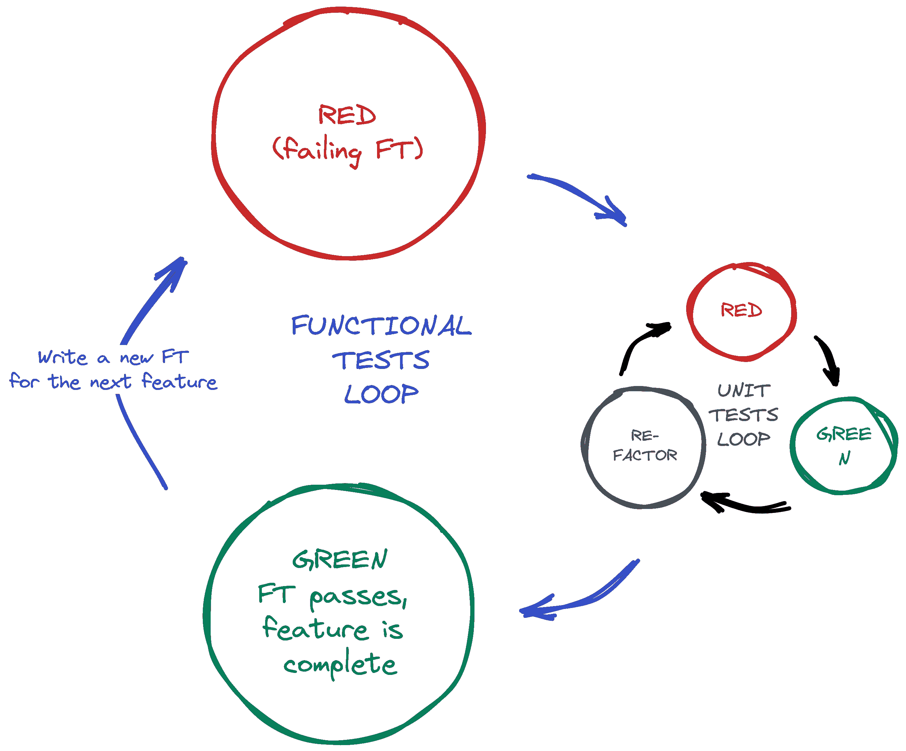

# 第七章。逐步工作

现在让我们解决真正的问题，即我们的设计只允许一个全局列表。在本章中，我将演示一个关键的 TDD 技术：如何使用增量、逐步的过程来调整现有代码，从一个可工作状态过渡到另一个可工作状态。测试羊驼，而不是重构猫。

# 当必要时进行小设计

让我们考虑一下我们希望支持多个列表的工作方式。

目前，我们站点的唯一 URL 是主页，这就是为什么只有一个全局列表的最明显方式支持多个列表。每个列表都有自己的 URL，这样人们可以开始多个列表，或者不同的人可以有不同的列表。这可能如何工作？

## 不是大设计预先

TDD 与敏捷开发运动密切相关，后者反对*大设计预先*（Big Design Up Front），即传统软件工程实践，其中经过长时间的需求收集后，会有一个同样漫长的设计阶段，在这个阶段，软件被计划在纸上完成。敏捷哲学认为，通过在实践中解决问题，你比在理论中学到更多，特别是当你尽早将应用程序与真实用户对接时。我们不再有长时间的前期设计阶段，而是尝试尽早发布一个*最小可行应用*，并根据来自真实世界使用的反馈逐步演进设计。

但这并不意味着思考设计被完全禁止！在上一大章中，我们看到仅仅笨拙地继续前进而不加思考*最终*可以让我们达到正确答案，但常常稍微思考设计可以帮助我们更快地到达那里。因此，让我们思考一下我们的最小可行列表应用，以及我们需要交付的设计类型：

+   我们希望每个用户能够存储自己的列表——至少目前是这样。

+   一个列表由几个项目组成，其主要属性是一小段描述性文本。

+   我们需要保存用户在一次访问到下一次访问的列表。目前，我们可以为每个用户提供一个唯一的列表 URL。以后，我们可能希望以某种方式自动识别用户并向他们显示他们的列表。

要交付“目前”项目，听起来我们要将列表及其项存储在数据库中。每个列表将有一个唯一的 URL，每个列表项将是与特定列表相关的一小段描述文本。

## YAGNI！

一旦你开始考虑设计，就很难停下来。我们脑海中冒出各种其他想法——也许我们想给每个列表一个名称或标题，也许我们想用用户名和密码识别用户，也许我们想在列表中添加一个更长的注释字段以及短描述，也许我们想存储某种排序方式等等。但我们遵循敏捷开发的另一个原则：“YAGNI”（读作 yag-knee），即“你不会需要它！”作为软件开发者，我们喜欢创造东西，有时很难抵制只是因为想法浮现而建造东西的冲动。问题是，往往情况是，无论想法有多酷，你最终都不会用到它。相反，你会有一堆未使用的代码，增加了应用程序的复杂性。YAGNI 是我们用来抵制过度热情的创造冲动的口号。

## REST（ish）

我们对我们想要的数据结构有一个想法——Model-View-Controller（MVC）的模型部分。那么视图和控制器部分呢？用户如何使用 Web 浏览器与列表及其项目进行交互？

表述性状态转移（REST）是一种通常用于指导基于 Web API 设计的 Web 设计方法。在设计用户界面站点时，不可能严格遵循 REST 规则，但它们仍然提供了一些有用的启发（如果您想看到真正的 REST API，请跳转到 [Link to Come]）。

REST 建议我们有一个 URL 结构，与我们的数据结构匹配，例如列表和列表项目。每个列表可以有自己的 URL：

```py
    /lists/<list identifier>/
```

这将满足我们在 FT 中指定的要求。要查看列表，我们使用 GET 请求（正常浏览器访问页面）。

要创建全新的列表，我们将有一个特殊的 URL 接受 POST 请求：

```py
    /lists/new
```

要向现有列表添加新项目，我们将有一个单独的 URL，可以向其发送 POST 请求：

```py
    /lists/<list identifier>/add_item
```

（再次强调，我们并非试图完全遵循 REST 规则，在这里应该使用 PUT 请求——我们只是借鉴 REST 的灵感。此外，你不能在标准 HTML 表单中使用 PUT。）

总之，本章的草稿如下所示：

# 逐步实施新设计，使用 TDD

我们如何使用 TDD 实现新设计？让我们再看一下 TDD 流程的流程图，位于 [Link to Come]。

在顶层，我们将结合添加新功能（通过添加新的 FT 和编写新的应用程序代码）和重构我们的应用程序——即重写某些现有实现，以便向用户提供相同功能，但使用我们新设计的一些方面。我们将能够使用现有的功能测试来验证我们不会破坏已经工作的内容，并使用新的功能测试来推动新功能的实现。

在单元测试级别上，我们将添加新的测试或修改现有测试以测试我们想要的更改，并且我们将能够类似地使用我们 *不* 修改的单元测试来帮助确保我们在过程中没有破坏任何东西。



###### 图 7-1\. 具有功能和单元测试的 TDD 过程

# 确保我们有一个回归测试

让我们将我们的草稿翻译成一个新的功能测试方法，引入第二个用户，并检查他们的待办事项列表是否与 Edith 的分开。

我们将从第一个例子开始类似地进行。Edith 添加了第一个项目以创建一个待办事项列表，但我们引入了第一个新的断言——Edith 的列表应该存在于自己独特的 URL 上：

functional_tests/tests.py（ch07l005）

```py
def test_can_start_a_todo_list(self):
    # Edith has heard about a cool new online to-do app.
    [...]
    # The page updates again, and now shows both items on her list
    self.wait_for_row_in_list_table("1: Buy peacock feathers")
    self.wait_for_row_in_list_table("2: Use peacock feathers to make a fly")

    # Satisfied, she goes back to sleep

def test_multiple_users_can_start_lists_at_different_urls(self):
    # Edith starts a new to-do list
    self.browser.get(self.live_server_url)
    inputbox = self.browser.find_element(By.ID, "id_new_item")
    inputbox.send_keys("Buy peacock feathers")
    inputbox.send_keys(Keys.ENTER)
    self.wait_for_row_in_list_table("1: Buy peacock feathers")

    # She notices that her list has a unique URL
    edith_list_url = self.browser.current_url
    self.assertRegex(edith_list_url, "/lists/.+")  
```


`assertRegex` 是 `unittest` 中的一个辅助函数，用于检查字符串是否与正则表达式匹配。我们用它来检查我们的新的 REST-ish 设计是否已经实现。在 [`unittest` 文档](http://docs.python.org/3/library/unittest.xhtml) 中查找更多信息。

接下来，我们想象一个新用户加入。我们希望检查当他们访问主页时，他们不会看到 Edith 的任何项目，并且他们会得到自己的独特 URL 用于他们的列表：

functional_tests/tests.py（ch07l006）

```py
    [...]
    self.assertRegex(edith_list_url, "/lists/.+")

    # Now a new user, Francis, comes along to the site.

    ## We delete all the browser's cookies
    ## as a way of simulating a brand new user session 
    self.browser.delete_all_cookies()

    # Francis visits the home page.  There is no sign of Edith's
    # list
    self.browser.get(self.live_server_url)
    page_text = self.browser.find_element(By.TAG_NAME, "body").text
    self.assertNotIn("Buy peacock feathers", page_text)
    self.assertNotIn("make a fly", page_text)

    # Francis starts a new list by entering a new item. He
    # is less interesting than Edith...
    inputbox = self.browser.find_element(By.ID, "id_new_item")
    inputbox.send_keys("Buy milk")
    inputbox.send_keys(Keys.ENTER)
    self.wait_for_row_in_list_table("1: Buy milk")

    # Francis gets his own unique URL
    francis_list_url = self.browser.current_url
    self.assertRegex(francis_list_url, "/lists/.+")
    self.assertNotEqual(francis_list_url, edith_list_url)

    # Again, there is no trace of Edith's list
    page_text = self.browser.find_element(By.TAG_NAME, "body").text
    self.assertNotIn("Buy peacock feathers", page_text)
    self.assertIn("Buy milk", page_text)

    # Satisfied, they both go back to sleep
```


我使用双哈希（`##`）的惯例来表示“元注释”——关于测试工作方式和原因的注释——这样我们就可以将它们与解释用户故事的 FT 中的常规注释区分开来。它们是给我们未来的自己的消息，否则我们可能会想知道为什么我们在忙着删除 cookies...​

除此之外，新测试相当容易理解。让我们看看当我们运行我们的 FTs 时我们的表现如何：

```py
$ python manage.py test functional_tests
[...]
.F
======================================================================
FAIL: test_multiple_users_can_start_lists_at_different_urls (functional_tests.t
ests.NewVisitorTest.test_multiple_users_can_start_lists_at_different_urls)

 ---------------------------------------------------------------------
Traceback (most recent call last):
  File "...goat-book/functional_tests/tests.py", line 77, in
test_multiple_users_can_start_lists_at_different_urls
    self.assertRegex(edith_list_url, "/lists/.+")
AssertionError: Regex didn't match: '/lists/.+' not found in
'http://localhost:8081/'

 ---------------------------------------------------------------------
Ran 2 tests in 5.786s

FAILED (failures=1)
```

很好，我们的第一个测试仍然通过，第二个测试失败了，这是我们可能期望的。让我们提交一下，然后去构建一些新的模型和视图：

```py
$ git commit -a
```

# 朝着新设计迭代

对于我们的新设计感到兴奋，我有一种无法抑制的冲动，想立即开始更改 *models.py*，这将破坏一半的单元测试，然后堆叠并一次性更改几乎每一行代码。这是一种自然的冲动，而 TDD 作为一种学科，是一直在与之斗争。听从测试山羊的话，而不是重构猫的话！我们不需要在一个巨大的爆炸中实现我们新的闪亮设计。让我们进行一些小的变更，从一个工作状态到另一个工作状态，我们的设计在每个阶段都温和地指导着我们。

我们的待办事项列表上有四个项目。FT，以其 `Regex didn't match` 错误，建议我们下一个应该解决的问题是第二个项目——给列表分配自己的 URL 和标识符。让我们试着修复这个问题，只修改那个问题。

URL 来自 POST 后的重定向。在*lists/tests.py*中，让我们找到`test_redirects_after_POST`，并更改预期的重定向位置：

lists/tests.py（ch07l007）

```py
def test_redirects_after_POST(self):
    response = self.client.post("/", data={"item_text": "A new list item"})
    self.assertRedirects(response, "/lists/the-only-list-in-the-world/")
```

这看起来有点奇怪吗？显然，*/lists/the-only-list-in-the-world*不是我们应用程序最终设计中会出现的 URL。但我们致力于一次只改变一件事情。虽然我们的应用程序只支持一个列表，但这是唯一有意义的 URL。我们仍在前进，因为我们将为列表和主页拥有不同的 URL，这是向更符合 REST 原则的设计迈出的一步。稍后，当我们有多个列表时，将很容易更改。

###### 注意

另一种思考方式是作为解决问题的技巧：我们新的 URL 设计目前尚未实现，所以对于 0 项是有效的。最终，我们想要解决*n*项，但解决 1 项是迈向目标的一大步。

运行单元测试会得到一个预期的失败：

```py
$ python manage.py test lists
[...]
AssertionError: '/' != '/lists/the-only-list-in-the-world/'
[...]
```

我们可以调整我们在*lists/views.py*中的`home_page`视图：

lists/views.py（ch07l008）

```py
def home_page(request):
    if request.method == "POST":
        Item.objects.create(text=request.POST["item_text"])
        return redirect("/lists/the-only-list-in-the-world/")

    items = Item.objects.all()
    return render(request, "home.xhtml", {"items": items})
```

Django 的单元测试运行器会发现这不是一个真实的 URL：

```py
$ python3 manage.py test lists
[...]
AssertionError: 404 != 200 : Couldn't retrieve redirection page
'/lists/the-only-list-in-the-world/': response code was 404 (expected 200)
```

# 进行第一步，自包含的步骤：一个新的 URL

我们的单例列表 URL 尚不存在。我们在*superlists/urls.py*中修复这个问题。

superlists/urls.py（ch07l009）

```py
from django.urls import path
from lists import views

urlpatterns = 
    path("", views.home_page, name="home"),
    path("lists/the-only-list-in-the-world/", views.home_page, name="view_list"),  ![1
]
```


我们只需将新的 URL 指向现有的主页视图。这是最小的改变。

###### 提示

小心 URL 中的尾部斜杠，无论是在这里的*urls.py*还是测试中。它们是常见的错误源。

这使得我们的单元测试通过了：

```py
$ python3 manage.py test lists
[...]
OK
```

FTs（功能测试）认为怎么样？

```py
$ python3 manage.py test functional_tests
[...]
AssertionError: 'Buy peacock feathers' unexpectedly found in 'Your To-Do
list\n1: Buy peacock feathers'
```

很好，它们进展了一点，现在我们确认有了一个新的 URL，但实际页面内容仍然相同，显示旧的列表。

## 分离我们的主页和列表视图功能

现在我们有了两个 URL，但它们实际上做着完全相同的事情。在幕后，它们只是指向同一个函数。继续逐步工作，我们可以开始分解这两个不同 URL 的责任：*主页只需显示并对基于其第一个项目创建全新列表做出反应。* 列表视图页面需要能够显示现有的列表项并向列表添加新项

让我们分离一些关于我们新 URL 的测试。

打开*lists/tests.py*，并添加一个名为`ListViewTest`的新测试类。然后将从`HomePageTest`移到我们的新类中的名为`test_displays_all_list_items`的方法，只改变`self.client.get()`调用的 URL：

lists/tests.py（ch07l010）

```py
class HomePageTest(TestCase):
    def test_uses_home_template(self):
        [...]
    def test_can_save_a_POST_request(self):
        [...]
    def test_redirects_after_POST(self):
        [...]

class ListViewTest(TestCase):
    def test_displays_all_list_items(self):
        Item.objects.create(text="itemey 1")
        Item.objects.create(text="itemey 2")
        response = self.client.get("/lists/the-only-list-in-the-world/")
        self.assertContains(response, "itemey 1")
        self.assertContains(response, "itemey 2")
```

现在让我们尝试运行这个测试：

```py
$ python3 manage.py test lists
OK
```

它通过了，因为 URL 仍指向`home_page`视图。

让我们将其指向一个新的视图：

superlists/urls.py（ch07l011）

```py
from django.urls import path
from lists import views

urlpatterns = [
    path("", views.home_page, name="home"),
    path("lists/the-only-list-in-the-world/", views.view_list, name="view_list"),
]
```

预料之中的失败，因为目前还没有这样的视图函数：

```py
$ python3 manage.py test lists
[...]
    path("lists/the-only-list-in-the-world/", views.view_list,
name="view_list"),
                                              ^^^^^^^^^^^^^^^
AttributeError: module 'lists.views' has no attribute 'view_list'
```

### 一个新的视图函数

够公平。让我们在*lists/views.py*中创建一个虚拟视图函数：

lists/views.py（ch07l012-0）

```py
def view_list(request):
    pass
```

还不够好：

```py
ValueError: The view lists.views.view_list didn't return an HttpResponse
object. It returned None instead.

[...]
FAILED (errors=2)
```

寻找最小的代码更改，让我们只是让视图返回我们现有的 *home.xhtml* 模板，但里面什么都没有：

lists/views.py (ch07l012-1)

```py
def view_list(request):
    return render(request, "home.xhtml")
```

现在测试指导我们确保我们的列表视图显示现有的列表项：

```py
AssertionError: False is not true : Couldn't find 'itemey 1' in response
```

所以让我们直接复制 `home_page` 的最后两行：

lists/views.py (ch07l012)

```py
def view_list(request):
    items = Item.objects.all()
    return render(request, "home.xhtml", {"items": items})
```

这使我们通过了单元测试！

```py
Ran 6 tests in 0.035s

OK
```

## FTs 检测到一个回归

像往常一样，当我们开始通过单元测试时，我们运行功能测试以检查事物在“现实生活”中的运行情况：

```py
$ python manage.py test functional_tests
[...]
FF
======================================================================
FAIL: test_can_start_a_todo_list
(functional_tests.tests.NewVisitorTest.test_can_start_a_todo_list)
 ---------------------------------------------------------------------
Traceback (most recent call last):
  File "...goat-book/functional_tests/tests.py", line 63, in
test_can_start_a_todo_list
[...]
AssertionError: '2: Use peacock feathers to make a fly' not found in ['1: Buy
peacock feathers']

======================================================================
FAIL: test_multiple_users_can_start_lists_at_different_urls (functional_tests.t
ests.NewVisitorTest.test_multiple_users_can_start_lists_at_different_urls)
 ---------------------------------------------------------------------
Traceback (most recent call last):
  File "...goat-book/functional_tests/tests.py", line 89, in
test_multiple_users_can_start_lists_at_different_urls
    self.assertNotIn("Buy peacock feathers", page_text)
AssertionError: 'Buy peacock feathers' unexpectedly found in 'Your To-Do
list\n1: Buy peacock feathers'
```

不仅是我们的新测试失败了，而且旧测试也失败了。这告诉我们我们引入了一个*回归*。

他们试图告诉我们什么？

当我们尝试添加第二个项目时，两个测试都失败了。我们必须戴上调试帽子。我们知道主页是工作的，因为测试已经到达了第一个 FT 的第 63 行，所以我们至少已经添加了一个第一项。而且我们的单元测试都通过了，所以我们相当确定我们*有*的 URL 和视图正在执行它们应该执行的操作。让我们快速查看一下这些单元测试，看看它们告诉我们什么：

```py
$ grep -E "class|def" lists/tests.py
class HomePageTest(TestCase):
    def test_uses_home_template(self):
    def test_can_save_a_POST_request(self):
    def test_redirects_after_POST(self):
    def test_only_saves_items_when_necessary(self):
class ListViewTest(TestCase):
    def test_displays_all_list_items(self):
class ItemModelTest(TestCase):
    def test_saving_and_retrieving_items(self):
```

主页显示了正确的模板，并且可以处理 POST 请求，而 */only-list-in-the-world/* 视图知道如何显示所有项目... 但是它不知道如何处理 POST 请求。啊，这给了我们一个线索。

第二个线索是一个经验法则，当所有单元测试都通过了但功能测试没有通过时，通常指向的是单元测试未覆盖的问题，而在我们的情况下，这通常是一个模板问题。

答案是，我们目前的 *home.xhtml* 输入表单没有指定一个显式的 POST URL：

lists/templates/home.xhtml

```py
        <form method="POST">
```

默认情况下，浏览器将 POST 数据发送回当前所在的相同 URL。当我们在主页上时，这没问题，但当我们在 */only-list-in-the-world/* 页面上时，就不行了。

## 尽快恢复工作状态

现在我们可以深入研究并向我们的新视图添加 POST 请求处理，但这将涉及编写更多的测试和代码，而且在这一点上，我们希望尽快恢复到工作状态。实际上，我们可以做的*最快*的事情是只使用现有的主页视图，因为它已经工作了，用于所有 POST 请求：

lists/templates/home.xhtml (ch07l013)

```py
    <form method="POST" action="/">
```

试一下，我们会看到我们的 FTs 回到了一个更愉快的地方：

```py
FAIL: test_multiple_users_can_start_lists_at_different_urls (functional_tests.t
ests.NewVisitorTest.test_multiple_users_can_start_lists_at_different_urls)
[...]
AssertionError: 'Buy peacock feathers' unexpectedly found in 'Your To-Do
list\n1: Buy peacock feathers'

Ran 2 tests in 8.541s
FAILED (failures=1)
```

我们的回归测试再次通过了，所以我们知道我们已经恢复到了工作状态。新功能可能还没有起作用，但至少旧功能的工作方式和以前一样。

## 绿色？重构

是时候稍微整理一下了。

在 *红/绿/重构* 的过程中，我们已经到达了绿色阶段，所以我们应该看看需要进行重构的地方。我们现在有两个视图，一个用于主页，一个用于单个列表。两者目前都使用相同的模板，并将其中所有当前在数据库中的列表项传递给它。但是 POST 请求仅由主页处理。

感觉我们两个视图的责任有点纠缠在一起。让我们试着稍微解开它们的纠缠。

# 另一个小步骤：为查看列表创建一个单独的模板

由于主页和列表视图现在是完全不同的页面，它们应该使用不同的 HTML 模板；*home.xhtml*可以有一个单独的输入框，而一个新模板，*list.xhtml*，可以负责显示现有项目的表格。

让我们添加一个新的测试来检查它是否使用了一个不同的模板：

lists/tests.py (ch07l014)

```py
class ListViewTest(TestCase):
    def test_uses_list_template(self):
        response = self.client.get("/lists/the-only-list-in-the-world/")
        self.assertTemplateUsed(response, "list.xhtml")

    def test_displays_all_list_items(self):
        [...]
```

让我们看看它说了什么：

```py
AssertionError: False is not true : Template 'list.xhtml' was not a template
used to render the response. Actual template(s) used: home.xhtml
```

看起来差不多了，让我们改变一下视图：

lists/views.py (ch07l015)

```py
def view_list(request):
    items = Item.objects.all()
    return render(request, "list.xhtml", {"items": items})
```

但是，显然，那个模板还不存在。如果我们运行单元测试，我们会得到：

```py
django.template.exceptions.TemplateDoesNotExist: list.xhtml
```

让我们在*lists/templates/list.xhtml*创建一个新文件：

```py
$ touch lists/templates/list.xhtml
```

一个空模板，导致我们出现这个错误——知道测试在那里确保我们填写它：

```py
AssertionError: False is not true : Couldn't find 'itemey 1' in response
```

一个单独列表的模板将会重复使用我们当前在*home.xhtml*中拥有的相当多的内容，所以我们可以先简单地复制那个：

```py
$ cp lists/templates/home.xhtml lists/templates/list.xhtml
```

这样测试就通过了（绿灯）。

```py
$ python manage.py test lists
[...]
OK
```

现在让我们再做一些整理（重构）。我们说过主页不需要列出项目，它只需要新的列表输入字段，所以我们可以从*lists/templates/home.xhtml*中删除一些行，并且可能稍微调整`h1`来说“开始一个新的待办事项列表”：

我将代码更改呈现为一个差异，希望能更清楚地显示我们需要修改的内容：

lists/templates/home.xhtml (ch07l018)

```py
   <body>
-    <h1>Your To-Do list</h1>
+    <h1>Start a new To-Do list</h1>
     <form method="POST" action="/">
       <input name="item_text" id="id_new_item" placeholder="Enter a to-do item" />
       
     </form>
-    <table id="id_list_table">
-      
-        <tr><td>{{ forloop.counter }}: {{ item.text }}</td></tr>
-      
-    </table>
   </body>
```

我们重新运行单元测试以确保没有出现问题……

```py
OK
```

很好。

现在实际上没有必要将所有项目传递到我们的`home_page`视图中的*home.xhtml*模板中，所以我们可以简化它并删除一些行：

lists/views.py (ch07l019)

```py
     if request.method == "POST":
         Item.objects.create(text=request.POST["item_text"])
         return redirect("/lists/the-only-list-in-the-world/")
-
-    items = Item.objects.all()
-    return render(request, "home.xhtml", {"items": items})
+    return render(request, "home.xhtml")
```

再次运行单元测试；它们仍然通过：

```py
OK
```

运行功能测试的时间到了：

```py
AssertionError: '1: Buy milk' not found in ['1: Buy peacock feathers', '2: Buy
milk']
```

不错！我们的回归测试（第一个 FT）通过了，我们的新测试现在也稍微前进了一点——它告诉我们 Francis 没有得到自己的列表页面（因为他仍然看到了 Edith 的一些列表项）。

也许感觉我们没有取得太多进展，因为从功能上来说，站点的行为几乎与我们开始这一章时完全一样，但这确实是进步。我们已经开始了通往新设计的道路，并且我们已经实施了一些步骤*而没有比以前更糟糕*。让我们提交到目前为止的进展：

```py
$ git status # should show 4 changed files and 1 new file, list.xhtml
$ git add lists/templates/list.xhtml
$ git diff # should show we've simplified home.xhtml,
           # moved one test to a new class in lists/tests.py added a new view
           # in views.py, and simplified home_page and added a line to urls.py
$ git commit -a # add a message summarising the above, maybe something like
                # "new URL, view and template to display lists"
```

# 第三个小步骤：为添加列表项创建一个新的 URL

我们的自己待办事项清单进展到哪里了？

我们在第二项上*有点*取得了进展，即使世界上仍然只有一个列表。第一项有点吓人。我们能在 3 或 4 项上做些什么吗？

让我们在*/lists/new*添加一个新的 URL 来添加新的列表项：如果没有别的，这将简化主页视图。

## 一个用于新列表创建的测试类

打开*lists/tests.py*，并且*移动*`test_can_save_a_POST_request`和`test_redirects_after_POST`方法到一个新的类中，然后改变它们提交的 URL：

lists/tests.py (ch07l020)

```py
class NewListTest(TestCase):
    def test_can_save_a_POST_request(self):
        self.client.post("/lists/new", data={"item_text": "A new list item"})
        self.assertEqual(Item.objects.count(), 1)
        new_item = Item.objects.get()
        self.assertEqual(new_item.text, "A new list item")

    def test_redirects_after_POST(self):
        response = self.client.post("/lists/new", data={"item_text": "A new list item"})
        self.assertRedirects(response, "/lists/the-only-list-in-the-world/")
```

###### 提示

顺便说一句，这是另一个需要注意尾随斜杠的地方。它是`/lists/new`，没有尾随斜杠。我使用的约定是没有尾随斜杠的 URL 是“动作”URL，用于修改数据库。

尝试运行它：

```py
    self.assertEqual(Item.objects.count(), 1)
AssertionError: 0 != 1
[...]
    self.assertRedirects(response, "/lists/the-only-list-in-the-world/")
[...]
AssertionError: 404 != 302 : Response didn't redirect as expected: Response
code was 404 (expected 302)
```

第一个失败告诉我们，我们没有将新项目保存到数据库中，第二个失败告诉我们，我们的视图返回了 404 而不是 302 重定向。这是因为我们还没有为*/lists/new*构建 URL，所以`client.post`只是得到一个“未找到”的响应。

###### 注意

你还记得我们之前是如何将其拆分成两个测试的吗？如果我们只有一个测试来检查保存和重定向的情况，它会在`0 != 1`的失败上失败，这将更难调试。问我为什么知道这一点。

## 用于新列表创建的 URL 和视图

现在让我们构建我们的新 URL：

superlists/urls.py（ch07l021）

```py
urlpatterns = [
    path("", views.home_page, name="home"),
    path("lists/new", views.new_list, name="new_list"),
    path("lists/the-only-list-in-the-world/", views.view_list, name="view_list"),
]
```

接下来我们得到了`no attribute 'new_list'`，所以让我们在*lists/views.py*中修复它：

lists/views.py（ch07l022）

```py
def new_list(request):
    pass
```

然后我们得到了“视图 lists.views.new_list 没有返回一个 HttpResponse 对象”。（这已经变得相当熟悉了！）我们可以返回一个原始的`HttpResponse`，但既然我们知道我们需要一个重定向，让我们从`home_page`中借用一行：

lists/views.py（ch07l023）

```py
def new_list(request):
    return redirect("/lists/the-only-list-in-the-world/")
```

这样做就得到：

```py
    self.assertEqual(Item.objects.count(), 1)
AssertionError: 0 != 1
```

看起来相当简单。我们从`home_page`再借用一行：

lists/views.py（ch07l024）

```py
def new_list(request):
    Item.objects.create(text=request.POST["item_text"])
    return redirect("/lists/the-only-list-in-the-world/")
```

现在所有的事情都过去了：

```py
Ran 7 tests in 0.030s

OK
```

我们可以运行 FTs 检查我们是否仍然在同一位置：我们的回归测试通过了，新的 FT 也达到了相同的点。

```py
[...]
AssertionError: '1: Buy milk' not found in ['1: Buy peacock feathers', '2: Buy
milk']
Ran 2 tests in 8.972s
FAILED (failures=1)
```

## 移除现在多余的代码和测试

我们看起来很好。由于我们的新视图现在正在做大部分`home_page`过去做的工作，我们应该能够大幅简化它。例如，我们可以移除整个`if request.method == 'POST'`部分吗？

lists/views.py（ch07l025）

```py
def home_page(request):
    return render(request, "home.xhtml")
```

是的！

```py
OK
```

而我们在这个过程中，也可以移除现在多余的`test_only_saves_​items_when_necessary`测试！

感觉不错吧？视图函数看起来简单多了。我们重新运行测试确保……

```py
Ran 6 tests in 0.016s
OK
```

还有 FTs 呢？

## 一个回归测试！将我们的表单指向新 URL

糟糕：

```py
ERROR: test_can_start_a_todo_list
[...]
  File "...goat-book/functional_tests/tests.py", line 52, in
test_can_start_a_todo_list
[...]
    self.wait_for_row_in_list_table("1: Buy peacock feathers")
[...]
    table = self.browser.find_element(By.ID, "id_list_table")
            ^^^^^^^^^^^^^^^^^^^^^^^^^^^^^^^^^^^^^^^^^^^^^^^^^
[...]
selenium.common.exceptions.NoSuchElementException: Message: Unable to locate
element: [id="id_list_table"]

ERROR: test_multiple_users_can_start_lists_at_different_urls (functional_tests.
tests.NewVisitorTest.test_multiple_users_can_start_lists_at_different_urls)
[...]
selenium.common.exceptions.NoSuchElementException: Message: Unable to locate
element: [id="id_list_table"]
[...]

Ran 2 tests in 11.592s
FAILED (errors=2)
```

再次，功能测试（FTs）捕捉到一个棘手的小 bug，这是我们的单元测试单独很难发现的。

这是因为我们的表单仍然指向旧的 URL。在*home.xhtml*和*lists.xhtml*中，让我们将它们都改为：

lists/templates/home.xhtml，lists/templates/list.xhtml

```py
    <form method="POST" action="/lists/new">
```

这样应该可以让我们重新工作了：

```py
AssertionError: '1: Buy milk' not found in ['1: Buy peacock feathers', '2: Buy
milk']
[...]
FAILED (failures=1)
```

这是另一个非常完整的提交，我们对 URL 做了很多改动，我们的*views.py*看起来更加整洁，我们确信应用程序仍然像以前一样工作得很好。我们在这种工作状态到工作状态的操作中越来越娴熟了！

```py
$ git status # 5 changed files
$ git diff # URLs for forms x2, moved code in views + tests, new URL
$ git commit -a
```

我们可以划掉待办列表上的一个项目：

# 迈出改变我们模型的步伐：调整我们的模型

足够处理我们的 URL 了。现在是时候迈出改变我们模型的步伐了。让我们调整模型单元测试。再次，通过 diff 查看更改是一个很好的方法：

lists/tests.py（ch07l029）

```py
@@ -1,5 +1,5 @@
 from django.test import TestCase
-from lists.models import Item
+from lists.models import Item, List

 class HomePageTest(TestCase):
@@ -35,20 +35,30 @@ class ListViewTest(TestCase):
         self.assertContains(response, "itemey 2")

-class ItemModelTest(TestCase):
+class ListAndItemModelsTest(TestCase):
     def test_saving_and_retrieving_items(self):
+        mylist = List()
+        mylist.save()
+
         first_item = Item()
         first_item.text = "The first (ever) list item"
+        first_item.list = mylist
         first_item.save()

         second_item = Item()
         second_item.text = "Item the second"
+        second_item.list = mylist
         second_item.save()

+        saved_list = List.objects.get()
+        self.assertEqual(saved_list, mylist)
+
         saved_items = Item.objects.all()
         self.assertEqual(saved_items.count(), 2)

         first_saved_item = saved_items[0]
         second_saved_item = saved_items[1]
         self.assertEqual(first_saved_item.text, "The first (ever) list item")
+        self.assertEqual(first_saved_item.list, mylist)
         self.assertEqual(second_saved_item.text, "Item the second")
+        self.assertEqual(second_saved_item.list, mylist)
```

我们创建一个新的`List`对象，然后通过将其分配为其`.list`属性来为每个项分配它。我们检查列表是否被正确保存，并检查这两个项是否也保存了它们与列表的关系。您还会注意到，我们可以直接比较列表对象（`saved_list`和`mylist`）—在幕后，这些将通过检查它们的主键（`.id`属性）是否相同来进行比较。

又到了另一个单元测试/代码周期。

在最初的几次迭代中，我不会在每次测试运行之间显式展示您输入的代码，我只会展示运行测试时预期的错误消息。我会让您自己来确定每个最小代码更改应该是什么。

###### 小贴士

需要提示吗？回到我们在上上一章中介绍`Item`模型的步骤看看。

您的第一个错误应该是：

```py
ImportError: cannot import name 'List' from 'lists.models'
```

解决这个问题，然后您应该会看到：

```py
AttributeError: 'List' object has no attribute 'save'
```

接下来，您应该会看到：

```py
django.db.utils.OperationalError: no such table: lists_list
```

因此，我们运行`makemigrations`：

```py
$ python manage.py makemigrations
Migrations for 'lists':
  lists/migrations/0003_list.py
    - Create model List
```

然后您应该会看到：

```py
    self.assertEqual(first_saved_item.list, mylist)
AttributeError: 'Item' object has no attribute 'list'
```

## 外键关系

我们如何为我们的`Item`赋予一个列表属性？让我们试着像`text`属性一样天真地去做（顺便说一句，这是您看到迄今为止您的解决方案是否与我的类似的机会）：

lists/models.py (ch07l033)

```py
from django.db import models

class List(models.Model):
    pass

class Item(models.Model):
    text = models.TextField(default="")
    list = models.TextField(default="")
```

通常情况下，测试告诉我们我们需要一个迁移：

```py
$ python manage.py test lists
[...]
django.db.utils.OperationalError: no such column: lists_item.list

$ python manage.py makemigrations
Migrations for 'lists':
  lists/migrations/0004_item_list.py
    - Add field list to item
```

让我们看看这给我们带来了什么：

```py
AssertionError: 'List object (1)' != <List: List object (1)>
```

我们还没到那里。仔细看看`!=`的每一侧。您看到了单引号`'`吗？Django 只保存了`List`对象的字符串表示形式。为了保存到对象本身的关系，我们使用`ForeignKey`告诉 Django 这两个类之间的关系：

lists/models.py (ch07l035)

```py
class Item(models.Model):
    text = models.TextField(default="")
    list = models.ForeignKey(List, default=None, on_delete=models.CASCADE)
```

那也需要进行迁移。由于最后一个是一个误导，让我们删除它并用新的替换它：

```py
$ rm lists/migrations/0004_item_list.py
$ python manage.py makemigrations
Migrations for 'lists':
  lists/migrations/0004_item_list.py
    - Add field list to item
```

###### 警告

删除迁移是危险的。偶尔这样做以保持整洁很好，因为我们并不总是第一次就正确编写我们的模型代码！但是，如果您删除了已经应用到某个数据库中的迁移，Django 将会对它所处的状态感到困惑，并且无法应用未来的迁移。您只应在确定迁移未被使用时才这样做。一个很好的经验法则是，您永远不应删除或修改已经提交到您的 VCS 的迁移。

## 调整其余世界以适应我们的新模型

回到我们的测试中，现在会发生什么？

```py
$ python manage.py test lists
[...]
ERROR: test_displays_all_list_items
django.db.utils.IntegrityError: NOT NULL constraint failed: lists_item.list_id
[...]
ERROR: test_redirects_after_POST
django.db.utils.IntegrityError: NOT NULL constraint failed: lists_item.list_id
[...]
ERROR: test_can_save_a_POST_request
django.db.utils.IntegrityError: NOT NULL constraint failed: lists_item.list_id

Ran 6 tests in 0.021s

FAILED (errors=3)
```

哎呀！

有一些好消息。虽然很难看到，但我们的模型测试通过了。但我们的三个视图测试却失败了。

问题出在我们在`Item`和`List`之间引入的新关系上，它要求每个项都必须有一个父列表，而我们的旧测试和代码还没有准备好。

不过，这正是我们为什么要有测试的原因！让我们再次让它们工作起来。最简单的是`ListViewTest`；我们只需为我们的两个测试项创建一个父列表：

lists/tests.py (ch07l038)

```py
class ListViewTest(TestCase):
    [...]
    def test_displays_all_list_items(self):
        mylist = List.objects.create()
        Item.objects.create(text="itemey 1", list=mylist)
        Item.objects.create(text="itemey 2", list=mylist)
```

这样我们只剩下两个失败的测试，都是在尝试向我们的`new_list`视图进行 POST 请求的测试上。使用我们通常的技术来解码回溯，从错误到测试代码的行，最后埋藏在其中的是导致失败的我们自己的代码行：

```py
  File "...goat-book/lists/tests.py", line 19, in test_redirects_after_POST
    response = self.client.post("/lists/new", data={"item_text": "A new list
item"})
[...]
  File "...goat-book/lists/views.py", line 10, in new_list
    Item.objects.create(text=request.POST["item_text"])
```

当我们尝试创建一个没有父列表的项目时。因此，我们在视图中进行类似的更改：

lists/views.py (ch07l039)

```py
from lists.models import Item, List
[...]

def new_list(request):
    nulist = List.objects.create()
    Item.objects.create(text=request.POST["item_text"], list=nulist)
    return redirect("/lists/the-only-list-in-the-world/")
```

然后¹让我们的测试再次通过：

```py
Ran 6 tests in 0.030s

OK
```

在这一点上，你是不是内心在崩溃？ *啊！感觉太不对了；我们为每个新项提交都创建一个新列表，而且我们仍然只是显示所有项，好像它们属于同一个列表！* 我知道，我也有同感。逐步的方法让你从工作代码到工作代码，这是反直觉的。我总是觉得应该一口气跳进去，试图一次性修复所有问题，而不是从一个奇怪的半成品状态到另一个。但记住测试的山羊！当你在山上时，你需要非常谨慎地考虑每一步的落脚点，并一步一步地前行，确保每个阶段你所站的地方都不会让你跌入悬崖。

所以，只是为了让我们确信事情已经起作用，我们重新运行 FT：

```py
AssertionError: '1: Buy milk' not found in ['1: Buy peacock feathers', '2: Buy
milk']
[...]
```

确实，它完全到达了我们之前的地方。我们没有破坏任何东西，而且我们对数据库进行了重大改变。这是一件令人高兴的事情！让我们提交吧：

```py
$ git status # 3 changed files, plus 2 migrations
$ git add lists
$ git diff --staged
$ git commit
```

然后我们可以划掉待办列表中的另一项：

# 每个列表应该有自己的 URL

我们可以摆脱愚蠢的`the-only-list-in-the-world` URL，但是我们应该用什么作为我们列表的唯一标识符呢？现在，也许最简单的方法就是使用数据库中自动生成的`id`字段。让我们修改`ListViewTest`，使得这两个测试指向新的 URL。

我们还将更改旧的`test_displays_all_items`测试，并将其命名为`test_displays_only_items_for_that_list`，以确保仅显示特定列表的项目：

lists/tests.py (ch07l040)

```py
class ListViewTest(TestCase):
    def test_uses_list_template(self):
        mylist = List.objects.create()
        response = self.client.get(f"/lists/{mylist.id}/")
        self.assertTemplateUsed(response, "list.xhtml")

    def test_displays_only_items_for_that_list(self):
        correct_list = List.objects.create()
        Item.objects.create(text="itemey 1", list=correct_list)
        Item.objects.create(text="itemey 2", list=correct_list)
        other_list = List.objects.create()
        Item.objects.create(text="other list item", list=other_list)

        response = self.client.get(f"/lists/{correct_list.id}/")

        self.assertContains(response, "itemey 1")
        self.assertContains(response, "itemey 2")
        self.assertNotContains(response, "other list item")
```

###### 注意

你是否在考虑测试中的行间距？我将测试的开头两行组合在一起，设置了测试，中间一行实际调用了被测试的代码，最后是断言。这不是强制性的，但确实有助于看到测试的结构。有些人称这种结构为*安排-执行-断言*，或*假设-当-那时*：*假设*数据库包含我们的列表和两个项目，以及另一个列表，*当*我为我们的列表做 GET 请求时，*那么*我看到我们列表中的项目，而不是其他列表中的项目。

运行单元测试会得到一个预期的 404 错误，还有另一个相关的错误：

```py
FAIL: test_displays_only_items_for_that_list
AssertionError: 404 != 200 : Couldn't retrieve content: Response code was 404
(expected 200)
[...]
FAIL: test_uses_list_template
AssertionError: No templates used to render the response
```

## 从 URL 中捕获参数

现在是时候学习如何将参数从 URL 传递给视图：

superlists/urls.py (ch07l041-0)

```py
urlpatterns = [
    path("", views.home_page, name="home"),
    path("lists/new", views.new_list, name="new_list"),
    path("lists/<int:list_id>/", views.view_list, name="view_list"),
]
```

我们调整了我们的 URL 的正则表达式，包括一个*捕获组* `<int:list_id>`，它将匹配任何数字字符，直到下一个 `/`，捕获的 id 将作为参数传递给视图。

换句话说，如果我们去到 URL */lists/1/*，`view_list` 将在正常的 `request` 参数之后得到一个第二个参数，即整数 `1`。

但是我们的视图还没有预期的参数！果然，这会引起问题：

```py
ERROR: test_displays_only_items_for_that_list
[...]
TypeError: view_list() got an unexpected keyword argument 'list_id'
[...]
ERROR: test_uses_list_template
[...]
TypeError: view_list() got an unexpected keyword argument 'list_id'
[...]
FAIL: test_redirects_after_POST
[...]
AssertionError: 404 != 200 : Couldn't retrieve redirection page
'/lists/the-only-list-in-the-world/': response code was 404 (expected 200)
[...]
FAILED (failures=1, errors=2)
```

我们可以在 *views.py* 中轻松修复这个问题：

lists/views.py (ch07l041)

```py
def view_list(request, list_id):
    [...]
```

这把我们带到了我们期望的失败，再加上一个*only-list-in-the-world*仍然挂在某个地方，我相信我们以后可以修复它。

```py
FAIL: test_displays_only_items_for_that_list
[...]
AssertionError: 1 != 0 : Response should not contain 'other list item'
[...]
FAIL: test_redirects_after_POST
AssertionError: 404 != 200 : Couldn't retrieve redirection page
'/lists/the-only-list-in-the-world/': response code was 404 (expected 200)
```

让我们的列表视图区分发送到模板的项目：

lists/views.py (ch07l042)

```py
def view_list(request, list_id):
    our_list = List.objects.get(id=list_id)
    items = Item.objects.filter(list=our_list)
    return render(request, "list.xhtml", {"items": items})
```

## 调整 new_list 到新世界

现在让我们解决*only-list-in-the-world*的失败：

```py
FAIL: test_redirects_after_POST
[...]
AssertionError: 404 != 200 : Couldn't retrieve redirection page
'/lists/the-only-list-in-the-world/': response code was 404 (expected 200)
```

让我们看一看哪个测试在抱怨：

lists/tests.py

```py
class NewListTest(TestCase):
    [...]

    def test_redirects_after_POST(self):
        response = self.client.post("/lists/new", data={"item_text": "A new list item"})
        self.assertRedirects(response, "/lists/the-only-list-in-the-world/")
```

看起来它还没有调整到`List`和`Item`的新世界。测试应该说这个视图重定向到它刚刚创建的特定新列表的 URL。

lists/tests.py (ch07l043)

```py
    def test_redirects_after_POST(self):
        response = self.client.post("/lists/new", data={"item_text": "A new list item"})
        new_list = List.objects.get()
        self.assertRedirects(response, f"/lists/{new_list.id}/")
```

测试仍然失败，但是我们现在可以看一下视图本身，并更改它，使其重定向到正确的位置：

lists/views.py (ch07l044)

```py
def new_list(request):
    nulist = List.objects.create()
    Item.objects.create(text=request.POST["item_text"], list=nulist)
    return redirect(f"/lists/{nulist.id}/")
```

这让我们回到了通过单元测试的状态：

```py
$ python3 manage.py test lists
[...]
......
 ---------------------------------------------------------------------
Ran 6 tests in 0.033s

OK
```

功能测试怎么样？我们几乎到了吗？

# 功能测试检测到另一个回归

嗯，几乎：

```py
F.
======================================================================
FAIL: test_can_start_a_todo_list
(functional_tests.tests.NewVisitorTest.test_can_start_a_todo_list)
 ---------------------------------------------------------------------
Traceback (most recent call last):
  File "...goat-book/functional_tests/tests.py", line 63, in
test_can_start_a_todo_list
    self.wait_for_row_in_list_table("2: Use peacock feathers to make a fly")
[...]
AssertionError: '2: Use peacock feathers to make a fly' not found in ['1: Use
peacock feathers to make a fly']

 ---------------------------------------------------------------------
Ran 2 tests in 8.617s

FAILED (failures=1)
```

我们的*新* FT 实际上是通过的：不同的用户可以得到不同的列表。但是旧测试正在警告我们存在回归。看起来你不能再添加第二个项目到列表中了。这是因为我们的快速脏方法，在每个单独的 POST 提交中创建一个新列表。这正是我们有功能测试的原因！

它与我们待办事项清单上的最后一项相吻合：

# 另外一个视图来处理向现有列表添加项目

我们需要一个 URL 和视图来处理向现有列表添加新项目（*/lists/<list_id>/add_item*）。我们现在对这些已经很擅长了，所以让我们迅速合并一个：

lists/tests.py (ch07l045)

```py
class NewItemTest(TestCase):
    def test_can_save_a_POST_request_to_an_existing_list(self):
        other_list = List.objects.create()
        correct_list = List.objects.create()

        self.client.post(
            f"/lists/{correct_list.id}/add_item",
            data={"item_text": "A new item for an existing list"},
        )

        self.assertEqual(Item.objects.count(), 1)
        new_item = Item.objects.get()
        self.assertEqual(new_item.text, "A new item for an existing list")
        self.assertEqual(new_item.list, correct_list)

    def test_redirects_to_list_view(self):
        other_list = List.objects.create()
        correct_list = List.objects.create()

        response = self.client.post(
            f"/lists/{correct_list.id}/add_item",
            data={"item_text": "A new item for an existing list"},
        )

        self.assertRedirects(response, f"/lists/{correct_list.id}/")
```

###### 注意

你是否想知道 `other_list`？有点像查看特定列表的测试一样，我们重要的是将项目添加到特定列表中。向数据库添加这个第二个对象阻止了我在实现中使用 `List.objects.first()` 这样的 hack。是的，那将是一件愚蠢的事情，你可能会对不能做的愚蠢事情测试太过分（毕竟有无数的愚蠢事情）。这是一个判断，但这个感觉值得。关于这个问题我们还有更多的讨论[链接待定]。

因此，按预期失败，列表项未保存，新 URL 目前返回 404：

```py
AssertionError: 0 != 1
[...]
AssertionError: 404 != 302 : Response didn't redirect as expected: Response
code was 404 (expected 302)
```

## 最后一个新 URL

现在我们得到了我们期望的 404，让我们为向现有列表添加新项目添加一个新的 URL：

superlists/urls.py (ch07l046)

```py
urlpatterns = [
    path("", views.home_page, name="home"),
    path("lists/new", views.new_list, name="new_list"),
    path("lists/<int:list_id>/", views.view_list, name="view_list"),
    path("lists/<int:list_id>/add_item", views.add_item, name="add_item"),
]
```

那里有三个看起来非常相似的 URL。让我们在待办事项清单上做个备注；它们看起来是重构的好候选项：

回到测试中，我们得到了通常缺少模块视图对象的错误：

```py
AttributeError: module 'lists.views' has no attribute 'add_item'
```

## 最后一个新视图

让我们试试：

lists/views.py（ch07l047）

```py
def add_item(request):
    pass
```

Aha：

```py
TypeError: add_item() got an unexpected keyword argument 'list_id'
```

lists/views.py（ch07l048）

```py
def add_item(request, list_id):
    pass
```

然后：

```py
ValueError: The view lists.views.add_item didn't return an HttpResponse object.
It returned None instead.
```

我们可以从`new_list`复制`redirect()`和从`view_list`复制`List.objects.get()`：

lists/views.py（ch07l049）

```py
def add_item(request, list_id):
    our_list = List.objects.get(id=list_id)
    return redirect(f"/lists/{our_list.id}/")
```

这带我们到了：

```py
    self.assertEqual(Item.objects.count(), 1)
AssertionError: 0 != 1
```

最后我们让它保存我们的新列表项：

lists/views.py（ch07l050）

```py
def add_item(request, list_id):
    our_list = List.objects.get(id=list_id)
    Item.objects.create(text=request.POST["item_text"], list=our_list)
    return redirect(f"/lists/{our_list.id}/")
```

我们又通过了测试。

```py
Ran 8 tests in 0.050s

OK
```

## 直接测试模板上下文

我们有了一个用于将项目添加到现有列表的新视图和 URL；现在我们只需要实际在我们的*list.xhtml*模板中使用它。所以我们打开它来调整表单标签…​

lists/templates/list.xhtml

```py
    <form method="POST" action="but what should we put here?">
```

…​哦。为了获取添加到当前列表的 URL，模板需要知道它正在渲染的列表，以及项目是什么。

我们*希望*能够做这样的事情：

lists/templates/list.xhtml

```py
    <form method="POST" action="/lists/{{ list.id }}/add_item">
```

为了使其工作，视图将必须将列表传递给模板。让我们在`ListViewTest`中创建一个新的单元测试：

lists/tests.py（ch07l051）

```py
    def test_passes_correct_list_to_template(self):
        other_list = List.objects.create()
        correct_list = List.objects.create()
        response = self.client.get(f"/lists/{correct_list.id}/")
        self.assertEqual(response.context["list"], correct_list)  
```


`response.context`代表我们将传递给渲染函数的上下文—​Django 测试客户端将其放在`response`对象上，以帮助测试。

这给了我们：

```py
    self.assertEqual(response.context["list"], correct_list)
                     ~~~~~~~~~~~~~~~~^^^^^^^^
[...]
KeyError: 'list'
```

因为我们没有将`list`传递给模板。这实际上给了我们简化的机会：

lists/views.py（ch07l052）

```py
def view_list(request, list_id):
    our_list = List.objects.get(id=list_id)
    return render(request, "list.xhtml", {"list": our_list})
```

当然，这引入了一个错误，因为模板需要`items`：

```py
FAIL: test_displays_only_items_for_that_list
[...]
AssertionError: False is not true : Couldn't find 'itemey 1' in response
```

但我们可以在*list.xhtml*中修复它，同时调整表单的 POST 操作，这正是我们试图做的：

lists/templates/list.xhtml（ch07l053）

```py
    <form method="POST" action="/lists/{{ list.id }}/add_item">   [...]

       
        <tr><td>{{ forloop.counter }}: {{ item.text }}</td></tr> 
```


这是我们新的表单操作。


`.item_set`被称为[反向查找](https://docs.djangoproject.com/en/4.2/topics/db/queries/#following-relationships-backward)。这是 Django ORM 中非常有用的一部分，允许您从不同表格查找对象的相关项...​

这样就通过了单元测试：

```py
Ran 9 tests in 0.040s

OK
```

FTs 怎么样？

```py
$ python manage.py test functional_tests
[...]
..
 ---------------------------------------------------------------------
Ran 2 tests in 9.771s

OK
```

万岁！哦，还有一个快速检查我们的待办事项清单：

令人恼火的是，测试山羊也是一个注重细节的人，所以我们必须做这最后一件事情。

在开始之前，我们会提交一次—​确保在进行重构之前有一个可工作状态的提交：

```py
$ git diff
$ git commit -am "new URL + view for adding to existing lists. FT passes :-)"
```

# 最终使用 URL 包含进行重构

*superlists/urls.py*实际上是为适用于整个站点的 URL 而设计的。对于仅适用于`lists`应用程序的 URL，Django 鼓励我们使用单独的*lists/urls.py*，以使应用程序更加自包含。制作一个的最简单方法是使用现有的*urls.py*的副本：

```py
$ cp superlists/urls.py lists/
```

然后我们将*superlists/urls.py*中的三行特定于列表的行替换为`include()`：

superlists/urls.py（ch07l055）

```py
from django.urls import include, path
from lists import views as list_views  

urlpatterns = 
    path("", list_views.home_page, name="home"),
    path("lists/", include("lists.urls")),  ![2
]
```


当我们使用`import x as y`语法来为`views`起别名时，这在你的顶级*urls.py*中是一个良好的实践，因为这样我们可以从多个应用中导入视图——确实，我们稍后在本书中会需要这样做。


这里是`include`。请注意，它可以将 URL 的一部分作为前缀，这将应用于所有包含的 URL（这是我们减少重复的地方，同时给我们的代码更好的结构）。

回到*lists/urls.py*，我们可以只包含我们的三个 URL 的后半部分，而不包含父*urls.py*中的其他内容：

lists/urls.py (ch07l056)

```py
from django.urls import path
from lists import views

urlpatterns = [
    path("new", views.new_list, name="new_list"),
    path("<int:list_id>/", views.view_list, name="view_list"),
    path("<int:list_id>/add_item", views.add_item, name="add_item"),
]
```

重新运行单元测试以确保一切工作正常。

```py
Ran 9 tests in 0.040s

OK
```

当我看到它时，我不太相信我第一次就做对了。始终怀疑自己的能力是值得的，所以我故意稍微改变了一个 URL，只是为了检查是否会破坏一个测试。它确实会。我们已经有所准备。

欢迎随意尝试自己操作！记得改回来，检查所有测试是否再次通过，然后进行最终提交：

```py
$ git status
$ git add lists/urls.py
$ git add superlists/urls.py
$ git diff --staged
$ git commit
```

哎呀。一个马拉松章节。但我们涵盖了许多重要主题，从设计思考开始。我们涵盖了像“YAGNI”和“三次错误再重构”这样的经验法则。但更重要的是，我们看到了如何逐步调整现有的代码库，从一个工作状态迭代到另一个工作状态，以向新设计前进。

我会说我们已经相当接近能够发布这个网站了，作为即将占领世界的 superlists 网站的第一个 beta 版。也许需要稍微美化一下…让我们看看在接下来的几章中需要部署它的内容。

¹ 你是否对“nulist”变量的奇怪拼写感到困惑？其他选项有“list”，这将掩盖内置的`list()`函数，以及`new_list`，这将掩盖包含它的函数名称。或者是`list1`或`listey`或`mylist`，但没有一个特别令人满意。
