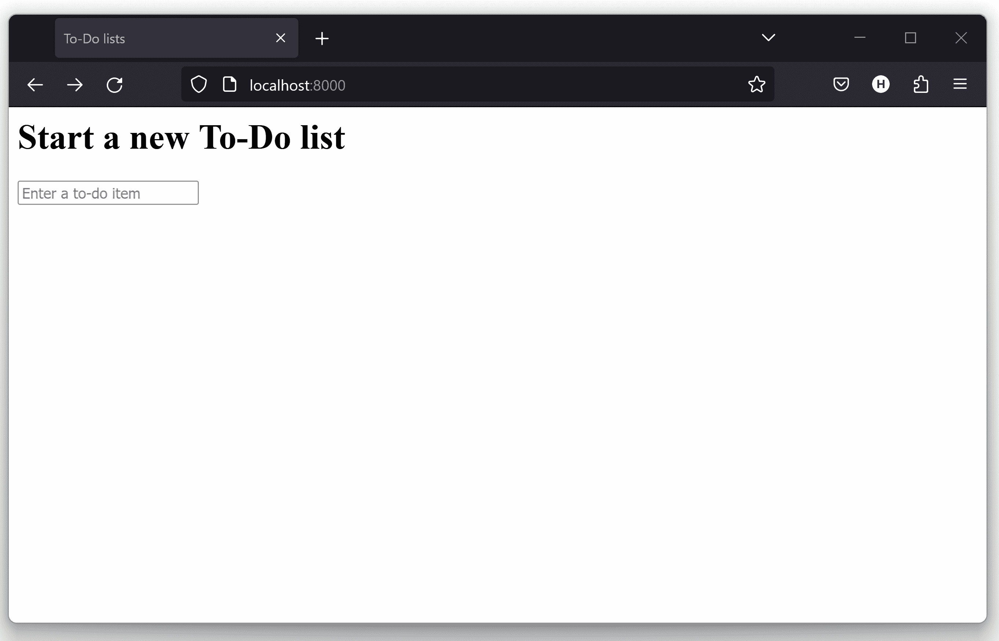
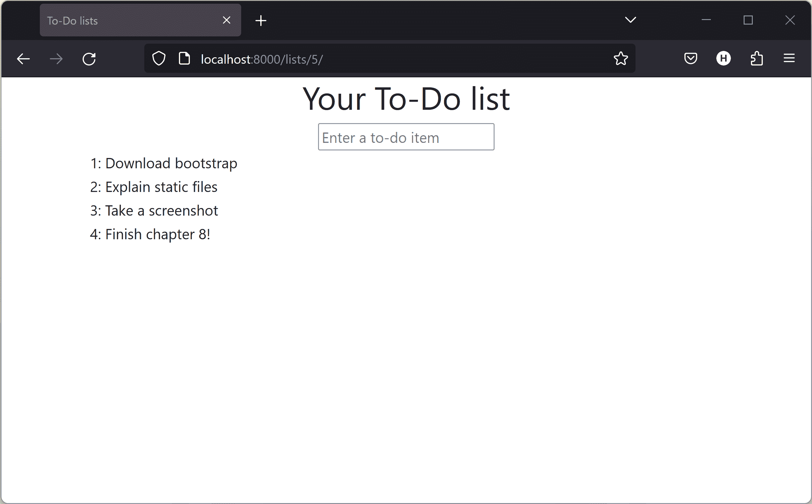
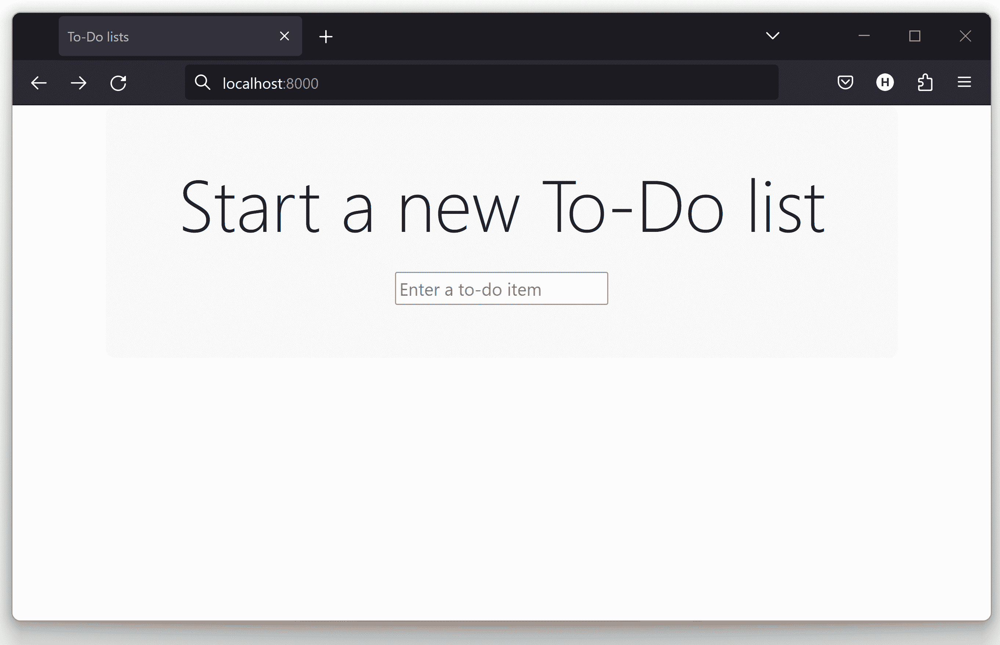
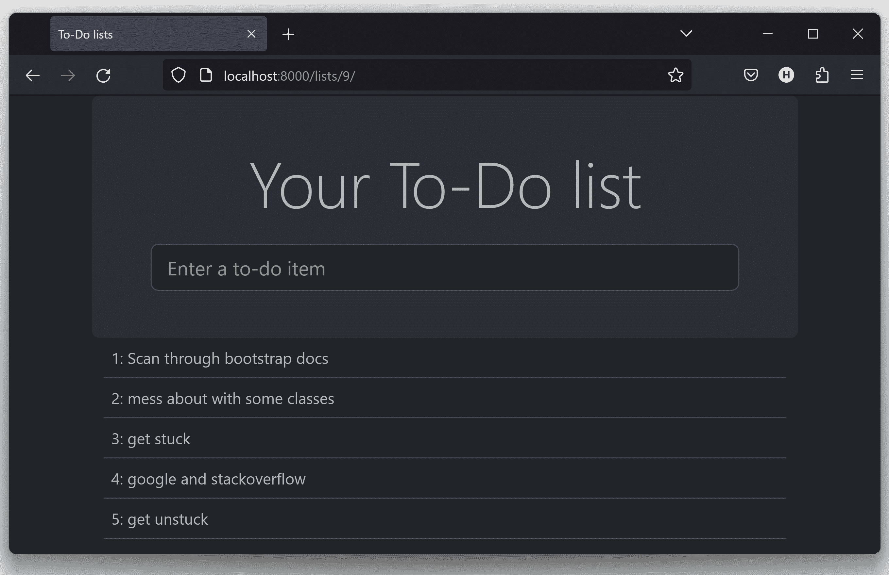
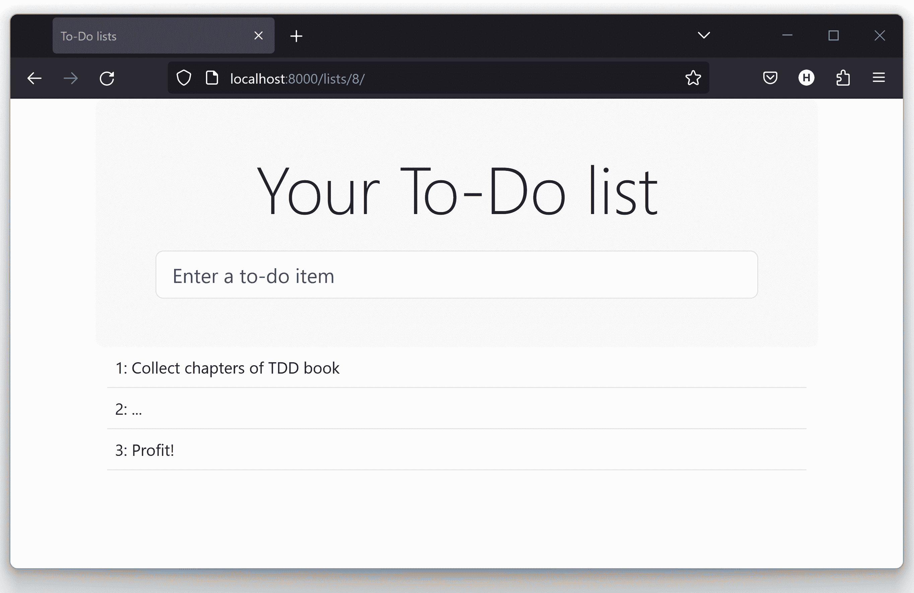

# 第八章。美化：布局和样式，以及需要测试的内容

我们开始考虑发布我们网站的第一个版本，但目前它看起来有点丑。在本章中，我们将涵盖一些基本的样式内容，包括集成一个名为 Bootstrap 的 HTML/CSS 框架。我们将学习静态文件在 Django 中的工作原理，以及我们需要测试的内容。

# 测试布局和样式

目前我们的网站确实有点不太吸引人（Figure 8-1）。

###### 注意

如果您使用 `manage.py runserver` 启动开发服务器，可能会遇到数据库错误“表 lists_item 没有名为 list_id 的列”。您需要更新本地数据库以反映我们在 *models.py* 中所做的更改。使用 `manage.py migrate`。如果出现 `IntegrityErrors` 的问题，只需删除数据库文件¹ 然后重试。

我们不能再让 Python 因为丑陋而声名狼藉了（[ugly](http://grokcode.com/746/dear-python-why-are-you-so-ugly/)），所以让我们稍微进行一些修饰。以下是一些我们可能需要的事项：

+   一个漂亮的大输入字段，用于添加新的和现有的列表

+   一个大的、引人注目的、居中的框来放置它

如何将 TDD 应用于这些内容？大多数人会告诉你不应该测试美学，他们是对的。这有点像测试常量，通常测试不会增加任何价值。



###### 图 8-1。我们的主页，看起来有点丑…​

但是我们可以测试我们美学的基本*行为*，也就是我们是否有任何美学。我们只想要确认事物是否工作。例如，我们将使用层叠样式表（CSS）进行样式设置，它们作为静态文件加载。静态文件配置可能有些棘手（特别是当您从自己的计算机移动到托管网站时，后面我们会看到），因此我们需要一种简单的“烟雾测试”，来确认 CSS 已加载。我们不必测试字体和颜色以及每一个像素，但我们可以快速检查每个页面上主输入框的对齐方式，这将使我们确信页面的其余样式也已加载。

让我们在我们的功能测试中添加一个新的测试方法：

functional_tests/tests.py（ch08l001）

```py
class NewVisitorTest(LiveServerTestCase):
    [...]

    def test_layout_and_styling(self):
        # Edith goes to the home page,
        self.browser.get(self.live_server_url)

        # Her browser window is set to a very specific size
        self.browser.set_window_size(1024, 768)

        # She notices the input box is nicely centered
        inputbox = self.browser.find_element(By.ID, "id_new_item")
        self.assertAlmostEqual(
            inputbox.location["x"] + inputbox.size["width"] / 2,
            512,
            delta=10,
        )
```

一些新的内容在这里。我们首先将窗口大小设置为固定大小。然后找到输入元素，查看其大小和位置，并进行一些数学计算，检查它是否似乎位于页面的中间。`assertAlmostEqual` 帮助我们处理由于滚动条等因素导致的四舍五入错误和偶尔的怪异行为，通过让我们指定我们希望我们的算术工作在加减 10 像素的范围内。

如果我们运行功能测试，我们会得到：

```py
$ python manage.py test functional_tests
[...]
.F.
======================================================================
FAIL: test_layout_and_styling
(functional_tests.tests.NewVisitorTest.test_layout_and_styling)
 ---------------------------------------------------------------------
Traceback (most recent call last):
  File "...goat-book/functional_tests/tests.py", line 120, in
test_layout_and_styling
    self.assertAlmostEqual(
AssertionError: 103.333... != 512 within 10 delta (408.666...
difference)

 ---------------------------------------------------------------------
Ran 3 tests in 9.188s

FAILED (failures=1)
```

这就是预期的失败。尽管如此，这种 FT 很容易出错，所以让我们使用一个快速而肮脏的“作弊”解决方案，来检查当输入框居中时 FT 是否确实通过。我们用它来检查 FT 后，几乎立刻会删除这段代码：

lists/templates/home.xhtml (ch08l002)

```py
<form method="POST" action="/lists/new">
  <p style="text-align: center;">
    <input name="item_text" id="id_new_item" placeholder="Enter a to-do item" />
  </p>
  
</form>
```

通过了测试，这意味着 FT 起作用了。让我们扩展一下，确保输入框在页面上也是居中对齐的：

functional_tests/tests.py (ch08l003)

```py
    # She starts a new list and sees the input is nicely
    # centered there too
    inputbox.send_keys("testing")
    inputbox.send_keys(Keys.ENTER)
    self.wait_for_row_in_list_table("1: testing")
    inputbox = self.browser.find_element(By.ID, "id_new_item")
    self.assertAlmostEqual(
        inputbox.location["x"] + inputbox.size["width"] / 2,
        512,
        delta=10,
    )
```

这给我们带来了另一个测试失败：

```py
  File "...goat-book/functional_tests/tests.py", line 132, in
test_layout_and_styling
    self.assertAlmostEqual(
AssertionError: 103.333... != 512 within 10 delta (408.666...
```

让我们仅提交 FT：

```py
$ git add functional_tests/tests.py
$ git commit -m "first steps of FT for layout + styling"
```

现在感觉我们有理由为网站的一些更好的样式需求找到一个“合适的”解决方案。我们可以撤销我们的 hacky `text-align: center`：

```py
$ git reset --hard
```

警告：`git reset --hard`是“从轨道上射出导弹”Git 命令，所以要小心——它会清除掉你所有未提交的更改。与 Git 的几乎所有其他操作不同，这个操作后没有回头的余地。

# 美化：使用 CSS 框架

UI 设计很难，特别是现在我们必须处理移动设备、平板等。这就是为什么许多程序员，特别是像我这样的懒人，转向 CSS 框架来解决其中的一些问题。市面上有很多框架可供选择，但最早也是最流行的之一，是 Twitter 的 Bootstrap。让我们来使用它吧。

你可以在[*http://getbootstrap.com/*](http://getbootstrap.com/)找到 Bootstrap。

我们将下载它并放入名为*static*的新文件夹中，放在`lists`应用程序内：²

```py
$ wget -O bootstrap.zip https://github.com/twbs/bootstrap/releases/download/\
v5.3.0/bootstrap-5.3.0-dist.zip
$ unzip bootstrap.zip
$ mkdir lists/static
$ mv bootstrap-5.3.0-dist lists/static/bootstrap
$ rm bootstrap.zip
```

Bootstrap 在*dist*文件夹中提供了一个简单的未自定义安装。暂时我们会使用它，但是在真正的网站上你应该尽量避免这样做——原版的 Bootstrap 非常容易识别，对任何了解情况的人来说都是一个明显的信号，表明你懒得为你的网站定制样式。学习如何使用 Sass 并更改字体，这是必须的！Bootstrap 的文档中有相关信息，或者在[*https://www.freecodecamp.org/news/how-to-customize-bootstrap-with-sass/*](https://www.freecodecamp.org/news/how-to-customize-bootstrap-with-sass/) [介绍指南]中也能找到。

我们的*lists*文件夹最终会变成这个样子：

```py
$ tree lists
lists
├── __init__.py
├── admin.py
├── apps.py
├── migrations
│   ├── [...]
├── models.py
├── static
│   └── bootstrap
│       ├── css
│       │   ├── bootstrap.css
│       │   ├── bootstrap.css.map
│       │   ├── [...]
│       │   └── bootstrap-utilities.rtl.min.css.map
│       └── js
│           ├── bootstrap.bundle.js
│           ├── bootstrap.bundle.js.map
│           ├── [...]
│           └── bootstrap.min.js.map
├── templates
│   ├── home.xhtml
│   └── list.xhtml
├── [...]
```

查看[Bootstrap 文档](https://getbootstrap.com/docs/5.3/getting-started/introduction/)的“入门”部分；你会看到它希望我们的 HTML 模板包含类似这样的内容：

```py
<!doctype html>
<html lang="en">
  <head>
    <meta charset="utf-8">
    <meta name="viewport" content="width=device-width, initial-scale=1">
    <title>Bootstrap demo</title>
  </head>
  <body>
    <h1>Hello, world!</h1>
  </body>
</html>
```

我们已经有了两个 HTML 模板。我们不想在每个模板中添加大量的样板代码，现在是应用“不要重复自己”规则的合适时机，把所有共同的部分合并起来。幸运的是，Django 模板语言通过使用称为模板继承的功能使这一切变得很容易。

# Django 模板继承

让我们来小结一下*home.xhtml*和*list.xhtml*之间的区别：

```py
$ diff lists/templates/home.xhtml lists/templates/list.xhtml
<     <h1>Start a new To-Do list</h1>
<     <form method="POST" action="/lists/new">
---
>     <h1>Your To-Do list</h1>
>     <form method="POST" action="/lists/{{ list.id }}/add_item">
[...]
>     <table id="id_list_table">
>       
>         <tr><td>{{ forloop.counter }}: {{ item.text }}</td></tr>
>       
>     </table>
```

它们有不同的标题文本，它们的表单使用不同的 URL。此外，*list.xhtml*还有额外的`<table>`元素。

现在我们清楚了共同点和不同点，我们可以让这两个模板继承自一个共同的“超类”模板。我们将从制作*list.xhtml*的副本开始：

```py
$ cp lists/templates/list.xhtml lists/templates/base.xhtml
```

我们将其制作成一个基本模板，仅包含常见的样板内容，并标出“块”，即子模板可以自定义的地方：

lists/templates/base.xhtml (ch08l007)

```py
<html>
  <head>
    <title>To-Do lists</title>
  </head>

  <body>
    <h1></h1>

    <form method="POST" action="">
      <input name="item_text" id="id_new_item" placeholder="Enter a to-do item" />
      
    </form>

    
    
  </body>

</html>
```

基本模板定义了一系列称为“块”的区域，这些区域将是其他模板可以连接并添加其自己内容的地方。让我们看看在实践中如何工作，通过修改*home.xhtml*，使其“继承自”*base.xhtml*：

lists/templates/home.xhtml (ch08l008)

```py


Start a new To-Do list

/lists/new
```

您可以看到大量的样板 HTML 消失了，我们只专注于想要自定义的部分。我们对*list.xhtml*也采取同样的做法：

lists/templates/list.xhtml (ch08l009)

```py


Your To-Do list

/lists/{{ list.id }}/add_item


  <table id="id_list_table">
    
      <tr><td>{{ forloop.counter }}: {{ item.text }}</td></tr>
    
  </table>

```

这是我们模板工作方式的重构。我们重新运行 FT 来确保我们没有破坏任何东西…​

```py
AssertionError: 103.333... != 512 within 10 delta (408.666...
```

毫无疑问，他们仍然达到了之前的目标。这值得提交：

```py
$ git diff -w
# the -w means ignore whitespace, useful since we've changed some html indenting
$ git status
$ git add lists/templates # leave static, for now
$ git commit -m "refactor templates to use a base template"
```

# 集成 Bootstrap

现在更容易集成 Bootstrap 想要的样板代码—​我们暂时不加入 JavaScript，只加入 CSS：

lists/templates/base.xhtml (ch08l010)

```py
<!doctype html>
<html lang="en">

  <head>
    <title>To-Do lists</title>
    <meta charset="utf-8">
    <meta name="viewport" content="width=device-width, initial-scale=1">
    <link href="css/bootstrap.min.css" rel="stylesheet">
  </head>
[...]
```

## 行和列

最后，让我们实际使用一些 Bootstrap 魔法！您将不得不自己阅读文档，但我们应该能够使用网格系统和`justify-content-center`类的组合来实现我们想要的效果：

lists/templates/base.xhtml (ch08l011)

```py
  <body>
    <div class="container">

      <div class="row justify-content-center">
        <div class="col-lg-6 text-center">
          <h1></h1>

          <form method="POST" action="" >
            <input
              name="item_text"
              id="id_new_item"
              placeholder="Enter a to-do item"
            />
            
          </form>
        </div>
      </div>

      <div class="row justify-content-center">
        <div class="col-lg-6">
          
          
        </div>
      </div>

    </div>
  </body>
```

（如果你从未见过 HTML 标签跨越多行，那么`<input>`可能有点让人吃惊。它肯定是有效的，但如果你觉得不合适，你可以选择不使用它；）

###### 提示

如果你以前从未见过，花些时间浏览一下[Bootstrap 文档](http://getbootstrap.com/)。它是一个装满了在你的网站中使用的有用工具的购物车。

这样可以吗？

```py
AssertionError: 103.333... != 512 within 10 delta (408.666...
```

嗯。不对。为什么我们的 CSS 没有加载？

# Django 中的静态文件

Django，以及任何 Web 服务器，需要知道处理静态文件的两个内容：

1.  如何区分 URL 请求是静态文件，还是通过视图函数提供的 HTML

1.  用户想要的静态文件在哪里找

换句话说，静态文件是从 URL 到磁盘文件的映射。

对于项目 1，Django 允许我们定义一个 URL“前缀”，以表示任何以该前缀开头的 URL 都应被视为静态文件请求。默认情况下，前缀是*/static/*。它在*settings.py*中定义：

superlists/settings.py

```py
[...]

# Static files (CSS, JavaScript, Images)
# https://docs.djangoproject.com/en/4.2/howto/static-files/

STATIC_URL = "static/"
```

我们将在本节中添加的其余设置，都是关于项目 2：找到实际静态文件在磁盘上的位置。

当我们使用 Django 开发服务器（`manage.py runserver`）时，我们可以依赖 Django 自动为我们找到静态文件—​它只会查找我们应用程序的任何子文件夹中名为*static*的文件夹。

现在你看到为什么我们把所有的 Bootstrap 静态文件放到*lists/static*中了。那么为什么它们现在不起作用呢？因为我们没有使用`/static/` URL 前缀。再看一下*base.xhtml*中 CSS 的链接：

```py
    <link href="css/bootstrap.min.css" rel="stylesheet">
```

那个`href`只是碰巧在 bootstrap 文档中出现的。为了让它工作，我们需要将其更改为：

lists/templates/base.xhtml（ch08l012）

```py
    <link href="/static/bootstrap/css/bootstrap.min.css" rel="stylesheet">
```

现在，当`runserver`接收到请求时，它知道这是一个静态文件，因为请求以`/static/`开头。然后它尝试在每个应用程序文件夹的名为*static*的子文件夹中查找名为*bootstrap/css/bootstrap.min.css*的文件，它应该能在*lists/static/bootstrap/css/bootstrap.min.css*找到它。

因此，如果您手动查看，您应该能看到它正常工作，如图 8-2 所示（#list-page-centered）。



###### 图 8-2\. 我们的网站开始看起来好多了…​

## 切换到 StaticLiveServerTestCase

如果你运行功能测试，令人恼火的是，它仍然无法通过：

```py
AssertionError: 103.333... != 512 within 10 delta (408.666...
```

这是因为，虽然`runserver`自动找到静态文件，`LiveServerTestCase`却没有。但别担心：Django 开发人员已经制作了一个更神奇的测试类叫做`StaticLiveServerTestCase`（参见[文档](https://docs.djangoproject.com/en/4.2/topics/testing/tools/#liveservertestcase)）。

让我们切换到那个：

functional_tests/tests.py（ch08l013）

```py
@@ -1,14 +1,14 @@
-from django.test import LiveServerTestCase
+from django.contrib.staticfiles.testing import StaticLiveServerTestCase
 from selenium import webdriver
 from selenium.common.exceptions import WebDriverException
 from selenium.webdriver.common.keys import Keys
 import time

 MAX_WAIT = 10

-class NewVisitorTest(LiveServerTestCase):
+class NewVisitorTest(StaticLiveServerTestCase):

     def setUp(self):
```

现在它将找到新的 CSS，这将使我们的测试通过：

```py
$ python manage.py test functional_tests
Creating test database for alias 'default'...
...
 ---------------------------------------------------------------------
Ran 3 tests in 9.764s
```

万岁！

# 使用 Bootstrap 组件来改善网站的外观

让我们看看是否可以更进一步，利用 Bootstrap 全套工具中的一些其他工具。

## jumbotron！

Bootstrap 的第一个版本曾经附带一个名为`jumbotron`的类，用于突出显示页面上特别重要的内容。它已经不存在了，但像我这样的老手仍然对它念念不忘，因此他们在文档中有一个专门的页面告诉你如何重新创建它。

本质上，我们大幅增大了主页面的页头和输入表单，将其放入一个带有漂亮圆角的灰色框中：

lists/templates/base.xhtml（ch08l014）

```py
  <body>
    <div class="container">

      <div class="row justify-content-center p-5 bg-body-tertiary rounded-3">
        <div class="col-lg-6 text-center">
          <h1 class="display-1 mb-4"></h1>
          [...]
```

这最终看起来像是图 8-3：



###### 图 8-3\. 页面顶部的大灰色框

###### 提示

当进行设计和布局时，最好有一个可以频繁刷新的窗口。使用`python manage.py runserver`启动开发服务器，然后浏览至[*http://localhost:8000*](http://localhost:8000)来查看您的工作进展。

## 大型输入

jumbotron 是一个不错的开始，但现在输入框的文本与其他内容相比太小了。幸运的是，Bootstrap 的表单控制类提供了将输入框设置为“大号”的选项：

lists/templates/base.xhtml（ch08l015）

```py
    <input
      class="form-control form-control-lg"
      name="item_text"
      id="id_new_item"
      placeholder="Enter a to-do item"
    />
```

## 表格样式

相对于页面的其他部分，表格文本看起来也太小了。在*list.xhtml*中添加 Bootstrap 的`table`类可以改善这一点：

lists/templates/list.xhtml (ch08l016)

```py
  <table class="table" id="id_list_table">
```

## 黑暗模式啊啊啊啊啊

与我对 Jumbotron 的怀旧不同，这里是相对于 Bootstrap 相对较新的东西，即黑暗模式！

lists/templates/base.xhtml (ch08l017)

```py
<!doctype html>
<html lang="en" data-bs-theme="dark">
```

看一下图 8-4。我觉得那看起来很棒！



###### 图 8-4\. 列表页面变暗

但这在很大程度上是个人偏好的问题，如果我让我所有的其他截图都用上这么多的墨水，我的编辑器会杀了我，所以我现在要回退它。如果你喜欢，你可以保留它！

## 一个半体面的页面

我试了几次，但现在我对它还算满意（参见图 8-5）。



###### 图 8-5\. 列表页面，现在看起来还不错…​

如果你想进一步定制 Bootstrap，你需要深入了解编译 Sass。我已经说过了，但我 *绝对* 推荐有一天花时间去做这件事。Sass/SCSS 对于普通的 CSS 是一个很大的改进，即使你不使用 Bootstrap，它也是一个很有用的工具。

最后运行一下功能测试，看看是否一切都还正常：

```py
$ python manage.py test functional_tests
[...]
...
 ---------------------------------------------------------------------
Ran 3 tests in 10.084s

OK
```

就这样了！绝对是提交的时候了：

```py
$ git status # changes tests.py, base.xhtml, list.xhtml, settings.py, + untracked lists/static
$ git add .
$ git status # will now show all the bootstrap additions
$ git commit -m "Use Bootstrap to improve layout"
```

# 我们忽略的内容：collectstatic 和其他静态目录

我们之前看到 Django 开发服务器会自动找到应用文件夹中的所有静态文件，并为您提供服务。这在开发过程中是可以的，但当你在真实的 Web 服务器上运行时，你不希望 Django 为您提供静态内容——使用 Python 来提供原始文件是慢而低效的，像 Apache 或 Nginx 这样的 Web 服务器可以为您完成这一切。您甚至可以决定将所有的静态文件上传到 CDN，而不是自己托管它们。

出于这些原因，你希望能够从各个应用文件夹中收集起所有的静态文件，并将它们复制到一个单一的位置，以备部署使用。这就是 `collectstatic` 命令的作用。

目的地，即收集到的静态文件所在的位置，是在 *settings.py* 中定义的 `STATIC_ROOT`。在下一章中，我们将进行一些部署工作，所以现在让我们实验一下。一个常见且简单的放置位置是在我们的 repo 根目录中的一个名为“static”的文件夹中：

```py
.
├── db.sqlite3
├── functional_tests/
├── lists/
├── manage.py
├── static/
└── superlists/
```

这是指定该文件夹的一个简洁的方法，使其相对于项目基本目录的位置：

superlists/settings.py (ch08l019)

```py
# Static files (CSS, JavaScript, Images)
# https://docs.djangoproject.com/en/4.2/howto/static-files/

STATIC_URL = "static/"
STATIC_ROOT = BASE_DIR / "static"
```

查看设置文件的顶部，你会看到 `BASE_DIR` 变量是如何用 `pathlib.Path` 和 `__file__`（都是 Python 的很好的内置函数）来定义的（参见 3）。

无论如何，让我们试着运行 `collectstatic`：

```py
$ python manage.py collectstatic

169 static files copied to '...goat-book/static'.
```

如果我们查看 *./static*，我们会发现所有的 CSS 文件：

```py
$ tree -v static/
static/
├── admin
│   ├── css
│   │   ├── autocomplete.css
│   │   ├── [...]
[...]
│               └── xregexp.min.js
└── bootstrap
    ├── css
    │   ├── bootstrap-grid.css
    │   ├── [...]
    │   └── bootstrap.rtl.min.css.map
    └── js
        ├── bootstrap.bundle.js
        ├── [...]
        └── bootstrap.min.js.map

16 directories, 169 files
```

`collectstatic` 还找到了所有用于管理站点的 CSS。管理站点是 Django 的一个强大功能，但是对于我们简单的站点来说，我们不需要它，所以现在让我们将其禁用：

superlists/settings.py

```py
INSTALLED_APPS = [
    # "django.contrib.admin",
    "django.contrib.auth",
    "django.contrib.contenttypes",
    "django.contrib.sessions",
    "django.contrib.messages",
    "django.contrib.staticfiles",
    "lists",
]
```

我们再试一次：

```py
$ rm -rf static/
$ python manage.py collectstatic

44 static files copied to '...goat-book/static'.
```

很好。

现在我们知道如何将所有静态文件收集到一个文件夹中，这样 Web 服务器就可以轻松找到它们。我们将在下一章中详细了解所有这些，包括如何测试它！

现在让我们保存对 *settings.py* 的更改。我们还将顶级 static 文件夹添加到 gitignore 中，因为它只包含我们实际保留在各个应用程序的 static 文件夹中的文件的副本。

```py
$ git diff # should show changes in settings.py plus the new directory*
$ echo /static >> .gitignore
$ git commit -am "set STATIC_ROOT in settings and disable admin"
```

# 未被采纳的一些事情

不可避免地，这只是对样式和 CSS 的一个快速浏览，有几个我考虑过要涵盖但最终没有涵盖的主题。以下是一些进一步研究的候选课题：

+   `` 模板标签，实现更干净的代码和少量硬编码的 URL

+   客户端打包工具，如 `npm` 和 `bower`

+   再次，使用 SASS 自定义 bootstrap

¹ 什么？删除数据库？你疯了吗？并非完全如此。本地开发数据库经常与其迁移不同步，因为我们在开发过程中来来回回，而且里面没有任何重要数据，所以偶尔清理一下是可以的。一旦我们在服务器上有了“生产”数据库，我们会更加小心谨慎。更多信息请参见[待添加链接]。

² 在 Windows 上，你可能没有 `wget` 和 `unzip`，但我相信你可以想办法下载 Bootstrap，解压缩并将 *dist* 文件夹的内容放入 *lists/static/bootstrap* 文件夹中。

³ 注意在 `Pathlib` 处理 `__file__` 时，`.resolve()` 是发生在任何其他操作之前的。在处理 `__file__` 时，始终遵循这种模式，否则可能会看到依赖于文件被如何导入的不可预测行为。感谢 [Green Nathan](https://github.com/CleanCut/green) 提供的建议！

# 作者简介

在度过了与 BASIC 玩耍的宁静童年后，使用过像 Thomson T-07 这样的法国 8 位计算机，按下键盘按键时会发出“boop”声音，Harry 在经历了对经济学和管理咨询深感不满的几年后，重新发现了自己真正的极客本性，并有幸加入了一群 XP 狂热者，共同开发了开创性但遗憾关闭的 Resolver One 电子表格软件。他现在在 PythonAnywhere LLP 工作，并在全球的演讲、研讨会和会议上传播 TDD 的福音，怀着一颗新近皈依者的激情和热情。
